# Chapter 17 | Transactions

## Transaction Concept

A transaction is a unit of program execution that accesses and possibly updates various data items.

E.g. transaction to transfer $50 from account A to account B:

In **SQL**:

```sql
update account set balance=balance-50 
                where account_number=A;
update account set balance=balance+50 
                where account_number=B;
commit;
```

Two main issues to deal with:

1. Failures of various kinds, such as hardware failures and system crashes
2. Concurrent execution of multiple transactions

---

## ACID Properties

完整地描述事务的执行，需要满足 ACID 四个特性：

1. **Atomicity**（原子性）. Either all operations of the transaction are properly reflected in the database or none are.

事务是一个不可分割的操作单元，要么全部执行成功，要么全部失败回滚。不允许部分执行的情况。

2. **Consistency**（一致性）. Execution of a transaction in isolation preserves the consistency of the database.

事务执行前后，数据库必须保持一致性状态（即满足预定义的规则和约束）。例如，转账操作前后，账户总金额应保持不变。

3. **Isolation**（隔离性）. Although multiple transactions may execute concurrently, each transaction must be unaware of other concurrently executing transactions. Intermediate transaction results must be hidden from other 
concurrently executed transactions. 

That is, for every pair of transactions $T_i$ and $T_j$ , it appears to $T_i$ that either  $T_j$ finished execution before $T_i$ started, or $T_j$ started execution after $T_i$ finished.

多个并发事务执行时，彼此互不干扰，每个事务感觉不到其他事务同时在运行。通过隔离级别（如读未提交、读已提交等）控制可见性。

4. **Durability**（持久性）. After a transaction completes successfully, the changes it has made to the database persist, even if there are system failures.

事务一旦提交，其对数据库的修改就是永久性的，即使系统故障（如断电）也不会丢失。

??? note "为什么断电可能影响持久性？"
    **WAL**（Write-Ahead Logging）: 在修改数据之前，数据库会先将变更记录写入日志（顺序写入），再写入实际数据文件（可能随机写入）。这样即使系统崩溃，也能通过日志恢复数据，确保持久性（Durability）。

    **LSM-Tree**（Log-Structured Merge-Tree）: 数据写入时 先追加到内存（MemTable），再顺序写入磁盘（SSTable），避免随机写入。读取时可能需要合并多个 SSTable，但写入性能极高。

---

## A Simple Transaction Model

Transactions access data using two operations:

- read(X), which transfers the data item X from the database to a variable, also called X， in a work area in main memory belonging to the transaction that executed the read operation.
- write(X), which transfers the value in the variable X in the main memory work area of the transaction that executed the write operation to the datat item X in database.

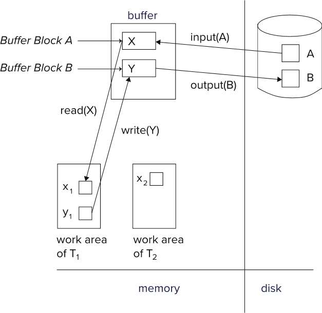

---

### Example of Fund Transfer

Transaction to transfer $50 from account A to account B:

1. read(A)
2. A := A – 50
3. write(A)
---------------------
4. read(B)
5. B := B + 50
6. write(B)

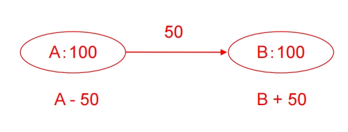

**Atomicity requirement** —— if the transaction fails after step 3 and before step 6, money will be "lost" leading to an inconsistent database state

- Failure could be due to software or hardware

the system should ensure that updates of a partially executed transaction are not reflected in the database

**Durability requirement** — once the user has been notified that the transaction has completed (i.e., the transfer of the $50 has taken place), the updates to the database by the transaction must persist even if there are software or hardware failures.

**Consistency requirement** in above example: the sum of A and B is unchanged by the execution of the transaction

In general, consistency requirements include:

数据库的一致性不仅限于简单的数值关系，还包括以下两类约束：

- Explicitly（显式） specified integrity constraints : primary keys , foreign keys

由数据库 schema 明确定义，系统自动强制执行，例如：

1. **主键**（Primary Key）：值必须唯一且非空。
2. **外键**（Foreign Key）：引用的值必须在另一表中存在。
3. `CHECK` **约束**：如 余额 >= 0。

- Implicit （隐式） integrity constraints, e.g. : sum of balances of all accounts minus sum of loan amounts must equal value of cash-in-hand

由业务逻辑决定，需通过事务代码保证，例如：

1. "现金-账户-贷款"平衡：所有账户余额总和 - 贷款总额 = 现金持有量。
2. 库存与订单匹配：已售商品数 ≤ 库存总数。

A transaction must see a consistent database.

During transaction execution the database may be temporarily inconsistent.

临时不一致是允许的：事务执行过程中可能短暂违反约束（如转账时 A 已扣款但 B 未到账）。

When the transaction completes successfully the database must be consistent. Erroneous transaction logic can lead to inconsistency

事务提交时，所有约束必须被满足。错误逻辑导致不一致，如果事务代码本身有 bug（例如漏写 write(B)），即使事务成功提交，也会破坏一致性。此时需通过**应用层校验**或**触发器**（Triggers）额外保障。

**Isolation requirement** — if between steps 3 and 6, another transaction T2 is allowed to access the partially updated database, it will see an inconsistent database (the sum A + B will be less than it should be).

在银行转账的例子中：  

1. 事务 T1 执行：

   - `read(A)`, A=100 → `A := A - 50` → `write(A)`, A=50  
   - **此时事务 T1 还未执行 `write(B)`**（B 仍为 200）。
   
2. 若另一个事务 T2 在此时读取 A 和 B：

   - T2 看到 A=50, B=200 → **A + B = 250 ≠ 初始值 300**（不一致状态）。  

这种问题称为 **脏读（Dirty Read）**，即事务读到了其他事务未提交的中间结果，破坏了数据一致性。  

隔离性要求：

- **并发执行的事务必须表现得像串行执行（Serial Execution）一样**，即每个事务在执行期间看不到其他事务的中间状态。  
- 解决方案：

  - **完全串行化**：事务一个接一个执行（简单但性能差）。  
  - **并发控制技术**（如锁、多版本控制）：在保证隔离性的同时提升性能。  

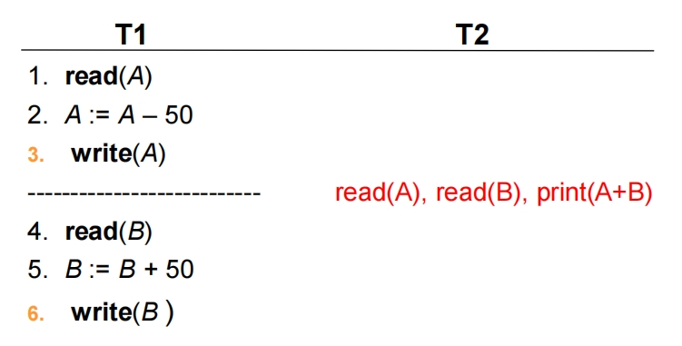

Isolation can be ensured trivially by running transactions **serially**（串行）, that is, one after the other.

However, executing multiple transactions concurrently has significant benefits, as we will see later.

尽管串行执行能保证隔离性，但实际场景中 **并发（Concurrency）是必须的**，原因包括：  
- **提高吞吐量**：避免 CPU 和磁盘 I/O 空闲。  
- **减少延迟**：短事务无需等待长事务完成。  
- **用户体验**：支持多用户同时操作（如银行系统、电商秒杀）。

---

## Transaction State

A transaction must be in one of the following states:

1. **Active** – the initial state; the transaction stays in this state while it is executing

初始状态，事务开始执行 `read/write` 操作。

2. **Partially committed** – after the final statement has been executed.

最终语句执行完成，但尚未确认是否成功提交。此时系统会检查是否满足一致性（如 `A + B` 总和是否正确）和持久性（日志是否落盘）。

3. **Failed** -- after the discovery that normal execution can no longer proceed.

发现无法继续正常执行（如违反约束、系统崩溃、死锁）。

4. **Aborted** – after the transaction has been rolled back and the database restored to its state prior to the start of the transaction. 

事务已回滚，数据库恢复到事务开始前的状态。

Two options after it has been aborted:

- restart the transaction 重新执行事务（适用于临时错误，如死锁）。
- kill the transaction 直接放弃事务（适用于逻辑错误，如余额不足）。

5. **Committed** – after successful completion.

成功完成，所有修改永久生效，其他事务可见。

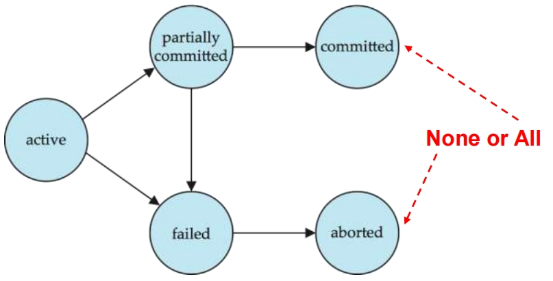

```plaintext
Active → Partially Committed → Committed
  ↓
Failed → Aborted
  ↓
Restart (回到 Active) 或 Kill
```

---

## Concurrent Executions

Multiple transactions are allowed to run concurrently in the system.

Advantages are:

**increased processor and disk utilization**, leading to better transaction throughput

- E.g. one transaction can be using the CPU while another is reading from or writing to the disk

**reduced average response time** for transactions: short transactions need not wait behind long ones.

允许多个事务同时运行，主要为了提升性能：

1. **提高资源利用率** CPU 和磁盘并行工作：当一个事务在等待 I/O（如磁盘读写）时，另一个事务可以使用 CPU。
2. **减少平均响应时间** 短事务无需等待长事务可以避免短事务被长事务阻塞。

---

## Anomalies in Concurrent Executions

并发引发的问题（Anomalies）若不加以控制，并发会导致以下异常：

- Lost Update（丢失修改）
- Dirty Read（读脏数据）
- Unrepeatable Read （不可重复读）
- Phantom Problem（幽灵问题 ）

---

### Lost Update(丢失修改)

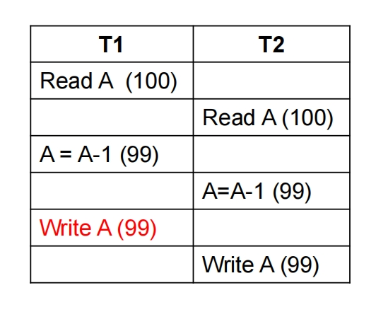

- 丢失修改（Lost Update）两个事务同时修改同一数据，后提交的事务覆盖前一个事务的修改。

---

### Dirty Read(读脏数据)

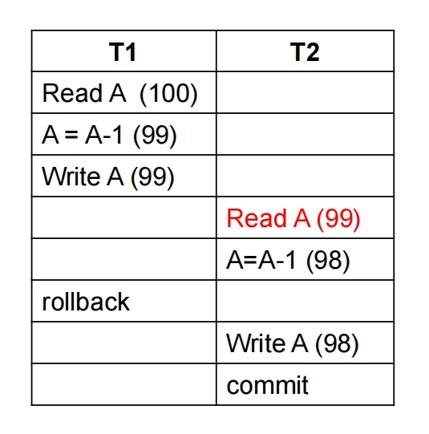

- 脏读（Dirty Read）事务读取了其他事务**未提交**的中间数据。

---

### Unrepeatable Read(不可重复读)

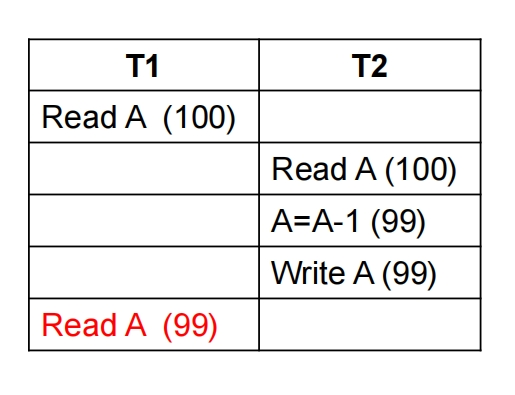

- 不可重复读（Unrepeatable Read）同一事务内多次读取同一数据，结果不同（因其他事务修改了数据）。

---

### Phantom Problem(幽灵问题)

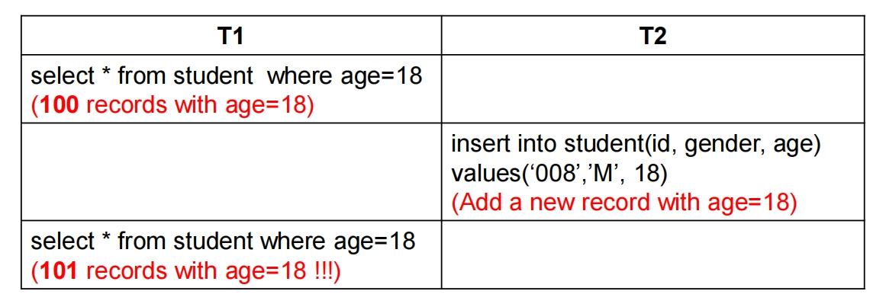

- 幻读（Phantom Problem）同一事务内多次执行相同查询，返回的行数不同（因其他事务插入/删除了数据）。

---

## Schedules

Schedule – a sequences of instructions that specify the chronological order in which instructions of concurrent transactions are executed

- a schedule for a set of transactions must consist of all instructions of those transactions
- must preserve the order in which the instructions appear in each individual transaction.

A transaction that successfully completes its execution will have a **commit** instructions as the last statement, by default transaction assumed to execute commit instruction as its last step

A transaction that fails to successfully complete its execution will have an **abort** instruction as the last statement

调度（Schedule）是**多个并发事务的操作按时间顺序排列的执行序列**。它必须满足：

1. **包含性**：包含所有相关事务的全部操作（如 `read`, `write`, `commit`, `abort`）。
2. **顺序保持性**：每个事务内部的操作顺序必须保持不变。  

**示例**（两个事务 T1 和 T2 的调度）：

```
T1: read(A), write(A), commit  
T2: read(B), write(B), abort  
```

可能的调度：  
`read(A) → read(B) → write(A) → write(B) → commit → abort`  

**调度的关键规则**

- **成功事务**：必须以 `commit` 作为最后一条指令。默认情况下，事务的最后一个操作是 `commit`（除非显式回滚）。  
- **失败事务**：必须以 `abort` 作为最后一条指令。系统会自动回滚未提交的修改（保证原子性）。

---

### Schedule 1

Let $T_1$ transfer $50 from A to B, and $T_2$ transfer 10% of the balance from A to B. 

一个串行调度。

A serial schedule in which $T_1$ is followed by $T_2$ :

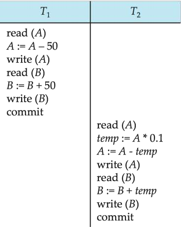

---

### Schedule 2

A serial schedule where $T_2$ is followed by $T_1$ :

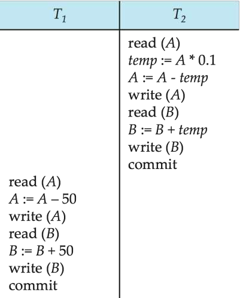

---

### Schedule 3

Let $T_1$ and $T_2$ be the transactions defined previously. The following schedule is not a serial schedule, but it is equivalent to Schedule 1.

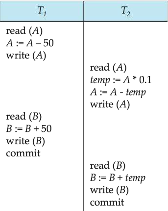

In Schedules 1, 2 and 3, the sum A + B is preserved

---

### Schedule 4

The following concurrent schedule does not preserve the value of (A + B).

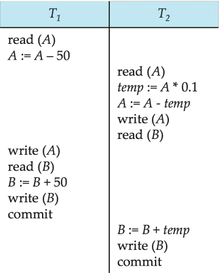

---

## Serializability(可串行化)

**Basic Assumption** – Each transaction preserves database consistency.

Thus serial execution of a set of transactions preserves database consistency.

A (possibly concurrent) schedule is serializable if it is equivalent to a serial schedule.

- **核心假设**：每个事务本身能保持数据库一致性（即单独执行时是正确的）。
- **串行调度（Serial Schedule）**：事务依次执行（如 T1 → T2 → T3），天然保证一致性，但性能低。
- **可串行化调度**：并发调度的执行结果**等价于**某种串行调度，既保持并发性能，又保证一致性。

Different forms of schedule equivalence give rise to the notions of:

- conflict serializability(冲突可串行化) 通过交换无冲突操作的顺序，将并发调度转换为串行调度。
- view serializability（视图可串行化）调度必须保证所有事务看到的"数据视图"与某种串行调度一致。包含冲突可串行化，但还允许某些特殊情况（如盲写）。

---

### Conflicting Instructions

Instructions $l_i$ and $l_j$ of transactions $T_i$ and $T_j$ respectively, conflict if and only if there exists some item Q accessed by both $l_i$ and $l_j$ , and at least one of these instructions wrote Q.

两条指令 $l_i$（来自事务 $T_i$ ）和 $l_j$（来自事务 $T_j$ ）**冲突**，当且仅当：

- 它们访问**同一个数据项 Q**；
- 且至少有一条指令是 **`write(Q)`**（写操作）。

1. $l_i$ = read(Q), $l_j$ = read(Q). $l_i$ and $l_j$ don't conflict.
2. $l_i$ = read(Q), $l_j$ = write(Q). They conflict.
3. $l_i$ = write(Q), $l_j$ = read(Q). They conflict.
4. $l_i$ = write(Q), $l_j$ = write(Q). They conflict.

| 指令组合                  | 是否冲突 | 原因                                                                 |
|:-------------------------:|:--------:|:--------------------------------------------------------------------:|
| `read(Q)` 和 `read(Q)`    | ❌ 不冲突 | 仅读取数据，不修改，顺序交换不影响结果。                             |
| `read(Q)` 和 `write(Q)`   | ✅ 冲突   | 读操作可能读到写操作前的旧值或新值，顺序不同会导致结果不同。         |
| `write(Q)` 和 `read(Q)`   | ✅ 冲突   | 读操作的结果依赖写操作的顺序（先写后读 or 先读后写？）。             |
| `write(Q)` 和 `write(Q)`  | ✅ 冲突   | 后一个写操作会覆盖前一个，顺序不同会导致最终数据不同。               |

Intuitively, a conflict between $l_i$ and $l_j$ forces a (logical) temporal order between them.

If $l_i$ and $l_j$ are consecutive in a schedule and they do not conflict, their results would remain the same even if they had been interchanged in the schedule.

如果两条指令冲突，它们在调度中的顺序必须固定（不可交换）。如果两条指令不冲突，调换顺序不会影响最终结果（为并发优化提供可能）。

---

### Conflict Serializability（冲突可串行化）

If a schedule S can be transformed into a schedule S' by a series of swaps of non-conflicting instructions, we say that S and S' are conflict equivalent.

若调度 S 能通过**交换非冲突指令的顺序**转换为调度 S'，则称 S 和 S' 是冲突等价的。仅当两条指令**不冲突**（如均为 `read` 或访问不同数据）时才能交换。  

We say that a schedule S is **conflict serializable** if it is conflict equivalent to a serial schedule.

若一个并发调度 S 冲突等价于**某个串行调度**，则称 S 是冲突可串行化的。

Schedule 3 can be transformed into Schedule 6, a serial schedule where $T_2$ follows $T_1$  by series of swaps of nonconflicting instructions. Therefore Schedule 3 is conflict serializable.

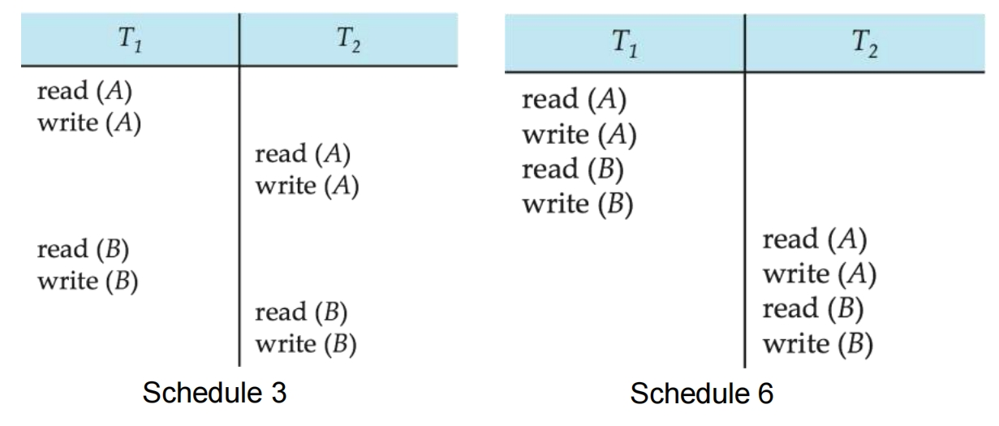

Example of a schedule that is not conflict serializable:

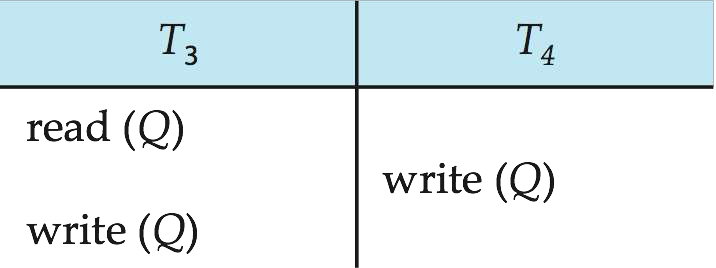

We are unable to swap instructions in the above schedule to obtain either the serial schedule < $T_3$ , $T_4$ >, or the serial schedule < $T_4$ , $T_3$ >.

---

#### Testing for Serializability

Consider some schedule of a set of transactions: $T_1$ , $T_2$ , $T_3$ , . . . , $T_n$ .

**Precedence graph**（前驱图）— a directed graph where the vertices are the transactions (names). 

- 理论上使用的。

前驱图是一个**有向图**，用于表示并发调度中事务间的冲突依赖关系：

- **顶点（Vertices）**：表示事务（如 $T_1, T_2, \dots, T_n$ ）。
- **边（Arcs）**：若事务 $T_i$ 和 $T_j$ 存在冲突操作，且 $T_i$ 的冲突操作先于 $T_j$ ，则画一条从 $T_i$ 指向 $T_j$ 的边。
- **边的标注**：可注明引发冲突的数据项（如 $X$ ）。

We draw an arc from $T_i$ to $T_j$ if the two transaction conflict, and $T_i$ accessed the data item on which the conflict arose earlier.

对于调度中的每一对冲突操作：

1. **冲突操作类型**：`read-write`、`write-read` 或 `write-write`（`read-read` 不冲突）。
2. **方向规则**：若 $T_i$ 的冲突操作在 $T_j$ 之前执行，则边为 $T_i \rightarrow T_j$ 。

We may label the arc by the item that was accessed.

Example 1

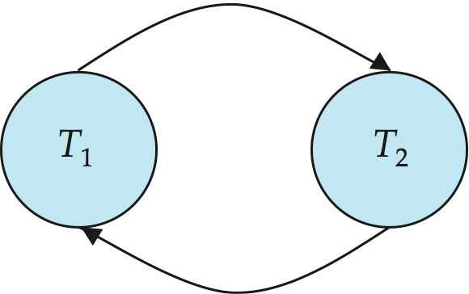

---

#### Test for Conflict Serializability

A schedule is conflict serializable if and only if its precedence graph is acyclic.

Cycle-detection algorithms exist which take order $n^2$ time, where n is the number of vertices in the graph. (Better algorithms take order n + e where e is the number of edges.)

If precedence graph is acyclic, the serializability order can be obtained by a topological sorting of the graph.

This is a linear order consistent with the partial order of the graph.

若前驱图无环，可通过**拓扑排序**得到等价的串行调度顺序,将图的顶点排成线性序列，使得所有边的方向一致。 

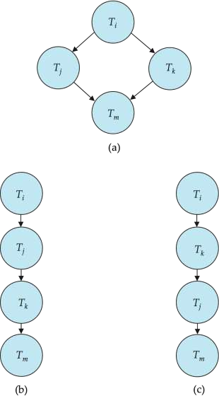

---

#### Example Schedule (Schedule A) + Precedence Graph

- 入度为 0 的拿进来，再减掉连出的点的入度。

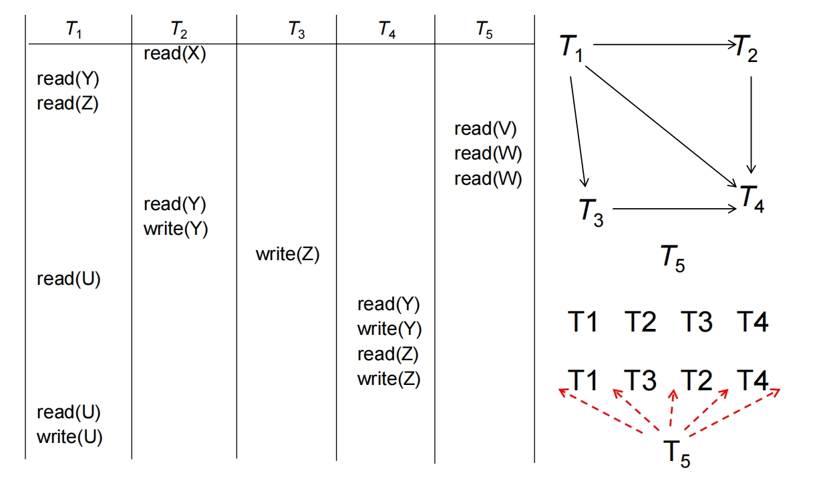

---

### View Serializability（视图可串行化）

Let S and S' be two schedules with the same set of transactions. 

S and S' are view equivalent if the following three conditions are met, for each data item Q,

1. If in schedule S, transaction $T_i$ reads the initial value of Q, then in schedule S' also transaction $T_i$ must read the initial value of Q.
2. If in schedule S transaction $T_i$ executes read(Q), and that value was produced by transaction $T_j$ (if any), then in 
schedule S' also transaction $T_i$ must read the value of Q that was produced by the same write(Q) operation of transaction  $T_j$ .
3. The transaction (if any) that performs the final write(Q) operation in schedule S must also perform the final write(Q) 
operation in schedule S'.

两个调度 S 和 S' 是**视图等价的**，当且仅当它们满足以下三个条件（对每个数据项 Q）：

1. **初始读一致性** : 若事务 $T_i$ 在 $S$ 中读取了 $Q$ 的初始值（即其他事务未修改过的值），则在 $S'$ 中 $T_i$ 也必须读取 Q 的初始值。保证事务看到的“初始状态”一致。

2. **读依赖一致性** : 若在 S 中，$T_i$ 的 `read(Q)` 读取的是 $T_j$ 的 `write(Q)` 结果，则在 $S'$ 中 $T_i$ 也必须从同一个 $T_j$ 的 `write(Q)` 读取。保证事务间的数据依赖关系不变。

3. **最终写一致性** : 若在 S 中， $T_k$ 的 `write(Q)` 是最后一个对 Q 的写操作，则在 S' 中 $T_k$ 也必须执行最后一个 `write(Q)`。保证数据的最终状态一致。

**为什么需要视图等价？**

- **比冲突可串行化更宽松**：视图等价允许某些非冲突可串行化的调度（如"盲写"场景）。  
- **更强的语义一致性**：不仅关注操作顺序，还保证事务看到的数据视图完全相同。

- 若一个调度视图等价于某个串行调度，则称其为**视图可串行化的**。  
- **与冲突可串行化的关系**：所有冲突可串行化的调度都是视图可串行化的，但反之不成立。

---

A schedule S is view serializable if it is view equivalent to a serial schedule.

Every conflict serializable schedule is also view serializable.

Below is a schedule which is view-serializable but not conflict serializable. 盲写

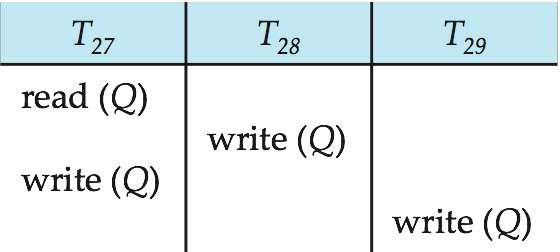

What serial schedule is above equivalent to?

T27 – T28 – T29

此时不是冲突可串行化的（因无法通过交换无冲突指令得到串行调度）。

---

### Other Notions of Serializability

The schedule below produces **same outcome** as the serial schedule < $T_1$ , $T_5$ >, yet is **not conflict equivalent or view equivalent** to it.

(B-10)+50 = (B+50)-10

- In our example, the final result is the same as that of the serial schedule $<T_1, T_5>$ ，because of the mathematical fact that the increment and decrement operations are commutative. 
- The general case is not so easy since a transaction may be expressed as a complex SQL statement, a Java program with JDBC calls, etc.

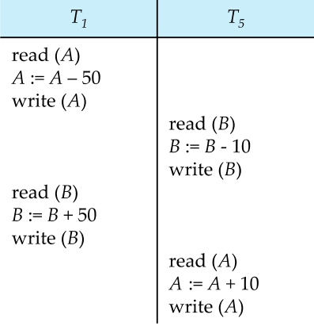

Determining such equivalence requires analysis of operations other than read and write.

---

## Recoverable Schedules

**Recoverable schedule**（可恢复调度） — if a transaction $T_j$ reads a data item previously written by a transaction $T_i$ , then the commit operation of $T_i$ appears before the commit operation of $T_j$ .

一个调度是可恢复的，如果满足以下条件：如果事务 $T_j$ 读取了事务 $T_i$ 修改过的数据项，那么 $T_i$ 的提交操作必须发生在 $T_j$ 的提交操作之前。（即：读依赖的事务必须后提交）

- **避免级联回滚（Cascading Rollback）**：  
  若 $T_j$ 读取了未提交的 $T_i$ 的数据，且 $T_i$ 后来回滚，则 $T_j$ 也必须回滚（因为它读到了脏数据）。  
- **保证数据一致性**：确保事务只依赖已提交的数据。

The following schedule (Schedule 11) is not recoverable if $T_9$ commits immediately after the read

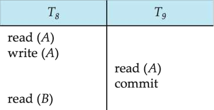

If $T_8$ should abort, $T_9$ would have read (and possibly shown to the user) an inconsistent database state. Hence, database must ensure that schedules are recoverable.

---

### Cascading Rollbacks

**Cascading rollback** – a single transaction failure leads to a series of transaction rollbacks. Consider the following schedule where none of the transactions has yet committed (so the schedule is recoverable)

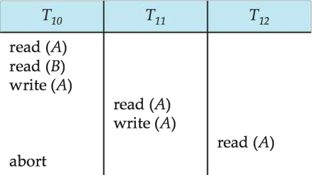

If $T_{10}$ fails, $T_{11}$ and $T_{12}$ must also be rolled back.

Can lead to the undoing of a significant amount of work

一个事务的回滚导致其他依赖它的事务也必须回滚，形成连锁反应。

- **触发条件**：事务 $T_j$ 读取了未提交事务 $T_i$ 修改的数据，且 $T_i$ 最终回滚。  
- **问题**：  
  - 大量已完成的工作被撤销（浪费资源）。  
  - 系统需要跟踪复杂的依赖链，增加恢复复杂度。 

---

### Cascadeless Schedules

**Cascadeless schedules**（无级联调度） — cascading rollbacks cannot occur; for each pair of transactions $T_i$ and $T_j$ such that $T_j$ reads a data 
item previously written by $T_i$ , the commit operation of $T_i$ appears before the read operation of $T_j$.

事务只能读取**已提交事务**修改的数据（即禁止读取未提交的数据）。

- **优点**：  
  - 完全避免级联回滚。  
  - 恢复更高效（无需检查依赖链）。 
- **缺点**：  
  - 事务的并发度降低了，吞吐率下降。

Every cascadeless schedule is also recoverable

It is desirable to restrict the schedules to those that are cascadeless

---

## Concurrency Control & Serializability

A database must provide a mechanism that will ensure that all possible schedules are

- either conflict or view serializable, and 
- are recoverable and preferably cascadeless

Testing a schedule for serializability after it has executed is a little too late!

**Goal** – to develop **concurrency control protocols** that will assure serializability.

Concurrency-control protocols allow concurrent schedules, but ensure that the schedules are conflict/view **serializable**, and are **recoverable and cascadeless**.

Concurrency control protocols generally do not examine the precedence graph as it is being created

Instead a protocol imposes a discipline that avoids nonseralizable schedules.

Different concurrency control protocols provide different tradeoffs between the amount of concurrency they allow and the amount of overhead that they incur.

**Tests for serializability** help us understand why a concurrency control protocol is correct.

**1. 数据库的核心要求**  

数据库必须确保所有可能的调度（Schedule）满足：

1. **可串行化**（Conflict/View Serializable）  
   - 并发执行的结果必须等价于某种串行执行顺序。  
2. **可恢复性**（Recoverable）  
   - 事务提交顺序必须保证依赖关系正确（读已提交数据）。  
3. **无级联性**（Cascadeless，理想情况）  
   - 禁止事务读取未提交的数据，避免级联回滚。  

---

**2. 为什么不能事后检测？**

- **问题**：如果等调度执行完再检测可串行化，发现冲突时为时已晚（数据可能已不一致）。  
- **解决方案**：通过**并发控制协议**提前约束事务行为，从源头避免非可串行化调度。  

---

**3. 并发控制协议的作用**

- **核心功能**：
  - 允许事务并发执行，但强制遵守规则，确保调度满足：  
    - 可串行化（冲突或视图可串行化）。  
    - 可恢复性 + 无级联性（避免级联回滚）。

- **实现方式**：
  - 不动态检查优先图（Precedence Graph），而是通过协议规则（如锁、时间戳）限制事务操作顺序。  

**权衡**：

- **并发性越高**（如MVCC、OCC），系统吞吐量越大，但可能增加内存或CPU开销。  
- **约束越严格**（如严格2PL），一致性越强，但并发性降低（更多阻塞）。  

---

### Weak Levels of Consistency

Some applications are willing to live with weak levels of consistency, allowing schedules that are not serializable

某些应用可以接受**非可串行化（Non-serializable）**的调度，以换取更高的性能或更低的延迟。这种弱一致性（Weak Consistency）适用于**对数据准确性要求不严格**的场景。

- E.g. a read-only transaction that wants to get an approximate total balance of all accounts 
- E.g. database statistics computed for query optimization can be approximate 
- Such transactions need not be serializable with respect to other transactions

1. **近似查询（Approximate Queries）**

   - **示例**：统计所有账户的总余额（允许误差）。  
   - **原因**：
     - 读操作不需要精确同步最新写入，可以容忍脏读或过期数据。
     - 避免锁竞争，提升吞吐量。

2. **数据库统计信息（Statistics for Query Optimization）**

   - **示例**：计算表的行数、列分布（用于查询优化器）。
   - **原因**：
     - 统计信息本身是近似值（如通过采样而非全表扫描）。
     - 实时一致性对优化器影响有限。

Tradeoff accuracy for performance

---

### Transaction Isolation Levels

- **Serializable** — default
- **Repeatable read** — only committed records to be read, repeated reads of same record must return same value. However, a transaction may not be serializable – it may find some records inserted by a transaction but not find others.
- **Read committed** — only committed records can be read, but successive reads of record may return different (but committed) values.
- **Read uncommitted** — even uncommitted records may be read.

隔离级别定义事务间的可见性规则，从强到弱分为4种标准级别：

| 隔离级别             | 脏读 | 不可重复读 | 幻读 | 性能 | 适用场景 |
|:--------------------:|:----:|:----------:|:----:|:----:|:--------:|
| **Serializable（可串行化）** | ❌  | ❌ | ❌  | 最低 | 金融交易、库存管理 |
| **Repeatable Read（可重复读）** | ❌  | ❌ | ✅  | 中   | 大多数OLTP系统（MySQL默认） |
| **Read Committed（读已提交）** | ❌  | ✅ | ✅  | 较高 | 报表查询（Oracle/PostgreSQL默认） |
| **Read Uncommitted（读未提交）** | ✅  | ✅ | ✅  | 最高 | 近似统计（极少使用） |

1. **Serializable, 最严格**：完全禁止脏读、不可重复读和幻读

2. **Repeatable Read** : 保证同一事务内多次读取相同记录结果一致，但可能看到其他事务新增的记录

3. **Read Committed** : 只读取已提交数据，允许不可重复读(同一事务内可能读到不同版本)

4. **Read Uncommitted** : 最低隔离级别，允许读取未提交数据(脏读)

Lower degrees of consistency useful for gathering approximate information about the database 

Warning: some database systems do not ensure serializable schedules by default

E.g. Oracle and PostgreSQL by default support a level of consistency called snapshot isolation (not part of the SQL standard)

---

### Transaction Definition in SQL

In SQL, a transaction begins implicitly.

在SQL中，当执行第一条DML语句（如`INSERT`/`UPDATE`/`DELETE`）时，事务**自动开始**（无需显式`BEGIN`命令）。

A transaction in SQL ends by:

- **Commit work** commits current transaction and begins a new one.
- **Rollback work** causes current transaction to abort.

**显式结束**：

- **`COMMIT WORK`**：提交当前事务，并自动开始新事务。  
- **`ROLLBACK WORK`**：回滚当前事务的所有操作。  
- *注*：`WORK`关键字通常可省略（直接写`COMMIT`或`ROLLBACK`）。

In almost all database systems, by default, every SQL statement also commits implicitly if it executes successfully

    - Implicit commit can be turned off by a database directive

**默认行为**：在多数数据库（如MySQL、Oracle）中，**每条SQL语句成功执行后会隐式提交**（即使没有显式`COMMIT`）。  

- 问题：这可能导致意外的原子性破坏（如批量操作中途失败时部分提交）。

- **关闭隐式提交**：

通过数据库特定指令禁用（例如）：  
```sql
-- MySQL
SET autocommit = 0;

-- Oracle
SET AUTOCOMMIT OFF;
```

Isolation level can be set at database level

Isolation level can be changed at start of transaction

- **数据库级默认设置**：可在数据库配置中定义全局默认隔离级别（如MySQL配置文件设置`transaction-isolation=REPEATABLE-READ`）。  
- **事务级动态设置**：

单个事务开始时可以指定隔离级别（覆盖默认设置）：  
```sql
-- 设置当前事务隔离级别
SET TRANSACTION ISOLATION LEVEL SERIALIZABLE;
BEGIN;  -- 显式开始事务（某些数据库需要）
-- 事务操作...
COMMIT;
```

---

### Concurrency Control Protocols

Lock-Based Protocols

- Lock on whole database vs lock on items
- How long to hold lock?
- Shared vs exclusive locks

**1. 基于锁的协议（Lock-Based Protocols）**
**核心机制**：通过锁限制数据访问权限

- **锁粒度**：
  - **数据库级锁**：简单但并发性极低（如SQLite的全局锁）
  - **数据项级锁**（行/页锁）：主流实现（如MySQL InnoDB的行锁）

| 锁类型          | 共享锁（S Lock）               | 排他锁（X Lock）               |
|:--------------:|:-----------------------------:|:-----------------------------:|
| **读操作**      | 允许多事务并发读               | 禁止其他事务读写               |
| **写操作**      | 禁止其他事务写                 | 禁止其他事务持有任何锁         |
| **兼容性**      | 与共享锁兼容，与排他锁互斥     | 与所有锁互斥                  |

- **锁持有时间**：

  - **严格两阶段锁（Strict 2PL）**：写锁持有到事务结束（避免级联回滚）
  - **MySQL默认**：读锁可提前释放，写锁保持到事务提交

**典型问题**：死锁（需超时或等待图检测）

Timestamp-Based Protocols

- Transaction timestamp assigned e.g. when a transaction begins
- Data items store two timestamps
    - Read timestamp
    - Write timestamp
- Timestamps are used to detect out of order accesses

**2. 基于时间戳的协议（Timestamp-Based Protocols）**
**核心思想**：为事务和数据项标记时间戳，按时间顺序处理冲突

- **关键机制**：
  1. 每个事务开始时分配**唯一时间戳**（如系统时钟或逻辑计数器）
  2. 每个数据项维护两个时间戳：
     - **Read-TS**：最后成功读取该数据的事务时间戳
     - **Write-TS**：最后成功写入该数据的事务时间戳

| 冲突场景                | 处理方式                          |
|:----------------------:|:--------------------------------:|
| 事务T读数据Q            | 若T的时间戳 < Q的Write-TS → 回滚T |
| 事务T写数据Q            | 若T的时间戳 < Q的Read/Write-TS → 回滚T |

**优点**：无锁，高并发  
**缺点**：长事务易被短事务"饿死"（频繁回滚）

Validation-Based Protocols

- Optimistic concurrency control
- Low rate of conflicts among transactions
- Each transaction must go through 3 phases:
    - Read phase → Validation phase → Write phase

**3. 基于验证的协议（Validation-Based Protocols）**

**乐观并发控制（OCC）**：假设冲突率低，先执行后验证

- **三阶段执行**：

1. **读阶段**：

    - 事务读取数据到私有工作区  
    - 所有修改暂不写入数据库

2. **验证阶段**：

    - 检查该事务的读写集是否与其他已提交事务冲突  
    - 通过验证则进入写阶段，否则回滚
    
3. **写阶段**：

    - 将私有工作区的修改提交到数据库  

- **适用场景**：  
  - 低冲突环境（如读多写少）  
  - 内存数据库（如Redis的WATCH机制）

**优势**：无阻塞，适合长读事务

**风险**：高冲突时回滚代价大

---