# Chapter 18 | Concurrency Control

## Lock-Based Protocols

A lock is a mechanism to control concurrent access to a data item

Data items can be locked in two modes :

锁是一种控制并发访问数据项的机制，主要分为两种模式：

1. exclusive (X) mode. Data item can be both read as well as written. X-lock is requested using lock-X instruction.
2. shared (S) mode. Data item can only be read. S-lock is requested using lock-S instruction.

1. **排他锁(X锁)**：使用lock-X指令请求。持有X锁的事务可以对数据项进行读写操作。

- 特点：一旦一个事务持有X锁，其他事务不能获取任何类型的锁（既不能读也不能写）。

2. **共享锁(S锁)**：使用lock-S指令请求。持有S锁的事务只能读取数据项。

- 特点：多个事务可以同时持有S锁（允许多个事务同时读取），但只要有一个事务持有S锁，其他事务就不能获取X锁。

Lock requests are made to concurrency-control manager. Transaction can proceed only after request is granted.

锁请求（Lock Request） 是事务（Transaction）向 并发控制管理器（Concurrency-Control Manager） 发出的请求，目的是获取对某个数据项的访问权限（读或写）。

Lock-compatibility matrix

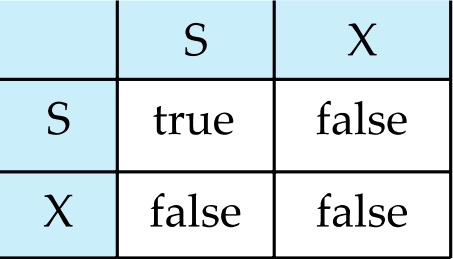

A transaction may be granted a lock on an item if the requested lock is compatible with locks already held on the item by other transactions

Any number of transactions can hold **shared** locks on an item, but if any transaction holds an **exclusive** on the item no other transaction may hold any lock on the item.

If a lock cannot be granted, the requesting transaction is made to **wait** till all incompatible locks held by other transactions have been released. The lock is then granted.

1. 锁请求必须被批准后，事务才能继续执行。

- 事务在执行过程中，如果需要访问某个数据项（如数据库记录），必须先向并发控制管理器申请锁（S锁或X锁）。
- 只有在该请求被 批准（Granted） 后，事务才能继续执行后续操作（如读取或修改数据）。

2. 如果锁请求被拒绝，事务必须等待。

- 如果请求的锁与当前其他事务持有的锁冲突（如另一个事务已经持有X锁），并发控制管理器会拒绝（Deny）该请求，并使事务进入等待（Blocked） 状态。
- 事务会一直等待，直到冲突的锁被释放（如其他事务提交或回滚），然后锁被授予，事务恢复执行。

**工作流程**：
1. 事务向并发控制管理器发出锁请求
2. 如果请求的锁与现有锁兼容，立即授予
3. 如果不兼容，事务必须等待，直到所有不兼容的锁被释放
4. 锁被授予后，事务才能继续执行

这种机制确保了数据的一致性和并发控制，防止了脏读、不可重复读等问题。

---

### The Two-Phase Locking Protocol

This is a protocol which ensures conflict-serializable schedules.

Phase 1: Growing Phase

- transaction may obtain locks 
- transaction may not release locks

Phase 2: Shrinking Phase

- transaction may release locks
- transaction may not obtain locks

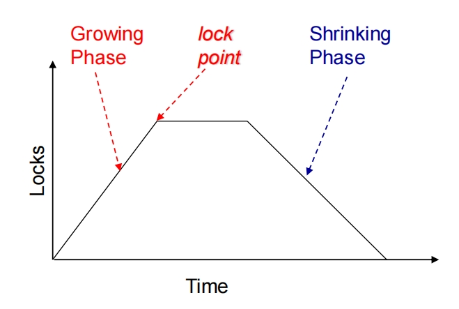

lock-S(A);

read (A);

lock-S(B); $\leftarrow$ lock point

read (B);

unlock(A);

unlock(B);

display(A+B)

---

Two-Phase Locking Protocol assures serializability.

It can be proved that the transactions can be serialized in the order of their lock points (i.e. the point where a transaction acquired its final lock).

两阶段锁协议（**Two-Phase Locking, 2PL**）是一种并发控制方法，它确保事务调度是 **可串行化（Serializable）** 的。

2PL 要求每个事务的锁获取和释放必须分成两个阶段：

1. **增长阶段（Growing Phase）**：事务可以不断获取新锁，但不能释放任何锁。
2. **收缩阶段（Shrinking Phase）**：事务可以释放锁，但不能再获取新锁。

- 一个事务的 **锁点（Lock Point）** 是该事务获取 **最后一个锁** 的时刻。  
- 在 2PL 下，所有事务的锁点决定了它们的 **串行顺序**。  

---

#### **证明 2PL 保证可串行化**

假设我们有多个事务 $T_1, T_2, \dots, T_n$ ，它们的锁点按顺序排列为 $T_1$ 的锁点 < $T_2$ 的锁点 < ... < $T_n$ 的锁点。我们需要证明：

1. **任何冲突操作（读/写）的顺序与锁点顺序一致**。
2. **因此，调度等价于按锁点顺序的串行执行**。

**证明步骤**

1. 如果 $T_i$ 在 $T_j$ 之前获取最后一个锁（即 $T_i$ 的锁点 < $T_j$ 的锁点）：

   - 由于 2PL 的 **增长阶段**，$T_i$ 在 $T_j$ 获取锁之前已经持有所有它需要的锁。
   - 因此，$T_i$ 不会在 $T_j$ 已经持有锁的情况下再去获取锁（否则会导致死锁或违反 2PL）。
   - 这意味着 $T_i$ 的所有操作（读/写）都在 $T_j$ 的冲突操作之前完成。

2. **冲突操作（读-写、写-读、写-写）必须遵守锁顺序**：

   - 如果 $T_i$ 写数据项 $X$ ，它必须持有 $X$ 的 **X锁**，并且在 $T_j$ 访问 $X$ 之前不会释放锁（因为 2PL 在增长阶段不允许释放锁）。
   - 因此，$T_j$ 必须等待 $T_i$ 进入收缩阶段（释放锁）后才能获取 $X$ 的锁，从而保证 $T_i$ 的操作先于 $T_j$ 。

3. **最终调度等价于按锁点顺序的串行执行** 由于所有冲突操作都按照锁点顺序执行，最终的调度等价于 $T_1 \rightarrow T_2 \rightarrow \dots \rightarrow T_n$ 的串行调度。

---

#### 2PL - Proof by Contradiction

In the precedence graph corresponding to a schedule of a set of transactions $T_1, T_2, \dots, T_n$ , if there is an arc from $T_i$ to $T_j$ , then LP($T_i$) < LP($T_j$) . 

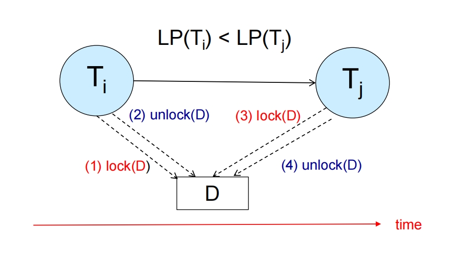

---

#### 2PL - Proof by Induction

Let $T_i$ is the transaction with minimum lock point（LP）.

If there is an operation $OP_j$ of another transaction $T_j$ that blocks an operation $OP_i$ of $T_i$ ...

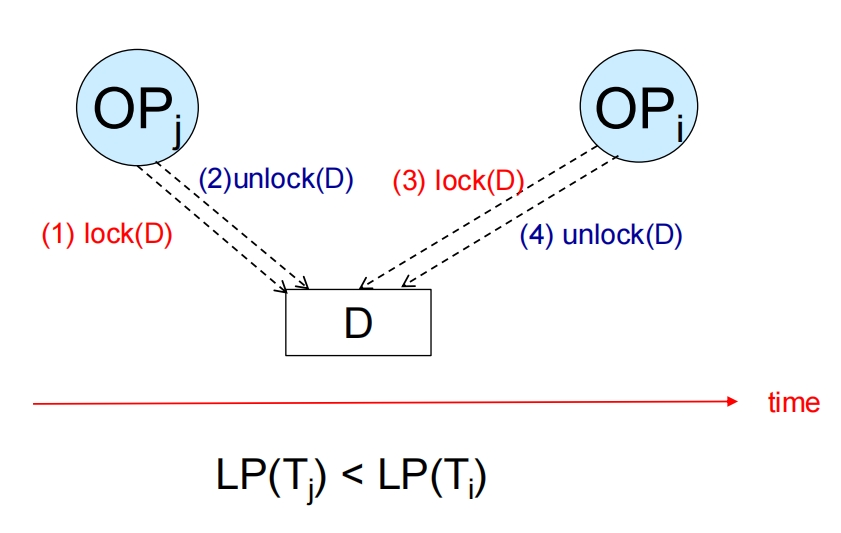

---

Extensions to basic two-phase locking（基本两阶段封锁） needed to ensure recoverability of freedom from cascading roll-back

- 我们证明了这是可串行化的，但是这是可恢复的吗？要可恢复的条件就是不读脏数据。
- 基本两阶段封锁，是可串行化的，但是不是可恢复的。

**Strict two-phase locking**（严格两阶段封锁）: a transaction must hold all its exclusive locks till it commits/aborts.

- 将 `X` 锁的持有时间延长到提交/中止为止，从而确保了可恢复性。
- Ensures recoverability and avoids cascading roll-backs

**Rigorous two-phase locking**（强两阶段封锁）: a transaction must hold all locks till commit/abort.

- 所有的锁都必须持有到提交/中止为止，从而确保了可恢复性。但是会影响并发性与事务的吞吐率。
- Transactions can be serialized in the order in which they commit.

Most databases implement rigorous two-phase locking, but refer to it as simply two-phase locking

Two-phase locking is **not a necessary condition** for serializability.

There can be conflict serializable schedules that cannot be obtained if two-phase locking is used.

However, in the absence of extra information (e.g., ordering of access to data), two-phase locking is needed for conflict serializability .

我们可以通过下面的 Exercise 理解。

???+ Exercise
    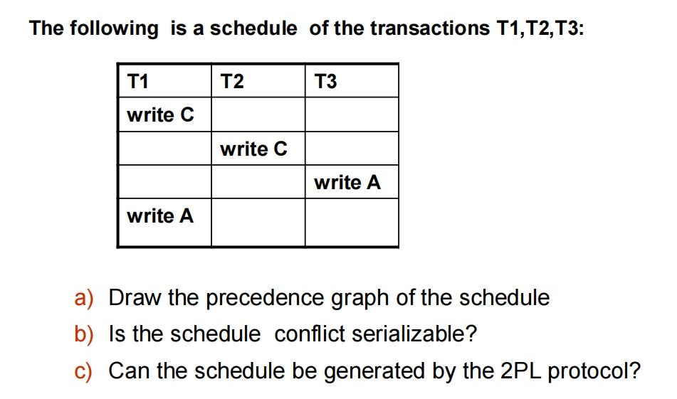

??? note "Answer"
    先把 precedence graph 画出来。

    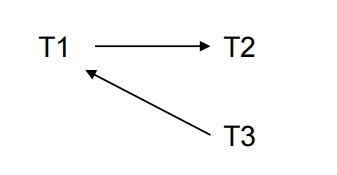

    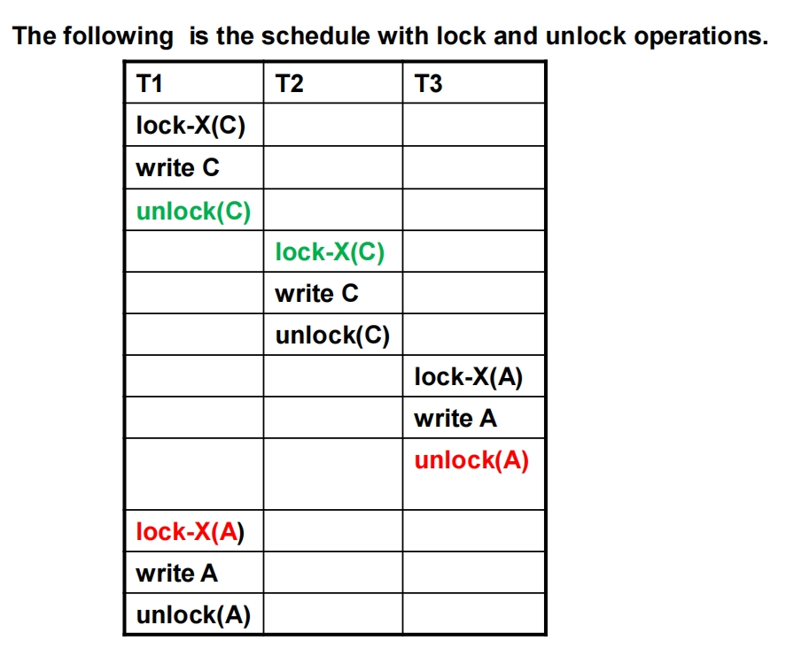

    两阶段封锁协议用一句话总结就是，放锁之后不能加锁。

    两阶段封锁协议对数据是如何组织，对事务如何访问数据的等等没有任何要求。如果知道了前者，那么可以是不遵循两阶段封锁协议，但是依旧是可串行化的。

---

#### Lock Conversions

Two-phase locking with lock conversions:

1. First Phase:

   - can acquire a lock-S or lock-X on a data item
   - can convert a lock-S to a lock-X (lock-upgrade)

2. Second Phase:

   - can release a lock-S or lock-X
   - can convert a lock-X to a lock-S (lock-downgrade)

**This protocol assures serializability.**

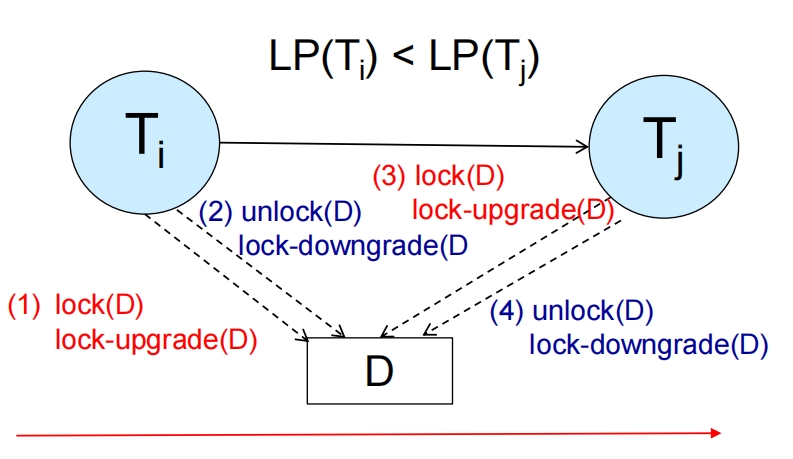

---

### Automatic Acquisition of Locks

A transaction $T_i$ issues the standard read/write instruction, without explicit locking calls.

The operation read(D) is processed as:

if $T_i$ has a lock on D

   then 
      
      read(D);

   else begin

      if necessary wait until no other transaction has a lock-X on D

         grant $T_i$ a lock-S on D;

         read(D);

   end

这段文本解释了在一个数据库系统中，事务（Transaction）如何处理读取（read）数据项 `D` 的操作。

它描述了以下步骤：

1. 事务 `Ti` 发出读取数据项 `D` 的请求。
2. 系统首先检查事务 `Ti` 是否已经持有数据项 `D` 的锁。
3. **如果 `Ti` 已经持有锁**，那么 `Ti` 可以直接读取数据项 `D`。
4. **如果 `Ti` 没有持有锁**：

    * 系统会检查是否有其他事务持有数据项 `D` 的排他锁（lock-X）。排他锁阻止其他任何事务读写数据项。
    * 如果其他事务持有排他锁，`Ti` 需要等待直到那些排他锁被释放。
    * 一旦没有其他事务持有数据项 `D` 的排他锁，系统会授予 `Ti` 一个共享锁（lock-S）在数据项 `D` 上。共享锁允许多个事务同时读取数据项，但不允许写入。
    * 获得共享锁后，事务 `Ti` 读取数据项 `D`。

write(D) is processed as:

if $T_i$ has a lock on D

   then write(D);

else begin

   if necessary wait until no other trans. has any lock on D,

   if $T_i$ has a lock-S on D

      then upgrade lock on D to lock-X

   else

      grant $T_i$ a lock-X on D;

   write(D)

end

1. 事务 `Ti` 发出写入数据项 `D` 的请求。
2. 系统首先检查事务 `Ti` 是否已经持有数据项 `D` 的锁。
3. **如果 `Ti` 已经持有锁**，那么 `Ti` 可以直接写入数据项 `D`。
4. **如果 `Ti` 没有持有锁**：

    * 系统会检查是否有其他事务持有数据项 `D` 的**任何**锁（包括共享锁和排他锁）。为了进行写入操作，事务需要获得排他锁（lock-X），而排他锁不允许其他任何事务持有该数据项的任何锁。
    * 如果有其他事务持有锁，`Ti` 需要等待直到这些锁都被释放。
    * 一旦没有其他事务持有数据项 `D` 的任何锁：

        * 如果 `Ti` 当前持有数据项 `D` 的共享锁（lock-S），它需要将该共享锁升级为排他锁（lock-X）。
        * 如果 `Ti` 没有持有数据项 `D` 的任何锁，系统会授予 `Ti` 一个排他锁（lock-X）在数据项 `D` 上。

    * 获得排他锁（无论是直接授予还是升级获得）后，事务 `Ti` 可以写入数据项 `D`。

??? note "为什么需要存在要升级锁的这个两阶段封锁协议？"
    两阶段封锁协议（2PL）需要锁升级（从共享锁 S 升级到排他锁 X）的主要原因是为了**在保证事务隔离性的同时，提高并发性，并正确处理事务中先读后写的常见情况**。

    1. **常见的读后写模式：** 许多事务的操作模式是先读取一个数据项的值，根据这个值进行一些计算或判断，然后再决定是否修改（写入）这个数据项。

    2. **初始读取只需要共享锁：** 当事务只打算读取数据项时，只需要获取共享锁（S 锁）。共享锁允许多个事务同时读取同一个数据项，这大大提高了并发度。

    3. **写入操作需要排他锁：** 然而，当事务决定要修改数据项时，它必须持有排他锁（X 锁）。排他锁是独占的，不允许其他任何事务持有该数据项的任何锁（S 锁或 X 锁），以防止脏写、不可重复读等隔离性问题。

    4. **2PL 协议的限制：** 根据两阶段封锁协议，事务一旦进入收缩阶段（释放了第一个锁），就不能再获取任何新的锁。

    5. **如果没有锁升级会怎样？**

    * 如果事务先获取 S 锁进行读取，然后进入收缩阶段（因为释放了其他锁），此时它决定要写入，但根据 2PL 规则，它已经不能再获取新的 X 锁了，这就会导致问题。
    * 如果事务在进入收缩阶段前，先释放 S 锁，再尝试获取 X 锁。这不仅可能导致其他事务趁机修改数据，破坏隔离性，而且如果其他事务也持有 S 锁，可能会陷入更复杂的等待。
    * 如果事务为了避免这个问题，一开始就获取 X 锁（即使只是为了读取），这会极大地降低并发性，因为其他任何事务都不能同时读取或写入该数据项。

    6.  **锁升级的解决方案：** 锁升级允许在增长阶段（事务还没有释放任何锁时），将已持有的 S 锁转换为 X 锁。这个操作是"加强"而不是"获取新的不同类型的锁"。当事务需要从读取状态（持有 S 锁）转为写入状态时，它可以尝试将 S 锁升级为 X 锁。如果当前没有其他事务持有该数据项的 S 锁，升级就会成功。如果有其他事务持有 S 锁，该事务就需要等待，直到那些 S 锁被释放。

---

## Implementation of Locking

1. A lock manager can be implemented as a separate process to which transactions send lock and unlock requests
2. The lock manager replies to a lock request by sending a lock grant messages (or a message asking the transaction to roll back, in case of a deadlock)
3. The requesting transaction waits until its request is answered
4. The lock manager maintains a data-structure called a **lock table** to record granted locks and pending requests
5. The lock table is usually implemented as an in-memory hash table indexed on the name of the data item being locked

1. **锁管理器是一个独立的进程:** 这意味着锁管理器不是事务本身的组成部分，而是一个独立的系统组件，负责集中管理所有的锁请求。
2. **事务发送请求给锁管理器:** 当一个事务需要锁定或解锁某个数据项时，它不会自己直接操作锁，而是向锁管理器发送请求。
3. **锁管理器的回复:** 锁管理器接收到请求后，会根据当前锁的状态和规则进行处理。

    *   如果可以授予锁，它会向事务发送一个"锁授予消息 (lock grant messages)"。
    *   如果请求导致死锁，锁管理器会发送一个消息要求事务回滚 (roll back)。

4. **事务等待回复:** 发出锁请求的事务会一直等待，直到收到锁管理器的回复（授予锁或要求回滚）。
5. **锁表 (lock table):** 锁管理器维护一个名为"锁表"的数据结构。这个表记录了当前已经被授予的锁以及正在等待中的锁请求。
6. **锁表的实现:** 锁表通常在内存中实现，并且使用数据项的名称作为索引，以便快速查找某个数据项的锁信息。常见的实现方式是哈希表 (hash table)。

---

## Lock Table

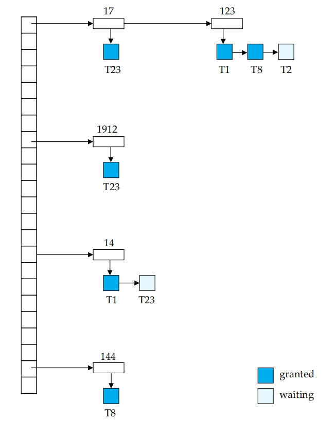

1. 左边的垂直长条代表锁表的索引结构。这个哈希表用于根据数据项的标识快速定位到该数据项的锁信息。图中的箭头从索引指向了具体的数据项信息。
2. 图中显示了几个不同的数据项，通过它们唯一的标识来区分，这些数字代表数据库中的某个数据块、行或表等。
3. 对于每个数据项，锁表都维护一个链表。这个链表包含了所有对该数据项的锁请求，无论是已经授予的还是正在等待的。
4. 链表中的每一个节点代表一个事务对该数据项的锁请求。

    *   **蓝色方框 (granted):** 代表这个事务对该数据项的锁请求已经被**授予**。
    *   **白色方框 (waiting):** 代表这个事务对该数据项的锁请求正在**等待**。

5. 链表中请求的顺序通常表示它们到达锁管理器的顺序。新的请求会被添加到队列的末尾。锁管理器会按照队列的顺序检查等待中的请求是否可以被授予（即是否与当前已授予的锁兼容）。

Lock table records granted locks and waiting requests

锁表的主要功能就是记录每个数据项上当前被哪个事务持有什么类型的锁（已授予的锁），以及有哪些事务正在等待获取某个数据项的锁（等待中的请求）。

Lock table also records the type of lock granted or requested

锁表不仅仅记录哪个事务在哪项数据上请求或持有了锁，还会记录锁的类型，例如是共享锁（S 锁）还是排他锁（X 锁）。

New request is added to the end of the queue of requests for the data item, and granted if it is compatible with all earlier locks

当一个新的事务请求对某个数据项加锁时，这个新的请求会被添加到该数据项对应的请求队列的末尾。只有当这个新请求与队列中所有在它之前的（即已经授予的锁或正在等待但在它之前的请求）锁都兼容时，这个请求才会被立即授予。否则，它就会留在队列中等待。

Unlock requests result in the request being deleted, and later requests are checked to see if they can now be granted

当一个事务完成对某个数据项的访问并请求解锁时，锁管理器会从锁表中删除该事务对该数据项的锁请求记录。然后，锁管理器会检查队列中排在被删除请求之后的等待中的请求。这些请求现在可能有机会被授予，因为它前面的一些锁可能已经被释放了。

If transaction aborts, all waiting or granted requests of the transaction are deleted

如果一个事务由于某种原因中止（回滚），锁管理器需要删除该事务对所有数据项的所有等待中或已授予的锁请求。为了高效地实现这一点，锁管理器可能会维护一个列表，记录每个事务当前持有的所有锁。

lock manager may keep a list of locks held by each transaction, to implement this efficiently

锁表通常在内存中实现，以提供快速访问。它通常是一个哈希表，使用数据项的名称（或标识符）作为键来查找对应的数据项的锁信息和请求队列。

!!! info
    可以通过判断是否 unlock 后又 lock 了来判断是否是两阶段封锁协议。

---

## Deadlock

### Deadlock Handling

只要是基于锁的并发控制协议，就无法避免死锁。

System is deadlocked if there is a set of transactions such that every transaction in the set is waiting for another transaction in the set.

Two-phase locking does not ensure freedom from deadlocks

Consider the following two transactions:

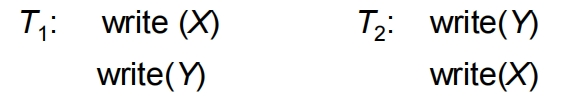

Schedule with deadlock

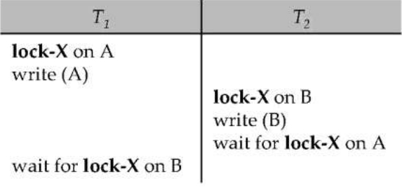

**Deadlock prevention** protocols ensure that the system will never enter into a deadlock state. Some prevention strategies :

- Require that each transaction locks all its data items before it begins execution (predeclaration).
- Impose partial ordering of all data items and require that a transaction can lock data items only in the order specified by the partial order (graph-based protocol).

**Timeout-Based Schemes**:

- a transaction waits for a lock only for a specified amount of time. After that, the wait times out and the transaction is rolled back.
- thus deadlocks are not possible, 
- simple to implement; but starvation is possible. Also difficult to determine good value of the timeout interval.

1. **预声明 (Predeclaration):**

**策略:** 要求每个事务在开始执行**之前**就声明并获取它需要的所有数据项的锁。
**优点:** 如果事务能够成功获取所有必需的锁，它就可以保证在执行过程中不会因为等待其他事务所持有的锁而发生死锁。
**缺点:**

    *   事务可能不知道它在执行过程中到底需要哪些数据项的锁，这使得预声明变得困难或不可能。
    *   即使事务知道所有需要的锁，提前长时间持有锁会降低系统的并发性，因为其他事务可能需要等待很长时间才能访问这些数据项，即使事务暂时还不需要使用它们。
    *   获取所有锁的过程本身也可能导致事务需要等待，虽然这避免了死锁循环，但可能会增加等待时间。

2. **基于图（Graph-Based Protocol）:**

**策略:** 将所有事务和它们所需要的数据项表示为一个有向图，其中节点代表事务和数据项，边代表事务对数据项的锁请求或持有。强制事务按一致顺序加锁，避免形成等待环路。
**优点:** 这种方法可以检测到潜在的死锁循环，并阻止事务进入死锁状态。相比预声明，允许更细粒度的锁管理，提升一定并发性。
**缺点:**

    * 实现起来相对复杂，需要维护和更新一个动态的图结构。
    * 事务必须按固定顺序访问数据，可能不符合实际业务逻辑。
    * 需要设计合理的数据项偏序关系，并确保所有事务遵守。

3. **基于超时（Timeout-Based Schemes）:**

**策略:** 事务请求锁时，仅允许等待一段固定时间。若超时仍未获得锁，事务自动回滚并释放已持有的锁。
**优点:** 通过强制终止潜在的死锁参与者，避免系统陷入无限等待。
**缺点:**

    * 实现简单，无需复杂的锁序管理或预声明。
    * 无死锁风险，等待时间有限，系统不会长期阻塞。

**缺点:**

    * 饥饿问题：长时间等待可能导致某些事务无法获得锁，从而饿死（始终无法完成）。
    * 超时时间的选择需要权衡，过短可能导致频繁回滚和重试，过长则可能增加死锁风险。
    * 性能开销：频繁的超时检测和事务回滚可能会影响系统性能。

---

### Deadlock Detection

Deadlocks can be described as a wait-for graph, which consists of a pair G = (V,E),

- V is a set of vertices (all the transactions in the system)
- E is a set of edges; each element is an ordered pair $T_i \rightarrow T_j$ 

if $T_i \rightarrow T_j$ is in E, then there is a directed edge from $T_i$ to $T_j$ , implying that $T_i$ is waiting for $T_j$ to release a data item.

When $T_i$ requests a data item currently being held by $T_j$, then the edge $T_i$ $T_j$ is inserted in the wait-for graph. This edge is removed only when $T_j$ is no longer holding a data item needed by $T_i$.

The system is in a deadlock state if and only if the wait-for graph has a cycle. Must invoke a deadlock-detection algorithm periodically to look for cycles.

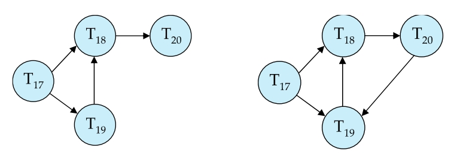

---

### Deadlock Recovery

When deadlock is detected :

- Some transaction will have to rolled back (made a victim) to break deadlock. Select that transaction as victim that will incur minimum cost. 强制回滚一些事务。

- Rollback -- determine how far to roll back transaction

    - Total rollback: Abort the transaction and then restart it.
    - More effective to roll back transaction only as far as necessary to break deadlock.

- Starvation happens if same transaction is always chosen as victim. Include the number of rollbacks in the cost factor to avoid starvation

???+ Question
    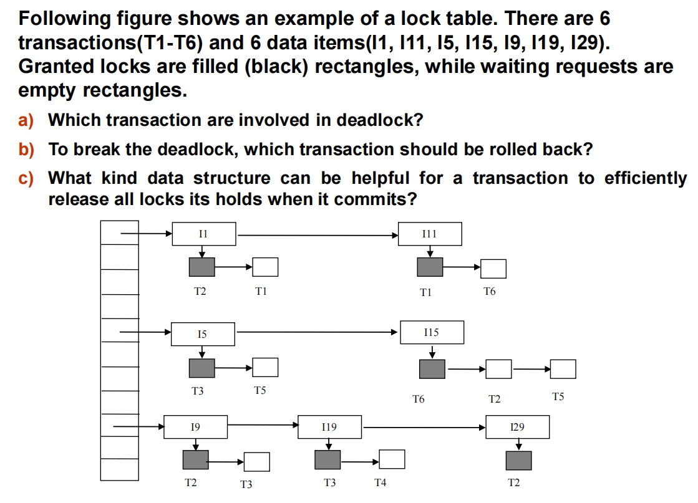

??? note "Answer"
    a) 哪些事务涉及死锁？
    
    死锁发生在一组事务相互等待对方释放锁，形成一个"环"。T1、T2、T6 形成了一个死锁环。
    
    b) 为了解除死锁，应该回滚哪个事务？
    
    理论上，回滚环中的任意一个事务都可以打破死锁。实际中，通常选择"代价最小"的事务（如等待时间最短、已执行操作最少等）。
    
    任选 T1、T2 或 T6 中的一个即可。
    
    c) 什么样的数据结构可以帮助事务在提交时高效释放它持有的所有锁？
    
    需要一种能快速找到某个事务持有的所有锁的数据结构。最常用的是：

    - **链表（Linked List）** 或 **集合（Set）**，每个事务维护一个自己持有的锁的列表。
    - 当事务提交时，只需遍历这个列表，依次释放所有锁即可。

---

#### Graph-Based Protocols

Graph-based protocols are an alternative to two-phase locking

Impose a partial ordering $\rightarrow$ on the set $D = \{d_1, d_2, \ldots, d_n\}$ of data items. 

- If $d_i \rightarrow d_j$, then any transaction accessing both $d_i$ and $d_j$ must access $d_i$ before accessing $d_j$.
- Implies that the set D may now be viewed as a directed acyclic graph, called a database graph.

图中带有箭头的线表示数据项之间的偏序关系。如果从数据项 $d_i$ 有一条箭头指向数据项 $d_j$ ($d_i \rightarrow d_j$)，这意味着任何需要同时访问 $d_i$ 和 $d_j$ 的事务，都必须先访问并锁定 $d_i$，然后才能访问并锁定 $d_j$。

通过强制事务按照固定的偏序关系获取锁，基于图的协议可以预防死锁。因为事务总是按顺序获取锁，永远不会出现两个事务互相等待对方持有锁的情况（即不会在等待图中形成环）。

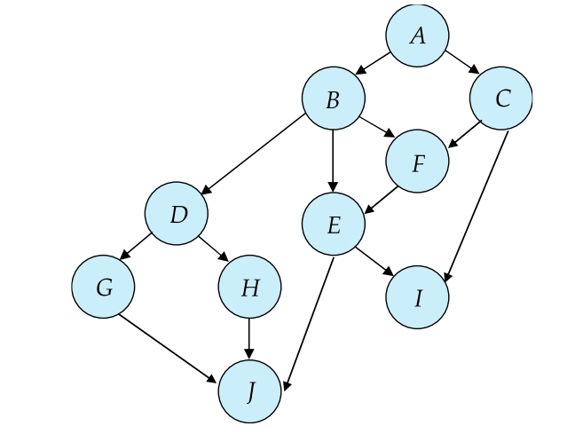

---

##### Tree Protocol

The tree-protocol is a simple kind of graph protocol.

1. Only exclusive locks are allowed.
2. The first lock by $T_i$ may be on any data item. Subsequently, a data Q can be locked by $T_i$ only if the parent of Q is currently locked by $T_i$.
3. Data items may be unlocked at any time.
4. A data item that has been locked and unlocked by $T_i$ cannot subsequently be relocked by $T_i$.

树协议的关键规则是：

1. 事务第一次锁任何数据项都可以。
2. 之后，事务只能锁定其当前已经锁定的数据项的子节点。
3. 事务可以随时解锁数据项。
4. 事务不能重复锁定已经解锁过的数据项。

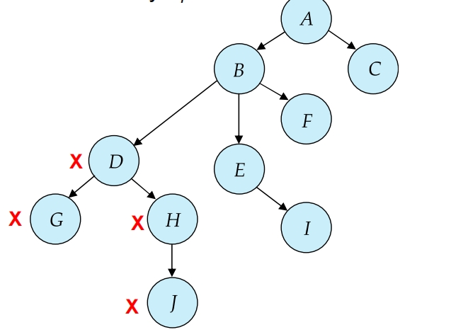

---

The tree protocol ensures conflict serializability as well as freedom from deadlock.

树协议能够保证**冲突可串行化 (conflict serializability)**，并且**不会发生死锁 (freedom from deadlock)**。这意味着按照树协议执行的事务产生的结果等价于某种串行执行的结果，同时系统不会因为事务相互等待锁而陷入停顿。

**Advantages**:

1. Unlocking may occur earlier in the tree-locking protocol than in the two-phase locking protocol.

相比两阶段封锁协议 (Two-Phase Locking, 2PL)，树协议允许事务更早地释放锁。

- shorter waiting times, and increase in concurrency
- 这可以减少事务的等待时间，因为其他事务可以更快地获取到释放的数据项的锁。从而提高了系统的并发性，允许更多事务同时执行。

2. protocol is deadlock-free

树协议从设计上就避免了死锁的发生。

- no rollbacks are required
- 系统不需要进行死锁检测，也无需因为死锁而回滚事务，减少了开销和复杂性。

**Disadvantages**:

1. Protocol does not guarantee recoverability or cascade freedom

树协议本身不能保证可恢复性 (recoverability) 和也不能保证无级联回滚 (cascade freedom)。

- Need to introduce commit dependencies to ensure recoverability

为了确保可恢复性，可能需要引入提交依赖 (commit dependencies) 等额外的机制。

2. Transactions may have to lock more data items than needed.

为了遵循从父到子的锁定规则，事务可能不得不锁定一些它实际上并不需要的数据项。例如，要访问一个子节点，必须先锁定它的所有祖先节点，即使事务只需要子节点的数据。

- increased locking overhead, and additional waiting time
- 这增加了锁定的开销 (locking overhead)。
- potential decrease in concurrency
- 也可能导致事务需要等待更多不必要的数据项上的锁，增加了等待时间。可能反而降低了并发性。

Schedules not possible under two-phase locking are possible under tree protocol, and vice versa.

有些并发执行计划在两阶段封锁协议下是可能实现的，但在树协议下不可能，反之亦然。

??? note "call back"
    - 基本 2PL 不可恢复，可能发生级联回滚。

    - 严格 2PL 是可恢复的，不会发生级联回滚。因为写锁一直持有到提交/中止，其他事务不可能在持有写锁的事务提交之前读取到它修改的数据（即杜绝了"脏读"）。

    - 树协议是不可恢复的，可能发生级联回滚。

---

## Multiple Granularity

Allow data items to be of various sizes and define a hierarchy of data granularities, where the small granularities are nested within larger ones

Can be represented graphically as a tree (but don't confuse with tree-locking protocol)

When a transaction locks a node in the tree explicitly, it implicitly locks all the node's descendents in the same mode.

Granularity of locking (level in tree where locking is done):

- fine granularity（细粒度） (lower in tree): high concurrency, high locking overhead
- coarse granularity（粗粒度） (higher in tree): low locking overhead, low concurrency

---

### Example of Granularity Hierarchy

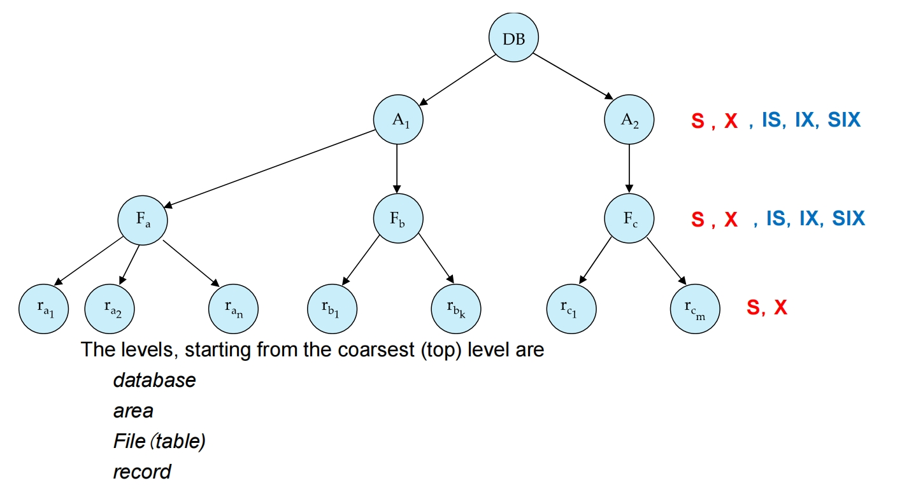

数据库中的数据项可以有不同的大小或"粒度"。例如，整个数据库是一个粗粒度的数据项，而其中的某个记录是一个细粒度的数据项。

这些不同粒度的数据项可以组织成一个层次结构，通常用一棵树来表示。

- 最顶层是整个**数据库 (database)**。
- 下一层可能是**区域 (area)**（这可能是一个逻辑或物理上的分组）。
- 再下一层是**文件 (File)**，在关系数据库中通常对应于**表 (table)**。
- 最底层是**记录 (record)**，也就是表中的一行数据。

多粒度锁定的核心思想是：当一个事务在一个层次结构中的某个节点上**显式地**获取锁时，它也**隐式地**以相同的模式锁定了该节点下的所有子节点。例如，如果一个事务在文件 $F_a$ 上获取了排他锁 (X)，那么它就隐式地对 $F_a$ 文件中的所有记录 ($r_{a_1}$ 到 $r_{an}$) 都获取了排他锁，其他事务就不能访问这些记录。

图中在不同的层次旁边列出了不同的锁类型：

1. S (Shared) 共享锁: 用于读取。多个事务可以同时对同一个数据项获取 S 锁。
2. X (Exclusive) 排他锁用于写入。一个事务获取 X 锁后，其他任何事务都不能再获取该数据项的任何锁。
3. 意向锁 (Intention Locks):这是多粒度锁定中特有的锁类型，用于在粗粒度节点上表示事务打算在更细粒度的子节点上获取什么类型的锁。

- IS (Intention Shared) 意向共享锁: 表示事务打算在某个后代节点上获取 S 锁。
- IX (Intention Exclusive) 意向排他锁: 表示事务打算在某个后代节点上获取 X 锁。
- SIX (Shared and Intention Exclusive) 共享意向排他锁: 表示事务在该节点上获取 S 锁，并且打算在后代节点上获取 X 锁。这通常用于事务需要读取整个粗粒度数据项（例如一个表），并且可能更新其中的部分细粒度数据项（例如一些记录）的情况。

在数据库 (DB)、区域 (area) 和文件 (File/table) 这些较粗的粒度层次上，允许使用 **S, X, IS, IX, SIX** 这五种锁。

在记录 (record) 这个最细的粒度层次上，只允许使用 **S 和 X** 两种锁，因为记录是最小的锁定单位，不需要意向锁。

多粒度锁定的主要目的是在并发性和锁定开销之间取得平衡：

- 细粒度锁定 (lower in tree): 锁定层次较低的数据项（如记录）提供了较高的并发性，因为不同事务可以同时访问同一个表中的不同记录。但开销较高，因为需要管理更多的锁。
- 粗粒度锁定 (higher in tree): 锁定层次较高的数据项（如整个表或区域）锁定的开销较低，因为需要的锁数量少。但并发性较低，因为锁定一个粗粒度数据项会阻塞其他事务访问其下的所有细粒度数据项。

多粒度锁定允许事务根据自己的需求选择合适的锁定粒度。意向锁则用于在粗粒度节点上快速判断在更细粒度节点上是否存在冲突的锁请求，提高了锁管理器检查锁兼容性的效率。

---

## Intention Lock Modes

In addition to S and X lock modes, there are three additional lock modes with multiple granularity:

- **intention-shared** (IS): indicates explicit locking at a lower level of the tree but only with shared locks.
- **intention-exclusive** (IX): indicates explicit locking at a lower level with exclusive or shared locks
- **shared and intention-exclusive** (SIX): the subtree rooted by that node is locked explicitly in shared mode and explicit locking is being done at a lower level with exclusive-mode locks.

intention locks allow a higher level node to be locked in S or X mode without having to check all descendent nodes.

---

### Compatibility Matrix with Intention Lock Modes

The compatibility matrix for all lock modes is:

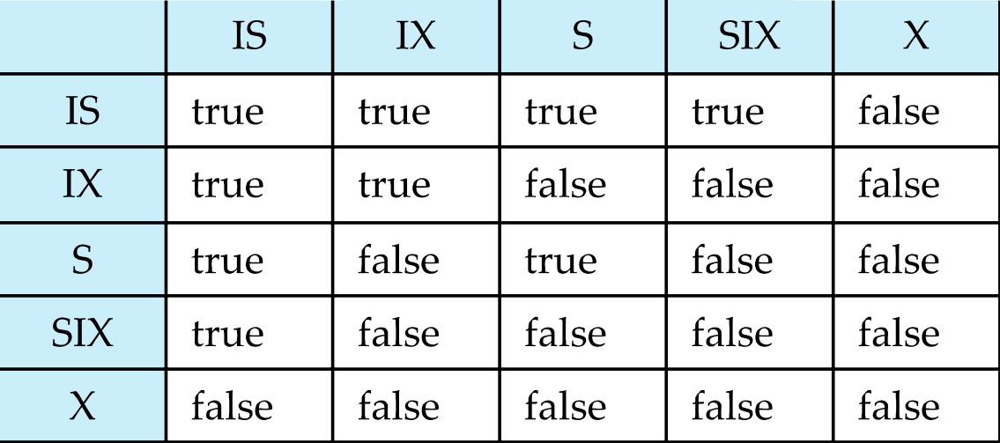

- 行 (Rows): 代表数据项上当前已经持有的锁模式。
- 列 (Columns): 代表另一个事务正在请求的锁模式。
- 矩阵中的值 (true/false):

    - true: 表示行代表的已持有锁与列代表的请求锁是兼容的，请求可以被立即授予。
    - false: 表示已持有锁与请求锁是不兼容的，请求事务必须等待。

我们逐行来看兼容性：

1. 已持有 IS 锁 (Row IS):

- 与 IS, IX, S, SIX 都兼容 (true)。因为 IS 锁只表示打算在下方获取 S 锁，与其他只是打算获取锁或只获取 S 锁的情况不冲突。
- 与 X 不兼容 (false)。因为 X 锁是排他性的，不允许其他任何锁存在。

2. 已持有 IX 锁 (Row IX):

- 与 IS, IX 兼容 (true)。IX 表示打算在下方获取 S 或 X 锁，与其他意向锁兼容。
- 与 S, SIX, X 不兼容 (false)。IX 表示下方可能有 X 锁，S 和 SIX 都包含在该节点上的 S 锁，如果下方有 X 锁，则与 S 和 SIX 不兼容；X 锁更是排他性的，直接冲突。

3. 已持有 S 锁 (Row S):

- 与 IS, S 兼容 (true)。S 锁允许其他事务同时读取 (S) 或打算在下方读取 (IS)。
- 与 IX, SIX, X 不兼容 (false)。S 锁只允许读取，而 IX, SIX 表示下方可能需要写入（X），X 表示需要写入当前节点，都与 S 锁冲突。

4. 已持有 SIX 锁 (Row SIX):

- 与 IS 兼容 (true)。SIX 在当前节点有 S 锁，并打算在下方获取 X 锁。其他事务打算在下方获取 S 锁 (IS) 与之不冲突。
- 与 IX, S, SIX, X 不兼容 (false)。SIX 包含在该节点上的 S 锁以及下方可能有的 X 锁意向。与 IX (下方可能 X), S (当前节点 S 但下方可能 X), SIX (当前节点 S 但下方可能 X), X (当前节点 X) 都存在冲突。

5. 已持有 X 锁 (Row X):

- 与任何锁都不兼容 (false)。X 锁是完全排他性的，不允许任何其他锁存在。

!!! info
    IX 和 IS 是相容的。

    1. 它们只是"意向"： IS 和 IX 锁本身并不直接访问或修改当前节点的数据。它们只是一个标记，告诉系统"我这个事务稍后会在这个节点的某个子节点上加锁"。

    2. 冲突发生在更低的层次： 真正的读写冲突（需要 S 锁和 X 锁互斥）发生在事务实际锁定并访问具体数据项的那个更细粒度的层次上（例如，记录或文件级别）。

    3. 意向锁不阻止其他事务的意向： 如果事务 A 在节点 P 上持有 IS 锁（打算在 P 的某个子节点上加 S 锁），这并不会阻止事务 B 在同一节点 P 上持有 IX 锁（打算在 P 的某个子节点上加 X 锁）。它们各自只是声明了一个意图。

---

## Multiple Granularity Locking Scheme

Transaction $T_i$ can lock a node Q, using the following rules:

1. The lock compatibility matrix must be observed.

必须遵守锁兼容性矩阵，这是最基本的规则。任何加锁请求都必须检查请求的锁模式是否与数据项上当前已有的锁模式兼容。只有兼容的情况下，锁才能被授予。

2. The root of the tree must be locked first, and may be locked in any mode.

必须先锁定树的根节点，事务开始执行时，必须首先锁定整个层次结构的最顶层节点（即根节点，通常是整个数据库）。根节点可以被锁定在任何锁模式下（S, X, IS, IX, SIX），具体取决于事务接下来打算在更细粒度的哪些数据项上执行什么操作。

3. A node Q can be locked by $T_i$ in S or IS mode only if the parent of Q is currently locked by $T_i$ in either IX or IS mode.

事务 $T_i$ 只有在当前已经持有了节点 Q 的**父节点**的 **IX 或 IS 锁**的情况下，才能对节点 Q 加 **S 或 IS 锁**。这意味着，如果事务打算在某个子节点或其后代节点上进行读取操作（需要 S 或 IS 锁），它必须先在父节点上声明这个意图，通过获取 IS 或 IX 锁（因为 IX 锁也允许在后代节点获取 S 锁）。

4. A node Q can be locked by $T_i$ in X, SIX, or IX mode only if the parent of Q is currently locked by $T_i$ in either IX or SIX mode.

事务 $T_i$ 只有在当前已经持有了节点 Q 的**父节点**的 **IX 或 SIX 锁**的情况下，才能对节点 Q 加 **X, SIX, 或 IX 锁**。这意味着，如果事务打算在某个子节点或其后代节点上进行写入操作（需要 X 或 IX 锁，或者在当前节点读取并在后代节点写入需要 SIX 锁），它必须先在父节点上声明这个更强的意图，通过获取 IX 或 SIX 锁（因为这两种锁都表示打算在下方获取 X 锁）。

5. $T_i$ can lock a node only if it has not previously unlocked any node (that is, $T_i$ is two-phase).

这个规则要求事务 $T_i$ 必须遵循**两阶段封锁协议 (Two-Phase Locking, 2PL)**。也就是说，事务在获取了第一个锁之后，就进入了增长阶段，在这个阶段只能获取新的锁，不能释放任何已有的锁。一旦事务释放了任何一个锁，就进入了收缩阶段，在这个阶段不能再获取任何新的锁。

??? note "Why?"
    多粒度锁定协议之所以必须遵循两阶段封锁协议（2PL），是因为 2PL 是**保证事务并发执行可串行化**的基本协议。

    简单来说：

    1. **多粒度锁定（MGL）** 主要解决的是在具有层次结构的数据项上**如何**有效地管理锁（选择合适的粒度和锁类型，如 IS, IX, SIX）。它提供了一种灵活的锁定**机制**。

    2. **两阶段封锁协议（2PL）** 主要解决的是事务**何时**获取和释放锁的问题（在释放第一个锁之前获取所有锁）。它是一种保证并发控制正确性（具体来说是冲突可串行化）的**协议**。

    如果多粒度锁定不遵循 2PL，即使事务按照层次结构正确获取了各种意向锁和基本锁，它仍然可以在完成操作之前释放某些锁，然后又获取新的锁。这种不"两阶段"的行为可能导致**非可串行化 (non-serializable)** 的执行结果，破坏事务的隔离性。

    将多粒度锁定机制与两阶段封锁协议结合起来，可以同时获得两者的优势：

    - **MGL 提供灵活性和效率：** 允许事务根据需要选择合适的粒度锁定，减少不必要的锁开销，提高并行度。意向锁帮助快速检查冲突。
    - **2PL 提供正确性：** 保证事务的并发执行是冲突可串行化的，从而维护了数据库的一致性和隔离性。

    所以，在多粒度锁定方案中强制遵循 2PL，是为了确保在利用多粒度机制的同时，不牺牲并发控制的正确性保证。事务必须在获取完所有需要的锁（无论是在哪个粒度级别上）后，才能开始释放任何锁。

Observe that locks are acquired in root-to-leaf order, whereas they are released in leaf-to-root order.

锁的获取是**从根节点到叶子节点 (root-to-leaf order)** 的，而锁的释放是**从叶子节点到根节点 (leaf-to-root order)** 的。这种顺序有助于维护层次结构上的锁定规则，并在释放锁时逐步向上解除对粗粒度数据项的限制。

Lock granularity escalation: in case there are too many locks at a particular level, switch to higher granularity S or X lock

如果在某个粒度级别（例如，在记录级别）事务需要获取太多锁，系统可以考虑将锁升级到更粗的粒度级别（例如，直接锁定整个文件或表），使用 S 或 X 锁来代替大量的细粒度锁。这样做可以减少锁管理的开销，但可能会降低并发性。

---

### An Example of Multiple Granularity Locking

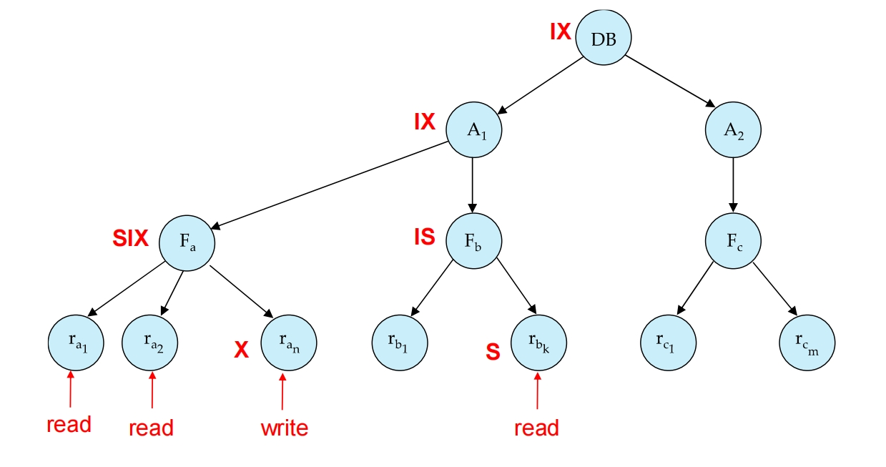

图中底部红色箭头指向具体的记录 ($r_{a_1}$, $r_{a_2}$, $r_{a_n}$, $r_{b_k}$)，并标明了事务要对这些记录执行的操作：

为了执行底层的读写操作，根据多粒度锁定协议的规则，事务需要在这些记录的祖先节点上获取相应的意向锁或其他锁。

- 事务为了访问某个细粒度数据项，需要从根节点开始沿着层次结构向下获取锁。
- 获取的锁类型取决于最细粒度操作的类型以及在路径上需要访问的范围。
- 意向锁 (IS, IX, SIX) 在高层节点上标记了事务在低层节点的意图（只读、读写），使得锁管理器可以在高层快速判断潜在的冲突。
- 为了在某个子节点上获取 X, SIX, 或 IX 锁，父节点必须持有 IX 或 SIX 锁。
- 为了在某个子节点上获取 S 或 IS 锁，父节点必须持有 IX 或 IS 锁。

---

## Insert and Delete Operations

If two-phase locking is used :

- A delete operation may be performed only if the transaction deleting the tuple has an X-mode lock on the tuple to be deleted.
- A transaction that inserts a new tuple into the database is given an X-mode lock on the tuple

Ensures that

- reads/writes conflict with deletes
- Inserted tuple is not accessible by other transactions until the transaction that inserts the tuple commits

Insertions and deletions can lead to the phantom phenomenon.

If only tuple locks are used, non-serializable schedules can result

- E.g. the scan transaction does not see the new account, but reads some other tuple written by the update transaction

1. 如果使用两阶段封锁协议，一个事务只有在对要删除的记录（tuple）持有**排他锁 (X-mode lock)** 时，才能执行删除操作。这样做是为了确保删除操作与任何其他事务对该记录的读或写操作发生冲突，防止在删除过程中出现并发问题。

2. 当一个事务向数据库中插入一个新的记录时，它会对这个新插入的记录自动获取一个**排他锁 (X-mode lock)**。这个锁确保在新记录被插入后，在插入事务**提交之前**，其他事务无法访问（读取或修改）这个新记录。这保证了其他事务不会看到尚未提交的数据。

3. 上述锁定策略确保了读/写操作会与删除操作会发生冲突（因为删除需要 X 锁）。确保了新插入的记录在插入事务提交之前对其他事务是不可见的。

4. 尽管使用了记录级别的锁来处理插入和删除，但这些操作仍然可能导致**幻影现象**。幻影现象是一种并发执行异常，发生在一个事务基于某个条件（谓词）读取了一组数据后，另一个事务插入或删除了满足该条件的记录，导致第一个事务如果重新执行相同的读取操作，会看到不同的结果集。这违反了可串行化性。

例子：假设一个扫描事务（scan transaction）正在统计满足某个条件的所有账户数量。=同时，另一个更新事务插入了一个**满足**这个扫描条件的**新账户**记录。如果扫描事务只对它已经读取过的记录加锁（记录锁），并且没有锁定"可能插入新记录的空间"，那么它可能在插入发生后，没有看到这个新插入的账户。如果扫描事务后来重新执行相同的统计操作，它就会包含这个新账户，从而得到一个不同的结果。这种情况下，仅仅使用记录锁是不足以保证可串行化的，因为插入操作引入了集合中的**新成员**，而这些新成员并没有被原始扫描事务的记录锁所覆盖。

---

### Handling Phantoms

The transaction performing predicate read or scanning the relation is reading information that indicates what tuples the relation contains, while a transaction inserting a tuple updates the same information.

The conflict should be detected, e.g. by locking the information.

One solution:

- Associate a data item with the relation, to represent the information about what tuples the relation contains.
- Transactions predicate read or scanning the relation acquire a shared lock in the data item,
- Transactions inserting or deleting a tuple acquire an exclusive lock on the data item. (Note: locks on the data item do not conflict with locks on individual tuples.)

1. 为每一个关系（例如，一张表）引入一个特殊的**数据项**。这个数据项并不存储实际的业务数据，而是用来代表**"该关系（表）当前包含的记录集合"**这一信息。
2. 任何执行**谓词**读取（即基于某个条件查询）或扫描整个关系的事务，都需要对这个代表关系集合信息的数据项获取一个**共享锁 (shared lock)**。
3. 任何插入或删除记录的事务，都需要对这个代表关系集合信息的数据项获取一个**排他锁 (exclusive lock)**。
4. 对这个特殊数据项的共享锁和排他锁是**不兼容的**。这意味着，当一个事务正在对关系进行谓词读取或扫描（持有共享锁）时，其他事务不能对同一关系进行插入或删除（需要排他锁，会被阻塞）。反之亦然。
5. 对这个特殊数据项的锁与对关系中**单个记录**的锁是**不冲突的**。这意味着事务仍然可以对记录本身加锁（用于读写具体数据），这与锁定整个关系集合信息是分开管理的。

**为什么这样可以防止幻影现象？**

通过锁定代表关系集合信息的特殊数据项，系统可以检测并阻止可能导致幻影现象的并发操作：

- 当一个扫描事务对关系获取了共享锁后，它保证了在它持有锁期间，**没有**其他事务可以插入或删除满足该条件的记录（因为插入/删除需要对同一数据项获取排他锁，而共享锁和排他锁不兼容）。因此，扫描事务在持有锁期间，关系中的记录集合是稳定的，不会出现幻影。
- 当一个插入或删除事务对关系获取了排他锁后，它保证了在它持有锁期间，**没有**其他事务可以对同一关系进行谓词读取或扫描（因为这些操作需要对同一数据项获取共享锁，而排他锁和共享锁不兼容）。

---

#### Index Locking Protocol To Prevent Phantoms

Index locking protocol:

Every relation must have at least one index.

A transaction can access tuples only after finding them through one or more indices on the relation

A transaction $T_i$ that performs a lookup must lock all the index leaf nodes that it accesses, in S-mode

- Even if the leaf node does not contain any tuple satisfying the index lookup (e.g. for a range query, no tuple in a leaf is in the range)

A transaction $T_i$ that inserts, updates or deletes a tuple $t_i$ in a relation r

- must update all indices to r
- must obtain exclusive locks on all index leaf nodes affected by the insert/update/delete

The rules of the two-phase locking protocol must be observed

Guarantees that phantom phenomenon won’t occur

事务只能通过使用关系上的一个或多个索引来查找并访问记录。

一个执行查找操作（例如，`SELECT ... WHERE condition`）的事务，必须对它访问的**所有相关的索引叶子节点 (index leaf nodes)** 加**共享锁 (S-mode)**。即使某个叶子节点根据查询条件（例如，范围查询）**不包含**任何满足条件的记录，事务也必须对这个叶子节点加 S 锁。这样做是为了"标记"事务已经检查了索引的这个范围/位置。

一个插入、更新或删除关系中记录的事务，**必须更新该关系的所有索引**。它必须对所有**受插入/更新/删除操作影响的索引叶子节点**获取**排他锁 (exclusive locks, X-mode)**。影响意味着插入会在某个叶子节点添加条目，删除会移除条目，更新可能改变索引键值从而影响某个叶子节点。

除了上述索引锁定规则，事务也必须遵循两阶段封锁协议（在释放第一个锁之前获取所有锁）。

**为什么这个协议可以预防幻影现象？**

幻影现象的根本原因是，一个事务基于某个条件（谓词）读取了一个"范围"的数据，而另一个事务在同一个"范围"内插入或删除了记录，且前一个事务没有锁定这个"范围"。

---

#### Example: Index Locking on a B+ -Tree

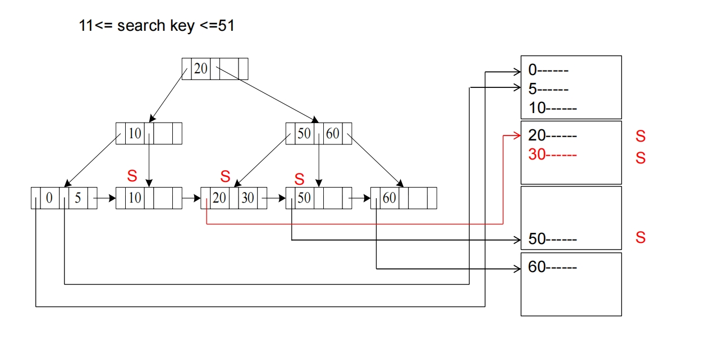

---

#### Next-Key Locking To Prevent Phantoms

Index-locking protocol to prevent phantoms required locking entire leaf

- Can result in poor concurrency if there are many inserts

之前的索引锁定协议为了预防幻影现象，需要锁定整个索引叶子节点。如果一个叶子节点包含很多记录，而事务只需要访问其中少量记录或者只是检查某个范围内是否存在记录，锁定整个叶子节点会导致较低的并发性，尤其是在有很多插入操作时。

Next-key locking protocol: provides higher concurrency

- Lock all values that satisfy index lookup (match lookup value, or fall in lookup range)

事务不仅锁定它通过索引查找到的所有满足查询条件的键值（无论是单个值还是一个范围内的所有值）。

- Also lock next key value in index

它还会额外锁定索引中紧跟在查询范围或查找值之后的那个"下一键值"。

    - even for inserts/deletes 这种"下一键"的锁定对于插入和删除操作同样重要。

- Lock mode: S for lookups, X for insert/delete/update

对于查找操作 (lookups)，使用共享锁 (S mode)。对于插入、删除、更新操作 (insert/delete/update)，使用排他锁 (X mode)。

Ensures that range queries will conflict with inserts/deletes/updates

这种机制可以确保范围查询 (range queries) 会与同时发生的插入、删除、更新操作发生冲突，无论哪个操作先发生。

- Regardless of which happens first, as long as both are concurrent

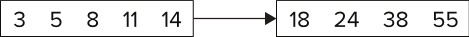

**预防幻影现象的原理**:

- 通过**锁定满足查询条件的键值**，可以防止其他事务对这些具体值进行修改（删除或更新）。
- 而通过锁定"下一键值"，实际上是锁定了一个区间或"间隙"（gap）的边界。如果另一个事务试图在这个被锁定的"下一键值"之前插入一个新记录（即插入到被锁定范围或间隙中），它就需要修改索引结构中与"下一键值"相关的部分，而这部分已经被锁定事务的 S 锁所保护（因为"下一键值"被锁定）。由于 S 锁和 X 锁（插入/删除/更新需要 X 锁来修改索引）不兼容，插入事务就会被阻塞，直到持有 S 锁的查找事务释放锁。
- 这样就防止了在事务关注的范围内出现"幻影"记录，因为任何试图在该范围插入新记录的操作都会被检测到并阻塞。

---

## Multiversion Concurrency Control Schemes

Multiversion schemes keep old versions of data item to increase concurrency.

Each successful write results in the creation of a new version of the data item written.

Use timestamps to label versions.

When a read(Q) operation is issued, select an appropriate version of Q based on the timestamp of the transaction, and return the value of the selected version.

Read only transactions never have to wait as an appropriate version is returned immediately for every read operation.

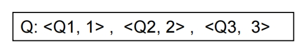

当一个事务需要读取数据项 Q 时，系统会根据该事务自身的时间戳，选择一个合适（通常是最新的、在事务时间戳之前的）版本提供给它读取，而不是让事务等待其他事务释放锁。这就是多版本并发控制提高并发性的主要方式，特别是对于只读事务，它们通常不需要等待锁就可以立即读取到某个版本的合适数据。

---

### Multiversion Two-Phase Locking

这种协议是一种并发控制方法，它结合了多版本技术和两阶段封锁，旨在提高并发性，特别是对于只读事务，同时保证可串行化。

Differentiates between read-only transactions and update transactions

每一次修改都要盖调原来的那一份，而多版本的修改是增加一个新的版本。对于只读，一定会读到最近的一个对的版本，那么只读的事务不需要等待。而只读的事务很多，可以大大提高并发。

SET TRANSACTIOIN READ ONLY;

SET TRANSACTION READ WRITE;

Update transactions

会读取数据，也可能会修改数据。

- Acquire read and write locks
- Hold all locks up to the end of the transaction. That is , follow **rigorous two-phase locking**.
- 这意味着更新事务获取的所有锁（S 锁和 X 锁）都必须保持到事务提交或中止。这是为了保证可串行化性。
- Each successful write results in the creation of a new version of the data item written.
- Each version of a data item has a single timestamp whose value is obtained from a counter ts-counter that is incremented during commit processing.

- 严厉的两阶段锁协议，为了保证可串行性

Read-only transactions

只读取数据，不修改数据。

- Assigned a timestamp by reading the current value of ts-counter before they start execution.
- When a read-only transaction $T_i$ issues a read(Q), the value returned is the contents of the version whose timestamp is the largest timestamp less than or equal to TS($T_i$). 

When an update transaction wants to read a data item:

- it obtains a S lock on it, and reads the latest version.
- 当一个只读事务 $T_i$ 开始执行前，会被分配一个时间戳 TS($T_i$)。这个时间戳通常就是事务开始时 ts-counter 的当前值。
- 当只读事务 $T_i$ 读取数据项 Q 时，它永远不需要等待任何锁。
- 系统会查找并返回数据项 Q 的所有版本中，时间戳最大且小于或等于 TS($T_i$) 的那个版本的值。

当一个更新事务想要读取数据项 Q 时：

1. 它会获取数据项 Q 的共享锁 (S lock)。
2. 它读取数据项 Q 的最新版本 (latest version)。例如图中获取 S 锁后读取 `<Q3, 3>`，这是当前最新的已提交版本。

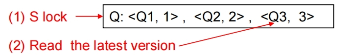

When an update transaction wants to write an item

it obtains X lock on; it then creates a new version of the item and sets this version's timestamp to $\infty$

当一个更新事务想要写入数据项 Q 时：

1. 它会获取数据项 Q 的排他锁 (X lock)。
2. 它创建一个新的数据项 Q 的版本，并暂时将这个新版本的时间戳设置为无穷大 ($\infty$)。例如图中获取 X 锁后创建新版本 `<Q4, ∞>`。这个 $\infty$ 时间戳表示这个版本尚未提交，其他事务不能读取它。

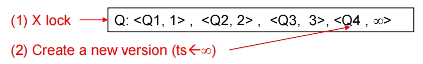

When update transaction $T_i$ completes, commit processing occurs:

$T_i$ sets timestamp on the versions it has created to ts-counter + 1

$T_i$ increments ts-counter by 1

Unlock all locks it holds

当一个更新事务 $T_i$ 成功完成并准备提交时：

1. 它会将其创建的所有新版本的临时时间戳 ($\infty$) 更改为 `ts-counter + 1`。 这个值成为该版本的最终时间戳。例如图中 `<Q4, ∞>` 的时间戳被设置为 4，假定 ts-counter 当前是 3。
2. 它将 `ts-counter` 的值增加 1。 例如图中 `ts-counter` 从 3 变成 4。
3. 最后，它释放所有持有的锁。

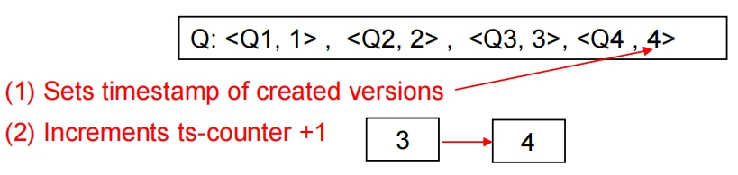

When a read-only transaction $T_i$ issues a read(Q), the value returned is the contents of the version whose timestamp is the largest timestamp less than or equal to TS($T_i$).

- T3 指向版本 `<Q3, 3>` 和 `<D3, 3>`，这意味着 T3 创建并提交了 Q 的版本 3 和 D 的版本 3。
- T4 指向版本 `<Q4, 4>`，这意味着 T4 创建并提交了 Q 的版本 4。

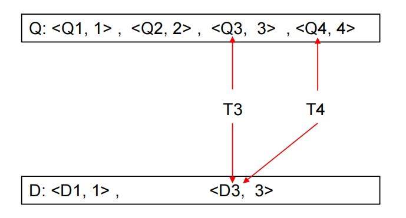

Only serializable schedules are produced.

**优点和结果**：

1. **大大提高并发性**: 由于只读事务永远不需要等待锁，可以立即读取历史版本，这在高读负载的系统中能显著提高并发性。
2. **可串行化**: 通过让更新事务遵循严厉两阶段封锁，并使用时间戳来确定只读事务可以看到哪个版本，这种协议能够保证产生的调度是可串行化的 (serializable schedules)。这意味着并发执行的结果等价于某种串行执行的结果。

??? note "我的一些疑问"
    如果只读事务读取的是历史版本而不是最新的数据，这在某些场景下可能会让人觉得"不是最新的"而产生疑虑。

    但是，从数据库**并发控制**和**事务隔离性**的角度来看，多版本并发控制（MVCC）让只读事务读取历史版本的设计**不会**导致问题，并且是其核心优势之一。

    原因如下：

    1.  **事务隔离级别的目标：** 数据库并发控制的主要目标不是让所有事务都能实时看到绝对最新的、正在被其他事务修改的数据，而是要保证事务之间的**隔离性**，使得每个事务感觉自己是独立运行的，从而保证数据库的**一致性**。不同的隔离级别允许不同程度的"非最新"或"不一致"的读取，以换取并发性。
    2.  **MV2PL 保证可串行化：** 多版本两阶段封锁协议（MV2PL）设计的目标是实现**可串行化 (Serializability)** 隔离级别。可串行化是最高的隔离级别，它保证了并发执行的结果等价于某种**串行执行**的结果。
    3.  **只读事务的“快照”：** 在 MV2PL 中，只读事务读取的是一个**一致性快照 (Consistent Snapshot)** 的数据。这个快照反映的是数据库在只读事务开始时（或者更精确地说，是对应于该只读事务时间戳的那个时刻）的一个状态。
    4.  **与串行执行的等价性：** 让只读事务读取历史版本，等价于将这个只读事务在串行执行顺序中安排在所有比它时间戳晚的更新事务**之前**。在这个“等价的串行执行顺序”中，该只读事务看到的数据就是那个时刻的数据，这完全符合逻辑。
    5.  **避免冲突，提高并发：** 关键在于，只读事务读取历史版本的设计，使得它**不会**与正在修改当前版本的更新事务发生**读写冲突（Write-Read Conflict）**。因为它们操作的是数据的不同版本。这样一来，只读事务就不会被更新事务所持有的写锁阻塞，可以立即执行，极大地提高了只读事务的并发性。

---

## MVCC: Implementation Issues

Creation of multiple versions increases storage overhead

- Extra tuples 
- Extra space in each tuple for storing version information 

随着时间的推移，一个数据项可能会积累大量的历史版本，这会带来两个主要问题：

1. **存储开销增加**: 保存多个版本需要额外的存储空间。
2. **查找效率下降**: 查找特定版本需要遍历更多的数据。

Obsolete versions should be garbage collected

Keep the youngest version $Q_k$ among all versions whose timestamp is less than or equal to the timestamp of the oldest read-only transaction in the system, all other versions older than the $Q_k$ can be deleted.

垃圾回收的一个常见策略是：保留所有时间戳小于或等于系统中"最老的活跃的只读事务"的时间戳的那个版本 $Q_k$ 的最新的版本，所有比 $Q_k$ 更老的版本都可以删除。

这是因为，如果最老的活跃只读事务的时间戳决定了它最多只需要读取到 `<Q3, 3>` 版本（例如，它的时间戳在 Q3 和 Q4 的时间戳之间），那么比 `<Q3, 3>` 更老的版本（`<Q1, 1>` 和 `<Q2, 2>`）对于当前以及未来所有时间戳更晚的事务来说，都是不可见的，因此可以安全地删除。

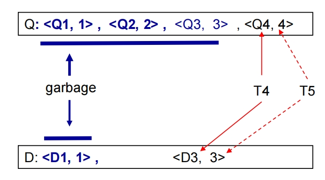

---