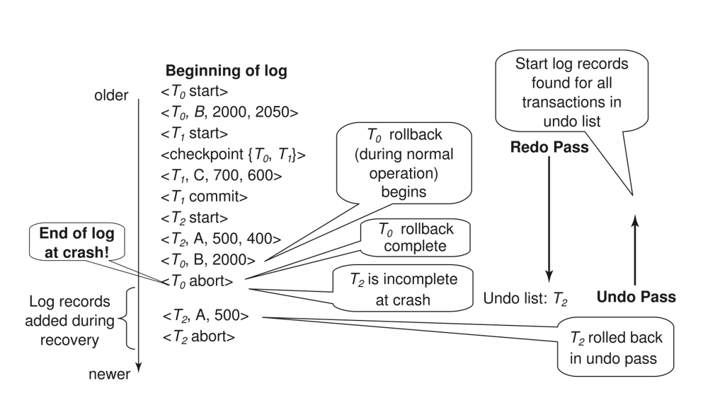

# Chapter 19 | Recovery System

## Failure Classification

**Transaction failure** :

- Logical errors: transaction cannot complete due to some internal error condition 指应用程序代码本身的缺陷，比如算法错误、业务逻辑处理不当等，导致对数据库的错误操作请求。
- System errors: the database system must terminate an active transaction due to an error condition (e.g., deadlock) 这里可能指应用程序层面的系统级错误，比如应用资源耗尽、配置错误、或者与其他系统交互时发生的错误。

**System crash**: a power failure or other hardware or software failure causes the system to crash.

- Fail-stop assumption: non-volatile storage contents are assumed to not be corrupted by system crash

    - Database systems have numerous integrity checks to prevent corruption of disk data 

**Disk failure**: a head crash or similar disk failure destroys all or part of disk storage

- Destruction is assumed to be detectable: disk drives use checksums to detect failures

---

## Storage Structure

**Volatile storage**:

- does not survive system crashes
- examples: main memory, cache memory

**Nonvolatile storage**:

- survives system crashes
- examples: disk, tape, flash memory, non-volatile (battery backed up) RAM 
- but may still fail, losing data

**Stable storage**:

- a mythical form of storage that survives all failures
- approximated by maintaining multiple copies on distinct nonvolatile media

---

### Database Recovery

**Recovery algorithms** are techniques to ensure database **consistency** and transaction **atomicity** and **durability** despite failures

**Recovery algorithms** have two parts

1. Actions taken during **normal transaction processing** to ensure enough information exists to recover from failures
2. Actions taken after a failure to **recover** the database contents to a state that ensures atomicity, consistency and durability

    - We assume that **strict two-phase locking** ensures **no dirty read**.
    - **Idempotent**(幂等性) : An recovery algorithm is said to be idempotent if executing it several times gives the same result as executing it once. 

We study log-based recovery mechanisms in detail

- We first present key concepts
- And then present the actual recovery algorithm

---

## Log-Based Recovery

### Log Records

To ensure atomicity despite failures, we first output information describing the modifications(**log**) to stable storage without modifying the database itself.

A **log** is kept on **stable storage**(稳定存储器).

- The log is a sequence of **log records**, and maintains a record of update activities on the database.

When transaction $T_i$ starts, it registers itself by writing a "start" log record: <$T_i$  start>

Before $T_i$ executes **write**(X), writing "update" log record <$T_i$, X,  $V_1$, $V_2$ > where $V_1$ is the value of X before the write (the old value), $V_2$ is the value to be written to X (the new value). 

When $T_i$ finishes it last statement, writing "commit" log record: <$T_i$ commit>

When $T_i$ complete rollback, writing "abort" log record: <$T_i$ abort>

---

#### Log File Example

---

#### Write-Ahead Logging (先写日志原则)

Write-Ahead Logging or WAL(先写日志原则): 

Before a data in main memory is output to the database, the log records pertaining to data must have been output to stable storage. 

---

## Concurrency Control and Recovery

With concurrent transactions, all transactions share a single disk buffer and a single log file.

- A buffer block can have data items updated by one or more transactions

We assume **that if a transaction $T_i$ has modified an item, no other transaction can modify the same item until $T_i$ has committed or aborted**

- i.e. the updates of uncommitted transactions should not be visible to other transactions. Otherwise how to perform undo if T1 updates A, then T2 updates A and commits, and finally T1 has to abort?
- Can be ensured by obtaining exclusive locks on updated items and holding the locks till end of transaction (**strict two-phase locking**)

Recovery with logical undo logging supports early lock release.

---

## Transaction Commit

A transaction is said to have committed when its **commit log record** is output to stable storage

- all previous log records of the transaction must have been output already

Writes performed by a transaction may still be in the **buffer** when the transaction commits, and may be output later

---

## Undo(撤销) and Redo（重做）Operations

Undo of a log record <$T_i$, X, $V_1$, $V_2$> writes the old value $V_1$ to X

Redo of a log record <$T_i$, X, $V_1$, $V_2$> writes the new value $V_2$ to X

Undo and Redo of Transactions

- **undo($T_i$)** restores the value of all data items updated by $T_i$ to their old values, going backwards from the last log record for $T_i$

1. each time a data item X is restored to its old value V a special log record <$T_i$ , X, V> is written out – **compensation log**(补偿日志)
2. when undo of a transaction is complete, a log record <$T_i$ abort> is written out.

- **redo($T_i$)** sets the value of all data items updated by $T_i$ to the new values, going forward from the first log record for $T_i$

1. No logging is done in this case

---

## Recovering from Failure

When recovering after failure:

- Transaction $T_i$ needs to be **undone** if the log 

1. contains the record <$T_i$ start>,
2. but does not contain either the record <$T_i$ commit> or <$T_i$ abort>.

- Transaction $T_i$ needs to be **redone** if the log 

1. contains the records <$T_i$ start>
2. and contains the record <$T_i$ commit> or <$T_i$ abort>

---

### Recovering from Failure - Repeating History

Note that If transaction $T_i$ was undone earlier and the <$T_i$ abort> record written to the log, and then a failure occurs, on recovery from failure $T_i$ is **redone**

- such a redo redoes all the original actions including the steps that restored old values

1. Known as **repeating history**（重复历史）
2. Seems wasteful, but simplifies recovery greatly

---

## Checkpoints

Redoing/undoing all transactions recorded in the log can be very slow

1. processing the **entire log** is **time-consuming** if the system has run for a long time
2. we might unnecessarily redo transactions which have already output their updates to the database.

Streamline recovery procedure by periodically performing **checkpointing**

1. Output all log records currently residing in main memory onto stable storage.
2. Output all modified buffer blocks to the disk.
3. Write a log record `<checkpoint L>` onto stable storage where L is a list of all transactions active at the time of checkpoint.
4. All updates are stopped while doing checkpointing!

During recovery we need to consider only the most recent transaction $T_i$ that started before the checkpoint, and transactions that started after $T_i$. 

1. Scan backwards from end of log to find the most recent `<checkpoint L>` record 
2. Only transactions that are in L or started after the checkpoint need to be redone or undone
3. Transactions that committed or aborted before the checkpoint already have all their updates output to stable storage.

Some earlier part of the log may be needed for undo operations

1. Continue scanning backwards till a record <$T_i$ start> is found for every transaction $T_i$ in L.
2. Parts of log prior to earliest <$T_i$ start> record above are not needed for recovery, and can be erased whenever desired.

---

## Recovery Algorithm

Logging (during normal operation):

- <$T_i$ start> at transaction start
- <$T_i$, $X_j$,  $V_1$,  $V_2$> for each update, and
- <$T_i$ commit> at transaction end

Transaction rollback (during normal operation)

- Let $T_i$ be the transaction to be rolled back
- Scan log backwards from the end, and for each log record of $T_i$ of the form <$T_i$, $X_j$,  $V_1$,  $V_2$>`

1. perform the undo by writing $V_1$ to $X_j$,
2. write a log record <$T_i$ , $X_j$,  $V_1$>

    - such log records are called compensation log records(补偿记录)

- Once the record <$T_i$ start> is found stop the scan and write the log record <$T_i$ abort>

Recovery from failure: Two phases

- **Redo phase**:  replay updates of all transactions, whether they committed, aborted, or are incomplete –**repeating history** !
- **Undo phase**: undo all incomplete transactions

Redo phase:

1. Find last `<checkpoint L>` record, and set **undo-list** to L.
2. Scan forward from above `<checkpoint L>` record

- Whenever a  record <$T_i$, $X_j$, $V_1$, $V_2$> is found, redo it by writing $V_2$ to $X_j$ 
- Whenever a  (compensation) log record <$T_i$, $X_j$, $V_2$> is found, redo it by writing $V_2$ to $X_j$ 
- Whenever a log record <$T_i$ start> is found, add $T_i$ to undo-list
- Whenever a log record <$T_i$ commit> or <$T_i$ abort> is found, remove $T_i$ from **undo-list**

Undo phase: 

1. Scan log backwards from end 

- Whenever a log record <$T_i$, $X_j$,  $V_1$,  $V_2$> is found where $T_i$ is in undo-list perform same actions as for transaction rollback:
 
    - perform undo by writing $V_1$ to $X_j$.
    - write a log record <$T_i$ , $X_j$,  $V_1$>

2. Whenever a log record <$T_i$ start> is found where $T_i$ is in undo-list, 

    - Write a log record <$T_i$ abort>`
    - Remove $T_i$ from undo-list

3. Stop when undo-list is empty

    - i.e. <$T_i$ start> has been found for every transaction in undo-list

After undo phase completes, normal transaction processing can commence

---

### Example of Recovery

---

## Log Buffer & Database Buffer

Transactions (事务): 代表用户或应用程序发起的数据库操作序列（如读取、写入、更新数据）。它们是数据库工作的驱动力。

database buffer (数据库缓冲区):

- 这是主内存中的一块区域，用于缓存从磁盘读取的数据页（data pages）以及将要写回磁盘的数据页。
- 当事务需要读取数据时，系统首先检查数据是否已在数据库缓冲区中。如果在，则直接从内存读取，避免了慢速的磁盘 I/O。
- 当事务修改数据时，它首先修改数据库缓冲区中相应的数据页。这些被修改但尚未写入磁盘的页通常被称为"脏页"（dirty pages）。图中深色填充的块可以理解为正在被事务访问或已修改的数据块。

log buffer (日志缓冲区):

- 这也是主内存中的一块区域，用于临时存放描述事务对数据库所做更改的日志记录（log records）。
- 每当事务修改数据时，相应的日志记录（例如，哪个事务、修改了什么数据、旧值是什么、新值是什么）会首先被写入到日志缓冲区。

Log Writer (日志写入器):

这是一个后台进程或机制，负责将日志缓冲区中的内容刷新（写入）到磁盘上的持久化存储的日志文件中。

为了保证已提交事务的持久性，数据库系统通常会遵循一个非常重要的原则："提交时强制写日志" (Force-log-at-commit)。这意味着，当一个事务执行 `COMMIT` 操作时：

该事务所有的日志记录，包括一个标记其提交状态的特殊日志记录（例如 `<T_i commit>`），都必须被放入 log buffer。

在向应用程序返回"提交成功"的消息之前，DBMS 必须确保 log buffer 中与该事务相关的所有日志记录（至少到其 commit 记录为止）都已经被强制刷新 (flush) 并成功写入到磁盘上的 log file 中。(有时候是很多一起写回去，看选择)。

**Log record buffering**: log records are buffered in main memory, instead of of being output directly to stable storage.

- Log records are output to stable storage when a block of log records in the buffer is full, or a **log force** operation is executed.

Log force is performed to commit a transaction by forcing all its log records (including the commit record) to stable storage.

**Group commit** : several log records can be output using a single output operation, reducing the I/O cost. 

The rules below must be followed if log records are buffered:

- Log records are output to stable storage in the order in which they are created. 
- Transaction $T_i$ enters the commit state only when the log record <$T_i$ commit> has been output to stable storage.
- Before a block of data in main memory is output to the database, all log records pertaining to data in that block must have been output to stable storage. 

This rule is called the **write-ahead logging** or **WAL** rule

Strictly speaking WAL only requires undo information to be output

Database maintains an in-memory buffer of data blocks

- When a new block is needed, if buffer is full an existing block needs to be removed from buffer
- If the block chosen for removal has been updated, it must be output to disk

The recovery algorithm supports the **no-force policy**(非强制): i.e., updated blocks need not be written to disk when transaction commits

- 采用 `No-Force` 策略时，当一个事务提交 (`commits`) 时，不需要立即将该事务修改过的所有数据块（脏块）从内存缓冲区写回到磁盘。这些脏块可以继续保留在内存中，直到缓冲区管理器因为其他原因（比如缓冲区满，需要替换块）决定将它们写回磁盘，或者直到发生检查点 (checkpoint) 操作时才写回。

- **force policy**（强制）: requires updated blocks to be written at commit 事务的提交操作会触发一个同步的磁盘写操作，直到所有相关的脏块都安全地写入磁盘后，事务才算真正完成提交。由于已提交事务的所有修改都已在磁盘上，如果系统崩溃，恢复时通常不需要对这些已提交事务进行重做 (REDO) 操作（因为它们的数据已经"强制"写入了）。

    - More expensive commit

The recovery algorithm supports the **steal policy**（窃取策略）:i.e., blocks containing updates of uncommitted transactions can be written to disk, even before the transaction commits

采用Steal策略（或者叫 STEAL 允许）意味着，内存缓冲区中的数据块，即使它包含了尚未提交 (uncommitted) 事务的修改，也可以在事务提交之前被选择并写回到磁盘。当缓冲区管理器需要空间时，它可以"窃取"一个脏块（即使这个脏块上的修改来自一个还没提交的事务），将其写回磁盘，然后重用这个缓冲槽。缓冲区管理器有更大的灵活性来选择哪些块被替换出去，不需要等待事务提交。这可以避免缓冲区因为等待事务提交而被少数活动事务的脏块占满。如果一个包含未提交事务修改的数据块被写回磁盘，而该事务后来中止 (aborts) 了，那么这些已经被写到磁盘上的修改必须被撤销。这就要求日志系统必须能够支持撤销 (UNDO) 操作。在系统恢复时，如果发现磁盘上有这类事务的修改，也需要通过日志进行UNDO。

---

## Fuzzy Checkpointing

To avoid **long interruption** of normal processing during checkpointing, allow updates to happen during **checkpointing**

**Fuzzy checkpointing** is done as follows:

1. Temporarily stop all updates by transactions
2. Write a `<checkpoint L>` log record and force log to stable storage
3. Note list M of modified buffer blocks
4. Now permit transactions to proceed with their actions
5. Output to disk all modified buffer blocks in list M

- blocks should not be updated while being output
- Follow WAL: all log records pertaining to a block must be output before the block is output

6. Store a pointer to the **checkpoint** record in a fixed position **last_checkpoint** on disk

When recovering using a fuzzy checkpoint, start scan from the checkpoint record pointed to by last_checkpoint

- Log records before last_checkpoint have their updates reflected in database on disk, and need not be redone.
- Incomplete checkpoints, where system had crashed while performing checkpoint, are handled safely

这样做的主要好处是缩短系统崩溃后的恢复时间。如果没有检查点，恢复过程可能需要从日志文件的最开始进行扫描，这会非常耗时。有了检查点，恢复过程只需要从最近的检查点开始处理日志即可。

模糊检查点的执行步骤：

1. 暂时停止所有事务的更新。这是一个非常短暂的暂停。目的是为了获取一个一致的检查点开始时刻的状态。
2. 写入 `<checkpoint L>` 日志记录并强制刷盘。
3. 记录已修改缓冲块列表 M。
4. 允许事务继续执行其操作。
5. 将列表 M 中的所有已修改缓冲块输出到磁盘。块在输出时不应被更新。遵循预写日志。
6. 在磁盘固定位置 `last_checkpoint` 存储指向检查点记录的指针。

使用模糊检查点进行恢复：

1. 定位检查点： 恢复管理器首先读取磁盘上固定位置 `last_checkpoint` 的指针，找到日志文件中最近一次成功完成的模糊检查点记录 `<checkpoint L>`。
2. 开始扫描日志： 从这个 `<checkpoint L>` 记录的位置开始向前扫描日志文件。`<checkpoint L>` 之前的日志记录，对于这个检查点记录之前的日志，理论上它们所描述的更新已经通过检查点过程反映到磁盘上的数据库中了。因此，这些日志记录通常不需要被重做。（注意：这里有一个细微之处，因为是"模糊"检查点，在 `<checkpoint L>` 之后、但在列表 M 中的块被完全写盘之前，仍可能有事务提交。严格来说，REDO 过程是从检查点记录中包含的最早的未完成事务的第一个日志记录或最早的脏页的LSN开始，但检查点确实大大减少了需要 REDO 的日志范围）。`<checkpoint L>` 之后的日志记录，需要对这些日志记录进行分析，以确定哪些事务需要重做 (REDO)（已提交但其修改可能未完全写入数据文件），哪些事务需要撤销 (UNDO)（未提交）。
3. 处理不完整的检查点： 如果系统在执行检查点过程的途中崩溃了。这种不完整的检查点是"无效"的，因为 `last_checkpoint` 指针还没有更新到指向这个正在进行的检查点记录。恢复过程会使用上一个成功完成的检查点记录进行恢复。即使新的 `<checkpoint L>` 记录已经写入日志，但只要 `last_checkpoint` 指针没更新，或者在恢复时发现列表 M 中的块没有完全写完，系统也能安全地处理这种情况，通常会忽略这个不完整的检查点，从更早的检查点开始恢复，或者依赖更复杂的恢复逻辑来确定哪些块确实被写了。ARIES 等算法对此有详细的处理机制，确保数据的一致性和可恢复性。

---

### Failure with Loss of Nonvolatile Storage

So far we assumed no loss of non-volatile storage

Technique similar to checkpointing used to deal with loss of non-volatile storage

这是一种周期性地将数据库的全部内容复制到稳定存储 (stable storage) 的过程。这里的"稳定存储"通常指独立于主数据库存储的、更可靠的存储介质，例如磁带、另一组磁盘阵列（RAID配置）、或云存储等，目的是防止单点物理故障。

- Periodically **dump** the entire content of the database to stable storage
- No transaction may be active during the dump procedure; a procedure similar to checkpointing must take place 在转储期间不允许有活动的事务。

1. Output all log records currently residing in main memory onto stable storage. 将主内存中所有日志记录输出到稳定存储。确保所有在内存日志缓冲区中的日志都已写入磁盘上的日志文件。
2. Output all buffer blocks onto the disk. 将所有缓冲块输出到磁盘。确保所有在内存数据库缓冲区中的脏页（已修改的数据块）都已写回磁盘上的数据库主文件。这一步完成后，磁盘上的数据库文件反映了在转储开始前所有已提交事务的结果。
3. Copy the contents of the database to stable storage. 将数据库内容复制到稳定存储。现在，将磁盘上整个数据库文件的内容完整地复制到一个独立的、安全的稳定存储位置。这就是"转储"或"备份"的核心步骤。
4. Output a record `<dump>` to log on stable storage. 在稳定存储的日志中输出 `<dump>` 记录。这个标记指明了到此为止，数据库的一个完整快照已经成功创建并保存在稳定存储中。这个日志本身也应该在稳定存储上。

---

### Recovering from Failure of Non-Volatile Storage

To recover from disk failure 

1. restore database from  most recent dump.  从最近的转储恢复数据库。
2. Consult the log and redo all transactions that committed after the dump 查阅日志并重做转储之后提交的所有事务。

Can be extended to allow transactions to be active during dump; known as **fuzzy dump** or **online dump**

- Similar to fuzzy checkpointing

---

## Recovery with Early Lock Release and Logical Undo Operations

Support for high-concurrency locking techniques, such as those used for **B+-tree concurrency control**, which release locks early

在高并发数据库系统中，为了提升性能，常常会采用一些高级的并发控制技术，尤其是在处理像 B+ 树这样的索引结构时。这些技术的一个特点是提前释放锁。这种提前释放锁的策略虽然能显著提高并发度，但也给事务的回滚（撤销 undo）和系统恢复带来了挑战。传统的基于"重复历史"（repeating history，即恢复时精确重演事务的原始操作和撤销操作）的恢复机制需要调整。

- Supports "logical undo"

Recovery based on "repeating history", whereby recovery executes exactly the same actions as normal processing

逻辑撤销 (Logical Undo): 指的是执行一个与原操作语义相反的操作来达到撤销的效果，而不是简单地恢复旧值。它关注的是操作的逻辑效果。

---

### Logical Undo Logging

Operations like **B+-tree insertions and deletions release locks early**. 

- They cannot be undone by restoring old values (**physical undo**), since once a lock is released, other transactions may have updated  the B+-tree.
- Instead, insertions (resp. deletions) are undone  by executing a deletion (resp. insertion) operation (known as **logical undo**).  

当操作（如 B+ 树的插入和删除）提前释放锁时：

- 一旦锁被释放，其他事务就可以访问并可能修改这个结构（例如 B+ 树节点）。
- 如果原事务后来需要中止 (abort) 并撤销其操作，那么简单地将 B+ 树节点恢复到其旧的物理状态（物理撤销）是行不通的，因为这可能会覆盖掉其他（可能已提交的）事务对该节点所做的合法修改，破坏数据一致性。

For such operations, undo log records should contain the undo operation to be executed

- Such logging is called **logical undo logging**, in contrast to **physical undo logging**

Operations are called logical operations

- Other examples:

1. delete of tuple, to undo insert of tuple, allows early lock release on space allocation information
2. subtract amount deposited, to undo deposit, allows early lock release on bank balance

对于这类提前释放锁的操作，它们的撤销不能通过恢复旧值来进行。

相反，插入 (insertions) 操作通过执行一个删除 (deletion) 操作来撤销。删除 (deletions) 操作通过执行一个插入 (insertion) 操作来撤销。 这种语义上相反的操作就是逻辑撤销。

对于这类需要逻辑撤销的操作，其对应的撤销日志记录 (undo log records) 不应该包含旧的物理值。

相反，这些日志记录应该包含将要被执行的逻辑撤销操作本身的信息（例如，要删除哪个键，或者要插入哪个键值对）。

这种记录日志的方式被称为逻辑撤销日志 (logical undo logging)，以区别于记录旧物理值的物理撤销日志 (physical undo logging)。

---

### Physical Redo

Redo information is logged **physically** (that is, new value for each write) even for operations with logical undo

- Logical redo is very complicated since database state on disk may not be "operation consistent" when recovery starts
- Physical redo logging does not conflict with early lock release

即使对于那些支持"逻辑撤销"的操作（比如 B+ 树操作），其重做 (redo) 信息通常还是以物理方式记录的。

物理记录方式：指的是日志中记录的是数据写入的"新值"（new value for each write）。例如，如果一个操作将页面 P 的某个位置从旧值 A 修改为新值 B，那么物理重做日志就会记录"将页面 P 的这个位置设置为 B"。

**为什么不用逻辑重做？**

逻辑重做非常复杂，因为当系统从崩溃中恢复开始时，磁盘上的数据库状态可能不是"操作一致的"(operation consistent)。这意味着磁盘上的数据可能处于一个中间状态，直接在其上执行一个逻辑重做操作（比如"在 B+ 树中插入一个键"）可能会因为前提条件不满足而失败或产生错误结果。

重做阶段的目标是快速将数据库恢复到崩溃前的状态（或者一个可以进行后续撤销操作的一致状态），物理重做最简单直接，能有效达到这个目的。

---

### Operation Logging

Operation logging is done as follows:

1. When operation starts, log <$T_i$, $O_j$,  operation-begin>. Here Oj is a unique identifier of the operation instance.
2. While operation is executing, normal log records with physical redo and physical undo information are logged. 
3. When operation completes, <$T_i$, $O_j$,  operation-end, U> is logged, where U contains information  needed to perform a logical undo information.

Example: insert of (key, record-id) pair (K5, RID7) into index I9

If crash/rollback occurs before operation completes:

- the **operation-end** log record is not found, and 
- the physical undo information is used to undo operation.

If crash/rollback occurs after the operation completes:

- the **operation-end** log record is found, and in this case
- logical undo is performed using U;  the physical undo information for the operation is ignored.

Redo of operation (after crash) still uses physical redo information.

操作日志的记录步骤如下：

操作开始时：当一个这类特殊操作（比如 B+ 树插入 $O_j$，由事务 $T_i$ 执行）开始时，记录一条日志：<$T_i$, $O_j$, operation-begin>。这里的 $O_j$ 是这个操作实例的唯一标识符。

操作执行期间：在操作 $O_j$ 执行的过程中，系统仍然像往常一样记录包含物理重做和物理撤销信息的普通日志记录。例如，如果操作 $O_j$ 修改了页面 X 的值从 $V_1$ 到 $V_2$，会记录 <$T_i$, X, $V_1$, $V_2$>。这些物理撤销信息是"备用"的。

操作完成时：当操作 $O_j$ 成功完成时，记录一条日志：<$T_i$, $O_j$, operation-end, U>。这里的 U 包含了执行该操作的逻辑撤销所需的信息。例如，如果 $O_j$ 是一个 B+ 树插入操作，U 可能包含要删除的键。

如果崩溃/回滚发生在操作完成之前：

1. 这意味着在日志中找不到对应的 <$T_i$, $O_j$, operation-end, U> 记录。
2. 此时，系统会使用在操作执行期间记录的物理撤销信息来撤销该操作（例如，使用 $V_1$ 恢复页面 X）。

如果崩溃/回滚发生在操作完成之后：

1. 这意味着在日志中找到了对应的 <$T_i$, $O_j$, operation-end, U> 记录。
2. 在这种情况下，系统会执行逻辑撤销，使用 U 中提供的信息。此时，该操作对应的物理撤销信息将被忽略。

---

### Transaction Rollback with Logical Undo

Rollback of transaction $T_i$ is done as follows: 

Scan the log backwards 

1. If a log record <$T_i$, X, $V_1$, $V_2$> is found, perform the undo and log <$T_i$, X, V1>.

遇到普通物理撤销日志记录：如果找到一条形如 <$T_i$, X, $V_1$, $V_2$> 的日志记录（表示 $T_i$ 将 X 从 $V_1$ 修改为 $V_2$），则执行物理撤销（将 X 的值恢复为 $V_1$），并记录一条补偿日志（Compensation Log Record, CLR），通常形式为 <$T_i$, X, V1> (表示将 X 的值改为 $V_1$，并且这个 CLR 本身是只重做 redo-only 的)。

2. If a <$T_i$, $O_j$,  operation-end, U> record is found

- Rollback the operation logically using the undo information U.  此时，必须使用 U 中包含的信息来逻辑地回滚操作 $O_j$ 。例如，如果 $O_j$ 是插入，则执行删除。

Updates performed during roll back are logged just like during normal operation execution. 在执行这个逻辑撤销操作期间所做的更新（比如逻辑删除导致对 B+ 树节点的修改）会像正常操作执行时一样被记录到日志中（包括它们自己的物理重做和物理撤销信息）。

At the end of the operation rollback, instead of logging an  operation-end record, generate a record  <$T_i$, $O_j$, operation-abort>. 当这个逻辑撤销操作完成后，系统不会记录一个 operation-end 记录，而是生成一条特殊的记录：<$T_i$, $O_j$, operation-abort>。

- skip all preceding log records for $T_i$ until the record <$T_i$, $O_j$ operation-begin> is found. 在记录了 `operation-abort` 之后，跳过日志中所有属于事务 $T_i$ 的、早于此 `operation-abort` 记录的、且与操作 $O_j$ 相关的日志记录，直到找到该操作对应的 <$T_i$, $O_j$ operation-begin> 记录。这是为了避免对 $O_j$ 内部的细粒度物理修改进行不必要的物理撤销。

Transaction rollback, scanning the log backwards (cont.):

1. If a redo-only record is found ignore it  遇到只重做 (redo-only) 记录忽略它们，因为回滚阶段只关心撤销操作。
2. If a <$T_i$, $O_j$, operation-abort> record is found: 遇到 <$T_i$, $O_j$ operation-begin> 记录

- skip all preceding log records for $T_i$ until the record <$T_i$, $O_j$, operation-begin> is found. 这表示操作 $O_j$ 之前已经被（可能是部分地）回滚了（例如，在一次崩溃前的回滚尝试中）。为了避免重复回滚，此时需要跳过所有属于事务 $T_i$ 的、早于此 operation-abort 记录的、且与操作 $O_j$ 相关的日志记录，直到找到该操作对应的 <$T_i$, $O_j$, operation-begin> 记录。

3. Stop the scan when the record <$T_i$, start> is found. 当找到该事务的开始记录 <$T_i$, start> 时，回滚过程（对于这个事务而言）结束。
4. Add a <$T_i$,  abort> record to the log. 最后，在日志中添加一条 <$T_i$, abort> 记录，正式标记该事务已中止。

Some points to note:

Cases 3 and 4 above can occur only if the database crashes while a transaction is being rolled back.

上述的即在回滚扫描中遇到 `operation-abort` 记录，以及扫描到 `transaction-start` 记录后停止，主要发生在数据库在一个事务正在回滚的过程中又发生了崩溃的场景。

Skipping of log records as in case 4 is important to prevent multiple rollback of the same operation.

---

## Recovery Algorithm with Logical Undo

Basically same as earlier algorithm, except for changes described earlier for transaction rollback

1. (Redo phase): Scan log forward from last < checkpoint L> record till end of log

- Repeat history by physically redoing all updates of  all transactions, 
- Create an undo-list during the scan as follows

undo-list is set to L initially

Whenever <$T_i$ start> is found $T_i$ is added to undo-list

Whenever <$T_i$ commit> or <$T_i$ abort> is found, $T_i$ is deleted from undo-list

This brings database to state as of crash, with committed as well as uncommitted transactions having been redone.

Now undo-list contains transactions that are incomplete, that is, have neither committed nor been fully rolled back.

Recovery from system crash (cont.)

(Undo phase): Scan log backwards, performing undo on log records of transactions found in undo-list. 

- Log records of transactions being rolled back are processed as described earlier, as they are found

Single shared scan for all transactions being undone

- When <$T_i$ start> is found for a transaction $T_i$ in  undo-list, write a <$T_i$ abort> log record.
- Stop scan when <$T_i$ start> records have been found for all $T_i$ in undo-list

This undoes the effects of incomplete transactions (those with neither commit nor abort log records). Recovery is now complete.

这个算法基本上与早期的恢复算法相同，只是针对事务回滚部分做了先前描述的（关于逻辑撤销和操作日志的）修改。

1. 重做阶段 (Redo Phase) ➡️

此阶段的目标是将数据库恢复到崩溃发生时的确切状态，确保所有已写入日志的修改都反映在数据页上。

* **扫描方向**：从最后一个检查点记录 `<checkpoint L>` 开始，**向前**扫描日志，直到日志的末尾（即崩溃点）。
* **核心操作**：

    * **重复历史 (Repeat history)**：通过**物理重做 (physically redoing)** 所有事务的所有更新操作。这意味着对于日志中的每一条物理修改记录（例如 <$T_i$, X, OldVal, NewVal>），都会将其新值 `NewVal` 应用到数据项 `X` 上。
    * **构建撤销列表 (undo-list)**：在向前扫描的过程中，动态地构建一个 `undo-list`。这个列表包含了在崩溃时尚未完成（既未提交也未中止）的事务。

        * 初始时，`undo-list` 被设置为检查点记录 `L` 中包含的活动事务列表。
        * 当扫描到 <$T_i$ start> 日志记录时，将事务 $T_i$ 添加到 `undo-list` 中。
        * 当扫描到 <$T_i$ commit> 或 <$T_i$ abort> 日志记录时，将事务 $T_i$ 从 `undo-list` 中删除。

* **阶段结果**：

    * 此阶段完成后，数据库的状态与崩溃发生时的状态完全一致。所有事务（无论是最终提交的还是未提交的）的、且已记录在日志中的修改都已经被重做到了数据库中。
    * 此时，`undo-list` 中包含的是所有**不完整的事务**，即那些既没有提交记录也没有完全回滚中止记录的事务。这些事务的影响需要在下一阶段被撤销。

2. 撤销阶段 (Undo Phase) ⬅️

此阶段的目标是撤销所有在 `undo-list` 中的不完整事务造成的影响，确保数据库的原子性。

* **扫描方向**：从日志的末尾开始，**向后**扫描日志。
* **核心操作**：

    * 对 `undo-list` 中事务的日志记录执行撤销操作。
    * **关键**：当遇到需要回滚的事务的日志记录时，这些记录会**按照先前描述的方式进行处理**。这就是逻辑撤销发挥作用的地方：

        * 如果遇到普通的物理修改记录（如 <$T_i$, X, $V_1$, $V_2$>），则执行物理撤销，并记录补偿日志记录 (CLR)。
        * 如果遇到 <$T_i$, $O_j$, operation-end, U> 记录，则使用 `U` 中的信息执行**逻辑撤销**，记录相应的 CLR（可能描述逻辑操作的效果），并记录 <$T_i$, $O_j$, operation-abort>，然后跳过此操作 $O_j$ 内部的其余物理日志记录，直到其 `<operation-begin>`。
        * 如果遇到 <$T_i$, $O_j$, operation-abort> 记录（说明此操作在之前的回滚尝试中已被处理），则跳过与此操作相关的日志，直到其 `<operation-begin>`。

    * **共享扫描**：所有需要撤销的事务共享同一次的日志反向扫描过程，提高了效率。

* **事务处理完成**：

    * 当反向扫描遇到 `undo-list` 中某个事务 $T_i$ 的开始记录 <$T_i$ start> 时，意味着该事务的所有影响都已被撤销。此时，系统会向日志中写入一条 <$T_i$ abort> 记录，并将 $T_i$ 从 `undo-list` 中（概念上）移除。

* **扫描停止**：当 `undo-list` 中所有事务的 `<start>` 记录都已找到（并处理完毕）后，撤销阶段的扫描就可以停止了。
* **阶段结果**：

    * 所有不完整事务（那些在日志中既没有 commit 记录也没有 abort 记录的事务）的影响都被成功撤销。
    * 至此，数据库恢复过程完成。

---

## ARIES Recovery Algorithm

ARIES is a state of the art recovery method 

- Incorporates numerous optimizations to reduce overheads during normal processing and to speed up recovery
- The recovery algorithm we studied earlier is modeled after ARIES, but greatly simplified by removing optimizations

Unlike the recovery algorithm described earlier, ARIES 

1. Uses log sequence number (LSN) to identify log records 

使用日志序列号 (LSN) 标识日志记录。每条日志记录都会被赋予一个唯一的、单调递增的日志序列号 (LSN)。LSN 通常与日志在日志文件中的物理位置（例如字节偏移量）相关。

Stores LSNs in pages to identify what updates have already been applied to a database page 

更重要的是，ARIES 会在每个数据页的头部存储该页面最近一次被更新时对应的日志记录的 LSN (称为 PageLSN)。

2. Physiological redo 

通常指的是对单个页面的修改是物理的（比如修改页面内的几个字节），但是这些操作的边界是由逻辑定义的（例如，一个记录的插入或删除可能只影响一个页面内的一小部分）。在重做时，会重做对页面的这些"生理性"修改。例如，日志记录会指明在哪个页面的哪个偏移量写入了哪些字节。虽然重做是生理性的，但撤销（尤其对于复杂操作如 B+ 树索引维护）可以是逻辑的，正如我们之前讨论的那样。

3. Dirty page table to avoid unnecessary redos during recovery ARIES. 

ARIES 在内存中维护一个脏页表，记录了哪些数据页在缓冲区中被修改过但尚未写回磁盘（即脏页）。对于每个脏页，DPT 还会记录该脏页第一次变脏时对应的日志记录的 LSN (称为 `RecoveryLSN` 或 `RecLSN`)。在恢复的分析阶段 (Analysis Pass)，会根据检查点信息和后续日志重建 DPT。在重做阶段 (Redo Pass) 开始时，系统只需要从所有脏页中最小的 `RecLSN` 开始扫描日志。对于不在 DPT 中的页面相关的日志更新，可以跳过，因为这些页面在检查点时肯定是干净的，并且之后没有变脏。这进一步减少了需要扫描和处理的日志量。

4. Fuzzy checkpointing that only records information about dirty pages, and does not require dirty pages to be written out at checkpoint time. 

与我们之前讨论的模糊检查点类似，它仅仅记录有关脏页的信息（例如，脏页列表及其 RecLSN）以及活动事务列表到日志中。ARIES 的模糊检查点不要求在检查点完成时将脏页写出到磁盘。脏页的写出是由缓冲区的替换策略或其他后台进程独立管理的。这种方式使得检查点的开销非常小，对正常事务处理的干扰降到最低，因为检查点操作主要只是写一些元数据到日志，而不涉及大量的数据页 I/O。

---

### ARIES Data Structures

ARIES uses several data structures

- Log sequence number (LSN) identifies each log record

1. Must be sequentially increasing
2. Typically an offset from beginning of log file to allow fast access

    - Easily extended to handle multiple log files

- Page LSN
- Log records of several different types
- Dirty page table

---

#### ARIES Data Structures: Page LSN

Each page contains a PageLSN which is the LSN of the last log record whose effects are reflected on the page

To update a page:

- X-latch the page, and write the log record. 

对页面上 X锁 (排他锁) (X-latch the page，这是一种短期的物理锁，用于保证页面在内存中的物理一致性，不同于事务用的逻辑锁)。

- Update the page
- Record the LSN of the log record in PageLSN
- Unlock page

To flush page to disk, must first S-latch page. 

在将页面内容写入磁盘之前，必须先获取该页的 S锁 (共享锁) (S-latch page)。

- Thus page state on disk is operation consistent. 

这样可以确保写入磁盘的页面状态是操作一致的 (operation consistent)，即页面内容是某个完整操作的结果，而不是正在被修改过程中的中间状态。

Required to support physiological redo. 

意味着重做操作是基于页面的物理修改，但这些修改是由逻辑操作（如记录插入）引起的。

- PageLSN is used during recovery to prevent repeated redo. 

在恢复的重做阶段，通过比较日志记录的 LSN 和页面的 PageLSN，可以判断该日志记录描述的更新是否已经应用到了这个页面上。如果日志记录的 LSN ≤ PageLSN，则表示该更新已包含在内，无需再次重做。

Thus ensuring idempotence. 

由于上述机制，即使重做操作被多次执行（例如，在恢复过程中发生多次尝试），页面的最终状态也是正确的，不会因为重复应用同一个更新而出错。

---

#### ARIES Data Structures: Log Record

1. 通用日志记录结构:

每个（或大多数）日志记录都包含指向同一事务的前一条日志记录的 LSN (PrevLSN)。这形成了一个事务内日志记录的反向链表，便于回滚。

标准结构通常是：`[LSN | TransID | PrevLSN | RedoInfo | UndoInfo]`

2. 补偿日志记录 (Compensation Log Record - CLR):

这是一种特殊的只重做 (redo-only) 日志记录，用于记录在恢复期间执行的撤销 (undo) 操作。

CLR 描述的动作永远不需要被再次撤销。如果系统在回滚一个事务的过程中崩溃，当恢复时，会重做这些 CLR，从而继续完成之前的回滚，而不是撤销之前的回滚动作。

CLR 的一个关键字段是` UndoNextLSN`。这个字段指向该事务需要被撤销的下一条（即更早的）日志记录的 LSN。`UndoNextLSN` 指向的是事务按 `PrevLSN` 链回溯时，在生成此 CLR 之前的那条需要被撤销的日志记录。例如，如果事务的日志链是 1 ← 2 ← 3 ← 4 (按 PrevLSN 方向)，当撤销 LSN=4 的操作时，会生成一个 CLR (假设为 4')，这个 CLR 的 UndoNextLSN 会指向 LSN = 3。然后当撤销 LSN = 3 的操作时，会生成 CLR (假设为 3')，其 UndoNextLSN 指向 LSN = 2，以此类推。位于当前被撤销记录和 `UndoNextLSN` 指向记录之间的（属于同一事务的）记录应该已经被撤销了（或者在逻辑操作中被跳过）。

CLR 的结构通常是：`[LSN | TransID | UndoNextLSN | RedoInfo]` (注意，CLR 通常没有 `UndoInfo`，因为它本身不会被撤销，其 `RedoInfo` 描述了它所执行的撤销动作)。

---

#### ARIES Data Structures: DirtyPage Table

DirtyPageTable

- List of pages in the buffer that have been updated
- Contains, for each such page

PageLSN of the page 

`PageLSN`: 即最后一次修改该页的日志记录的 LSN（这个信息也存在于页面自身头部）。

RecLSN is an LSN such that log records before this LSN have already been applied to the page version on disk

`RecLSN` 是该页第一次成为脏页时（即首次被修改前），对应的第一条修改该页的日志记录的 LSN。

1. Set to current end of log when a page is inserted into dirty page table (just before being updated)
2. Recorded in checkpoints, helps to minimize redo work

---

---

### ARIES Data Structures: Checkpoint Log

Checkpoint log record

Contains: 

- DirtyPageTable and list of active transactions 当前的脏页表 (DirtyPageTable)。当前的活动事务列表 (list of active transactions)。
- For each active transaction, LastLSN, the LSN of the last log record written by the transaction. 对于每个活动事务，还会记录其 LastLSN，即该事务写入的最后一条日志记录的 LSN。

Fixed position on disk notes LSN of last completed checkpoint log record

磁盘上的一个固定位置会记录最后一个成功完成的检查点日志记录的 LSN。这使得恢复时可以快速找到最新的检查点。

Dirty pages are not written out at checkpoint time.

ARIES 的检查点是模糊的 (fuzzy)，意味着在执行检查点时，脏页不需要被强制写出到磁盘。

Instead, they are flushed out continuously, in the background.

脏页的写出是由缓冲区的替换策略或后台进程持续地、在后台进行的。

Checkpoint is thus very low overhead, can be done frequently.

因此，ARIES 检查点的开销非常低（主要只是将 DPT 和活动事务列表写入日志），可以频繁地执行。

---

### ARIES Recovery Algorithm

ARIES recovery involves three passes

**Analysis pass**: Determines 分析阶段

- Which transactions to undo  (undo-list). 确定哪些事务需要被撤销 (undo-list)。即那些在崩溃时仍处于活动状态（没有 commit 或 abort 记录）的事务。
- Which pages were dirty (disk version not up to date) at time of crash. 确定哪些页面在崩溃时是脏的（即磁盘上的版本不是最新的）。这会更新内存中的脏页表 (DPT)。
- RedoLSN: LSN from which redo should start. 确定重做起始点 (RedoLSN): 这是重做阶段需要开始扫描日志的最小 LSN。通常是所有在检查点时刻的脏页的 RecLSN 中的最小值，以及检查点后新变脏的页的第一个修改的 LSN 中的最小值。

**Redo pass**:

Repeats history, redoing all actions from RedoLSN. 重复历史，将数据库恢复到崩溃发生时的确切状态。从分析阶段确定的 RedoLSN 开始，向前扫描日志到末尾。对日志中记录的每一个更新操作执行重做。

RecLSN and PageLSNs are used to avoid redoing actions already reflected on page. 利用页面的 PageLSN 和脏页表中的 RecLSN 来避免对那些已经反映在磁盘页面上的操作进行不必要的重做。

**Undo pass**:

Rolls back all incomplete transactions. 回滚所有在崩溃时尚未完成的事务。从日志的末尾开始，向后扫描日志。对 undo-list 中事务的日志记录执行撤销操作，并为每个撤销操作记录一个补偿日志记录 (CLR)。

Transactions whose abort was complete earlier are not undone

Key idea: no need to undo these transactions: earlier undo actions were logged, and are redone as required

那些在崩溃前已经完成中止过程的事务不需要再次被撤销。因为它们之前的撤销操作（已通过 CLR 记录）在重做阶段已经被重做了。CLR 的 UndoNextLSN 链确保了撤销的正确进展和幂等性。当遇到一个事务的 `<start>` 记录时，表明该事务的回滚已完成，会为其写入一个 `<abort>` 日志记录。

**图中的核心数据结构解释：**

1.  **日志 (Log):**

* 位于图的右下方，是按时间顺序记录所有数据库更改和重要事件的流水账。
* 每条日志记录都有一个唯一的、单调递增的**LSN (Log Sequence Number)**。
* **PrevLSN**: 指向同一事务的前一条日志记录的LSN，形成反向链表，便于回滚。
* **TNO (Transaction Number)**: 事务标识符。
* **TYPE**: 日志记录类型。这里 `U` 代表 Update（更新）日志。其他类型可能包括 Commit, Abort, CLR (补偿日志记录), Checkpoint 等。
* **PID (Page ID)**: 被修改的数据页的标识符。
* **len, offset**: 修改数据的长度和在页面内的偏移量。
* **before, after**: 修改前的数据影像和修改后的数据影像。
* **特殊日志记录**:
    * LSN 23: `BEGIN_CKP` 标志着一个检查点过程的开始。
    * LSN 24: `END_CKP{P1:20,P2:21,P3:19}{T1:22,T2:20,T3:21}` 标志检查点结束。大括号内是检查点开始时（即LSN 23时）的两个关键信息快照：
        * 第一个大括号 `{P1:20,P2:21,P3:19}` 是当时的**脏页表 (Dirty Page Table - DPT)**，记录了脏页ID及其对应的 **RecLSN** (Recovery LSN，即该页首次变脏时的LSN)。
        * 第二个大括号 `{T1:22,T2:20,T3:21}` 是当时的**活动事务表 (Active Transaction Table - ATT)**，记录了活动事务ID及其对应的 **LastLSN** (该事务写入的最后一条日志的LSN)。

2.  **脏页表 (Dirty Page Table - DPT):**

* 位于图的左上方。它是在内存中维护的，记录了当前在缓冲池 (Buffer Pool) 中，并且已经被修改过（但可能尚未写回磁盘）的页面。
* **PageID**: 脏页的标识符。
* **PageLSN**: 该页在**内存缓冲池中**的当前版本对应的最后一次修改的LSN。
* **RecLSN**: 该页**首次成为脏页**（即从磁盘读入后第一次被修改，或者上一次检查点后第一次被修改）时，对应的第一条修改它的日志记录的LSN。这个值很重要，用于确定Redo阶段的起始点。
* 示例：P1在缓冲池中的PageLSN是22，它首次变脏（或上次检查点后首次变脏）的RecLSN是20。

3.  **活动事务表 (Active TXN Table - ATT):**

* 位于DPT下方。它也是在内存中维护的，记录了当前所有活动（即已开始但尚未提交或中止）的事务。
* **Tno**: 活动事务的标识符。
* **LastLSN**: 该事务写入的最后一条日志记录的LSN。
* 示例：事务T1是活动的，它写入的最后一条日志是LSN 22。

4.  **缓冲池 (Buffer Pool) 中的页及其 PageLSN:**

* 位于图的右上方。这是内存中的一块区域，用于缓存从磁盘读入的数据页。
* 图中显示了P1, P2, P3三个页在缓冲池中，并且它们头部的PageLSN字段分别被更新为22, 21, 19。这些值与DPT中对应页的PageLSN一致。

5.  **磁盘上的页LSN (Page LSNs on disk):**

* 位于图的左下方。这表示当前持久化存储在磁盘上的数据页头部记录的PageLSN值。
* 示例：磁盘上P1页的PageLSN是17，而内存缓冲池中P1的PageLSN是22。这说明内存中的P1比磁盘上的P1要新，P1是脏页。

**整个流程和状态的解读 (假设当前时间点在LSN 24之后，检查点已完成):**

1.  **事务执行与日志记录 (LSN 15 - 22):**

* 事务T1, T2, T3相继执行，对数据页P1, P2, P3进行了修改。
* 每次修改都会先记录一条详细的Update日志（包含修改前后的值），然后修改内存缓冲池中的数据页，并更新该数据页头部的PageLSN为当前日志的LSN。
* 同时，如果一个页因为修改而变脏，它会被加入到DPT中，并记录其PageLSN和RecLSN。活动事务的信息会更新到ATT中。
* 例如，LSN 22记录了T1对P1的修改，将P1的PageLSN更新为22。此时ATT中T1的LastLSN也更新为22。DPT中P1的PageLSN更新为22 (RecLSN保持为20，因为P1在LSN 20时已经变脏)。

2.  **检查点过程 (LSN 23 - 24):**

* 当系统决定执行检查点时，首先记录一条 `BEGIN_CKP` 日志 (LSN 23)。
* 然后，将此刻内存中的ATT和DPT的内容记录到一条 `END_CKP` 日志中 (LSN 24)，并将这条日志强制刷入磁盘。
* **重要的是，ARIES的模糊检查点不要求在此时将DPT中的脏页刷回磁盘。** 脏页的刷盘是后台异步进行的。
* `END_CKP` 日志中记录的DPT是 `{P1:20, P2:21, P3:19}`，这里的20, 21, 19是相应页面的RecLSN。记录的ATT是 `{T1:22, T2:20, T3:21}`，这里的22, 20, 21是相应事务的LastLSN。

**如果此时系统发生崩溃并需要恢复：**

ARIES恢复过程会经历三个阶段：

1.  **分析阶段 (Analysis Pass):**

* 首先找到磁盘上最后一个完整的 `END_CKP` 日志记录（本例中为LSN 24）。
* 使用该记录中的ATT和DPT信息来初始化内存中的ATT (作为初始的`undo_list`) 和DPT。所以，初始 `undo_list` = {T1, T2, T3}，初始DPT包含P1(RecLSN 20), P2(RecLSN 21), P3(RecLSN 19)。
* 然后从该检查点记录的BEGIN_CKP (LSN 23) 开始**向前**扫描日志到末尾（假设崩溃点在LSN 24之后，且没有更多日志）。
    * 如果扫描过程中遇到新的事务开始，则加入ATT。
    * 如果遇到事务提交/中止，则从ATT移除。
    * 如果遇到页面修改，并且该页不在DPT中，则将其加入DPT，RecLSN设为此日志的LSN。如果已在DPT中，则不改变其RecLSN。
* 分析阶段结束时，确定了最终的 `undo_list` (哪些事务需要回滚) 和DPT (哪些页在崩溃时是脏的)，以及**RedoLSN**。RedoLSN是所有DPT中RecLSN的最小值（在本例中是 min(20, 21, 19) = 19）。这意味着重做阶段至少要从LSN 19开始。

2.  **重做阶段 (Redo Pass):**

* 从分析阶段确定的RedoLSN (这里是19) 开始**向前**扫描日志到末尾。
* 对于每一条物理修改日志记录（如Update日志）：

    * 获取日志中的PID和LSN。
    * 检查该PID对应的页面是否在DPT中，以及该页的RecLSN是否小于等于当前日志的LSN。
    * 并且，读取该页在磁盘上（或已在内存中）的PageLSN。
    * **条件判断**：只有当日志记录的LSN > 页面当前的PageLSN时，才需要重做此日志记录描述的修改。（这意味着这个修改尚未反映在该页面上）。
    * **执行重做**：应用日志记录中的`after`值到页面，并更新内存中该页的PageLSN为当前日志记录的LSN。

* 例如，处理LSN 19 (T3, U, P3...): 磁盘P3.PageLSN=16。因为19 > 16，所以重做对P3的修改，P3内存PageLSN更新为19。
* 处理LSN 20 (T2, U, P1...): 磁盘P1.PageLSN=17。因为20 > 17，所以重做对P1的修改，P1内存PageLSN更新为20。
* 处理LSN 21 (T3, U, P2...): 磁盘P2.PageLSN=18。因为21 > 18，所以重做对P2的修改，P2内存PageLSN更新为21。
* 处理LSN 22 (T1, U, P1...): 此时P1内存PageLSN为20。因为22 > 20，所以重做对P1的修改，P1内存PageLSN更新为22。
* **Redo阶段完成后，所有在崩溃前已写入日志的修改都已反映到内存缓冲池中，数据库状态与崩溃瞬间一致。**

3.  **撤销阶段 (Undo Pass):**

* 对分析阶段确定的 `undo_list` 中的所有事务（T1, T2, T3，因为它们都没有commit/abort记录）进行回滚。
* 从每个需要撤销的事务的LastLSN开始（例如T1从LSN 22，T2从LSN 20，T3从LSN 21），利用日志中的PrevLSN链**反向**扫描该事务的日志记录。
* 对于遇到的每个Update日志记录，执行其**物理撤销**（应用`before`值），并为该撤销操作写入一条**补偿日志记录 (CLR)**。CLR本身是只重做的，并包含一个`UndoNextLSN`指向下一个需要撤销的日志（即当前记录的PrevLSN）。
* 如果遇到的是逻辑操作的`operation-end`记录，则执行逻辑撤销。
* 当一个事务的所有修改都被撤销（即反向扫描到其`start`记录），则为该事务写入一条`abort`日志记录。
* 例如，对T1回滚：

    * 找到LSN 22，撤销对P1的修改，写CLR。
    * 通过PrevLSN 18找到LSN 18，撤销对P2的修改，写CLR。
    * 通过PrevLSN 15找到LSN 15，撤销对P1的修改，写CLR。
    * T1回滚完成，写 `<T1 abort>` 日志。
    * 对T2和T3也执行类似操作。

---

### ARIES Recovery: Analysis

---

### ARIES Redo Pass

Redo Pass:

Repeats history by replaying every action not already reflected in the page on disk, as follows:

Scans forward from RedoLSN.  Whenever an update log record is found:

1. If the page is not in DirtyPageTable or the LSN of the log record is less than the RecLSN of the page in DirtyPageTable, then skip the log record
2. Otherwise fetch the page from disk.  If the PageLSN of the page fetched from disk is less than the LSN of the log record, redo the log record

NOTE: if either test is negative the effects of the log record have already appeared on the page.  First test avoids even fetching the page from disk!

---

### ARIES Undo Actions

---

### ARIES Undo Pass

Undo pass:

Performs backward scan on log undoing all transaction in undo-list

Backward scan optimized by skipping unneeded log records as follows:

- Next LSN to be undone for each transaction set to LSN of last log record for transaction found by analysis pass.
- At each step pick largest of these LSNs to undo, skip back to it and undo it 
- After undoing a log record

For ordinary log records, set next LSN to be undone for transaction to PrevLSN noted in the log record

For compensation log records (CLRs) set next LSN to be undo to UndoNextLSN noted in the log record

All intervening records are skipped since they would have been undone already

Undos performed as described earlier

---

### Recovery Actions in ARIES

这张图非常清晰地展示了 ARIES 恢复算法在发生崩溃后的三个核心阶段：分析 (Analysis)、重做 (Redo) 和撤销 (Undo)。日志记录从下往上表示时间上从旧到新。

我们来逐步解释整个流程：

**1. 崩溃前的日志记录 (Log Records Before Crash - 从下往上看)**

* **LSN 7562**: 事务 $T_{143}$ 修改了页面 7200 的偏移量为 2 的位置，将值从 60 改为 80。
* **LSN 7563**: 事务 $T_{145}$ 开始。
* **LSN 7564**: $T_{145}$ 修改了页面 4894 的偏移量为 1 的位置，将值从 20 改为 40。它的 `PrevLSN` 指向 LSN 7563。
* **LSN 7565**: $T_{143}$ 修改了页面 7200 的偏移量为 2 的位置，写入了新值 60 (假设之前的值是80，这里改回60，或者是指页面的另一个记录)。
* **LSN 7566**: 事务 $T_{143}$ 提交。
* **LSN 7567**: $T_{145}$ 修改了页面 4894 的偏移量为 1 的位置，将值从 40 改为 60。它的 `PrevLSN` 指向 LSN 7564。
* **LSN 7568**: **检查点 (checkpoint)** 被执行。

    * **活动事务表 (Txn table / ATT)**: 此时只有事务 $T_{145}$ 是活动的，其最后一条日志记录的 LSN (lastLSN) 是 7567。
    * **脏页表 (Dirty Page Table / DPT)**:

        * 页面 4894：其在内存中的 PageLSN 是 7567，其 RecLSN (首次变脏的 LSN) 是 7564。
        * 页面 7200：其在内存中的 PageLSN 是 7565，其 RecLSN 是 7565。

* **LSN 7569**: 事务 $T_{146}$ 开始。
* **LSN 7570**: $T_{146}$ 修改了页面 2390 的偏移量为 4 的位置，将值从 50 改为 90。它的 `PrevLSN` 指向 LSN 7569。
* **LSN 7571**: 事务 $T_{146}$ 提交。它的 `PrevLSN` 指向 LSN 7570。
* **系统崩溃 (End of log at crash)**: 发生在 LSN 7571 记录之后。

**2. 恢复过程 (Recovery Process)**

当系统重启后，ARIES 恢复过程启动：

**A. 分析阶段 (Analysis Pass)**

* **方向**：从最后一个检查点 (LSN 7568) **向前**扫描日志，直到日志的末尾 (崩溃点，LSN 7571)。
* **目的**：

    1.  确定哪些事务在崩溃时是活动的（需要被撤销）。
    2.  确定哪些数据页在崩溃时是脏的，并找出重做阶段需要从哪个 LSN 开始 (RedoLSN)。

* **过程**：

    1.  从检查点记录 (LSN 7568) 加载当时的活动事务表 (ATT) 和脏页表 (DPT)。
        * 初始 ATT = {$T_{145}$ (lastLSN 7567)}
        * 初始 DPT = {PageID 4894 (PageLSN 7567, RecLSN 7564), PageID 7200 (PageLSN 7565, RecLSN 7565)}
    2.  继续向前扫描日志：
        * LSN 7569 (<$T_{146}$ begin>): 将 $T_{146}$ 加入 ATT。ATT = {$T_{145}$, $T_{146}$}.
        * LSN 7570 (<$T_{146}$, 2390.4, 50, 90>): 页面 2390 被修改。如果 2390 不在 DPT 中，则加入，其 RecLSN 为 7570。$T_{146}$ 的 lastLSN 更新为 7570。
        * LSN 7571 (<$T_{146}$ commit>): 将 $T_{146}$ 从 ATT 中移除。ATT = {$T_{145}$}.

* **分析阶段结束时**：

    * 最终的活动事务列表（即**撤销列表 undo_list**）为 {$T_{145}$}。
    * 最终的脏页表 DPT 为 {Page4894(RecLSN 7564), Page7200(RecLSN 7565), Page2390(RecLSN 7570)}。
    * **RedoLSN** (重做起始点) 是 DPT 中所有 RecLSN 的最小值，即 min(7564, 7565, 7570) = **7564**。

**B. 重做阶段 (Redo Pass)**

* **方向**：从分析阶段确定的 RedoLSN (7564) 开始**向前**扫描日志，直到日志的末尾 (崩溃点 LSN 7571)。
* **目的**：确保所有已写入日志但可能未写入磁盘数据文件的修改都被应用，将数据库恢复到崩溃发生瞬间的状态。
* **过程**：对于范围内的每一条物理更新日志记录：

    1.  获取该日志记录对应的 PageID。
    2.  检查该 PageID 是否在分析阶段确定的 DPT 中。
    3.  如果该 PageID 在 DPT 中，并且该日志记录的 LSN ≥ 该页在 DPT 中的 RecLSN。
    4.  并且，读取该页当前在磁盘上（或已在内存中被先前重做操作修改过）的 PageLSN。
    5.  **只有当该日志记录的 LSN > 该页当前的 PageLSN 时，才执行重做操作**（即将日志中的“新值”写入页面），并更新该页的 PageLSN 为当前日志记录的 LSN。这避免了对已应用更新的重复重做。

* **具体操作**：

    * LSN 7564 ($T_{145}$ 更新 Page 4894): 假设磁盘上 Page 4894 的 PageLSN < 7564，重做此更新，将内存中 Page 4894 的 PageLSN 更新为 7564。
    * LSN 7565 ($T_{143}$ 更新 Page 7200): 假设磁盘上 Page 7200 的 PageLSN < 7565，重做此更新，将内存中 Page 7200 的 PageLSN 更新为 7565。
    * LSN 7566 ($T_{143}$ commit): 无数据操作。
    * LSN 7567 ($T_{145}$ 更新 Page 4894): 此时内存中 Page 4894 的 PageLSN 为 7564。因为 7567 > 7564，重做此更新，将内存中 Page 4894 的 PageLSN 更新为 7567。
    * LSN 7568 (checkpoint): 无数据操作。
    * LSN 7569 ($T_{146}$ begin): 无数据操作。
    * LSN 7570 ($T_{146}$ 更新 Page 2390): 假设磁盘上 Page 2390 的 PageLSN < 7570，重做此更新，将内存中 Page 2390 的 PageLSN 更新为 7570。
    * LSN 7571 ($T_{146}$ commit): 无数据操作。

* **重做阶段完成后**：所有在崩溃前已成功写入日志的修改都已反映在内存中的数据页上。数据库状态与崩溃瞬间完全一致。

**C. 撤销阶段 (Undo Pass)**

* **方向**：对在分析阶段确定的 `undo_list` 中的每一个事务（这里只有 $T_{145}$），从其最后一条日志记录的 LSN (lastLSN，对于 $T_{145}$ 是 7567) 开始，沿着其 `PrevLSN` 指针链**向后**扫描日志。
* **目的**：撤销所有未提交事务（即 `undo_list` 中的事务）造成的影响。
* **过程 (针对 $T_{145}$)**：

    1.  从 LSN 7567 (<$T_{145}$, 4894.1, 40, 60>) 开始：
    
        * 执行撤销操作：将页面 4894 偏移量 1 的位置的值从 60 恢复为 40。
        * 写入一条**补偿日志记录 (CLR)** 到日志的末尾。这条 CLR 描述了所做的撤销操作，并且它本身是“只重做”的。CLR 中会包含一个 `UndoNextLSN` 字段，其值是当前被撤销记录 (LSN 7567) 的 `PrevLSN`，即 7564。图中的弧线和 "UndoNextLSN" 标签示意了这一点。

    2.  根据 CLR 的 `UndoNextLSN` (或原始记录的 `PrevLSN`)，找到 LSN 7564 (<$T_{145}$, 4894.1, 20, 40>):

        * 执行撤销操作：将页面 4894 偏移量 1 的位置的值从 40 恢复为 20。
        * 再写入一条 CLR，其 `UndoNextLSN` 指向 LSN 7564 的 `PrevLSN`，即 7563。

    3.  根据 CLR 的 `UndoNextLSN`，找到 LSN 7563 (<$T_{145}$ begin>):

        * 这表示事务 $T_{145}$ 的所有操作都已被撤销。
        * 在日志末尾写入一条 <$T_{145}$ abort> 记录。

* **撤销阶段完成后**：所有未提交事务的影响都被清除了。数据库达到一致状态。

**总结图中关键概念的图示：**

* **PrevLSN pointers**: 清晰地展示了每个事务的日志记录是如何链接起来的，方便在撤销阶段反向追踪。
* **CLR (Compensation Log Record)**: 当执行撤销操作时会生成CLR，记录这个撤销动作。图中一条标记为 CLR 的虚线弧线，形象地展示了补偿日志记录（CLR） 中 UndoNextLSN 指针的作用。它代表了在执行撤销（Undo）操作时，为了避免重复撤销，系统需要向后跳跃到的位置。
* **UndoNextLSN**: CLR中的一个字段，指向该事务下一个需要被撤销的日志记录的LSN，确保了即使在回滚过程中发生崩溃，也能正确地继续回滚，避免重复撤销。

通过这三个阶段的紧密配合，ARIES算法能够确保在发生任何类型的系统故障后，数据库都能恢复到一个一致且持久的状态。

---