# Chapter 2 | Introduction to the Relational Model

The relational model’s independence from any specific underlying low-level data structures has allowed it to persist despite the advent of new approaches to data storage.

The major advantages of the relational model are its straightforward data representation and the ease with which even complex queries can be expressed. 

## Structure of Relational Databases

关系数据库由**表(table)**组成，一般来说，表中的一行代表了一组值之间的某种联系。一张表就是这种联系的一个集合。

!!! note "术语"
    1. relation $\leftarrow$ table
    
    关系被用来指代表，由于关系是元组的集合(set)，所以元组在关系中出现的顺序是无关紧要的。

    2. tuple $\leftarrow$ row  
    
    元组被用来指代行

    3. attribute $\leftarrow$ column  
    
    属性被用来指代列

    4. domain $\leftarrow$ set of allowed values for each attribute  
    
    对于关系的每个属性都存在一个允许取值的集合

    5. relation schema $\leftarrow$ the logical structure of the database  
    
    关系模式被用来指代表结构，类似于程序设计语言中类型定义的概念

    6. relation instance $\leftarrow$ a snapshot of the data in the database at a given instant in time.
    
    关系实例被用来指代一个关系的特定实例（也即关系示例包含一组特定的行），对应于程序设计语言中变量的值的概念

??? note "about the difference between relation schema and relation instance"
    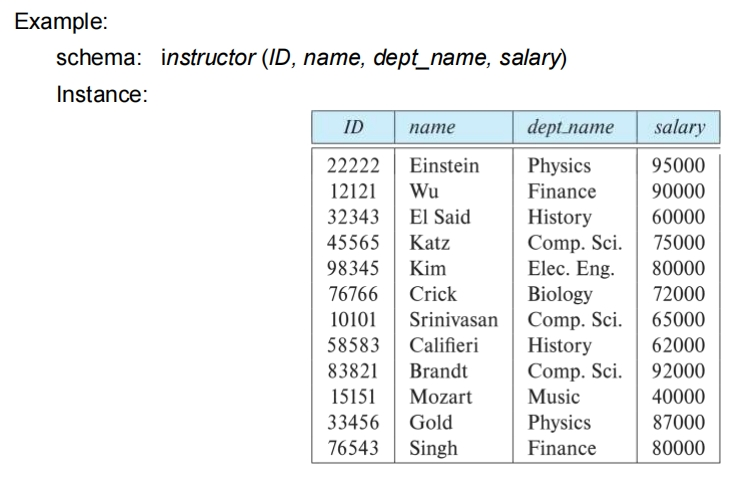

- *无序性*

A relation is a set of tuples, thus the order in which tuples appear in a relation is irrelevant.

- *原子的*

We require that, for all relations r, the domains of all attributes of r be atomic.

**null value** —— a special value that signifies that the value is unknown or does not exist.

!!! info "about null value"
    The special value null is a member of every domain. 
    
    The null value causes complications in the definition of many operations. 

---

### English Terms

Formally, given sets $D_1, D_2, \ldots, D_n$, a relation r is a subset of $D_1 \times D_2 \times \ldots \times D_n$.

Thus, a relation is a set of n-tuples($a_1, a_2, \ldots, a_n$), where $a_i \in D_i$ for $i = 1, 2, \ldots, n$.

$A_1, A_2, \ldots , A_n$ are attributes.

$R = (A_1, A_2, \ldots, A_n)$ is a relation schema.

A relation instance r defined over schema R is denoted by r(R).

The current values a relation are specified by a table.

---

## Keys

Let $K \subseteq R$

K is a **superkey**(超键) of R if values for K are sufficient to identify a unique tuple of each possible relation r(R)

!!! note "superkey"
    superkey 是一个或多个 attribute 的集合，这些 attribute 的值可以唯一地标识一个关系中的每个元组。

A superkey may contain extraneous attributes. If K is a superkey, then so is any superset of K.

Thus, minimal superkey is called a **candidate key**(候选键).

One of the candidate keys is selected to be the **primary key**(主键), which is also reffered to as **primary key constraints**.

It is customary to list the primary key attributes of a relation schema before the other attributes, like this: $classroom(\underline{building}, \underline{room\_number}, capacity)$

---

### foreign key

A foreign-key constraint from attribute(s) A of relation $r_1$ to the primary-key B of relation $r_2$ states that on any database instance, the value of A for each tuple in $r_1$ must also be the value of B for some tuple in $r_2$ . Attribute set A is called a foreign key from $r_1$ , referencing $r_2$ . The relation $r_1$ is also called the referencing relation of the foreign-key
constraint, and $r_2$ is called the referenced relation.

从 $r_1$ 关系的 A 属性(集)到关系的主码 B 的外码约束表明:在任何数据库实例中，$r_1$ 中每个元组对 A 的取值也必须是 $r_2$ 中某个元组对 B 的取值。A 属性集被称为从 $r_1$ 引用 $r_2$ 的外码。$r_1$ 关系也被称为此外码约束的引用关系，且 $r_2$ 被称为被引用关系。

!!! info
    1. The referenced attribute(s) must be the primary key of the referenced relation.

    2. 参照关系中外码的值必须在被参照关系中实际存在, 或为 null 。 

??? note "my thoughts"
    这里有一点绕。
    
    例如，instructor 中的 dept_name 属性是从 instructor 引用 department 的外码，而 department 的主码是 dept_name。

    所以应该可以理解为，先构造 department 表，有了各种 dept_name，然后 instructor 表中引用 department 表中的 dept_name。也就是说， $r_1$ 关系是 instructor，A 属性是 dept_name 。而 $r_2$ 关系是 department, 主码是 dept_name。

    这样也就能理解为什么 $r_1$ 是 the foreign-key constraint，而 $r_2$ 是 the referenced relation 了。也能够解释通 $r_1$ 关系中外码的值必须在 $r_2$ 关系中实际存在, 或为 null 。

Referential integrity (**参照完整性**) constraint requires that the values appearing in specified attribute(s) A of any tuples in the referencing relation $r_1$ also appear in specified attribute(s) B of at least one tuple in the referenced relation $r_2$.

参照完整性约束要求引用关系中的任意元组在指定属性上出现的取值也必然出现在被引用关系中至少一个元组的指定属性上。

??? note "my thoughts"
    我的理解是此时 $r_2$ 中的多个 attribute 构成 primary key，那么 $r_1$ 中的任意 tuple 在指定 schema 上出现的取值在 $r_2$ 中可能不止一个。
    
    可以想见 $r_2$ 的这一个 attribute 之所以此时不是 $r_2$ 的 primary key 就是因为这一个 attribute 不能唯一标识 $r_2$ 中的元组。

因此，可以得到 foreign-key constraints are a special case of referential integrity constraints。

!!! info
     Database systems today typically support **foreign-key constraints**, but they do not support referential integrity constraints where the referenced attribute is not a primary key.

??? note "为什么要有 foreign-key"
    From deepSeek.

    外键（Foreign Key）是关系数据库设计中的一个重要概念，它用于建立和强制两个表之间的链接。外键的存在有以下几个关键原因：

    1. **保持数据完整性**：
    外键确保了一个表中的数据与另一个表中的数据保持一致。它防止了会导致表之间数据不一致的无效数据的插入。例如，如果你有一个订单表，每个订单都需要关联到一个存在的客户，外键可以确保你不能添加一个没有对应客户ID的订单。

    2. **实现表与表之间的关联**：
    外键允许数据库设计者将数据分散到不同的表中，同时保持这些数据之间的逻辑关联。这样，数据可以被组织成逻辑上一致且易于管理的单元，而不是将所有数据都存储在一个大表中。

    3. **级联操作**：
    外键可以定义级联更新和删除规则，这意味着当主键表中的数据更新或删除时，所有相关联的外键表中的数据也会自动更新或删除。这有助于维护数据的一致性和减少错误。

    4. **查询和数据检索**：
    外键使得跨表查询成为可能。通过连接（JOIN）操作，可以从多个相关表中检索出复杂的数据集。这对于数据分析和报告生成非常有用。

    5. **规范化数据库设计**：
    外键是数据库规范化过程中的一个关键要素。规范化是一组指导原则，旨在减少数据冗余，提高数据完整性。通过使用外键，可以将数据分解成多个相关的表，从而减少重复数据并简化数据结构。

    6. **约束和验证**：
    外键约束确保了数据库中的数据遵循预定义的规则。这为数据输入提供了一种验证机制，确保了数据的准确性和可靠性。


---

## schema diagram

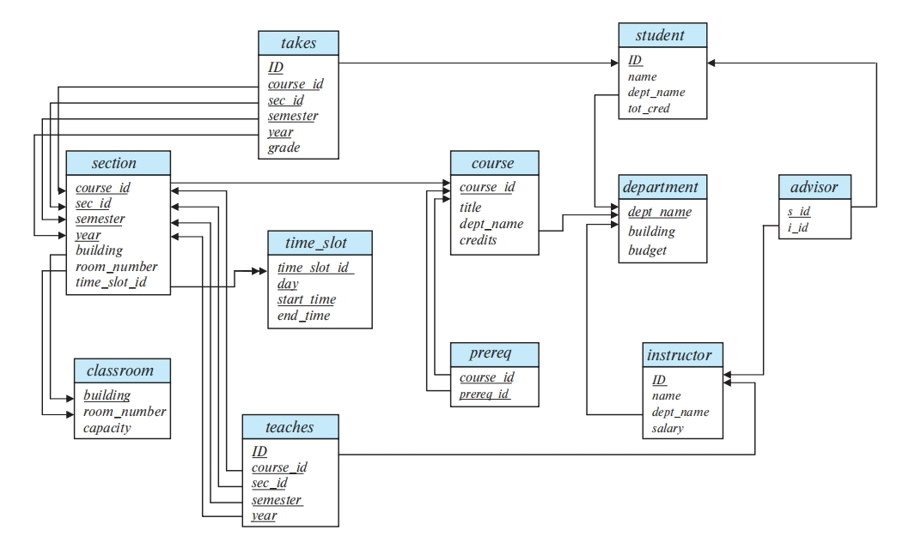

Primary-key attributes are shown underlined. 

主码属性用下划线标注。

Foreign-key constraints appear as arrows from the foreign-key attributes of the referencing relation to the primary key of the referenced relation.

- 外码约束用从引用关系的外码属性指向被引用关系的主码属性的箭头来表示。
- 我们使用双头箭头来表示不是外码约束的引用完整性约束。

??? note "my thoughts"
    理解为箭头指向"来源"~ 和一般的箭头相反 ~

---

## Relational Query Languages

A query language is a language in which a user requests information from the database.

- imperative query language
- functional query language
- declarative query language

### The Relational Algebra

A procedural language consisting of a set of operations that take one or two relations as input and produce a new relation as their result.

Six basic operators：

1. select $\sigma$
2. project $\Pi$
3. union $\cup$
4. set difference $-$
5. Cartesian product $\times$
6. rename $\rho$

!!! note
    unary operation: select, project, rename

    binary operation: union, set difference, Cartesian product

!!! info "anttenion"
    It is worth recalling at this point that since a relation is a set of tuples, relations cannot contain duplicate tuples. 

    在这一点上值得回顾的是，由于关系是一组元组，因此关系不能包含重复的元组。
    
    In practice, however, tables in database systems are permitted to contain duplicates unless a specific constraint prohibits it. 

    但是，在实践中，数据库系统中的表允许包含重复项，除非有特定的约束禁止它。
    
    But, in discussing the formal relational algebra, we require that duplicates be eliminated, as is required by the mathematical definition of a set.

    但是，在讨论形式化的关系代数时，我们要求消除重复，而这是一个集合的数学定义所要求的。在第三章中，我们讨论如何将关系代数扩展到多集，这是可以包含重复的集合。

---

#### The Select Operation

Notation: $\sigma_{p}(r)$

Defined as: $\sigma_{p}(r) = \{t \in r \ and \ p(t)\}$

In general, we allow comparisons using $= , \neq , < , > , \leq , \geq , and (\wedge) , or (\vee) , and \ not (\neg)$.

!!! example
    $\sigma_{\text{dept_name} = "Physics" \wedge \text{salary} > 90000}(\text{instructor})$

??? note "图示"
    select 也即从表中选择满足特定条件的行。

    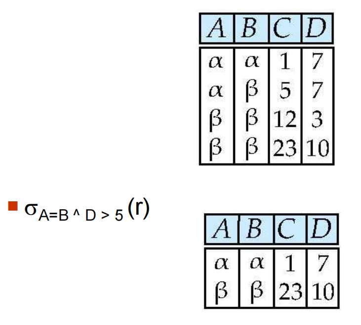

---

#### The Project Operation

Notation: $\Pi_{A_1,A_2,\ldots,A_n}(r)$

The basic version of the project operator $\Pi_{L}(E)$ allows only attribute names to be present in the list L. A generalized version of the operator allows expressions involving attributes to appear in the list L.

!!! example
    $\Pi_{\text{ID,name,salary}}(\text{instructor})$

    $\Pi_{\text{ID,name,salary / 12}}(\text{instructor})$

!!! note "attention"
    Duplicate rows removed from result, since relations are sets.

??? note "图示"
    从表中选择特定的列。
    
    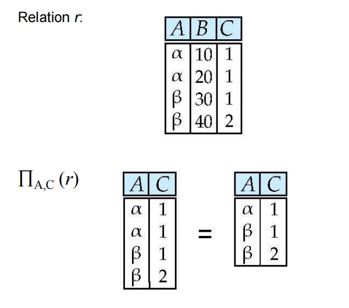

---

#### The Union Operation

Notation: $r \cup s$

Defined as: $r \cup s = \{t| t \in r \ or \ t \in s\}$

!!! note "attention"
    1. $r$ , $s$ must have the same arity (元数)(same number of attributes)

    2. The attribute domains must be compatible

??? note "图示"
    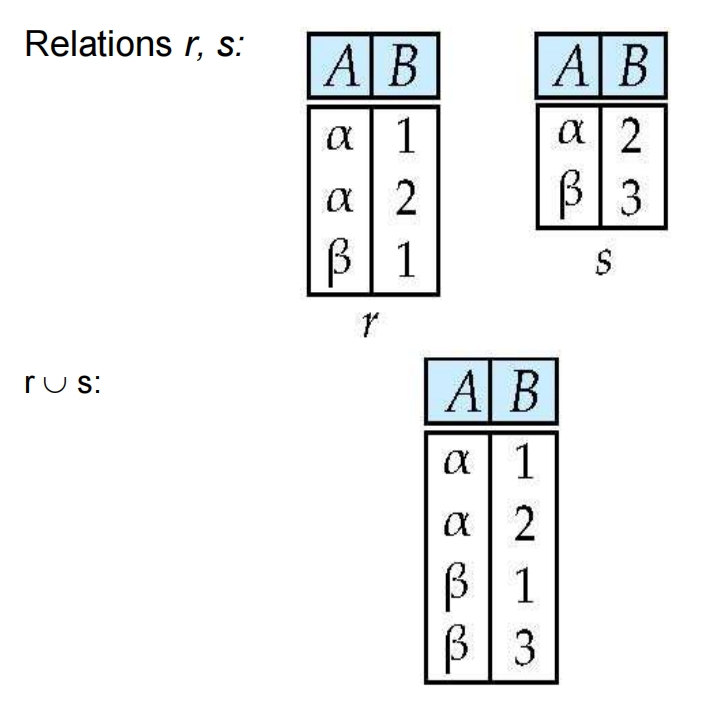

---

#### The Set Difference Operation

Notation: $r - s$

Defined as: $r - s = \{t| t \in r \ and \ t \notin s\}$

!!! note "attention"
    Set differences must be taken between compatible relations.

    1. $r$ , $s$ must have the same arity.

    2. The attribute domains must be compatible.

??? note "图示"
    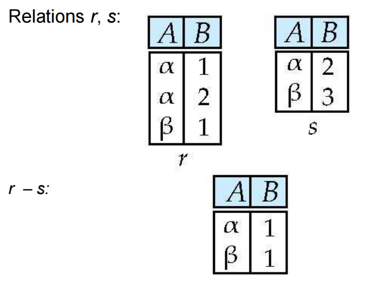

- **一个很常用的思想**: 要找到最大的，就先找到所有小的，然后从全集里减去。要找最小的同理。

??? Example
    Find the largest account balance (i.e., self-comparison). 

    $\Pi_{\text{balance}}(account) - \Pi_{\text{account.balance}}(\sigma_{\text{account.balance} \le \text{d.balance}}(account \times \rho_{d}(account)))$

---

#### The Cartesian-Product Operation

Notation: $r \times s$

Defined as: $r \times s = \{t \ q | t \in r \ and \ q \in s\}$

!!! note "attention"
    Assume that attributes of r(R) and s(S) are disjoint. (That is , $R \cap S = \emptyset$)

    If attributes of r(R) and s(S) are not disjoint, then  renaming must be used.

??? note "图示"
    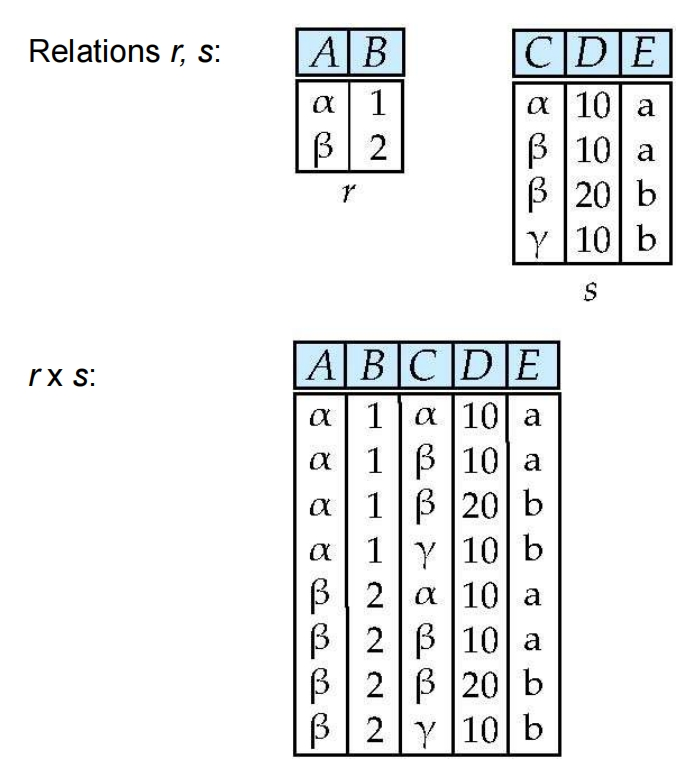

??? Example
    1. Find the names of all customers who have a loan at the Perryridge branch. 

    $\Pi_{customer\_name}(\sigma_{borrower.loan\_number = loan.loan\_number}(borrower \times (\sigma_{branch\_name = 'Perryridge'}(loan))))$

    2. Find the names of all customers who have loans at the Perryridge branch but do not have an account at any branch of the bank. 
    
    $\Pi_{customer\_name}(\sigma_{borrower.loan\_number = loan.loan\_number}(borrower \times (\sigma_{branch\_name = 'Perryridge'}(loan)))) - \Pi_{customer\_name}(depositor)$

---

#### The Composition of Operations

Can build expressions using multiple operations.

??? note "图示"
    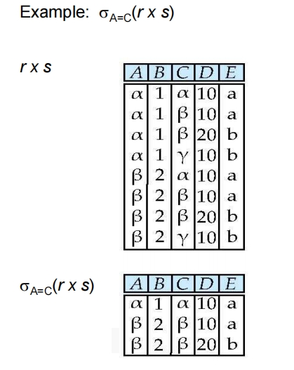

---

#### The Rename Operation

Notation: $\rho_{x}(E)$

If a relational-algebra expression E has arity n, then

$$\rho_{x(A_1, A_2, \cdots, A_n)}(E)$$

returns the result of expression E under the name X, and with the attributes renamed to $A_1, A_2, \cdots, A_n$.

---

!!! note "conclusion"
    不是所有查询结果都能用关系代数表示出来。

---

### Formal Definition

A basic expression in the relational algebra consists of either one of the following:

- A relation in the database
- A constant relation

---

We define additional operations that do not add any power to the relational algebra, but that simplify common queries.

- Set intersection: $\cap$
- Natural join: $\bowtie$
- Semijoin:  $⋉_{\theta}$, $⋊_{\theta}$
- Assignment: $\leftarrow$
- Outer join : ⟕ , ⟖ , ⟗
- Division Operator: $\div$

---

#### Set Intersection Operation

The set-intersection operation allows us to find tuples that are in both the input relations.

Notation: $r \cap s$

Defined as: $r \cap s = \{t | t \in r \land t \in s\}$

Note: $r \cap s = r - (r - s)$

??? note "图例"
    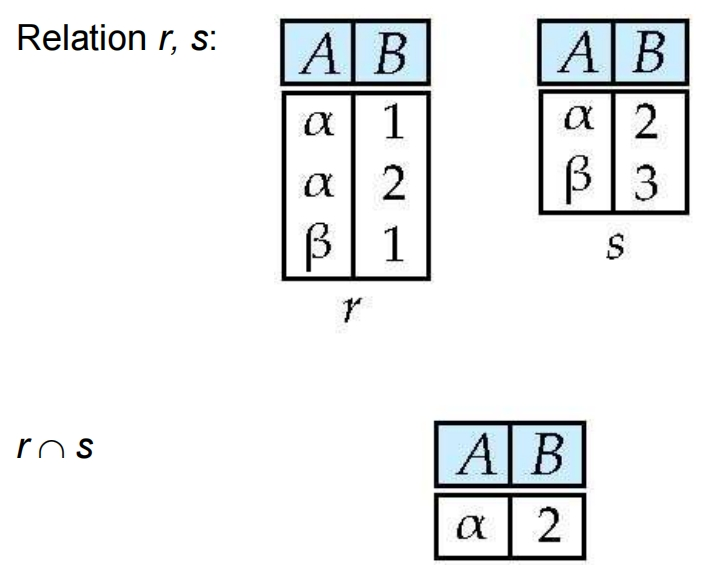

---

#### Natural Join Operation

把公共属性相同的行连在一起。

Consider each pair of tuples $t_r$ from $r$ and $t_s$ from $s$.

If $t_r$ and $t_s$ have the same value on each of the attributes in $R \cap S$, add a tuple t to the result, where

- $t$ has the same values as $t_r$ on r
- $t$ has the same values as $t_s$ on s

$$r \bowtie s = \Pi_{r.A, r.B, r.C, r.D, s.E}(\sigma_{r.B = s.B ^ r.D = s.D(r \times s)})$$

- associative

$$(instructor \bowtie  teaches) \bowtie  course$$ 

is equivalent to 

$$instructor \bowtie (teaches \bowtie course)$$

- commutative

$$instructor \bowtie  teaches$$ 

is equivalent to 

$$teaches \bowtie instructor$$

The **theta join** operation $r \bowtie_{\theta} s$ is defined as:

$$r \bowtie_{\theta} s = \sigma_{\theta}(r \times s)$$

??? note "图例"
    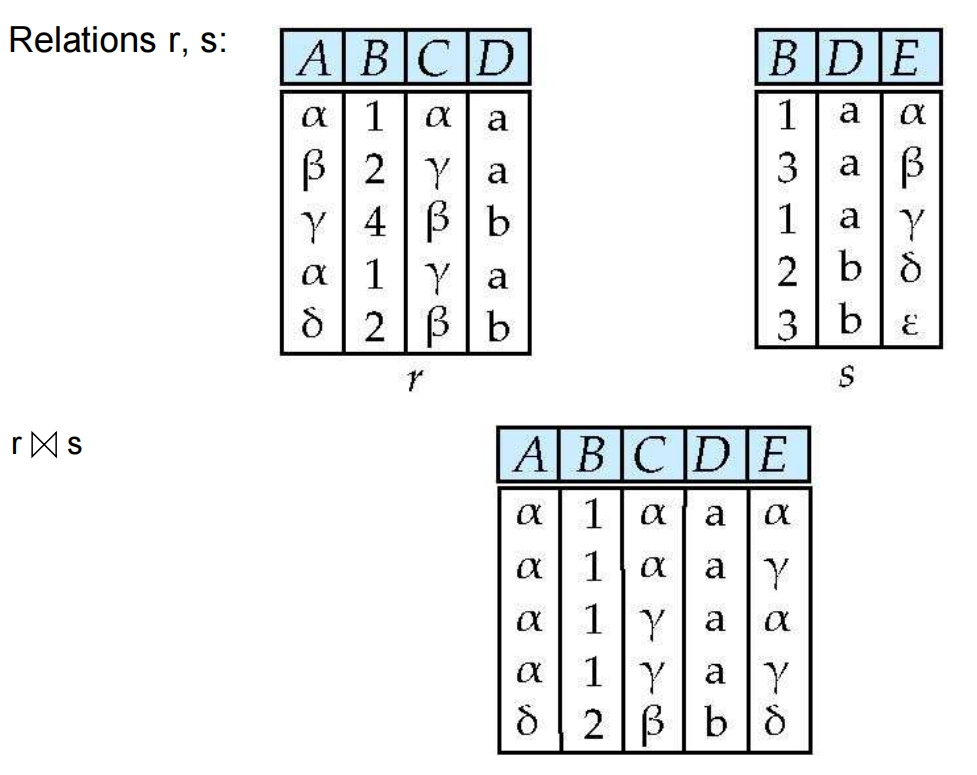

---

#### Outer Join Operation

An extension of the join operation that avoids loss of information.

Computes the join and then adds tuples form one relation that does not match tuples in the other relation to the result of the join.

Outer join can be expressed using basic operations

- $r$ ⟕ $s$ = $(r \bowtie s) \cup (r - \Pi_{R}(r \bowtie s)) \times \{(null, \dots, null)\}$
- $r$ ⟖ $s$ = $(r \bowtie s) \cup (\{(null, \dots, null)\}) \times s - \Pi_{S}(r \bowtie s)$
- $r$ ⟗ $s$ = $(r \bowtie s) \cup (r - \Pi_{R}(r \bowtie s)) \times \{(null, \dots, null)\} \cup (\{(null, \dots, null)\}) \times s - \Pi_{S}(r \bowtie s)$

- $\{ \}$ 表示构造一对临时的关系， 所以 $\{(null, \dots, null)\}$ 表示构造一对临时的关系，其中只有一对元组，且所有属性都是 null

!!! note
    Uses null values:

    - null signifies that the value is unknown or does not exist

    - All comparisons involving null are (roughly speaking) false by definition.

??? note "图例"
    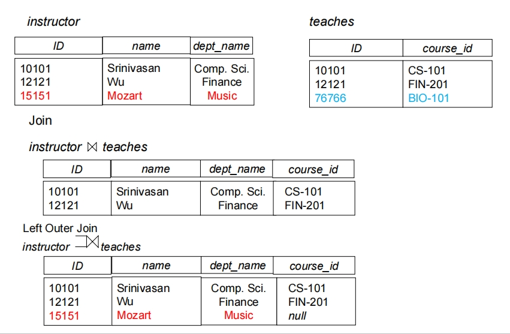

    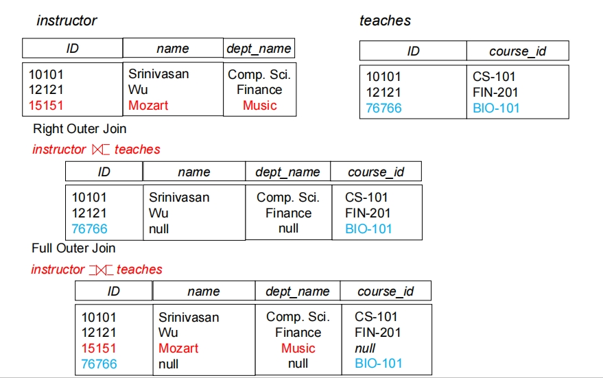

---

#### Semijoin Operation

Notation: $r ⋉_{\theta} s$

Is a subset of r, in which every tuple $r_i$ matches at least one truple $s_i$ in s under the condition $\theta$.

$r ⋉_{\theta} s = \Pi_{R}(r \bowtie_{\theta} s)$

??? note "图例"
    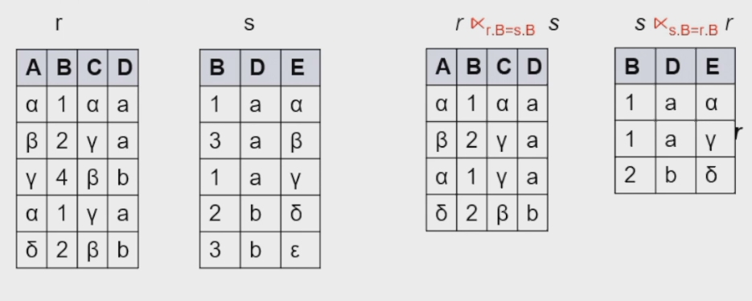

??? Example
    Find all customers who have an account from at least the “Downtown” and the “Uptown” branches. 
    
    1. $\Pi_{customer\_name}(\sigma_{branch\_name = 'Downtown'}(depositor \bowtie account)) \cap \Pi_{customer\_name}(\sigma_{branch\_name = 'Uptown'}(depositor \bowtie account))$

    2. $\Pi_{customer\_name, branch\_name}(depositor \bowtie account) \div \rho_{temp(branch\_name)}(\{('Downtown') , ('Uptown')\})$

---

#### Assignment Operation

The assignment operation ($\leftarrow$) provides a convenient way to express complex queries.

---

#### Division Operation

Given relations r(R) and s(S), such that $S \subset R$ , $r \div s$ is the largest relation t(R-S) such that $t \times s \subseteq r$.

$r \div s$ can be written as:

- temp1 $\leftarrow \Pi_{R-S}(r)$
- temp2 $\leftarrow \Pi_{R-S}((temp1 \times s) - \Pi_{R-S,S}(r))$
- result = temp1 - temp2

!!! Example
    Suited to queries that include the phrase "for all".
    
    let $r(ID, course\_id) = \Pi_{ID, course\_id}(takes)$ and $s(course\_id) = \Pi_{course\_id}(\sigma_{dept\_name = "Biology"}(course))$

??? note "图例"
    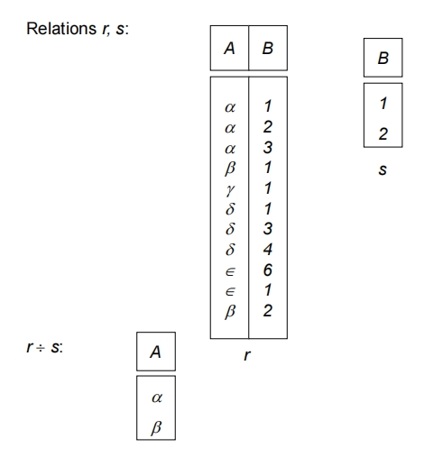

    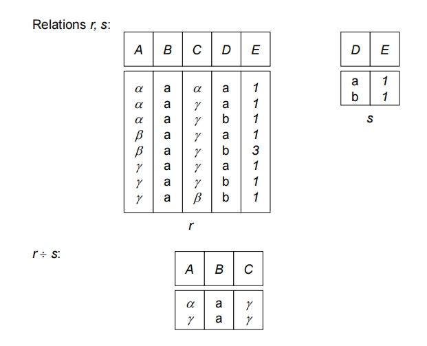

---

#### Generalized Projection

!!! note
    增加表达能力

Extends the projection operation by allowing arithmetic functions to be used in the projection list.

!!! Example
    Given relation instructor(ID, name, dept_name, salary) where salary is annual salary, get the same information but with monthly salary.

    $\Pi_{ID, name, dept_name, salary/12}(instructor)$

---

#### Aggregate Functions and Operations

!!! note
    增加表达能力

Aggregation function （聚合函数）takes a collection of values and 
returns a single value as a result.

!!! note "常见的聚合函数"
    - avg : average
    - min : minimum
    - max : maximum
    - sum : sum
    - count : count

$_{G_1, G_2, \cdots, G_n} G_{F_1(A_1), F_2(A_2), \cdots, F_n(A_n)}(E)$

E is any relational-algebra expression. $G_1, G_2, \cdots, G_n$ is a list of attributes on which to group (can be empty). 

Each $F_i$ is an aggregation function. 

Each $A_i$ is an attribute name.

??? note "图例"
    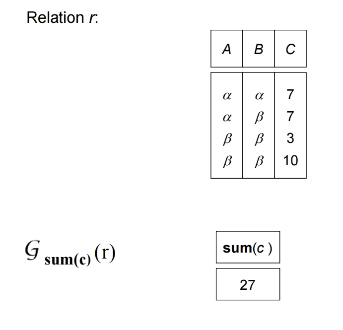

    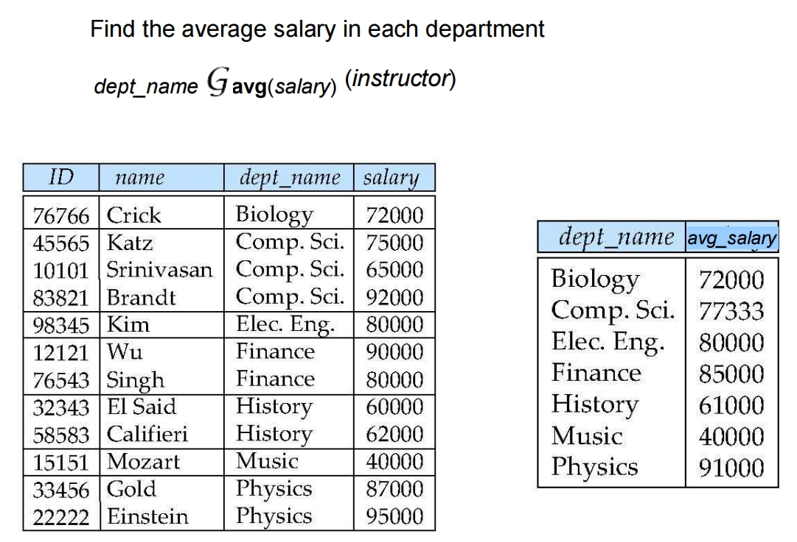

Result of aggregation does not have a name, so we can use rename operation to give it a name.

For convenience, we permit renaming as part of aggregate operation.

$_{dept \_ name} \ G_{avg(salary)} \ as \ avg \_ sal(instructor)$

---

#### Multiset Relational Algebra

!!! note
    去重操作十分 consuming.

    因此特别是中间步骤，没有必要去重。
    
Pure relational algebra removes all duplicates. Multiset relational algebra retains duplicates, to match SQL semantics.

SQL duplicate retention was initially for efficiency, but is now a feature. 

Multiset relational algebra defined as follows:

- **selection**: has as many duplicates of a tuple as in the input, if the tuple satisfies the selection
- **projection**: one tuple per input tuple, even if it is a duplicate
- **cross product**: If there are m copies of t1 in r, and n copies of t2 in s, there are m x n copies of t1.t2 in $r \times s$

**set operators :**

- **union**: m + n copies
- **intersection**: min(m, n) copies
- **difference**: max(0,m-n) copies

---

## SQL and Relational Algebra

1. 

```sql
select A1, A2, .. An
from r1, r2, ... , rm
where P
```

is equivalent to the following expression in multiset relational algebra

$$\pi_{A1, A2, .. An}(\sigma_P(r1 \times r2 \times ... \times rm))$$

---

2. 

```sql
select A1, A2, sum(A3)
from r1, r2, ... , rm
where P
group by A1, A2
```

is equivalent to the following expression in multiset relational algebra

$$A1, A2, G_{sum(A3)}(\sigma_P(r1 \times r2 \times ... \times rm))$$

??? note "anlysis"
    乘起来的结果筛选一下，分组再统计。

---

3. 

```sql
select A1, sum(A3)
from r1, r2, …, rm
where P
group by A1, A2
```

is equivalent to the following expression in multiset relational algebra

$$\Pi_{A1, sumA3}(_{A1, A2}G_{sum(A3) \ as \ sumA3}(\sigma_P(r1 \times r2 \times ... \times rm)))$$

??? note "anlysis"
    是从 `r1, r2, …, rm` 这些表中选取数据，根据 `A1` 和 `A2` 列的值进行分组，并对每个分组中的 `A3` 列的值求和。最终的结果集将包含 `A1` 列和 `sum(A3)` 列。

---

## Modification of the Database 

The content of the database may be modified using the following  operations:

- Deletion
- Insertion
- Updating

All these operations can be expressed using the assignment operator.

---

### Deletion

A delete request is expressed similarly to a query, except instead of displaying tuples to the user, the selected tuples are removed from the database. 

It can delete only whole tuples; cannot delete values on some  particular attributes.  

A deletion is expressed in relational algebra by: 

$$r \leftarrow r - E$$

where r is a relation and E is a relational algebra query. 

??? Example
    1. Delete all account records in the Perryridge branch. 
    
    $account \leftarrow account - \sigma_{branch\_name = 'Perryridge'}(account)$

    2. Delete all loan records with amount in the range of 0 to 50. 

    $loan \leftarrow loan - \sigma_{amount \ge 0 \ and \ amount \le 50}(loan)$

---

### Insertion

To insert data into a relation, we either: 

- Specify a tuple to be inserted. 
- Write a query whose result is a set of tuples to be inserted. 

In relational algebra, an insertion is expressed by: 

$$r \leftarrow r \cup E$$

where r is a relation and E is a relational algebra expression. 

The insertion of a single tuple is expressed by letting E be a constant relation containing one tuple. 

??? Example
    Insert information in the database specifying that Smith has $1200 in account A-973 at the Perryridge branch. 
    
    $$account \leftarrow account \cup \{('Perryridge', A-973, 1200)\}$$

    $$depositor \leftarrow depositor \cup \{('Smith', A-973)\}$$

---

### Update

A mechanism to change a value in a tuple without charging all  values in the tuple. 

Use the generalized projection operator to do this task

$$r \leftarrow \Pi_{F1, F2, \cdots, Fl}(r)$$

where each $F_i$ is either the ith attribute of r, if the ith attribute is not updated, or, if the attribute is to be updated $F_i$ is an expression, involving only constants and the attributes of r, which gives the new value for the attribute. 

??? Example
    Make interest payments by increasing all balances by 5 percent. 
    
    $$account \leftarrow \Pi_{account\_number,branch\_name, balance * 1.05}(account)$$

---