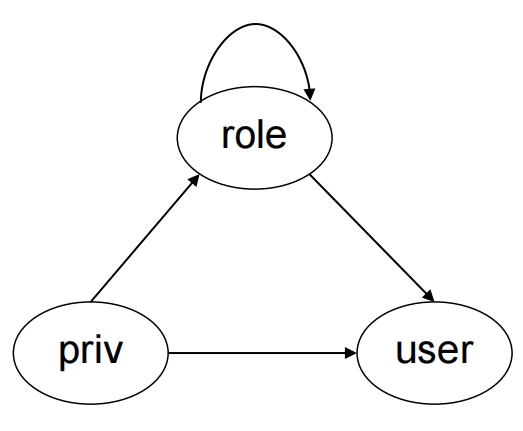
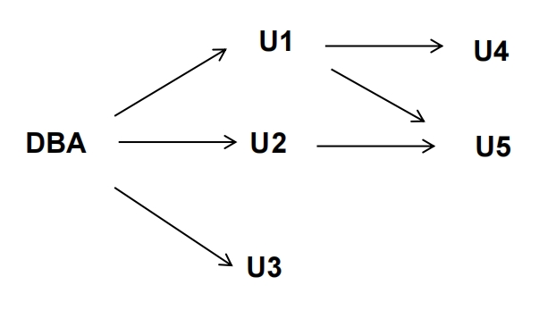

# Chapter 4 | Intermediate SQL

## Joined Relations

**Join** operations take two relations and return as a result another relation.

Join operations are typically used as subquery expressions in the **from** clause.

??? note "about natural join and inner join"
    自然连接是内连接的简化版，但依赖表结构的列名一致性。

    内连接更灵活、安全，是大多数场景的首选。
    
    建议 from deep seek：除非明确需要简化代码，否则优先使用显式的 `INNER JOIN + ON` 子句。

    |特性|自然连接(**Natural Join**)|内连接(**Inner Join**)|
    |:---:|:---:|:---:|
    |连接条件|自动基于同名且同数据类型的列进行等值匹配|需显式指定连接条件(如 `ON` 或 `USING`)|
    |列去重|自动合并同名列，结果中不重复显示同名列|保留所有参与连接的列(包括重复的同名列)|
    |灵活性|完全依赖表结构，列名必须一致|可自由指定任意连接条件，灵活性更高|
    |安全性|可能因意外的同名非关联列导致错误匹配|更安全，需明确指定关联字段|

    **自然连接的潜在风险**:
    
    1. 同名但无关的列会导致错误匹配

    例如，若两个表都有 `created_at` 列(但非关联字段)，自然连接会错误地将它们作为连接条件。

    2. 依赖表结构

    若表结构变化(如重命名列)，自然连接可能意外失效。

---

### Natural Join

例如，假设我们要回答查询出"学生的姓名以及他们所选课程的名称"。

此查询可以用SQL写为如下形式:

```sql
select name, title
from student natural join takes, course
where takes.course_id=course.course_id;
```

首先计算 `student` 和 `takes` 的自然连接，正如我们此前所见的，再计算该结果与 `course` 的笛卡儿积，`where` 子句从这个结果中仅提取出这样的元组:来自连接结果的课程标识与来自 `course` 关系的课程标识相匹配。请注意 `where` 子句中的 `takes.course_id` 表示自然连接结果的 `course_id` 域，因为该域最终来自 `takes` 关系。

但下面的SOL查询并不会计算出相同的结果:

```sql
select name, title
from student natural join takes natural join course
```

为了说明原因，请注意 `student` 和 `takes` 的自然连接包含的属性是 `(ID,name,dept_name,totcred,course_id,sec_id)` ，而 `course` 关系包含的属性是 `(course_id,title,dept_name,credits)` 作为二者自然连接的结果，需要来自这两个关系的 `dept_name` 属性取值相同，还要在 `course_id` 上取值相同。从而该查询将忽略所有这样的(学生姓名,课程名称)对:其中学生所选修的一门课程不是他所在系的课程。而前一个查询会正确输出这样的对。

---

### using

为了发扬自然连接的优点，同时避免不正确的相等属性所带来的危险，SQL 提供了一种自然连接的构造形式，它允许你来指定究竟需要哪些列相等。下面的查询说明了这个特征:

```sql
select name, title
from (student natural join takes) join course using (course_id);
```

---

### on

SQL还支持另外一种形式的连接，其中可以指定任意的连接条件。

```sql
select *
from student join takes on student.ID = takes.ID
```

---

`USING` vs `ON`

1. `USING`子句

- **用于有相同列名时简化语法**
- **只用于等值连接**
- **连接列在结果中只出现一次**
- **语法**：`JOIN ... USING (column_name)`

2. `ON` 子句

- **更通用的连接条件指定方式**
- **可以指定任何条件，不限于等值连接**
- **连接列在结果中会出现两次(除非手动选择)**
- **语法**：`JOIN ... ON table1.column = table2.column`

---

### Outer Join

```sql
select *
from student natural left outer join takes:
```

```sql
select *
from takes natural right outer join student;
```

```sql
select *
    from (select *
    from student
        where dept_name = 'Comp. Sci.') natural full outer join
        (select *
        from takes
        where semester ='Spring' and year= 2017);
```

#### natural join v.s. on

**自然连接**：

```sql
SELECT *
FROM student NATURAL LEFT OUTER JOIN takes;
```

显式 `ON` 条件连接：

```sql
SELECT *
FROM student LEFT OUTER JOIN takes ON student.ID = takes.ID;
```

虽然两者的逻辑结果（匹配的数据行）是相同的，但列的**显示方式**不同。

1. `NATURAL JOIN` 的列合并规则：

    - 自动匹配两个表中同名且同类型的列（例如 `ID`）。
    - 在结果中，同名列会被合并为一列（仅保留一个 `ID`）。

2. `ON` 条件连接的列保留规则：

    - 显式指定连接条件（例如 `student.ID = takes.ID`），但不会合并同名列。
    - 在结果中，两个表的 `ID` 列都会被保留，导致 `ID` 出现两次（`student.ID` 和 `takes.ID`）。

---

1. 左外连接 + `ON` 条件

```sql
SELECT *
FROM student LEFT JOIN takes ON student.ID = takes.ID;
```

- 先连接：把每个学生（`student` 表）和他们的选课记录（`takes` 表）按 `ID` 匹配。
- 保留所有学生：如果一个学生（比如 ID=70557 的 Snow）没有选课记录（即 `takes` 表中没有他的 `ID`），数据库会强行保留这个学生，并在 `takes` 的列中填充 `NULL`。

2. 左外连接 + `ON true` + `WHERE` 条件

```sql
SELECT *
FROM student LEFT JOIN takes ON true
WHERE student.ID = takes.ID;
```

- 先做笛卡尔积：`ON true` 表示把每个学生和所有选课记录强行配对（不管 `ID` 是否匹配）。比如 Snow 没有选课，但会和 `takes` 表中所有选课记录配对（包括别人的选课记录）。
- 再用 `WHERE` 过滤：只保留 `student.ID = takes.ID` 的行。由于 Snow 没有选课记录，他的 `takes.ID` 是 `NULL`，而 `NULL` 无法等于任何值（包括他自己的 `ID`），所以 Snow 会被过滤掉。

!!! info
    为了把常规连接和外连接区分开来，在 SQL 中把常规连接称作内连接。这样连接子句就可以指定用内连接而不是外连接，来说明使用的是常规连接。
    
    然而关键词 `inner` 是可选的。当 `join` 子句中没有使用 `outer` 前缀时，缺省的连接类型是内连接。

---

## SQL Data Types and Schemas

### User-Defined Types

create type construct in SQL creates user-defined type

```sql
create type Dollars as numeric (12,2) final
```

- `final` means that this type cannot be further extended. 已经是最后一个了，不能再继承。
- 更加方便直观，不用再去写了。
- 这是为了强类型化，防止类型错误，可以在编译的时候就发现错误。
- SQL 提供了 `drop type` 和 `alter type` 子句来删除或修改以前创建过的类型。

---

### Domains

create domain construct in SQL-92 creates user-defined domain types.

```sql
create domain person_name char(20) not null
```

**Types and domains are similar.** 

Domains can have constraints, such as `not null`, specified on them. 然而 `type` 就没有约束了。

However, they also have differences.

1. 在域上可以声明诸如非空那样的约束，也可以为域类型的变量定义缺省值，然而在用户自定义类型上不能声明约束或缺省值。用户自定义类型不仅被设计用来指定属性类型，而且还被用在不能施加约束的地方以对 SQL 进行过程扩展。
2. 域并不是强类型的。其结果是，一个域类型的值可以被赋值给另一个域类型，只要它们的基本类型是相容的。

```sql
create domain degree_level varchar(10)
constraint degree_level_test
check (value in ('Bachelors', 'Masters', 'Doctorate')); // 只能取这几个值
```

---

### Large-Object Types

Large objects (photos, videos, CAD files, etc.) are stored as a large object:

`blob` (二进制大对象): binary large object -- object is a large collection of uninterpreted binary data (whose interpretation is left to an application outside of the database system)

MySQL BLOB datatypes:

- `TinyBlob` ： 0 ~ 255 bytes.
- `Blob`： 0 ~ 64K bytes.
- `MediumBlob` ： 0 ~ 16M bytes.
- `LargeBlob` : 0 ~ 4G bytes.

`clob` (字符大对象): character large object -- object is a large collection of character data. 

When a query returns a large object, a pointer is returned rather than the large object itself.

---

## Integrity Constraints

完整性约束(integrity constraint)保证授权用户对数据库所做的修改不会导致数据致性的丢失。因此，完整性约束防止的是对数据的意外破坏。这与安全性约束(security constraint)不同，安全性约束防止未经授权的用户访问数据库。

完整性约束通常被视为数据库模式设计过程的一部分，并作为用于创建关系的 `create table` 命令的一部分被声明。然而，也可以通过使用 `alter table table-name add constraint` 命令将完整性约束施加到已有关系上，其中 `constraint` 可以是该关系上的任意约束。当这样条命令被执行时，系统首先保证该关系满足指定的约束。如果满足，那么约束被施加到关系上;如果不满足，则上述命令被拒绝执行。

### Integrity Constraints on a Single Relation.

- `not null` : Declare name and budget to be not null:

```sql
name varchar(20) not null
budget numeric(12,2) not null
```

- `primary key`
- `unique` : The unique specification states that the attributes $A_1, A_2, \cdots, A_m$ form a super key. Candidate keys are permitted to be null (in contrast to primary keys).
- `check (P)`, where P is a predicate. 检验每一行是否满足P。
- `foreign key`

---

### Integrity Constraint Violation During Transactions

```sql
create table person (
ID char(10),
name char(40),
mother char(10),
father char(10),
primary key (ID),
foreign key (father) references person,
foreign key (mother) references person);
```

How to insert a tuple without causing constraint violation?

- insert father and mother of a person before inserting person.
- OR, set father and mother to null initially, update after inserting all persons (not possible if father and mother attributes declared to be not null) .
- OR defer constraint checking to transaction end.

??? note "Chinese explanation"
    要插入一个人，需要先存在其父母记录。要插入父母记录，又可能需要先存在他们的父母记录。形成了一种"先有鸡还是先有蛋"的循环依赖问题。

    可以采用分阶段插入的办法。第一阶段：插入没有父母信息的人(祖先)。第二阶段：插入知道父母的人。第三阶段：插入后代。

    或者使用 `NULL` 值：先插入部分信息，后续更新。
---

### Check

不能用 `foreign key` 的条件来，因为 `foreign key` 要求被引用的一定是 `primary key`。

```sql
check (time_slot_id in (select time_slot_id from time_slot))
```

Unfortunately: subquery in check clause not supported by pretty much any database.

而 `check` 语句不会单独用，而是在 `create table` 语句中使用。

在对 `check` 子句的求值中空值呈现了一种有趣的特殊情况。如果 `check` 子句不为假，则它是满足的，因此计算结果为未知的子句也是满足的。如果不需要空值，则必须指定单独的非空约束。

`check` 子句可以单独出现，也可以作为属性声明的一部分出现。通常来说，对单个属性值的约束与该属性一起列出，而更复杂的 `check` 子句则在 `create table` 语句的末尾单独列出。

---

### reference

```sql
foreign key (dept_name) references department(dept_name);
```

然而，这个被指定的属性列表必须声明为被引用关系的**超码**，要么使用**主码**约束，要么使用**唯一性**约束来进行这种声明。

在更为普遍的引用完整性约束形式中，被引用的属性不必是候选码，但这样的形式不能在 SQL 中直接声明。任何广泛使用的数据库系统都不支持这些替代结构。

```sql
create table course(
    ...
    foreign key (dept_name) references department
    on delete cascade
    on update cascade,
    ...
);
```

由于有了 `on delete cascade` 子句，如果删除 `department` 中的一个元组导致违反了这种引用完整性约束，则系统并不拒绝该删除，而是对 `course` 关系做 "级联(cascade)" 删除，即删除引用了被删除系的元组。类似地，如果更新被约束引用的字段时违反了约束，则系统并不拒绝更新操作，而是将 `course` 中引用元组的 `deptname` 字段也改为新值。

SQL还允许外码(`foreign key`)子句指定除级联以外的其他动作，如果约束被违反，可将引用域(这里是 `dept_name` )置为 `null` (通过用 `set null` 代替 `cascade` )，或置为该域的缺省值(通过使用 `set default` )。

空值使得 SQL 中引用完整性约束的语义复杂化了。外码中的属性允许为 `null`，只要它们没有另外被声明为非空。如果在给定元组的外码的所有列上均取非空值，则对该元组采用外码约束的通常定义。如果任一外码列为 `null`，则该元组被自动定义为是满足约束的。

---

### Assigning Names to Constraints

为了命名约束，我们在约束的前面使用关键字 `constraint` 和我们希望为其赋予的名称。

例如，如果我们希望将名称 `minsalary` 赋给 `insiructor` 的 `salary` 属性上的 `check` 约束，那么可以将对 `salary` 的声明修改为:

```sql
salary numeric(8,2), constraint minsalary check (salary > 29000);
```

之后，如果我们决定不再需要这个约束，那么可以写为:

```sql
alter table instructor drop constraint minsalary;
```

如果名称缺失，需要使用特定于系统的功能来识别出约束的系统分配名称。并非所有的系统都支持这样的功能。

---

### assertion

查询整个表，然后判断是否满足条件。

断言的模板

```sql
create assertion <assertion-name> check <predicate>;
```

对于 `student` 关系中的每个元组，它在 `tot_cred` 属性上的取值必须等于该生已成功修完的课程的学分总和。

```sql
create assertion credits_earned_constraint check
(not exists 
    (select ID
    from student
    where tot_cred <> (
        select sum(credits)
        from takes natural join course
        where student.ID=takes.ID
            and grade is not null 
            and grade<>'F')))
```

实现这个功能代价很大。

当创建断言时，系统要检测其有效性。

- 如果断言有效，则今后对数据库的任何修改只有在不破坏该断言的情况下才被允许。
- 如果断言较复杂，则这样的检测会带来相当大的开销。由于检测和维护断言的开销较高，这使得一些系统开发者省去了对通用断言的支持，或只提供易于检测的特殊形式的断言。

---

## Views (视图)

让所有用户看到数据库中关系的完整集合并非总是合适的。出于安全性考虑，可能需要向用户仅隐藏一个关系中的特定数据。除了安全问题，我们可能希望创建一个"虚拟"关系的个性化集合，该集合能更好地匹配特定用户直观意义上的企业结构。

A view provides a mechanism to hide certain data from the view of certain users. 

Consider a person who needs to know an instructors name and department, but not the salary. This person should see a relation described, in SQL, by 

```sql
select ID, name, dept_name
from instructor
```

Any relation that is not of the conceptual model but is made visible to a user as a "virtual relation" is called a view.

---

在大学示例中，我们可能希望有一个关于物理系在 2017 年秋季学期所开设的所有课程段的列表，其中包括每个课程段在哪栋建筑的哪个房间授课的信息。为了得到这样的列表，我们应该创建的关系是:

```sql
select course.course id, sec_id,building, room_number
from course, section
where course.course_id = section.course_id
    and course.dept_name ='Physics'
    and section.semester = 'Fall'
    and section.year = 2017;
```

可以计算出这些查询的结果并存储下来，然后把存储的关系提供给用户。但如果我们这样做，一旦 `instructor`、`course` 或 `section` 关系中的底层数据发生变化，那么所存储的查询结果就不再与在这些关系上重新执行查询的结果相匹配。

---

A view is defined using the create view statement which has the form

```
create view v as < query expression >
```

where `<query expression>` is any legal SQL expression. The view name is represented by v.

Once a view is defined, the view name can be used to refer to the virtual relation that the view generates.

视图与 `with` 语句的不同之处在于: 视图一旦创建，在被显式删除之前就一直是可用的。由 `with` 定义的命名子查询对于定义它的查询来说只是本地可用的。

View definition is not the same as creating a new relation by evaluating the query expression.

Rather, a view definition causes the saving of an expression; the expression is substituted into queries using the view.

!!! note
    可以理解为 view 是一个虚的表，有表的名字与属性，但是没有表的内容。

    view 的好处一个在于简化用户视野，同时也可以起到信息隐藏的作用。

    `as` 是这个视图是怎么和数据表关联起来的，定义了一个 mapping 关系。

直观地说，在任何给定时刻，视图关系中的元组集都是对定义视图的查询表达式求值的结果。因此，如果计算并存储视图关系，一旦用于定义该视图的关系被修改，那么视图就会过期。

为了避免这一点，视图通常这样来实现: 当我们定义一个视图时，数据库系统存储视图本身的定义，而不存储定义该视图的查询表达式的求值结果。一旦视图关系出现在查询中，它就被已存储的查询表达式代替。因此，每当我们计算这个查询时，视图关系都被重新计算。

1. A view of instructors without their salary

```sql
create view faculty as
    select ID, name, dept_name
    from instructor
```

2. Find the names of all instructors in the Biology department

```sql
    select name
    from faculty
    where dept_name = 'Biology'
```

---

### Update of a View

Add a new tuple to faculty view which we defined earlier

```sql
create view faculty as
    select ID, name, dept_name
    from instructor

insert into faculty values ('30765', 'Green', 'Music');
```

This insertion must be represented by the insertion of the tuple `('30765', 'Green', 'Music', null)` into the instructor relation

`insert into instructor values ('30765', 'Green', 'Music', null);`

一般说来，如果定义视图的查询对下列条件都能满足，那么就称 SQL 视图是可更新的(即视图上可以执行插入、更新或删除) :

- `from` 子句中只有一个数据库关系
- `select` 子句中只包含关系的属性名，并不包含任何表达式、聚集或  `distinct` 声明没有出现在 `select` 。
- 子句中的任何属性都可以取 `null` 值;也就是说，这些属性没有非空约束，也不构成主码的一部分。
- 查询中不含有 `group by` 或 `having` 子句在这些限制下，允许在下面的视图上执行 `update`、`insert` 和 `delete` 操作。

---

### Materialized Views

Materializing a view: create a physical table containing all the tuples in the result of the query defining the view.

是一个视图，但是会定义一个临时表，与 view 中的数据一致。

好处是，如果查询数据量很大，那么每次查询 view 都会花费很多时间，但是我们可以将 view 的结果存储在临时表中，这样每次查询临时表的时间就会大大减少。但坏处是，如果原始表的数据发生了变化，那么临时表中的数据就不会更新，因此需要定期手动更新临时表。

---

### View and Logical Data Indepencence

???+ question
    If relation S(a, b, c) is split into two sub relations S1(a,b) and S2(a,c). How to realize the logical data independence?

??? note "answer"
    1. create table S1 ...; create table S2 ...;

    2. insert into S1 select a, b from S; insert into S2 select a, c from S;

    3. drop table S;

    4. create view S(a,b,c) as select a,b,c from S1 natural join S2;

---

## Indexes

在表里面插入数据后是没有顺序的，如果要查找数据，那么就需要遍历整个表，这样效率很低。因此，我们可以使用索引来提高查找效率。

Indices are data structures used to speed up access to records with specified values for index attributes.

```sql
create table student
( ID varchar (5),
name varchar (20) not null,
dept_name varchar (20),
tot_cred numeric (3,0) default 0,
primary key (ID) )
create index studentID_index on student(ID)
```

在数据库中用二分查找是很低效的，内存外存访问速度不同，且外存是一块一块的数据，要从磁盘中搬进来要很久。二叉树有很多层，所以访问速度很慢。所以用 B+ 树。扁扁的一层，可以很快地找到数据。

---

## Transactions

事务(`transaction`)由查询和(或)更新语句的序列组成。

SQL 标准规定当一条 SQL 语句被执行时，就隐式地**开始**了一个事务。

下列SOL语句之一会**结束**该事务:

1. `commit work` 提交当前事务;也就是说，它使事务执行的更新在数据库中成为永久性的。在事务被提交后，一个新的事务会自动开始。

2. `rollback work` 回滚当前事务;也就是说，它会撤销事务中 SQL 语句执行的所有更新。因此，数据库状态被恢复到它执行该事务的第一条语句之前的状态。

关键字 `work` 在两条语句中都是**可选**的。

如果在一个事务的执行期间检测到某种错误状态，事务回滚是有用的。一旦一个事务执行了 `commit work` ，它的影响就不能再用 `rollback work` 来撒销了。

数据库系统保证在发生诸如某条 SQL 语句错误、断电或系统崩溃这些故障的情况下，如果一个事务还没有执行 `commit work`，那么其影响将被回滚。在断电或其他系统崩溃的情况下，回滚会在系统重启时执行。

---

- Unit of work (NONE or ALL) 
- Atomic transaction(原子性) : either fully executed or rolled back as if it never occurred
- Isolation from concurrent transactions(并发但不相互影响)
- Transactions begin implicitly : Ended by **commit work** or **rollback work**
- But default on most databases: each SQL statement commits automatically

如果一个事务由需要执行的多条 SQL 语句组成，就必须关闭单条 SQL 语句的这种自动提交。

In MySQL: `SET AUTOCOMMIT=0;`

作为 SQL:1999 标准的一部分，允许多条 SQL 语句被包含在关键字 `begin atomic ... end` 之间。

---

Transaction example :

```sql
SET AUTOCOMMIT=0; -- turn off auto-commit
UPDATE account SET balance=balance -100 WHERE ano='1001;
UPDATE account SET balance=balance+100 WHERE ano='1002';
COMMIT;
```

---

### ACID Properties

1. **Atomicity**. Either all operations of the transaction are properly reflected in the database or none are.
2. **Consistency**. Execution of a transaction in isolation preserves the consistency of the database.
    - 事务是保持数据库一致性的单元
3. **Isolation**. Although multiple transactions may execute concurrently, each transaction must be unaware of other concurrently executing transactions. Intermediate transaction results must be hidden from other concurrently executed transactions. 
    That is, for every pair of transactions $T_i$ and $T_j$, it appears to $T_i$ that either $T_j$, finished execution before $T_i$ started, or $T_j$ started execution after $T_i$ finished.
4. **Durability**. After a transaction completes successfully, the changes it has made to the database persist, even if there are system failures.
    - 事务一旦提交后就不能改，要在数据库内长久地保存，例如磁盘坏了、修改后的内容还没写入磁盘却断电了等等情况下，数据库都要保证数据不丢失

---

## Authorization

Forms of authorization on parts of the database: (**表上**的权限)

- Select - allows reading, but not modification of data.
- Insert - allows insertion of new data, but not modification of existing data.
- Update - allows modification, but not deletion of data.
- Delete - allows deletion of data.

Forms of authorization to modify the database schema: (**数据库**上的权限)

- Resources（MySQL：Create） - allows creation of new relations.
- Alteration - allows addition or deletion of attributes in a relation.
- Drop - allows deletion of relations.
- Index - allows creation and deletion of indices.
- Create view（MySQL） – allows creation of views.

---

### Authorization Specification in SQL

The `grant` statement is used to confer authorization:

```sql
grant <privilege list> -- privilege：权限
on <relation name or view name> to <user list>
```

**Example**:

```sql
grant select on department to Amit, Satoshi;
grant update (budget) on department to Amit, Satoshi;
```

---

`<user list>` is: a user-id

`public`, which allows all valid users the privilege granted a role (more on this later).

- Granting a privilege on a view does not imply granting any privileges on the underlying relations.
- The grantor of the privilege must already hold the privilege on the specified item (or be the database administrator).

```sql
grant select on instructor to U1, U2, U3
grant select on department to public
grant update (budget) on department to U1,U2
grant all privileges on department to U1
```

---

### Revoking Authorization in SQL

The revoke statement is used to revoke authorization.

```sql
revoke <privilege list>
on <relation name or view name> 
from <user list>
```

**Example**:

```sql
revoke select on branch from U1, U2, U3;
revoke select on department from Amit, Satoshi;
revoke update (budget)on department from Amit, Satoshi;
```

`<privilege-list>` may be all to revoke all privileges the revokee may hold.

- If `<revokee-list>` includes `public`, all users lose the privilege except those granted it explicitly.
- If the same privilege was granted twice to the same user by different grantees, the user may retain the privilege after the revocation.
- All privileges that depend on the privilege being revoked are also revoked.

---

### role



```sql
create role instructor;  -- 角色的名字
grant instructor to Amit;  -- Privileges can be granted to roles; 把权限给 Amit
grant select on takes to instructor; -- Roles can be granted to users, as well as to other roles
create role teaching_assistant
grant teaching_assistant to instructor;  -- Instructor inherits all privileges of teaching_assistant
```

Chain of roles :

```sql
create role dean;
grant instructor to dean;
grant dean to Satoshi;
```

---

#### Authorization on Views

```sql
create view geo_instructor as
(select *
from instructor
where dept_name = 'Geology');
grant select on geo_instructor to geo_staff
```

创建视图的用户没必要获得该视图上的所有权限。他仅得到的那些权限不会为他提供超越他已有权限的额外权限。

例如，一个创建视图的用户不能得到视图上的更新权限，如果该用户在用来定义视图的关系上没有更新权限的话。如果用户要创建一个视图，而此用户在该视图上不能获得任何权限，则系统会拒绝这样的视图创建请求。

在上述例子中，视图的创建者必须在 instructor 关系上拥有 select 权限，才能创建 geo_instructor 视图。

---

#### Other Authorization Features

- references privilege to create foreign key

```sql
grant reference (dept_name) on department to Mariano;
```

初看起来，似乎没有理由不允许用户创建引用了其他关系的外码。但是，请回想一下:外码约束限制了被引用关系上的删除和更新操作。

假定 Mariano 在关系 r 中创建了一个外码，它引用 `department` 关系的 `dept_name` 属性，然后在 r 中插入一条属于地质系的元组。那么就再也不可能从 `department` 关系中将地质系删除，除非同时也修改关系r。这样，由 Mariano 定义的外码就限制了其他用户将来的操作，因此，需要有引用权限。

如果要创建关系 r 上的 `check` 约束，并且该约束有引用 `department` 的子查询，那么还需要有 `department` 上的引用权限。其原因与我们已给出的外码约束的情况类似，因为引用了一个关系的 `check` 约束会限制对该关系可能的更新。

- transfer of privileges

从一个用户/角色那里收回权限可能导致其他用户/角色也失去该权限。这一方式称作级联收权。在大多数的数据库系统中，cascade 是缺省方式。然而，收权语句可以声明 restrict 来防止级联收权。

```sql
grant select on department to Amit with grant option;  -- 有 grant option 的权限可以传递
revoke select on department from Amit, Satoshi cascade;
revoke select on department from Amit, Satoshi restrict;
revoke grant option for select on department from Amit; -- 收权语句仅仅收回授权选项，而并不是真正收回选择权限
```



---