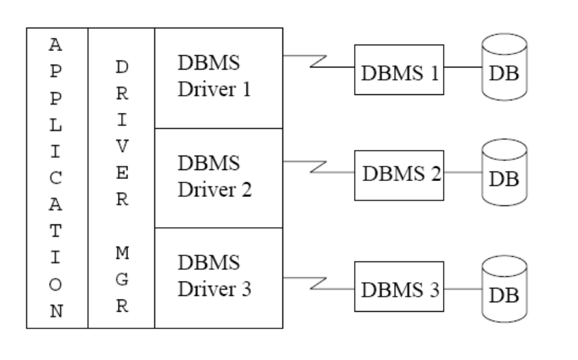
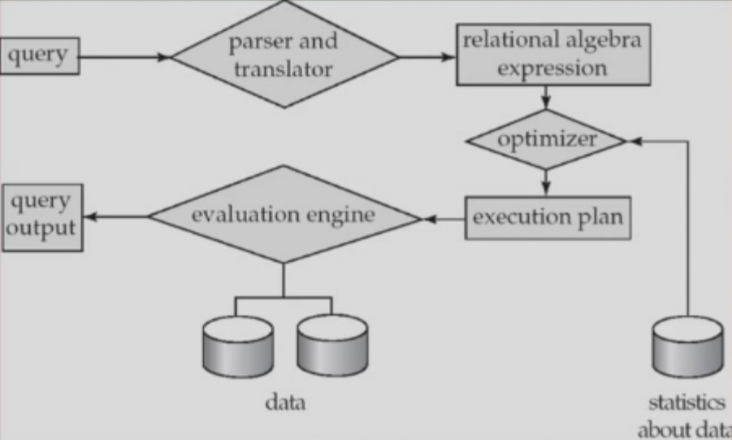

# Chapter 5 | Advanced SQL

## Accessing SQL from a Programming Language

There are two approaches to accessing database from a general-purpose programming language.

1. **API** (Application Program Interface) -- A general-purpose program can connect to and communicate with a database server using a collection of functions.
2. **Embedded SQL** -- provides a means by which a program can interact with a database server. 

The SQL statements are translated at compile time into function calls. 

At runtime, these function calls connect to the database using an API that provides dynamic SQL facilities.

---

## JDBC and ODBC

- **API** (application-program interface) for a program to interact with a database server
    Application makes calls to

        - Connect with the database server
        - Send SQL commands to the database server
        - Fetch tuples of result one-by-one into program variables

- **ODBC** (Open Database Connectivity) works with C, C++, C#
- **JDBC** (Java Database Connectivity) works with Java
- **Embedded SQL** in C
- **SQLJ** - embedded SQL in Java
- **JPA** (Java Persistence API) - OR mapping of Java

---

### JDBC

JDBC is a Java API for communicating with database systems supporting SQL.

Model for communicating with the database:

    1. Open a connection
    2. Create a "statement" object
    3. Execute queries using the Statement object to send queries and fetch results
    4. Exception mechanism to handle errors

---

#### JDBC Code

```java
public static void JDBCexample(String dbid, String userid, String passwd) { 
    try{ 
        // 连接到数据库
        Connection conn = DriverManager.getConnection("jdbc:oracle:thin:@db.yale.edu:2000:univdb", userid, passwd); 
        
        // 创建Statement对象
        Statement stmt = conn.createStatement(); 
        
        // 执行实际工作
        ... Do Actual Work ...
        
        // 关闭Statement对象
        stmt.close();
        
        // 关闭Connection对象
        conn.close();
    }catch (SQLException sqle){ 
        
        // 捕获并打印SQLException
        System.out.println("SQLException : " + sqle);
    }
}
```

##### Update to database

```java
try{

    // 执行SQL语句，向instructor表中插入一条数据
    stmt.executeUpdate("insert into instructor values('77987', 'Kim', 'Physics', 98000)");
}catch (SQLException sqle){

    // 捕获SQL异常，并输出错误信息
    System.out.println("Could not insert tuple. " + sqle);
}
```

---

##### Execute query and fetch and print results
 
```java
// 执行查询语句，查询教师表中每个部门的平均工资
ResultSet rset = stmt.executeQuery("select dept_name, avg (salary) 
                                    from instructor
                                    group by dept_name");

// 遍历查询结果，rset.next()：将结果集的游标移动到下一行。
while (rset.next()){

    // 获取当前行的dept_name列的值。获取当前行的第二列的值（即平均工资）。
    System.out.println(rset.getString("dept_name") + " " + rset.getFloat(2));
}
```

- `rset.getString("dept_name")` and `rset.getString(1)` are **equivalent** if `dept_name` is the first argument of select result.
- Dealing with Null values:

```java
int a = rset.getInt(“a”);
if (rset.wasNull()) Systems.out.println("Got null value");
```

---

#### Prepared Statement

```java
PreparedStatement pStmt = conn.prepareStatement("insert into instructor values(?,?,?,?)");
pStmt.setString(1, "88877");
pStmt.setString(2, "Perry");
pStmt.setString(3, "Finance");
pStmt.setInt(4, 125000);
pStmt.executeUpdate();

pStmt.setString(1, "88878");
pStmt.executeUpdate();
```

每条 SQL 语句都要经过以下过程：

1. 语法检查
2. 语义检查
3. 查询优化
4. 执行

这些过程如果每条 SQL 都执行，代价很大，因此可以先进行一次性的语法、语义、查询优化，只留下几个参数。

---

## SQL Injection

WARNING: always use prepared statements when taking an input from the user and adding it to a query

NEVER create a query by concatenating strings which you get as inputs

Suppose query is constructed using `"select * from instructor where name = '" + name + " ' "`

Suppose the user, instead of entering a name, enters: `X' or 'Y' = 'Y`

then the resulting string of the statement becomes: `"select * from instructor where name = '" + "X' or 'Y' = 'Y" + "'"`

which is: `select * from instructor where name = 'X' or 'Y'  = 'Y'`

User could have even used `X'; update instructor set salary = salary + 10000;`

then `select * from instructor where name = 'X'; update instructor set salary = salary + 10000;`

**Always use prepared statements**, with user inputs as parameters.

先 prepare，先语法检查、语义分析，再优化执行。这样有利于防止 SQL 注入的攻击。

---

## Metadata Features

**ResultSet metadata**

E.g., after executing query to get a ResultSet rs:

```java
ResultSetMetaData rsmd = rs.getMetaData();
for(int i = 1; i <= rsmd.getColumnCount(); i++){
    System.out.println(rsmd.getColumnName(i));
    System.out.println(rsmd.getColumnTypeName(i));
}
```

---

**Database metadata**

```java
DatabaseMetaData dbmd = conn.getMetaData();
ResultSet rs = dbmd.getColumns(null, "univdb", "department", "%");

// Arguments to getColumns: Catalog, Schema-pattern, Table-pattern, and Column-Pattern
// Returns: One row for each column; row has a number of attributes, such as COLUMN_NAME, TYPE_NAME

while( rs.next()){
    System.out.println(rs.getString("COLUMN_NAME"), rs.getString("TYPE_NAME"));
}
```

---

## Transaction Control in JDBC

By default, each SQL statement is treated as a separate transaction that is committed automatically bad idea for transactions with multiple updates

Can turn off automatic commit on a connection `conn.setAutoCommit(false);`

Transactions must then be committed or rolled back explicitly `conn.commit();` or `conn.rollback();`

Turns on automatic commit `conn.setAutoCommit(true)`.

JDBC Basics Tutorial(https://docs.oracle.com/javase/tutorial/jdbc/index.html)

---

## SQLJ

JDBC is overly dynamic, errors cannot be caught by compiler

SQLJ: embedded SQL in Java

```java
#sql iterator deptInfoIter ( String dept name, int avgSal);
deptInfoIter iter = null;
#sql iter = { select dept_name, avg(salary) as avgSal from instructor group by dept_name};
while (iter.next()){
    String deptName = iter.dept_name();
    int avgSal = iter.avgSal();
    System.out.println(deptName + " " + avgSal);
}
iter.close();
```

SQLJ Developer's Guide(https://docs.oracle.com/en/database/oracle/oracle-database/20/jsqlj/toc.htm)

---

## ODBC

Open DataBase Connectivity(ODBC) standard

standard for application program to communicate with a database server

application program interface (API) to

    - open a connection with a database,
    - send queries and updates,
    - get back results.

Applications such as GUI, spreadsheets, etc. can use ODBC

Was defined originally for Basic and C, versions available for many languages.

Each database system supporting ODBC provides a "driver" library that must be linked with the client program.



When client program makes an ODBC API call, the code in the library communicates with the server to carry out the requested action, and fetch results.

ODBC program first allocates an **SQL environment**, then a **database connection** handle.

Opens database connection using `SQLConnect()`. Parameters for SQLConnect:

    - connection handle,
    - the server to which to connect
    - the user identifier, 
    - password

Must also specify types of arguments:

    SQL_NTS denotes previous argument is a null-terminated string.

---

### ODBC Code

```c
int ODBCexample(){
    RETCODE error;
    HENV env; /* environment */ 
    HDBC conn; /* database connection */ 

    // 分配一个环境
    SQLAllocEnv(&env);

    // 在这个环境里面生成一个代表连接的变量
    SQLAllocConnect(env, &conn);

    // 真正的连接，SQL_NTS表示参数是null-terminated string，也即 C 语言中字符串的结尾是 '\0'
    SQLConnect(conn, "db.yale.edu", SQL_NTS, "avi", SQL_NTS, "avipasswd", SQL_NTS);

    { ... Do actual work ... }
    SQLDisconnect(conn); 
    SQLFreeConnect(conn); 
    SQLFreeEnv(env); 
}
```

- 大写的东西都是 ODBC 定义的类型、返回值。

---

Program sends SQL commands to database by using `SQLExecDirect`

Result tuples are fetched using `SQLFetch()`

`SQLBindCol()` binds C language variables to attributes of the query result

```c
char deptname[80];
float salary;
int lenOut1, lenOut2;
HSTMT stmt;

// 按系统计每个系的工资总额，没执行之前在C语言里面就是字符串
char * sqlquery = "select dept_name, sum (salary)
                    from instructor
                    group by dept_name";

// 生成一个代表SQL语句的变量
SQLAllocStmt(conn, &stmt);

// 没有 prepare 直接执行
error = SQLExecDirect(stmt, sqlquery, SQL_NTS);

// 如果执行成功，就绑定变量
if (error == SQL SUCCESS){

    // 把查询结果的第一列绑定到deptname，第二列绑定到salary
    SQLBindCol(stmt, 1, SQL_C_CHAR, deptname , 80, &lenOut1);
    SQLBindCol(stmt, 2, SQL_C_FLOAT, &salary, 0 , &lenOut2);

    // 不断获取查询结果，直到没有结果为止
    while (SQLFetch(stmt) == SQL_SUCCESS){
        printf (" %s %g\n", deptname, salary);
    }
}
SQLFreeStmt(stmt, SQL_DROP);
```

---

#### ODBC Prepared Statements

SQL statement prepared: compiled at the database

Can have placeholders: E.g. `insert into account values(?,?,?)`

Repeatedly executed with actual values for the placeholders

To prepare a statement `SQLPrepare(stmt, <SQL String>);`

To bind parameters `SQLBindParameter(stmt, <parameter#>, ... type information and value omitted for simplicity...)`

To execute the statement `retcode = SQLExecute(stmt);`

---

#### More ODBC Features

Metadata features

finding all the relations in the database and finding the names and types of columns of a query result or a  relation in the database.

By default, each SQL statement is treated as a separate transaction that is committed automatically.

Can turn off automatic commit on a connection `SQLSetConnectOption(conn, SQL_AUTOCOMMIT, 0)`

Transactions must then be committed or rolled back explicitly by ` SQLTransact(conn, SQL_COMMIT)` or `SQLTransact(conn, SQL_ROLLBACK)`

**ODBC Resources** : MySQL Connector/ODBC Developer Guide(https://docs.oracle.com/cd/E17952_01/connector-odbcen/index.html)

---

## Embedded SQL

- The SQL standard defines embeddings of SQL in a variety ofprogramming languages such as C, Java, and Cobol.
- A language to which SQL queries are embedded is referred to as a hostlanguage(宿主语言), and the SQL structures permitted in the hostlanguage comprise embedded SaL.
- EXEC SaL statement is used to identify embedded SQL request to the preprocessol `EXEC SQL <embedded SQL statement>END EXEC`
    - the Java embedding uses: `# SQL{...};`
    - the C embedding uses: `EXEC SQL<embedded SQL statement >;`

---

### Embedded SOL without cursor

```c
main(){

    //声明段开始
    EXEC SQL INCLUDE SQLCA; 
    EXEC SQL BEGIN DECLARE SECTION;

    //host variables(宿主变量)声明，用于与数据库内的数据绑定
    char account_no[l1]; 
    char branch_name[16];
    int balance;

    //声明段结束
    EXEC SQL END DECLARE SECTION;
    EXEC SQL CONNECT TO bank_db USER Adam Using Eve;

    scanf("%s %s %d",account_no, branch_name, balance);
    EXEC SQL insert into account values (:account_no, :branch_name, :balance);

    If(SQLCA.sqlcode !=0){
        printf ("Error!\n");
    }else{
        printf ("Success!\n");
    }
}
```

---

### Embedded SOL without cursor(update)

```c
main(){
    EXEC SQL INCLUDE SQLCA; //声明段开始
    EXEC SQL BEGIN DECLARE SECTION;
    char account_no[11];//host variables(宿主变量)声明
    int balance;
    EXEC SQL END DECLARE SECTION://声明段结束
    EXEC SQL CONNECT TO bank_db USER Adam Using Eve;

    scanf("%s %d", account_no, balance);

    EXEC SOL update account
            set balance= balance+:balance
            where account number=:account_no;
            
    If(SQLCA sqlcode ! =0) printf("Error!\n");
    else printf("Success!\n");
}
```

---

### Embedded SOL without cursor(select single record)

```c
main(){
    EXEC SQL INCLUDE SOLCA: //声明段开始
    EXEC SQL BEGIN DECLARE SECTION;
    char account_no[11];//host variables(宿主变量)声明
    int balance;
    EXEC SQL END DECLARE SECTION;//声明段结束
    EXEC SQL CONNECT TO bank_db USER Adam Using Eve;
    scanf("%s", account_no);

    // select into 即可实现查询
    EXEC SQL select balance into :balance
                from account 
                where account_number = :account_no;
    
    If(SQLCA sqlcode !=0) printf("Error!\n");
    else printf (“balance= %d \n”, balance);
}
```

---

### Embedded SOL with cursor(select multiple records、Delete and Update)

```c
main(){
    EXEC SQL INCLUDE SOLCA;
    EXEC SOL BEGIN DECLARE SECTION;
    char customer_name[2l];
    char account_no[l1];
    int balance;
    EXEC SQL END DECLARE SECTION;
    EXEC SQL CONNECT TO bank_db USER Adam Using Eve;

    // 声明游标，指向这个查询结果
    EXEC SQL DECLARE account cursor CURSOR for
        select account_number, balance
        from depositor natural join account
        where depositor.customer_name=:customer_name;
        scanf("%s",customer_name);

    // open 游标相当于是运行
    EXEC SQL open account_cursor;
    for (; ;){
        EXEC SQL fetch account_cursor into :account_no, :balance;
        
        if(SQLCA.sqlcode!=0)
            break;

        if(balance <1000)
            EXEC SQL update account set balance = balance * 1.05
                    where current ofaccount_cursor;
        else
            EXEC SQL update account set balance = balance * 1.06
                    where current of account_cursor;

        printf("%s %d \n", account_no, balance);
    }
    EXEC SQL close account_cursor;
}
```

---

### Basic Steps in Query Processing

1. **Parse the Query**: The query is parsed to determine its structure and to check for syntax errors.
    - 解析查询以确定其结构并检查语法错误。
2. **Generate an Execution Plan**: The query is translated into a sequence of steps that will be executed by the DBMS.
    - 查询被转换为将由 DBMS 执行的一系列步骤。(like 优化)
3. **Execute the Query**: The execution plan is executed to retrieve the data that satisfies the query. This may involve reading data from disk, performing calculations, and joining tables.
    - 执行执行计划，获取满足查询的数据。这可能涉及从磁盘读取数据、执行计算和联接表。
4. **Return the Result**: The result of the query is returned to the user.
    - 将查询结果返回给用户。



**Embedded SQL Resources** Oracle Database Programmer's Guide - Embedded SQL(https://docs.oracle.com/en/database/oracle/oracle-database/20/lnpcc/embedded-SQL.html#GUID-C671CABF-202A-4503-A16B-DC78D3F1AB13)

---

## Procedural Constructs in SQL

SQL provides a module language : Permits definition of procedures in SQL, with `if-then-else` statements, `for `and `while loops`, etc.

**Stored Procedures**

Can store procedures in the database, then execute them using the call statement. Permit external applications to operate on the database without knowing about internal details.

---

### SQL Functions

Define a function that, given the name of a department, returns the count of the number of instructors in that department.

```sql

-- 函数的名字、参数、返回值类型
create function dept_count(dept_name varchar(20))
returns integer

-- 函数的主体
begin
    declare d_count integer;
    select count (*) into d_count
    from instructor
    where instructor.dept_name = dept_name
    return d_count;
end
```

---

### Table Functions

SQL:2003 added functions that return a relation as a result

**Example**: Return all accounts owned by a given customer

```sql
create function instructors_of (dept_name char(20))
returns table ( ID varchar(5), name varchar(20), dept_name varchar(20), salary numeric(8,2))

-- 只有一条语句，所以不需要begin和end
return table
    (select ID, name, dept_name, salary
    from instructor
    where instructor.dept_name = instructors_of.dept_name)

Usage
    select *
    from table (instructors_of ('Music'))
```

---

### SQL Procedures

在 SQL 中 Procedure 没有返回值，返回值是由参数传递的。

The dept_count function could instead be written as procedure:

```sql
create procedure dept_count_proc (in dept_name varchar(20), 
                                    out d_count integer)
begin
    select count(*) into d_count
    from instructor
    where instructor.dept_name = dept_count_proc.dept_name
end
```

Procedures can be invoked either from an SQL procedure or from embedded SQL, using the call statement.

```sql
declare d_count integer;
call dept_count_proc('Physics', d_count);
```

Procedures and functions can be invoked also from dynamic SQL.

---

## Triggers

A trigger is a statement that is executed automatically by the system as a side effect of a modification to the database.

触发器是在表上定义的一些程序、一个函数、一个过程，这些过程是被某些事件激活的。

Trigger - ECA rule
    - E: Event （`insert`,`delete`,`update`）
    - C: Condition 
    - A: Action

To design a trigger mechanism, we must:
    - Specify the conditions under which the trigger is to be executed.
    - Specify the actions to be taken when the trigger executes.

Triggers introduced to SQL standard in SQL:1999, but supported even earlier using non-standard syntax by most databases.

**Example**:

```sql
-- 额外定义一个表
account_log(account, amount, datetime)

-- 定义一个触发器
create trigger account_trigger after update of account on balance
referencing new row as nrow 
referencing old row as orow

-- 行级触发器
for each row
when nrow.balance - orow.balance >= 200000 or orow.balance - nrow.balance >= 50000
begin 
    insert into account_log values (nrow.account-number, nrow.balance - orow.balance , current_time())
end
```

---

**E.g.** time_slot_id is not a primary key of timeslot, so we cannot create a foreign key constraint from section to timeslot.

Alternative: use triggers on section and timeslot to enforce integrity constraints

```sql
create trigger timeslot_check1 after insert on section
referencing new row as nrow

for each row

/* time_slot_id not present in time_slot */
when (nrow.time_slot_id not in (
                                select time_slot_id
                                from time_slot)) 
begin
    rollback
end;
```

---

```sql
create trigger timeslot_check2 after delete on timeslot
referencing old row as orow

for each row

/* last tuple for time slot id deleted from time slot */
when (orow.time_slot_id not in (
                                select time_slot_id
                                from time_slot)

/* and time_slot_id still referenced from section*/
                        and orow.time_slot_id in (
                                select time_slot_id
                                from section))

begin
    rollback
end;
```

---

### Trigger to Maintain credits_earned value

```sql
create trigger credits_earned after update of takes on grade
referencing new row as nrow
referencing old row as orow

for each row
when nrow.grade <> 'F' and nrow.grade is not null
    and (orow.grade = 'F' or orow.grade is null)
begin atomic
    update student
    set tot_cred = tot_cred + (
        select credits
        from course
        where course.course_id= nrow.course_id)
    where student.id = nrow.id;
end;
```

---

### Statement Level Triggers

Instead of executing a separate action for each affected row, a single action can be executed for all rows affected by a transaction.

```sql
create trigger grade_trigger after update of takes on grade
referencing new table as new_table 

for each statement
when exists( select avg(grade)
            from new_table
            group by course_id, sec_id, semester, year
            having avg(grade)< 60 )

begin 
    rollback
end;
```

---

### When Not To Use Triggers

Triggers were used earlier for tasks such as 
    
    - maintaining summary data (e.g., total salary of each department).
    - Replicating databases by recording changes to special relations (called change or delta relations) and having a separate process that applies the changes over to a replica.

There are better ways of doing these now:

    - Databases today provide built in materialized view facilities to maintain summary data.
    - Databases provide built-in support for replication.

Encapsulation facilities can be used instead of triggers in many cases:

    - Define methods to update fields
    - Carry out actions as part of the update methods instead of through a trigger

---

## Recursive Queries

### Recursion in SQL

```sql
with recursive rec_prereq(course_id, prereq_id) as (
    select course_id, prereq_id
    from prereq
    
    union

    select rec_prereq.course_id, prereq.prereq_id
    from rec_prereq, prereq
    where rec_prereq.prereq_id = prereq.course_id
)

select ∗
from rec_prereq;
```

---