# Chapter 6 | Entity-Relationship Model

## Database Design Process

requirement specification (规范说明、需求定义)
    
- specification of user requirement

数据库设计的最初阶段是完整地描述未来数据库用户的数据需求。为完成这个任务数据库设计者需要同应用领域的专家和用户进行深入的沟通。这一阶段的产出是用户需求规格说明。虽然存在图形化方式的用户需求表示技术，但是在本章中，我们仅限于采用文本的方式来描述用户需求。

conceptual-design (概念设计)
    
- E-R diagram

设计者选择一种数据模型，并采用所选数据模型的概念将这些需求转化为数据库的概念模式。在此概念设计阶段所产生的模式提供了对企业的详细概览。概念模式明确规定了数据库中表示的实体实体的属性、实体之间的联系，以及实体和联系上的约束。通常，概念设计阶段会导致实体-联系图的构建，它提供了对模式的图形化表示。

logical-design (逻辑设计)
    
- logical schema

在逻辑设计阶段中，设计者将高层概念模式映射到将被使用的数据库系统具体实现的数据模型。数据模型的实现通常是关系数据模型，并且该阶段通常包括将采用实体-联系模型定义的概念模式映射到关系模式。

physical-design (物理设计)
    
- physical schema

数据库的物理特性被具体说明，这些特性包括文件组织形式和索引结构的选择。

---

### Design Alternatives

In designing a database schema, we must ensure that we avoid two major pitfalls:

1. Redundancy:
    - 一种不好的设计可能会重复信息。
    - 冗余也可能出现在关系模式中。
    - 信息的这种冗余表达的最大问题是:如果对一条信息进行了更新但没有仔细地将这条信息的所有拷贝都更新，那么这条信息的拷贝会变得不一致。
2. Incompleteness:
    - 一种不好的设计可能会使得企业的某些方面难以甚至无法建模。

## E-R Diagram for a University Enterprise

- Entity-Relationship

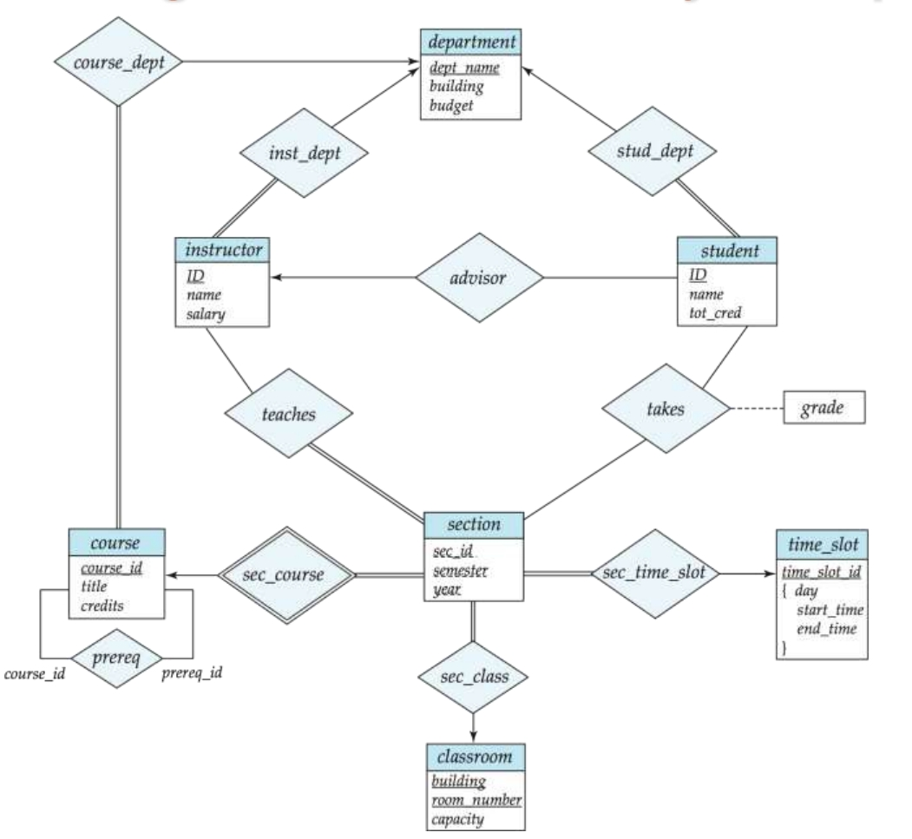

---

### Entity Sets

**实体集**(entity set)是共享相同性质或属性的、具有相同类型的实体的集合。

实体集不必互不相交。

实体通过一组**属性**(attribute)来表示。属性是实体集中每个成员所拥有的描述性性质。为实体集设计一个属性表明数据库存储关于该实体集中每个实体的类似信息，但每个实体在每个属性上可以有它自己的值。

实体集在 E-R 图中用一个矩形来表示，该矩形分为两个部分。第一部分在图中为蓝色阴影，它包含实体集的名称。第二部分包含实体集所有属性的名称。

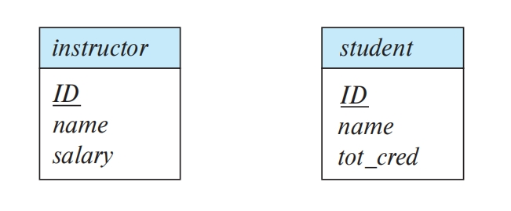

---

### Relationship Sets

**联系**(relationship)是多个实体间的相互关联。

E-R 模式中的一个**联系实例**表示在所建模的现实企业中被命名的实体之间的一种关联。

联系集在 E-R 图中用萎形表示，菱形通过线条连接到多个不同的实体集(矩形)。

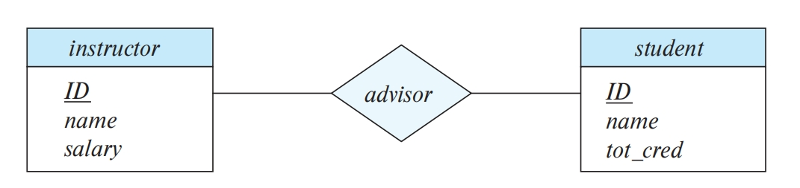

Formally, a relationship set is a mathematical relation on n $\ge$ 2 (possibly nondistinct) entity sets. If $E_1, E_2, \ldots, E_n$ are entity sets, then a relationship set R is a subset of $\{(e_1, e_2, \ldots, e_n) \mid e_i \in E_i\}$ , where $(e_1, e_2, \ldots, e_i)$ is a relationship instance.

---

#### participate

实体集之间的关联被称为参与，即实体集 $E_1, E_2, \ldots, E_n$ **参与**(participate)联系集 R。

---

#### role

实体在联系中扮演的功能被称为实体的**角色**(role)。

- 由于参与一个联系集的实体集通常是互异的，因此角色是隐含的并且一般并不指定。
- 但是，当联系的含义需要解释时，角色是有用的。当参与联系集的实体集并非互异时就是这种情况:同样的实体集以不同的角色多次参与一个联系集。在这类联系集中，有必要用显式的角色名来指明实体是如何参与联系实例的，这类联系集有时被称作**递归的**(recursive)**联系集**。

例如，考虑记录大学中所开设的所有课程的信息的 course 实体集。我们用 course 实体的有序对来建模联系集 prereg 以描述一门课程(C2)是另一门课程(C1)的先修课。每对课程中的第一门课程扮演 C1 课程的角色，而第二门课程扮演 C2 先修课的角色。按照这种方式，所有的 prereg 联系通过(C1,C2)对来表示，排除了(C2,C1)对。

在E-R图中，我们通过在菱形和矩形之间的连线上进行标注来表示角色。

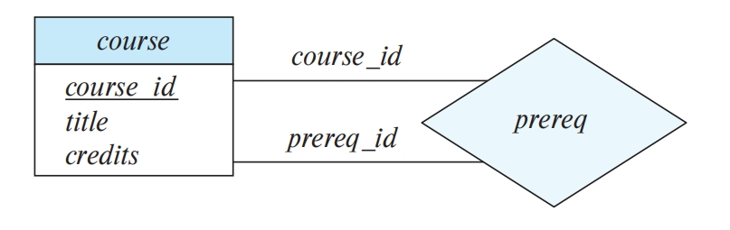

---

#### descriptive attribute

联系也可以具有被称作描述性属性(descriptive attribute)的属性。

作为联系的描述性属性的示例，考虑与 student 和 section 实体集相关联的 takes 联系集。我们可能希望存储联系的描述性属性 grade ，以记录学生在开设的课程中获得的成绩。

联系集的属性在 E-R 图中通过未分割的矩形来表示。我们用虚线将此矩形与表示该联系集的菱形相连接。

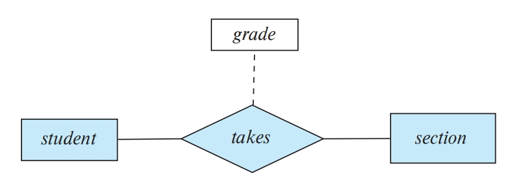

---

#### Degree of a Relationship Set

涉及两个实体集的联系集，也就是二元联系集(binary relationshipset)。

数据库系统中的大部分联系集都是二元的。

然而，有时联系集会涉及多于两个实体集。参与联系集的实体集的数目是联系集的度(degree)。

二元联系集的度为2;三元联系集(ternary relationship set)的度为3。

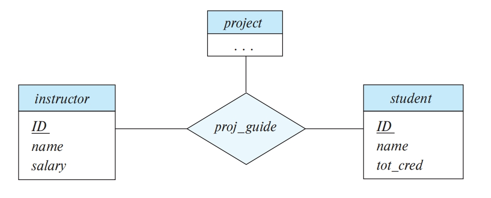

---

## Complex Attributes

对于每个属性都有一个可取值的集合，称为该属性的域(domain)，或者值集(value set)。

E-R 模型中使用的属性可以按照如下的属性类型来进行描述。

---

### Simple and composite attributes

- 上文中出现的属性都是简单的，也就是说，它们不能被划分为子部分。
- 而复合属性可以被划分为子部分(即其他属性)。

例如，name属性可被构建为一个包括 frst_name、middle_initial 和 last_name 的复合属性。

如果用户希望在一些场景中引用整个属性，而在另外的场景中仅引用属性的一部分，则在设计模式中使用复合属性是一种好的选择。复合属性帮助我们把相关属性集合起来，使模型更清晰。

还要注意，复合属性的出现可以是有层次的。在 address 复合属性中，其子属性 street 可以进一步分为 street_number、street_name 和apartment_number。

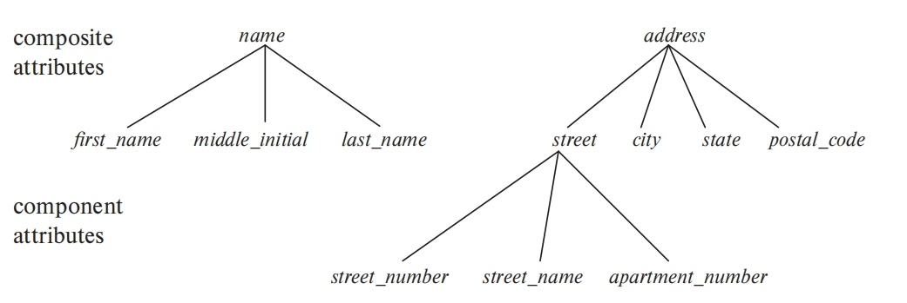

---

### Single-valued and multivalued attributes

例如，对某个特定的学生实体而言，student_ID属性只对应于一个学生ID。这样的属性被称作是**单值**的。

而在某些实例中，对一个特定实体而言，一个属性可能对应于一组值。假设我们往 instructor 实体集中添加一个 phone_number 属性，每位教师可以有零个、一个或多个电话号码，不同的教师可以有不同数量的电话号码。这种类型的属性被称作是**多值**的。

---

### Derived attributes

这类属性的值可以从其他相关属性或实体的值派生出来。

例如，假设 instructor 实体集具有 age 属性，它表示教师的年龄。如果 instructor 实体集还具有 date_of_birth属性，我们就可以从date_of_birth和当前日期计算出 age。因此 age 就是派生属性。

- date_of_birh可以称为**基**(base)属性，或**存储**的(stored)属性。
- 派生属性的值并不存储，而是在需要时被计算出来。

---

### Example figure

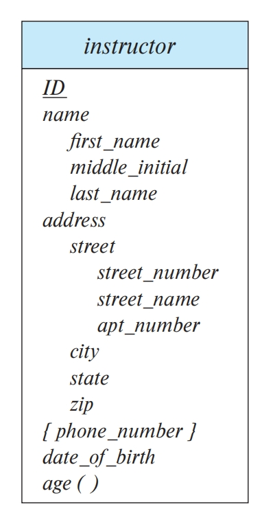

Here, a composite attribute name with component attributes first_name, middle_initial,and last_name replaces the simple attribute name of instructor. 

As another example, suppose we were to add an address to the instructor entity set. The address can be defined as the composite attribute address with the attributes street, city, state, and postalcode. The attribute street is itself a composite attribute whose component attributes are street_number, street_name, and apartment_number. 

The figure also illustrates a multivalued attribute phone_number, denoted by "{phone number}", and a derived attribute
age, depicted by "age ( )".

---

## Mapping Cardinalities

映射基数(mapping cardinality)或基数比率，表示一个实体能通过一个联系集关联的另一些实体的数量。

对于实体集 A 和 B 之间的二元联系集 R 来说，映射基数必然是以下情况之一:

1. 一对一(one-to-one)。 A 中的一个实体至多与 B 中的一个实体相关联，并且 B 中的一个实体也至多与 A 中的一个实体相关联。
2. 一对多(one-to-many)。A 中的一个实体可以与 B 中任意数量(零个或多个)的实体相关联，而 B 中的一个实体至多与 A 中的一个实体相关联。

3. 多对一(many-to-one)。A 中的一个实体至多与 B 中的一个实体相关联，而 B 中的一个实体可以与 A 中任意数量(零个或多个)的实体相关联。
4. 多对多(many-to-many)。A 中的一个实体可以与 B 中任意数量(零个或多个)的实体相关联，而且 B 中的一个实体也可以与A中任意数量(零个或多个)的实体相关联。

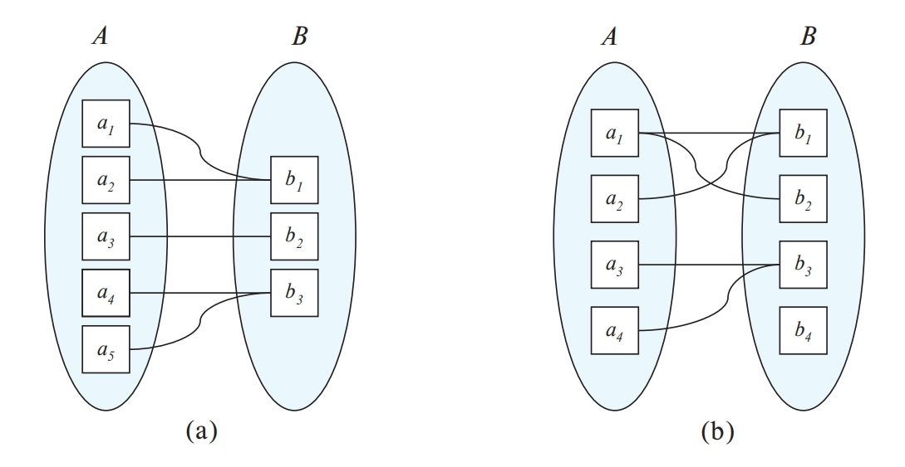

In the E-R diagram notation, we indicate cardinality constraints on a relationship by drawing either a directed line ($\rightarrow$) or an undirected line (—) between the relationship set and the entity set in question. 

1. 一对一(one-to-one)。我们从联系集到两个实体集各画一条有向线段。

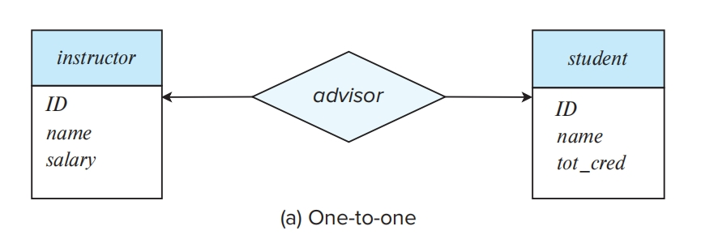

表示一位教师最多可以指导一名学生，并且一名学生最多可以有一位导师。

2. 一对多(one-to-many)。我们从联系集到联系的"一"侧画一条有向线段。

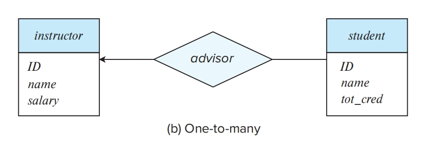

这表示一位教师可以指导多名学生，但一名学生最多只能有一位导师。

3. 多对一(many-to-one)。我们从联系集到联系的"一"侧画一条有向线段。

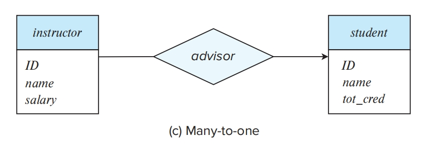

这表示一位教师最多可以指导一名学生，但一名学生可以有多位导师。

4. 多对多(many-to-many)。我们从联系集到两个实体集各画一条无向线段。

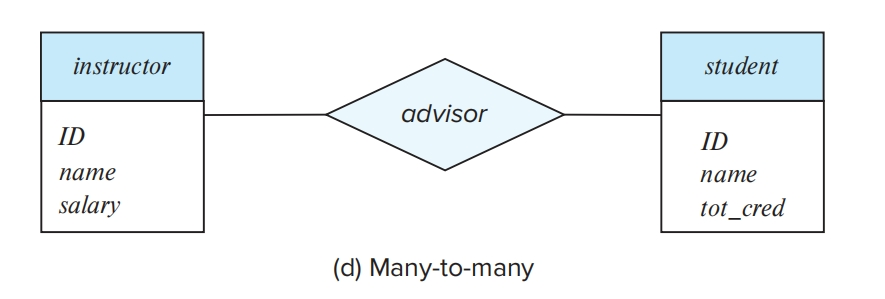

这表示一位教师可以指导多名学生，并且一名学生可以有多位导师。

---

如果实体集 E 中的每个实体都必须参与到联系集 R 中的至少一个联系中，那么实体集 E 在联系集 R 中的参与就被称为是全部(total)的。如果 E 中一些实体可能不参与到 R 的联系中，那么实体集与在联系集 R 中的参与就被称为是部分(partial)的。

例如，一所大学可能要求每名学生至少有一位导师;在 E-R 模型中，这相当于要求每个 student 实体通过 advisor 联系至少与一位教师相关联。因而， student 在 advisor 联系集中的参与是全部的。而一位教师不是必须要指导学生。因此，可能只有某些 instructor 实体通过 advisor 联系同 student 实体集相关联，那么 instructor 在 adviso r联系集中的参与是部分的。

我们用**双线**表示一个实体在联系集中的全部参与。

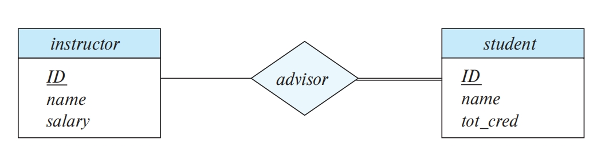

E-R 图还提供了一种方式来描述更复杂的约束，这种约束限制了每个实体参与联系集中的联系的次数。线段上可以有一个关联的最小和最大基数，用 $l \ldots h$ 的形式表示，其中 l 表示最小基数，h 表示最大基数。

最小值为 1 表示实体集全部参与联系集，即实体集中的每个实体在该联系集中的至少一个联系中出现。最大值为 1 表示实体至多参与一个联系，而最大值为 * 代表没有限制。

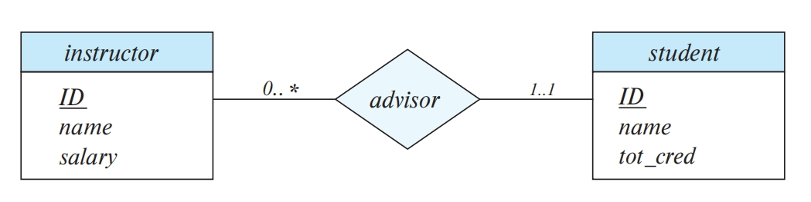

advisor 和 student 之间的线段有 1.1 的基数约束，这意味着基数的最小值和最大值都是1。也就是说，每名学生必须有且只有一位导师。 advisor 和 instructor 之间的线段有 `0.*` 的限制，说明一位教师可以有零名或多名学生。因此，advisor 联系是从 insiructor 到 student 的一对多联系，更进一步地讲，student 在 advisor 中的参与是全部的这意味着一名学生必须有一位导师。

很容易将左侧的边上的 `0.*` 曲解为 advisor 联系是从 instructor 到 student 的多对一联系，这正好和正确的解释**相反**，实际上应该是**一对多**。

---

## Primary Key

If the relationship set R has no attributes associated with it, then the set of attributes

$$primary-key(E1) \cup primary-key(E2) \cup \dots \cup primary-key(En)$$

describes an individual relationship in set R.

If the relationship set R has attributes $a_1, a_2, \dots, a_m$ associated with it, then the set of attributes

$$primary-key(E1) \cup primary-key(E2) \cup \dots \cup primary-key(En) \cup \{a_1, a_2, \dots, a_m\}$$

describes an individual relationship in set R.

在上述两种情况下， $primary-key(E1) \cup primary-key(E2) \cup \dots \cup primary-key(En)$ 构成了联系集的一个 super-key 。

二元联系集主码的选择取决于联系集的映射基数。

对于多对多关系，前述主码的并集是最小的超码，并被选作主码。

对于一对多和多对一关系,"多"方的主码是最小的超码，并被用作主码。例如，如果从 student 到 instructor 的联系是多对一的，即每名学生最多只能有一位导师，则 advisor 的主码就仅是 student 的主码。

对于一对一的联系，任一参与实体集的主码都构成最小超码，并且可以选择任意一个作为联系集的主码。

---

### Weak Entity Sets

弱实体集(weak entity set)的存在依赖于另一个实体集，称为其标识性实体集(identifying entity set);我们使用标识性实体集的主码以及称为分辨符属性(discriminator attribute)的额外属性来唯一地标识弱实体，而不是将主码与弱实体相关联。非弱实体集的实体集被称为强实体集(strong entity set)。

每个弱实体必须和一个标识性实体相关联;也就是说，实体集被称为存在依赖(existence dependent)于标识性实体集。标识性实体集被称为拥有(own)它所标识的弱实体集。将弱实体集与标识性实体集相关联的联系被称为标识性联系(identifying relationship)。标识性联系是从弱实体集到标识性实体集的多对一联系，并且弱实体集在联系中的参与是全部的。标识性联系集不应该有任何描述性属性，因为任何这样的属性都可以与弱实体集相关联。

在我们的示例中，section 的标识性实体集是 course ，将 section 实体和它们对应的 course 实体关联在一起的 sec_course 联系是标识性联系。section 的主码由标识性实体集(即course)的主码加上弱实体集(即section)的分辨符构成。因此，主码就是{course_id，sec_id,year, semester}.

In our example, the identifying entity set for section is course, and the relationship sec_course, which associates section entities with their corresponding course entities, is the identifying relationship. The primary key of section is formed by the primary key of the identifying entity set (that is, course), plus the discriminator of the weak entity set (that is, section). Thus, the primary key is {course id, sec_id, year, semester}.

在 E-R 图中，通过双边框的矩形描述弱实体集，其分辨符被加上虚的下划线。关联弱实体集和标识性强实体集的联系集以双边框的菱形表示。

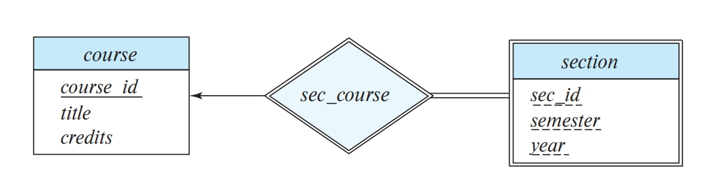

该图还说明使用双线来表示的(弱)实体集 section 在 sec_course 联系中的参与是全部的，这意味着每个课程段必须通过 sec_course 与某门课程相关联。最后，从 sec_course 指向 course 的箭头表示每个课程段与单门课程相关联。通常，弱实体集必须全部参与其标识性联系集，并且该联系是到标识性实体集的多对一联系。

弱实体集可以参与除标识性联系之外的联系。例如，section 实体可以参与与 time_slot 实体集的联系，以标识特定课程段的上课时间。弱实体集可以作为属主参与与另一个弱实体集的标识性联系。一个弱实体集也可能与不止一个标识性实体集相关联。

这样，一个特定的弱实体将通过实体的组合来标识，每个标识性实体集有一个实体在该组合中。实体集的主码可以由标识性实体集主码的并集再加上弱实体集的分辨符组成。

---

## Reducing E-R Diagrams to Relational Schemas

### Representing Entity Sets

- A strong entity set reduces to a schema with the same attributes

course($\underline{course\_id}$, title, credits)

- A weak entity set becomes a table that includes a column for the primary key of the identifying strong entity set

Primary key of the table is the union of the discriminator of the weak entity set and the primary key of the identifying strong entity set

section( $\underline{course\_id, sec\_id, semester, year}$ )

对于 identifying relationship ，在 weak entity set 被转换后就不需要单独再处理了，因为 weak entity set 相当于是依赖于 indentifying strong entity set 的，已经包含需要转换的信息了。

- A many-to-many relationship set is represented as a schema with attributes for the primary keys of the two participating entity sets, and any descriptive attributes of the relationship set.

- Many-to-one and one-to-many relationship sets that are total on the many-side can be represented by adding an extra attribute to the "many" side, containing the primary key of the "one" side

---

### Composite and Multivalued Attributes

Composite attributes are flattened out by creating a separate attribute for each component attribute.

instructor(ID, first_name, middle_initial, last_name, street_number, street_name, apt_number, city, state, zip_code, date_of_birth, age )

A multivalued attribute M of an entity E is represented by a separate schema EM

Schema EM has attributes corresponding to the primary key of E and an attribute corresponding to multivalued attribute M

**Example**: Multivalued attribute phone_number of instructor is represented by a schema:

$$inst\_phone= ( ID, \underline{phone\_number})$$

**Special case**: entity time_slot has only one attribute other than the primary-key attribute, and that attribute is multivalued

$$time\_slot(\underline{time\_slot\_id})$$

$$time\_slot\_detail(\underline{time\_slot\_id, day, start\_time}, end\_time)$$

Optimization: Don’t create the relation corresponding to the entity, just create the one corresponding to the multivalued attribute

$$time\_slot(\underline{time\_slot_{id}, day, start\_time}, end\_time)$$

---

## Entity-Relationship Design Issues

1. 创建 E-R 模型时一种常见的错误是使用一个实体集的主码作为另一个实体集的属性，而不是使用联系。

例如，在我们的大学E-R模型中，将 dept_name 作为 student 的属性是不正确的，即使它作为 student 的关系模式中的属性存在。stud_dept 联系是在 E-R 模型中表示此信息的正确方式，因为它可以明确表示 student 和 department 之间的联系，而不是将这种联系隐含在属性中。同时存在 dept_name 属性以及stud_dept联系将导致信息重复。

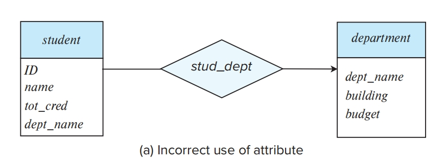

2. 在需要多值属性的情况下使用具有单值属性的联系。

例如，假设我们决定表示学生在一个开设的课程段(section)的不同作业中所获得的分数。一种错误的做法是给 stud_section 联系添加 assignment 和 marks 两个属性。

这种设计的问题在于，我们只能表示一个给定的学生-课程段对的单次赋值，因为联系实例必须通过参与实体student和section来唯一标识。

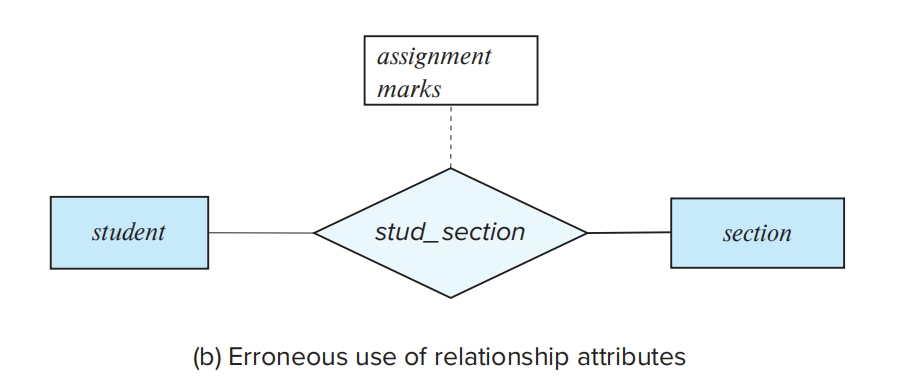

一种解决方案是将 assignment 建模为由 section 标识的弱实体，并在 assignment 和 student 之间添加 marks_in 联系，该联系将具有一个 marks 属性。

一种替代的解决方案是给 stud_section 使用多值复合属性 {assignment_marks}，其中 assignment_marks 具有成员属性 assignment 和 marks 。在这种情况下，最好将课程作业建模为弱实体，因为它允许记录有关作业的其他信息，比如最高分或截止日期。

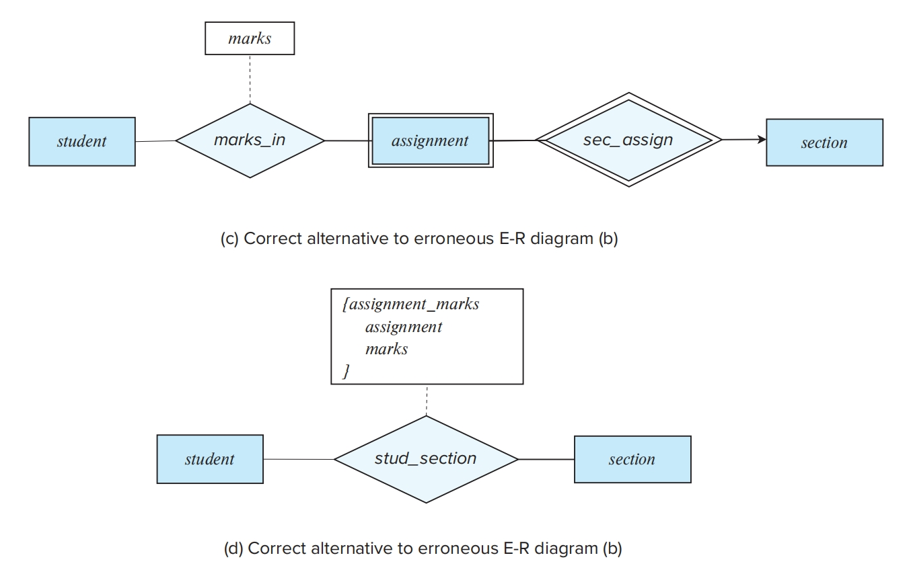

3. Use of Entity Sets versus Attributes

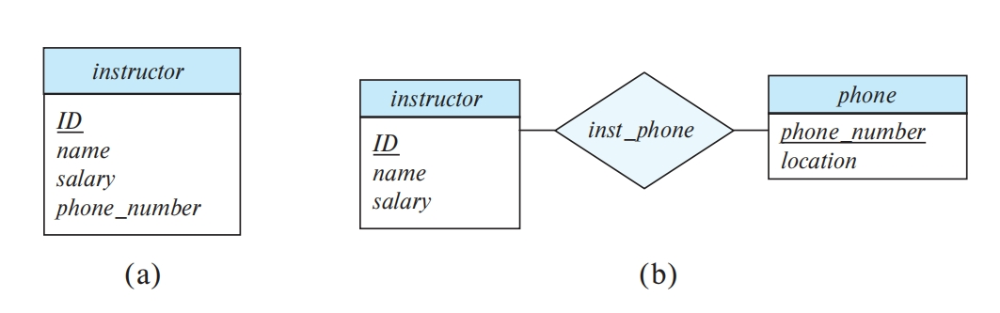

- 利：表达更多信息属性、表达更多老师之间的关系
- 弊：增加复杂性，多了一个表

那么，教师的这两种定义之间的主要差别是什么呢?将电话看成一个 phone_number 属性暗示每位教师恰好有一个电话号码。将电话看成一个 phone 实体则允许教师可以有若干电话号码(包括零个)与之相关联。然而，我们还可以简单地将 phone_number 定义为多值属性，从而允许每位教师有多部电话。

那么主要的差别就是，在一个人希望保存关于电话的额外信息，如它的位置或它的类型(移动电话、IP电话或简单的老式电话)，或共享该电话的所有的人时，将电话看作一个实体是一种更好的建模方式。因此，把电话视为一个实体比把它视为一个属性更具通用性，而且当通用性可能有用的时候，这种定义方式就更为适合了。

4. Use of Entity Sets versus Relationship Sets

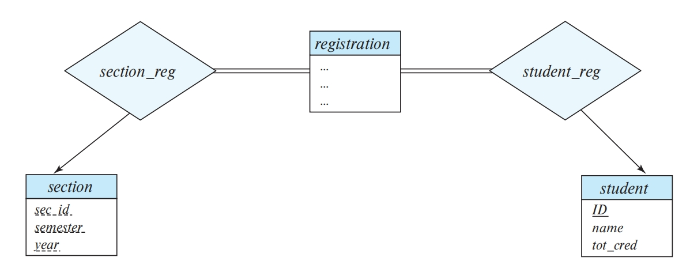

一个教学班有很多学生注册，但是一个注册信息只对应一个学生。一件事设计成 relationship 还是 entity 也是一种选择。

这里有一个原则，假如一个 registration 有其他实体与它发生联系，此时把 takes 设计成 relationship 会更好表达，是两个实体间的 relationship。

5. Placement of relationship attributes

Attribute date as attribute of access or as attribute of account are different.

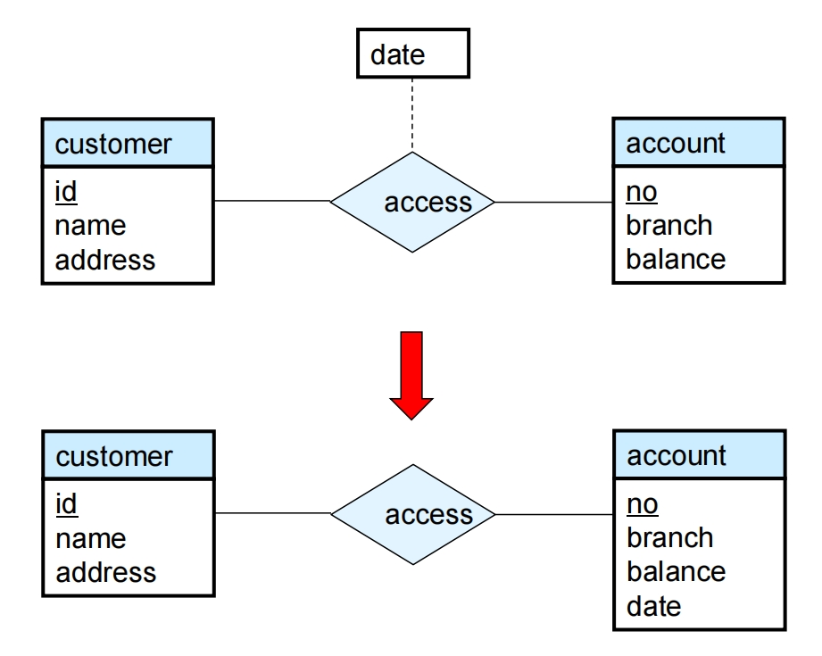

6. Binary Vs. Non-Binary Relationships

- 多元联系本质上可以转换成多个二元联系。
- n元联系集可以更清晰地表示几个实体参与到单个联系中。
- 有可能无法将三元联系上的约束转换为多个二元联系上约束。

---

## Extended E-R Features

### Specialization(特化)

- Top-down design process:
    we designate subgroupings within an entity set that are distinctive from other entities in the set.
- Attribute inheritance: 
    a lower-level entity set inherits all the attributes and relationship participation of the higher-level entity set to which it is linked.

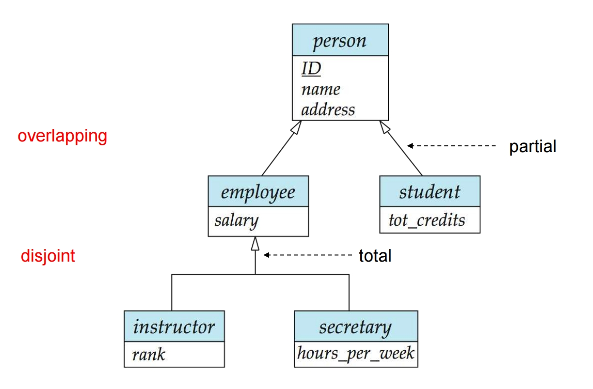

我们在 E-R 图中描述特化的方式取决于一个实体是否可以属于多个特化实体集，或者它是否必须属于至多一个特化实体集。

前者(允许多个集合)称为重叠特化(overlapping specialization)，而后者(允许至多一个集合)称为不相交特化(disjoint specialization)。

- 对于重叠特化(如 student 和 employee 作为 person 的特化的情况)，使用两个单独的箭头。
- 对于不相交特化(如instructor和secretary作为employee的特化的情况)，使用单个箭头。

特化联系还可能被称作超类-子类(superclass-subclass)联系。高层和低层实体集按普通实体集表示——即包含实体集名称的矩形。

---

### Generalization（概化）

A bottom-up design process: 
    combine a number of entity sets that share the same features into a higher-level entity set.

---

### Representing Specialization via Schemas

#### method 1

Drawback: getting information about, an employee requires accessing two relations, the one corresponding to the low-level  schema and the one corresponding to the high-level schema

---

#### method 2

Drawback: name, street and city may be stored redundantly for people who are both students and employees

所以最好是 disjoint 的

---

#### method 3

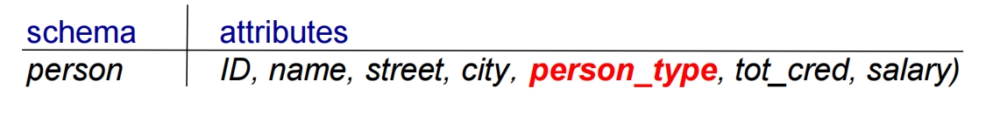

Drawback: 首先是表太长了，其次是表太稀疏了，Null 值会比较多。

---

## Alternative Notations for Modeling Data

### Alternative E-R Notations

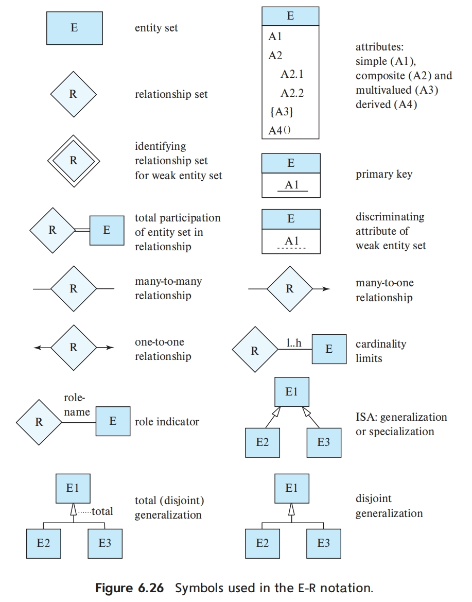

---

### The Unified Modeling Language UML

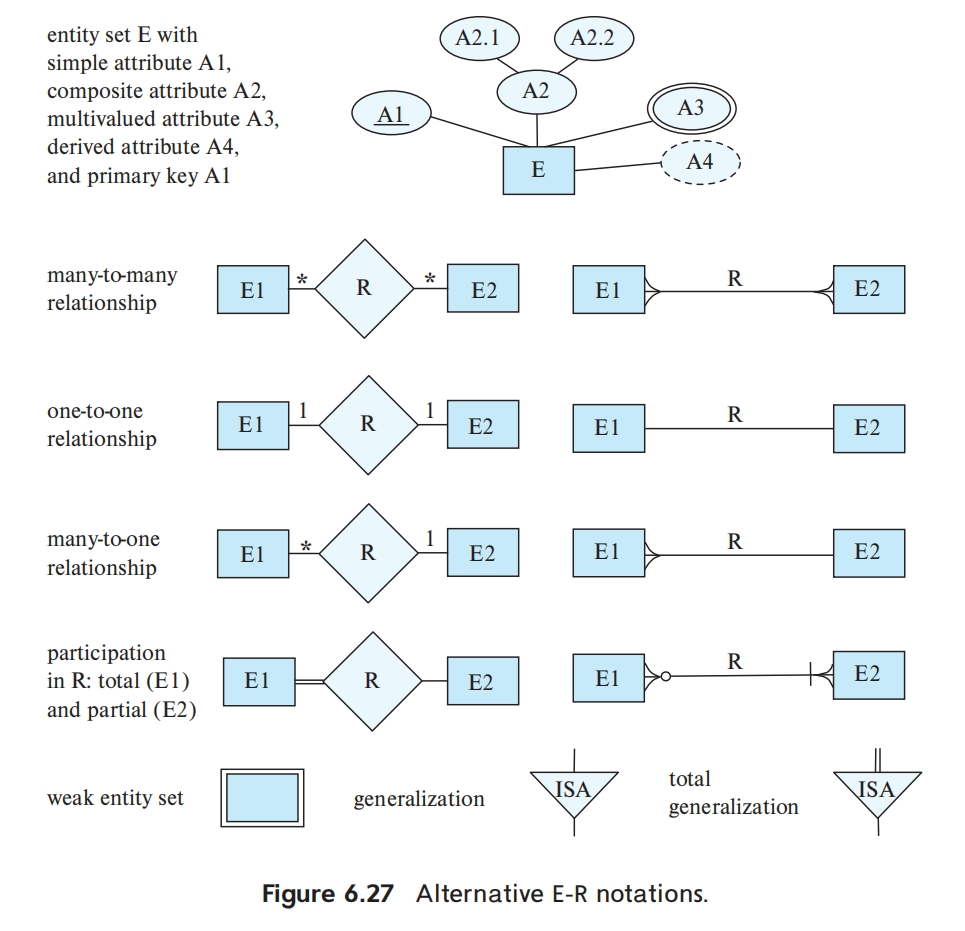

---