# Chapter 7 | Relational Database Design

!!! info "前情提要"
    本章会出现很多"码"，在这里先行梳理一下。

    1. 超码：能够唯一标识一条记录的属性或属性集

    2. 候选码：能够唯一标识一条记录的最小属性集(不含多余属性)
    
    3. 主码：某个能够唯一标识一条记录的最小属性集（候选码中的"人选之子"）

Suppose we combine instructor and department into inst_dept.

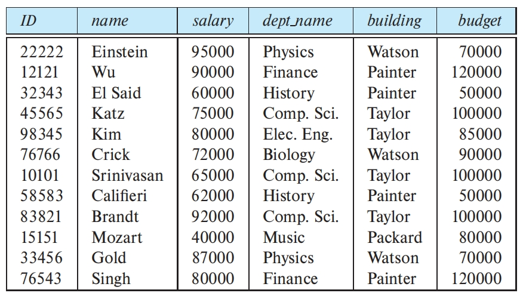

所有这些元组的预算数额统一这一点是重要的，否则我们的数据库将会不一致。在使用 `instructor` 和 `department` 的原始设计中，我们对每个预算的数额只存储一次。这说明使用 `inst_dept` 是一个坏主意，因为它重复存储预算数额，并且需要承担某些用户可能更新一个元组而不是所有元组中的预算数额并因此产生不一致性的风险。

即使我们决定容忍冗余的问题，`inst_dept` 模式仍然存在其他问题。假设我们在大学里创立一个新的系。在上面的备选设计方案中，我们无法直接表达关于一个系的信息(`dept_name,building,budget`)，除非该系在大学中至少有一位教师。这是因为 `inst_dept` 表中的元组需要 `ID`、`name` 和 `salary` 的值。这意味着我们不能记录新成立的系的相关信息，直到这个新系录用了第一位教师为止。在旧的设计中，`department` 模式可以处理这种情况，但是在修改后的设计中，我们将不得不创建一个 `building` 和 `budget` 为空值的元组。在某些情况下，空值会带来麻烦。

Pitfalls of the "bad" relations:

- Information repetition (信息重复)
- Insertion anomalies (插入异常)
- Update difficulty (更新困难)

---

## Decomposition

避免 `inst_dept` 模式中的信息重复问题的唯一方式是将其分解为两个模式(在本例中为 `instructor` 和 `department` 模式)。

并非所有的模式分解都是有益的。请考虑所有模式都由一个属性构成的极端情况。任何类型的有意义的联系都无法被表示。

Now consider a less extreme case where we choose to decompose the employee schema : employee (ID, name, street, city, salary), into the following two schemas: employee1 (ID, name)  employee2 (name, street, city, salary)

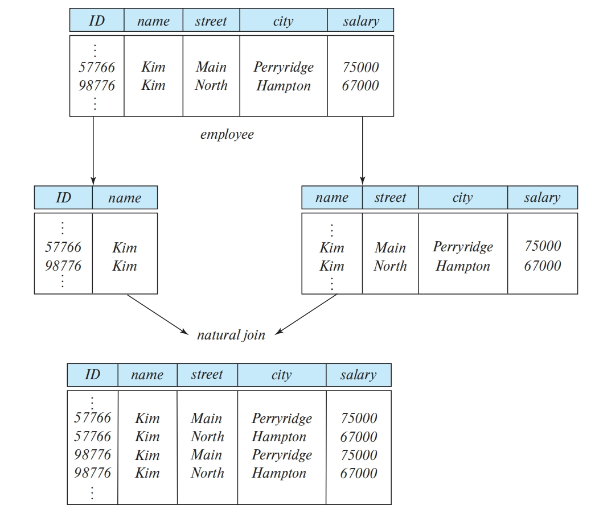

在企业可能拥有两个重名职员的情况下会暴露这个分解的缺陷。虽然我们拥有更多的元组，但是实际上从以下意义来讲我们却拥有更少的信息。我们能够指出一个特定的街道、城市和工资属于某个名为 Kim 的人，但是我们无法区分出是哪一个 Kim 。因此，我们的分解无法表达关于大学职员的特定的重要事实。我们想要避免这样的分解。我们将这样的分解称为**有损分解**(lossy decomposition)，而将那些没有信息丢失的称为**无损分解**(lossless decomposition)。

我们现在可以定义一种通用的方法来导出一组模式，使得每个模式都是"良构的";也就是说，它不受信息重复问题的影响。

用于设计关系数据库的方法是使用一个通常称为**规范化**(normalization)的过程。其目标是生成一组关系模式，允许我们存储信息并避免不必要的冗余，同时还允许我们轻松地检索信息。

---

### Lossless Decomposition

令 R 为关系模式，并令 $R_1$ 和 $R_2$ 构成 R 的分解——也就是说，将R、 $R_1$ 和 $R_2$ 视为属性集， $R = R_1 \cup R_2$ 。如果用两个关系模式 $R_1$ 和 $R_2$ 去替代 R 时没有信息丢失，则我们称该分解是一个无损分解。

In SQL query:

```sql
select *
from (select R1 from r)
    natural join
    (select R2 from r)
```

In the relational algebra:

$$\Pi_{R_1}(r) \bowtie \Pi_{R_2}(r) = r$$

---

## Functional Dependencies

Let R be a relation schema $\alpha \subseteq R$ and $\beta \subseteq R$ . 

The functional dependency $\alpha \rightarrow \beta$ holds on R if and only if for any legal relations r(R), whenever any two tuples $t_1$ and $t_2$ of r agree on the attributes $\alpha$, they also agree on the attributes $\beta$. 

That is, $t_1[\alpha] = t_2[\alpha] \rightarrow t_1[\beta] = t_2[\beta]$

使用函数依赖这一概念，我们说如果函数依赖 $K \rightarrow R$ 在 r(R) 上成立，则 K 是 r(R) 的一个超码。换句话说，如果对于 r(R) 的每个合法实例，对于来自实例的每对元组 $t_1$ and $t_2$ ，只要 $t_1$ [K] = $t_2$ [K]，就总有 $t_1$ [R]= $t_2$ [R]成立(即 $t_1 = t_2$)，则 K 就是一个超码。

---

### Trivial Functional Dependencies

Some functional dependencies are said to be **trivial** because they are satisfied by all relations. In general, a functional dependency of the form $\alpha \rightarrow \beta$ is trivial if $\beta \subseteq \alpha$.

For example, $A \rightarrow A$ is satisfied by all relations involving attribute A. Reading the definition of functional dependency literally, we see that, for all tuples $t_1$ and $t_2$ such that $t_1$[A] = $t_2$[A], it is the case that $t_1$[A] = $t_2$[A]. Similarly, $AB \rightarrow A$ is satisfied by all relations involving attribute A.

We shall use the notation $F^+$ to denote the **closure** of the set F, that is, the set of all functional dependencies that can be inferred given the set F. $F^+$ contains all of the functional dependencies in F.

---

### Lossless Decomposition and Functional Dependencies

$R_1$ and $R_2$ form a lossless decomposition of R if at least one of the following functional dependencies is in $F^+$:

- $R_1 \cap R_2 \rightarrow R_1$
- $R_1 \cap R_2 \rightarrow R_2$

In other words, if $R_1 \cap R_2$ forms a superkey for either $R_1$ or $R_2$, the decomposition of R is a lossless decomposition.

Suppose we decompose a relation schema r(R) into $r_1(R_1)$ and $r_2(R_2)$, where $R_1 \cap R_2 = R_1$. Then the following SQL constraints must be imposed on the decomposed schema to ensure their contents are consistent with the original schema.

- $R_1 \cap R_2$ is the primary key of $r_1$

This constraint enforces the functional dependency.

- $R_1 \cap R_2$ is a foreign key from $r_2$ referencing $r_1$

This constraint ensures that each tuple in $r_2$ has a matching tuple in $r_1$ , without which it would not appear in the natural join of $r_1$ and $r_2$.

We can find $F^+$, the closure of F, by repeatedly applying Armstrong's Axioms:

if $\beta \subseteq \alpha$ , then $\alpha \rightarrow \beta$ (reflexivity,自反率)

if $\alpha \rightarrow \beta$ , then $\gamma \alpha \rightarrow \gamma\beta$ (augmentation，增补率)

if $\alpha \rightarrow \beta$ and $\beta \rightarrow \gamma$ , then $\alpha \rightarrow \gamma$ (transitivity，传递率)

??? Example "Exercise"
    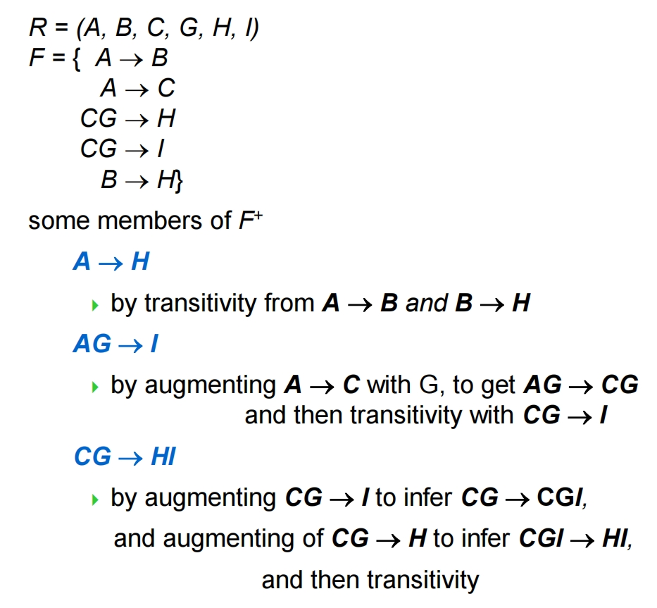

**Additional rules**:

If $\alpha \rightarrow \beta$ holds and $\alpha \rightarrow \gamma$ holds, then $\alpha \rightarrow \beta \gamma$ holds (union，合并)

If $\alpha \rightarrow \beta \gamma$ holds, then $\alpha \rightarrow \beta$ holds and $\alpha \rightarrow \gamma$ holds (decomposition，分解)

If $\alpha \rightarrow \beta$ holds and $\gamma \beta \rightarrow \delta$ holds, then $\alpha \gamma \rightarrow \delta$ holds (pseudo transitivity，伪传递)

---

#### Algorithm to compute $\alpha^+$, the closure of $\alpha$ under F

result := $\alpha$;

while (changes to result) do

for each $\beta \rightarrow \gamma$ in F do

begin

if $\beta \subseteq result$ then result := result $\cup \ \gamma$

end
    
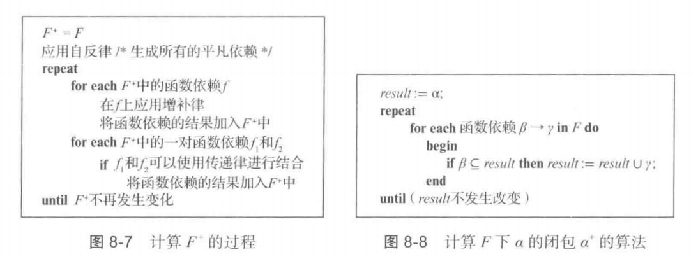

**Prove:**

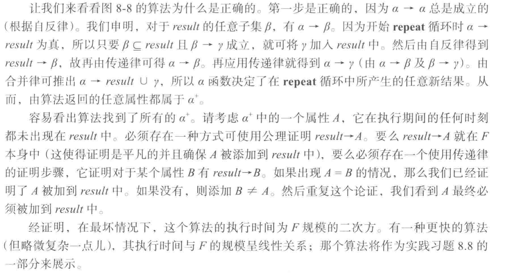

There are several uses of the attribute closure algorithm:

1. To test if $\alpha$ is a superkey, we compute $\alpha^+$ and check if $\alpha^+$ contains all attributes in R.
2. We can check if a functional dependency $\alpha \rightarrow \beta$ holds (or, in other words, is in $F^+$), by checking if $\beta \subseteq \alpha^+$. That is, we compute $\alpha^+$ by using attribute closure, and then check if it contains $\beta$.
3. It gives us an alternative way to compute $F^+$ : For each $\gamma \subseteq R$, we find the closure $\gamma^+$, and for each $S \subseteq \gamma^+$, we output a functional dependency $\gamma \rightarrow S$.

??? Example "Exercise"
    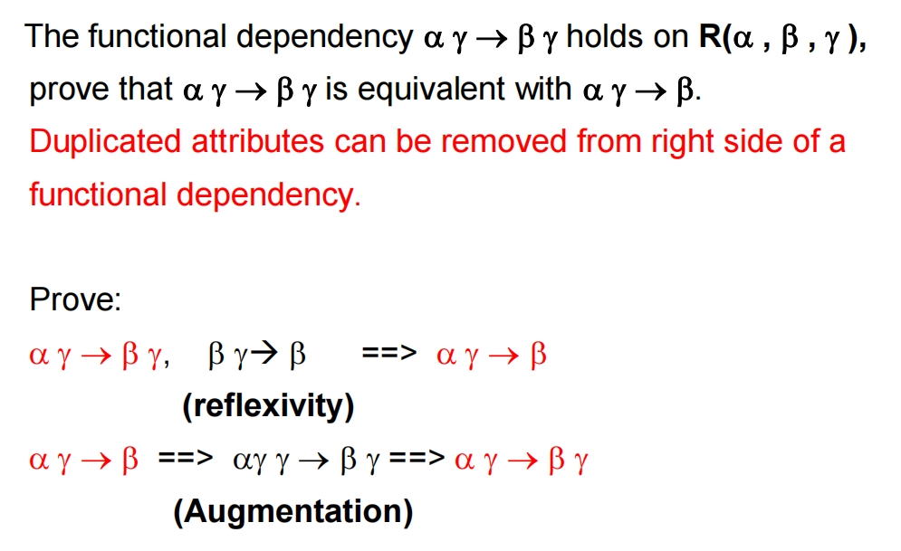

??? Example "Exercise"
    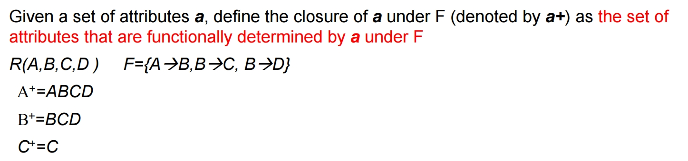

---

## Canonical Cover（正则覆盖）

假设我们在一个关系模式上有一个函数依赖集 F 。每当用户在该关系上执行更新时，数据库系统必须确保此更新不破坏任何函数依赖，也就是说，F 中的所有函数依赖在新的数据库状态下仍然被满足。

如果更新违反了集合 F 中的任意函数依赖，则系统必须回滚该更新。

我们可以通过测试与给定函数依赖集具有相同闭包的一个简化集的方式来减小花费在违反检测方面的开销。由于简化集和原集具有相同的闭包，所以满足函数依赖简化集的任何数据库也一定满足原集，反之亦然。

F 的正则覆盖 $F_c$ 是这样的一个依赖集: F 逻辑蕴涵 $F_c$ 中的所有依赖并且 $F_c$ 逻辑蕴涵 F 中的所有依赖。此外， $F_c$ 必须具备如下性质:

-  $F_c$ 中任何函数依赖都不包含无关属性。
-  $F_c$ 中每个函数依赖的左边都是唯一的。也就是说，在 $F_c$ 中不存在两个函数依赖 $\alpha_1 \rightarrow \beta_1$ 和 $\alpha_2  \rightarrow \beta_2$ ，满足 $\alpha_1 = \alpha_2$ 。

Sets of functional dependencies may have redundant dependencies that can be inferred from the others.

Parts of a functional dependency may be redundant:

{A $\rightarrow$ B, B $\rightarrow$ C, A $\rightarrow$ CD} can be simplified to  {A $\rightarrow$ B, B $\rightarrow$ C, A $\rightarrow$ D}

> A $\rightarrow$ CD=> A $\rightarrow$ D
> 
> A $\rightarrow$ B,B $\rightarrow$ C => A $\rightarrow$ C , A $\rightarrow$ D => A $\rightarrow$ CD

Intuitively, a canonical cover of F is a "minimal" set of functional dependencies equivalent to F, having no redundant dependencies or redundant parts of dependencies.

---

## Extraneous Attributes(无关属性)

如果我们可以去除函数依赖的一个属性而不改变该函数依赖集的闭包，则称该属性是无关的。

Consider a set F of functional dependencies and the functional  dependency $\alpha \rightarrow \beta$ in F. 

- Attribute A is extraneous in $\alpha$ if $A \in \alpha$ and F logically implies $(F - \{\alpha \rightarrow \beta \}) \cup \{ (\alpha - A) \rightarrow \beta \}$.
- Attribute A is extraneous in $\beta$ if $A \in \beta$ and the set of functional dependencies $(F - \{\alpha \rightarrow \beta \}) \cup \{ \alpha \rightarrow (\beta - A) \}$ logically implies F.

Note: implication in the opposite direction is trivial in each of the cases above, since a "stronger" functional dependency always implies a weaker one

???+ Example
    1. Given F = {A $\rightarrow$ C, AB $\rightarrow$ C }

    2. Given F = {A $\rightarrow$ C, AB $\rightarrow$ CD}

??? Example "answer"
    1. B is extraneous in AB $\rightarrow$ C because {A $\rightarrow$ C, AB $\rightarrow$ C} logically  implies A $\rightarrow$ C.

    2. C is extraneous in AB $\rightarrow$ CD since AB $\rightarrow$ C can be inferred even after deleting C

???+ Question "Computing a Canonical Cover"
    R = (A, B, C)

    F = {A $\rightarrow$ BC  B $\rightarrow$ C  A $\rightarrow$ B  AB $\rightarrow$ C}

??? Example "answer"
    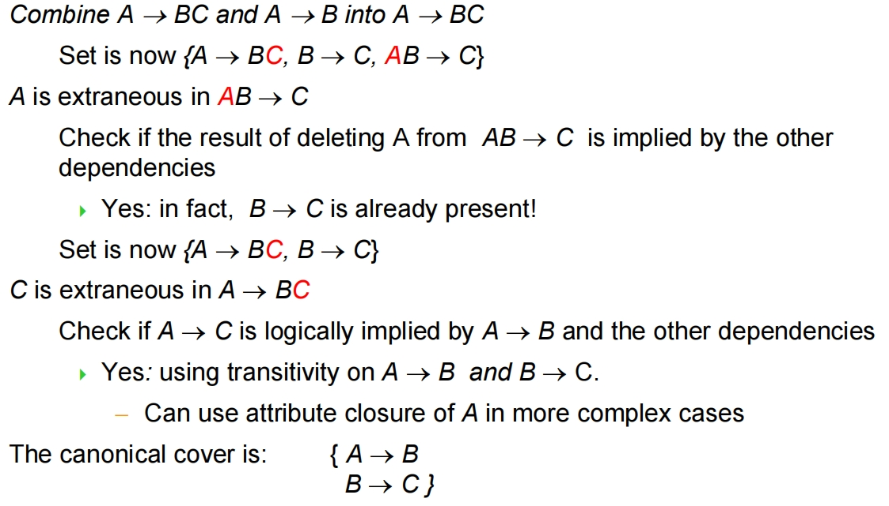

    合理运用画图

    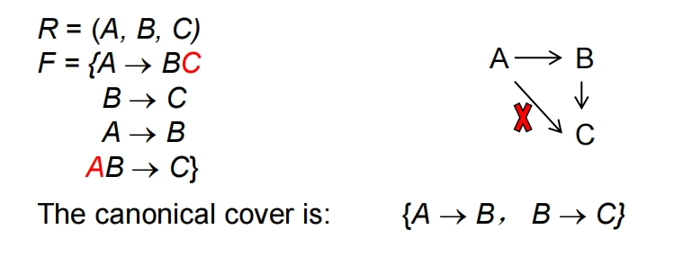

???+ Example "Exercise"
    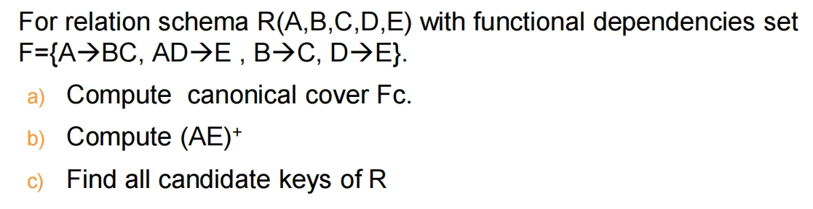

??? Example "answer"
    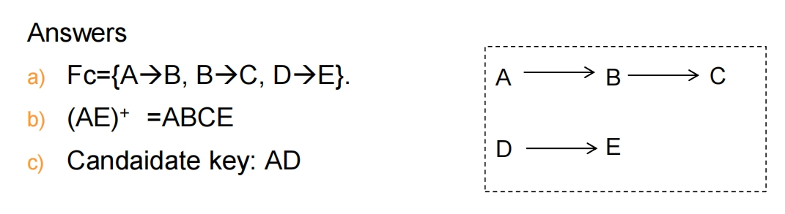

---

## Boyce-Codd Normal Form

A relation schema R is in BCNF with respect to a set F of functional dependencies if for all functional dependencies in $F^+$ of the form $\alpha \rightarrow \beta$, where $\alpha \subseteq R$ and $\beta \subseteq R$, at least one of the following holds:

1. $\alpha$ is a superkey for R
2. $\alpha \rightarrow \beta$ is trivial

Suppose we have a schema R and a non-trivial dependency $\alpha \rightarrow \beta$ causes a violation of BCNF.

We decompose R into: $(\alpha \cup \beta)$ and $R - (\beta - \alpha)$

---

### BCNF Decomposition Algorithm

result := {R };

done := false;

while (not done) do

if (there is a schema $R_i$ in result that is not in BCNF)

then begin

let $\alpha \rightarrow \beta$ be a nontrivial functional dependency that holds on $R_i$ such that $\alpha^+$ does not contain $R_i$ and $\alpha \cap \beta = \emptyset$;

result := (result – $R_i$) $\cap$ ($R_i – \beta$) $\cap$ ($\alpha$, $\beta$);

end

else done := true;

这个算法所产生的分解不仅满足 BCNF ，而且还是无损分解。来看看为什么我们的算法只产生无损分解，我们注意到，当用 $(R_i - \beta)$ 和 $(\alpha, \beta)$ 来替换 $R_i$ 时，依赖 $\alpha \rightarrow \beta$ 成立，而且 $(R_i - \beta) \cap (\alpha, \beta) = \alpha$。

如果我们没有要求 $\alpha \cap \beta = \emptyset$，那么 $\alpha \cap \beta$ 中的那些属性就不会出现在 $(R_i - \beta)$ 中，而依赖 $\alpha \rightarrow \beta$ 也不再成立。

---

???+ Example "Exercise"
    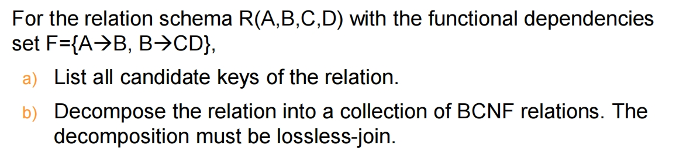

??? Example "answer"
    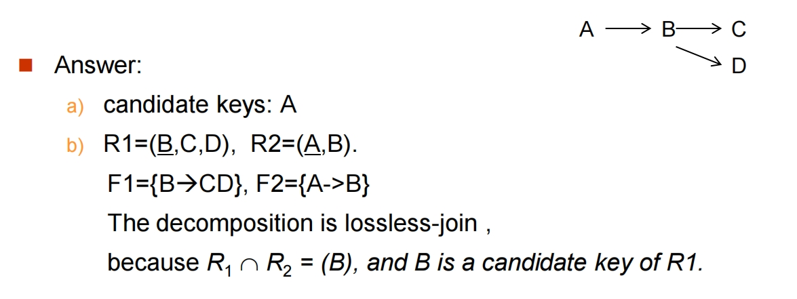

---

## Dependency Preservation

If it is sufficient to test only those dependencies on each individual relation of a decomposition in order to ensure that all functional dependencies hold, then that decomposition is dependency preserving.

如果通过检验单一关系上的函数依赖，就能确保所有的函数依赖成立，那么这样的分解是依赖保持的。或者，原来关系 R 上的每一个函数依赖，都可以在分解后的单一关系上得到检验或者推导得到。

Let $F_i$ be the set of all functional dependencies in $F^+$ that include only attributes in $R_i$. ($F_i$ : the restriction of F on $R_i$ )

- A decomposition is dependency preserving, if (F1 $\cup$ F2 $\cup$ … $\cup$ Fn )$^+$ = F$^+$
- If it is not, then checking updates for violation of functional  dependencies may require computing joins, which is expensive.

???+ Example "Exercise"
    R = (A, B, C )

    F = {A $\rightarrow$ B  B $\rightarrow$ C}

    Key = {A}

??? Example "answer"
    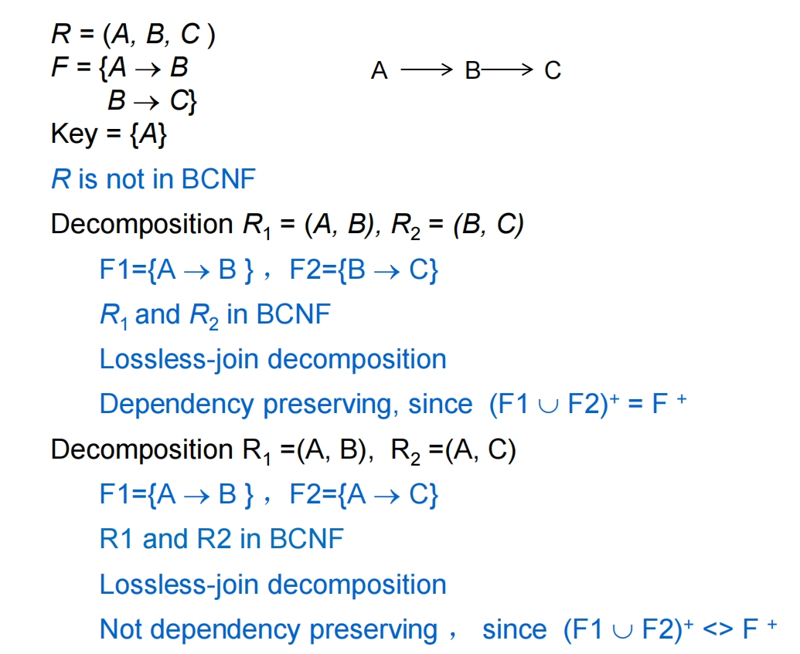

???+ Example "Exercise"
    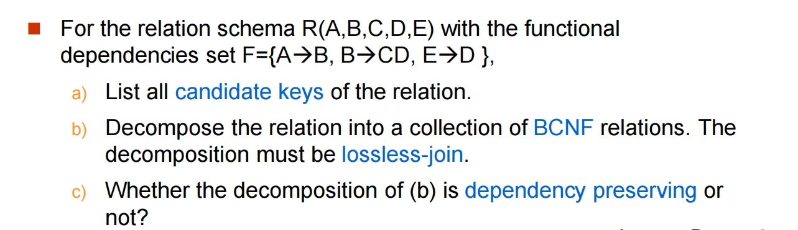

??? Example "answer"
    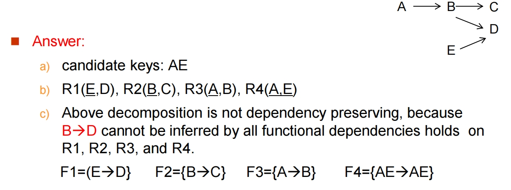
    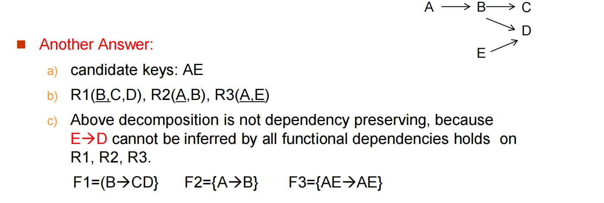

It is not always possible to get a BCNF decomposition that is  dependency preserving.

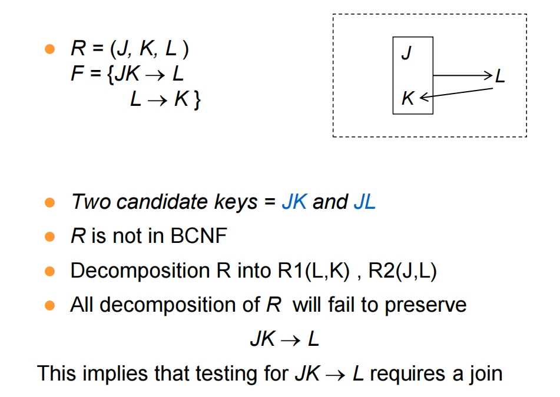

---

## Third Normal Form

There are some situations where BCNF is not dependency preserving, and efficient checking for FD violation on updates is important.

BCNF 要求所有非平凡函数依赖都形如 $\alpha \rightarrow \beta$，其中的 $\alpha$ 为一个超码。第三范式稍微放松了一点这个约束，它允许存在左侧不是超码的特定的非平凡函数依赖。

Solution: define a weaker normal form, called Third Normal Form (3NF)

- Allows some redundancy
- But functional dependencies can be checked on individual relations without computing a join 
- There is always a lossless-join, dependency-preserving decomposition into 3NF.

A relation schema R is in third normal form (3NF) if for all: $\alpha \rightarrow \beta \in F^+$

at least one of the following holds:

1. $\alpha$ is a superkey for R
2. $\alpha \rightarrow \beta$ is trivial (i.e., $\beta \in \alpha$)
3. Each attribute A in $\beta - \alpha$ is contained in a candidate key for R. (NOTE: each attribute may be in a different candidate key)

也就是说，3NF的定义是：对于关系模式R中的每一个非平凡函数依赖X $\rightarrow$ Y，要么 X 是超键，要么 Y 是主属性（即Y属于某个候选键）。

- If a relation is in BCNF it is in 3NF (since in BCNF one of the first two conditions above must hold).
- Third condition is a minimal relaxation of BCNF to ensure dependency preservation.

???+ Question
    Relation dept_advisor:

    dept_advisor (s_ID, i_ID, dept_name)

    F = {s_ID, dept_name $\rightarrow$ i_ID, i_ID $\rightarrow$ dept_name}

    Two candidate keys: s_ID, dept_name, and i_ID, s_ID

??? answer
    R is in 3NF
    
    s_ID, dept_name $\rightarrow$ i_ID
    
    – s_ID, dept_name is a superkey
    
    i_ID $\rightarrow$ dept_name
    
    – dept_name is contained in a candidate key

---

### 3NF Decomposition Algorithm

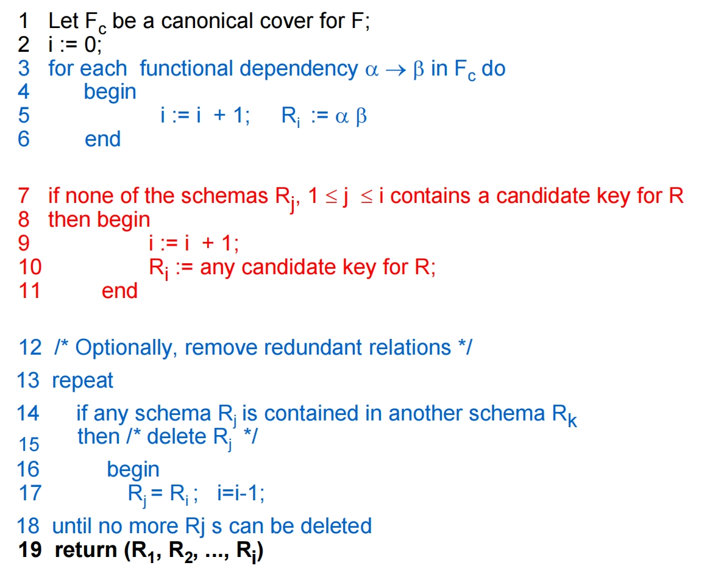

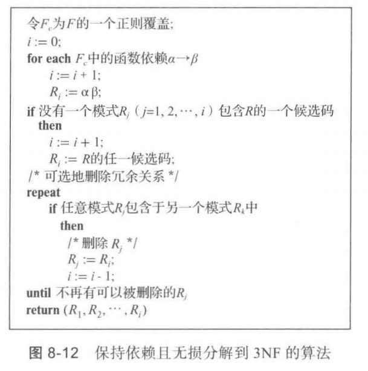

有趣的是，我们描述的用于分解到 3NF 的算法可以在多项式时间内完成，尽管判定给定关系是否满足 3NF 是 NP-hard 的。

!!! note "summary"
    `BCNF`：若 X $\rightarrow$ Y 是非平凡依赖，则 `X` 必须是超键。

    `3NF`：允许 X $\rightarrow$ Y 满足以下任一条件：

    `X` 是超键；

    `Y `是主属性（属于候选键的一部分）。

---

## Goals of Normalization

Let R be a relation scheme with a set F of functional dependencies. Decide whether a relation scheme R is in "good" form.

In the case that a relation scheme R is not in "good" form, decompose it into a set of relation scheme {$R_1, R_2, ..., R_n$} such that

- each relation scheme is in good form (i.e., BCNF or 3NF)
- the decomposition is a lossless-join decomposition
- Preferably, the decomposition should be dependency preserving.

???+ Example "Exercise"
    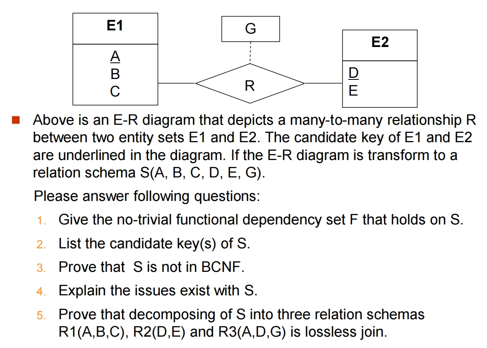

??? Example "answer"
    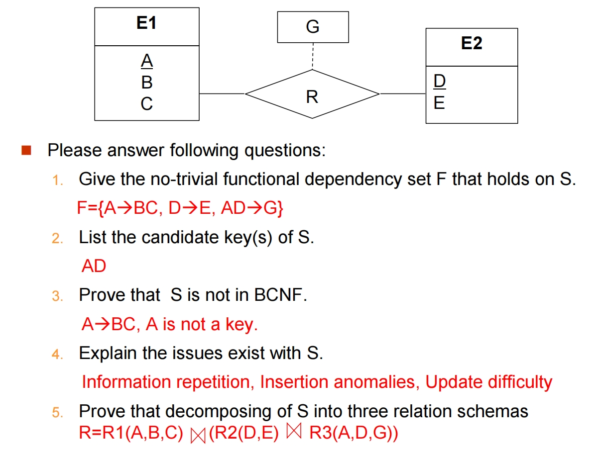

---

## Multivalued Dependencies

有些关系模式虽然属于 BCNF ，但从某种意义上说仍然遭受信息重复问题的困扰，所以看起来并没有被充分地规范化。

Consider a relation inst_info ($\underline{ID, child\_name, phone}$) where an instructor may have more than one phone and can have multiple children.

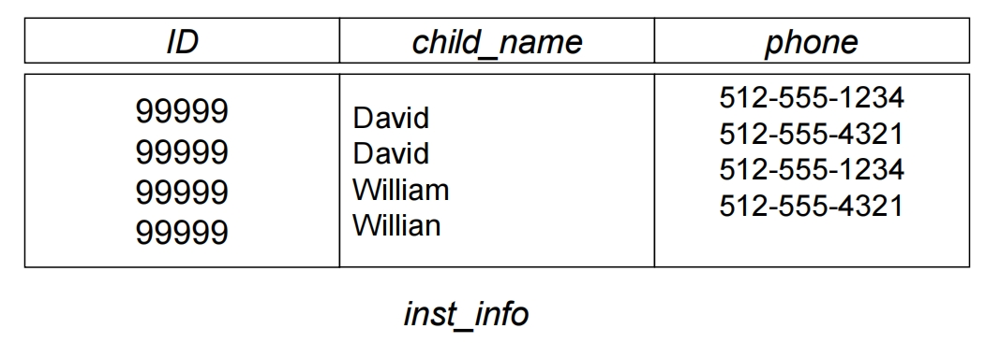

There are no non-trivial functional dependencies and therefore the 
relation is in BCNF.

Insertion anomalies – i.e., if we add a phone 981-992-3443 to 99999, 
we need to add two tuples

(99999, David, 981-992-3443)

(99999, William, 981-992-3443)

Therefore, it is better to decompose inst_info into:

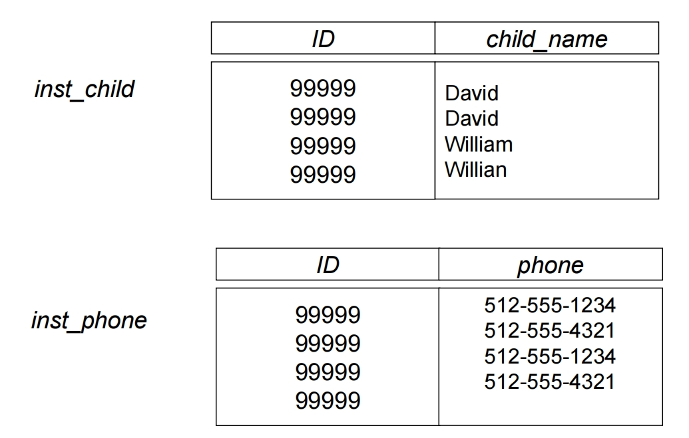

This suggests the need for higher normal forms, such as Fourth Normal Form (4NF).

为处理这个问题，我们必须定义一种称为多值依赖的新的约束形式。正如我们对函数依赖所做的那样，我们将利用多值依赖来为关系模式定义一种范式。这种范式称为第四范式(Fourth NormalForm，4NF)，它比 BCNF 的约束更为严格。我们将看到每个 4NF 模式也都属于 BCNF ，但存在不属于 4NF 的 BCNF 式。

---

### definition

函数依赖在一个关系中排除了某些元组。如果 A $\rightarrow$ B 成立，那么我们就不能有两个元组在 A 上的取值相同而在 B 上的取值不同。多值依赖从另一个角度出发，并不排除特定元组的存在，而是要求具有特定形式的其他元组存在于关系中。由于这种原因，函数依赖有时被称为**相等产生依赖**(equality-generating dependency)，而多值依赖被称为**元组产生依赖**
(tuple-generating dependency)。

Let R be a relation schema and let $\alpha \subseteq R$ and $\beta \subseteq R$. The multivalued dependency 

$$\alpha \rightarrow \rightarrow \beta$$ 

holds on R if in any legal relation r(R), for all pairs for tuples $t_1$ and $t_2$ in r such that $t_1[\alpha] = t_2[\alpha]$, there exists tuples $t_3$ and $t_4$ in r such that:

$$t_3[\alpha] = t_4[\alpha] = t_1[\alpha] = t_2[\alpha]$$

$$t_3[\beta] = t_1[\beta]$$

$$t_3[R - \beta] = t_2[R - \beta]$$

$$t_4[\beta] = t_2[\beta]$$

$$t_4[R - \beta] = t_1[R - \beta]$$

!!! note
    也就是在 $\alpha$ 相同的情况下，有一对 $\beta$ 相同，剩下的属性是交换了的。

    也即在多值依赖（Multivalued Dependency, MVD）中，存在**互补性（Complementary Rule）**。这意味着，如果一个非平凡的多值依赖 $X \rightarrow \rightarrow Y$ 成立，则必然存在其互补的多值依赖 $X \rightarrow \rightarrow Z$ ，其中 $Z = R - X - Y$ 。

直观地说，多值依赖 $\alpha \rightarrow \rightarrow \beta$ 是说 $\alpha$ 和 $\beta$ 之间的联系独立于 $\alpha$ 和 $R-\beta$ 之间的联系。若模式 R 上的所有关系都满足多值依赖 $\alpha \rightarrow \rightarrow \beta$ ,则 $\alpha \rightarrow \rightarrow \beta$ 在模式 R 上是平凡的多值依赖。因此，如果 $\beta \subseteq \alpha$ 或 $\beta \cup \alpha = R$ ，则 $\alpha \rightarrow \rightarrow \beta$ 是平凡的。

Tabular representation of $\alpha \rightarrow \rightarrow \beta$

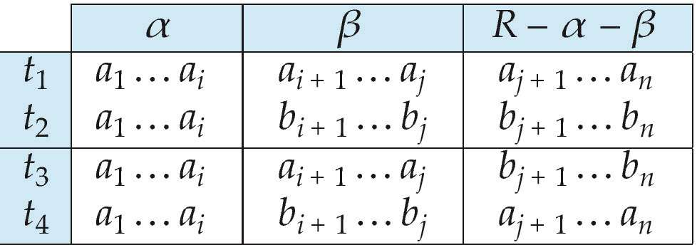

---

From the definition of multivalued dependency, we can derive the following rule:

If $\alpha \rightarrow \beta$ ,then $\alpha \rightarrow \rightarrow \beta$

That is, every functional dependency is also a multivalued dependency.

根据多值依赖的定义，对于 $\alpha, \beta \subseteq R$ ，我们可以推导出以下规则:

- 若 $\alpha \rightarrow \beta$ ，则 $\alpha \rightarrow \rightarrow \beta$ 。换言之每一个函数依赖也是一个多值依赖。
- 若 $\alpha \rightarrow \beta$ ，则 $\alpha \rightarrow \rightarrow R - \alpha - \beta$ 。

---

### another version

Let R be a relation schema with a set of attributes that are partitioned into 3 nonempty subsets.

Y,Z,W

We say that $Y \rightarrow \rightarrow Z$ (Y multidetermines Z ) if and only if for all possible relations r(R)

< y1, z1, w1 > $\in$ r and < y1, z2, w2 > $\in$ r

then,

< y1, z1, w2 > $\in$ r and < y1, z2, w1 > $\in$ r

---

## Fourth Normal Form

A relation schema R is in 4NF with respect to a set D of functional and multivalued dependencies if for all multivalued dependencies in $D^+$ of the form $\alpha \rightarrow \rightarrow \beta$ , where $\alpha \subseteq R$ and $\beta \subseteq R$, at least one of the following hold:

1. $\alpha$ is a superkey for R
2. $\alpha \rightarrow \rightarrow \beta$ is a trivial (i.e., $\beta \subseteq \alpha$ or $\alpha \cup \beta$ = R)

If a relation is in 4NF it is in BCNF.

一个关系模式 R 是关于一个函数依赖和多值依赖的集合D的第四范式(Fourth Normal Form，4NF)的条件是，对于 $D^+$ 中所有形如 $\alpha \rightarrow \rightarrow \beta$ 的多值依赖(其中 $\alpha \subseteq R$ 且 $\beta \subseteq R$ )，至少有以下之一成立:

- $\alpha \rightarrow \rightarrow \beta$ 是一个平凡的多值依赖。
- $\alpha$ 是 R 的一个超键。

每一个 4NF 的关系模式都是 BCNF 的。

---

### 4NF Decomposition Algorithm

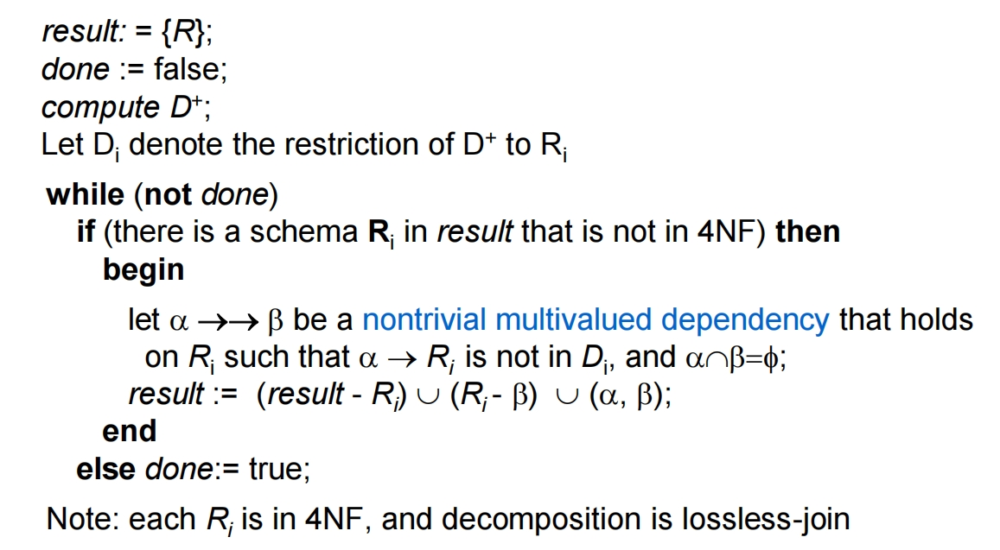

上述算法只产生无损分解。

---

???+ Example "Exercise"
    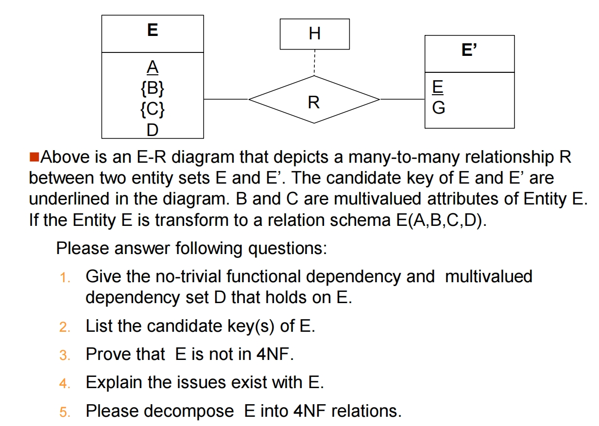

??? Example "answer"
    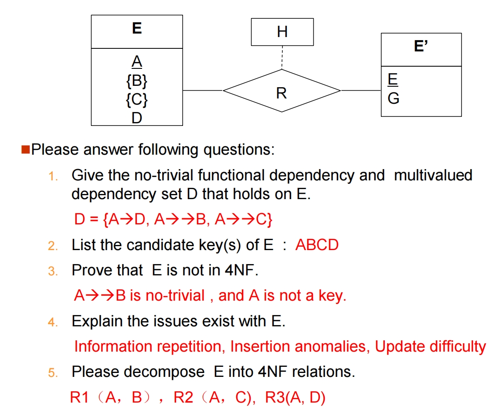

    第二问可能有问题，关系 `E(A, B, C, D)` 的唯一候选码应该是 `(A, B, C)`。

---

## Overall Database Design Process

We have assumed schema R is given

- R could have been generated when converting E-R diagram to a set of tables.
- R could have been a single relation containing all attributes that are of interest (called universal relation).Normalization breaks R into smaller relations.
- R could have been the result of some ad hoc design of relations, which we then test/convert to normal form.

1. r(R) 可以是由 E-R 图向关系模式集转换时所生成的。
2. r(R) 可以是包含所有有意义的属性的单个关系模式。然后由规范化过程将 R 分解成一些更小的模式。
3. r(R) 可以是对关系即席设计的结果，然后检验它是否满足一种期望的范式。

---

### ER Model and Normalization

- When an E-R diagram is carefully designed, identifying all entities correctly, the tables generated from the E-R diagram should not need further normalization.

当我们仔细地定义了 E-R 图并正确地识别出所有的实体集时，从 E-R 图生成的关系模式应该不需要太多进一步的规范化。

- However, in a real (imperfect) design, there can be functional dependencies from non-key attributes of an entity to other attributes of the entity

事实上，某些 E-R 图的变种实际上很难或者不可能指定非二元的联系集。

---

### Denormalization for Performance

- May want to use non-normalized schema for performance
- For example, displaying *prereqs* along with *course_id* and *title* requires join of *course* with *prereq*

有时候数据库设计者会选择一个具有冗余信息的模式，也就是说，它没有规范化。对特定的应用来说，它们使用冗余来提高性能。不使用规范化模式的代价是用来保持冗余数据致性的额外工作(以编码时间和执行时间计算)。

例如，假定每次访问一门课程时所有的先修课程都必须和该课程信息一起显示。在我们规范化的模式中，需要连接 *course* 和 *prereg* 。

1. Alternative 1: Use denormalized relation containing attributes of course as well as prereq with all above attributes

- faster lookup
- extra space and extra execution time for updates
- extra coding work for programmer and possibility of error in extra code

一种不用动态计算连接的可替代方式是保存一个包含 *course* 和 *prereq* 的所有属性的关系。

- 这使得显示"全部"课程信息会更快。
- 然而，对于每门先修课程都要重复课程的信息而且每当添加或删除一门先修课程时，应用程序就必须更新所有的副本。

把一个规范化的模式变成非规范化的过程称为**去规范化**(denormalization)，设计者用它来调整系统的性能以支持响应时间苛刻的操作。

2. Alternative 2: use a materialized view defined as $course \bowtie prereq$

- Benefits and drawbacks same as above, except no extra coding work 
for programmer and avoids possible errors.

使用规范化的模式，同时将 *course* 和 *prereq* 的连接作为物化视图额外存储。物化视图是将结果存储在数据库中的视图，并且当视图中使用的关系被更新时也相应更新。

- 与去规范化类似，使用物化视图确实会有空间和时间上的开销.
- 不过它也有优点，就是进行视图更新的工作是由数据库系统而不是应用程序员来完成的。

---

### Other Design Issues

- Some aspects of database design are not caught by normalization

在数据库设计中有一些方面不能通过规范化来解决，而它们也会导致不好的数据库设计。与时间或时间范围有关的数据就存在这样的问题。

- Examples : 4 approaches to represent the same information:

1. earnings (company_id, year, amount)
2. ernings_2012(company_id, earnings)

earnings_2013(company_id, earnings)

earnings_2014(company_id, earnings)

- Above are in BCNF, but make querying across years difficult(需要编写新的查询把每个新的关系考虑进去) and needs new table each year
- 可以提高并发度

3. company_year (company_id, earnings_2012, earnings_2013, earnings_2014)

- Also in BCNF, but also makes querying across years difficult and requires new attribute each year.
- 依旧需要每年修改关系模式与添加新的查询，由于可能要引用很多属性，查询也会更加复杂。
- Is an example of a **crosstab**, where values for one attribute become column names
- Used in spreadsheets, and in data analysis tools 1

4. 在 SQL 中可以使用 course (course_id, tiile, dept_name, credits, start, end)，具体可以参考课本。

---