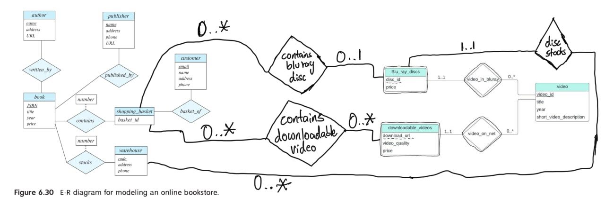

# Homework

## 第一次作业

### 1.7

???+ question
    List four significant differences between a file-processing system and a DBMS.

??? note "my"
    1. Data Redundancy and Consistency:

    For File-Processing System, data redundancy is common because the same data may be duplicated across multiple files. This can lead to inconsistencies if updates are not applied uniformly. However, as for DBMS, redundancy is minimized.
    
    2. Data Integrity and Security:
    
    Integrity constraints and security measures are typically implemented at the application level in File-Processing System. But for DBMS, it provides robust mechanisms for enforcing data integrity and security at the system level.
    
    3. Data Isolation:
    
    Data in File-Processing System is typically isolated within specific applications, compared to data in DBMS, which is centralized and can be shared across multiple applications and users.
    
    4. Concurrency Control for Multiple User:
    
    Concurrency control is typically not built into file-processing systems. But a DBMS provides built-in concurrency control mechanisms to ensure that multiple users can access and modify data simultaneously without conflicts.

??? note "answer"
    1. A file-processing system is more specific to the problem at hand while a DBMS is more general. A file-processing system used by a university is difficult to use in a hospital setting. While a DBMS once written can be used in different places.

    2. It is difficult to ensure atomicity in a conventional file-processing system while it is a lot easier in a DBMS. Often wrapping a set of SQL statements in a "BEGIN TRANSACTION" and "END TRANSACTION" are often enough in the relational DBMS world.
    
    3. Protecting against concurrent-access anomalies in a file-processing system is difficult. Using a DBMS is much easier to protect against concurrent-access anomalies.
    
    4. Most DBMS have a concept of a user and what access that user has. Enforcing such authorization in a file-processing system is really difficult.

---

### 1.8

???+ question
    Explain the concept of physical data independence and its importance in database systems.

??? note "my"
    Physical data independence is the ability to modify the physical schema without changing the logical schema. It is a fundamental principle in database systems that enhances flexibility, scalability, and maintainability. By decoupling the physical storage details from the logical data representation, it allows for efficient management and optimization of data storage without impacting the applications that rely on the database.

??? note "answer[(📝Physical level)](https://melody12020831.github.io/Notebook/Computer_Science/DB/Chapter1/#Physicallevel) [(📝Physical data independence)](https://melody12020831.github.io/Notebook/Computer_Science/DB/Chapter1/#Physicaldataindependence)"
    There are 3 levels of data abstraction in a database: Physical Level, Logical Level and View Level. Physical data independence is the abstraction provided by the Logical Level to hide the complex data-structures that are used at the Physical Level to retrieve data efficiently.

    > **Physical level**: The lowest level of abstraction describes how the data are actually stored. The physical level describes complex low-level data structures in detail.
    
    > **Physical data independence**: the ability to modify the physical schema without changing the logical schema. 
    
    > *from DeepSeek*: Physical data independence is a fundamental principle in database systems that enhances flexibility, scalability, and maintainability. By decoupling the physical storage details from the logical data representation, it allows for efficient management and optimization of data storage without impacting the applications that rely on the database. This separation is crucial for building robust, scalable, and maintainable database systems.

---

### 1.9

???+ question
    List five responsibilities of a database-management system. For each responsibility, explain the problems that would arise if the responsibility were not discharged.

??? note "my"
    1. Efficiency and Scalability in Data Access

    Users might experience slow response times, and the system could become unusable under heavy load, if the responsibility were not discharged.
    
    2. Reduced Application Development Time
    
    Without it, developers would have to manually manage data storage and retrieval for every application feature, slowing down the development process.
    
    3. Data Independence
    
    If the storage system will be upgrated, applications might break if they are tightly coupled to the physical storage details.
    
    4. Data Integrity and Security
    
    For example, in a banking system, without integrity constraints, account balances could become incorrect, and without security measures, hackers could steal customer information.
    
    5. Concurrent Access and Robustness
    
    Such as in an e-commerce platform, without concurrency control, two users might purchase the last item in stock simultaneously, leading to overselling. Without recovery mechanisms, a system crash could result in lost orders or payment data.

??? note "answer[(📝Characteristics)](https://melody12020831.github.io/Notebook/Computer_Science/DB/Chapter1/#Characteristics)"
    1. Security - Since DBMS have the concept of a ROLE (user) it easier for setting access managmenent.

    2. Needs to offer atomicity when needed - If atomicity is not provided, inconsistency will be inevitable.
    
    3. Needs to offer a simple and efficient way to query data
    
    4. Needs to offer durability i.e. once an update or an insert has happened it must be persisted.
    
    5. A DBMS needs to offer a way for protection against concurrent-access anomalies.

---

### 1.15 

???+ question
    Describe at least three tables that might be used to store information in a socialnetworking system such as Facebook.

??? note "my"
    1. **Users Table**

    This table stores information about the users of the social networking platform, containing user_id, username, email, first_name, last_name, date_of_birth and profile_picture.
    
    2. **Posts Table**
    
    This table stores information about the posts made by users, containing post_id, user_id, content and media_url.
    
    3. **Friends Table**
    
    This table stores relationships between users, containing friendship_id, user_id1, user_id2 and status.

??? note "answer"
    1. Users table - that contains id, full name, phone number, email, date of birth, profile pic

    2. Chats table - that contains the chat
    
    3. Friends table - that contains basically two columns of user ids (foreign keys from Users table)

---

## 第二次作业

### 2.7

???+ question
    Consider the bank database of Figure 2.18. Give an expression in the relational algebra for each of the following queries:

    a. Find the name of each branch located in “Chicago”.
    
    b. Find the ID of each borrower who has a loan in branch “Downtown”.
    
    ```sql
    branch (branch_name, branch_city, assets)
    customer (ID, customer_name, customer_street, customer_city)
    loan (loan_number, branch_name, amount)
    borrower (ID, loan_number)
    account (account_number, branch_name, balance)
    depositor (ID, account_number)
    ```
    
    Figure 2.18 Bank database.

??? note "my"
    a.

    $\Pi_{branch\_name}branch(\sigma_{branch\_city = 'Chicago'}(branch))$
    
    b.
    
    $\Pi_{ID}(\sigma_{branch\_name = 'Downtown'}(loan \bowtie_{loan.loan\_number = borrower.loan\_number} borrower))$

??? note "answer"
    a. \(\Pi_{branch\_name}(\sigma_{branch\_city = "Chicago"}(branch))\)
    
    b.\(\Pi_{ID}(\sigma_{branch\_name = "Downtown"}(loan \bowtie_{loan.loan\_number = borrower.loan\_number} borrower))\)
---

### 2.12

???+ question
    Consider the bank database of Figure 2.18. Assume that branch names and customer names uniquely identify branches and customers, but loans and accounts can be associated with more than one customer.

    a. What are the appropriate primary keys?
    
    b. Given your choice of primary keys, identify appropriate foreign keys.

??? note "my"
    a.

    $branch: branch\_name$
    
    $coustomer: ID$
    
    $loan: loan\_number$
    
    $borrower: {ID, loan\_number}$
    
    $account: account\_number$
    
    $depositor: {ID, account\_number}$
    
    分行名称（`branch_name`）是唯一的，可以用来唯一标识每个分行。客户 ID（`ID`）是唯一的，可以用来唯一标识每个客户。贷款编号（`loan_number`）是唯一的，可以用来唯一标识每笔贷款。`borrower` 表是客户和贷款之间的关联表。一个客户可以有多个贷款，一个贷款也可以关联多个客户（虽然通常一个贷款只关联一个客户）。因此，主键需要是 `ID` 和 `loan_number` 的组合。账户编号（`account_number`）是唯一的，可以用来唯一标识每个账户。`depositor` 表是客户和账户之间的关联表。一个客户可以有多个账户，一个账户也可以关联多个客户（例如联名账户）。因此，主键需要是 `ID` 和 `account_number` 的组合。
    
    b. 
    
    foreign key: 
    
    $branch: No$
    
    $customer: No$
    
    $loan: branch\_name \ from \ branch$
    
    $borrower: ID \ from \ customer, loan\_number \ from \ loan$
    
    $account: branch\_name \ from \ branch$
    
    $depositor: ID \ from \ customer, account\_number \ from \ account$
    
    `loan` 表中的 `branch_name` 引用 `branch` 表的 `branch_name`，表示贷款所属的分行。`borrower` 表通过外键建立了客户和贷款之间的关系。`account` 表中的 `branch_name` 引用 `branch` 表的 `branch_name`，表示账户所属的分行。`depositor` 表通过外键建立了客户和账户之间的关系。


??? note "answer"
    a. 

    |Relation Name|	Primary key|
    |:---:|:---:|
    |branch|branch_name|
    |customer|ID|
    |loan|loan_number|
    |borrower|{ID, loan_number}|
    |account|account_number|
    |depositor|{ID, account_number}|
    
    b. 
    
    |Relation Name|Foreign key|
    |:-----------:|:---------:|
    |branch|No Foreign Key|
    |customer|No Foreign Key|
    |loan|branch_name|
    |borrower|ID - a foreign key referencing customer relation, loan_number - a foreign key referencing loan relation|
    |account|branch_name|
    |depositor|ID - a foreign key referencing customer relation, account_number - a foreign key referencing account relation|

---

### 2.13

???+ question
    Construct a schema diagram for the bank database of Figure 2.18.

??? note "my"
    

??? note "answer"
    

---

### 2.15

???+ question
    Consider the bank database of Figure 2.18. Give an expression in the relational algebra for each of the following queries:

    a. Find each loan number with a loan amount greater than $10000.
    
    b. Find the ID of each depositor who has an account with a balance greater than $6000.
    
    c. Find the ID of each depositor who has an account with a balance greater than $6000 at the “Uptown” branch.

??? note "my"
    a. $\Pi_{loan\_number}(\sigma_{amount > 10000}(loan))$

    b. $\Pi_{ID}(\sigma_{balance > 6000}(depositor \bowtie_{depositor.account\_number = account.account\_number} account))$
    
    c. $\Pi_{ID}(\sigma_{balance > 6000 \land branch\_name = 'Uptown'}(depositor \bowtie_{depositor.account\_number = account.account\_number} account))$

??? note "answer"
    a. $\Pi_{loan\_number}(\sigma_{amount > 10000}(loan))$

    b. $\Pi_{ID}(depositor \bowtie_{depositor.account\_number = account.account\_number} \sigma_{balance > 6000}(account))$
    
    c. $\Pi_{ID}(depositor \bowtie_{depositor.account\_number = account.account\_number} \sigma_{balance > 6000 \land branch\_name = 'Uptown'}(account))$

---

## 第三次作业

### 3.8

???+ question
    Consider the bank database of Figure 3.18, where the primary keys are underlined. Construct the following SQL queries for this relational database.

    a. Find the ID of each customer of the bank who has an account but not a loan.
    
    b. Find the ID of each customer who lives on the same street and in the same city as customer '12345'.
    
    c. Find the name of each branch that has at least one customer who has an account in the bank and who lives in "Harrison".
    
    Figure 3.18 Banking database.
    
    branch($\underline{branch\_name}$, branch_city, assets)
    
    customer ($\underline{ID}$, customer_name, customer_street, customer_city)
    
    loan ($\underline{loan\_number}$, branch_name, amount)
    
    borrower ($\underline{ID},\ \underline{loan\_number}$)
    
    account ($\underline{account\_number}$ branch_name, balance)
    
    depositor ($\underline{ID},\ \underline{account\_number}$)

??? note "my"
    a. 

    ```sql
    (SELECT ID FROM depositor)
    EXCEPT 
    (SELECT ID FROM borrower)
    ```
    
    b. 
    
    ```sql
    SELECT ID
    FROM customer
    WHERE customer_city == (SELECT customer_city FROM customer WHERE ID = '12345') AND customer_street == (SELECT customer_street FROM customer WHERE ID = '12345')
    ```
    
    c. 
    
    ```sql
    SELECT DISTINCT branch_name
    FROM account, depositor, customer 
    WHERE customer.id = depositor.id
        AND depositor.account_number = account.account_number 
        AND customer_city = 'Harrison'
    ```

??? note "answer"
    a.

    ```sql
    (SELECT ID FROM depositor)
    EXCEPT 
    (SELECT ID FROM borrower)
    ```
    
    b.
    
    ```sql
    SELECT F.ID
    FROM customer AS F, customer AS S
    WHERE F.customer_street = S.customer_street
        AND F.customer_city = S.customer_city
        AND S.customer_id = '12345';
    ```
    
    Another method (using scalar subqueries)
    
    ```sql
    SELECT ID 
    FROM customer 
    WHERE customer_street = (SELECT customer_street FROM customer WHERE ID = '12345') AND 
        customer_city = (SELECT customer_city FROM customer WHERE ID = '12345')
    ```
    
    c.
    
    ```sql
    SELECT DISTINCT branch_name
    FROM account, depositor, customer 
    WHERE customer.id = depositor.id
        AND depositor.account_number = account.account_number 
        AND customer_city = 'Harrison'
    ```

---

### 3.9

???+ question
    Consider the relational database of Figure 3.19, where the primary keys are underlined. Give an expression in SQL for each of the following queries.
    
    a. Find the ID, name, and city of residence of each employee who works for "First Bank Corporation".
    
    b. Find the ID, name, and city of residence of each employee who works for "First Bank Corporation" and earns more than $10000.
    
    c. Find the ID of each employee who does not work for "First Bank Corporation".
    
    d. Find the ID of each employee who earns more than every employee of "Small Bank Corporation".
    
    e. Assume that companies may be located in several cities. Find the name of each company that is located in every city in which "Small Bank Corporation" is located.
    
    f. Find the name of the company that has the most employees (or companies, in the case where there is a tie for the most).
    
    g. Find the name of each company whose employees earn a higher salary, on average, than the average salary at "First Bank Corporation".
    
    Figure 3.19 Employee database.
    
    employee ($\underline{ID}$, person_name, street, city)
    
    works ($\underline{ID}$, company_name, salary)
    
    company ($\underline{company\_name}$, city)
    
    manages ($\underline{ID}$, manager_id)

??? note "my"
    a. 

    ```sql
    SELECT ID, person_name, city
    FROM employee, works
    WHERE employee.ID = works.ID AND works.company_name = 'First Bank Corporation'
    ```
    
    b. 
    
    ```sql
    SELECT ID, person_name, city
    FROM employee, works
    WHERE employee.ID = works.ID AND works.company_name = 'First Bank Corporation' AND works.salary > 10000
    ```
    
    c. 
    
    ```sql
    SELECT ID
    FROM works
    WHERE ID NOT IN (SELECT ID FROM works WHERE company_name = 'First Bank Corporation')
    ```
    
    这里要注意下述做法是错误的。
    
    ```sql
    SELECT ID
    FROM works
    WHERE company_name != 'First Bank Corporation'
    ```
    
    因为如果员工在多个公司工作，比如同时在“第一银行”和其他公司，那么他们的ID会被包含吗？比如，一个员工在works表中有两条记录，一条公司是“第一银行”，另一条是其他公司，这时候company_name !=的条件会包含这条记录吗？此时，该员工的ID会被选出，但实际上该员工确实有在“第一银行”工作，所以应该被排除。所以这个查询不正确。
    
    d. 
    
    ```sql
    SELECT ID
    FROM works
    WHERE salary > ALL (SELECT salary FROM works WHERE company_name = 'Small Bank Corporation')
    ```
    
    要注意下述做法是错的。
    
    ```sql
    SELECT ID
    FROM works
    WHERE company_name = 'Small Bank Corporation' AND salary > avg(salary)
    ```
    
    上述查询条件是公司名为“Small Bank Corporation”且工资大于该公司的平均工资，而题目要求的是找出那些员工（不论他们所在的公司）的工资高于“小银行公司”的所有员工。即，应该比较该员工的工资是否大于“小银行公司”所有员工的最高工资，或者所有员工的工资。
    
    e. 
    
    正确的思路是：对于每一个公司x，确保不存在任何一个“Small Bank Corporation”所在的城市不在x公司的城市中。
    
    ```sql
    SELECT x.company_name
    FROM company as x
    WHERE NOT EXISTS (
    SELECT city
    FROM company
    WHERE company_name = 'Small Bank Corporation'
    EXCEPT
    SELECT city
    FROM company as y
    WHERE y.company_name = x.company_name
    )
    ```
    
    f. 
    
    ```sql
    SELECT company_name 
    FROM works
    GROUP BY company_name
    HAVING COUNT(ID) >= ALL (
        SELECT COUNT(ID)
        FROM works
        GROUP BY company_name
    )
    ```
    
    g. 
    
    ```sql
    SELECT conpany_name
    FROM works
    GROUP BY company_name
    HAVING avg(salary) > (SELECT avg(salary) FROM works WHERE company_name = 'First Bank Corporation')
    ```

??? note "answer"
    a. 

    ```sql
    SELECT e.ID, e.person_name, city
    FROM employee AS e, works AS w
    WHERE w.company_name = 'First Bank Corporation' AND w.ID = e.ID
    ```
    
    b. 
    
    ```sql
    SELECT ID, name, city
    FROM employee 
    WHERE ID IN (
        SELECT ID
        FROM works
        WHERE company_name = 'First Bank Corporation' AND salary > 10000
    ) 
    ```
    
    This could be written also in the style of the answer to part a, as follows:
    
    ```sql
    SELECT e.ID, e.person_name, city
    FROM employee AS e, works AS w
    WHERE w.company_name = 'First Bank Corporation' AND w.ID = e.ID
        AND w.salary > 10000
    ```
    
    c. 
    
    ```sql
    SELECT ID
    FROM works
    WHERE company_name <> 'First Bank Corporation' 
    ```
    
    If one allows people to appear in employee without appearing also in works, the solution is slightly more complicated. An outer join as discussed in Chapter 4 could be used as well.
    
    ```sql
    SELECT ID 
    FROM employee
    WHERE ID NOT IN (
        SELECT ID
        FROM works
        WHERE company_name = 'First Bank Corporation'
    )
    ```
    
    d. 
    
    ```sql
    SELECT ID
    FROM works
    WHERE salary > ALL (
        SELECT salary
        FROM works
        WHERE company_name = 'Small Bank Corporation'
    )
    ```
    
    If people may work for several companies and we wish to consider the total earnings of each person, the is more complex. But note that the fact that ID is the primary key for works implies that this cannot be the case.
    
    e. 
    
    ```sql
    SELECT S.company_name 
    FROM company AS S 
    WHERE NOT EXISTS (
        (
            SELECT city
            FROM company
            WHERE company_name = 'Small Bank Corporation'
        )
        EXCEPT
        (
            SELECT city
            FROM company AS T
            WHERE T.company_name = S.company_name
        )
    )
    ```
    
    f. 
    
    ```sql
    SELECT company_name 
    FROM works
    GROUP BY company_name
    HAVING COUNT(DISTINCT ID) >= ALL (
        SELECT COUNT(DISTINCT ID)
        FROM works
        GROUP BY company_name
    )
    ```
    
    g. 
    
    ```sql
    SELECT company_name
    FROM works
    GROUP BY company_name 
    HAVING AVG(salary) >  (
        SELECT AVG(salary)
        FROM works
        WHERE company_name = 'First Bank Corporation'
    )
    ```

---

### 3.10

???+ question
    Consider the relational database of Figure 3.19. Give an expression in SQL for each of the following:

    a. Modify the database so that the employee whose ID is '12345' now lives in "Newtown".
    
    b. Give each manager of “First Bank Corporation” a 10 percent raise unless the salary becomes greater than $100000; in such cases, give only a 3 percent raise.

??? note "my"
    a. 

    ```sql
    update employee
    set city = 'Newtown'
    where ID = '12345'
    ```
    
    b.
    
    ```sql
    update employee
    set salary = case
                when salary * 1.1 > 100000 then salary * 1.03
                else salary * 1.1
                end
    where ID in (SELECT manager_id FROM magages)
        and company_name = 'First Bank Corporation'
    ```

??? note "answer"
    a. 

    ```sql
    UPDATE employee
    SET city = 'Newtown'
    WHERE ID = '12345' 
    ```
    
    b.
    
    ```sql
    UPDATE works T
    SET T.salary = T.salary * 1.03
    WHERE T.ID IN (SELECT manager_id FROM manages)
        AND T.salary * 1.1 > 100000
        AND T.company_name = 'First Bank Corporation';
    
    UPDATE works T
    SET T.salary = T.salary * 1.1
    WHERE T.ID IN (SELECT manager_id FROM manages)
        AND T.salary * 1.1 <= 100000
        AND T.company_name = 'First Bank Corporation';
    ```
    
    The above updates would give different results if executed in the opposite order. We give below a safer solution using the case statement.
    
    ```sql
    UPDATE works T
    SET T.salary = T.salary * ( 
        CASE
            WHEN (T.salary * 1.1 > 100000) THEN 1.03
            ELSE 1.1 
        END
    )
    WHERE T.ID IN (SELECT manager_id FROM manages) 
        AND T.company_name = 'First Bank Corporation'
    ```

---

### 3.11

???+ question
    Write the following queries in SQL, using the university schema.
    
    a. Find the ID and name of each student who has taken at least one Comp. Sci. course; make sure there are no duplicate names in the result.
    
    b. Find the ID and name of each student who has not taken any course offered before 2017.
    
    c. For each department, find the maximum salary of instructors in that department. You may assume that every department has at least one instructor.
    
    d. Find the lowest, across all departments, of the per-department maximum salary computed by the preceding query.
    
    
    
    (For more information about the university schema, see this [link](https://blog.csdn.net/weixin_44073734/article/details/105698093))

??? note "my"
    a. 

    ```sql
    SELECT DISTINCT student.ID, student.name
    FROM student INNER JOIN takes ON student.ID = takes.ID INNER JOIN course ON takes.course_id = course.course_id
    WHERE course.dept_name = 'Comp. Sci.'
    ```
    
    b. 
    
    ```sql
    SELECT S.ID, S.name
    FROM student as S
    WHERE NOT EXISTS (SELECT * FROM takes WHERE course.year < 2017 AND S.ID = takes.ID)
    ```
    
    c. 
    
    ```sql
    SELECT dept_name, MAX(salary)
    FROM instructor
    GROUP BY dept_name
    ```
    
    `GROUP BY dept_name` 要求 `SELECT` 子句中只能包含聚合函数或分组列。`dept_name` 是分组列，用于标识每个部门，而 `MAX(salary)` 是该组的聚合结果。如果省略 `dept_name`，查询将无法明确显示每个部门的最大工资，结果会失去意义（仅返回全局最大工资，而非按部门分组）。
    
    d. 
    
    ```sql
    WITH dept_max (dept_name, max_salary) AS (
        SELECT dept_name, MAX(salary)
        FROM instructor
        GROUP BY dept_name
    )
    SELECT MIN(max_salary)
    FROM dept_max
    ```


??? note "answer"
    a. 

    ```sql
    SELECT DISTINCT student.ID, student.name
    FROM student INNER JOIN takes  ON student.ID = takes.ID 
                INNER JOIN course ON takes.course_id = course.course_id
    WHERE course.dept_name = 'Comp. Sci.';
    ```
    
    b. 
    
    ```sql
    SELECT ID, name 
    FROM student AS S
    WHERE NOT EXISTS (
        SELECT * 
        FROM takes AS T
        WHERE year < 2017 AND T.ID = S.ID 
    )
    ```
    
    c. 
    
    ```sql
    SELECT dept_name, MAX(salary)
    FROM instructor
    GROUP BY dept_name 
    ```
    
    d. 
    
    ```sql
    WITH maximum_salary_within_dept(dept_name, max_salary) AS (
        SELECT dept_name, MAX(salary)
        FROM instructor
        GROUP BY dept_name 
    ) 
    SELECT MIN(max_salary) 
    FROM maximum_salary_within_dept
    ```

---

### 3.15

???+ question
    Consider the bank database of Figure 3.18, where the primary keys are underlined. Construct the following SQL queries for this relational database.

    a. Find each customer who has an account at every branch located in "Brooklyn".
    
    b. Find the total sum of all loan amounts in the bank.
    
    c. Find the names of all branches that have assets greater than those of at least one branch located in "Brooklyn".

??? note "my"
    a. 

    ```sql
    SELECT c.ID
    FROM customer c
    WHERE NOT EXISTS (
        SELECT b.branch_name 
        FROM branch b 
        WHERE b.branch_city = 'Brooklyn'
        EXCEPT
        SELECT a.branch_name 
        FROM depositor d JOIN account a ON d.account_number = a.account_number
        WHERE d.ID = c.ID
    );
    ```
    
    b. 
    
    ```sql
    SELECT SUM(amount)
    FROM loan
    ```
    
    这里不能加上 `GROUP BY loan_number`，因为每个贷款号对应一个金额，这样SUM之后每个贷款号的总和还是自身，导致结果会是所有贷款金额的列表，而不是总和。
    
    c. 
    
    ```sql
    SELECT branch_name
    FROM branch
    WHERE assets > SOME (
        SELECT assets
        FROM branch
        WHERE branch_city = 'Brooklyn'
    );
    ```

??? note "answer"
    a. 

    ```sql
    WITH all_branches_in_brooklyn(branch_name) AS (
    SELECT branch_name 
    FROM branch
    WHERE branch_city = 'Brooklyn'
    )
    SELECT ID, customer_name 
    FROM customer AS c1
    WHERE NOT EXISTS (
        (SELECT branch_name FROM all_branches_in_brooklyn)
        EXCEPT
        (
            SELECT branch_name
            FROM account INNER JOIN depositor 
                ON account.account_number = depositor.account_number
            WHERE depositor.ID = c1.ID
        )
    )
    ```
    
    b.
    
    ```sql
    SELECT SUM(amount)
    FROM loan
    ```
    
    c. 
    
    ```sql
    SELECT branch_name
    FROM branch
    WHERE assets > SOME (
        SELECT assets
        FROM branch
        WHERE branch_city = 'Brooklyn'
    );
    ```

---

## 第四次作业

### 4.7

???+ question
    Consider the employee database of Figure 4.12. Give an SQL DDL definition of this database.
    
    Identify referential-integrity constraints that should hold, and include them in the DDL definition.
    
    **Figure 4.12** Employee database.
    
    employee ($\underline{ID}$, person_name, street, city)
    
    works ($\underline{ID}$, company_name, salary)
    
    company ($\underline{company\_name}$, city)
    
    manages ($\underline{ID}$, manager_id)

??? note "my"
    ```sql
    CREATE TABLE employee(
        ID int,
        person_name char(20),
        street char(20),
        city char(20),
        primary key (ID)
    );

    CREATE TABLE company(
        company_name char(20),
        city char(20),
        primary key (company_name)
    );
    
    CREATE TABLE works(
        ID int,
        company_name char(20),
        salary int,
        primary key (ID),
        foreign key (ID) references employee(ID),
        foreign key (company_name) references company(company_name)
    );
    
    CREATE TABLE manages(
        ID int,
        manager_id int,
        primary key (ID),
        foreign key (ID) references employee(ID),
        foreign key (manager_id) references employee(ID)
    );
    ```

??? note "answer"
    ```sql
    CREATE TABLE employee ( 
        id INTEGER,
        person_name VARCHAR(50),
        street VARCHAR(50),
        city VARCHAR(50),
        PRIMARY KEY (id)
    );

    CREATE TABLE company ( 
        company_name VARCHAR(50),
        city VARCHAR(50),
        PRIMARY KEY(company_name)
    );
    
    CREATE TABLE works (
        id INTEGER,
        company_name VARCHAR(50),
        salary numeric(10,2),
        PRIMARY KEY(id),
        FOREIGN KEY (id) REFERENCES employee(id),
        FOREIGN KEY (company_name) REFERENCES company(company_name)
    );
    
    CREATE TABLE manages ( 
        id INTEGER,
        manager_id INTEGER, 
        PRIMARY KEY (id), 
        FOREIGN KEY (id) REFERENCES employee (id), 
        FOREIGN KEY (manager_id) REFERENCES employee (id)
    );
    ```


??? note "about DDL(https://zhuanlan.zhihu.com/p/391552199)"
    SQL程序语言有四种类型，对数据库的基本操作都属于这四类，它们分别为；数据定义语言(DDL)、数据查询语言（DQL）、数据操纵语言（DML）、数据控制语言（DCL）。

    1. DDL 全称是 Data Definition Language，即数据定义语言。
    
    数据定义语言是由 SQL 语言集中负责数据结构定义与数据库对象定义的语言，并且由 `CREATE` 、`ALTER` 、`DROP` 和 `TRUNCATE` 四个语法组成。
    
    2. DML 全称是 Data Manipulation Language，即数据操纵语言。
    
    主要由 `insert`、`update`、`delete`语法组成。
    
    3. DQL 全称是 Data Query Language，即数据查询语言。
    
    主要由 `select` 语法组成。
    
    4. DCL 全称是 Data Control Language，即数据控制语言。
    
    主要由 `grant`、`revoke`、`show grants`语法组成。

---

### 4.9

???+ question
    SQL allows a foreign-key dependency to refer to the same relation, as in the following example:

    ```sql
    create table manager
        (employee_ID char(20),
        manager_ID char(20),
        primary key employee_ID,
        foreign key (manager_ID) references manager(employee_ID) on delete cascade);
    ```
    
    Here, *employee_ID* is a key to the table manager, meaning that each employee has at most one manager. The foreign-key clause requires that every manager also be an employee. Explain exactly what happens when a tuple in the relation *manager* is deleted.

??? note "my"
    When a tuple in the relation *manager* is deleted, the corresponding tuple of this manager in the manager, which means that the tuples of employees under this manager will also be deleted. And the same thing happens for the employees under the deleted employees that are deleted in the previous deletion. The deletion will reach end when all the employees under the manager are deleted.

??? note "answer"
    The tuples of all employees of the manager, at all levels, get deleted as well! This happens in a series of steps. The inital deletion will trigger deletion of all the tuples corresponding to direct employees of the manager. These deletions will in turn cause deletions of second-level employee tuples, and so on, till all direct and indirect employee tuples are deleted.

---

### 4.12

???+ question
    Suppose a user wants to grant **select** access on a relation to another user. Why should the user include (or not include) the clause **granted by current role** in the **grant** statement?

??? note "my"
    包含`granted by current role` 时是明确权限的授予者是当前会话激活的角色，而不是用户自身，此时后续权限的撤销或修改将基于角色的权限链。此时可确保权限与角色绑定。当角色被撤销时，其授予的权限才会自动失效。而不包含时权限的授予者被记录为执行命令的用户本身，权限链直接依赖用户，与角色无关，更适合在临时调试或一次性访问时使用。

    When `granted by current role` is included, it indicates that the granting authority is the current session-activated role rather than the user themselves. At this point, the subsequent revocation or modification of permissions will be based on the permission chain of the role. This ensures that permissions are bound to the role. When the role is revoked, the permissions granted by it will automatically become invalid. When it is not included, the granting authority is recorded as the user who executed the command, and the permission chain directly depends on the user and is unrelated to the role. This is more suitable for temporary debugging or one-time access.

??? note "answer"
    Both cases give the same authorization at the time the statement is executed, but the long-term effects differ. If the grant is done based on the role, then the grant remains in effect even if the user who performed the grant leaves and that user's account is terminated. Whether that is a good or bad idea depends on the specific situation, but usually granting through a role is more consistent with a well-run enterprise.

---

### 5.6

???+ question
    Consider the bank database of Figure 5.21. Let us define a view branch_cust as follows:

    ```sql
    create view branch_cust as
    select branch_name, customer_name
    from depositor, account
    where depositor.account_number = account.account_number;
    ```
    
    Suppose that the view is materialized; that is, the view is computed and stored. Write triggers to maintain the view, that is, to keep it up-to-date on insertions to depositor or account. It is not necessary to handle deletions or updates. Note that, for simplicity, we have not required the elimination of duplicates.
    
    **Figure 5.21** Banking database
    
    branch ($\underline{branch\_name}$, branch_city, assets)
    
    customer ($\underline{customer\_name}$, customer_street, cust omer_city)
    
    loan ($\underline{loan\_number}$, branch name, amount)
    
    borrower ($\underline{customer\_name}$, $\underline{loan\_number}$)
    
    account ($\underline{account\_number}$, branch_name, balance)
    
    depositor ($\underline{customer\_name}$, $\underline{account\_number}$)

??? note "my"
    ```sql
    CREATE TRIGGER depositor_trigger AFTER INSERT ON depositor
    referencing new row as nrow

    FOR each ROW
    BEGIN
        INSERT INTO branch_cust
            SELECT branch_name, nrow.customer_name
            FROM account
            WHERE account.account_number = nrow.account_number;
    END
    
    CREATE TRIGGER account_trigger AFTER INSERT ON account
    referencing new row as nrow
    
    FOR each ROW
    BEGIN
        INSERT INTO branch_cust
            SELECT nrow.branch_name, customer_name
            FROM depositor
            WHERE depositor.account_number = nrow.account_number
    END
    ```

??? note "answer"
    ```sql
    CREATE TRIGGER insert_into_branch_cust_via_depositor
    AFTER INSERT ON depositor
    REFERENCING NEW ROW AS inserted
    FOR EACH ROW
    INSERT INTO branch_cust
        SELECT branch_name, inserted.customer_name
        FROM account
        WHERE inserted.account_number = account.account_number;

    CREATE TRIGGER insert_into_branch_cust_via_account
    AFTER INSERT ON account
    REFERENCING NEW ROW AS inserted
    FOR EACH STATEMENT
    INSERT INTO branch_cust
        SELECT inserted.branch_name, customer_name
        FROM depositor
        WHERE depositor.account_number = inserted.account_number;
    ```

???+ question
    如果改成 "require the elimination of duplicates" 呢？

??? note "answer"
    ```sql
    CREATE TRIGGER depositor_insert_trigger
    AFTER INSERT ON depositor
    FOR EACH ROW
    BEGIN
        -- 插入前检查 (branch_name, customer_name) 是否已存在
        INSERT INTO branch_cust (branch_name, customer_name)
        SELECT a.branch_name, NEW.customer_name
        FROM account a
        WHERE a.account_number = NEW.account_number
        AND NOT EXISTS (
            SELECT 1
            FROM branch_cust bc
            WHERE bc.branch_name = a.branch_name
                AND bc.customer_name = NEW.customer_name
        );
    END;

    CREATE TRIGGER account_insert_trigger
    AFTER INSERT ON account
    FOR EACH ROW
    BEGIN
        -- 插入前检查 (branch_name, customer_name) 是否已存在
        INSERT INTO branch_cust (branch_name, customer_name)
        SELECT NEW.branch_name, d.customer_name
        FROM depositor d
        WHERE d.account_number = NEW.account_number
        AND NOT EXISTS (
            SELECT 1
            FROM branch_cust bc
            WHERE bc.branch_name = NEW.branch_name
                AND bc.customer_name = d.customer_name
        );
    END;
    ```

---

### 5.15

???+ question
    Consider an employee database with two relations:

    employee ($\underline{employee\_name}$, street, city)
    
    works ($\underline{employee\_name}$, company_name, salary)
    
    where the primary keys are underlined. Write a function avg_salary that takes a company_name as an argument and finds the average salary of employees at that company. Then, write an SQL statement, using that function, to find companies whose employees earn a higher salary, on average, than the average salary at "First Bank".

??? note "my"
    ```sql
    CREATE function avg_salary(name varchar(20))
    RETURNS double

    BEGIN
        declare salary_avg double;
        SELECT AVG(salary) INTO salary_avg
        FROM works
        WHERE works.company_name = name;
        RETURN salary_avg;
    END
    
    SELECT DISTINCT company_name
    FROM works
    WHERE avg_salary(works.company_name) > avg_salary('First Bank');
    ```

??? note "answer"
    ```sql
    -- The following defines the sql function avg_salary.
    -- Takes a company name as an argument and finds the average salary of
    -- employees at that company.
    CREATE FUNCTION avg_salary(company_name VARCHAR(20))
        RETURNS REAL
        BEGIN
        DECLARE retval REAL;
            SELECT AVG(salary)
            FROM works
            WHERE works.company_name = company_name;
        RETURN retval;
        END;

    SELECT DISTINCT company_name
    FROM works
    WHERE avg_salary(company_name) > avg_salary('First Bank');
    ```

---

### 5.19

???+ question
    Suppose there are two relations r and s, such that the foreign key B of r references the primary key A of s. Describe how the trigger mechanism can be used to implement the **on delete cascade** option when a tuple is deleted from s.

??? note "my"
    When there is a row that is deleted from s, then the trigger can be used to delete all the r in B where r.B = deleted_row.A.

??? note "answer"
    When any row is deleted from from the relation s the trigger mechanism is supposed to take the following action: delete all rows from the relation r that reference the deleted row from the relation s.

---

## 第五次作业

### 6.1

???+ question
    Construct an E-R diagram for a car insurance company whose customers own one or more cars each. Each car has associated with it zero to any number of recorded accidents. Each insurance policy covers one or more cars and has one or more premium payments associated with it. Each payment is for a particular period of time, and has an associated due date, and the date when the payment was received.

??? note "my"
    一个事故对应的不止一辆车。

    

??? note "answer"
    

---

### 6.2

???+ question
    Consider a database that includes the entity sets student, course, and section from the university schema and that additionally records the marks that students receive in different exams of different sections.

    a. Construct an E-R diagram that models exams as entities and uses a ternary relationship as part of the design.
    
    b. Construct an alternative E-R diagram that uses only a binary relationship between student and section. Make sure that only one relationship exists between a particular student and section pair, yet you can represent the marks that a student gets in different exams.

??? note "my"
    a. 

    b. 


??? note "answer"
    a. 

    b. 

---

### 6.21

???+ question
    Consider the E-R diagram in Figure 6.30, which models an online bookstore.

    a. Suppose the bookstore adds Blu-ray discs and downloadable video to its collection. The same item may be present in one or both formats, with differing prices. Draw the part of the E-R diagram that models this addition, showing just the parts related to video.
    
    b. Now extend the full E-R diagram to model the case where a shopping basket may contain any combination of books, Blu-ray discs, or downloadable video.
    
    

??? note "my"
    a. 

    b. 

??? note "answer"
    a. 

    Note that `Blu_ray_discs` and `downloadable_videos` are weak entities while `video_in_bluray` and `video_on_net` are the identifying relationships sets. `video` is the identifying entity set and owns both of the weak entities.
    
    b. 

---

### 6.22

???+ question
    Design a database for an automobile company to provide to its dealers to assist them in maintaining customer records and dealer inventory and to assist sales staff in ordering cars.

    Each vehicle is identified by a vehicle identification number (VIN). Each individual vehicle is a particular model of a particular brand offered by the company (e.g., the XF is a model of the car brand Jaguar of Tata Motors). Each model can be offered with a variety of options, but an individual car may have only some (or none) of the available options. The database needs to store information about models, brands, and options, as well as information about individual dealers, customers, and cars.
    
    Your design should include an E-R diagram, a set of relational schemas, and a list of constraints, including primary-key and foreign-key constraints.

??? note "my"
    

    car($\underline{VIN}$, choice_id, )
    
    choice($\underline{choice\_id}$, model, brand, options)
    
    dealer($\underline{dealer\_id}$, name, address)
    
    customer($\underline{customer\_id}$, name, address)
    
    car_choice($\underline{VIN}$, choice_id)
    
    dealer_inventory($\underline{VIN}$, dealer_id)
    
    sales($\underline{VIN}$, $\underline{customer\_id}, $\underline{dealer\_id})

??? note "answer"
    

    The above figure displays the E-R diagram of the database for the automobile company. The attribute `options` of the entity set `car_type` is a composite attribute. The ternary relationship set `sales` represents a single trasaction or a sale of a car. A `dealer` may have never sold a car or have sold numerous cars. A `customer` may have never bought a car or have bought numerous cars. But a particular car has either been sold or in stock. This constraints are represented as mapping cardinalities in the diagram.
    
    When we change the diagram to a relational schema we get the following:
    
    car_type($\underline{car\_type\_id}$, model, brand, color, electric_or_gas, self_driving_or_not,solar_panel_on_roof)
    
    car($\underline{VIN}$, car_type_id, dealer_id)
    
    customer($\underline{customer\_id}$, name, phone_number, address)
    
    dealer($\underline{dealer\_id}$, name, phone_number, address)
    
    sale($\underline{VIN}$, $\underline{customer\_id}$, $\underline{dealer\_id}$, amount, timestamp)
    
    The attributes `car_type_id` and `dealer_id` in the relation `car` are foreign-keys referencing `car_type` and `dealer` relations respectively. The `sale` relation has `VIN`, `customer_id` and `dealer_id` as foreign-keys referencing the relations `car_type`, `customer` and `dealer` respectively.

---

### 5.24

???+ question
    Consider the relation, r, shown in Figure 5.22. Give the result of the following query:

    ```sql
    select building, room_number, time_slot_id, count(*)
    from r
    group by rollup (building, room_number, time_slot_id)
    ```
    
    

??? note "my"
    该 SQL 查询使用了 `GROUP BY ROLLUP` 来生成分层次的聚合结果，从最细粒度到总计逐级汇总。

    1. 按所有三列分组：统计每个 building 、room_number 和time_slot_id 组合的记录数。
    2. 按前两列分组：统计每个 building 和 room_number 组合的总记录数。
    3. 按第一列分组：统计每个 building 的总记录数。
    4. 总计：统计整个表的记录总数。
    
    |building | room_number | time_slot_id | count |
    |:------:|:-----------:|:------------:|:-----:|
    |Garfield|359|A|1|
    |Garfield|359|B|1|
    |Garfield|359|NULL|2|
    |Garfield|NULL|NULL|2|
    |Saucon|651|A|1|
    |Saucon|651|NULL|1|
    |Saucon|550|C|1|
    |Saucon|550|NULL|1|
    |Saucon|NULL|NULL|2|
    |Painter|705|D|1|
    |Painter|705|NULL|1|
    |Painter|403|D|1|
    |Painter|403|NULL|1|
    |Painter|NULL|NULL|2|
    |NULL|NULL|NULL|6|

??? note "answer"
    ```sql
    university=# SELECT building, room_number,time_slot_id,COUNT(*)
    university-# FROM r
    university-# GROUP BY ROLLUP(building,room_number,time_slot_id);
    building | room_number | time_slot_id | count 
    ----------+-------------+--------------+-------
            |             |              |     6
    Saucon   | 651         | A            |     1
    Garfield | 359         | B            |     1
    Painter  | 705         | D            |     1
    Saucon   | 550         | C            |     1
    Garfield | 359         | A            |     1
    Painter  | 403         | D            |     1
    Painter  | 705         |              |     1
    Saucon   | 550         |              |     1
    Saucon   | 651         |              |     1
    Painter  | 403         |              |     1
    Garfield | 359         |              |     2
    Saucon   |             |              |     2
    Garfield |             |              |     2
    Painter  |             |              |     2
    (15 rows)

    university=# 
    ```
    
    But the output of given above is not much readable. The following is a bit better.
    
    ```sql
    SELECT 
        (
            CASE 
                WHEN GROUPING(building) = 1 THEN '(all)'
                ELSE building
            END
        ) AS building, 
        (
            CASE 
                WHEN GROUPING(room_number) = 1 THEN '(all)'
                ELSE room_number
            END
        ) AS room_number, 
        (
            CASE 
                WHEN GROUPING(time_slot_id) = 1 THEN '(all)'
                ELSE time_slot_id
            END
        ) AS time_slot_id, 
        COUNT(*)
    FROM r
    GROUP BY ROLLUP(building,room_number,time_slot_id)
    ORDER BY (building,room_number,time_slot_id) NULLS LAST;
    ```
    
    OUTPUT:
    
    ```sql
     building | room_number | time_slot_id | count 
    ----------+-------------+--------------+-------
    Garfield | 359         | A            |     1
    Garfield | 359         | B            |     1
    Garfield | 359         | (all)        |     2
    Garfield | (all)       | (all)        |     2
    Painter  | 403         | D            |     1
    Painter  | 403         | (all)        |     1
    Painter  | 705         | D            |     1
    Painter  | 705         | (all)        |     1
    Painter  | (all)       | (all)        |     2
    Saucon   | 550         | C            |     1
    Saucon   | 550         | (all)        |     1
    Saucon   | 651         | A            |     1
    Saucon   | 651         | (all)        |     1
    Saucon   | (all)       | (all)        |     2
    (all)    | (all)       | (all)        |     6
    (15 rows)
    ```
    
    That is more like it!
    
    Just in case you want to replicate the instance given at Figure 5.22 in your db.
    
    ```sql
    CREATE TABLE r(
        building VARCHAR(15),
        room_number VARCHAR(7),
        time_slot_id VARCHAR(4),
        course_id VARCHAR(8),
        sec_id   VARCHAR(8),
        PRIMARY KEY (building,room_number,time_slot_id,course_id,sec_id)
    );
    
    INSERT INTO r VALUES 
        ('Garfield','359','A','BIO-101','1'),
        ('Garfield','359','B','BIO-101','2'),
        ('Saucon','651','A','CS-101','2'),
        ('Saucon','550','C','CS-319','1'),
        ('Painter','705','D','MU-199','1'),
        ('Painter','403','D','FIN-201','1');
    ```

---

## 第六次作业

### 7.1

???+ question
    Suppose that we decompose the schema R = (A, B, C, D, E) into

    (A, B, C)
    
    (A, D, E).

    Show that this decomposition is a lossless decomposition if the following set F of functional dependencies holds:

    A $\rightarrow$ BC
    
    CD $\rightarrow$ E
    
    B $\rightarrow$ D
    
    E $\rightarrow$ A

??? note "my"
    无损分解需要保证了分解后的子关系通过**自然连接**能够**完全恢复原关系**，既不会丢失原始数据，也不会引入冗余数据。

    在分解过程中，$R1$ 和 $R2$ 的公共属性是连接操作的桥梁。如果公共属性是某个子模式的**Super Key**，则它能唯一标识该子模式中的其他属性。这确保了连接操作不会产生额外的原关系中不存在的元组。
    
    所以，当关系模式 R 分解为 R1 和 R2 时，若满足 $R1 \cap R2 \rightarrow R1$ 或者 $R1 \cap R2 \rightarrow R2$ ，则分解是无损的。

    对于上述问题中的 R1 和 R2 来说， $R1 \cap R2 = A$，而 $A \rightarrow BC$，所以 $R1 \cap R2 \rightarrow R1$，所以分解是无损的。

??? note "answer"
    A decomposition $\{R_1, R_2\}$ is a lossless decomposition if $R_1 \cap R_2 \rightarrow R_1$ or $R_1 \cap R_2 \rightarrow R_2$. Let $R_1 = (A, B, C)$ and $R_2 = (A, D, E)$, and $R_1 \cap R_2 = (A)$. Since $A$ is a candidate key, $R_1 \cap R_2 \rightarrow R_1$.

---

### 7.13

???+ question
    Show that the decomposition in Exercise 7.1 is not a dependency-preserving decomposition.

??? note "my"
    若关系模式 R 被分解为若干子模式 R1, R2, ..., Rn，且原函数依赖集 F 中的所有依赖可以通过子模式的依赖集逻辑推导出来，则称该分解是**依赖保持**的。

    题目中 R = (A, B, C, D, E)，分解为 R1 = (A, B, C) 和 R2 = (A, D, E)。原函数依赖集 F = {A $\rightarrow$ BC, CD $\rightarrow$ E, B $\rightarrow$ D, E $\rightarrow$ A}，子模式 R1 的函数依赖集 F1 = {A $\rightarrow$ BC}，子模式 R2 的函数依赖集 F2 = {E $\rightarrow$ A}。

    此时我们可以看到，原函数依赖集中的依赖 CD $\rightarrow$ E 以及 B $\rightarrow$ D 都不能通过子模式的依赖集逻辑推导出来。因为 C 和 D 未同时在任一子模式中出现，且无相关依赖，并且 B 和 D 分布在不同的子模式中，且无间接推导路径。所以该分解不是依赖保持的。

??? note "answer"
    There are several functional dependencies that are not preserved. We discuss one example here. The dependency $B \rightarrow D$ is not preserved. $F_1$ , the restriction of $F$ to $(A, B, C)$ , is $A \rightarrow ABC$ , $A \rightarrow AB$ , $A \rightarrow AC$ , $A \rightarrow BC$ , $A \rightarrow B$ , $A \rightarrow C$ , $A \rightarrow A$ , $B \rightarrow B$ , $C \rightarrow C$ , $AB \rightarrow AC$ , $AB \rightarrow AB$ . $F_2$ , the restriction of $F$ to $(A, D, E)$ , is $A \rightarrow ADE$ , $A \rightarrow AD$ , $A \rightarrow AE$ , $A \rightarrow DE$ , $A \rightarrow A$ , $A \rightarrow D$ , $A \rightarrow E$ , $D \rightarrow D, E (\text{same as } A), AD, AE, DE, ADE (\text{same as } A)$ . 

    $(F_1 \cup F_2)^+$ is easily seen not to contain $B \rightarrow D$ since the only FD in $F_1 \cup F_2$ with $B$ as the left side is $B \rightarrow B$ , a trivial FD. Thus $B \rightarrow D$ is not preserved.

    A simpler argument is as follows: $F_1$ contains no dependencies with $D$ on the right side of the arrow. $F_2$ contains no dependencies with $B$ on the left side of the arrow. Therefore for $B \rightarrow D$ to be preserved there must be a functional dependency $B \rightarrow \alpha$ in $F_1^+$ and $\alpha \rightarrow D$ in $F_2^+$ (so $B \rightarrow D$ would follow by transitivity). Since the intersection of the two schemas is $A$ , $\alpha = A$ . Observe that $B \rightarrow A$ is not in $F_1^+$ since $B^+ = BD$ .

---

### 7.21

???+ question
    Give a lossless decomposition into BCNF of schema R of Exercise 7.1.

??? note "my"
    1. 判断 candidate key， 通过计算 Closure 来分析：  

    - $E \rightarrow A \rightarrow BC$，因此 $E$ 可以推导出 $A, B, C$ ，而 $B \rightarrow D$ ，因此 $E$ 的闭包为 ${A, B, C, D, E}$ ，即 $E$ 是候选键。  
    - 同理，$CD \rightarrow E$，而 $CD$ 的闭包也覆盖所有属性，因此 $CD$ 也是候选键。
    - 同理可以得出 $A$ 是候选键。
    
    2. 检查违反 BCNF 的函数依赖:

    - $B \rightarrow D$ 都违反 BCNF 。   

    3. 分解：

    - 由 $B \rightarrow D$ 分解 R，得到 $R_1 = (A, B, C, E)$ 和 $R_2 = (B, D)$ 。
    - 此时 $F_1 = \{A \rightarrow BC, E \rightarrow A\}$ ， $F_2 = \{B \rightarrow D\}$ 。
    - 验证为无损分解。

    4. 所以得出答案：$\{(A, B, C, E), (B, D)\}$

??? note "answer"
    One possible decomposition: $\{(A, B, C, E), (B, D)\}$

---

### 7.22

???+ question
    Give a lossless, dependency-preserving decomposition into 3NF of schema R of Exercise 7.1.

??? note "my"
    1. 通过闭包计算找到 candidate key ：由上一题的分析可以知道 candidate key 为 $E, CD, A$ 。

    2. 最小函数依赖集: 原函数依赖集 $F$ 已是最小覆盖：  
    
    3. 为每个函数依赖创建子模式：

        - $A \rightarrow BC \rightarrow$ 子模式 R1(A, B, C)  
        - $CD \rightarrow E \rightarrow$ 子模式 R2(C, D, E)
        - $B \rightarrow D \rightarrow$ 子模式 R3(B, D)
        - $E \rightarrow A \rightarrow$ 子模式 R4(E, A)

    4. 为确保无损性，将包含 candidate key 的子模式与其他子模式合并:

    - 将 R2(C, D, E) 与 R4(E, A) 合并为 R2(C, D, E, A) 。

    5. 最终分解结果：$\{(A, B, C), (C, D, E, A), (B, D)\}$ ，经验证是无损分解且依赖保持的。

??? note "如何解决这类问题？"
    1. **确定候选键**：通过闭包计算找到所有候选键。  
    2. **最小化依赖集**：消除冗余依赖和冗余属性。  
    3. **合成子模式**：为每个最小依赖创建子模式。  
    4. **合并候选键子模式**：确保至少一个子模式包含候选键。  
    5. **验证无损性和依赖保持**：通过 Chase 算法和依赖投影检查。  

??? note "answer"
    Also don't forget that $F = F_c$

    $$R_1 = \{A, B, C \} \ R_2 = \{C, D, E \} \ R_3 = \{B, D \} \ R_4 = \{E, A \}$$

---

### 7.29

???+ question
    Show that the following decomposition of the schema R of Exercise 7.1 is not a lossless decomposition:

    (A, B, C)

    (C, D, E).

    Hint: Give an example of a relation r(R) such that $\Pi_{A, B, C}(r) \bowtie \Pi_{C, D, E}(r) \neq r$.

??? note "my"
    例如对于以下的 r(R) 来说

    | A | B | C | D | E |
    |:-:|:-:|:-:|:-:|:-:|
    | 1 | 2 | 3 | 4 | 5 |
    | 6 | 7 | 3 | 8 | 9 |

    此时，$\Pi_{A, B, C}(r)$ 是

    | A | B | C |
    |:-:|:-:|:-:|
    | 1 | 2 | 3 |
    | 6 | 7 | 3 |

    而 $\Pi_{C, D, E}(r)$ 是

    | C | D | E |
    |:-:|:-:|:-:|
    | 3 | 4 | 5 |
    | 3 | 8 | 9 |

    此时，$\Pi_{A, B, C}(r) \bowtie \Pi_{C, D, E}(r)$ 是

    | A | B | C | D | E |
    |:-:|:-:|:-:|:-:|:-:|
    | 1 | 2 | 3 | 4 | 5 |
    | 6 | 7 | 3 | 8 | 9 |
    | 1 | 2 | 3 | 8 | 9 |
    | 6 | 7 | 3 | 4 | 5 |

    显然，$\Pi_{A, B, C}(r) \bowtie \Pi_{C, D, E}(r) \neq r$，所以这个分解不是无损的。


??? note "answer"
    Take the following instance of $r(R)$ :

    | A | B | C | D | E |
    |:-:|:-:|:-:|:-:|:-:|
    | 1 | 6 | 5 | 7 | 3 |
    | 2 | 8 | 5 | 9 | 4 |

    Then $\Pi_{A, B, C}(r)$ is :

    | A | B | C |
    |:-:|:-:|:-:|
    | 1 | 6 | 5 |
    | 2 | 8 | 5 |

    $\Pi_{C, D, E}(r)$ is :

    | C | D | E |
    |:-:|:-:|:-:|
    | 5 | 7 | 3 |
    | 5 | 9 | 4 |

    And their natural join $\Pi_{A, B, C}(r) \bowtie \Pi_{C, D, E}(r)$ is :

    | A | B | C | D | E |
    |:-:|:-:|:-:|:-:|:-:|
    | 1 | 6 | 5 | 7 | 3 |
    | 1 | 6 | 5 | 9 | 4 |
    | 2 | 8 | 5 | 7 | 3 |
    | 2 | 8 | 5 | 9 | 4 |
    
    Thus, the decomposition is a lossy decomposition.

---