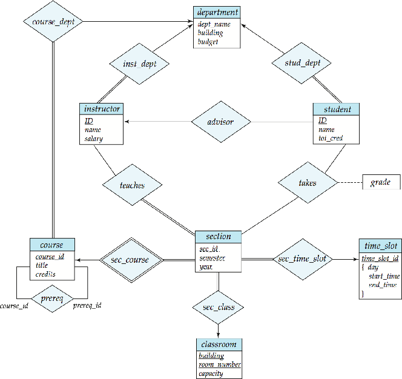

# Homework

## 第一次作业

### 1.7

???+ question
    List four significant differences between a file-processing system and a DBMS.

??? note "my"
    1. Data Redundancy and Consistency:

    For File-Processing System, data redundancy is common because the same data may be duplicated across multiple files. This can lead to inconsistencies if updates are not applied uniformly. However, as for DBMS, redundancy is minimized.

    2. Data Integrity and Security:

    Integrity constraints and security measures are typically implemented at the application level in File-Processing System. But for DBMS, it provides robust mechanisms for enforcing data integrity and security at the system level.

    3. Data Isolation:

    Data in File-Processing System is typically isolated within specific applications, compared to data in DBMS, which is centralized and can be shared across multiple applications and users.

    4. Concurrency Control for Multiple User:

    Concurrency control is typically not built into file-processing systems. But a DBMS provides built-in concurrency control mechanisms to ensure that multiple users can access and modify data simultaneously without conflicts.

??? note "answer"
    1. A file-processing system is more specific to the problem at hand while a DBMS is more general. A file-processing system used by a university is difficult to use in a hospital setting. While a DBMS once written can be used in different places.

    2. It is difficult to ensure atomicity in a conventional file-processing system while it is a lot easier in a DBMS. Often wrapping a set of SQL statements in a "BEGIN TRANSACTION" and "END TRANSACTION" are often enough in the relational DBMS world.
    
    3. Protecting against concurrent-access anomalies in a file-processing system is difficult. Using a DBMS is much easier to protect against concurrent-access anomalies.
    
    4. Most DBMS have a concept of a user and what access that user has. Enforcing such authorization in a file-processing system is really difficult.

---

### 1.8

???+ question
    Explain the concept of physical data independence and its importance in database systems.

??? note "my"
    Physical data independence is the ability to modify the physical schema without changing the logical schema. It is a fundamental principle in database systems that enhances flexibility, scalability, and maintainability. By decoupling the physical storage details from the logical data representation, it allows for efficient management and optimization of data storage without impacting the applications that rely on the database.

??? note "answer[(📝Physical level)](https://melody12020831.github.io/Notebook/Computer_Science/DB/Chapter1/#Physicallevel) [(📝Physical data independence)](https://melody12020831.github.io/Notebook/Computer_Science/DB/Chapter1/#Physicaldataindependence)"
    There are 3 levels of data abstraction in a database: Physical Level, Logical Level and View Level. Physical data independence is the abstraction provided by the Logical Level to hide the complex data-structures that are used at the Physical Level to retrieve data efficiently.

    > **Physical level**: The lowest level of abstraction describes how the data are actually stored. The physical level describes complex low-level data structures in detail.
    
    > **Physical data independence**: the ability to modify the physical schema without changing the logical schema. 
    
    > *from DeepSeek*: Physical data independence is a fundamental principle in database systems that enhances flexibility, scalability, and maintainability. By decoupling the physical storage details from the logical data representation, it allows for efficient management and optimization of data storage without impacting the applications that rely on the database. This separation is crucial for building robust, scalable, and maintainable database systems.

---

### 1.9

???+ question
    List five responsibilities of a database-management system. For each responsibility, explain the problems that would arise if the responsibility were not discharged.

??? note "my"
    1. Efficiency and Scalability in Data Access

    Users might experience slow response times, and the system could become unusable under heavy load, if the responsibility were not discharged.

    2. Reduced Application Development Time

    Without it, developers would have to manually manage data storage and retrieval for every application feature, slowing down the development process.

    3. Data Independence

    If the storage system will be upgrated, applications might break if they are tightly coupled to the physical storage details.

    4. Data Integrity and Security

    For example, in a banking system, without integrity constraints, account balances could become incorrect, and without security measures, hackers could steal customer information.

    5. Concurrent Access and Robustness

    Such as in an e-commerce platform, without concurrency control, two users might purchase the last item in stock simultaneously, leading to overselling. Without recovery mechanisms, a system crash could result in lost orders or payment data.

??? note "answer[(📝Characteristics)](https://melody12020831.github.io/Notebook/Computer_Science/DB/Chapter1/#Characteristics)"
    1. Security - Since DBMS have the concept of a ROLE (user) it easier for setting access managmenent.

    2. Needs to offer atomicity when needed - If atomicity is not provided, inconsistency will be inevitable.
    
    3. Needs to offer a simple and efficient way to query data
    
    4. Needs to offer durability i.e. once an update or an insert has happened it must be persisted.
    
    5. A DBMS needs to offer a way for protection against concurrent-access anomalies.

---

### 1.15 

???+ question
    Describe at least three tables that might be used to store information in a socialnetworking system such as Facebook.

??? note "my"
    1. **Users Table**

    This table stores information about the users of the social networking platform, containing user_id, username, email, first_name, last_name, date_of_birth and profile_picture.

    2. **Posts Table**

    This table stores information about the posts made by users, containing post_id, user_id, content and media_url.

    3. **Friends Table**

    This table stores relationships between users, containing friendship_id, user_id1, user_id2 and status.

??? note "answer"
    1. Users table - that contains id, full name, phone number, email, date of birth, profile pic

    2. Chats table - that contains the chat
    
    3. Friends table - that contains basically two columns of user ids (foreign keys from Users table)

---

## 第二次作业

### 2.7

???+ question
    Consider the bank database of Figure 2.18. Give an expression in the relational algebra for each of the following queries:

    a. Find the name of each branch located in “Chicago”.

    b. Find the ID of each borrower who has a loan in branch “Downtown”.

    ```sql
    branch (branch_name, branch_city, assets)
    customer (ID, customer_name, customer_street, customer_city)
    loan (loan_number, branch_name, amount)
    borrower (ID, loan_number)
    account (account_number, branch_name, balance)
    depositor (ID, account_number)
    ```

    Figure 2.18 Bank database.

??? note "my"
    a.

    $\Pi_{branch\_name}branch(\sigma_{branch\_city = 'Chicago'}(branch))$

    b.

    $\Pi_{ID}(\sigma_{branch\_name = 'Downtown'}(loan \bowtie_{loan.loan\_number = borrower.loan\_number} borrower))$

??? note "answer"
    a. \(\Pi_{branch\_name}(\sigma_{branch\_city = "Chicago"}(branch))\)
    
    b.\(\Pi_{ID}(\sigma_{branch\_name = "Downtown"}(loan \bowtie_{loan.loan\_number = borrower.loan\_number} borrower))\)
---

### 2.12

???+ question
    Consider the bank database of Figure 2.18. Assume that branch names and customer names uniquely identify branches and customers, but loans and accounts can be associated with more than one customer.

    a. What are the appropriate primary keys?

    b. Given your choice of primary keys, identify appropriate foreign keys.

??? note "my"
    a.

    $branch: branch\_name$

    $coustomer: ID$

    $loan: loan\_number$

    $borrower: {ID, loan\_number}$

    $account: account\_number$

    $depositor: {ID, account\_number}$

    分行名称（`branch_name`）是唯一的，可以用来唯一标识每个分行。客户 ID（`ID`）是唯一的，可以用来唯一标识每个客户。贷款编号（`loan_number`）是唯一的，可以用来唯一标识每笔贷款。`borrower` 表是客户和贷款之间的关联表。一个客户可以有多个贷款，一个贷款也可以关联多个客户（虽然通常一个贷款只关联一个客户）。因此，主键需要是 `ID` 和 `loan_number` 的组合。账户编号（`account_number`）是唯一的，可以用来唯一标识每个账户。`depositor` 表是客户和账户之间的关联表。一个客户可以有多个账户，一个账户也可以关联多个客户（例如联名账户）。因此，主键需要是 `ID` 和 `account_number` 的组合。

    b. 

    foreign key: 

    $branch: No$

    $customer: No$

    $loan: branch\_name \ from \ branch$

    $borrower: ID \ from \ customer, loan\_number \ from \ loan$

    $account: branch\_name \ from \ branch$

    $depositor: ID \ from \ customer, account\_number \ from \ account$

    `loan` 表中的 `branch_name` 引用 `branch` 表的 `branch_name`，表示贷款所属的分行。`borrower` 表通过外键建立了客户和贷款之间的关系。`account` 表中的 `branch_name` 引用 `branch` 表的 `branch_name`，表示账户所属的分行。`depositor` 表通过外键建立了客户和账户之间的关系。


??? note "answer"
    a. 

    |Relation Name|	Primary key|
    |:---:|:---:|
    |branch|branch_name|
    |customer|ID|
    |loan|loan_number|
    |borrower|{ID, loan_number}|
    |account|account_number|
    |depositor|{ID, account_number}|

    b. 

    |Relation Name|Foreign key|
    |:-----------:|:---------:|
    |branch|No Foreign Key|
    |customer|No Foreign Key|
    |loan|branch_name|
    |borrower|ID - a foreign key referencing customer relation, loan_number - a foreign key referencing loan relation|
    |account|branch_name|
    |depositor|ID - a foreign key referencing customer relation, account_number - a foreign key referencing account relation|

---

### 2.13

???+ question
    Construct a schema diagram for the bank database of Figure 2.18.

??? note "my"
    

??? note "answer"
    

---

### 2.15

???+ question
    Consider the bank database of Figure 2.18. Give an expression in the relational algebra for each of the following queries:

    a. Find each loan number with a loan amount greater than $10000.

    b. Find the ID of each depositor who has an account with a balance greater than $6000.

    c. Find the ID of each depositor who has an account with a balance greater than $6000 at the “Uptown” branch.

??? note "my"
    a. $\Pi_{loan\_number}(\sigma_{amount > 10000}(loan))$

    b. $\Pi_{ID}(\sigma_{balance > 6000}(depositor \bowtie_{depositor.account\_number = account.account\_number} account))$

    c. $\Pi_{ID}(\sigma_{balance > 6000 \land branch\_name = 'Uptown'}(depositor \bowtie_{depositor.account\_number = account.account\_number} account))$

??? note "answer"
    a. $\Pi_{loan\_number}(\sigma_{amount > 10000}(loan))$

    b. $\Pi_{ID}(depositor \bowtie_{depositor.account\_number = account.account\_number} \sigma_{balance > 6000}(account))$

    c. $\Pi_{ID}(depositor \bowtie_{depositor.account\_number = account.account\_number} \sigma_{balance > 6000 \land branch\_name = 'Uptown'}(account))$

---

## 第三次作业

### 3.8

???+ question
    Consider the bank database of Figure 3.18, where the primary keys are underlined. Construct the following SQL queries for this relational database.

    a. Find the ID of each customer of the bank who has an account but not a loan.

    b. Find the ID of each customer who lives on the same street and in the same city as customer '12345'.

    c. Find the name of each branch that has at least one customer who has an account in the bank and who lives in "Harrison".

    Figure 3.18 Banking database.

    branch($\underline{branch\_name}$, branch_city, assets)

    customer ($\underline{ID}$, customer_name, customer_street, customer_city)

    loan ($\underline{loan\_number}$, branch_name, amount)

    borrower ($\underline{ID},\ \underline{loan\_number}$)

    account ($\underline{account\_number}$ branch_name, balance)

    depositor ($\underline{ID},\ \underline{account\_number}$)

??? note "my"
    a. 

    ```sql
    (SELECT ID FROM depositor)
    EXCEPT 
    (SELECT ID FROM borrower)
    ```

    b. 

    ```sql
    SELECT ID
    FROM customer
    WHERE customer_city == (SELECT customer_city FROM customer WHERE ID = '12345') AND customer_street == (SELECT customer_street FROM customer WHERE ID = '12345')
    ```

    c. 

    ```sql
    SELECT DISTINCT branch_name
    FROM account, depositor, customer 
    WHERE customer.id = depositor.id
        AND depositor.account_number = account.account_number 
        AND customer_city = 'Harrison'
    ```

??? note "answer"
    a.

    ```sql
    (SELECT ID FROM depositor)
    EXCEPT 
    (SELECT ID FROM borrower)
    ```

    b.

    ```sql
    SELECT F.ID
    FROM customer AS F, customer AS S
    WHERE F.customer_street = S.customer_street
        AND F.customer_city = S.customer_city
        AND S.customer_id = '12345';
    ```

    Another method (using scalar subqueries)

    ```sql
    SELECT ID 
    FROM customer 
    WHERE customer_street = (SELECT customer_street FROM customer WHERE ID = '12345') AND 
        customer_city = (SELECT customer_city FROM customer WHERE ID = '12345')
    ```

    c.

    ```sql
    SELECT DISTINCT branch_name
    FROM account, depositor, customer 
    WHERE customer.id = depositor.id
        AND depositor.account_number = account.account_number 
        AND customer_city = 'Harrison'
    ```

---

### 3.9

???+ question
    Consider the relational database of Figure 3.19, where the primary keys are underlined. Give an expression in SQL for each of the following queries.
    
    a. Find the ID, name, and city of residence of each employee who works for "First Bank Corporation".
    
    b. Find the ID, name, and city of residence of each employee who works for "First Bank Corporation" and earns more than $10000.
    
    c. Find the ID of each employee who does not work for "First Bank Corporation".
    
    d. Find the ID of each employee who earns more than every employee of "Small Bank Corporation".
    
    e. Assume that companies may be located in several cities. Find the name of each company that is located in every city in which "Small Bank Corporation" is located.
    
    f. Find the name of the company that has the most employees (or companies, in the case where there is a tie for the most).
    
    g. Find the name of each company whose employees earn a higher salary, on average, than the average salary at "First Bank Corporation".

    Figure 3.19 Employee database.

    employee ($\underline{ID}$, person_name, street, city)
    
    works ($\underline{ID}$, company_name, salary)
    
    company ($\underline{company\_name}$, city)
    
    manages ($\underline{ID}$, manager_id)

??? note "my"
    a. 

    ```sql
    SELECT ID, person_name, city
    FROM employee, works
    WHERE employee.ID = works.ID AND works.company_name = 'First Bank Corporation'
    ```

    b. 

    ```sql
    SELECT ID, person_name, city
    FROM employee, works
    WHERE employee.ID = works.ID AND works.company_name = 'First Bank Corporation' AND works.salary > 10000
    ```

    c. 

    ```sql
    SELECT ID
    FROM works
    WHERE ID NOT IN (SELECT ID FROM works WHERE company_name = 'First Bank Corporation')
    ```

    这里要注意下述做法是错误的。

    ```sql
    SELECT ID
    FROM works
    WHERE company_name != 'First Bank Corporation'
    ```

    因为如果员工在多个公司工作，比如同时在“第一银行”和其他公司，那么他们的ID会被包含吗？比如，一个员工在works表中有两条记录，一条公司是“第一银行”，另一条是其他公司，这时候company_name !=的条件会包含这条记录吗？此时，该员工的ID会被选出，但实际上该员工确实有在“第一银行”工作，所以应该被排除。所以这个查询不正确。

    d. 

    ```sql
    SELECT ID
    FROM works
    WHERE salary > ALL (SELECT salary FROM works WHERE company_name = 'Small Bank Corporation')
    ```

    要注意下述做法是错的。

    ```sql
    SELECT ID
    FROM works
    WHERE company_name = 'Small Bank Corporation' AND salary > avg(salary)
    ```

    上述查询条件是公司名为“Small Bank Corporation”且工资大于该公司的平均工资，而题目要求的是找出那些员工（不论他们所在的公司）的工资高于“小银行公司”的所有员工。即，应该比较该员工的工资是否大于“小银行公司”所有员工的最高工资，或者所有员工的工资。

    e. 

    正确的思路是：对于每一个公司x，确保不存在任何一个“Small Bank Corporation”所在的城市不在x公司的城市中。

    ```sql
    SELECT x.company_name
    FROM company as x
    WHERE NOT EXISTS (
    SELECT city
    FROM company
    WHERE company_name = 'Small Bank Corporation'
    EXCEPT
    SELECT city
    FROM company as y
    WHERE y.company_name = x.company_name
    )
    ```

    f. 

    ```sql
    SELECT company_name 
    FROM works
    GROUP BY company_name
    HAVING COUNT(ID) >= ALL (
        SELECT COUNT(ID)
        FROM works
        GROUP BY company_name
    )
    ```

    g. 

    ```sql
    SELECT conpany_name
    FROM works
    GROUP BY company_name
    HAVING avg(salary) > (SELECT avg(salary) FROM works WHERE company_name = 'First Bank Corporation')
    ```

??? note "answer"
    a. 

    ```sql
    SELECT e.ID, e.person_name, city
    FROM employee AS e, works AS w
    WHERE w.company_name = 'First Bank Corporation' AND w.ID = e.ID
    ```

    b. 

    ```sql
    SELECT ID, name, city
    FROM employee 
    WHERE ID IN (
        SELECT ID
        FROM works
        WHERE company_name = 'First Bank Corporation' AND salary > 10000
    ) 
    ```

    This could be written also in the style of the answer to part a, as follows:

    ```sql
    SELECT e.ID, e.person_name, city
    FROM employee AS e, works AS w
    WHERE w.company_name = 'First Bank Corporation' AND w.ID = e.ID
        AND w.salary > 10000
    ```

    c. 

    ```sql
    SELECT ID
    FROM works
    WHERE company_name <> 'First Bank Corporation' 
    ```

    If one allows people to appear in employee without appearing also in works, the solution is slightly more complicated. An outer join as discussed in Chapter 4 could be used as well.

    ```sql
    SELECT ID 
    FROM employee
    WHERE ID NOT IN (
        SELECT ID
        FROM works
        WHERE company_name = 'First Bank Corporation'
    )
    ```

    d. 

    ```sql
    SELECT ID
    FROM works
    WHERE salary > ALL (
        SELECT salary
        FROM works
        WHERE company_name = 'Small Bank Corporation'
    )
    ```

    If people may work for several companies and we wish to consider the total earnings of each person, the is more complex. But note that the fact that ID is the primary key for works implies that this cannot be the case.

    e. 

    ```sql
    SELECT S.company_name 
    FROM company AS S 
    WHERE NOT EXISTS (
        (
            SELECT city
            FROM company
            WHERE company_name = 'Small Bank Corporation'
        )
        EXCEPT
        (
            SELECT city
            FROM company AS T
            WHERE T.company_name = S.company_name
        )
    )
    ```

    f. 

    ```sql
    SELECT company_name 
    FROM works
    GROUP BY company_name
    HAVING COUNT(DISTINCT ID) >= ALL (
        SELECT COUNT(DISTINCT ID)
        FROM works
        GROUP BY company_name
    )
    ```

    g. 

    ```sql
    SELECT company_name
    FROM works
    GROUP BY company_name 
    HAVING AVG(salary) >  (
        SELECT AVG(salary)
        FROM works
        WHERE company_name = 'First Bank Corporation'
    )
    ```

---

### 3.10

???+ question
    Consider the relational database of Figure 3.19. Give an expression in SQL for each of the following:

    a. Modify the database so that the employee whose ID is '12345' now lives in "Newtown".

    b. Give each manager of “First Bank Corporation” a 10 percent raise unless the salary becomes greater than $100000; in such cases, give only a 3 percent raise.

??? note "my"
    a. 

    ```sql
    update employee
    set city = 'Newtown'
    where ID = '12345'
    ```

    b.

    ```sql
    update employee
    set salary = case
                when salary * 1.1 > 100000 then salary * 1.03
                else salary * 1.1
                end
    where ID in (SELECT manager_id FROM magages)
        and company_name = 'First Bank Corporation'
    ```

??? note "answer"
    a. 

    ```sql
    UPDATE employee
    SET city = 'Newtown'
    WHERE ID = '12345' 
    ```

    b.

    ```sql
    UPDATE works T
    SET T.salary = T.salary * 1.03
    WHERE T.ID IN (SELECT manager_id FROM manages)
        AND T.salary * 1.1 > 100000
        AND T.company_name = 'First Bank Corporation';

    UPDATE works T
    SET T.salary = T.salary * 1.1
    WHERE T.ID IN (SELECT manager_id FROM manages)
        AND T.salary * 1.1 <= 100000
        AND T.company_name = 'First Bank Corporation';
    ```

    The above updates would give different results if executed in the opposite order. We give below a safer solution using the case statement.

    ```sql
    UPDATE works T
    SET T.salary = T.salary * ( 
        CASE
            WHEN (T.salary * 1.1 > 100000) THEN 1.03
            ELSE 1.1 
        END
    )
    WHERE T.ID IN (SELECT manager_id FROM manages) 
        AND T.company_name = 'First Bank Corporation'
    ```

---

### 3.11

???+ question
    Write the following queries in SQL, using the university schema.
    
    a. Find the ID and name of each student who has taken at least one Comp. Sci. course; make sure there are no duplicate names in the result.

    b. Find the ID and name of each student who has not taken any course offered before 2017.

    c. For each department, find the maximum salary of instructors in that department. You may assume that every department has at least one instructor.

    d. Find the lowest, across all departments, of the per-department maximum salary computed by the preceding query.

    

    (For more information about the university schema, see this [link](https://blog.csdn.net/weixin_44073734/article/details/105698093))

??? note "my"
    a. 

    ```sql
    SELECT DISTINCT student.ID, student.name
    FROM student INNER JOIN takes ON student.ID = takes.ID INNER JOIN course ON takes.course_id = course.course_id
    WHERE course.dept_name = 'Comp. Sci.'
    ```

    b. 

    ```sql
    SELECT S.ID, S.name
    FROM student as S
    WHERE NOT EXISTS (SELECT * FROM takes WHERE course.year < 2017 AND S.ID = takes.ID)
    ```

    c. 

    ```sql
    SELECT dept_name, MAX(salary)
    FROM instructor
    GROUP BY dept_name
    ```

    `GROUP BY dept_name` 要求 `SELECT` 子句中只能包含聚合函数或分组列。`dept_name` 是分组列，用于标识每个部门，而 `MAX(salary)` 是该组的聚合结果。如果省略 `dept_name`，查询将无法明确显示每个部门的最大工资，结果会失去意义（仅返回全局最大工资，而非按部门分组）。

    d. 

    ```sql
    WITH dept_max (dept_name, max_salary) AS (
        SELECT dept_name, MAX(salary)
        FROM instructor
        GROUP BY dept_name
    )
    SELECT MIN(max_salary)
    FROM dept_max
    ```


??? note "answer"
    a. 

    ```sql
    SELECT DISTINCT student.ID, student.name
    FROM student INNER JOIN takes  ON student.ID = takes.ID 
                INNER JOIN course ON takes.course_id = course.course_id
    WHERE course.dept_name = 'Comp. Sci.';
    ```

    b. 

    ```sql
    SELECT ID, name 
    FROM student AS S
    WHERE NOT EXISTS (
        SELECT * 
        FROM takes AS T
        WHERE year < 2017 AND T.ID = S.ID 
    )
    ```

    c. 

    ```sql
    SELECT dept_name, MAX(salary)
    FROM instructor
    GROUP BY dept_name 
    ```

    d. 

    ```sql
    WITH maximum_salary_within_dept(dept_name, max_salary) AS (
        SELECT dept_name, MAX(salary)
        FROM instructor
        GROUP BY dept_name 
    ) 
    SELECT MIN(max_salary) 
    FROM maximum_salary_within_dept
    ```

---

### 3.15

???+ question
    Consider the bank database of Figure 3.18, where the primary keys are underlined. Construct the following SQL queries for this relational database.

    a. Find each customer who has an account at every branch located in "Brooklyn".

    b. Find the total sum of all loan amounts in the bank.

    c. Find the names of all branches that have assets greater than those of at least one branch located in "Brooklyn".

??? note "my"
    a. 

    ```sql
    SELECT c.ID
    FROM customer c
    WHERE NOT EXISTS (
        SELECT b.branch_name 
        FROM branch b 
        WHERE b.branch_city = 'Brooklyn'
        EXCEPT
        SELECT a.branch_name 
        FROM depositor d JOIN account a ON d.account_number = a.account_number
        WHERE d.ID = c.ID
    );
    ```

    b. 

    ```sql
    SELECT SUM(amount)
    FROM loan
    ```

    这里不能加上 `GROUP BY loan_number`，因为每个贷款号对应一个金额，这样SUM之后每个贷款号的总和还是自身，导致结果会是所有贷款金额的列表，而不是总和。

    c. 

    ```sql
    SELECT branch_name
    FROM branch
    WHERE assets > SOME (
        SELECT assets
        FROM branch
        WHERE branch_city = 'Brooklyn'
    );
    ```

??? note "answer"
    a. 

    ```sql
    WITH all_branches_in_brooklyn(branch_name) AS (
    SELECT branch_name 
    FROM branch
    WHERE branch_city = 'Brooklyn'
    )
    SELECT ID, customer_name 
    FROM customer AS c1
    WHERE NOT EXISTS (
        (SELECT branch_name FROM all_branches_in_brooklyn)
        EXCEPT
        (
            SELECT branch_name
            FROM account INNER JOIN depositor 
                ON account.account_number = depositor.account_number
            WHERE depositor.ID = c1.ID
        )
    )
    ```

    b.

    ```sql
    SELECT SUM(amount)
    FROM loan
    ```

    c. 

    ```sql
    SELECT branch_name
    FROM branch
    WHERE assets > SOME (
        SELECT assets
        FROM branch
        WHERE branch_city = 'Brooklyn'
    );
    ```

---