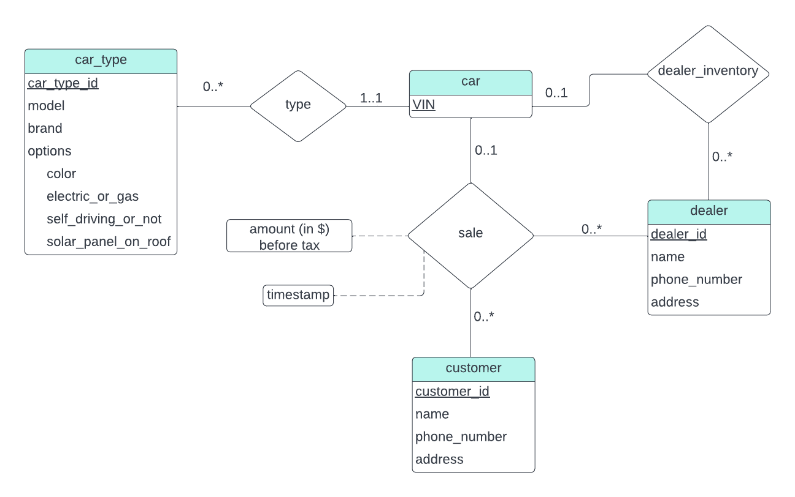
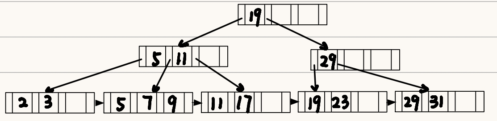

# Homework

## 第一次作业

### 1.7

???+ question
    List four significant differences between a file-processing system and a DBMS.

??? note "my"
    1. Data Redundancy and Consistency:

    For File-Processing System, data redundancy is common because the same data may be duplicated across multiple files. This can lead to inconsistencies if updates are not applied uniformly. However, as for DBMS, redundancy is minimized.
    
    2. Data Integrity and Security:
    
    Integrity constraints and security measures are typically implemented at the application level in File-Processing System. But for DBMS, it provides robust mechanisms for enforcing data integrity and security at the system level.
    
    3. Data Isolation:
    
    Data in File-Processing System is typically isolated within specific applications, compared to data in DBMS, which is centralized and can be shared across multiple applications and users.
    
    4. Concurrency Control for Multiple User:
    
    Concurrency control is typically not built into file-processing systems. But a DBMS provides built-in concurrency control mechanisms to ensure that multiple users can access and modify data simultaneously without conflicts.

??? note "answer"
    1. A file-processing system is more specific to the problem at hand while a DBMS is more general. A file-processing system used by a university is difficult to use in a hospital setting. While a DBMS once written can be used in different places.

    2. It is difficult to ensure atomicity in a conventional file-processing system while it is a lot easier in a DBMS. Often wrapping a set of SQL statements in a "BEGIN TRANSACTION" and "END TRANSACTION" are often enough in the relational DBMS world.
    
    3. Protecting against concurrent-access anomalies in a file-processing system is difficult. Using a DBMS is much easier to protect against concurrent-access anomalies.
    
    4. Most DBMS have a concept of a user and what access that user has. Enforcing such authorization in a file-processing system is really difficult.

---

### 1.8

???+ question
    Explain the concept of physical data independence and its importance in database systems.

??? note "my"
    Physical data independence is the ability to modify the physical schema without changing the logical schema. It is a fundamental principle in database systems that enhances flexibility, scalability, and maintainability. By decoupling the physical storage details from the logical data representation, it allows for efficient management and optimization of data storage without impacting the applications that rely on the database.

??? note "answer[(📝Physical level)](https://melody12020831.github.io/Notebook/Computer_Science/DB/Chapter1/#Physicallevel) [(📝Physical data independence)](https://melody12020831.github.io/Notebook/Computer_Science/DB/Chapter1/#Physicaldataindependence)"
    There are 3 levels of data abstraction in a database: Physical Level, Logical Level and View Level. Physical data independence is the abstraction provided by the Logical Level to hide the complex data-structures that are used at the Physical Level to retrieve data efficiently.

    > **Physical level**: The lowest level of abstraction describes how the data are actually stored. The physical level describes complex low-level data structures in detail.
    
    > **Physical data independence**: the ability to modify the physical schema without changing the logical schema. 
    
    > *from DeepSeek*: Physical data independence is a fundamental principle in database systems that enhances flexibility, scalability, and maintainability. By decoupling the physical storage details from the logical data representation, it allows for efficient management and optimization of data storage without impacting the applications that rely on the database. This separation is crucial for building robust, scalable, and maintainable database systems.

---

### 1.9

???+ question
    List five responsibilities of a database-management system. For each responsibility, explain the problems that would arise if the responsibility were not discharged.

??? note "my"
    1. Efficiency and Scalability in Data Access

    Users might experience slow response times, and the system could become unusable under heavy load, if the responsibility were not discharged.
    
    2. Reduced Application Development Time
    
    Without it, developers would have to manually manage data storage and retrieval for every application feature, slowing down the development process.
    
    3. Data Independence
    
    If the storage system will be upgrated, applications might break if they are tightly coupled to the physical storage details.
    
    4. Data Integrity and Security
    
    For example, in a banking system, without integrity constraints, account balances could become incorrect, and without security measures, hackers could steal customer information.
    
    5. Concurrent Access and Robustness
    
    Such as in an e-commerce platform, without concurrency control, two users might purchase the last item in stock simultaneously, leading to overselling. Without recovery mechanisms, a system crash could result in lost orders or payment data.

??? note "answer[(📝Characteristics)](https://melody12020831.github.io/Notebook/Computer_Science/DB/Chapter1/#Characteristics)"
    1. Security - Since DBMS have the concept of a ROLE (user) it easier for setting access managmenent.

    2. Needs to offer atomicity when needed - If atomicity is not provided, inconsistency will be inevitable.
    
    3. Needs to offer a simple and efficient way to query data
    
    4. Needs to offer durability i.e. once an update or an insert has happened it must be persisted.
    
    5. A DBMS needs to offer a way for protection against concurrent-access anomalies.

---

### 1.15 

???+ question
    Describe at least three tables that might be used to store information in a socialnetworking system such as Facebook.

??? note "my"
    1. **Users Table**

    This table stores information about the users of the social networking platform, containing user_id, username, email, first_name, last_name, date_of_birth and profile_picture.
    
    2. **Posts Table**
    
    This table stores information about the posts made by users, containing post_id, user_id, content and media_url.
    
    3. **Friends Table**
    
    This table stores relationships between users, containing friendship_id, user_id1, user_id2 and status.

??? note "answer"
    1. Users table - that contains id, full name, phone number, email, date of birth, profile pic

    2. Chats table - that contains the chat
    
    3. Friends table - that contains basically two columns of user ids (foreign keys from Users table)

---

## 第二次作业

### 2.7

???+ question
    Consider the bank database of Figure 2.18. Give an expression in the relational algebra for each of the following queries:

    a. Find the name of each branch located in “Chicago”.
    
    b. Find the ID of each borrower who has a loan in branch “Downtown”.
    
    ```sql
    branch (branch_name, branch_city, assets)
    customer (ID, customer_name, customer_street, customer_city)
    loan (loan_number, branch_name, amount)
    borrower (ID, loan_number)
    account (account_number, branch_name, balance)
    depositor (ID, account_number)
    ```
    
    Figure 2.18 Bank database.

??? note "my"
    a.

    $\Pi_{branch\_name}branch(\sigma_{branch\_city = 'Chicago'}(branch))$
    
    b.
    
    $\Pi_{ID}(\sigma_{branch\_name = 'Downtown'}(loan \bowtie_{loan.loan\_number = borrower.loan\_number} borrower))$

??? note "answer"
    a. \(\Pi_{branch\_name}(\sigma_{branch\_city = "Chicago"}(branch))\)
    
    b.\(\Pi_{ID}(\sigma_{branch\_name = "Downtown"}(loan \bowtie_{loan.loan\_number = borrower.loan\_number} borrower))\)
---

### 2.12

???+ question
    Consider the bank database of Figure 2.18. Assume that branch names and customer names uniquely identify branches and customers, but loans and accounts can be associated with more than one customer.

    a. What are the appropriate primary keys?
    
    b. Given your choice of primary keys, identify appropriate foreign keys.

??? note "my"
    a.

    $branch: branch\_name$
    
    $coustomer: ID$
    
    $loan: loan\_number$
    
    $borrower: {ID, loan\_number}$
    
    $account: account\_number$
    
    $depositor: {ID, account\_number}$
    
    分行名称（`branch_name`）是唯一的，可以用来唯一标识每个分行。客户 ID（`ID`）是唯一的，可以用来唯一标识每个客户。贷款编号（`loan_number`）是唯一的，可以用来唯一标识每笔贷款。`borrower` 表是客户和贷款之间的关联表。一个客户可以有多个贷款，一个贷款也可以关联多个客户（虽然通常一个贷款只关联一个客户）。因此，主键需要是 `ID` 和 `loan_number` 的组合。账户编号（`account_number`）是唯一的，可以用来唯一标识每个账户。`depositor` 表是客户和账户之间的关联表。一个客户可以有多个账户，一个账户也可以关联多个客户（例如联名账户）。因此，主键需要是 `ID` 和 `account_number` 的组合。
    
    b. 
    
    foreign key: 
    
    $branch: No$
    
    $customer: No$
    
    $loan: branch\_name \ from \ branch$
    
    $borrower: ID \ from \ customer, loan\_number \ from \ loan$
    
    $account: branch\_name \ from \ branch$
    
    $depositor: ID \ from \ customer, account\_number \ from \ account$
    
    `loan` 表中的 `branch_name` 引用 `branch` 表的 `branch_name`，表示贷款所属的分行。`borrower` 表通过外键建立了客户和贷款之间的关系。`account` 表中的 `branch_name` 引用 `branch` 表的 `branch_name`，表示账户所属的分行。`depositor` 表通过外键建立了客户和账户之间的关系。


??? note "answer"
    a. 

    |Relation Name|	Primary key|
    |:---:|:---:|
    |branch|branch_name|
    |customer|ID|
    |loan|loan_number|
    |borrower|{ID, loan_number}|
    |account|account_number|
    |depositor|{ID, account_number}|
    
    b. 
    
    |Relation Name|Foreign key|
    |:-----------:|:---------:|
    |branch|No Foreign Key|
    |customer|No Foreign Key|
    |loan|branch_name|
    |borrower|ID - a foreign key referencing customer relation, loan_number - a foreign key referencing loan relation|
    |account|branch_name|
    |depositor|ID - a foreign key referencing customer relation, account_number - a foreign key referencing account relation|

---

### 2.13

???+ question
    Construct a schema diagram for the bank database of Figure 2.18.

??? note "my"
    

??? note "answer"
    

---

### 2.15

???+ question
    Consider the bank database of Figure 2.18. Give an expression in the relational algebra for each of the following queries:

    a. Find each loan number with a loan amount greater than $10000.
    
    b. Find the ID of each depositor who has an account with a balance greater than $6000.
    
    c. Find the ID of each depositor who has an account with a balance greater than $6000 at the “Uptown” branch.

??? note "my"
    a. $\Pi_{loan\_number}(\sigma_{amount > 10000}(loan))$

    b. $\Pi_{ID}(\sigma_{balance > 6000}(depositor \bowtie_{depositor.account\_number = account.account\_number} account))$
    
    c. $\Pi_{ID}(\sigma_{balance > 6000 \land branch\_name = 'Uptown'}(depositor \bowtie_{depositor.account\_number = account.account\_number} account))$

??? note "answer"
    a. $\Pi_{loan\_number}(\sigma_{amount > 10000}(loan))$

    b. $\Pi_{ID}(depositor \bowtie_{depositor.account\_number = account.account\_number} \sigma_{balance > 6000}(account))$
    
    c. $\Pi_{ID}(depositor \bowtie_{depositor.account\_number = account.account\_number} \sigma_{balance > 6000 \land branch\_name = 'Uptown'}(account))$

---

## 第三次作业

### 3.8

???+ question
    Consider the bank database of Figure 3.18, where the primary keys are underlined. Construct the following SQL queries for this relational database.

    a. Find the ID of each customer of the bank who has an account but not a loan.
    
    b. Find the ID of each customer who lives on the same street and in the same city as customer '12345'.
    
    c. Find the name of each branch that has at least one customer who has an account in the bank and who lives in "Harrison".
    
    Figure 3.18 Banking database.
    
    branch($\underline{branch\_name}$, branch_city, assets)
    
    customer ($\underline{ID}$, customer_name, customer_street, customer_city)
    
    loan ($\underline{loan\_number}$, branch_name, amount)
    
    borrower ($\underline{ID},\ \underline{loan\_number}$)
    
    account ($\underline{account\_number}$ branch_name, balance)
    
    depositor ($\underline{ID},\ \underline{account\_number}$)

??? note "my"
    a. 

    ```sql
    (SELECT ID FROM depositor)
    EXCEPT 
    (SELECT ID FROM borrower)
    ```
    
    b. 
    
    ```sql
    SELECT ID
    FROM customer
    WHERE customer_city == (SELECT customer_city FROM customer WHERE ID = '12345') AND customer_street == (SELECT customer_street FROM customer WHERE ID = '12345')
    ```
    
    c. 
    
    ```sql
    SELECT DISTINCT branch_name
    FROM account, depositor, customer 
    WHERE customer.id = depositor.id
        AND depositor.account_number = account.account_number 
        AND customer_city = 'Harrison'
    ```

??? note "answer"
    a.

    ```sql
    (SELECT ID FROM depositor)
    EXCEPT 
    (SELECT ID FROM borrower)
    ```
    
    b.
    
    ```sql
    SELECT F.ID
    FROM customer AS F, customer AS S
    WHERE F.customer_street = S.customer_street
        AND F.customer_city = S.customer_city
        AND S.customer_id = '12345';
    ```
    
    Another method (using scalar subqueries)
    
    ```sql
    SELECT ID 
    FROM customer 
    WHERE customer_street = (SELECT customer_street FROM customer WHERE ID = '12345') AND 
        customer_city = (SELECT customer_city FROM customer WHERE ID = '12345')
    ```
    
    c.
    
    ```sql
    SELECT DISTINCT branch_name
    FROM account, depositor, customer 
    WHERE customer.id = depositor.id
        AND depositor.account_number = account.account_number 
        AND customer_city = 'Harrison'
    ```

---

### 3.9

???+ question
    Consider the relational database of Figure 3.19, where the primary keys are underlined. Give an expression in SQL for each of the following queries.
    
    a. Find the ID, name, and city of residence of each employee who works for "First Bank Corporation".
    
    b. Find the ID, name, and city of residence of each employee who works for "First Bank Corporation" and earns more than $10000.
    
    c. Find the ID of each employee who does not work for "First Bank Corporation".
    
    d. Find the ID of each employee who earns more than every employee of "Small Bank Corporation".
    
    e. Assume that companies may be located in several cities. Find the name of each company that is located in every city in which "Small Bank Corporation" is located.
    
    f. Find the name of the company that has the most employees (or companies, in the case where there is a tie for the most).
    
    g. Find the name of each company whose employees earn a higher salary, on average, than the average salary at "First Bank Corporation".
    
    Figure 3.19 Employee database.
    
    employee ($\underline{ID}$, person_name, street, city)
    
    works ($\underline{ID}$, company_name, salary)
    
    company ($\underline{company\_name}$, city)
    
    manages ($\underline{ID}$, manager_id)

??? note "my"
    a. 

    ```sql
    SELECT ID, person_name, city
    FROM employee, works
    WHERE employee.ID = works.ID AND works.company_name = 'First Bank Corporation'
    ```
    
    b. 
    
    ```sql
    SELECT ID, person_name, city
    FROM employee, works
    WHERE employee.ID = works.ID AND works.company_name = 'First Bank Corporation' AND works.salary > 10000
    ```
    
    c. 
    
    ```sql
    SELECT ID
    FROM works
    WHERE ID NOT IN (SELECT ID FROM works WHERE company_name = 'First Bank Corporation')
    ```
    
    这里要注意下述做法是错误的。
    
    ```sql
    SELECT ID
    FROM works
    WHERE company_name != 'First Bank Corporation'
    ```
    
    因为如果员工在多个公司工作，比如同时在“第一银行”和其他公司，那么他们的ID会被包含吗？比如，一个员工在works表中有两条记录，一条公司是“第一银行”，另一条是其他公司，这时候company_name !=的条件会包含这条记录吗？此时，该员工的ID会被选出，但实际上该员工确实有在“第一银行”工作，所以应该被排除。所以这个查询不正确。
    
    d. 
    
    ```sql
    SELECT ID
    FROM works
    WHERE salary > ALL (SELECT salary FROM works WHERE company_name = 'Small Bank Corporation')
    ```
    
    要注意下述做法是错的。
    
    ```sql
    SELECT ID
    FROM works
    WHERE company_name = 'Small Bank Corporation' AND salary > avg(salary)
    ```
    
    上述查询条件是公司名为“Small Bank Corporation”且工资大于该公司的平均工资，而题目要求的是找出那些员工（不论他们所在的公司）的工资高于“小银行公司”的所有员工。即，应该比较该员工的工资是否大于“小银行公司”所有员工的最高工资，或者所有员工的工资。
    
    e. 
    
    正确的思路是：对于每一个公司x，确保不存在任何一个“Small Bank Corporation”所在的城市不在x公司的城市中。
    
    ```sql
    SELECT x.company_name
    FROM company as x
    WHERE NOT EXISTS (
    SELECT city
    FROM company
    WHERE company_name = 'Small Bank Corporation'
    EXCEPT
    SELECT city
    FROM company as y
    WHERE y.company_name = x.company_name
    )
    ```
    
    f. 
    
    ```sql
    SELECT company_name 
    FROM works
    GROUP BY company_name
    HAVING COUNT(ID) >= ALL (
        SELECT COUNT(ID)
        FROM works
        GROUP BY company_name
    )
    ```
    
    g. 
    
    ```sql
    SELECT conpany_name
    FROM works
    GROUP BY company_name
    HAVING avg(salary) > (SELECT avg(salary) FROM works WHERE company_name = 'First Bank Corporation')
    ```

??? note "answer"
    a. 

    ```sql
    SELECT e.ID, e.person_name, city
    FROM employee AS e, works AS w
    WHERE w.company_name = 'First Bank Corporation' AND w.ID = e.ID
    ```
    
    b. 
    
    ```sql
    SELECT ID, name, city
    FROM employee 
    WHERE ID IN (
        SELECT ID
        FROM works
        WHERE company_name = 'First Bank Corporation' AND salary > 10000
    ) 
    ```
    
    This could be written also in the style of the answer to part a, as follows:
    
    ```sql
    SELECT e.ID, e.person_name, city
    FROM employee AS e, works AS w
    WHERE w.company_name = 'First Bank Corporation' AND w.ID = e.ID
        AND w.salary > 10000
    ```
    
    c. 
    
    ```sql
    SELECT ID
    FROM works
    WHERE company_name <> 'First Bank Corporation' 
    ```
    
    If one allows people to appear in employee without appearing also in works, the solution is slightly more complicated. An outer join as discussed in Chapter 4 could be used as well.
    
    ```sql
    SELECT ID 
    FROM employee
    WHERE ID NOT IN (
        SELECT ID
        FROM works
        WHERE company_name = 'First Bank Corporation'
    )
    ```
    
    d. 
    
    ```sql
    SELECT ID
    FROM works
    WHERE salary > ALL (
        SELECT salary
        FROM works
        WHERE company_name = 'Small Bank Corporation'
    )
    ```
    
    If people may work for several companies and we wish to consider the total earnings of each person, the is more complex. But note that the fact that ID is the primary key for works implies that this cannot be the case.
    
    e. 
    
    ```sql
    SELECT S.company_name 
    FROM company AS S 
    WHERE NOT EXISTS (
        (
            SELECT city
            FROM company
            WHERE company_name = 'Small Bank Corporation'
        )
        EXCEPT
        (
            SELECT city
            FROM company AS T
            WHERE T.company_name = S.company_name
        )
    )
    ```
    
    f. 
    
    ```sql
    SELECT company_name 
    FROM works
    GROUP BY company_name
    HAVING COUNT(DISTINCT ID) >= ALL (
        SELECT COUNT(DISTINCT ID)
        FROM works
        GROUP BY company_name
    )
    ```
    
    g. 
    
    ```sql
    SELECT company_name
    FROM works
    GROUP BY company_name 
    HAVING AVG(salary) >  (
        SELECT AVG(salary)
        FROM works
        WHERE company_name = 'First Bank Corporation'
    )
    ```

---

### 3.10

???+ question
    Consider the relational database of Figure 3.19. Give an expression in SQL for each of the following:

    a. Modify the database so that the employee whose ID is '12345' now lives in "Newtown".
    
    b. Give each manager of “First Bank Corporation” a 10 percent raise unless the salary becomes greater than $100000; in such cases, give only a 3 percent raise.

??? note "my"
    a. 

    ```sql
    update employee
    set city = 'Newtown'
    where ID = '12345'
    ```
    
    b.
    
    ```sql
    update employee
    set salary = case
                when salary * 1.1 > 100000 then salary * 1.03
                else salary * 1.1
                end
    where ID in (SELECT manager_id FROM magages)
        and company_name = 'First Bank Corporation'
    ```

??? note "answer"
    a. 

    ```sql
    UPDATE employee
    SET city = 'Newtown'
    WHERE ID = '12345' 
    ```
    
    b.
    
    ```sql
    UPDATE works T
    SET T.salary = T.salary * 1.03
    WHERE T.ID IN (SELECT manager_id FROM manages)
        AND T.salary * 1.1 > 100000
        AND T.company_name = 'First Bank Corporation';
    
    UPDATE works T
    SET T.salary = T.salary * 1.1
    WHERE T.ID IN (SELECT manager_id FROM manages)
        AND T.salary * 1.1 <= 100000
        AND T.company_name = 'First Bank Corporation';
    ```
    
    The above updates would give different results if executed in the opposite order. We give below a safer solution using the case statement.
    
    ```sql
    UPDATE works T
    SET T.salary = T.salary * ( 
        CASE
            WHEN (T.salary * 1.1 > 100000) THEN 1.03
            ELSE 1.1 
        END
    )
    WHERE T.ID IN (SELECT manager_id FROM manages) 
        AND T.company_name = 'First Bank Corporation'
    ```

---

### 3.11

???+ question
    Write the following queries in SQL, using the university schema.
    
    a. Find the ID and name of each student who has taken at least one Comp. Sci. course; make sure there are no duplicate names in the result.
    
    b. Find the ID and name of each student who has not taken any course offered before 2017.
    
    c. For each department, find the maximum salary of instructors in that department. You may assume that every department has at least one instructor.
    
    d. Find the lowest, across all departments, of the per-department maximum salary computed by the preceding query.
    
    
    
    (For more information about the university schema, see this [link](https://blog.csdn.net/weixin_44073734/article/details/105698093))

??? note "my"
    a. 

    ```sql
    SELECT DISTINCT student.ID, student.name
    FROM student INNER JOIN takes ON student.ID = takes.ID INNER JOIN course ON takes.course_id = course.course_id
    WHERE course.dept_name = 'Comp. Sci.'
    ```
    
    b. 
    
    ```sql
    SELECT S.ID, S.name
    FROM student as S
    WHERE NOT EXISTS (SELECT * FROM takes WHERE course.year < 2017 AND S.ID = takes.ID)
    ```
    
    c. 
    
    ```sql
    SELECT dept_name, MAX(salary)
    FROM instructor
    GROUP BY dept_name
    ```
    
    `GROUP BY dept_name` 要求 `SELECT` 子句中只能包含聚合函数或分组列。`dept_name` 是分组列，用于标识每个部门，而 `MAX(salary)` 是该组的聚合结果。如果省略 `dept_name`，查询将无法明确显示每个部门的最大工资，结果会失去意义（仅返回全局最大工资，而非按部门分组）。
    
    d. 
    
    ```sql
    WITH dept_max (dept_name, max_salary) AS (
        SELECT dept_name, MAX(salary)
        FROM instructor
        GROUP BY dept_name
    )
    SELECT MIN(max_salary)
    FROM dept_max
    ```


??? note "answer"
    a. 

    ```sql
    SELECT DISTINCT student.ID, student.name
    FROM student INNER JOIN takes  ON student.ID = takes.ID 
                INNER JOIN course ON takes.course_id = course.course_id
    WHERE course.dept_name = 'Comp. Sci.';
    ```
    
    b. 
    
    ```sql
    SELECT ID, name 
    FROM student AS S
    WHERE NOT EXISTS (
        SELECT * 
        FROM takes AS T
        WHERE year < 2017 AND T.ID = S.ID 
    )
    ```
    
    c. 
    
    ```sql
    SELECT dept_name, MAX(salary)
    FROM instructor
    GROUP BY dept_name 
    ```
    
    d. 
    
    ```sql
    WITH maximum_salary_within_dept(dept_name, max_salary) AS (
        SELECT dept_name, MAX(salary)
        FROM instructor
        GROUP BY dept_name 
    ) 
    SELECT MIN(max_salary) 
    FROM maximum_salary_within_dept
    ```

---

### 3.15

???+ question
    Consider the bank database of Figure 3.18, where the primary keys are underlined. Construct the following SQL queries for this relational database.

    a. Find each customer who has an account at every branch located in "Brooklyn".
    
    b. Find the total sum of all loan amounts in the bank.
    
    c. Find the names of all branches that have assets greater than those of at least one branch located in "Brooklyn".

??? note "my"
    a. 

    ```sql
    SELECT c.ID
    FROM customer c
    WHERE NOT EXISTS (
        SELECT b.branch_name 
        FROM branch b 
        WHERE b.branch_city = 'Brooklyn'
        EXCEPT
        SELECT a.branch_name 
        FROM depositor d JOIN account a ON d.account_number = a.account_number
        WHERE d.ID = c.ID
    );
    ```
    
    b. 
    
    ```sql
    SELECT SUM(amount)
    FROM loan
    ```
    
    这里不能加上 `GROUP BY loan_number`，因为每个贷款号对应一个金额，这样SUM之后每个贷款号的总和还是自身，导致结果会是所有贷款金额的列表，而不是总和。
    
    c. 
    
    ```sql
    SELECT branch_name
    FROM branch
    WHERE assets > SOME (
        SELECT assets
        FROM branch
        WHERE branch_city = 'Brooklyn'
    );
    ```

??? note "answer"
    a. 

    ```sql
    WITH all_branches_in_brooklyn(branch_name) AS (
    SELECT branch_name 
    FROM branch
    WHERE branch_city = 'Brooklyn'
    )
    SELECT ID, customer_name 
    FROM customer AS c1
    WHERE NOT EXISTS (
        (SELECT branch_name FROM all_branches_in_brooklyn)
        EXCEPT
        (
            SELECT branch_name
            FROM account INNER JOIN depositor 
                ON account.account_number = depositor.account_number
            WHERE depositor.ID = c1.ID
        )
    )
    ```
    
    b.
    
    ```sql
    SELECT SUM(amount)
    FROM loan
    ```
    
    c. 
    
    ```sql
    SELECT branch_name
    FROM branch
    WHERE assets > SOME (
        SELECT assets
        FROM branch
        WHERE branch_city = 'Brooklyn'
    );
    ```

---

## 第四次作业

### 4.7

???+ question
    Consider the employee database of Figure 4.12. Give an SQL DDL definition of this database.
    
    Identify referential-integrity constraints that should hold, and include them in the DDL definition.
    
    **Figure 4.12** Employee database.
    
    employee ($\underline{ID}$, person_name, street, city)
    
    works ($\underline{ID}$, company_name, salary)
    
    company ($\underline{company\_name}$, city)
    
    manages ($\underline{ID}$, manager_id)

??? note "my"
    ```sql
    CREATE TABLE employee(
        ID int,
        person_name char(20),
        street char(20),
        city char(20),
        primary key (ID)
    );

    CREATE TABLE company(
        company_name char(20),
        city char(20),
        primary key (company_name)
    );
    
    CREATE TABLE works(
        ID int,
        company_name char(20),
        salary int,
        primary key (ID),
        foreign key (ID) references employee(ID),
        foreign key (company_name) references company(company_name)
    );
    
    CREATE TABLE manages(
        ID int,
        manager_id int,
        primary key (ID),
        foreign key (ID) references employee(ID),
        foreign key (manager_id) references employee(ID)
    );
    ```

??? note "answer"
    ```sql
    CREATE TABLE employee ( 
        id INTEGER,
        person_name VARCHAR(50),
        street VARCHAR(50),
        city VARCHAR(50),
        PRIMARY KEY (id)
    );

    CREATE TABLE company ( 
        company_name VARCHAR(50),
        city VARCHAR(50),
        PRIMARY KEY(company_name)
    );
    
    CREATE TABLE works (
        id INTEGER,
        company_name VARCHAR(50),
        salary numeric(10,2),
        PRIMARY KEY(id),
        FOREIGN KEY (id) REFERENCES employee(id),
        FOREIGN KEY (company_name) REFERENCES company(company_name)
    );
    
    CREATE TABLE manages ( 
        id INTEGER,
        manager_id INTEGER, 
        PRIMARY KEY (id), 
        FOREIGN KEY (id) REFERENCES employee (id), 
        FOREIGN KEY (manager_id) REFERENCES employee (id)
    );
    ```


??? note "about DDL(https://zhuanlan.zhihu.com/p/391552199)"
    SQL程序语言有四种类型，对数据库的基本操作都属于这四类，它们分别为；数据定义语言(DDL)、数据查询语言（DQL）、数据操纵语言（DML）、数据控制语言（DCL）。

    1. DDL 全称是 Data Definition Language，即数据定义语言。
    
    数据定义语言是由 SQL 语言集中负责数据结构定义与数据库对象定义的语言，并且由 `CREATE` 、`ALTER` 、`DROP` 和 `TRUNCATE` 四个语法组成。
    
    2. DML 全称是 Data Manipulation Language，即数据操纵语言。
    
    主要由 `insert`、`update`、`delete`语法组成。
    
    3. DQL 全称是 Data Query Language，即数据查询语言。
    
    主要由 `select` 语法组成。
    
    4. DCL 全称是 Data Control Language，即数据控制语言。
    
    主要由 `grant`、`revoke`、`show grants`语法组成。

---

### 4.9

???+ question
    SQL allows a foreign-key dependency to refer to the same relation, as in the following example:

    ```sql
    create table manager
        (employee_ID char(20),
        manager_ID char(20),
        primary key employee_ID,
        foreign key (manager_ID) references manager(employee_ID) on delete cascade);
    ```
    
    Here, *employee_ID* is a key to the table manager, meaning that each employee has at most one manager. The foreign-key clause requires that every manager also be an employee. Explain exactly what happens when a tuple in the relation *manager* is deleted.

??? note "my"
    When a tuple in the relation *manager* is deleted, the corresponding tuple of this manager in the manager, which means that the tuples of employees under this manager will also be deleted. And the same thing happens for the employees under the deleted employees that are deleted in the previous deletion. The deletion will reach end when all the employees under the manager are deleted.

??? note "answer"
    The tuples of all employees of the manager, at all levels, get deleted as well! This happens in a series of steps. The inital deletion will trigger deletion of all the tuples corresponding to direct employees of the manager. These deletions will in turn cause deletions of second-level employee tuples, and so on, till all direct and indirect employee tuples are deleted.

---

### 4.12

???+ question
    Suppose a user wants to grant **select** access on a relation to another user. Why should the user include (or not include) the clause **granted by current role** in the **grant** statement?

??? note "my"
    包含`granted by current role` 时是明确权限的授予者是当前会话激活的角色，而不是用户自身，此时后续权限的撤销或修改将基于角色的权限链。此时可确保权限与角色绑定。当角色被撤销时，其授予的权限才会自动失效。而不包含时权限的授予者被记录为执行命令的用户本身，权限链直接依赖用户，与角色无关，更适合在临时调试或一次性访问时使用。

    When `granted by current role` is included, it indicates that the granting authority is the current session-activated role rather than the user themselves. At this point, the subsequent revocation or modification of permissions will be based on the permission chain of the role. This ensures that permissions are bound to the role. When the role is revoked, the permissions granted by it will automatically become invalid. When it is not included, the granting authority is recorded as the user who executed the command, and the permission chain directly depends on the user and is unrelated to the role. This is more suitable for temporary debugging or one-time access.

??? note "answer"
    Both cases give the same authorization at the time the statement is executed, but the long-term effects differ. If the grant is done based on the role, then the grant remains in effect even if the user who performed the grant leaves and that user's account is terminated. Whether that is a good or bad idea depends on the specific situation, but usually granting through a role is more consistent with a well-run enterprise.

---

### 5.6

???+ question
    Consider the bank database of Figure 5.21. Let us define a view branch_cust as follows:

    ```sql
    create view branch_cust as
    select branch_name, customer_name
    from depositor, account
    where depositor.account_number = account.account_number;
    ```
    
    Suppose that the view is materialized; that is, the view is computed and stored. Write triggers to maintain the view, that is, to keep it up-to-date on insertions to depositor or account. It is not necessary to handle deletions or updates. Note that, for simplicity, we have not required the elimination of duplicates.
    
    **Figure 5.21** Banking database
    
    branch ($\underline{branch\_name}$, branch_city, assets)
    
    customer ($\underline{customer\_name}$, customer_street, cust omer_city)
    
    loan ($\underline{loan\_number}$, branch name, amount)
    
    borrower ($\underline{customer\_name}$, $\underline{loan\_number}$)
    
    account ($\underline{account\_number}$, branch_name, balance)
    
    depositor ($\underline{customer\_name}$, $\underline{account\_number}$)

??? note "my"
    ```sql
    CREATE TRIGGER depositor_trigger AFTER INSERT ON depositor
    referencing new row as nrow

    FOR each ROW
    BEGIN
        INSERT INTO branch_cust
            SELECT branch_name, nrow.customer_name
            FROM account
            WHERE account.account_number = nrow.account_number;
    END
    
    CREATE TRIGGER account_trigger AFTER INSERT ON account
    referencing new row as nrow
    
    FOR each ROW
    BEGIN
        INSERT INTO branch_cust
            SELECT nrow.branch_name, customer_name
            FROM depositor
            WHERE depositor.account_number = nrow.account_number
    END
    ```

??? note "answer"
    ```sql
    CREATE TRIGGER insert_into_branch_cust_via_depositor
    AFTER INSERT ON depositor
    REFERENCING NEW ROW AS inserted
    FOR EACH ROW
    INSERT INTO branch_cust
        SELECT branch_name, inserted.customer_name
        FROM account
        WHERE inserted.account_number = account.account_number;

    CREATE TRIGGER insert_into_branch_cust_via_account
    AFTER INSERT ON account
    REFERENCING NEW ROW AS inserted
    FOR EACH STATEMENT
    INSERT INTO branch_cust
        SELECT inserted.branch_name, customer_name
        FROM depositor
        WHERE depositor.account_number = inserted.account_number;
    ```

???+ question
    如果改成 "require the elimination of duplicates" 呢？

??? note "answer"
    ```sql
    CREATE TRIGGER depositor_insert_trigger
    AFTER INSERT ON depositor
    FOR EACH ROW
    BEGIN
        -- 插入前检查 (branch_name, customer_name) 是否已存在
        INSERT INTO branch_cust (branch_name, customer_name)
        SELECT a.branch_name, NEW.customer_name
        FROM account a
        WHERE a.account_number = NEW.account_number
        AND NOT EXISTS (
            SELECT 1
            FROM branch_cust bc
            WHERE bc.branch_name = a.branch_name
                AND bc.customer_name = NEW.customer_name
        );
    END;

    CREATE TRIGGER account_insert_trigger
    AFTER INSERT ON account
    FOR EACH ROW
    BEGIN
        -- 插入前检查 (branch_name, customer_name) 是否已存在
        INSERT INTO branch_cust (branch_name, customer_name)
        SELECT NEW.branch_name, d.customer_name
        FROM depositor d
        WHERE d.account_number = NEW.account_number
        AND NOT EXISTS (
            SELECT 1
            FROM branch_cust bc
            WHERE bc.branch_name = NEW.branch_name
                AND bc.customer_name = d.customer_name
        );
    END;
    ```

---

### 5.15

???+ question
    Consider an employee database with two relations:

    employee ($\underline{employee\_name}$, street, city)
    
    works ($\underline{employee\_name}$, company_name, salary)
    
    where the primary keys are underlined. Write a function avg_salary that takes a company_name as an argument and finds the average salary of employees at that company. Then, write an SQL statement, using that function, to find companies whose employees earn a higher salary, on average, than the average salary at "First Bank".

??? note "my"
    ```sql
    CREATE function avg_salary(name varchar(20))
    RETURNS double

    BEGIN
        declare salary_avg double;
        SELECT AVG(salary) INTO salary_avg
        FROM works
        WHERE works.company_name = name;
        RETURN salary_avg;
    END
    
    SELECT DISTINCT company_name
    FROM works
    WHERE avg_salary(works.company_name) > avg_salary('First Bank');
    ```

??? note "answer"
    ```sql
    -- The following defines the sql function avg_salary.
    -- Takes a company name as an argument and finds the average salary of
    -- employees at that company.
    CREATE FUNCTION avg_salary(company_name VARCHAR(20))
        RETURNS REAL
        BEGIN
        DECLARE retval REAL;
            SELECT AVG(salary)
            FROM works
            WHERE works.company_name = company_name;
        RETURN retval;
        END;

    SELECT DISTINCT company_name
    FROM works
    WHERE avg_salary(company_name) > avg_salary('First Bank');
    ```

---

### 5.19

???+ question
    Suppose there are two relations r and s, such that the foreign key B of r references the primary key A of s. Describe how the trigger mechanism can be used to implement the **on delete cascade** option when a tuple is deleted from s.

??? note "my"
    When there is a row that is deleted from s, then the trigger can be used to delete all the r in B where r.B = deleted_row.A.

??? note "answer"
    When any row is deleted from from the relation s the trigger mechanism is supposed to take the following action: delete all rows from the relation r that reference the deleted row from the relation s.

---

## 第五次作业

### 6.1

???+ question
    Construct an E-R diagram for a car insurance company whose customers own one or more cars each. Each car has associated with it zero to any number of recorded accidents. Each insurance policy covers one or more cars and has one or more premium payments associated with it. Each payment is for a particular period of time, and has an associated due date, and the date when the payment was received.

??? note "my"
    一个事故对应的不止一辆车。

    

??? note "answer"
    

---

### 6.2

???+ question
    Consider a database that includes the entity sets student, course, and section from the university schema and that additionally records the marks that students receive in different exams of different sections.

    a. Construct an E-R diagram that models exams as entities and uses a ternary relationship as part of the design.
    
    b. Construct an alternative E-R diagram that uses only a binary relationship between student and section. Make sure that only one relationship exists between a particular student and section pair, yet you can represent the marks that a student gets in different exams.

??? note "my"
    a. 

    b. 


??? note "answer"
    a. 

    b. 

---

### 6.21

???+ question
    Consider the E-R diagram in Figure 6.30, which models an online bookstore.

    a. Suppose the bookstore adds Blu-ray discs and downloadable video to its collection. The same item may be present in one or both formats, with differing prices. Draw the part of the E-R diagram that models this addition, showing just the parts related to video.
    
    b. Now extend the full E-R diagram to model the case where a shopping basket may contain any combination of books, Blu-ray discs, or downloadable video.
    
    

??? note "my"
    a. 

    b. 

??? note "answer"
    a. 

    Note that `Blu_ray_discs` and `downloadable_videos` are weak entities while `video_in_bluray` and `video_on_net` are the identifying relationships sets. `video` is the identifying entity set and owns both of the weak entities.
    
    b. 

---

### 6.22

???+ question
    Design a database for an automobile company to provide to its dealers to assist them in maintaining customer records and dealer inventory and to assist sales staff in ordering cars.

    Each vehicle is identified by a vehicle identification number (VIN). Each individual vehicle is a particular model of a particular brand offered by the company (e.g., the XF is a model of the car brand Jaguar of Tata Motors). Each model can be offered with a variety of options, but an individual car may have only some (or none) of the available options. The database needs to store information about models, brands, and options, as well as information about individual dealers, customers, and cars.
    
    Your design should include an E-R diagram, a set of relational schemas, and a list of constraints, including primary-key and foreign-key constraints.

??? note "my"
    

    car($\underline{VIN}$, choice_id, )
    
    choice($\underline{choice\_id}$, model, brand, options)
    
    dealer($\underline{dealer\_id}$, name, address)
    
    customer($\underline{customer\_id}$, name, address)
    
    car_choice($\underline{VIN}$, choice_id)
    
    dealer_inventory($\underline{VIN}$, dealer_id)
    
    sales($\underline{VIN}$, $\underline{customer\_id}, $\underline{dealer\_id})

??? note "answer"
    

    The above figure displays the E-R diagram of the database for the automobile company. The attribute `options` of the entity set `car_type` is a composite attribute. The ternary relationship set `sales` represents a single trasaction or a sale of a car. A `dealer` may have never sold a car or have sold numerous cars. A `customer` may have never bought a car or have bought numerous cars. But a particular car has either been sold or in stock. This constraints are represented as mapping cardinalities in the diagram.
    
    When we change the diagram to a relational schema we get the following:
    
    car_type($\underline{car\_type\_id}$, model, brand, color, electric_or_gas, self_driving_or_not,solar_panel_on_roof)
    
    car($\underline{VIN}$, car_type_id, dealer_id)
    
    customer($\underline{customer\_id}$, name, phone_number, address)
    
    dealer($\underline{dealer\_id}$, name, phone_number, address)
    
    sale($\underline{VIN}$, $\underline{customer\_id}$, $\underline{dealer\_id}$, amount, timestamp)
    
    The attributes `car_type_id` and `dealer_id` in the relation `car` are foreign-keys referencing `car_type` and `dealer` relations respectively. The `sale` relation has `VIN`, `customer_id` and `dealer_id` as foreign-keys referencing the relations `car_type`, `customer` and `dealer` respectively.

---

### 5.24

???+ question
    Consider the relation, r, shown in Figure 5.22. Give the result of the following query:

    ```sql
    select building, room_number, time_slot_id, count(*)
    from r
    group by rollup (building, room_number, time_slot_id)
    ```
    
    

??? note "my"
    该 SQL 查询使用了 `GROUP BY ROLLUP` 来生成分层次的聚合结果，从最细粒度到总计逐级汇总。

    1. 按所有三列分组：统计每个 building 、room_number 和time_slot_id 组合的记录数。
    2. 按前两列分组：统计每个 building 和 room_number 组合的总记录数。
    3. 按第一列分组：统计每个 building 的总记录数。
    4. 总计：统计整个表的记录总数。
    
    |building | room_number | time_slot_id | count |
    |:------:|:-----------:|:------------:|:-----:|
    |Garfield|359|A|1|
    |Garfield|359|B|1|
    |Garfield|359|NULL|2|
    |Garfield|NULL|NULL|2|
    |Saucon|651|A|1|
    |Saucon|651|NULL|1|
    |Saucon|550|C|1|
    |Saucon|550|NULL|1|
    |Saucon|NULL|NULL|2|
    |Painter|705|D|1|
    |Painter|705|NULL|1|
    |Painter|403|D|1|
    |Painter|403|NULL|1|
    |Painter|NULL|NULL|2|
    |NULL|NULL|NULL|6|

??? note "answer"
    ```sql
    university=# SELECT building, room_number,time_slot_id,COUNT(*)
    university-# FROM r
    university-# GROUP BY ROLLUP(building,room_number,time_slot_id);
    building | room_number | time_slot_id | count 
    ----------+-------------+--------------+-------
            |             |              |     6
    Saucon   | 651         | A            |     1
    Garfield | 359         | B            |     1
    Painter  | 705         | D            |     1
    Saucon   | 550         | C            |     1
    Garfield | 359         | A            |     1
    Painter  | 403         | D            |     1
    Painter  | 705         |              |     1
    Saucon   | 550         |              |     1
    Saucon   | 651         |              |     1
    Painter  | 403         |              |     1
    Garfield | 359         |              |     2
    Saucon   |             |              |     2
    Garfield |             |              |     2
    Painter  |             |              |     2
    (15 rows)

    university=# 
    ```
    
    But the output of given above is not much readable. The following is a bit better.
    
    ```sql
    SELECT 
        (
            CASE 
                WHEN GROUPING(building) = 1 THEN '(all)'
                ELSE building
            END
        ) AS building, 
        (
            CASE 
                WHEN GROUPING(room_number) = 1 THEN '(all)'
                ELSE room_number
            END
        ) AS room_number, 
        (
            CASE 
                WHEN GROUPING(time_slot_id) = 1 THEN '(all)'
                ELSE time_slot_id
            END
        ) AS time_slot_id, 
        COUNT(*)
    FROM r
    GROUP BY ROLLUP(building,room_number,time_slot_id)
    ORDER BY (building,room_number,time_slot_id) NULLS LAST;
    ```
    
    OUTPUT:
    
    ```sql
     building | room_number | time_slot_id | count 
    ----------+-------------+--------------+-------
    Garfield | 359         | A            |     1
    Garfield | 359         | B            |     1
    Garfield | 359         | (all)        |     2
    Garfield | (all)       | (all)        |     2
    Painter  | 403         | D            |     1
    Painter  | 403         | (all)        |     1
    Painter  | 705         | D            |     1
    Painter  | 705         | (all)        |     1
    Painter  | (all)       | (all)        |     2
    Saucon   | 550         | C            |     1
    Saucon   | 550         | (all)        |     1
    Saucon   | 651         | A            |     1
    Saucon   | 651         | (all)        |     1
    Saucon   | (all)       | (all)        |     2
    (all)    | (all)       | (all)        |     6
    (15 rows)
    ```
    
    That is more like it!
    
    Just in case you want to replicate the instance given at Figure 5.22 in your db.
    
    ```sql
    CREATE TABLE r(
        building VARCHAR(15),
        room_number VARCHAR(7),
        time_slot_id VARCHAR(4),
        course_id VARCHAR(8),
        sec_id   VARCHAR(8),
        PRIMARY KEY (building,room_number,time_slot_id,course_id,sec_id)
    );
    
    INSERT INTO r VALUES 
        ('Garfield','359','A','BIO-101','1'),
        ('Garfield','359','B','BIO-101','2'),
        ('Saucon','651','A','CS-101','2'),
        ('Saucon','550','C','CS-319','1'),
        ('Painter','705','D','MU-199','1'),
        ('Painter','403','D','FIN-201','1');
    ```

---

## 第六次作业

### 7.1

???+ question
    Suppose that we decompose the schema R = (A, B, C, D, E) into

    (A, B, C)
    
    (A, D, E).

    Show that this decomposition is a lossless decomposition if the following set F of functional dependencies holds:

    A $\rightarrow$ BC
    
    CD $\rightarrow$ E
    
    B $\rightarrow$ D
    
    E $\rightarrow$ A

??? note "my"
    无损分解需要保证了分解后的子关系通过**自然连接**能够**完全恢复原关系**，既不会丢失原始数据，也不会引入冗余数据。

    在分解过程中，$R1$ 和 $R2$ 的公共属性是连接操作的桥梁。如果公共属性是某个子模式的**Super Key**，则它能唯一标识该子模式中的其他属性。这确保了连接操作不会产生额外的原关系中不存在的元组。
    
    所以，当关系模式 R 分解为 R1 和 R2 时，若满足 $R1 \cap R2 \rightarrow R1$ 或者 $R1 \cap R2 \rightarrow R2$ ，则分解是无损的。

    对于上述问题中的 R1 和 R2 来说， $R1 \cap R2 = A$，而 $A \rightarrow BC$，所以 $R1 \cap R2 \rightarrow R1$，所以分解是无损的。

??? note "answer"
    A decomposition $\{R_1, R_2\}$ is a lossless decomposition if $R_1 \cap R_2 \rightarrow R_1$ or $R_1 \cap R_2 \rightarrow R_2$. Let $R_1 = (A, B, C)$ and $R_2 = (A, D, E)$, and $R_1 \cap R_2 = (A)$. Since $A$ is a candidate key, $R_1 \cap R_2 \rightarrow R_1$.

---

### 7.13

???+ question
    Show that the decomposition in Exercise 7.1 is not a dependency-preserving decomposition.

??? note "my"
    若关系模式 R 被分解为若干子模式 R1, R2, ..., Rn，且原函数依赖集 F 中的所有依赖可以通过子模式的依赖集逻辑推导出来，则称该分解是**依赖保持**的。

    题目中 R = (A, B, C, D, E)，分解为 R1 = (A, B, C) 和 R2 = (A, D, E)。原函数依赖集 F = {A $\rightarrow$ BC, CD $\rightarrow$ E, B $\rightarrow$ D, E $\rightarrow$ A}，子模式 R1 的函数依赖集 F1 = {A $\rightarrow$ BC}，子模式 R2 的函数依赖集 F2 = {E $\rightarrow$ A}。

    此时我们可以看到，原函数依赖集中的依赖 CD $\rightarrow$ E 以及 B $\rightarrow$ D 都不能通过子模式的依赖集逻辑推导出来。因为 C 和 D 未同时在任一子模式中出现，且无相关依赖，并且 B 和 D 分布在不同的子模式中，且无间接推导路径。所以该分解不是依赖保持的。

??? note "answer"
    There are several functional dependencies that are not preserved. We discuss one example here. The dependency $B \rightarrow D$ is not preserved. $F_1$ , the restriction of $F$ to $(A, B, C)$ , is $A \rightarrow ABC$ , $A \rightarrow AB$ , $A \rightarrow AC$ , $A \rightarrow BC$ , $A \rightarrow B$ , $A \rightarrow C$ , $A \rightarrow A$ , $B \rightarrow B$ , $C \rightarrow C$ , $AB \rightarrow AC$ , $AB \rightarrow AB$ . $F_2$ , the restriction of $F$ to $(A, D, E)$ , is $A \rightarrow ADE$ , $A \rightarrow AD$ , $A \rightarrow AE$ , $A \rightarrow DE$ , $A \rightarrow A$ , $A \rightarrow D$ , $A \rightarrow E$ , $D \rightarrow D, E (\text{same as } A), AD, AE, DE, ADE (\text{same as } A)$ . 

    $(F_1 \cup F_2)^+$ is easily seen not to contain $B \rightarrow D$ since the only FD in $F_1 \cup F_2$ with $B$ as the left side is $B \rightarrow B$ , a trivial FD. Thus $B \rightarrow D$ is not preserved.

    A simpler argument is as follows: $F_1$ contains no dependencies with $D$ on the right side of the arrow. $F_2$ contains no dependencies with $B$ on the left side of the arrow. Therefore for $B \rightarrow D$ to be preserved there must be a functional dependency $B \rightarrow \alpha$ in $F_1^+$ and $\alpha \rightarrow D$ in $F_2^+$ (so $B \rightarrow D$ would follow by transitivity). Since the intersection of the two schemas is $A$ , $\alpha = A$ . Observe that $B \rightarrow A$ is not in $F_1^+$ since $B^+ = BD$ .

---

### 7.21

???+ question
    Give a lossless decomposition into BCNF of schema R of Exercise 7.1.

??? note "my"
    1. 判断 candidate key， 通过计算 Closure 来分析：  

    - $E \rightarrow A \rightarrow BC$，因此 $E$ 可以推导出 $A, B, C$ ，而 $B \rightarrow D$ ，因此 $E$ 的闭包为 ${A, B, C, D, E}$ ，即 $E$ 是候选键。  
    - 同理，$CD \rightarrow E$，而 $CD$ 的闭包也覆盖所有属性，因此 $CD$ 也是候选键。
    - 同理可以得出 $A$ 是候选键。
    
    2. 检查违反 BCNF 的函数依赖:

    - $B \rightarrow D$ 都违反 BCNF 。   

    3. 分解：

    - 由 $B \rightarrow D$ 分解 R，得到 $R_1 = (A, B, C, E)$ 和 $R_2 = (B, D)$ 。
    - 此时 $F_1 = \{A \rightarrow BC, E \rightarrow A\}$ ， $F_2 = \{B \rightarrow D\}$ 。
    - 验证为无损分解。

    4. 所以得出答案：$\{(A, B, C, E), (B, D)\}$

??? note "answer"
    One possible decomposition: $\{(A, B, C, E), (B, D)\}$

---

### 7.22

???+ question
    Give a lossless, dependency-preserving decomposition into 3NF of schema R of Exercise 7.1.

??? note "my"
    1. 通过闭包计算找到 candidate key ：由上一题的分析可以知道 candidate key 为 $E, CD, A$ 。

    2. 最小函数依赖集: 原函数依赖集 $F$ 已是最小覆盖：  
    
    3. 为每个函数依赖创建子模式：

        - $A \rightarrow BC \rightarrow$ 子模式 R1(A, B, C)  
        - $CD \rightarrow E \rightarrow$ 子模式 R2(C, D, E)
        - $B \rightarrow D \rightarrow$ 子模式 R3(B, D)
        - $E \rightarrow A \rightarrow$ 子模式 R4(E, A)

    4. 为确保无损性，将包含 candidate key 的子模式与其他子模式合并:

    - 将 R2(C, D, E) 与 R4(E, A) 合并为 R2(C, D, E, A) 。

    5. 最终分解结果：$\{(A, B, C), (C, D, E, A), (B, D)\}$ ，经验证是无损分解且依赖保持的。

??? note "如何解决这类问题？"
    1. **确定候选键**：通过闭包计算找到所有候选键。  
    2. **最小化依赖集**：消除冗余依赖和冗余属性。  
    3. **合成子模式**：为每个最小依赖创建子模式。  
    4. **合并候选键子模式**：确保至少一个子模式包含候选键。  
    5. **验证无损性和依赖保持**：通过 Chase 算法和依赖投影检查。  

??? note "answer"
    Also don't forget that $F = F_c$

    $$R_1 = \{A, B, C \} \ R_2 = \{C, D, E \} \ R_3 = \{B, D \} \ R_4 = \{E, A \}$$

---

### 7.29

???+ question
    Show that the following decomposition of the schema R of Exercise 7.1 is not a lossless decomposition:

    (A, B, C)

    (C, D, E).

    Hint: Give an example of a relation r(R) such that $\Pi_{A, B, C}(r) \bowtie \Pi_{C, D, E}(r) \neq r$.

??? note "my"
    例如对于以下的 r(R) 来说

    | A | B | C | D | E |
    |:-:|:-:|:-:|:-:|:-:|
    | 1 | 2 | 3 | 4 | 5 |
    | 6 | 7 | 3 | 8 | 9 |

    此时，$\Pi_{A, B, C}(r)$ 是

    | A | B | C |
    |:-:|:-:|:-:|
    | 1 | 2 | 3 |
    | 6 | 7 | 3 |

    而 $\Pi_{C, D, E}(r)$ 是

    | C | D | E |
    |:-:|:-:|:-:|
    | 3 | 4 | 5 |
    | 3 | 8 | 9 |

    此时，$\Pi_{A, B, C}(r) \bowtie \Pi_{C, D, E}(r)$ 是

    | A | B | C | D | E |
    |:-:|:-:|:-:|:-:|:-:|
    | 1 | 2 | 3 | 4 | 5 |
    | 6 | 7 | 3 | 8 | 9 |
    | 1 | 2 | 3 | 8 | 9 |
    | 6 | 7 | 3 | 4 | 5 |

    显然，$\Pi_{A, B, C}(r) \bowtie \Pi_{C, D, E}(r) \neq r$，所以这个分解不是无损的。


??? note "answer"
    Take the following instance of $r(R)$ :

    | A | B | C | D | E |
    |:-:|:-:|:-:|:-:|:-:|
    | 1 | 6 | 5 | 7 | 3 |
    | 2 | 8 | 5 | 9 | 4 |

    Then $\Pi_{A, B, C}(r)$ is :

    | A | B | C |
    |:-:|:-:|:-:|
    | 1 | 6 | 5 |
    | 2 | 8 | 5 |

    $\Pi_{C, D, E}(r)$ is :

    | C | D | E |
    |:-:|:-:|:-:|
    | 5 | 7 | 3 |
    | 5 | 9 | 4 |

    And their natural join $\Pi_{A, B, C}(r) \bowtie \Pi_{C, D, E}(r)$ is :

    | A | B | C | D | E |
    |:-:|:-:|:-:|:-:|:-:|
    | 1 | 6 | 5 | 7 | 3 |
    | 1 | 6 | 5 | 9 | 4 |
    | 2 | 8 | 5 | 7 | 3 |
    | 2 | 8 | 5 | 9 | 4 |
    
    Thus, the decomposition is a lossy decomposition.

---

## 第七次作业

### 12.13

???+ question
    Suppose you have data that should not be lost on disk failure, and the application is write-intensive. How would you store the data?

??? note "my"
    可以结合 RAID 1 和 RAID 0。这样既可以通过并行写入多块磁盘来提升写入速度，又可以通过镜像保证数据冗余。如果单块磁盘故障，镜像盘可立即接管，避免数据丢失。

??? note "answer"
    I would use RAID level 1 (Mirroring disks). This is because RAID level 1 offers the best write performance, and data would not be lost on disk failure since we have a mirror disk for each disk in the array.

---

### 13.11

???+ question
    List two advantages and two disadvantages of each of the following strategies for storing a relational database:

    a. Store each relation in one file.

    b. Store multiple relations (perhaps even the entire database) in one file.

??? note "my"
    a. 

    **优点**：  

    1. 每个表对应独立文件，便于直接定位和操作，这样结构更清晰，易于管理。

    2. 单表查询时，仅需读取单个文件，减少I/O开销，同时也能够做到针对特定表的访问模式优化文件存储结构，可以优化查询性能。 

    **缺点**：

    1. 若数据库包含大量表，可能超出文件系统对同时打开文件数的限制，这可能会影响并发性能。同时管理成百上千个文件会增加运维复杂度。  

    2. 当涉及多表关联（如JOIN）时，需频繁切换和读取多个文件，增加磁盘寻址时间，使得跨表操作效率低下。

    b. 

    **优点**：

    1. 所有表集中存储，避免文件、表等数量爆炸，可以减少文件管理开销。

    2. 跨表事务只需写入单个文件，减少多文件同步的开销。

    **缺点**：

    1. 数据损坏时，整个文件可能不可用，恢复难度大。  

    2. 在需要查询时，查询性能可能会较差，因为全表扫描需读取整个大文件，可能加载无关表数据，浪费I/O带宽。  

??? note "about when to apply"
    - **适合策略 (a)**：  
    - 需要频繁备份单个表（如日志表定期归档）。  
    - OLAP场景中多表独立分析（如单独统计用户表、订单表）。  

    - **适合策略 (b)**：  
    - 嵌入式数据库（如移动端应用使用SQLite）。  
    - 事务密集型OLTP系统，需保证跨表操作的原子性（如银行转账涉及多个表更新）。  

    **总结**

    - **策略 (a)** 牺牲管理便利性换取灵活性和隔离性，**策略 (b)** 则相反。  
    - 实际应用中，现代数据库（如MySQL、PostgreSQL）常采用混合模式：  
    - 核心表单独存储，附属表（如索引、元数据）合并存储。  
    - 利用表空间（Tablespace）机制平衡文件粒度和性能需求。

??? note "answer"
    a. 

    |Advantage|Disadvantage|
    |:-:|:-:|
    |Since each relation is stored in its own file, it is easier to put the relations that are frequently used on SSDs, while the relations that are used rarely can be stored on magnetic disk drives.|Optimizations such as **Multitable clustering file** organization cannot be performed since each relation is stored in its own file.|
    |Assuming the blocks of a given file are stored nearby on the platters of the hard disk, reading a relation from hard disk to memory is faster since the blocks are closer, reducing movement of the disk arm.|Every access to a relation must first go through the **Data Dictionary/System Catalog** to get the corresponding file's path of the relation. Once the path is found, opening the file (using **open()** syscall for example) incurs overhead.|

    b. 

    |Advantage|Disadvantage|
    |:-:|:-:|
    |Optimizations such as **Multitable clustering file organization** can be performed if needed|If the database stores all relations in a single file, the Data Dictionary may note the blocks containing records of each relation in a data structure such as a linked list. However, doing so deprive us from the benefits of sequential reading from the hard drive to main memory.|
    |Assuming that the entire database is stored in one file (like sqlite), we only have to call the **open()** syscall once|Since all of the relations of the database are stored in the same file, optimizations like putting some relations on SSDs and others on magnetic disks are not possible (or hard to do).|

---

## 第八次作业

### 14.3[a][c]

???+ question
    Construct a B+-tree for the following set of key values:

    (2, 3, 5, 7, 11, 17, 19, 23, 29, 31)

    Assume that the tree is initially empty and values are added in ascending order. Construct B+-trees for the cases where the number of pointers that will fit in one node is as follows:

    a. Four
    
    c. Eight

??? note "my"
    a. 

    

    c.

    

??? note "answer"
    The following were generated by inserting values into the B+-tree in ascending order. A node (other than the root) was never allowed to have fewer than $\lceil n / 2 \rceil$ values/pointers.

    a. 

    

    c. 

    

---

### 14.4

???+ question
    For each B+-tree of Exercise 14.3, show the form of the tree after each of the following series of operations:

    a. Insert 9.
    
    b. Insert 10.
    
    c. Insert 8.
    
    d. Delete 23.
    
    e. Delete 19.

??? note "my"
    For tree a:

    a. 

    

    b. 

    

    c. 

    

    d. 

    

    e.

    

    For tree b:

    a.

    

    b.

    

    c.

    

    d.

    

    e.

    

    For tree c:

    a.

    

    b.

    

    c.

    

    d.

    

    e.

    

??? note "answer"
    For tree a:

    a. 

    

    b. 

    

    c. 

    

    d. 

    

    e.

    

    For tree b:

    a.

    

    b.

    

    c.

    

    d.

    

    e.

    

    For tree c:

    a.

    

    b.

    

    c.

    

    d.

    

    e.

    

---

### 14.11

???+ question
    In write-optimized trees such as the LSM tree or the stepped-merge index, entries in one level are merged into the next level only when the level is full. Suggest how this policy can be changed to improve read performance during periods when there are many reads but no updates.

??? note "my"
    1. 在无写入的读取密集期，即使当前层未满，也主动将上层数据合并到下层。这样就能减少层级数量和数据重叠，降低读取时需要访问的文件数。  

    2. 或者在读取密集期临时调整层级结构，将多个小文件合并为更大的文件，并直接下沉到更深层级。减少同一层级内的文件数量，降低点查询时布隆过滤器的假阳性概率和范围查询的随机I/O。

    3. 在系统空闲或低负载时，提前执行“预防性合并”，避免在读取高峰时因合并占用资源。

??? note "answer"
    If there have been no updates in a while, but there are a lot of index look ups on an index, then entries at one level, say i, can be merged into the next level, even if the level is not full. The benefit is that reads would then not have to look up indices at level i, reducing the cost of reads.

---

### 24.10

???+ question
    The stepped merge variant of the LSM tree allows multiple trees per level. What are the tradeoffs in having more trees per level?

??? note "my"
    **优点**

    1. 每次合并操作处理的数据量更小，减少单次合并的延迟，使写入延迟更平滑，避免大合并导致的性能抖动。  

    2. 可根据数据特征优先合并特定子树，优化空间和查询效率。  

    3. 小规模合并可更快清理无效数据（如删除标记），减少短期空间放大。

    **缺点**

    1. 会造成更多I/O开销，读取操作需检查多个树的索引和布隆过滤器，增加磁盘寻址和CPU开销，尤其影响点查询和范围查询的延迟。

    2. 需要维护更多树的元信息，增加内存消耗和实现复杂性。同时更多树意味着恢复时需要处理更多文件状态，可能影响可靠性。

??? note "answer"
    遗憾，并未找到官方答案

---

## 第九次作业

### 15.2

???+ question
    Consider the bank database of Figure 15.14, where the primary keys are underlined, and the following SQL query:

    ```sql
    select T.branch_name
    from branch T, branch S
    where T.assets > S.assets and S.branch_city = "Brooklyn"
    ```

    Write an efficient relational-algebra expression that is equivalent to this query. Justify your choice.

    

??? note "my"
    $$\Pi_{T.branch_name}((\Pi_{branch\_name, assets}(\rho_T(branch))) \bowtie_{T.assets > S.assets} (\Pi_{assets}(\sigma_{branch\_city = 'Brooklyn'}(\rho_S(branch)))))$$

    首先对 `branch` 表进行重命名为 `S` ，并应用选择条件 `σ_{branch_city='Brooklyn'}` ，仅保留部分分支。接着投影出 `assets` 属性，大幅减少数据量。同样，对 `branch` 表重命名为 `T` 后，仅投影出 `branch_name` 和 `assets` ，可以避免处理无关属性。这样 `S` 和 `T` 的规模被最小化。这使得后续的 `T.assets > S.assets` 连接操作需要处理的数据量显著降低，提升了效率。

??? note "answer"
    Query:

    $$\Pi_{T.branch\_name} ( (\Pi_{branch\_name, assets}(\rho_T(branch))) \bowtie_{T.assets > S.assets} (\Pi_{assets} (\sigma_{branch\_city = 'Brooklyn'}(\rho_S(branch)))))$$

    This expression performs the theta join on the smallest amount of data possible. It does this by restricting the right-hand side operand of the join to only those branches in Brooklyn and also eliminating the unneeded attributes from both the operands.

---

### 15.3

???+ question
    Let relations $r_1$ (A, B, C) and $r_2$ (C, D, E) have the following properties: $r_1$ has 20,000 tuples, $r_2$ has 45,000 tuples, 25 tuples of $r_1$ fit on one block, and 30 tuples of $r_2$ fit on one block. Estimate the number of block transfers and seeks required using each of the following join strategies for $r_1 \bowtie r_2$ :

    a. Nested-loop join.
    
    b. Block nested-loop join.

    c. Merge join.
    
    d. Hash join.

??? note "my"
    对于 $r_1$ 需要 $800$ blocks，$r_2$ 需要 $1500$ blocks。假设内存一共有 $M$ 页。

    如果 $M > 800$ ，那么上述四种策略都只需要 800 + 1500 = 2300 次 transfer 和 2 次 seek。

    而如果 $M < 800$ :

    a. 两层循环
    
    如果是外层 $r_1$，内层 $r_2$

    transfer : 20,000 * 1500 + 800 = 30,000,800

    seek : 800 + 20,000 = 20,800

    如果是外层 $r_2$，内层 $r_1$

    transfer : 45,000 * 800 + 1500 = 36,001,500

    seek : 1500 + 45,000 = 46,500

    b.

    如果外层是 $r_1$，内层是 $r_2$

    transfer : $\lceil \frac{800}{M-2} \rceil * 1500 + 800$

    seek : $\lceil \frac{800}{M-2} \rceil * 2$

    如果外层是 $r_2$，内层是 $r_1$

    transfer : $\lceil \frac{1500}{M-2} \rceil * 800 + 1500$

    seek : $\lceil \frac{1500}{M-2} \rceil * 2$

    c.

    transfer : $800 + 1500 = 2300$

    seek : $\lceil \frac{800}{x_r} \rceil + \lceil \frac{1500}{x_s} \rceil$

    with $x_r = \sqrt{800} * \frac{M}{\sqrt{800} + \sqrt{1500}}$ and $x_s = \sqrt{1500} * \frac{M}{\sqrt{800} + \sqrt{1500}}$

    d.

    if $M > \frac{800}{M} + 1$ does not need recursive partitioning，假设哈希表的长度为 $n_h$，那么

    transfer : 3 * (800 + 1500) + 4 * $n_h$

    seek : 2 * ($\lceil \frac{800}{b_b} \rceil + \lceil \frac{1500}{b_b} \rceil$) + 2 * $n_h$

    otherwise if recursive partitioning required

    transfer : 2(800 + 1500) * $\lceil log_{\lfloor \frac{M}{b_b} \rfloor - 1} (\frac{800}{M}) \rceil$ + 800 + 1500

    seek : 2($\lceil \frac{800}{b_b} \rceil + \lceil \frac{1500}{b_b} \rceil$) * $\lceil log_{\lfloor \frac{M}{b_b} \rfloor - 1} (\frac{800}{M}) \rceil$

??? note "answer"
    $r_1$ needs $800$ blocks, and $r_2$ needs $1500$ blocks. Let us assume $M$ pages of memory. 
    
    If $M > 800$, the join can easily be done in $1500 + 800$ disk accesses, using even plain nested-loop join. So we consider only the case where $M \leq 800$ pages. 

    a. 

    If $r_1$ is the outer relation, we need $20000 * 1500 + 800 = 30,000,800$ disk accesses and $20000 + 800 = 20,800$ disk seeks.

    If $r_2$ is the outer relation, we need $45000 * 800 + 1500 = 36,001,500$ disk accesses and $ 45000 + 1500 = 46,500$ disk seeks. 

    b. 

    If $r_1$ is the outer relation, we need $\lceil \frac{800}{M-2} \rceil * 1500 + 800$ disk accesses and $2 * \lceil \frac{800}{M-2} \rceil$ disk seeks. 

    If $r_2$ is the outer relation, we need $\lceil \frac{1500}{M-2} \rceil * 800 + 1500$ disk accesses and $2 * \lceil \frac{1500}{M-2} \rceil$ disk seeks.  

    c. 

    Assuming that $r_1$ and $r_2$ are not initially sorted on the join key and $b_b = 1$, the total sorting cost inclusive of the output is 

    $$B_s = 1500(2 \lceil \log_{M - 1} (1500/M) \rceil + 2) + 800(2 \lceil \log_{M - 1} (800/M) \rceil + 2)$$

    disk accesses. Assuming all tuples with the same value for the join attributes fit in memory, the total cost is $B_s + 1500 + 800$ disk accesses. 

    TODO: disk seek 

    d. 

    We assume no overflow occurs. Since $r_1$ is smaller, we use it as the build relation and $r_2$ as the probe relation. If $M > 800/M$, i.e., no need for recursive partitioning, then the cost is $3 (1500 + 800) = 6900$ disk accesses, else the cost is 

    $$2 (1500 + 800) \lceil \log_{M-1}(800) - 1 \rceil + 1500 + 800$$

    disk accesses. 

    TODO: disk seek 

---

### 15.6

???+ question
    Consider the bank database of Figure 15.14, where the primary keys are underlined. Suppose that a B+-tree index on branch_city is available on relation branch, and that no other index is available. List different ways to handle the following selections that involve negation:

    a. $\sigma_{\neg (branch\_city < "Brooklyn")}(branch)$
    
    b. $\sigma_{\neg (branch\_city = "Brooklyn")}(branch)$
    
    c. $\sigma_{\neg (branch\_city < "Brooklyn" \lor assets < 5000)}(branch)$

    

??? note "my"
    a.  
    
    条件等价于$branch\_city \geq "Brooklyn"$

    直接利用 B+ 树索引快速定位 $branch\_city = "Brooklyn"$ 的元组，由于 B+ 树是叶子节点是顺序存储的，所以可以直接顺序返回所有大于等于 "Brooklyn" 的元组。

    b. 

    条件等价于 $branch\_city \neq "Brooklyn"$

    通过 B+ 树索引查找所有 $branch\_city = "Brooklyn"$ 的元组，记录其位置。再在按照 B+ 树叶子节点全表顺序扫描时跳过这些元组，返回剩余元组。  
    
    c. 

    条件等价于 $branch\_city \geq "Brooklyn" \ \land \ assets \geq 5000$。

    可以参考 a 中的方法使用索引快速筛选出 $branch\_city \geq "Brooklyn"$ 的元组。再对筛选后的元组逐条检查 $assets \geq 5000$。  

??? note "answer"
    a. 

    Use the index to locate the first tuple whose *branch_city* field has value "Brooklyn". From this tuple, follow the pointer chains till the end, retrieving all the tuples. 

    b. 

    For this query, the index serves no purpose. We can scan the file sequentially and select all tuples whose *branch_city* field is anything other than "Brooklyn". 

    c. 
    
    This query is equivalent to the query

    $$\sigma_{(branch\_city  \geq "Brooklyn" \land assets \geq 5000)}(branch)$$

    Using the *branch_city* index, we can retrieve all tuples with *branch_city* value greater than or equal to "Brooklyn" by following the pointer chains from the first "Brooklyn" tuple. We also apply the additional criteria of $assets \geq 5000$ on every tuple. 

---

### 15.20

???+ question
    Estimate the number of block transfers and seeks required by your solution to Exercise 15.19 for $r_1 \bowtie r_2$, where $r_1$ and $r_2$ are as defined in Exercise 15.3.

    > Question 15.19 Design a variant of the hybrid merge-join algorithm for the case where both relations are not physically sorted, but both have a sorted secondary index on the join attributes.

??? note "my"
    Answer to 15.19:

    **问题情境：** 假设我们有两个关系 $r$ 和 $s$。这两个关系中的数据并没有按照连接属性进行物理排序。但是，它们在连接属性上都建有排序的二级索引，比如 B+ 树。这意味着我们可以通过遍历这些索引的叶子节点，按照连接属性的顺序访问到关系 $r$ 和 $s$ 中元组的地址（指向实际存储位置的指针）。

    **算法思路：** 这个变体算法的核心思想是利用已有的排序二级索引来模拟归并连接的过程，而无需对实际的数据进行物理排序。它主要包含以下几个步骤：

    1.  **基于索引的连接信息收集：**
        * 遍历关系 $r$ 的排序二级索引的叶子节点。对于每个叶子节点中的条目，它会包含连接属性的值以及指向关系 $r$ 中对应元组的地址。
        * 同样地，遍历关系 $s$ 的排序二级索引的叶子节点，获取连接属性值和指向关系 $s$ 中对应元组的地址。
        * 将从 $r$ 和 $s$ 的索引中获取的连接属性值和对应的地址对组合起来，形成一个新的结果文件。这个结果文件中的每一条记录大致包含：来自 $r$ 的连接属性值、指向 $r$ 中元组的地址、来自 $s$ 的连接属性值、指向 $s$ 中元组的地址。

    2.  **第一次排序与 $r$ 的元组检索：**
        * 对上述生成的结果文件按照指向关系 $r$ 中元组的地址进行排序。
        * 排序完成后，顺序地读取结果文件。对于每一条记录中 $r$ 的地址，按照物理存储的顺序从磁盘中检索出对应的元组。
        * 将检索出的 $r$ 的元组与结果文件中对应的 $s$ 的地址信息暂时关联起来。

    3.  **第二次排序与 $s$ 的元组检索和连接：**
        * 现在，我们拥有了按照 $r$ 的物理存储顺序排列的 $r$ 的元组，以及它们对应的 $s$ 的地址信息。
        * 对这个新的文件（包含 $r$ 的元组和 $s$ 的地址）按照指向关系 $s$ 中元组的地址进行排序。
        * 排序完成后，再次顺序地读取这个文件。对于每一条记录中 $s$ 的地址，按照物理存储的顺序从磁盘中检索出对应的元组。
        * 将检索出的 $s$ 的元组与当前记录中的 $r$ 的元组进行连接操作。

    **为什么需要两次排序？**

    * **第一次按 $r$ 的地址排序：** 目的是为了能够以更高效的物理存储顺序访问关系 $r$ 的元组，减少磁盘寻道时间。
    * **第二次按 $s$ 的地址排序：** 目的是为了能够以更高效的物理存储顺序访问关系 $s$ 的元组，同样是为了减少磁盘寻道时间，并最终完成连接操作。

    **与传统混合归并连接的差异：**

    传统的混合归并连接通常假设至少有一个输入关系是物理排序的。而这个变体算法巧妙地利用了已有的排序二级索引，避免了对原始关系的物理排序，从而在某些场景下可以提高效率，特别是当物理排序的代价很高，而二级索引已经存在的情况下。

    接下来进行关于使用二级 B+ 树索引进行连接操作的成本分析。

    假设: $r_1$ 和 $r_2$ 都拥有一个二级 B+ 树索引，而且这两个索引的叶子节点在硬盘上是连续存储的。$b_1$ 是关系 $r_1$ 的索引叶子节点的块数，$b_2$ 是关系 $r_2$ 的索引叶子节点的块数，$b_b$ 是分配给每个叶子节点序列和输出关系的缓冲区块数。$M$ 是可用的主内存块数。$x$ 是连接索引叶子节点后产生的中间结果的块数（包含 $r_1$ 和 $r_2$ 元组的指针）。$x_2$ 是最终连接结果关系的块数。$b_r$ 是根据 $r_1$ 的指针获取实际元组所需的块传输数，$b_s$ 是根据 $r_2$ 的指针获取实际元组所需的块传输数。

    1. 归并连接索引叶子节点
        
    transfer:$b_1 + b_2 + x$
    
    读取 $r_1$ 的所有叶子节点，读取 $r_2$ 的所有叶子节点，以及写入归并连接产生的中间结果所需的transfer。
    
    seek: $\lceil b_1 / b_b \rceil + \lceil b_2 / b_b \rceil + \lceil x / b_b \rceil$
    
    因为需要顺序读取 $r_1$ 的叶子节点，可能需要 $\lceil l_1 / b_b \rceil$ 次 seek。同样地，读取 $r_2$ 的叶子节点需要 $\lceil l_2 / b_b \rceil$ 次 seek，写入中间结果需要 $\lceil x / b_b \rceil$ 次 seek。

    2. 对 $r_1$ 指针排序

    transfer: $x (2 \lceil \log_{\lfloor M/b_b \rfloor - 1}(x / M) \rceil + 2)$
    
    每一趟归并需要读取和写入数据，一共有 $x$ 个块的数据需要进行排序，再加上初始读取和最终写入。
    
    seek: $2 \lceil x / M \rceil + \lceil x / b_b \rceil (2 \lceil \log_{\lfloor M/b_b \rfloor - 1}(x / M) \rceil - 1)$

    3. 对 $r_2$ 指针排序

    与对 $r_1$ 指针排序类似。
    
    transfer: $x_2 (2 \lceil \log_{\lfloor M/b_b \rfloor - 1}(x_2 / M) \rceil + 2)$
    
    seek: $2 \lceil x_2 / M \rceil + \lceil x_2 / b_b \rceil (2 \lceil \log_{\lfloor M/b_b \rfloor - 1}(x_2 / M) \rceil - 1)$

    4. 最后连接获取实际元组
        
    transfer：$b_s + b_r$

    seek: 2

    最初的读入与最后的输出。

    综上所述:
    
    transfer: $b_1 + b_2 + x + x (2 \lceil \log_{\lfloor M/b_b \rfloor - 1}(x / M) \rceil + 2) + x_2 (2 \lceil \log_{\lfloor M/b_b \rfloor - 1}(x_2 / M) \rceil + 2) + (b_s + b_r)$

    seek: $\lceil b_1 / b_b \rceil + \lceil b_2 / b_b \rceil + \lceil x / b_b \rceil + (2 \lceil x / M \rceil + \lceil x / b_b \rceil (2 \lceil \log_{\lfloor M/b_b \rfloor - 1}(x / M) \rceil - 1)) + (2 \lceil x_2 / M \rceil + \lceil x_2 / b_b \rceil (2 \lceil \log_{\lfloor M/b_b \rfloor - 1}(x_2 / M) \rceil - 1)) + 2$


??? note "answer"
    Assume the relations $r_1$ and $r_2$ have a secondary B+-tree index. Assume also, the leaf nodes of their indices is stored consecutively on the hard disk. Let the number of leaf nodes in the index of relation $r_1$ be $l_1$. Similarly let the number of leaf nodes in the index of relation $r_2$ be $l_2$. 

    Thus merge-joining the leaf nodes of the indices will cost us $l_1 + l_2 + x$ block transfers, where $x$ is the number of output blocks. Assuming that $b_b$ buffer blocks are allocated to each series of leaf nodes and for the output relation, the number of disk seeks required would be $\lceil l_1 / b_b \rceil + \lceil l_2 / b_b \rceil + \lceil x / b_b \rceil$.

    Then since we need to sort the output on the pointers of $r_1$ we will perform $x (2 \lceil \log_{\lfloor M/b_b \rfloor - 1}(x / M) \rceil + 2)$ block transfers and $2 \lceil x / M \rceil + \lceil x / b_b \rceil (2 \lceil \log_{\lfloor M/b_b \rfloor - 1}(x / M) \rceil - 1)$ disk seeks. Let $x_2$ be the number of blocks of the resulting relation. Then
    since we also need to re-sort the output on the pointers of $r_2$, we will perform 
    $x_2 (2 \lceil \log_{\lfloor M/b_b \rfloor - 1}(x_2 / M) \rceil + 2)$ block transfers and 
    $2 \lceil x_2 / M \rceil + \lceil x_2 / b_b \rceil (2 \lceil \log_{\lfloor M/b_b \rfloor - 1}(x_2 / M) \rceil - 1)$ disk seeks.

    Thus the total number of block transfers will be: 

    $$l_1 + l_2 + x + x (2 \lceil \log_{\lfloor M/b_b \rfloor - 1}(x / M) \rceil + 2) + x_2 (2 \lceil \log_{\lfloor M/b_b \rfloor - 1}(x_2 / M) \rceil + 2) + (z_1 + z_2)$$

    where $z_i$ is the number of blocks that we have to fetch when dereferencing the pointers of $r_i$ (for $i = 1, 2$).

    And the total number of seeks will be: 

    $$\lceil l_1 / b_b \rceil + \lceil l_2 / b_b \rceil + \lceil x / b_b \rceil + (2 \lceil x / M \rceil + \lceil x / b_b \rceil (2 \lceil \log_{\lfloor M/b_b \rfloor - 1}(x / M) \rceil - 1)) + (2 \lceil x_2 / M \rceil + \lceil x_2 / b_b \rceil (2 \lceil \log_{\lfloor M/b_b \rfloor - 1}(x_2 / M) \rceil - 1)) + 2 $$

---

## 第十次作业

### 16.5

???+ question
    Consider the relations $r_1(A, B, C)$ ， $r_2(C, D, E)$ , and $r_3(E, F)$ , with primary keys A, C, and E, respectively. Assume that $r_1$ has 1000 tuples, $r_2$ has 1500 tuples, and $r_3$ has 750 tuples. Estimate the size of $r_1 \bowtie r_2 \bowtie r_3$ , and give an efficient strategy for computing the join.

??? note "my"
    $r_2$ 的主键是 C ，因此每个 C 值在 $r_2$ 中唯一，若 $r_1$ 的 C 是外键引用 $r_2$ 的 C，则 $r_1 \bowtie r_2$ 的结果为 1000 个元组。
    
    同理，$r_3$ 的主键是 E，若 $r_2$ 的 E 是外键引用 $r_3$ 的 E，则中间结果 $r_1 \bowtie r_2$ 的每个 E 值都存在于 $r_3$ 中，最终结果为 1000 个元组。

    我们有几种策略:
    
    1. 优先选择能减少中间结果大小的连接顺序。所以 $r_1 \bowtie r_2$ 先执行，再与 $r_3$ 连接效率更高。

    2. 为 $r_2$ 的 C 列和 $r_3$ 的 E 列建立索引。通过索引快速匹配连接属性，减少扫描成本。

??? note "answer"
    The relation resulting from the join of $r_1, r_2$ and $r_3$ will be the same no matter which way we join them, due to the associative and commutative properties of joins. So we will consider the size based on the strategy of $((r_1 \bowtie r_2) \bowtie r_3)$ . Joining $r_1$ with $r_2$ will yield a relation of at most 1000 tuples, since C is a key for $r_2$ . Likewise, joining that result with $r_3$ , will yield a relation of at most 1000 tuples because E is a key for $r_3$ . Therefore, the final relation will have at most 1000 tuples.

    An efficient strategy for computing this join would be to create an index on attribute C for relation $r_2$ , and on E for $r_3$ . Then for each tuple in $r_1$ , we do the following:

    a. Use the index for $r_2$ , to look up at most one tuple which matches the C value of $r_1$ .

    b. Use the created index on E to look up in $r_3$ at most one tuple which matches the unique value for E in $r_2$ .

---

### 15.6

???+ question
    Consider the bank database of Figure 15.14, where the primary keys are underlined. Suppose that a B+-tree index on branch_city is available on relation branch, and that no other index is available. List different ways to handle the following selections that involve negation:

    a. $\sigma_{\neg (branch\_city < "Brooklyn")}(branch)$
    
    b. $\sigma_{\neg (branch\_city = "Brooklyn")}(branch)$
    
    c. $\sigma_{\neg (branch\_city < "Brooklyn" \lor assets < 5000)}(branch)$

    

??? note "my"
    a.  
    
    条件等价于$branch\_city \geq "Brooklyn"$

    直接利用 B+ 树索引快速定位 $branch\_city = "Brooklyn"$ 的元组，由于 B+ 树是叶子节点是顺序存储的，所以可以直接顺序返回所有大于等于 "Brooklyn" 的元组。

    b. 

    条件等价于 $branch\_city \neq "Brooklyn"$

    通过 B+ 树索引查找所有 $branch\_city = "Brooklyn"$ 的元组，记录其位置。再在按照 B+ 树叶子节点全表顺序扫描时跳过这些元组，返回剩余元组。  
    
    c. 

    条件等价于 $branch\_city \geq "Brooklyn" \ \land \ assets \geq 5000$。

    可以参考 a 中的方法使用索引快速筛选出 $branch\_city \geq "Brooklyn"$ 的元组。再对筛选后的元组逐条检查 $assets \geq 5000$。  

??? note "answer"
    a. 

    Use the index to locate the first tuple whose *branch_city* field has value "Brooklyn". From this tuple, follow the pointer chains till the end, retrieving all the tuples. 

    b. 

    For this query, the index serves no purpose. We can scan the file sequentially and select all tuples whose *branch_city* field is anything other than "Brooklyn". 

    c. 
    
    This query is equivalent to the query

    $$\sigma_{(branch\_city  \geq "Brooklyn" \land assets \geq 5000)}(branch)$$

    Using the *branch_city* index, we can retrieve all tuples with *branch_city* value greater than or equal to "Brooklyn" by following the pointer chains from the first "Brooklyn" tuple. We also apply the additional criteria of $assets \geq 5000$ on every tuple. 

---

### 16.16

???+ question
    Suppose that a B+-tree index on (dept_name, building) is available on relation department. What would be the best way to handle the following selection?

    $$\sigma_{(building < "Watson") \land (budget < 55000) \land (dept\_name = "Music")}(department)$$

??? note "my"
    1. 先利用 B+ 树的索引直接定位到所有 `dept_name` 为 `"Music"` 的索引项。

    2. 然后根据 `building < "Watson"` 的条件，在 `dept_name = "Music"` 的子树内快速遍历满足条件的 `building` 值。
   
    3. 根据指针读取数据页中的完整记录。对每条记录检查 `budget < 55000`，保留符合条件的记录。

??? note "answer"
    Using the index on (dept_name, building), we locate the first tuple having (building "Watson" and dept_name "Music"). We then followthe pointers retrieving successive tuples as long as building is less than "Watson". From the tuples retrieved, the ones not satisfying the condition(budget < 55000) are rejected.

---

### 16.20

???+ question
    Explain how to use a histogram to estimate the size of a selection of the form

    $$\sigma_{A \le v}(r)$$

??? note "my"
    遍历直方图的桶，找到满足 $min \le v \le max$ 的桶。若 v 超出所有桶的最大值，结果为整个关系的大小；若 v 小于所有桶的最小值，结果为0。

    假设桶内数据均匀分布，再计算当前桶中满足 $A \le v$ 的元组数量：

    $$\text{当前桶贡献} = \text{当前桶的总元组数} \times \frac{v - min}{max - min}$$

    所以总估计值为：
    
    $$\text{总大小} = \left( \sum_{\text{前面所有桶}} \text{贡献} \right) + \text{当前桶贡献}$$

??? note "answer"
    Suppose the histogram H storing the distribution of values in r is divided into ranges $r_1, ..., r_n$ . For each range $r_i$ with low value $r_{i:low}$ and high value $r_{i:high}$ , if $r_{i:high}$ is less than v, we add the number of tuples given by

    $$H(r_i)$$

    to the estimated total. If v < $r_{i:high}$ and v $\ge r_{i:low}$ , we assume that values within $r_i$ are uniformly distributed and we add

    $$H(r_i) \times \frac{v - r_{i:low}}{r_{i:high} - r_{i:low}}$$

    to the estimated total.

---

## 第十一次作业

### 17.6

???+ question
    Consider the precedence graph of Figure 17.16. Is the corresponding schedule conflict serializable? Explain your answer.

    

??? note "my"
    The graph is acyclic, so there exists a schedule is conflict serializable. For example, $T_1, T_2, T_3, T_4, T_5$.

??? note "answer"
    There is a serializable schedule corresponding to the precedence graph sincethe graph is acyclic. A possible schedule is obtained by doing a topologicalsort, that is, $T_1$ , $T_2$ , $T_3$ , $T_4$ , $T_5$ .

---

### 17.7

???+ question
    What is a cascadeless schedule? Why is cascadelessness of schedules desirable? Are there any circumstances under which it would be desirable to allow noncascadeless schedules? Explain your answer.

??? note "my"
    无级联调度要求如果一个事务 $T_j$ 要读取另一个事务 $T_i$ 已经写入的数据项，那么事务 $T_i$ 必须先成功提交，之后事务 $T_j$ 才能执行这个读取操作。

    无级联调度的主要优点在于：

    1. 当事务失败时，不需要追溯并回滚所有依赖于它的事务。
    2. 避免了因级联回滚造成的开销。

    当事务失败是非常罕见时，发生级联中止的可能性就比较低，此时允许非无级联调度可以提高系统的并发性，从而提高吞吐量，使得系统性能更好。

??? note "answer"
    A cascadeless schedule is one where, for each pair of transactions $T_i$ , and $T_j$ such that $T_j$ , reads data items previously written by $T_i$ , the commit operation of $T_i$ , appears before the read operation of $T_j$ . Cascadeless schedules are desirable because the failure of a transaction does not lead to the aborting of any other transaction. Of course this comes at the cost of less concurrency. If failuresoccur rarely, so that we can pay the price of cascading aborts for the increased concurrency, noncascadeless schedules might be desirable.

---

### 17.12

???+ question
    List the ACID properties. Explain the usefulness of each.

??? note "my"
    1. Atomicity: 原子性确保事务被视为一个单一的、不可分割的工作单元。事务中的所有操作要么全部成功执行，要么在任何一步失败时全部不执行（回滚到事务开始前的状态）。系统不会停留在部分完成的状态。原子性保证了操作的完整性，例如银行转账操作中，原子性确保不会发生只扣款成功但存款失败的情况，从而避免了账户数据的不一致和资金损失。
    
    2. Consistency: 一致性确保事务执行前后，数据库都必须满足所有预设的约束，也就是说事务执行前后数据库状态都是合法的。如果不合法，那就会回滚到事务开始前的状态。一致性维护了数据库的数据完整性，防止了非法数据的产生，确保了数据库中的数据始终是符合规则和逻辑约束的。
    
    3. Isolation: 隔离性确保并发执行的多个事务之间不会相互干扰。即使多个事务并行处理，其最终结果也应该与这些事务按某种顺序串行执行的结果相同。隔离性防止了并发处理中可能出现的各种问题(例如 Dirty Read, Non-repeatable Read, Phantom Read)。
    
    4. Durability: 持久性确保一旦事务被成功提交，其对数据库所做的更改就是永久性的，即使在事务提交后系统发生故障，这些更改也不会丢失。持久性为数据库提供了可靠性保证，它确保了用户的操作结果不会因为系统故障而丢失。

??? note "answer"
    The ACID properties, and the need for each of them are:

    - **Consistency**: Execution of a transaction in isolation (that is, with noother transaction executing concurrently) preserves the consistency of the database. This is typically the responsibility of the application programmer who codes the transactions.
    
    - **Atomicity**: Either all operations of the transaction are reflected properly in the database, or none are. Clearly lack of atomicity will lead toinconsistency in the database.

    - **Isolation**: When multiple transactions execute concurrently, it shouldbe the case that, for every pair of transactions $T_i$ , and $T_j$ , it appearsto $T_i$ , that either $T_j$ , finished execution before $T_i$ started, or  $T_j$ ; startedexecution after $T_i$ finished. Thus, each transaction is unaware of othertransactions executing concurrently with it. The user view of a transaction system requires the isolation property, and the property thatconcurrent schedules take the system from one consistent state toanother. These requirements are satisfied by ensuring that only serializable schedules ofindividuallyconsistency preserving transactionsare allowed.

    - **Durability**: After a transaction completes successfully, the changes it has made to the database persist, even if there are system failures.

---

## 第十二次作业

### 18.1

???+ question
    Show that the two-phase locking protocol ensures conflict serializability and that transactions can be serialized according to their lock points.

??? note "my"
    假设一个遵循 2PL 的调度存在一个环：$T_1 \rightarrow T_2 \rightarrow \cdots \rightarrow T_n \rightarrow T_1$。
    
    这意味着：

    - $T_1$ 在执行冲突操作 $O_1$ 之前获得了某个锁，而 $O_1$ 与 $T_2$ 的操作冲突，且 $T_2$ 必须在 $T_1$ 释放该锁后才能执行其冲突操作 $O_2$ 。

    - $T_2$ 在执行冲突操作 $O_2$ 之前获得了某个锁，而 $O_2$ 与 $T_3$ 的操作冲突，且 $T_3$ 必须在 $T_2$ 释放该锁后才能执行其冲突操作 $O_3$ 。

    - ...

    - $T_n$ 在执行冲突操作 $O_n$ 之前获得了某个锁，而 $O_n$ 与 $T_1$ 的操作冲突，且 $T_1$ 必须在 $T_n$ 释放该锁后才能执行其冲突操作 $O_1$ 。

    也就是说，事务 $T_i$ 的冲突操作先于 $T_{i+1}$ 的冲突操作(对于 $T_n$ 来说， $T_{n+1}$ 就是 $T_1$ )。由于锁机制， $T_i$ 释放相关锁的时间点早于 $T_{i+1}$ 获得相关锁的时间点，也就是说 $T_i$ 的 lock point 必须早于 $T_{i+1}$ 的 lock point ，因此我们会得到对于 lock point 来说， $T_1 \rightarrow T_2 \rightarrow \cdots \rightarrow T_n \rightarrow T_1$ ，这是矛盾的，因此 2PL 确保了冲突可串行化。

??? note "answer"
    Suppose two-phase locking does not ensure serializability. Then there exists aset oftransactions $T_1, T_2, \codts, T_{n-1}$ which obey 2PL and which produce a nonserializable schedule. A nonserializable schedule implies a cycle in the precedencegraph, and we shall show that 2PL cannot produce such cycles. Without lossof generality, assume the following cycle exists in the precedence graph: $T_0 \rightarrow T_1 \rightarrow T_2 \rightarrow \cdots \rightarrow T_{n-1} \rightarrow T_0$. Let $\alpha_i$ be the time at which $T_i$ obtains its lastlock (i.e. $T_i$ 's lock point). Then for all transactions such that $T_i \rightarrow T_j$ , $\alpha_i < \alpha_j$. Then for the cycle we have

    $$\alpha_0 < \alpha_1 < \alpha_2 < \cdots < \alpha_{n-1} < \alpha_0$$

    Since $\alpha_0 < \alpha_0$ is a contradiction, no such cycle can exist. Hence 2PL cannotproduce nonserializable schedules. Because of the property that for all transactions such that $T_i \rightarrow T_j$ , $\alpha_i < \alpha_j$, the lock point ordering of the transactions is also a topological sort ordering of the precedence graph. Thus transactions can be serialized according to their lock points.

---

### 18.2

???+ question
    Consider the following two transactions:

    $T_{34}$ :

    ```

                read(A);

                read(B);

                if A = 0 then B := B + 1;

                write(B).
    ```

    $T_{35}$ :

    ```
                read(B);

                read(A);

                if B = 0 then A := A + 1;

                write(A).
    ```

    Add lock and unlock instructions to transactions $T_{34}$ and $T_{35}$ so that they observe the two-phase locking protocol. Can the execution of these transactions result in a deadlock?

??? note "my"
    $T_{34}$:

    ```
                lock_S(A);
                read(A);
                lock_X(B);
                read(B);
                if A = 0 then
                    B := B + 1;
                    write(B);
                end if;

                unlock_S(A);
                unlock_X(B);
    ```

    $T_{35}$:

    ```
                lock_S(B);
                read(B);
                lock_X(A);

                if B = 0 then
                    A := A + 1;
                    write(A);
                end if;

            
                unlock_S(B);
                unlock_X(A);
    ```

    在按照上述 2PL 添加锁指令后，事务 $T_{34}$ 和 $T_{35}$ 的并发执行会导致死锁。

    例如下述的并发执行顺序。

    1. $T_{34}$ 执行 lock_S(A)。

    2. $T_{34}$ 执行 read(A)。

    3. $T_{35}$ 执行 lock_S(B)。

    4. $T_{35}$ 执行 read(B)。

    5. $T_{34}$ 执行 lock_X(B)。

    6. $T_{34}$ 执行 read(B)。

    7. $T_{35}$ 执行 lock_X(A)。

    8. $T_{35}$ 执行 read(A)。

    在这里，根据锁协议，$T_{34}$ 在第 5 步被阻塞，必须等待 $T_{35}$ 释放它持有的 B 的锁，所以对于它来说第 6 步以及之后的任何操作无法被执行。而对于 $T_{35}$ 来说，在第 7 步被阻塞，必须等待 $T_{34}$ 释放它持有的 A 的锁，所以对于它来说第 8 步以及之后的任何操作无法被执行。这就形成了死锁。

??? note "answer"
    

    

    

---

### 18.7

???+ question
    Consider a database system that includes an atomic increment operation, in addition to the read and write operations. Let V be the value of data item X.

    The operation

    increment(X) by C

    sets the value of X to V + C in an atomic step. The value of X is not available to the transaction unless the latter executes a read(X).

    Assume that increment operations lock the item in increment mode using the compatibility matrix in Figure 18.25.

    a. Show that, if all transactions lock the data that they access in the corresponding mode, then two-phase locking ensures serializability.

    b. Show that the inclusion of increment mode locks allows for increased concurrency.

    

??? note "my"
    a. 在 18.1 中已经证明了两阶段封锁协议本身能有效地防止了循环等待和冲突图中的环。在加入了 I 锁轴，只要事务遵循两阶段封锁协议，它仍然能够确保冲突可串礼化，因为新的锁模式只是扩展了需要进行冲突检查的操作类型。

    b. 考虑多个事务需要对同一个数据项 X 执行 increment(X) by C 操作的场景。

    1. 如果只使用 S 和 X 锁： increment 操作本质上是读取当前值，计算新值，然后写回。这涉及到读和写操作。如果严格按照 S/X 锁，事务可能需要先获取 S 锁进行读，然后升级到 X 锁进行写。由于 X 锁与任何其他锁都不兼容，同一时间只能有一个事务持有 X 锁对 X 进行写操作。其他想要 increment 的事务必须等待当前的写事务完成并释放 X 锁后才能获取锁并执行。这将导致这些 increment 操作被串行化执行，并发度很低。

    2. 如果使用 S, X, I 锁： 由于 I 锁与 I 锁是兼容的，多个事务可以同时获取数据项 X 上的 I 锁。这意味着多个事务可以同时对同一个数据项 X 执行 increment(X) by C 操作。数据库系统负责确保这些原子增量操作的正确性。相对于使用 X 锁，多个事务可以在不互相等待锁的情况下对同一个数据项进行 increment 操作。因此从锁的角度来看，它们无需等待即可获取锁并执行，从而提高了并发度。

??? note "answer"
    a. Serializability can be shown by observing that if two transactions have any mode lock on the same item, the increment operations can be swapped, just like read operations. However, any pair of conflicting operations must be serialized in the order of the lock points of the corresponding transactions, as shown in Exercise 18.1.

    b. The increment lock mode being compatible with itself allows multiple incrementing transactions to take the lock simultaneously, thereby improving the concurrency of the protocol. In the absence of this mode, an exclusive mode will have to be taken on a data item by each transaction that wants to increment the value of this data item. An exclusive lock being incompatible with itself adds to the lock waiting time and obstructs the overall progress of the concurrent schedule. 
    
    In general, increasing the true entries in the compatibility matrix increases the concurrency and improves the throughput.

    The proof is in Korth, "Locking Primitives in a Database System," Journal of the ACM Volume 30,(1983).

---

### 18.18

???+ question
    Most implementations of database systems use strict two-phase locking. Suggest three reasons for the popularity of this protocol.

??? note "my"
    1. 防止级联回滚
    
    2. 实现相对简单

    3. 保证严格可串行化的同时，并发度较高

??? note "answer"
    It is relatively simple to implement, imposes low rollback over-head because of cascadeless schedules, and usually allows an acceptable level of concurrency.

---

## 第十三次作业

### 19.1

???+ question
    Explain why log records for transactions on the undo-list must be processed in reverse order, whereas redo is performed in a forward direction.

??? note "my"
    撤销日志记录的是如何"撤销"一个操作，将数据恢复到操作前的样子。因此，处理这些记录时，必须从最后一个完成的操作开始，一步步向前回溯，层层剥离，直到恢复到事务的起点。

    重做日志记录的是如何"完成"一个操作。因此，在恢复时，系统需要从日志的起点开始，按照历史的轨迹，一步步地重新执行那些已经成功提交的事务，确保所有的修改都得到体现。

??? note "answer"
    Within a single transaction in undo-list, suppose a data item is updated morethan once, say from l to 2, and then from 2 to 3. If the undo log records areprocessed in forward order, the final value of the data item will be incorrectly set to 2, whereas by processing them in reverse order, the value is set to 1. The same logic also holds for data items updated by more than one transaction on undo-list.

    Using the same example as above, but assuming the transaction committed, it is easy to see that if redo processing processes the records in forward orderthe fnal value is set correctly to 3, but if done in reverse order, the fnal valueis set incorrectly to 2.

---

### 19.2

???+ question
    Explain the purpose of the checkpoint mechanism. How often should checkpoints be performed? How does the frequency of checkpoints affect:

    - System performance when no failure occurs?

    - The time it takes to recover from a system crash?

    - The time it takes to recover from a media (disk) failure?

??? note "my"
    Purpose of the Checkpoint Mechanism

    1. 减少恢复时间。在系统崩溃后，数据库需要通过 Redo 日志来恢复已提交但尚未写入磁盘数据文件的事务，并通过撤销 Undo 日志来回滚未完成的事务。如果没有检查点，系统可能需要从日志的非常早期的位置开始扫描和处理，这会导致漫长的恢复过程。检查点通过定期将内存中已修改的数据块（脏页）强制写入磁盘，并记录一个检查点位置到日志中，从而限制了恢复时需要扫描的日志范围。简单来说，恢复过程只需要从最后一个检查点开始处理日志，大大缩短了恢复所需的时间。

    2. 释放日志空间。一旦某个检查点完成，意味着该检查点之前所有已提交事务的修改都已安全写入磁盘。因此，这些检查点之前的日志记录对于正常的崩溃恢复来说就不再是必需的了。这使得系统可以重用或截断这些旧的日志空间。

    3. 提高正常操作性能的间接影响。虽然检查点本身会消耗一定的 I/O 资源，但通过定期将脏页写入磁盘，可以避免在内存缓冲区满时出现大量的、集中的、可能导致系统暂时停顿的写入操作。它将写入压力分散到不同的时间点。

    检查点的执行频率: 找到一个平衡点，使得既不要因为太频繁存档导致系统变慢，也不要因为存档间隔太长导致崩溃后恢复太久。

    检查点频率的影响:

    1. 过于频繁的检查点会导致持续的、较高的 I/O 活动，因为系统需要不断地将脏页写入磁盘。这可能会抢占正常事务处理所需的 I/O 资源，从而降低整体系统吞吐量和响应时间。CPU 资源也可能因为管理检查点过程而被消耗。过于稀疏的检查点在两次检查点之间，写入操作主要在内存中进行，磁盘 I/O 较少，短期内系统性能可能看起来更好，响应更快。但是当检查点最终发生时，可能需要一次性将大量的脏页写入磁盘，导致一个短暂但剧烈的 I/O 高峰，可能会造成系统瞬间卡顿。

    2. 过于频繁的检查点恢复时间通常较短。因为检查点确保了较新的数据已经写入磁盘，所以从最后一个检查点开始需要重做的日志量较少。过于稀疏的检查点恢复时间通常较长。因为最后一个检查点可能比较旧，意味着自该检查点以来有大量的事务日志需要被扫描和重做，这会显著增加恢复所需的时间。

    3. 检查点本身并不直接决定从备份恢复数据的速度。但是，检查点影响了需要应用的日志量。过于频繁的检查点对介质恢复时间影响不大，因为主要依赖的是备份和归档日志。不过，一个非常近的检查点可能意味着在线日志中需要应用的更改相对较少。过于稀疏的检查点的话，如果最后一个检查点非常旧，那么在从备份恢复数据后，需要应用的归档日志和在线日志量可能会非常大，这会延长整个介质恢复过程的 rollforward 阶段。

??? note "answer"
    Checkpointing is done with log-based recovery schemes to reduce the time required for recovery after a crash. If there is no checkpointing, then the entirelog must be searched after a crash, and all transactions must be undone/redone from the log. If checkpointing is performed, then most ofthe log records priorto the checkpoint can be ignored at the time of recovery.

    Another reason to perform checkpoints is to clear log records from stablestorage as it gets full.

    Since checkpoints cause some loss in performance while they are beingtaken, their frequency should be reduced if fast recovery is not critical. If we need fast recovery, checkpointing frequency should be increased. If the amount of stable storage available is less, frequent checkpointing is unavoidable.

    Checkpoints have no effect on recovery from a disk crash; archival dumpsare the equivalent of checkpoints for recovery from disk crashes.

---

### 19.10

???+ question
    Explain the reasons why recovery of interactive transactions is more difficult to deal with than is recovery of batch transactions. Is there a simple way to deal with this difficulty? (Hint: Consider an automatic teller machine transaction in which cash is withdrawn.)

??? note "my"
    1. 交互式事务的特点是它们涉及到与外部实体（通常是用户，但也可能是其他系统）的实时交互，并且其执行过程中可能伴随着现实世界中不可逆转的操作。批处理事务通常在数据库内部完成一系列操作，如果失败，可以通过撤销日志将数据库状态回滚到事务开始前，仿佛什么都没发生过。交互式事务往往涉及到与数据库外部世界的交互。以 ATM 取款为例，一旦ATM机吐出现金，这个物理动作是无法通过数据库回滚来"收回"现金的。即使数据库记录显示取款失败或被回滚，钱已经到了用户手中。
    
    2. 由于无法直接回滚外部操作，对于已在外部世界产生影响的交互式事务，恢复往往需要依赖补偿事务。补偿事务的目的是执行与原事务相反的操作，以期达到一种逻辑上的"抵消"效果。例如，如果 ATM 错误地多吐了钱，补偿事务可能需要记录一笔借项到用户的账户，但这并不能保证能追回现金。设计和实现正确的补偿事务本身就很复杂，需要准确理解原事务的每一个外部影响，并确保补偿操作的原子性和一致性。
    
    3. 交互式事务需要在数据库内部状态和外部世界状态之间保持同步。当系统崩溃时，这两个状态可能不一致。例如，数据库可能记录了取款事务已提交，但ATM硬件故障导致未吐钞。或者ATM已吐钞，但数据库因崩溃未能及时更新余额。恢复时需要准确判断真实情况并进行相应处理。
    
    4. 交互式事务通常有时间敏感性。用户不会无限期地等待响应。如果系统在交互过程中变慢或无响应，用户可能会放弃操作或尝试其他操作，这会使恢复逻辑更加复杂。在网络分区或系统部分故障的情况下，很难确定交互的另一方是否收到了最后的消息或完成了其操作。

    相比之下，批处理事务的恢复相对简单，因为它的操作通常局限于数据库内部。很容易通过日志回滚到一致状态。失败不需要立即通知用户或处理复杂的交互中断。很多批处理任务可以设计成幂等的，即多次执行和一次执行的效果相同，这简化了重试逻辑。

    但是也可以有一些办法。
    
    1. 将事务分解为多个步骤，只有在所有关键前提条件（包括数据库内部操作）都成功完成后，才执行不可逆转的外部操作。
    2. 尽可能将与外部系统的交互设计成幂等的。这意味着即使一个请求因为网络问题或系统重启被发送了多次，外部系统也只会处理一次，或者多次处理的结果与一次处理相同。例如，给 ATM 发送吐钞指令时，可以附带一个唯一的事务 ID 。 ATM 硬件或其控制器可以记录已经处理过的事务 ID ，避免重复吐钞。
    3. 详细记录交互式事务的每一个关键步骤和状态转换。这有助于在恢复时准确判断事务进展到了哪一步，以及哪些外部操作可能已经发生。
    4. 对于那些无法避免的、需要在失败后进行补偿的外部操作，应设计标准化的补偿流程，并尽可能自动化执行。例如，如果确认发生了错误扣款但未吐钞，系统应能自动触发一个冲正交易。
    5. 为与外部系统的交互设置合理的超时。在超时或失败后，根据操作的幂等性和业务逻辑决定是否以及如何重试。
    6. 对于极其复杂或无法自动恢复的场景（例如，ATM硬件报告了一个无法解释的错误），必须有明确的人工介入流程和异常处理预案。系统应能清晰地记录此类事件，并通知相关人员。

??? note "answer"
    Interactive transactions are more dificult to recover from than batch transactions because some actions may be irrevocable. For example, an output (write)statement may have fred a missile or caused a bank machine to give money toa customer. The best way to deal with this is to try to do all output statementsat the end ofthe transaction. That way ifthe transaction aborts in the middle.no harm will be have been done.

    Output operations should ideally be done atomically; for example, ATM machines often count out notes and deliver all the notes together instead of delivering notes one at a time. If output operations cannot be done atomicallya physical log of output operations, such as a disk log ofevents, or even a videolog of what happened in the physical world can be maintained to allow performrecovery to be performed manually later, for example, by crediting cash back to a customer's account.

---

### 19.21

???+ question
    Consider the log in Figure 19.5. Suppose there is a crash just before the log record `<T0 abort>` is written out. Explain what would happen during recovery.

    

??? note "my"
    假设系统在写入 `<T0 abort>` 记录前崩溃，根据图中的日志记录，我们可以判断事务的状态：

    - T0 已开始，进行了修改，并且已经开始回滚其操作（将 B 恢复为 2000），但由于没有 `<T0 abort>` 或 `<T0 commit>` 记录，T0 在崩溃时被视为未完成活动事务。

    - T1 是已提交事务。

    - T2 已开始，进行了修改，但没有 `<T2 commit>` 或 `<T2 abort>` 记录，T2 在崩溃时被视为未完成活动事务。

    初始化 Undo-List：根据检查点 `<checkpoint {T0, T1}>`，初始 `Undo-List = {T0, T1}`。从检查点条目开始向前扫描日志并执行 Redo 操作，遇到 `<T1, C, 700, 600>` 重做此操作，将 C 的值设置为 600。遇到 `<T1 commit>` 将其从 `Undo-List` 中移除。遇到 `<T2 start>` 将其加入 `Undo-List`。再将 A 的值设置为 400。将 B 的值设置为 2000。此时 Redo 阶段结束。最终 `Undo-List = {T0, T2}`。磁盘上的状态是 A = 400, B = 2000, C = 600。接着将回滚所有在 Redo 阶段结束后仍在 Undo-List 中的事务。从日志的末尾开始向后扫描，对 Undo-List 中的事务执行撤销操作。先是将 A 的值从 400 恢复到 500。然后输出一条补偿日志记录 `<T2, A, 500>`。最后到 `<T0, B, 2000, 2050>` 时，将 B 的值从 2050 恢复到 2000。输出一条补偿日志记录: `<T0, B, 2000>`。恢复结束时的系统状态是 A = 500, B = 2000, C = 600。

??? note "answer"
    Recovery would happen as follows:

    **Redo phase**:

    a. Undo-List = $T_0, T_1$

    b. Start from the checkpoint entry and perform the redo operation.

    c. `C=600`

    d. $T_1$ is removed from the Undo-list as there is a commit record
    
    e. $T_2$ is added to the Undo list on encountering the `< $T_2$, start >` record.
    
    f. `A = 400`
    
    g. `B = 2000`

    **Undo phase**:

    a. Undo-List = $T_0, T_2$

    b. Scan the log backwards from the end.

    c. `A = 500;` output the redo-only record `<$T_2$, A, 500>`

    d. output `< $T_2$, abort >`

    e. `B = 2000;` output the redo-only record `<$T_0$, B, 2000>`

    f. output `< $T_0$, abort >`

    At the end of the recovery process, the state of the system is as follows: `A = 500, B = 2000, C = 600`

    The log records added during recovery are, `<$T_2$, A, 500>, <$T_2$, abort>, <$T_0$, B, 2000>, <$T_0$, abort>

    Observe that B is set to 2000 by two log records, one created during normal rollback of $T_0$, and the other created during recovery, when the abort of $T_0$ is completed. Clearly the second one is redundant, although not incorrect. Optimizations described in the ARlES algorithm (and equivalent optimizations described in Section 16.7 for the case of logical operations) can help avoid carrying out redundant operations, which create such redundant log records.


---

### 19.25

???+ question
    In the ARIES recovery algorithm:

    a. If at the beginning of the analysis pass, a page is not in the checkpoint dirty page table, will we need to apply any redo records to it? Why?

    b. What is RecLSN, and how is it used to minimize unnecessary redos?

??? note "my"
    a. 在检查点时刻，脏页表记录了那些在内存中被修改过但尚未写回磁盘的页面。如果一个页面在检查点时刻不在脏页表中，这通常意味着在检查点那一刻，该页面在磁盘上的版本是最新的，或者说它自上次写回磁盘后没有再被修改过。但是即使一个页面在检查点时刻是不在脏页表中的，它完全有可能在检查点完成之后、系统崩溃之前被修改。如果它在检查点后变脏，相关的修改被记录到日志，但页面本身未在崩溃前刷盘，那么在恢复的 Redo 阶段，这些修改的日志记录仍然需要被应用到该页面上，以保证数据的持久性和一致性。Redo 的依据是日志记录和页面上存储的 PageLSN，而不仅仅是检查点时刻的脏页表。

    b. RecLSN 是在 ARIES 算法的分析阶段确定的一个非常关键的日志序列号。它代表了 Redo 阶段必须开始向前扫描日志的最早位置。RecLSN 的值通常是以下两者中的较小者：检查点记录中"事务表"里最早的活动事务所对应的第一条日志记录的 LSN。这表示任何比这个 LSN 更早的、由已结束事务完成的修改，应该都已经有机会写入磁盘了。或者是检查点记录中"脏页表"里所有脏页的 RecLSN 字段中的最小值。脏页表中的每个条目会记录一个 RecLSN，这个 RecLSN 是指第一次使得该页面变脏（并且该修改可能未写入磁盘）的日志记录的 LSN。取所有这些 RecLSN 的最小值，可以找到最早的可能需要重做的页面修改。

    RecLSN 最主要的作用是，ARIES 的 Redo 阶段只需要从 RecLSN 指定的位置开始向前扫描日志，而不需要从日志的起点或检查点的起点开始扫描。通过跳过一些相关修改已经在磁盘中的日志记录，ARIES 避免了读取和分析大量可能完全不需要重做的日志信息，从而显著减少了 Redo 阶段的工作量。

??? note "answer"
    a. If a page is not in the checkpoint dirty page table at the beginning of the analysis pass, redo records prior to the checkpoint record need not be applied to it as it means that the page has been flushed to disk and been removed from the DirtyPageTable before the checkpoint. However, the page may have been updated after the checkpoint, which means it will appear in the dirty page table at the end of the analysis pass.
    
    For pages that appear in the checkpoint dirty page table,redo records prior to the checkpoint may also need to be applied.

    b. The RecLSN is an entry in the DirtyPageTable, which reflects the LSN at the end of the log when the page was added to DirtyPageTable. During the redo pass of the ARlES algorithm, if the LSN of the update log record encountered, is less than the RecLSN of the page in DirtyPageTable, then that record is not redone but skipped. Further, the redo pass starts at RedoLSN, which is the earliest of the RecLSNs among the entries in the checkpoint DirtyPageTable, since earlier log records would certainly not need to be redone. (If there are no dirty pages in the checkpoint, the RedoLSN is set to the LSN of thecheckpoint log record.)

---