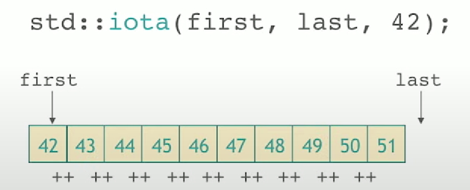

!!! abstract
    This is my note while learning the content of this course: [105 STL Algorithms in Less Than an Hour](https://www.youtube.com/watch?v=2olsGf6JIkU)

# 105 STL Algorithms in Less Than an Hour

### `for_each`

```cpp
UnaryFunc for_each( InputIt first, InputIt last, UnaryFunc f );
```

对范围 `[first, last)` 中每个迭代器的解引用结果应用给定的一元函数对象 `f`。忽略 `f` 返回的结果。

---

### `heap`

#### `make_heap`

```cpp
void make_heap( RandomIt first, RandomIt last );
void make_heap( RandomIt first, RandomIt last, Compare comp );
```

在范围 `[first, last)` 中构造堆。

!!! note "ATTENTION"
    一般示例中 `std::make_heap(v.begin(), v.end());` 的 `v.end()` 是一个迭代器，它指向向量 `v` 的最后一个元素的下一个位置。也就是说，`v.end()` 指向的是向量 `v` 的结束位置，而不是最后一个元素本身。

1) 构造关于 `operator<`(C++20 前) / `std::less{}`(C++20 起) 的堆。
2) 构造关于 `comp` 的堆。

---

#### `push_heap`

```cpp
void push_heap( RandomIt first, RandomIt last );
void push_heap( RandomIt first, RandomIt last, Compare comp );
```

将位于位置 `last - 1` 的元素插入到堆 `[first, last - 1)` 中。插入元素后的堆即是 `[first, last)`。

---

#### `pop_heap`

```cpp
void pop_heap( RandomIt first, RandomIt last );
void pop_heap( RandomIt first, RandomIt last, Compare comp );
```

交换在位置 `first` 的值和在位置 `last - 1` 的值，并使得子范围 `[first, last - 1)` 变为堆。这拥有从堆 `[first, last)` 移除首个元素的效果。

---

#### `sort_heap`

```cpp
void sort_heap( RandomIt first, RandomIt last );
void sort_heap( RandomIt first, RandomIt last, Compare comp );
```

将堆 `[first, last)` 转换为有序范围。不再维持堆的性质。

- just like 一直使用 `pop_heap` 来移除堆中的最大元素。

---

### `sort`

#### `sort`

```cpp
void sort( RandomIt first, RandomIt last );
void sort( RandomIt first, RandomIt last, Compare comp );
```

以非降序排序范围 `[first, last)` 中的元素。不保证维持相等元素的顺序。

---

#### `partial_sort`

```cpp
void partial_sort( RandomIt first, RandomIt middle, RandomIt last );
void partial_sort( RandomIt first, RandomIt middle, RandomIt last, Compare comp );
```

重排元素，使得范围 `[first, middle)` 含有范围 `[first, last)` 中已排序的 `middle - first` 个最小元素。不保证保持相等元素间的顺序。未指定范围 `[middle, last)` 中剩余元素的顺序。

---

#### `nth_element`

```cpp
ForwardIt nth_element( ForwardIt first, ForwardIt nth, ForwardIt last );
ForwardIt nth_element( ForwardIt first, ForwardIt nth, ForwardIt last, Compare comp );
```

`nth_element` 会重排 `[first, last)` 中的元素，使得在重排后：`nth` 指向的元素被更改为假如 `[first, last)` 已排序则该位置会出现的元素。

---

#### `inplace_merge`

```cpp
void inplace_merge( BidirIt first, BidirIt middle, BidirIt last );
void inplace_merge( BidirIt first, BidirIt middle, BidirIt last, Compare comp );
```

将两个相继的有序范围 `[first, middle)` 和 `[middle, last)` 归并为一个有序范围 `[first, last)`。

---

### `partition`

```cpp
ForwardIt partition( ForwardIt first, ForwardIt last, UnaryPred p );
```

重排序范围 `[first, last)` 中的元素，使得谓词 `p` 对其返回 `true` 的所有元素位于谓词 `p` 对其返回 `false` 的所有元素之前。不保持相对顺序。

**Example**:

```cpp
std::vector<int> v{0, 1, 2, 3, 4, 5, 6, 7, 8, 9};
auto it = std::partition(v.begin(), v.end(), [](int i) {return i % 2 == 0;});
```

- `it` 指向第一个 `false` 元素，即第一个奇数。

---

#### `partition_point`

```cpp
ForwardIt partition_point( ForwardIt first, ForwardIt last, UnaryPred p );
```

检验(如同用 std::partition)已划分范围 `[first, last)`，并定位第一分段的结尾，即首个不满足 `p` 的元素，或者在所有元素满足 `p` 时是 `last`。

---

#### `rotate`

```cpp
ForwardIt rotate( ForwardIt first, ForwardIt middle, ForwardIt last );
```

进行元素范围上的左旋转。具体而言，`std::rotate` 交换范围 `[first, last)` 中的元素，将 `[first, middle)` 中的元素放在 `[middle, last)` 后面并且保留这两个范围中元素的原本顺序。

---

#### `shuffle`

```cpp
void shuffle( RandomIt first, RandomIt last, URBG&& g );
```

重排序给定范围 `[first, last)` 中的元素，使得这些元素的每个排列拥有相等的出现概率。随机性来源是对象 `g`。

一个 `g` 的 **Example**:

```cpp
std::random_device rd;
std::mt19937 g(rd());
```

---

#### `next_permutation`

```cpp
bool next_permutation( BidirIt first, BidirIt last );
bool next_permutation( BidirIt first, BidirIt last, Compare comp );
```

将范围 `[first, last)` 变换为下个排列。这种排列存在时返回 `true`，否则将范围变换为首个排列(如同用 `std::sort`)并返回 `false`。

- 新排列按字典序大于旧排列时返回 `true`。抵达最后排列并重置范围为首个排列时返回 `false`。

---

#### `prev_permutation`

```cpp
bool prev_permutation( BidirIt first, BidirIt last );
bool prev_permutation( BidirIt first, BidirIt last, Compare comp );
```

与 `next_permutation` 同理，但生成的是前一个排列。

---

#### `reverse`

```cpp
void reverse( BidirIt first, BidirIt last );
```

反转 `[first, last)` 范围中的元素顺序。

---

### `stable_*`

- `stable` 也即稳定排序。在排序过程中，相等元素的相对顺序保持不变。

---

#### `stable_sort`

```cpp
void stable_sort( RandomIt first, RandomIt last );
void stable_sort( RandomIt first, RandomIt last, Compare comp );
```

以非降序排序范围 `[first, last)` 中的元素。保证保持等价元素间的顺序。

---

#### `stable_partition`

```cpp
BidirIt stable_partition( BidirIt first, BidirIt last, UnaryPred p );
```

重排序范围 `[first, last)` 中的元素，使得所有谓词 `p` 对其返回 `true` 的元素均先于谓词 `p` 对其返回 `false` 的元素。保持元素的相对顺序。

---

### `is_*`

- `is` 系列算法用于检查范围 `[first, last)` 中的元素是否满足某种条件。

---

#### `is_sorted`

```cpp
bool is_sorted( ForwardIt first, ForwardIt last );
bool is_sorted( ForwardIt first, ForwardIt last, Compare comp );
```

检查范围 `[first, last)` 中的元素是否按非降序排序。

---

#### `is_partitioned`

```cpp
bool is_partitioned( ForwardIt first, ForwardIt last, UnaryPred p );
bool is_partitioned( ForwardIt first, ForwardIt last, UnaryPred p, Compare comp );
```

检查范围 `[first, last)` 是否已按谓词 `p` 划分：所有满足 `p` 的元素都会在所有不满足的元素之前出现。

---

#### `is_heap`

```cpp
bool is_heap( RandomIt first, RandomIt last );
bool is_heap( RandomIt first, RandomIt last, Compare comp );
```

检查范围 `[first, last)` 是否为堆。

---

### `is_*_until`

- `is_*_until` 系列算法用于检查范围 `[first, last)` 中的元素是否满足某种条件，直到遇到第一个不满足条件的元素。

---

#### `is_sorted_until`

```cpp
ForwardIt is_sorted_until( ForwardIt first, ForwardIt last );
ForwardIt is_sorted_until( ForwardIt first, ForwardIt last, Compare comp );
```

检验范围 `[first, last)`，并寻找从 `first` 开始且其中元素已按非降序排序的最大范围。

返回值是从 `first` 开始且其中元素已按非降序排序的最大范围。即满足使范围 `[first, it)` 有序的最后迭代器 `it`。对于空范围和长度为一的范围返回 `last`。

---

#### `is_heap_until`

```cpp
RandomIt is_heap_until( RandomIt first, RandomIt last );
RandomIt is_heap_until( RandomIt first, RandomIt last, Compare comp );
```

检验范围 `[first, last)`，并寻找从 `first` 开始且其中元素为堆的最大范围。

返回值是使得范围 `[first, it)` 是堆的最末迭代器 it。

---

#### `count` / `count_if`

```cpp
typename std::iterator_traits<InputIt>::difference_type count( InputIt first, InputIt last, const T& value );
typename std::iterator_traits<InputIt>::difference_type count_if( InputIt first, InputIt last, UnaryPred p );
```

返回范围 `[first, last)` 中满足特定判别标准的元素数。

- 计数等于 `value` 的元素（使用 `operator==`）。
- 计数谓词 `p` 对其返回 `true` 的元素。

---

#### `accumulate`

```cpp
T accumulate( InputIt first, InputIt last, T init );
T accumulate( InputIt first, InputIt last, T init, BinaryOp op );
```

计算给定值 `init` 与范围 `[first, last)` 中各元素的和。

**Example**:

```cpp
std::vector<int> v{1, 2, 3, 4, 5, 6, 7, 8, 9, 10};
int sum = std::accumulate(v.begin(), v.end(), 0); // 和：55
int product = std::accumulate(v.begin(), v.end(), 1, std::multiplies<int>()); // 积：3628800
```

---

#### `reduce`

```cpp
typename std::iterator_traits<InputIt>::value_type reduce( InputIt first, InputIt last );
T reduce( InputIt first, InputIt last, T init );
T reduce( InputIt first, InputIt last, T init, BinaryOp op );
```

分别对应:

1. 等价于 `reduce(first, last, typename std::iterator_traits<InputIt>::value_type{})`。
2. 等价于 `reduce(first, last, init, std::plus<>())`。
3. 在 `op` 上以初值 `init` 对范围 `[first, last)` 进行规约，可能以未指定方式进行排列和聚合。给定 `binary_op` 为实际的二元运算。

返回值是: `init` 和 `[first, last)` 的元素在 `std::plus<>()` 上的广义和或 `init` 和 `[first, last)` 的元素在 `op` 上的广义和。

一组元素在二元运算 binary_op 上的广义和定义如下：

- 如果元素组只有一个元素，那么和就是该元素的值。
- 否则，依次进行以下操作：

    1. 从元素组中取走两个元素 `elem1` 和 `elem2`。
    2. 计算 `binary_op(elem1, elem2)`，并将结果放回元素组。
    3. 重复以上两步，直到组里只剩一个元素。

!!! note "ATTENTION"
    `std::reduce` 表现类似 `std::accumulate`，但范围中的元素可能以任意顺序分组并重排。并且可以并行运行。

---

#### `transform_reduce`

```cpp
T transform_reduce( InputIt1 first1, InputIt1 last1, InputIt2 first2, T init );
T transform_reduce( InputIt1 first1, InputIt1 last1, InputIt2 first2, T init, BinaryOp1 reduce, BinaryOp2 transform );
T transform_reduce( InputIt first, InputIt last, T init, BinaryOp reduce, UnaryOp transform );
```

分别对应:

1. 等价于 `transform_reduce(first1, last1, first2, init, std::plus<>(), std::multiplies<>())`，实际上是默认的 `std::inner_product` 的等效并行版本。
2. 应用 `transform` 到来自范围 `[first1, last1)` 和从 `first2` 开始的包含 `std::distance(first1, last1)` 个元素的范围的每对元素，并在 `reduce` 上与初始值 `init` 一同规约各结果（可以以未指定行为重排聚合）。
3. 应用 `transform` 到范围 `[first, last)` 中的每个元素，并在 `reduce` 上与初始值 `init` 一同规约各结果（可以以未指定行为重排聚合）。

返回值:

1.  `init` 和 `values` 在 `std::plus<>()` 上的广义和，其中 `values` 是通过 `std::multiplies<>()` 变换得到的一组值，每个值从两个输入范围中的一对元素变换而来。
2.  `init` 和 `values` 在 `reduce` 上的广义和，其中 `values` 是通过 `transform` 变换得到的一组值，每个值从两个输入范围中的一对元素变换而来。
3.  `init` 和 `values` 在 `reduce` 上的广义和，其中 `values` 是通过 `transform` 变换得到的一组值，每个值从输入范围中的一个元素变换而来。

!!! note "ATTENTION"
    - 不会对 `init` 应用 `transform`。
    
    - 如果 `first == last` 或 `first1 == last1`，那么返回未经修改的 `init`。

---

#### `partial_sum`

```cpp
OutputIt partial_sum( InputIt first, InputIt last, OutputIt d_first );
OutputIt partial_sum( InputIt first, InputIt last, OutputIt d_first, BinaryOp op );
```

以 1 为例:

- 如果 `[first, last)` 为空，那么什么也不做。
- 否则按顺序进行以下操作：
    
    1. 创建累加器 `acc`，它的类型是 `InputIt` 的值类型，以 `*first` 初始化。
    2. 将 `acc` 赋给 `*d_first`。
    3. 对于 `[1, std::distance(first, last))` 中的所有整数 `i`，按顺序进行以下操作：
        
        (a) 计算 `acc + *iter`(C++20 前) / `std::move(acc) + *iter`(C++20 起)，其中 `iter` 是 `first` 的下 `i` 个迭代器。
        (b) 将计算结果赋给 `acc`。
        (c) 将 `acc[1]` 赋给 `*dest`，其中 `dest` 是 `d_first` 的下 `i` 个迭代器。

**Example**:

```cpp
#include <functional>
#include <iostream>
#include <iterator>
#include <numeric>
#include <vector>
 
int main()
{
    std::vector<int> v(10, 2); // v = {2, 2, 2, 2, 2, 2, 2, 2, 2, 2}
 
    std::cout << "前 " << v.size() << " 个偶数是：";
    // 将结果写入流 cout
    std::partial_sum(v.cbegin(), v.cend(), 
                     std::ostream_iterator<int>(std::cout, " "));
    std::cout << '\n';
 
    // 将结果写回 vector v
    std::partial_sum(v.cbegin(), v.cend(),
                     v.begin(), std::multiplies<int>());
 
    std::cout << "2 的前 " << v.size() << " 个幂是：";
    for (int n : v)
        std::cout << n << ' ';
    std::cout << '\n';
}
```

输出:

```cpp
前 10 个偶数是：2 4 6 8 10 12 14 16 18 20 
2 的前 10 个幂是：2 4 8 16 32 64 128 256 512 1024
```

---

#### `inclusive_scan`

The same thing as `partial_sum`, except that it can run in parallel.

---

#### `exclusive_scan`

The same thing as `inclusive_scan`, except that the first element is not included in the sum.

---

#### `inner_product`

```cpp
T inner_product( InputIt1 first1, InputIt1 last1, InputIt2 first2, T init );
T inner_product( InputIt1 first1, InputIt1 last1, InputIt2 first2, T init, BinaryOp1 op1, BinaryOp2 op2 );
```

在范围 `[first1, last1)` 和从 `first2` 开始的包含 `std::distance(first1, last1)` 个元素的范围上计算内积（即积之和）或进行有序映射/规约操作。

```cpp
std::vector<int> a{0, 1, 2, 3, 4};
std::vector<int> b{5, 4, 2, 3, 1};

int r1 = std::inner_product(a.begin(), a.end(), b.begin(), 0);
std::cout << "a 和 b 的内积：" << r1 << '\n';
```

- 相乘后相加

---

#### `adjacent_difference`

```cpp
OutputIt adjacent_difference( InputIt first, InputIt last, OutputIt d_first );
OutputIt adjacent_difference( InputIt first, InputIt last, OutputIt d_first, BinaryOp op );
```

计算范围 `[first, last)` 中元素之间的差值，并将结果存储在从 `d_first` 开始的范围中。

**Example**: `std::adjacent_difference(v.begin(), v.end(), v.begin());`

---

#### `sample`

```cpp
SampleIterator sample( PopulationIt first, PopulationIt last, SampleIt out, Distance n, URBG&& g );
```

从序列 `[first, last)`（不重复地）选择 `n` 个元素，使得每个样本拥有相等的出现概率，并将这些被选择的元素写入到输出迭代器 `out`。用随机数生成器 `g` 生成随机数。

**Example**: 

```cpp
#include <algorithm>
#include <iostream>
#include <iterator>
#include <random>
#include <string>
 
int main()
{
    std::string in {"ABCDEFGHIJK"}, out;
    std::sample(in.begin(), in.end(), std::back_inserter(out), 4,
                std::mt19937 {std::random_device{}()});
    std::cout << "从 " << in << " 中随机选取四个字母：" << out << '\n';
}
```


---

#### `*_of`

```cpp
bool all_of( InputIt first, InputIt last, UnaryPred p );
bool any_of( InputIt first, InputIt last, UnaryPred p );
bool none_of( InputIt first, InputIt last, UnaryPred p );
```

1. 检查一元谓词 p 是否对范围 `[first, last)` 中至少一个元素返回 false。
2. 检查一元谓词 p 是否对范围 `[first, last)` 中至少一个元素返回 true。
3. 检查一元谓词 p 是否不对范围 `[first, last)` 中任何元素返回 true。


---

#### `equal`

```cpp
bool equal( InputIt1 first1, InputIt1 last1, InputIt2 first2 );
bool equal( InputIt1 first1, InputIt1 last1, InputIt2 first2, BinaryPred p );
bool equal( InputIt1 first1, InputIt1 last1, InputIt2 first2, InputIt2 last2 );
bool equal( InputIt1 first1, InputIt1 last1, InputIt2 first2, InputIt2 last2, BinaryPred p );
```

检查 `[first1, last1)` 与从 first2 开始的另一个范围是否相等。

---

#### `is_permutation`

```cpp
bool is_permutation( ForwardIt1 first1, ForwardIt1 last1, ForwardIt2 first2 );
bool is_permutation( ForwardIt1 first1, ForwardIt1 last1, ForwardIt2 first2, BinaryPredicate p );
bool is_permutation( ForwardIt1 first1, ForwardIt1 last1, ForwardIt2 first2, ForwardIt2 last2 );
bool is_permutation( ForwardIt1 first1, ForwardIt1 last1, ForwardIt2 first2, ForwardIt2 last2, BinaryPredicate p );
```

检查 `[first1, last1)` 是否为 first2 开始的另一个范围的排列。

```cpp
static constexpr auto v1 = {1, 2, 3, 4, 5};
static constexpr auto v2 = {3, 5, 4, 1, 2};
static constexpr auto v3 = {3, 5, 4, 1, 1};

std::cout << v2 << " 是 " << v1 << " 的排列：" << std::boolalpha
            << std::is_permutation(v1.begin(), v1.end(), v2.begin()) << '\n'
            << v3 << " 是 " << v1 << " 的排列：" << std::boolalpha
            << std::is_permutation(v1.begin(), v1.end(), v3.begin()) << '\n';
```

输出:

```cpp
{ 3 5 4 1 2 } 是 { 1 2 3 4 5 } 的排列：true
{ 3 5 4 1 1 } 是 { 1 2 3 4 5 } 的排列：false
```

---

#### `lexicographical_compare`

```cpp
bool lexicographical_compare( InputIt1 first1, InputIt1 last1, InputIt2 first2, InputIt2 last2 );
bool lexicographical_compare( InputIt1 first1, InputIt1 last1, InputIt2 first2, InputIt2 last2, Compare comp );
```

检查第一个范围 `[first1, last1)` 是否按字典序小于第二个范围 `[first2, last2)`。第一范围按字典序小于第二个时返回 `true`，否则返回 `false`。

---

#### `mismatch`

```cpp
std::pair<InputIt1, InputIt2> mismatch( InputIt1 first1, InputIt1 last1, InputIt2 first2 );
std::pair<InputIt1, InputIt2> mismatch( InputIt1 first1, InputIt1 last1, InputIt2 first2, BinaryPred p );
std::pair<InputIt1, InputIt2> mismatch( InputIt1 first1, InputIt1 last1, InputIt2 first2, InputIt2 last2 );
std::pair<InputIt1, InputIt2> mismatch( InputIt1 first1, InputIt1 last1, InputIt2 first2, InputIt2 last2, BinaryPred p );
```

返回一对到两个范围中的首个不匹配元素的迭代器：一个范围是 `[first1, last1)`，而另一个范围从 `first2` 开始。

返回值是拥有指向首对两个不相等元素的迭代器的 `std::pair`。如果抵达了 `last1`，那么返回的迭代器对中的第二个迭代器是 `first2` 后的第 `std::distance(first1, last1)` 个迭代器。

---

#### `find` / `find_if` / `find_if_not`

```cpp
InputIt find( InputIt first, InputIt last, const T& value );
InputIt find_if( InputIt first, InputIt last, UnaryPred p );
InputIt find_if_not( InputIt first, InputIt last, UnaryPred q );
```

返回指向范围 `[first, last)` 中满足特定判别标准的首个元素的迭代器（没有这种元素时返回 last）。

1. `find` 搜索等于（用 `operator==` 比较）`value` 的元素。
2. `find_if` 搜索谓词 `p` 对其返回 `true` 的元素。
3. `find_if_not` 搜索谓词 `q` 对其返回 `false` 的元素。

---

#### `adjacent_find`

```cpp
ForwardIt adjacent_find( ForwardIt first, ForwardIt last );
ForwardIt adjacent_find( ForwardIt first, ForwardIt last, BinaryPred p );
```

在范围 `[first, last)` 中搜索两个连续的相等元素。

---

#### `equal_range`

```cpp
std::pair<ForwardIt, ForwardIt> equal_range( ForwardIt first, ForwardIt last, const T& value );
std::pair<ForwardIt, ForwardIt> equal_range( ForwardIt first, ForwardIt last, const T& value, Compare comp );
```

返回范围 `[first, last)` 中包含所有等价于 `value` 的元素的范围。

---

#### `lower_bound`

```cpp
ForwardIt lower_bound( ForwardIt first, ForwardIt last, const T& value );
ForwardIt lower_bound( ForwardIt first, ForwardIt last, const T& value, Compare comp );
```

在已划分的范围 `[first, last)` 中查找**第一个**不先序于 value 的元素。

!!! note "ATTENTION"
    尽管 `std::lower_bound` 只要求 `[first, last)` 已划分，但是该算法通常会在 `[first, last)` 已排序的情况下使用，此时二分查找对于任意 `value` 都有效。

---

#### `upper_bound`

```cpp
ForwardIt upper_bound( ForwardIt first, ForwardIt last, const T& value );
ForwardIt upper_bound( ForwardIt first, ForwardIt last, const T& value, Compare comp );
```

在已划分的范围 `[first, last)` 中查找第一个后序于 `value` 的元素。

---

#### `binary_search`

```cpp
bool binary_search( ForwardIt first, ForwardIt last, const T& value );
bool binary_search( ForwardIt first, ForwardIt last, const T& value, Compare comp );
```

检查在已划分范围 `[first, last)` 中是否出现与 `value` 等价的元素。

---

#### `search`

```cpp
ForwardIt1 search( ForwardIt1 first, ForwardIt1 last, ForwardIt2 s_first, ForwardIt2 s_last );
ForwardIt1 search( ForwardIt1 first, ForwardIt1 last, ForwardIt2 s_first, ForwardIt2 s_last, BinaryPred p );
```

搜索范围 `[first, last)` 中首次出现元素序列 `[s_first, s_last)` 的位置。

---

#### `find_end`

```cpp
ForwardIt1 find_end( ForwardIt1 first, ForwardIt1 last, ForwardIt2 s_first, ForwardIt2 s_last );
ForwardIt1 find_end( ForwardIt1 first, ForwardIt1 last, ForwardIt2 s_first, ForwardIt2 s_last, BinaryPred p );
```

在范围 `[first, last)` 中搜索序列 `[s_first, s_last)` 最后一次出现的位置。

---

#### `find_first_of`

```cpp
InputIt find_first_of( InputIt first, InputIt last, ForwardIt s_first, ForwardIt s_last );
InputIt find_first_of( InputIt first, InputIt last, ForwardIt s_first, ForwardIt s_last, BinaryPred p );
```

在范围 `[first, last)` 中搜索范围 `[s_first, s_last)` 中的任何元素。

返回值是指向范围 `[first, last)` 中等于范围 `[s_first, s_last)` 中某个元素的首个元素。如果 `[s_first, s_last)` 为空或找不到这种元素，那么就会返回 `last`。

---

#### `max_element`

```cpp
ForwardIt max_element( ForwardIt first, ForwardIt last );
ForwardIt max_element( ForwardIt first, ForwardIt last, Compare comp );
```

寻找范围 `[first, last)` 中的最大元素。指向范围 `[first, last)` 中最大元素的迭代器。如果范围中有多个元素等价于最大元素，那么返回指向首个这种元素的迭代器。范围为空时返回 `last`。

---

#### `min_element`

```cpp
ForwardIt min_element( ForwardIt first, ForwardIt last );
ForwardIt min_element( ForwardIt first, ForwardIt last, Compare comp );
```

寻找范围 `[first, last)` 中的最小元素。指向范围 `[first, last)` 中最小元素的迭代器。如果范围中有多个元素等价于最小元素，那么返回指向首个这种元素的迭代器。范围为空时返回 `last`。

---

#### `minmax_element`

```cpp
std::pair<ForwardIt, ForwardIt> minmax_element( ForwardIt first, ForwardIt last );
std::pair<ForwardIt, ForwardIt> minmax_element( ForwardIt first, ForwardIt last, Compare comp );
```

寻找范围 `[first, last)` 中最小和最大的元素。

返回值以指向最小元素的迭代器为第一元素，以指向最大元素的迭代器为第二元素的 `pair`。范围为空时返回 `std::make_pair(first, first)`。如果多个元素等价于最小元素，那么返回指向首个这种元素的迭代器。如果多个元素等价于最大元素，那么返回指向最后一个这种元素的迭代器。

---

### `set`

#### `set_difference`

```cpp
OutputIt set_difference( InputIt1 first1, InputIt1 last1, InputIt2 first2, InputIt2 last2, OutputIt d_first );
OutputIt set_difference( InputIt1 first1, InputIt1 last1, InputIt2 first2, InputIt2 last2, OutputIt d_first, Compare comp );
```

复制来自有序范围 `[first1, last1)` 并且在有序范围 `[first2, last2)` 中未能找到的元素到始于 `d_first` 的范围。输出范围也保持有序。

---

#### `set_intersection`

```cpp
OutputIt set_intersection( InputIt1 first1, InputIt1 last1, InputIt2 first2, InputIt2 last2, OutputIt d_first );
OutputIt set_intersection( InputIt1 first1, InputIt1 last1, InputIt2 first2, InputIt2 last2, OutputIt d_first, Compare comp );
```

构造始于 `d_first`，由在两个有序范围 `[first1, last1)` 与 `[first2, last2)` 中都找到的元素构成的有序范围。

---

#### `set_union`

```cpp
OutputIt set_union( InputIt1 first1, InputIt1 last1, InputIt2 first2, InputIt2 last2, OutputIt d_first );
OutputIt set_union( InputIt1 first1, InputIt1 last1, InputIt2 first2, InputIt2 last2, OutputIt d_first, Compare comp );
```

构造从 `d_first` 开始的有序并集，由存在于有序范围 `[first1, last1)` 和 `[first2, last2)` 之一或二者中的所有元素构成。

---

#### `set_symmetric_difference`

```cpp
OutputIt set_symmetric_difference( InputIt1 first1, InputIt1 last1, InputIt2 first2, InputIt2 last2, OutputIt d_first );
OutputIt set_symmetric_difference( InputIt1 first1, InputIt1 last1, InputIt2 first2, InputIt2 last2, OutputIt d_first, Compare comp );
```

计算两个有序范围的对称差：将处于任一范围中，但未在两个范围中均被找到的元素，复制到始于 `d_first` 的范围。输出范围也保持有序。

---

#### `includes`

```cpp
bool includes( InputIt1 first1, InputIt1 last1, InputIt2 first2, InputIt2 last2 );
bool includes( InputIt1 first1, InputIt1 last1, InputIt2 first2, InputIt2 last2, Compare comp );
```

在有序范围 `[first2, last2)` 是有序范围 `[first1, last1)` 的子序列的情况下返回 `true`(不必是连续的子序列)。

---

#### `merge`

```cpp
OutputIt merge( InputIt1 first1, InputIt1 last1, InputIt2 first2, InputIt2 last2, OutputIt d_first );
OutputIt merge( InputIt1 first1, InputIt1 last1, InputIt2 first2, InputIt2 last2, OutputIt d_first, Compare comp );
```

将两个有序范围 `[first1, last1)` 和 `[first2, last2)` 合并到始于 `d_first` 的一个有序范围中。


---

#### `copy`

```cpp
OutputIt copy( InputIt first, InputIt last, OutputIt d_first );
OutputIt copy_if( InputIt first, InputIt last, OutputIt d_first, UnaryPred pred );
```

复制范围 `[first, last)` 中的元素到从 `d_first` 开始的另一范围（复制目标范围）。而对于 2 则是仅复制谓词 `pred` 对其返回 `true` 的元素。此复制算法是稳定的：保持被复制元素的相对顺序。

---

#### `move`

```cpp
OutputIt move( InputIt first, InputIt last, OutputIt d_first );
```

移动范围 `[first, last)` 中的元素到从 `d_first` 开始的另一范围，从 `first` 开始逐次到 `last`。

---

#### `swap_ranges`

```cpp
ForwardIt2 swap_ranges( ForwardIt1 first1, ForwardIt1 last1, ForwardIt2 first2 );
```

在范围 `[first1, last1)` 和从 `first2` 开始的包含 `std::distance(first1, last1)` 个元素的另一范围间交换元素。

---

#### `copy_backward`

```cpp
BidirIt2 copy_backward( BidirIt1 first, BidirIt1 last, BidirIt2 d_last );
```

将范围 `[first, last)` 内的元素复制到终于 `d_last` 的范围。以逆序复制元素（首先复制末元素），但保持相对顺序。


!!! note "ATTENTION"
    如果使用 `copy` 则会出现 4 不见了的情况。

---

#### `move_backward`

```cpp
BidirIt2 move_backward( BidirIt1 first, BidirIt1 last, BidirIt2 d_last );
```

移动来自范围 `[first, last)` 的元素到在 `d_last` 结束的另一范围。以逆序移动元素（首先复制末元素），但保持它们的相对顺序。

---

#### `fill`

```cpp
void fill( ForwardIt first, ForwardIt last, const T& value );
```

将给定的 `value` 赋给 `[first, last)` 中的所有元素。

---

#### `generate`

```cpp
void generate( ForwardIt first, ForwardIt last, Generator g );
```

以给定函数对象 `g` 所生成的值对范围 `[first, last)` 中的每个元素赋值。

---

#### `iota`

```cpp
void iota( ForwardIt first, ForwardIt last, T value );
```

以始于 `value` 并重复地求值 `++value` 的顺序递增值填充范围 `[first, last)`。



---

#### `replace` / `replace_if`

```cpp
void replace( ForwardIt first, ForwardIt last, const T& old_value, const T& new_value );
void replace_if( ForwardIt first, ForwardIt last, UnaryPred p, const T& new_value );
```

以 `new_value` 替换范围 `[first, last)` 中所有满足特定判别标准的元素。

---

#### `remove` / `remove_if`

```cpp
ForwardIt remove( ForwardIt first, ForwardIt last, const T& value );
ForwardIt remove_if( ForwardIt first, ForwardIt last, UnaryPred p );
```

从范围 `[first, last)` 移除所有满足特定判别标准的元素，并返回范围新结尾的尾后迭代器。

移除元素是通过将范围内的元素移动位置，使得不需要被移除的元素会在范围的开头出现的方式实现的。移除操作是稳定的：不需要被移除的元素的相对顺序保持不变。

---

#### `unique`

```cpp
ForwardIt unique( ForwardIt first, ForwardIt last );
ForwardIt unique( ForwardIt first, ForwardIt last, BinaryPred p );
```

从范围 `[first, last)` 移除**相继**等价元素组中首元素以外的所有元素，并返回范围新结尾的尾后迭代器。

移除元素是通过将范围内的元素移动位置，使得不需要被移除的元素会在范围的开头出现的方式实现的。移除操作是稳定的：不需要被移除的元素的相对顺序保持不变。

---

### `*_copy`

Do the same thing but in a new collection.

#### `remove_copy` / `remove_copy_if`

```cpp
OutputIt remove_copy( InputIt first, InputIt last, OutputIt d_first, const T& value );
OutputIt remove_copy_if( InputIt first, InputIt last, OutputIt d_first, UnaryPred p );
```

复制来自范围 `[first, last)` 的元素到从 `d_first` 开始的另一范围，忽略所有等于（用 `operator==` 比较）`value` 的元素，或略所有谓词 `p` 对其返回 `true` 的元素。

---

#### `unique_copy`

```cpp
OutputIt unique_copy( InputIt first, InputIt last, OutputIt d_first );
OutputIt unique_copy( InputIt first, InputIt last, OutputIt d_first, BinaryPred p );
```

从范围 `[first, last)` 复制元素到从 `d_first` 开始的另一范围，使得目标范围不存在连续的相等元素。只复制每组相等元素的首元素。

---

#### `reverse_copy`

```cpp
OutputIt reverse_copy( BidirIt first, BidirIt last, OutputIt d_first );
```

给定 `N` 为 `std::distance(first, last)`。将范围 `[first, last)`（源范围）中的元素复制到从 `d_first` 开始的包含 `N` 个元素的新范围（目标范围），使得目标范围中元素以逆序排列。

---

#### `rotate_copy`

```cpp
OutputIt rotate_copy( ForwardIt first, ForwardIt middle, ForwardIt last, OutputIt d_first );
```

从范围 `[first, last)` 复制元素到始于 `d_first`，使得目标范围中，`[first, middle)` 的元素在 `[middle, last)` 后面并且保留这两个范围中元素的原本顺序。

---

#### `replace_copy` / `replace_copy_if`

```cpp
OutputIt replace_copy( InputIt first, InputIt last, OutputIt d_first, const T& old_value, const T& new_value );
OutputIt replace_copy_if ( InputIt first, InputIt last, OutputIt d_first, UnaryPred p, const T& new_value );
```

复制来自范围 `[first, last)` 的元素到始于 `d_first` 的范围，复制过程中以 `new_value` 替换所有满足特定判别标准的元素。替换所有等于（用 `operator==` 比较）`old_value` 的元素或所有谓词 `p` 对其满足 `true` 的元素。

---

#### `partition_copy`

```cpp
std::pair<OutputIt1, OutputIt2> partition_copy( InputIt first, InputIt last, OutputIt1 d_first_true, OutputIt2 d_first_false, UnaryPred p );
```

根据谓词 `p` 的返回值，将范围 `[first, last)` 中的元素复制到两个不同范围。

- 满足谓词 `p` 的元素会被复制到从 `d_first_true` 开始的范围。
- 剩余元素会被复制到从 `d_first_false` 开始的范围。

---

#### `partial_sort_copy`

```cpp
RandomIt partial_sort_copy( InputIt first, InputIt last, RandomIt d_first, RandomIt d_last );
RandomIt partial_sort_copy( InputIt first, InputIt last, RandomIt d_first, RandomIt d_last, Compare comp );
```

以升序排序范围 `[first, last)` 中的某些元素，存储结果于范围 `[d_first, d_last)`。

至多将 `d_last - d_first` 个元素有序放置到范围 `[d_first, d_first + n)` 中。其中 `n` 是要排序的元素数（`std::min(std::distance(first, last), d_last - d_first)`）。不保证保持相等元素的顺序。

---

#### `transform`

```cpp
OutputIt transform( InputIt first1, InputIt last1, OutputIt d_first, UnaryOp unary_op );
OutputIt transform( InputIt1 first1, InputIt1 last1, InputIt2 first2, OutputIt d_first, BinaryOp binary_op );
```

`std::transform` 应用给定的函数到某个/些输入范围中的元素，并将结果存储到从 `d_first` 开始的输出范围。

---

### `uninitialized`

如果你有一块内存，但是并没有初始化，然后你想用值来填充它，但是并不能使用 `std::fill` 之类的(因为此时不能使用赋值运算符)。

---

#### `uninitialized_fill`

```cpp
void uninitialized_fill( NoThrowForwardIt first, NoThrowForwardIt last, const T& value );
```

将 `value` 复制到未初始化内存区域 `[first, last)`。

---

#### `uninitialized_copy`

```cpp
NoThrowForwardIt uninitialized_copy( InputIt first, InputIt last, NoThrowForwardIt d_first );
```

将范围 `[first, last)` 中的元素复制到从 d_first 开始的未初始化内存。

---

#### `uninitialized_move`

```cpp
NoThrowForwardIt uninitialized_move( InputIt first, InputIt last, NoThrowForwardIt d_first );
```

将范围 `[first, last)` 中的元素复制到从 d_first 开始的未初始化内存区域。

---

#### `destroy`

```cpp
void destroy( ForwardIt first, ForwardIt last );
```

销毁范围 `[first, last)` 中的对象。

---

#### `uninitialized_default_construct`

```cpp
void uninitialized_default_construct( NoThrowForwardIt first, NoThrowForwardIt last );
```

在未初始化内存区域 `[first, last)` 上通过默认初始化。

---

#### `uninitialized_value_construct`

```cpp
void uninitialized_value_construct( NoThrowForwardIt first, NoThrowForwardIt last );
```

在未初始化内存区域 `[first, last)` 上通过值初始化构造。

---

### `*_n`

这些不需要开始和结束，只需要开始和数量。

这里就列出了，不一一介绍了。

`fill_n` / `copy_n` / `generate_n` / `search_n` / `for_each_n` / `unininitialized_copy_n` / `uninitialized_move_n` / `uninitialized_fill_n` / `uninitialized_value_construct_n` / `uninitialized_default_construct_n` / `destroy_n`

---