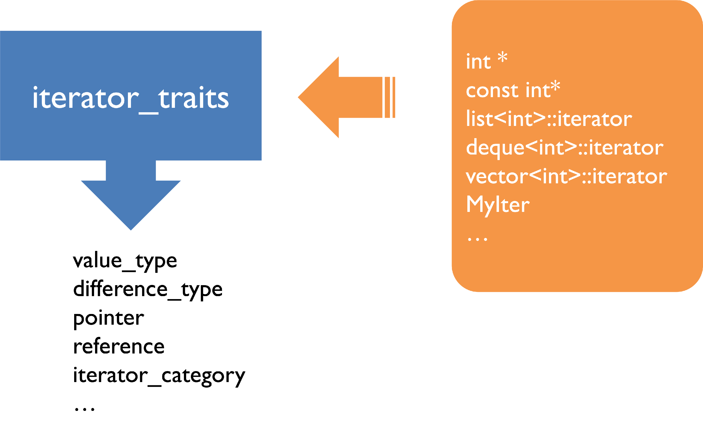
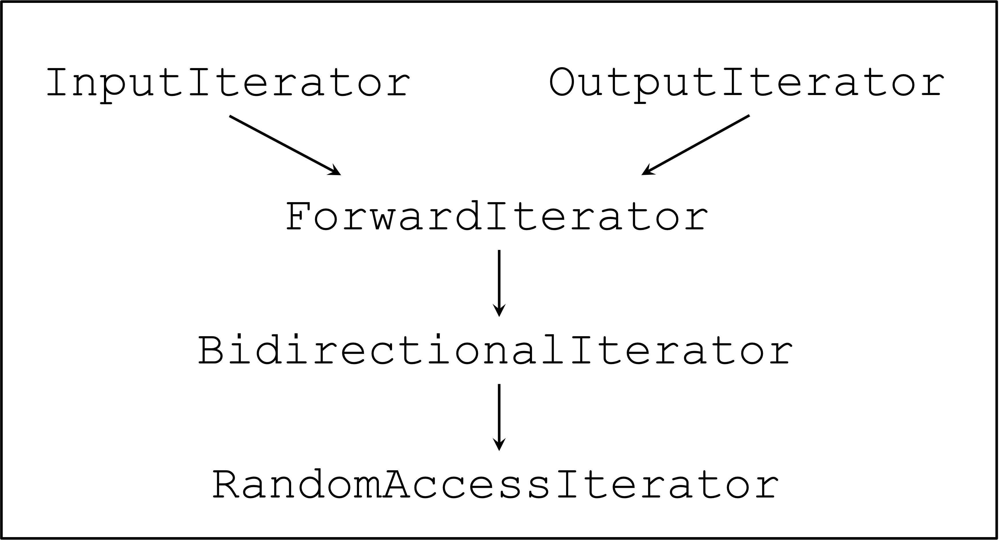

# Chapter 12 | Iterators

## Why need iterators?

1. Provide a way to visit the elements in order, without knowing the details of the container.

- Generalization of pointers

本质上是指针概念的推广，使得我们能够遍历容器中的元素，而不需要知道容器的具体实现细节。

2. Separate container and algorithms with standarditerator interface functions.

- The glue between algorithms and data structures
- Without iterators, with N algorithms and M data structures, you have to manage N * M implementations (combinatorial explosion)

算法的实现和容器的实现解耦。

3. One of design patterns (Gang of Four):

- Provide a way to access the elements of an aggregate object sequentially without exposing its underlying representation.
- Supported in C++, java, Python, Rust, etc.

---

## Usage

```cpp
template <class InputIterator, class >
InputIterator find(InputIterator first, InputIterator last, const T &value){
    while(first!=last && *first!=value){ // [first, last)
        ++first;
    }
    return first;
}

vector<int> vecTemp;
list<double> listTemp;
if(find(vecTemp.begin(),vecTemp.end(),3)== vecTemp.end()){
    cout <<"3 not found in vecTemp" << endl;
}
if(find(listTemp,begin(),listTemp.end(),4)== listTemp.end()){
    cout <<"4 not found in listTemp" << endl;
}
```

- 对于 `find` 来说，不需要关注容器内部的数据结构，只需要知道如何遍历容器中的元素即可。

```cpp
#include <algorithm>
#include <iostream>

#include <list>
#include <vector>
#include <set>
using namespace std;

int main(){
    const int Size = 5;
    int arr[Size] = {1, 2, 3, 4, 5};

    list<int> l(arr, arr + Size);
    set<int> s(arr, arr + Size);
    vector<int> v(arr, arr + Size);

    auto itl = find(l.begin(), l.end(), 3);
    auto its = find(s.begin(), s.end(), 3);
    auto itv = find(v.begin(), v.end(), 3);

    cout << *itl << endl;  // 3
    cout << *its << endl;  // 3
    cout << *itv << endl;  // 3

    auto ita = find(arr, arr + Size, 3);
    cout << *ita << endl;  // 3

    return 0;
}
```

- `list<int>::iterator itl = find(l.begin(), l.end(), 3);` 前面的名字很长，可以用auto简化。
- 不能轻易解引用迭代器，如果不知道里面是否存在这个数，对 `end` 解引用是未定义行为。
- 迭代器是指针的推广，所以原生的指针天然就是迭代器。
- `int * ita = find(arr, arr + Size, 3);` 也可以。
- 对于这个迭代器 也可以 `auto ita = find(begin(arr), end(arr), 3);` 使用。

---

- 迭代器之间的能力也有差别。

```cpp
#include <algorithm>
#include <iostream>

#include <list>
#include <vector>
#include <set>
using namespace std;

int main(){
    const int Size = 5;
    int arr[Size] = {1, 2, 3, 4, 5};

    list<int> l(arr, arr + Size);
    set<int> s(arr, arr + Size);
    vector<int> v(arr, arr + Size);

    auto itl = find(l.begin(), l.end(), 3);
    itl++;
    //itl += 2;  // Error

    auto its = find(s.begin(), s.end(), 3); 
    its++; 

    auto itv = find(v.begin(), v.end(), 3);
    itv += 2;

    cout << *itl << endl;  // 4
    cout << *its << endl;  // 4
    cout << *itv << endl;  // 5


    auto ita = find(arr, arr + Size, 3);
    cout << *ita << endl;  // 3

    return 0;
}
```

- `list<int>` 迭代器底层数据结构 `std::list` 是双向链表。链表节点在内存中非连续存储，无法直接跳跃访问。所以无法 `+= 2`。是双向迭代器（Bidirectional Iterator）。
- `set<int>` 迭代器底层数据结构 `std::set` 是平衡二叉搜索树(红黑树)。`set` 的迭代器支持 `++`，但 不支持 `+= 2`。是双向迭代器（Bidirectional Iterator）。
- `vector<int>` 迭代器底层数据结构 `std::vector` 是动态数组。数组元素在内存中连续存储，可通过指针算术直接计算偏移。所以支持 `++`、`--`、`+=`、`+`、`-`、`[]` 等任意跳跃访问。是随机访问迭代器（Random Access Iterator）。
- 查找效率没有更快的就是 $O(n)$，但是对于 `set` 来说，由于底层是红黑树，有更快的查找方法，查找是中序遍历，由 `member function` 实现，效率是 $O(\log n)$。

---

```cpp
#include <algorithm>
#include <iostream>

#include <list>
#include <vector>
#include <set>
using namespace std;

int main(){
    const int Size = 5;
    int arr[Size] = {5, 4, 3, 2, 1};

    list<int> l(arr, arr + Size);
    set<int> s(arr, arr + Size);
    vector<int> v(arr, arr + Size);

    auto itl = find(l.begin(), l.end(), 3);
    itl++;

    auto its = find(s.begin(), s.end(), 3); 
    its++; 

    auto itv = find(v.begin(), v.end(), 3);
    itv += 2;

    cout << *itl << endl;  // 2
    cout << *its << endl;  // 4
    cout << *itv << endl;  // 1


    auto ita = find(arr, arr + Size, 3);
    cout << *ita << endl;  // 3

    return 0;
}
```

- 由于倒过来了，对于 `list` 来说 3 的后面是 2。对于 `set` 来说，这里是中序遍历，所以值存进去了之后是树的形式，迭代器在进行中序遍历，所以 3 的后面是 4，也就是在 `set` 中的访问顺序是 `1, 2, 3, 4, 5`。

---

## Requirements

- A unified interface used in algorithms
- Work like a pointer to the elements in a container

    - Have `++` operator to visit elements in order 
    - Have `*` operator to access the content of an element

---

## operator overloading

- 迭代器最核心的要做的就是运算符重载。

An example of overloading operators `*` and `->`

```cpp
template<class T>
class auto_ptr {
private:
    T *pointee;
public:
    /* ... */
    T& operator *() { return *pointee; }
    T* operator ->() { return pointee; }
};
```
- 以 `list` 为例

```cpp
template<class T>
class List {
public:
    void insert_front();
    void insert_end();
    /* ... */
private:
    ListItem<T> *front;
    ListItem<T> *end;
    long _size;
};

template<class T>
class ListItem {
public:
    T& val() {
        return _value;
    }
    ListItem* next() {
        return _next;
    }
    /* ... */
private:
    T _value;
    ListItem *_next;
};
```

---

- 实现一下一个有 `dummy head` 的版本。

```cpp
#include <algorithm>
#include <iostream>

using namespace std;

template <class T>
struct ListItem {
    T value;
    ListItem * next;
};

template <class T>
class List {
public:
    List(){
        head = new ListItem<T>;
        head->next = nullptr;
    }
    ~List(){
        ListItem<T> * p = head;
        while(p != nullptr){
            ListItem<T> * q = p->next;
            delete p;
            p = q;
        }
    }
    void push_front(T value){
        ListItem<T> * p = new ListItem<T>;
        p->value = value;
        p->next = head->next;
        head->next = p;
    }
    ListItem<T> * get_head(){
        return head;
    }
    bool empty(){
        return head->next == nullptr;
    }
private:
    ListItem<T> * head;
};

int main(){
    List<int> l;
    l.push_front(1);
    l.push_front(2);
    l.push_front(3);
    ListItem<int> * p = l.get_head()->next;
    while(p != nullptr){
        cout << p->value << endl;
        p = p->next;
    }
    return 0;    
}
```

- 在模板类（如 `ListItem<T>`）的内部定义成员时，编译器会自动将类名（如 `ListItem`）视为当前模板参数实例化的类型。因此，在模板类内部不需要显式指定模板参数,直接使用 `ListItem` 等同于 `ListItem<T>`。在类作用域内，所有未加模板参数的类名会被解析为当前实例化的类型。
- 这是比较传统的遍历方式，如果要和 `STL` 中的算法结合，就需要使用迭代器。

---

- 接下来封装一层迭代器。

```cpp
#include <algorithm>
#include <iostream>

using namespace std;

template <class T>
struct ListItem {
    T value;
    ListItem * next;
};

template <class T>
class ListIter{
public:
    ListIter(ListItem<T> * p = nullptr) : ptr(p){}
    ListIter<T>& operator++(){
        ptr = ptr->next;
        return *this;
    }
    bool operator==(const ListIter<T> & i) const {
        return ptr == i.ptr;
    }
    bool operator!=(const ListIter<T> & i) const {
        return !(*this == i);
    }
    T& operator*(){
        return ptr->value;
    }
    T* operator->(){
        return &(*this);
    }
private:
    ListItem<T> * ptr;
};

template <class T>
class List {
public:
    List(){
        head = new ListItem<T>;
        head->next = nullptr;
    }
    ~List(){
        ListItem<T> * p = head;
        while(p != nullptr){
            ListItem<T> * q = p->next;
            delete p;
            p = q;
        }
    }
    ListIter<T> begin(){
        return ListIter<T>(head->next);
    }
    ListIter<T> end(){
        return ListIter<T>(nullptr);
    }
    void push_front(T value){
        ListItem<T> * p = new ListItem<T>;
        p->value = value;
        p->next = head->next;
        head->next = p;
    }
    ListItem<T> * get_head(){
        return head;
    }
    bool empty(){
        return head->next == nullptr;
    }
private:
    ListItem<T> * head;
};

int main(){
    List<int> l;
    l.push_front(1);
    l.push_front(2);
    l.push_front(3);
    ListItem<int> * p = l.get_head()->next;
    while(p != nullptr){
        cout << p->value << endl;
        p = p->next;
    }

    for(ListIter<int> iter = l.begin(); iter != l.end(); ++iter){ 
        cout << *iter << endl;
    }

    for(int a : l){
        cout << a << endl;
    }

    return 0;
}
```

- 不需要写析构函数，因为我只知道我现在存的状态是一个指针，并不管理这一块内存，所以不需要写析构函数。
- `++` 操作的返回值是本类型的引用。
- 这里只写了前缀的 `++` 操作符，因为返回值是已经修改后的内容。而[(📝后缀 `++` 操作符的撰写)](https://melody12020831.github.io/Notebook/Computer_Science/OOP/Chapter10/#Implementing `++` and `--`)
- 对于 `T* operator->() { return &(*this); }` 来说。`operator->` 的作用是允许通过迭代器直接访问对象的成员，语法形式为 `iter->member`。`this` 是指向当前 `ListIter` 对象的指针。`*this` 调用 `operator*()` 解引用该指针，得到 `ListIter` 对象本身，返回 `T&`（也就是返回当前 `ListItem` 的 `value` 的引用）。`&(*this)` 等价于 `&(*this)`，即取 `T&` 的地址，得到 `T*`。

---

### The associated type

```cpp
// we do NOT know the data type of iter,
// so we need another variable v to infer T
template <class I, class T>
void func_impl(I iter, T& v)
{
    T tmp;
    tmp = *iter;
    // processing code here
}
```

- 在 body 里面可能会需要 `T` 的信息，或者再封装一下。

```cpp
// a wrapper to extract the associated
// data type T
template <class I>
void func(I iter)
{
    func_impl(iter, *iter);
    // processing code here
}
```

- 底下可以再套一层，这样就可以把 `T` 的信息给隐藏起来。因为 `*iter` 是一个返回 `T&` 的。这个 `*iter` 唯一的用处就是推导这个 `T` 的类型。(对于迭代器，`operator*` 用于解引用迭代器，返回容器中元素的引用)
- However, we might need more type information that associated to iterators.

---

### Type info. definition

- 另外一种方式是直接在迭代器里面定义。
- Explicitly define the type info. inside iterators.

```cpp
template <class T>
struct myIter {
    typedef T value_type;
    /* ... */
    T* ptr;
    myIter(T *p = 0) : ptr(p) {}
    T& operator*() {
        return *ptr;
    }
};

template <class I>
typename I::value_type
func(I iter) {
    return *iter;
}
// code
myIter<int> iter(new int(8));
cout << func(iter);
```

- `typename I::value_type` 的作用是显式告诉编译器 `I::value_type` 是一个类型，而非静态成员或变量。
- 模板代码会经历两次编译：

1. **首次编译**：检查非模板相关语法（如符号名称、基本语法）。
2. **实例化编译**：生成具体类型代码时，检查模板参数相关逻辑。

在首次编译阶段，编译器无法确定 `I::value_type` 是类型还是静态成员（因为 `I` 是模板参数，具体类型未知）。typename 的作用是在首次编译阶段明确告知编译器 `I::value_type` 是类型，避免歧义。

代码示例分析:

1. `typedef T value_type;` : 定义嵌套类型 `value_type`
2. `typename I::value_type` : 返回类型为 `I::value_type`（即 `T`）

例如:

```cpp
myIter<int> iter(new int(8));
cout << func(iter); // 输出 8
```

- `I` 被推导为 `myIter<int>`。而此时对于 `T` 来说， `myIter<int>` 说明 `T` 为 `int`。
- `I::value_type` 即为 `int`，函数返回类型为 `int`。

**Pitfalls:**

The problem of the typedef trick: It cannot support pointer-type iterators, e.g., `int*`, `double*`, `Complex*` , which cripples the STL programming.

---

### Iterator Traits

```cpp
#include <algorithm>
#include <iostream>
#include <iterator>

using namespace std;

template <class T>
struct ListItem {
    T value;
    ListItem * next;
};

template <class T>
class ListIter{
public:

    using iterator_category = forward_iterator_tag;
    using value_type = T;
    using pointer = T *;
    using reference = T &;
    using difference_type = ptrdiff_t;

    ListIter(ListItem<T> * p = nullptr) : ptr(p){}  
    ListIter<T>& operator++(){
        ptr = ptr->next;
        return *this;  
    }
    bool operator==(const ListIter<T> & i) const {
        return ptr == i.ptr;
    }
    bool operator!=(const ListIter<T> & i) const {
        return !(*this == i);
    }
    T& operator*(){
        return ptr->value;
    }
    T* operator->(){
        return &(**this);  
    }
private:
    ListItem<T> * ptr;
};

template <class T>
class List {
public:
    List(){
        head = new ListItem<T>;
        head->next = nullptr;
    }
    ~List(){
        ListItem<T> * p = head;
        while(p != nullptr){
            ListItem<T> * q = p->next;
            delete p;
            p = q;
        }
    }
    ListIter<T> begin(){
        return ListIter<T>(head->next);
    }
    ListIter<T> end(){
        return ListIter<T>(nullptr);
    }
    void push_front(T value){
        ListItem<T> * p = new ListItem<T>;
        p->value = value;
        p->next = head->next;
        head->next = p;
    }
    ListItem<T> * get_head(){
        return head;
    }
    bool empty(){
        return head->next == nullptr;
    }
private:
    ListItem<T> * head;
};

int main(){
    List<int> l;
    l.push_front(1);
    l.push_front(2);
    l.push_front(3);
    ListItem<int> * p = l.get_head()->next;
    while(p != nullptr){
        cout << p->value << endl;
        p = p->next;
    }

    for(ListIter<int> iter = l.begin(); iter != l.end(); ++iter){
        cout << *iter << endl;
    }

    for(int a: l){
        cout << a << endl;
    }

    for(int i = 1; i <= 5; ++i){
        auto iter = find(l.begin(), l.end(), i);
        if(iter == l.end()){
            cout << i << " is not found" << endl;
        }else{
            cout << "found: " << *iter << endl;
        }
    }

    auto iter = l.begin();
    advance(iter, 2);
    cout << "*iter after advance: " << *iter << endl;
    return 0;
}
```

- `using` 比 `typedef` 更好，`typedef` 比 `using` 要老一点。`using` 可以直接定义模板类型别名，而 `typedef` 无法做到。
- `using iterator_category = forward_iterator_tag;` 表示这是一个前向迭代器（Forward Iterator）。
- `using value_type = T;` 表示迭代器指向的元素的类型是 `T`。
- `using difference_type = ptrdiff_t;` 表示迭代器之间的差值类型是 `ptrdiff_t`。`ptrdiff_t` 是 C/C++ 标准库中定义的一个有符号整数类型，专门用于表示两个指针之间的差值（或内存地址的偏移量）。
- `using pointer = T*;` 表示迭代器指向的元素的指针类型是 `T*`。
- `using reference = T&;` 表示迭代器指向的元素的引用类型是 `T&`。

---

### Use iterator_traits trick

```cpp
template <class I>
struct iterator_traits {
    typedef typename I::value_type value_type;
}

template <class I>
typename iterator_traits<I>::value_type
func(I iter) {
    return *iter;
}
// code
myIter<int> iter(new int(8));
cout << func(iter);
int* p = new int[20]();
cout << func(p); // iterator_traits<int*> ??
```

- 如果是 `int*` ，又不是 `class` 是没有 `I::value_type` 的，编译器会报错。

---

### Template specialization

- Primary template:

```cpp
template<class T1, class T2, int I>
class A { /* ... */ };
```

- Explicit (full) template specialization: (参数给全了)

```cpp
template<>
class A<int, double, 5> { /* ... */ };
```

- Partial template specialization: (参数没有给全)

```cpp
template<class T2>
class A<int, T2, 3> { /* ... */ };
```

---

```cpp
#include <iostream>
#include <algorithm>
#include <iterator>

using namespace std;

template<class T>
class A{
public:
    A() {cout << "template T" << endl;}
};

template<>
class A<int>{
public:
    A() {cout << "template int" << endl;}
};

template<class T>
class A<T*>{
public:
    A() {cout << "template *" << endl;}
};

struct Node {};

template<>
class A<Node>{
public:
    A() {cout << "Node T" << endl;}
};

int main(){
    A<double> d;  // 主模板
    A<int> i;  // 有全特化的版本
    A<int*> ip;  // 指针的偏特化版本

    A<Node> n;  // Node 的主模板
    A<Node*> np;  // 指针特化的版本
    return 0;
}
```

- `template<>` 表明这是一个模板的完全特化，当你想要为某个特定的类型（例如 `int`）提供一个完全不同的实现时，你就需要用到完全特化。为了告诉编译器这是一个针对特定类型的完全特化，你需要使用 `template<>`。这个空的尖括号列表表明你将为所有模板参数提供具体的类型。
- `class A<T*>` 也是偏特化，指定了是一个指针，但是没指定指向的类型是什么，只要是指针就行
- 特化相当于给了几种不同的版本，编译器会根据你传入的类型来选择合适的版本。如果有特殊版本优先使用特殊版本。
- 主模板适用于所有未特化的类型。全特化版本仅适用于 `T = int`。偏特化版本（指针类型）适用于所有指针类型 `T*`（如 `int*`、`Node*`）。全特化版本（`Node`）仅适用于 `T = Node`。
- C++ 模板实例化的优先级为 : 全特化（如 `A<int>`、`A<Node>`） > 偏特化（如 `A<T*>`） > 主模板。

---

- The traits technique with template specialization:

```cpp
template<class I>
class iterator_traits
{
public:
typedef typename
    I::value_type value_type;
typedef typename
    I:pointer_type pointer_type;
    /* ... */
};

template<class T>
class iterator_traits<T*>
{
public:
    typedef T value_type;
    typedef T* pointer_type;
    /* ... */
};
```

- 当传入是 `T*` 这样的类型时， `value_type` 就是 `T`， `pointer_type` 就是 `T*` 。解决了指针作为迭代器的问题。
- 当然还要为 `const` 指针提供一份。

---

## Standard traits in STL

```cpp
template<class I>
class iterator_traits
{
public:
    typedef typename I::iterator_category iterator_category;
    typedef typename I::value_type value_type;
    typedef typename I::difference_type differece_type;
    typedef typename I::pointer pointer;
    typedef typename I::reference reference;
    /* ... */
}
```



---

## Iterator category (types)

- InputIterator 可以读
- OutputIterator 可以写
- ForwardIterator 有读写能力与前进能力
- BidirectionalIterator 在 ForwardIterator 的基础上可以双向走
- RandomAccessIterator 随机访问，常数时间内访问任意位置



---

### Iterator method: advance

```cpp
template<class InputIterator, class Distance>
void advance_II(InputIterator &i, Distance n)
{
    while (n--) ++i;
}

template<class BidirectionalIterator, class Distance>
void advance_BI(BidirectionalIterator &i, Distance n)
{
if (n >= 0)
    while (n--) ++i;
else
    while (n++) --i;
}

template<class RandomAccessIterator, class Distance>
void advance_RAI(RandomAccessIterator &i, Distance n)
{
    i += n;
}
```

---

### Use iterator category info.

- But, how to call the correct version of `advance()` according to the iterator types?

```cpp
struct input_iterator_tag {};
struct output_iterator_tag {};
struct forward_iterator_tag : public input_iterator_tag {};
struct bidirectional_iterator_tag : public forward_iterator_tag {};
struct random_access_iterator_tag : public bidirectional_iterator_tag {};
```

---

#### Use

```cpp
template<class InputIterator, class Distance>
inline void __advance(InputIterator &i, Distance n, input_iterator_tag)
{
    while (n--) ++i;
}

template<class BidirectionalIterator, class Distance>
inline void __advance(BidirectionalIterator &i, Distance n, bidirectional_iterator_tag)
{
if (n >= 0)
    while (n--) ++i;
else
    while (n++) --i;
}

template<class RandomAccessIterator, class Distance>
inline void __advance(RandomAccessIterator &i, Distance n, random_access_iterator_tag)
{
    i += n;
}
```

- 对于 `advance()` 来说只有前两个参数，也就是再进行一次封装即可。
- Use traits again! Create a temporary object...

```cpp
template<class Iterator, class Distance>
inline void advance(Iterator &i, Distance n)
{
    __advance(i, n, iterator_traits<Iterator>::iterator_category());
}
```

- Partial specialization for raw pointers

```cpp
template <class I>
struct iterator_traits {
    /* ... */
    typedef typename I::iterator_category iterator_category;
};
template <class T>
struct iterator_traits<T*> {
    /* ... */
    typedef random_access_iterator_tag iterator_category;
};
```

---

### Pure transfer

- 可以注意到 `ForwardIterator` 没有实现，但实际上不需要实现，因为 `ForwardIterator` 是 `InputIterator` 的子类，没有严格匹配时会自动向上造型。
- The function version with pure transfer, from `forward_iterator_tag` to `input_iterator_tag` , can be simply removed due to inheritance (implicit conversion).

```cpp
template<class ForwardIterator, class Distance>
inline void __advance(ForwardIterator &i, Distance n forward_iterator_tag)
{
 __advance(i, n, input_iterator_tag());
}
```

---

### Iterator method: distance

```cpp
template<class InputIterator>
inline iterator_traits<InputIterator>::difference_type 
__distance(InputIterator first, InputIterator last, input_iterator_tag)
{
iterator_traits<InputIterator>::difference_type n=0;
while (first != last) {
    ++first; ++n;
}
return n;
}

template<class RandomAccessIterator>
inline iterator_traits<RandomAccessIterator>::difference_type
__distance(RandomAccessIterator first, RandomAccessIterator last, random_access_iterator_tag)
{
    return last – first;
}
```

- The wrapper function

```cpp
template<class Iterator>
inline iterator_traits<Iterator>::difference_type
distance(Iterator first, Iterator last)
{
return __distance(first, last,  iterator_traits<Iterator>::iterator_category());
}
```

---

## Iterators

- Container knows how to design its own iterator.
- Traits trick extracts type information embedded in different iterators, including raw pointers.
- Algorithms are independent to containers through the design philosophy of iterators.

---

## Further reading

<div class="card file-block" markdown="1">
<div class="file-icon"></div>
<div class="file-body">
<div class="file-title"> Design Patterns - Iterator </div>
<div class="file-meta"> 777 KB / 2025-04-28</div>
</div>
<a class="down-button" target="_blank" href="/Notebook/Computer_Science/OOP/[Further Readings] Design Patterns - Iterator.pdf" markdown="1">:fontawesome-solid-download: 下载</a>
</div>

---