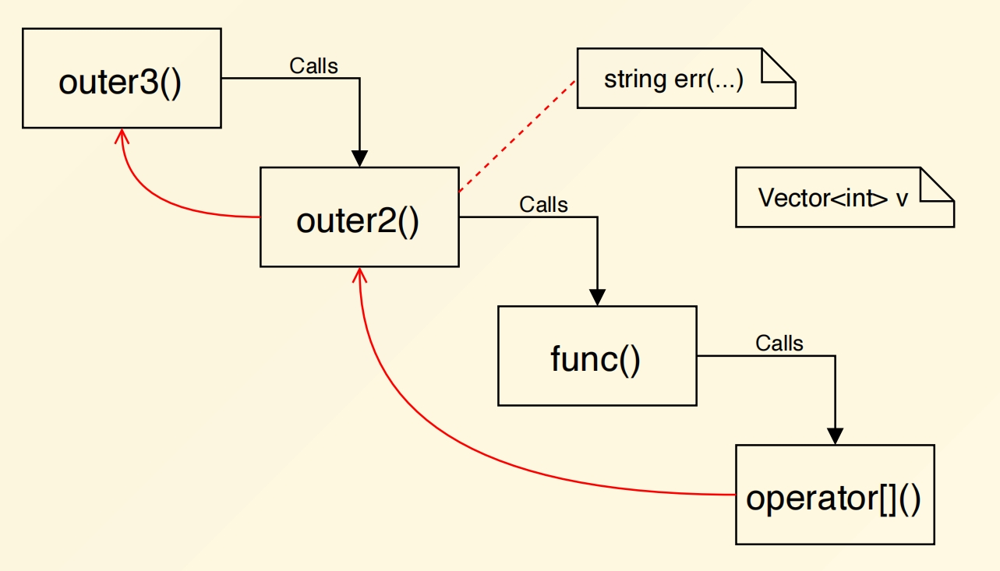
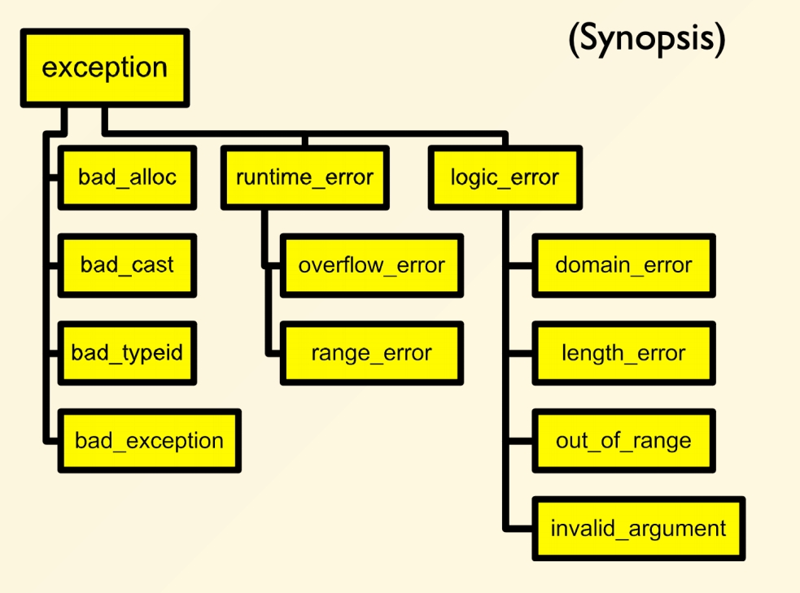

# Chapter 13 | Exceptions

## Run-time error

- Static typing and compile-time checks
    - badly formed code is not executed
- But, something always happens at run-time
    - It is crucial to address all potential situations

---

E.g. to read a file

1. open the file
2. determine its size
3. allocate that much memory
4. read the file into memory
5. close the file

---

## Error code

```cpp
errorCodeType readFile {
    initialize errorCode = 0;
    open the file;
    if ( theFilesOpen ) {
        determine its size;
        if ( gotTheFileLength ) {
            allocate that much memory;
            if ( gotEnoughMemory ) {
                read the file into memory;
                if ( readFailed ) {
                    errorCode = -1;
                }
            } else {
                errorCode = -2;
            }
        } else {
        errorCode = -3;
        }
        close the file;
        if ( theFILEDidntClose && errorCode == 0 ) {
            errorCode = -4;
        } 
    } else {
        errorCode = -5;
    }
    return errorCode;
}
```

```cpp
try {
    // -----------------------
    // main logic here
    open the file;
    determine its size;
    allocate that much memory;
    read the file into memory;
    close the file;
    // -----------------------
} catch ( fileOpenFailed ) {
    doSomething;
} catch ( sizeDeterminationFailed ) {
    doSomething;
} catch ( memoryAllocationFailed ) {
    doSomething;
} catch ( readFailed ) {
    doSomething;
} catch ( fileCloseFailed ) {
    doSomething;
}
```

---

- At the point where the problem occurs
    - you may not know what to do, but you knowthat you can't just continue on merrily
    - you must stop, and somebody, somewhere mustfigure out what to do next

---

## Why exception?

A major advantage of exceptions:

- separate the error-handling code from the code that runs under normal circumstances
- 可以把正常的代码逻辑和错误处理代码分开

---

### Example: Vector

```cpp
template <typename T>
class Vector {
private:
    T* m_elements;
    int m_size;
public:
    Vector(int size = 0) : m_size(size) { /* ... */ }
    ~Vector() { delete[] m_elements; }
    /* ... */
    int length() { return m_size; }
    T& operator[](int); // How to implement?
};
```

---

#### Problem

```cpp
template <class T>
T& Vector<T>::operator[](int idx) {
```

- What should `operator[]` do if `idx` is not a valid index?

**A choice**：

- Return random memory `return m_elements[idx];`
- 一种就是 `return` 出去。

**More choices**：

- Return a special value representing errors

```cpp
if (idx < 0 || idx >= m_size) { 
    T error_marker("some magic value");
    return error_marker;
}
return m_elements[idx];
```

- 设置一个特殊的值，但是使得 `m_elements` 可以用的值变少。
- `x = v[2] + v[4];` is not safe code anymore!
- `x = v[2] + v[4];` 这种代码就变得不安全了。因为可能会返回上述的特殊的值。

**More choices ...**：

- Just die

```cpp
if (idx < 0 || idx >= m_size){ 
    exit(22);
}
return m_elements[idx];
```

- 至少知道这里的代码存在问题。

- Die, but gracefully (with autopsy)

```cpp
assert(idx >= 0 && idx < m_size);
return m_elements[idx];
```

- 检测到这个问题后，可以打印相应的信息，然后退出程序。
- 相当于是先传递信息再 die。
- 这对于 debug 是很好的。
- ASSERT 在 DEBUG 模式下会触发，进入 RELEASE 模式时，就不会触发，也不会造成性能的损失，就是空的宏。

---

## When to use exceptions

- Many times, you don't know what should be done
- Anything you do could be wrong
- Solution: expose the problem

Make your caller (or its caller ...) responsible

有时候像系统，磁盘，网络等，并不是系统的 bug ，只是一些异常的情况，这是为了对异常情况进行处理。

---

## How to raise an exception

```cpp
template <class T>
T& Vector<T>::operator[](int idx) {
    if (idx < 0 || idx >= m_size) {
        // throw is a *keyword*
        // exception is raised at this point
        throw <<something>>;
    }
    return m_elements[idx];
}
```

---

### What do you throw?

```cpp
// What do you have? Data!
// Define a class to represent the error
class VectorIndexError {
public:
    VectorIndexError(int v) : m_badValue(v) { }
    ~VectorIndexError() { }
    void diagnostic() {
        cerr << "index " << m_badValue << "out of range!";
    }
private:
    int m_badValue;
};
```

---

```cpp
template <class T>
T& Vector<T>::operator[](int idx){ 
    if (idx < 0 || idx >= m_size) {
        throw VectorIndexError(idx); // the data object
    }
    return m_elements[idx];
}
```

- 在 `throw VectorIndexError(idx);` 开始退栈，一层层退，看哪个 caller 可以接住。

---

### What about your caller?

- Doesn't care
- The code never anticipates any problems

```cpp
int func() {
    Vector<int> v(12);
    v[3] = 5;
    int i = v[42]; // out of range
    // control never gets here!
    return i * 5;
}
```

- 不管它，什么都不写，抛出异常，没接住，只是会继续退栈。

- Cares deeply

```cpp
void outer() {
    try {
        func();
        func2();
    } catch (VectorIndexError& e) {
        e.diagnostic();
        // This exception does not propagate
    }
    cout << "Control is here after exception";
}
```

- 关心这个异常可以在 `try block` 里面接住这个异常。

- Mildly interested

```cpp
void outer2() {
    string err_msg("exception caught");
    try {
        func();
    } catch (VectorIndexError&) {
        cout << err_msg;
        throw; // propagate the exception
    }
}
```

- Doesn’t care about the details
- 接住但是不处理，只是继续抛出这个错误，直到最后有人去处理，如下。

```cpp
void outer3() {
    try {
        outer2();
    } catch (...) {
        // ... catches ALL exceptions!
        cout << "The exception stops here!";
    }
}
```

- `...` 表示可以匹配任何的异常。



---

## Review

- `throw exp;`

    - throws value for matching

- `throw;`

    - re-raises the exception being handled
    - valid only within a handler

---

## Try-catch blocks

```cpp
try { ... }
catch { ... }
catch { ... }
```

- Establishes any number of handlers
- Not needed if you don't use any handlers
- Shows where you expect to handle exceptions
- Costs cycles 有一些时间上的代价

---

### Exception handlers

- Select exception by type
- Can re-raise
- Two forms

```cpp
catch (SomeType v) { // handler code 带参数，而且只有一个参数
}
catch (...) { // handler code 通配
}
```

- Take a single argument (like a formal parameter)

---

### Selecting a handler

- Can have any number of handlers
- Handlers are checked in order of appearance

1. Check for exact match
2. Apply base class conversions
    
    - Reference and pointer types, only

3. The catch-all handler (...)

```
Inheritance can be used to structure exceptions
```

---

#### Using inheritance

```cpp
class MathErr {
    ...
    virtual void diagnostic();
};
class OverflowErr : public MathErr { ... }
class UnderflowErr : public MathErr { ... }
class ZeroDivideErr : public MathErr { ... }
```

- Hierarchy of exception types

---

#### Using handlers

```cpp
try {
    // code to exercise math options
    throw UnderFlowErr();
} catch (ZeroDivideErr& e) {
    // handle zero divide case
} catch (UnderFlowErr& e) {
    // handle underflow errors
} catch (MathErr& e) {
    // handle other math errors
} catch (...) {
    // any other exceptions
}
```

- Exception types ordered from special to general

---

```cpp
#include <iostream>
using namespace std;

class MathErr{
private:
    int data;
public:
    virtual void diagnostic() {}
};

class OverflowErr : public MathErr {
};

class UnderflowErr : public MathErr {
};

class ZeroDivideErr : public MathErr {
};

int main(){
    try{
        throw UnderflowErr();
    }catch (ZeroDivideErr &e){
        // ...
    }catch (MathErr &e){
        cout << "math error caught" << endl;
    }catch (...){
        // ...
    }
}
```

输出:

```bash
math error caught
```

- 向上造型是可以的。

---

- 如果想要完全匹配

```cpp
#include <iostream>
using namespace std;

class MathErr{
private:
    int data;
public:
    virtual void diagnostic() {}
};

class OverflowErr : public MathErr {
};

class UnderflowErr : public MathErr {
};

class ZeroDivideErr : public MathErr {
};

int main(){
    try{
        throw UnderflowErr();
    }catch (ZeroDivideErr &e){
        // ...
    }catch (UnderflowErr &e){
        cout << "underflow error caught" << endl;
    }catch (MathErr &e){
        cout << "math error caught" << endl;
    }catch (...){
        // ...
    }
}
```

输出:

```bash
underflow error caught
```

---

- 换一个顺序

```cpp
#include <iostream>
using namespace std;

class MathErr{
private:
    int data;
public:
    virtual void diagnostic() {}
};

class OverflowErr : public MathErr {
};

class UnderflowErr : public MathErr {
};

class ZeroDivideErr : public MathErr {
};

int main(){
    try{
        throw UnderflowErr();
    }catch (ZeroDivideErr &e){
        // ...
    }catch (MathErr &e){
        cout << "math error caught" << endl;
    }catch (UnderflowErr &e){
        cout << "underflow error caught" << endl;
    }catch (...){
        // ...
    }
}
```

会有 warning 并且输出:

```bash
math error caught
```

- 所以越 general 的类应该放在后面。
- 当然了，如果把 `catch ( ... )` 放在最前面，就会直接报错。

---

## Standard library exceptions



---

## Some

### Exception and new

- `new` does NOT returned 0 on failure
- `new` raises a `bad_alloc` exception (`new` 出错时是抛出异常)

---

### `noexcept` specifier

```cpp
void abc(int a) noexcept { ... }
```

- Allow compilers to produce more efficient code

    - optimize non-throwing functions

- 是一个标识，承诺这个函数不会抛出异常。此时编译器可以做出相应的优化。
- 加了这个标识后不是说会在这个函数种写异常，而是函数是层层调用的，调用的那个函数可能会抛出异常。
- At run time, if an exception is thrown out, the `std::terminate` is called
- 有很多函数需要加这个东西
- Who use it:

    - destructors, move constructors, etc.

---

### Design considerations

- Exceptions should indicate errors
- An inappropriate use:

```cpp
try {
    for (;;) {
        p = list.next()
        // ... 
    }
} catch (List::end_of_list) {
    // handle end of list here
}
```

- 这里把走到终点时运用异常来处理，是不合适的。因为异常是用于处理错误，而不是正常的逻辑。
- 这当然没错，但是异常处理是有额外的开销的，所以如果只是正常的逻辑，用异常处理是不合适的。
- Don't use exceptions in place of good design

```cpp
void func() {
    File f;
    if (f.open("somefile")) {
        try {
            // work with f
        } catch (...) {
            f.close()
        }
    }
}
```

- 这种情况并没错，但是不需要用异常来处理，用析构函数来处理即可。
- This is a good place to rely on the destructor

```cpp
void func() {
    File f("some file");
    // assume destructor closes f
    // will still be closed if exception 
    // is raised!
    if (f.ok()) {
        /* ... */
    }
}
```

- `function` 正常结束时会进行析构函数，而对于异常发生时，会开始退栈，栈上有对应的析构函数，此时就会执行，不需要特意去写。

---

## Summary

- Error recovery is a hard design problem 错误处理总的来说还是一个设计的问题
- All subsystems need help from their clients to handle exceptional cases 帮助客户端处理异常情况
- Exceptions provide the mechanism for

    - Propagating dynamically 
    - Destroying objects on stack properly 正确地销毁栈上的对象

---

## More exceptions

- Exceptions and constructors
- Exceptions and destructors
- Design and usage with exceptions
- Handlers

---

### Failure in constructors

- No return value is possible 所以错误码肯定是不行的
- Use an "uninitialized flag" 但是这样就需要多占一个空间。
- Defer work to an `init()` function
- Better -- Throw an exception

```cpp
void f(){
    X x;

    Y* p = new Y();
}
```

- 如果抛异常，`x` 变量的内存不会泄漏，因为是栈上的对象。
- 如果抛异常，`p` 指针指向的内存不会泄漏。`new` 有两个阶段，第一个是分配内存，第二个是初始化。如果抛异常，会 roll back。
- If your constructor throws an exception:

    - Dtors for the object won't be called
    - Manually clean up allocated resources before throwing

        - otherwise memory leak happens

- 首先设计这样一个框架。

```cpp
#include <iostream>
using namespace std;

class A{
private:
    int * vdata;
public:
    A() : vdata(new int[10]()){
        cout << "A::A()" << endl;
    }
    ~A(){
        cout << "A::~A()" << endl;
        delete[] vdata;
        cout << "deleting vdata ..." << endl;
    }
};

int main(){
    A a;
}
```

输出:

```bash
A::A()
A::~A()
deleting vdata ...
```

- 在构造函数中，某些情况下会发生构造失败。

```cpp
#include <iostream>
using namespace std;

class A{
private:
    int * vdata;
public:
    A() : vdata(new int[10]()){
        cout << "A::A()" << endl;
        if(true){ // anything indicating a failure
            throw 2;
        }
    }
    ~A(){
        cout << "A::~A()" << endl;
        delete[] vdata;
        cout << "deleting vdata" << endl;
    }
};

int main(){
    try{
        A a;
    }catch(...){
        cout << "caught" << endl;
    }
}
```

输出：

```bash
A::A()
caught
```

- 构造没完成就不会有析构，也就是不会执行。
- 此时就说明 `delete[] vdata;` 并没有执行，也就是 `vdata` 造成了内存泄漏。
- 这种情况如何处理呢？

```cpp
#include <iostream>
using namespace std;

class A{
private:
    int * vdata;
public:
    A() : vdata(nullptr){
    //A() : vdata(new int[10]()){
        cout << "A::A()" << endl;
        //if(true){ // anything indicating a failure
            //throw 2;
        //}
    }
    void init(){
        cout << "A::init()" << endl;
        vdata new int[10]();
        if(true){
            throw 2;
        }
    }
    ~A(){
        cout << "A::~A()" << endl;
        delete[] vdata;
        cout << "deleting vdata ..." << endl;
    }
};

int main(){
    try{
        A a;
        a.init();
    }catch(...){
        cout << "caught" << endl;
    }
}
```

输出：

```bash
A::A()
A::init()
A::~A()
deleting vdata ...
caught
```

- 把资源获取放到 `init` 函数里面。
- 在 `init` 函数里面，如果发生异常，此时就是退栈，因为 `A` 的构造已经完成。
- 但是这是两段式的，本来说初始化的进行就在构造函数里面，现在需要手动调用。

**Two stages construction**

- Do normal work in ctor

    - Initialize all member objects
    - Initialize all pointers to 0
    - Initialize all pointers to 0

        - File
        - Network connection
        - Memory

- Defer resource allocations to `init()`
- 也可以试一下不用两段式如何做。

```cpp
#include <iostream>
using namespace std;

class T{
public:
    T() { cout << "T::T()" << endl; }
    ~T() { cout << "T::~T()" << endl; }
};

void foo(){
    T t;
    throw 1;
}

class A{
private:
    int * vdata;
public:
    A() : vdata(new int[10]()){
        cout << "A::A()" << endl;
        if(true){ // anything indicating a failure
            throw 2;
        }
    }
    ~A(){
        cout << "A::~A()" << endl;
        delete[] vdata;
        cout << "deleting vdata ..." << endl;
    }
};

int main(){
    try{
        foo();
        // A a;
    }catch(...){
        cout << "caught" << endl;
    }
}
```

输出：

```bash
T::T()
T::~T()
caught
```

- 这种情况下 `T` 的析构是会执行的。
- 那么我们就利用这件事情。

```cpp
#include <iostream>
using namespace std;

class T{
public:
    T() { cout << "T::T()" << endl; }
    ~T() { cout << "T::~T()" << endl; }
};

class A{
private:
    T t;
    int * vdata;
public:
    A() : vdata(new int[10]()){
        cout << "A::A()" << endl;
        if(true){ // anything indicating a failure
            throw 2;
        }
    }
    ~A(){
        cout << "A::~A()" << endl;
        delete[] vdata;
        cout << "deleting vdata ..." << endl;
    }
};

int main(){
    try{
        A a;
    }catch(...){
        cout << "caught" << endl;
    }
}
```

输出：

```bash
T::T()
A::A()
T::~T()
caught
```

- 此时 `T` 的析构函数是会执行的。
- 在 `A` 的构造函数中抛出异常，所以 `A` 的构造没有完成，但是 `T` 是它的一个 `filed` ，这个 `field` 照理说在 `vdata(new int[10]())` 这个初始化列表中已经完成。所以已经构造好的 `T` 的析构函数会被调用。
- 因此我们利用这个。

```cpp
#include <iostream>
using namespace std;

class Wrapper{
private:
    int *vdata;
public:
    Wrapper(int *data) :vdata(data) { 
        cout << "W::W()" << endl; 
    }
    ~Wrapper() { 
        delete[] vdata;
        cout << "W::~W(), vdata released!" << endl; 
    }
};

class A{
private:
    // int * vdata;
    Wrapper w;
public:
    A() : w(new int[10]()){
        cout << "A::A()" << endl;
        if(true){ // anything indicating a failure
            throw 2;
        }
    }
    ~A(){
        cout << "A::~A()" << endl;
    }
};

int main(){
    try{
        A a;
    }catch(...){
        cout << "caught" << endl;
    }
}
```

输出：

```bash
W::W()
A::A()
W::~W(), vdata released!
caught
```

- 相当于 `new` 出来的东西扔给 `Wrapper` ，放到字段中去，而字段有一个机制是已经构造好了，一旦下面发生 `throw` ，此时析构函数就会调用，要被管的内存就会被 delete。
- 也不需要特意去写一个析构，因为 `Wrapper` 的析构会在 `A` 的析构中被自动调用。

```cpp
#include <iostream>
using namespace std;

class Wrapper{
private:
    int *vdata;
public:
    Wrapper(int *data) :vdata(data) { 
        cout << "W::W()" << endl; 
    }
    ~Wrapper() { 
        delete[] vdata;
        cout << "W::~W(), vdata released!" << endl; 
    }
};

class A{
private:
    // int * vdata;
    Wrapper w;
public:
    A() : w(new int[10]()){
        cout << "A::A()" << endl;
        // if(true){ // anything indicating a failure
        //     throw 2;
        // }
    }
    ~A(){
        cout << "A::~A()" << endl;
    }
};

int main(){
    // try{
        A a;
    // }catch(...){
        // cout << "caught" << endl;
    // }
}
```

输出：

```bash
W::W()
A::A()
A::~A()
W::~W(), vdata released!
```

- 所以就是不影响正常使用。
- 由于这个过于常用，所以标准库中有一个 `memory` 。

```cpp
#include <iostream>
#include <memory>
using namespace std;

class A{
private:
    unique_ptr<int[]> up;
public:
    A() : up(new int[10]()){
        cout << "A::A()" << endl;
        if(true){ // anything indicating a failure
            throw 2;
        }
    }
    ~A(){
        cout << "A::~A()" << endl;
    }
};

int main(){
    try{
        A a;
    }catch(...){
        cout << "caught" << endl;
    }
}
```

输出：

```bash
A::A()
caught
```

- 此时跑就看不到 `release` 这句话了，因为已经封装在 `unique_ptr` 里面了。
- 也就是说 `unique_ptr<int[]> up;` 这是一个字段，这个字段会保证它存的那个裸指针会被释放。

**Using smart pointers**:

- `std::unique_ptr`
- `std::shared_ptr`
- The destructors will delete the managed native pointers when they die.

---

### Exceptions and destructors

- Destructors are called when:

    - Normal call ends

        - object exits from scope
    
    - Exception is throwed

        - stack unwinding invokes dtors on objects as they exit from scope. 与函数调用结束的退栈类似。

```
What happens if an exception is thrown in a destructor?
```

- 可能会非常糟糕，因为 destructor 可能本来就是在异常抛出时被调用的，此时就变成了一个异常还没有结束又有一个了。如果发生这种事会直接调用 `std::terminate`() ，因为已经无法处理了。
- Throwing an exception in a destructor that is itself being called as the result of an exception will invoke `std::terminate()` .
- Allowing exceptions to escape from destructors should be avoided, never throw it!
- 所以我们一般不在 destructor 里面抛出异常。

---

### Programming with exceptions

- Throwing/catching by value leads to slicing:
- 值传递可能会有 slicing 的问题，而且还有拷贝的代价。

```cpp
struct X {};
struct Y : public X {};
try {
    throw Y();
} catch(X x) {
    // was it X or Y?
}
```

- Throwing/catching by pointer introduces coupling between regular code and handler code:
- 也可以使用指针，但是需要手动地去 delete

```cpp
try {
    throw new Y();
} catch(Y* p) {
    // whoops, forgot to delete..
}
```

- Prefer catching exceptions by reference:
- 一般来说我们用引用比较多，而引用也是可以向上造型的。

```cpp
struct B {
    virtual void print() { /* ... */ }
};
struct D : public B { /* ... */ };
try {
    throw D("D error");
}
catch(B& b) {
    b.print(); // print D's error.
}
```

---

## Exceptions wrap-up

- Develop an error-handling strategy early in design
- Avoid over-use of try/catch blocks

    - Use objects to acquire/release resources, RAII

- Don't use exceptions where local control structures would suffice
- Not every function is designed to handle every type of error
- Use exception-specifications for major interfaces
- Library code better not to decide to terminate a program

    - Throw exceptions and let the caller decide

---

### Uncaught exceptions

- If an exception is thrown but not caught, `std::terminate()` will be called.
- The `std::terminate()` can also be intercepted. 可以自己定制

```cpp
void my_terminate() {
    /* ... */
}
set_terminate(my_terminate);
```

---

## Write exception-safe code

```cpp
class BankAccount {
    /* ... */
    void withdrawMoney(int amount) {
    reduceBalance(amount); // Balance already reduced!
    prepareCash(); // Throws an exception!
    releaseCash();
    }
    /* ... */
};
```

```cpp
#include <iostream>
#include <memory>
using namespace std;

class Resource {
public:
    Resource() = default;
    Resource(const Resource &r) {
        throw runtime_error("Resource Copy Ctor");
    }
};

class Widget {
private:
    int i;
    string s;
    Resource *pr;
public:
    Widget() : i(0), pr(new Resource) {}
    ~Widget() { delete pr; }

    Widget(const Widget &w) : i(w.i), s(w.s){
        if(w.pr) pr = new Resource(*w.pr); // 拷贝构造
        else pr = nullptr;
    }

    Widget &operator=(const Widget &w) {
        if(this == &w) return *this;

        i = w.i;
        s = w.s;
        delete pr;  // 原来可能不是空的，要先删掉才能更改

        if(w.pr) pr = new Resource(*w.pr); // 拷贝赋值
        else pr = nullptr;

        return *this;
    }
};

int main(){
    Widget w1;
    // Widget w2(w1); // Copy constructor
    Widget w3;
    // w3 = w1; // Copy assignment operator
    try{
        w3 = w1;
    }catch(const runtime_error &e){
        cout << e.what() << endl;
    }
    // use w3 ...
}
```

- 在 copy ctor 中抛出异常所以 `w2` 没有被创建出来，但是 `w3` 已经构造完成了的。
- 也就是说 `delete` 执行完之后，空间被收回去了，所以出现了 `dangling pointer` (悬挂指针)。
- 这就不是对于异常来说安全的状态。可以改成 `delete pr; pr = nullptr;`，这样即使抛出异常，`pr` 也不会指向一个已经被删除的对象。但是此时 `pr` 已经不是原来的状态了，因为 `pr` 中 `s` 和 `i` 被 copy 赋值过，但是自己是 nullptr。
- 可以改成如下。

```cpp
#include <iostream>
#include <memory>
using namespace std;

class Resource {
public:
    Resource() = default;
    Resource(const Resource &r) {
        throw runtime_error("Resource Copy Ctor");
    }
};

class Widget {
private:
    int i;
    string s;
    unique_ptr<Resource> pr;
public:
    Widget() : i(0), pr(new Resource) {}

    Widget(const Widget &w) : i(w.i), s(w.s){
        if(w.pr) pr = make_unique<Resource>(*w.pr);
    }

    Widget &operator=(const Widget &w) {
        Widget tmp(w);
        *this = std::move(tmp);

        return *this;
    }

    Widget &operator=(Widget &&w) noexcept = default;
};

int main(){
    Widget w1;
    Widget w3;
    try{
        w3 = w1;
    }catch(const runtime_error &e){
        cout << e.what() << endl;
    }
    // use w3 ...
}
```

??? note "about Widget &operator=(Widget &&w) noexcept = default;"
    这句代码定义的是 `Widget` 类的**移动赋值运算符 (Move Assignment Operator)**。

    1.  `Widget &operator=(...)`: 这表明这是一个赋值运算符重载，它返回一个 `Widget&` 引用（通常是 `*this`），以便可以进行链式赋值（例如 `a = b = c;`）。

    2.  `&&` 是关键部分，它表示一个**右值引用**。右值引用主要用于绑定到临时对象或那些即将被销毁的对象。当赋值操作的右侧是一个右值（例如临时对象或者通过 `std::move` 转换的对象）时，编译器会选择调用这个移动赋值运算符。

    3.  `noexcept`: 这是一个异常规范。它声明这个函数不会抛出异常。对于移动操作来说，通常会声明为 `noexcept`，因为如果在移动过程中发生异常，可能会导致源对象处于一种不确定或无效的状态，而目标对象也没有完整地获得资源，这很难处理。

    4.  `= default;`: 它告诉编译器为这个特殊的成员函数（移动赋值运算符）生成一个**默认的实现**。编译器生成的默认移动赋值运算符会对其成员进行逐个移动。

    移动赋值运算符利用了右值引用的特性。当源对象是右值时，我们知道它即将被销毁，因此我们可以"偷取"它的资源，而不是进行昂贵的深拷贝。对于 `unique_ptr` 成员 `pr`，默认的移动赋值实现就是将源 `unique_ptr` 中的裸指针转移给目标 `unique_ptr`，并将源 `unique_ptr` 置为空。这样就高效地完成了资源的转移，避免了创建新的 `Resource` 对象和复制数据。

    `*this = std::move(tmp);` 这一行。当等号右边是一个右值引用时 (`std::move(tmp)` 的结果)，C++ 会查找并调用最匹配的赋值运算符，而最匹配的就是移动赋值运算符 `Widget &operator=(Widget &&w)`。

---