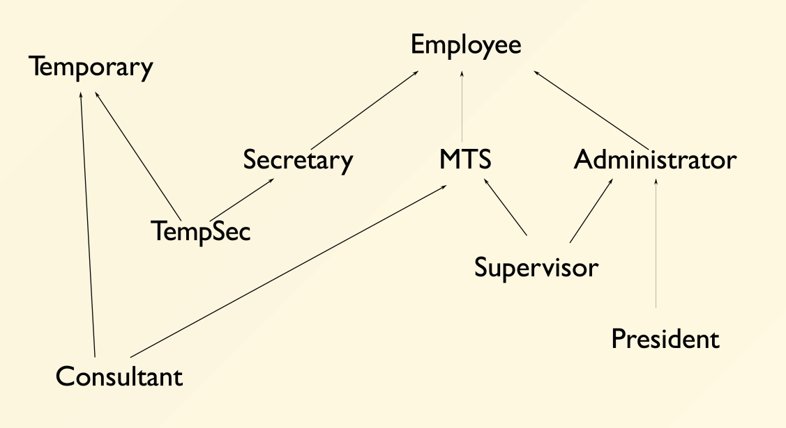
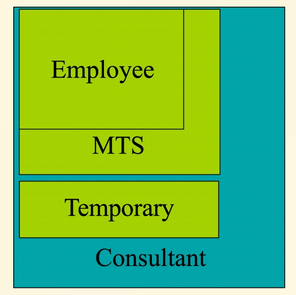
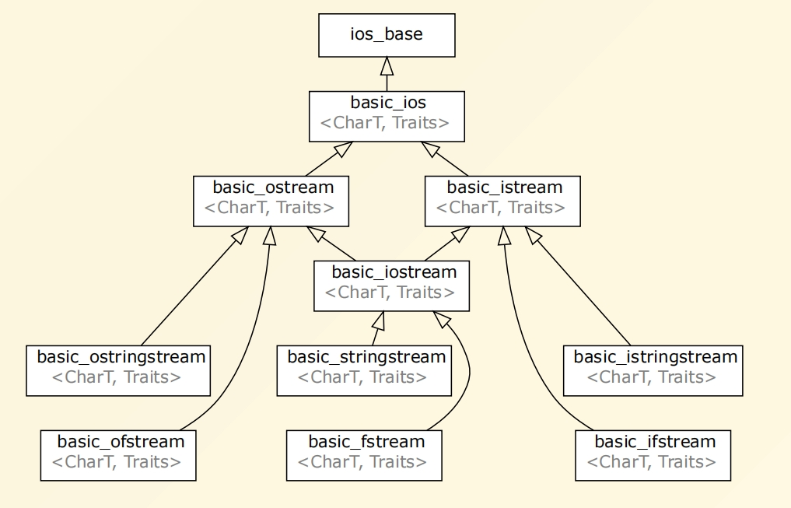
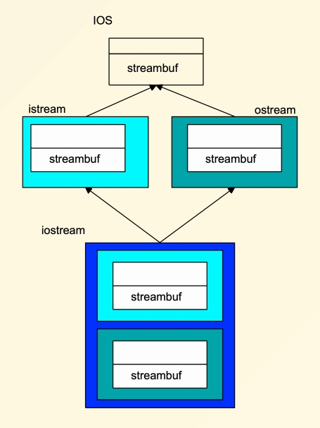
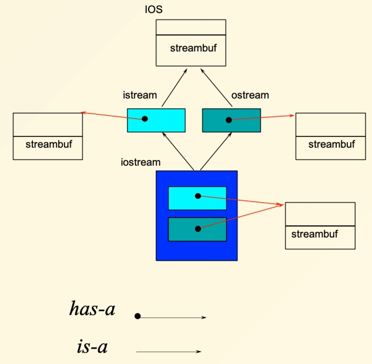
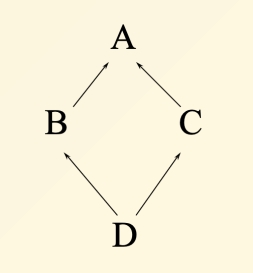

# Chapter 15 | Miscellaneous Topics

## Named casts

The C-style cast is:

- dangerous because it can do logically differentconversion.
- not search-friendly

If you must cast things, use a named cast:

- `static_cast` ,less likely to make mistakes
- `dynamic_cast`
- `reinterpret_cast`

- `static_cast` 最大的好处在于它能清晰地、无歧义地表达程序员的转换意图，并且在编译时提供了一定程度的类型检查，从而提高了代码的可读性、可维护性和安全性。
- 隐式转换 (`a = d;`)：编译器会自动进行转换。虽然方便，但有时可能隐藏一些不易察觉的错误或精度损失。读者可能需要思考这里发生了什么类型的转换。
- C风格转换 (`(int)d`)：虽然是显式的，但它过于强大和粗暴。它可以执行多种不同类型的转换（比如 `static_cast`, `reinterpret_cast` 甚至 `const_cast` 的某些功能），这使得代码意图不够明确，并且容易出错。比如，它可能移除 `const` 属性，或者在不相关的指针类型之间进行转换，这些都可能导致未定义行为。
- `static_cast<int>(d)`：这种写法非常明确地告诉阅读代码的人以及编译器："我打算在这里进行一个静态的、编译时可确定的类型转换，将 `double` 类型的值转换为 `int` 类型。" 它意图明确，只用于那些编译器认为"合理"的转换（例如，数值类型之间的转换，或者向上/向下转型但没有运行时检查）。

```cpp
double d=7.1;
int a;

a = d; // implicit

a =(int)d; // explicit

a = static_cast<int>(d); // exact meaning
```

- 对于第一种 C 风格的强制类型转换在这里是"可以编译通过的"。编译器通常不会阻止这种转换，因为它赋予了程序员极大的自由度。虽然编译器允许你把 `a` 的地址当作一个 `double` 类型数据的地址来对待，但变量 `a` 本身仍然是一个 `int`。`a` 在内存中只占用了 `sizeof(int)` 大小的空间。如果后续代码通过指针 `p` 去解引用，就会发生未定义行为。
- 对于第二种。`static_cast` 用于在相关的类型之间进行转换，例如数值类型之间的转换，或者在类继承层次结构中进行向上或向下转型（向下转型时没有运行时检查）。`int*` 和 `double*` 是指向完全不同且不相关数据类型的指针。`static_cast` 认为这种转换在逻辑上是不安全的，或者说不是一个“合理的”静态转换，因此会禁止它。它能防止程序员意外地进行这种低级的、可能破坏类型系统的转换。
- 第三种这个操作符是专门设计用来进行低级别、平台相关的指针类型转换的，它可以将任何指针类型转换为几乎任何其他指针类型，或者将指针转换为足够大的整数类型，反之亦然。有时为了将指针本身作为键值存储在某些数据结构中，或者进行某些位操作，（哈希），需要将其视为一个整数。`reinterpret_cast` 可以完成指针到整数以及整数到指针的转换（前提是整数类型足够大以容纳指针）。以及在序列化、自定义内存管理等场景下，可能需要将对象的原始字节序列视为另一种类型。虽然 `reinterpret_cast` 提供了这种能力，但它本身并不保证转换后的指针解引用是安全的。就像 C 风格转换一样，如果 `p` 指向的内存（即 `a` 的内存）被当作 `double` 来使用，仍然会导致未定义行为。`reinterpret_cast` 只是允许你进行这种"重新解释地址"的操作，后续的内存访问安全完全由程序员自己保证。

```cpp
int a =7;
double* p;

p = (double*)&a; // ok(but a is not a double)

p = static_cast<double*>(&a); // error

p = reinterpret_cast<double*>(&a); // ok: I really mean it
```

- 尝试将常量 `c` 的地址 (`&c`，类型是 `const int*`，即指向常量整数的指针) 赋值给一个普通整型指针 `q` (类型是 `int*`)。编译器会在这里报错。这是 C++ 类型系统的一个基本安全规则。如果允许这样做，那么我们就可以通过指针 `q` 来间接修改 `const` 常量 `c` 的值（例如 `*q = 10;`），这就违背了 `c` 被声明为 `const` 的初衷。编译器会阻止这种潜在的对 `const` 属性的破坏。
- 常量 `c` 被声明为 `const`。尽管你通过 C 风格转换欺骗了编译器，让 `q` 指向了 `c`，但 `c` 所在的内存区域在逻辑上（有时甚至是物理上，比如存储在只读内存段）被认为是不可修改的。尝试通过 `q` 修改 `c` 的值，仍然会导致未定义行为。
- `static_cast` 不能用来移除 `const` 属性 (`cast away const-ness`)。这是 `static_cast` 设计的一部分，它旨在提供比 C 风格转换更安全的转换。
- `const_cast` 是 C++ 中唯一专门用来添加或移除 `const` (以及 `volatile`) 修饰符的命名转换。有些老的 API 可能期望接收一个非 `const` 指针，即使它实际上不会修改所指向的数据。在这种情况下，如果程序员确信该函数不会修改数据，可能会使用 `const_cast` 来"欺骗" API。
- 即使使用了 `const_cast<int*>(&c)` 使得 `q` 指向了 `c` 并且 `q` 的类型是 `int*`，如果 `c` 最初就被声明为 `const` 对象 (像本例中的 `const int c = i;`)，那么任何通过 `q` 来修改 `c` 的值的尝试 (例如 `*q = 2;`) 仍然是未定义行为。`const_cast` 只是移除了指针或引用上的 `const` 限制，它并没有改变对象本身的 `const` 属性。如果对象本身就是 `const` 的，修改它就是非法的。

```cpp
int i = 7;
const int c = i;
int* q;

q = &c; // error

q = (int*)&c; // ok (but is *q=2 really allowed?)

q = static_cast<int*>(&c); // error

q = const_cast<int*>(&c); //I really mean it
```

- 向上造型 (Upcasting) 是可以的。如代码中 `A *pa = new B;` 所示，将派生类指针 (`B*`) 转换为基类指针 (`A*`) 是隐式允许且绝对安全的，因为派生类对象包含了基类的所有成员和行为。
- 向下转型（将基类指针转换为派生类指针）确实可以使用 `static_cast`，但它是不安全的，除非你百分之百确定指针确实指向的是目标派生类类型的对象。如果不是，就会产生未定义行为。对于多态类型，更安全的向下转型方式是使用 `dynamic_cast`。此时当你通过 `pc1` (它被认为是 `C*`) 来访问成员时，程序会按照 `C` 类的内存布局来解释 `B` 对象的内存。如果 `C` 类有 `B` 类没有的成员，或者成员布局不同（除了共同基类 `A` 的部分），那么访问这些成员就会导致未定义行为（比如读取到无意义的数据、写入不该写入的内存区域、程序崩溃等）。
- `dynamic_cast` 会在程序运行时检查 `pa` 所指向的对象的真实类型。这个检查依赖于对象的 `RTTI` (Run-Time Type Information，运行时类型信息)，而 `RTTI` 的存在通常是因为基类中至少有一个虚函数（比如这里的 `A::f()`）。它会判断 `pa` 指向的对象（即那个 `B` 对象）是否可以被安全地视为一个 `C` 对象。一个对象可以被安全地视为 `C` 对象，意味着它本身就是 `C` 类型的对象。或者它是 `C` 的派生类对象。如果检查成功 (即 `pa` 确实指向 `C` 对象或 `C` 的派生类对象)，`dynamic_cast` 会返回转换后的、指向该对象的 `C*` 指针。如果检查失败 (如本例中，`pa` 指向的是 `B` 对象，而 `B` 和 `C` 是不相关的兄弟类)，对于指针类型的 `dynamic_cast`，它会返回一个空指针 (`nullptr`)。如果 `dynamic_cast` 用于 **(引用&)** 类型并且转换失败，它会抛出一个 `std::bad_cast` 异常。
- 由于 `dynamic_cast` 需要在运行时进行类型检查，这会带来一定的性能开销。

```cpp
struct A{
    virtual void f() {}
};
struct B : public A {};
struct C : public A {};

int main(){
    A *pa = new B;
    C *pc = static_cast<C*>(pa); // 0K: but *pa is B!
    C *pc = dynamic_cast<C*>(pa); // return nullptr
}
```

- `dynamic_cast` 通常需要作用于多态类型（即至少有一个虚函数的类）的指针或引用才能执行其运行时的类型检查。此时类 `A` 没有虚函数表 (`vtable`)，因此没有运行时的类型信息可供 `dynamic_cast` 使用来安全地进行向下转型。
- `static_cast` 在编译时进行转换，它不关心对象运行时的真实类型，只根据声明的类型和继承关系来判断转换是否"表面上"合法。

```cpp
struct A{
    // virtual void f() {}
};
struct B : public A {};
struct C : public A {};

int main(){
    A *pa = new B;
    C *pc = static_cast<C*>(pa); // 0K: but *pa is B!
    C *pc = dynamic_cast<C*>(pa); // ERROR
}
```

- `reinterpret_cast` 的本质是非常底层的操作。它绕过了 C++ 的类型系统，直接对内存地址进行操作。`reinterpret_cast` 告诉编译器："把这个指针（或其指向的内存块的起始地址）的二进制表示，直接解释为另一种类型的指针（或其指向的内存块的起始地址）。" 它不关心这两种类型是否有任何逻辑上的关联，只进行位模式的重新解释。它不进行任何有意义的类型转换或数据调整。它只是简单粗暴地改变了编译器看待同一块内存的方式。因此，其语义非常接近硬件层面，缺乏高级语言的抽象和安全性。

```cpp
struct A{
    // virtual void f() {}
};
struct B : public A {};
struct C : public A {};
struct D {};

int main(){
    A *pa = new B;
    D *pd = static_cast<D*>(pa); // Error!
    D *pd = reinterpret_cast<D*>(pa); // ok: but *pa is B!
}
```

---

## Multiple Inheritance



---

### Mix and match

```cpp
class Employee{
protected:
    String name;
    EmpID id;
};

class MTS: public Employee {
protected:
    Degrees degree_info;
};

class Temporary{
protected:
    Company employer;
};

class Consultant:
public MTS,
public Temporary {
 /* ... */
};
```

- Consultant picks up the attributes of both `MTS` and `Temporary`
- name, id, degree_info, employer

---

### MI complicates data layouts



---

### `iostream` package



---

### Vanilla MI

- Members are duplicated
- Derived class has access to full copies of each base class
- This can be useful!

1. Multiple links for lists
2. Multiple streambufs for input and output



---

### More on MI ...

```cpp
struct B1 { int m_i; }; 
struct D1 : public B1 {}; 
struct D2 : public B1 {}; 
struct M : public D1, public D2 {};
int main() {
    M m; // OK
    B1* p = &m; // ERROR: which B1???
    B1* p1 = static_cast<D1*>(&m); // OK
    B1* p2 = static_cast<D2*>(&m); // OK
}
```

- `B1` is a replicated sub-object of `M` .

---

#### Replicated bases

- Normally replicated bases aren’t a problem (usage of `B1` by `D1` and `D2` is an implementation detail).
- Replication becomes a problem if replicated data bring in confusing logic:

```cpp
M m;
m.m_i++; // ERROR: D1::B1.m_i or D2::B1.m_i?
```

---

#### Safe uses

- Protocol classes

---

## Protocol / Interface classes

- Abstract base class with

1. All non-static member functions are pure virtual except destructor
2. Virtual destructor with empty body
3. No non-static member variables, inherited or otherwise

- May contain static members

---

### Example interface

- 一般来说我们做多重继承会用上接口。此时多继承是问题不大的，因为没有对应的数据。
- Unix character device

```cpp
class CDevice{
public :
    virtual ~CDevice()= default;

    virtual int read(...) = 0;
    virtual int write(...) = 0;
    virtual int open(...) = 0;
    virtual int close(...) = 0;
    virtual int ioctl(...) = 0;
};
```

---

### What about sharing?

- How do you avoid having two `streambufs` ?
- Base classes can be virtual(间接)

    - To C++ people, "virtual" means "indirect"

- Virtual member functions have dynamic binding

    - They use pointer indirection

- Virtual base classes are represented indirectly

    - They use pointer indirection

---

### Using virtual base classes

- Virtual base classes are shared
- Derived classes have a single copy of the virtual base
- 相当于是两个指针的共享。



---

### Virtual bases

```cpp
struct B1 { int m_i; }; 
struct D1 : virtual public B1 {}; 
struct D2 : virtual public B1 {}; 
struct M : public D1, public D2 {}; 
int main() { 
    M m; // OK 
    m.m_i++; // OK, there is only one B1 in m 
    B1* p = new M; // OK 
}
```

- Use of virtual base imposes some runtime and space overhead.
- If replication isn’t a problem then you don't need to make bases virtual.

    - Abstract base classes (that hold no data except for a vptr) can be replicated with no problem –virtual base can be eliminated.

---

### Complications of MI

- Name conflicts

    - Dominance rule

- Order of construction

    - Who constructs virtual base?

- Virtual bases not declared when you need them



- Code in virtual bases called more than once
- Compilers are still iffy
- Moral:

    - Use sparingly
    - Avoid diamond patterns: expensive, hard

---

#### TIPS for MI

- In general, SAY NO

---

## Avoiding name clashes

- Including duplicate names at global scope is a problem

```cpp
// old1.h
void f();
void g();

// old2.h
void f();
void h();
```

- 在 cpp 的世界里，尽量避免放在 global scope 里面，而是放在 namespace 里面。

```cpp
// old1.h
namespace old1 {
    void f();
    void g();
}

// old2.h
namespace old2 {
    void f();
    void h();
}
```

- Wrap declarations in namespaces

```cpp
// old1.h
namespace old1 { 
    void f();
    void g();
}
// old2.h
namespace old2 {
    void f();
    void g();
}
```

---

### Namespace

```cpp
namespace Math { 
    double abs(double); 
    double sqrt(double); 
    int trunc(double); 
    ... 
} // Note: No terminating end colon!
```

- Expresses a logical grouping of classes, functions, variables, etc.
- A namespace is a scope just like a class
- Preferred when name encapsulation is needed
- 类似功能可以放在同一个命名空间下面去。逻辑上会组合在一起。

---

#### Defining namespaces

- Place namespaces in include files:
- 相当于多了一层包裹，类、函数等都可以放进去。

```cpp
// Mylib.h
namespace MyLib {
    void foo();
    class Cat {
    public:
        void Meow();
    };
}
```

---

#### Defining namespace functions

- Use normal scoping to implement functions in namespaces.

```cpp
// MyLib.cpp
#include "MyLib.h"
void MyLib::foo() {
    cout << "foo\n";
}
void MyLib::Cat::Meow() {
    cout << "meow\n"; 
}
```

---

#### Using names from a namespace

- Use scope resolution to qualify names from a namespace.
- Can be tedious and distracting.

```cpp
#include "MyLib.h"
int main()
{
    MyLib::foo(); 
    MyLib::Cat c; 
    c.Meow();
}
```

---

### using -declarations

- Introduces a local synonym for name
- States in one place where a name comes from.
- Eliminates redundant scope qualification:
- 这里只放出来一个东西 `foo` 或 `Cat`.

```cpp
int main() { 
    using MyLib::foo; 
    using MyLib::Cat; 
    foo(); 
    Cat c; 
    c.Meow(); 
}
```

---

### using -directives

- Makes all names from a namespace available.
- Can be used as a notational convenience.
- 这里是把 `MyLib` 中的所有东西都放出来。最好是在局部，函数内部放。

```cpp
int main() { 
    using namespace std; 
    using namespace MyLib; 
    foo(); 
    Cat c; 
    c.Meow(); 
    cout << "hello" << endl; 
}
```

---

#### Ambiguities

- using-directives may create potential ambiguities.
- Consider:

```cpp
// Mylib.h 
namespace XLib { 
    void x(); 
    void y(); 
} 
namespace YLib { 
    void y(); 
    void z(); 
}
```

- using-directives only make the names available.
- Ambiguities arise only when you make calls.
- Use scope resolution to resolve.

```cpp
int main() { 
    using namespace XLib; 
    using namespace YLib; 
    x(); // OK 
    y(); // Error: ambiguous 
    XLib::y(); // OK, resolves to XLib 
    z(); // OK 
}
```

---

## Namespace aliases

- Namespace names that are too short may clash
- Names that are too long are hard to work with
- Use aliasing to create workable names
- Aliasing can be used to version libraries.
- 可以把命名名字变短。

```cpp
namespace supercalifragilistic { 
    void f();
} 
namespace short_ns = supercalifragilistic; 
short_ns::f();
```

---

### Namespace composition

- Compose new namespaces using from others.
- using-declarations can resolve potential clashes.
- Explicitly defined functions take precedence.

```cpp
namespace first { 
    void x(); 
    void y(); 
} 
namespace second { 
    void y(); 
    void z(); 
}
```

---

### Namespace composition

```cpp
namespace mine { 
    using namespace first; 
    using namespace second; 
    using first::y; // resolve clashes
    void mystuff(); 
    /* ... */
}
int main() {
    mine::x();
    mine::y(); // call first::y()
    mine::mystuff();
}
```

---

### Namespace selection

- Compose namespaces by selecting a few features from other namespaces.
- Choose only the names you want rather than all.
- Changes to "orig" declaration become reflected in "mine".

```cpp
namespace mine { 
    using orig::Cat; // use Cat class from orig 
    void x(); 
    void y(); 
}
```

---

### Namespaces are open

- Multiple namespace declarations add to the same namespace.

    - Can be distributed across multiple files.
- C++ 中的命名空间可以被多次声明，并且每一次声明都是对同一个命名空间的补充和扩展，而不是创建一个新的、同名的命名空间。这些声明甚至可以分散在不同的文件中。所有这些声明最终都会合并到同一个逻辑上的命名空间中。这个特性非常重要，尤其是在大型项目中。它允许你将一个复杂命名空间的不同部分组织到不同的头文件或源文件中。

```cpp
// header1.h 
namespace X { 
    void f(); 
} 
// header2.h 
namespace X { 
    void g(); // X how has f() and g(); 
}
```

- specialize existing standard templates

```cpp
namespace mylib {
    class Widget { /* ... */ };
}
// Specialize std::hash so that Widget can be used as
// a key in std::unordered_set and std::unordered_map.
namespace std {
    template<>
    struct hash<mylib::Widget> {
        size_t operator()(const mylib::Widget& obj) const {
        return /* ... */;
        }
    };
}
```

- 从 C++ 语言层面来看，namespace std 和其他任何命名空间一样，都是"开放的"(open)。虽然语法上允许打开 std 命名空间，但 C++ 标准对用户可以向 namespace std (以及其嵌套的命名空间，如 `std::chrono`) 添加什么内容有非常严格的规定。标准库中有很多模板类和模板函数（例如 `std::hash<T>`, `std::formatter<T>`, `std::numeric_limits<T>`, `std::less<T>` 等）。标准库的设计者预见到用户可能需要为自己的用户定义类型 (User-Defined Types, UDTs) 提供这些标准模板的特定行为。因此，标准明确允许用户为这些标准模板针对自己的用户定义类型提供完整的或部分的模板特化，并将这些特化版本放在 `namespace std` 中。

---

## Further reading

<div class="card file-block" markdown="1">
<div class="file-icon"></div>
<div class="file-body">
<div class="file-title"> Effective C++__Item-27 </div>
<div class="file-meta"> 106 KB / 2025-05-26</div>
</div>
<a class="down-button" target="_blank" href="/Notebook/Computer_Science/OOP/[Further Readings] Effective C++__Item-27.pdf" markdown="1">:fontawesome-solid-download: 下载</a>
</div>

---