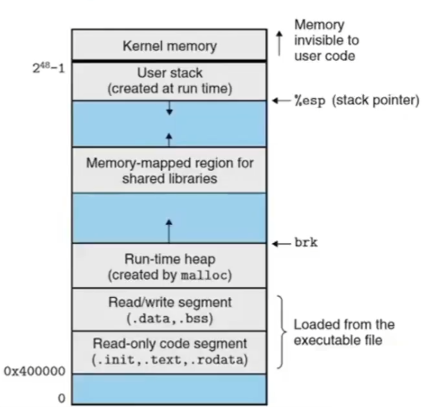

# Chapter 4 | Memory Model

```cpp
int i;  // global vars
static int j;  // static global vars

void f(){
    int k;  // local vars
    static int l;  // static local vars

    int *p = malloc(sizeof(int));  // allocated vars
}
```

- `p` 其实也是 local variable，但是 `p` 里面存了一个 `malloc` 出来的动态分配内存的地址。

---

## What are they in memory?



可执行文件是一个二进制文件。

系统分配了一个内存空间给可执行文件。

- `bss segment` 
    - 存放未初始化的全局变量和静态变量(也即隐式初始化)。
- `data segment` 
    - 存放已初始化的全局变量和静态变量。
    - 数据段属于静态内存分配,可以分为只读数据段和读写数据段。
- `code segment / text segment` 
    - 存放代码。
    - 这部分区域的大小在程序运行前就已经确定,并且内存区域通常属于只读, 在代码段中,也有可能包含一些只读的常数变量,例例如字符串常量等,但一般都是放在只读数据段中。
- `heap` 
    - 存放进程运行中被动态分配的内存段。
    - 它的大小并不固定,可动态扩张或缩减。
- `stack` 
    - local vars
    - 是用户存放程序临时创建的局部变量,也就是说我们函数括弧"{}" 中定义的变量(但不不包括 `static` 声明的变量, `static` 意味着在数据段中存放变量)。
    - 函数的返回值也会被存放回栈中。由于栈的先进先出特点,所以栈特别方便用来保存/恢复调用现场。从这个意义上讲,我们可以把堆栈看成一个寄存、交换临时数据的内存区。


```cpp
#include <cstdlib>
#include <iostream>

using namespace std;

int globalx = 10;

int main(){
    static int staticx = 3;
    int localx = 5;
    int *px = (int*)malloc(sizeof(int));

    cout << "&globalx = " << &globalx << endl;  // &globalx = 0x7ff70c4b9010 全局数据区
    cout << "&staticx = " << &staticx << endl;  // &staticx = 0x7ff70c4b9014 全局数据区
    cout << "&localx = " << &localx << endl;  // &localx = 0xdeca3ff82c  栈
    cout << "&px = " << &px << endl;  // &px = 0xdeca3ff820 栈
    cout << "px = " << px << endl;   // px = 0x28b3e831570 分配的指向的东西的地址 堆

    return 0;
}
```

---

## Global vars

- vars defined outside any function
- can be shared btw .cpp files
- extern

- `another.cpp`

```cpp
int globalx = 10;
double pi(){
    return 3.14;
}
```

- `main.cpp`

```cpp
#include <cstdlib>
#include <iostream>
using namespace std;

extern int globalx;
double pi();

int main(){
    cout << "globalx = " << globalx << endl;
    cout << "pi = " << pi() << endl;
}
```

- 在编译时需要使用 `g++ main.cpp another.cpp`，否则会报错 `undefined reference to 'globalx'`。
- 对于变量、函数都是一样的，有定义有声明才能使用。

---

### Extern

- extern is a declaration says there will be such a variable somewhere in the whole program
- "such a" means the type/name of the variable
- global variable is a definition, the storage place for that variable

---

## Static

- static global variable inhibits the access outside its .cpp file
- so as the static function

```cpp
static int globalx = 10;

static double pi(){
    return 3.14;
}
```

- 此时 `g++ main.cpp another.cpp` 会报错 `undefined symbols`
- 因为 `static` 关键字加了以后说明我现在定义的东西的作用域是本文件单元。

---

## Static local vars

- static local variable keeps its state in between multiple calls to its function
- is initialized at its first access

- key properties:
    - restricted access scope 作用域限制
    - persistent storage 存储永久性

```cpp
void access_count(){
    static int count = 0;

    cout << "access count: " << ++count << endl;
}

int main(){
    for(int i = 0; i < 10; ++i){
        access_count();
    }
}
```

**输出**：

```
access count: 1
access count: 2
access count: 3
access count: 4
access count: 5
access count: 6
access count: 7
access count: 8
access count: 9
access count: 10
```

- 放在全局数据区，持久性存储，是可以用来维护状态的，多次调用，可以保持住这个状态。
- 变量在内存中的区域决定了如何去用。

---

## Pointers to objects

```cpp
string s = "hello";  // 初始化
string *ps = &s;  // 指针指向东西的类型是 string，初始化绑了一个对象 s 的地址
```

- get the address `ps = &s;`
- get the object `(*ps).length();`
- call the function `ps->length();`

- `string s;`
    - `s` is the object itself
    - At this line, a string object is created and initialized
- `string *ps;`
    - `ps` is a pointer to an object
    - the object `ps` points to is not known yet

---

## Assignment

```cpp
string s1, s2;
s1 = s2;  // s1 is assigned the value of s2

string *ps1, *ps2;
ps1 = ps2;  // ps1 is assigned the address of what ps2 points to
```

- `s1 = s2` 是做了一个拷贝。
- `ps1 = ps2` 是地址的 copy ,也就是形成了一种共享，同时指向一个东西。

---

## Defining references

- References are a new data type in C++

```cpp
char c;  // a character
char *p = &c;  // a pointer to a character
char &r = c;  // a reference to a character
```

- 这样绑定之后,此时 `r` 和 `c` 在语义上就是同一个东西。
- `type& refname = name;`
    - For ordinary variable definition
    - An initial value is required
- `type& refname`
    - 只有两种情况可以省略: In parameter list or member variables
    - 函数的参数表以及 class 字段

    ```cpp
    // 函数参数中的引用在调用时由实参初始化，无需显式初始化。
    void modify(int& ref) {
        ref += 10; // ref 绑定到调用时传入的实参
    }

    int main() {
        int y = 20;
        modify(y); // ref 在调用时被初始化为y的别名
        return 0;
    }

    // 类的成员引用可以在声明时不初始化，但必须通过构造函数初始化列表初始化。
    class MyClass {
    public:
        int& ref; // 声明时未初始化
        MyClass(int& r) : ref(r) {} // 必须通过初始化列表初始化
    };

    int main() {
        int x = 5;
        MyClass obj(x); // obj.ref 绑定到x
        return 0;
    }
    ```

    - 因为这两个东西初始化的时机不是在写这句话的时候：函数调用才是初始化的时候，构造函数调用的时候才是初始化的时候。

```cpp
int X = 47;
// Y is a reference to X, X and Y now refer to the same variable
int &Y = X;

cout << "Y = " << Y << endl;  // prints Y = 47
Y = 18;
cout << "X = " << X << endl;  // prints X = 18
```

### Rules of references

- References must be initialized when created
- Initialization establishes a binding
    - In definition

    ```cpp
    int x = 3;
    int& y = x;
    const int& z = x;
    ```

    - As a function argument

    ```cpp
    void f(int& x) ;
    f(y);  // initialized when function is called
    ``` 

    例如:

    ```cpp
    #include <iostream>

    void f(int& x) {
        x = x + 10;
    }

    int main() {
        int y = 5;
        std::cout << "Before calling f(y), y = " << y << std::endl;

        f(y);

        std::cout << "After calling f(y), y = " << y << std::endl;

        return 0;
    }
    ```

    输出:

    ```cpp
    Before calling f(y), y = 5
    After calling f(y), y = 15
    ```

- Cannot rebind, unlike pointers (references 是不能重绑的)
- Assignment changes the referred object

```cpp
int& y = x;
y = z;  // Copy the value of z to y
```

```cpp
void f(int* x){
    (*x)++;
}

void g(int& x){
    x++;  // Same effect as in f()
}

int x;

int& h(){
    int q;
    // ! return q;  // Error
    return x;  // Safe, x lives outside this scope
}

int main(){
    int a = 0;
    f(&a);  // Ugly (but explicit)
    g(a);  // Clean (but hidden)
    h() = 16;
}
```

- The target of a non-const reference must be an lvalue.
- 左值：有明确内存地址的对象（例如变量、数组元素、解引用指针等）。
- 右值：临时对象或字面量（例如表达式结果、字面值、函数返回的临时对象等）。

```cpp
void func(int &);
func (i * 3);  // Warning or Error!
```

- 右值（如 `i * 3`）是一个临时对象，生命周期仅存在于表达式求值期间。如果允许非const引用绑定到右值，修改这个引用指向的值时，修改的是临时对象的值。然而，临时对象会立即被销毁，修改后的值无法被后续代码使用，导致逻辑错误。
- `const`引用（如 `const int&`）可以绑定到右值，因为它承诺不会修改引用的对象，从而避免了上述问题。更重要的是，C++标准规定：当 `const` 引用绑定到右值时，临时对象的生命周期会被延长到该引用的作用域结束。

```cpp
void func(const int &x) {
    // 可以读取x，但不能修改
    std::cout << x;  // 合法
}

int main() {
    func(i * 3);  // 合法：const引用可以绑定到右值
}
```

- 此时，`i * 3` 生成的临时对象会存活到 `func` 函数执行完毕，避免悬垂引用(临时对象在表达式结束后立即销毁。如果非 `const` 引用绑定到已销毁的临时对象，后续通过引用访问该对象会导致未定义行为（UB）。)。

---

### Type restriction

- No references to references
    - 引用不是一个健全的变量，不是一个独立存在的，要依赖于别人。因此双重引用是没有意义的。
- No pointers to references, but reference to pointer is ok
- No arrays of references

```cpp
int&* p;  // illegal
void f(int*& p);  // ok
```

#### Pointers vs. References

|Pointers|References|
|:---:|:---:|
|independent of the bound object, can be uninitialized|dependent on the bound object, just an alias, must be initialized|
|can be bound to a different object|can't be rebound|
|can be set to null|can't be null|

---

## Dynamic memory allocation

### `new` and `delete`

- new expression
    - `new int` returns a pointer to a newly allocated object of type `int`
    - `new Stash` returns a pointer to a newly allocated object of type `Stash`
    - `new int[10]` returns a pointer to a newly allocated array of 10 objects of type `int`
- delete expression
    - `delete p` deallocates the object pointed to by `p`
    - `delete[] p` deallocates the array of objects pointed to by `p`

- Similar to `malloc`, `new` is the way to allocate memory as a program runs. Pointers become the only access to that memory.
- Similar to `free`, `delete` enables you to return memory to the memory pool when you are finished with it.
- Besides that, `new` and `delete` ensure the right calling of Ctor/Dtor for objects.

---

### Dynamic arrays

- The `new` operator returns the address of the first element of the block.

`int *psome = new int[10];`

- The presence of the brackets tells the program that it should free the whole array, not just the element.

`delete[] psome;`

---

### Tips for new and delete

- Don't mix-use `new/delete` and `malloc/free` .
- Don't `delete` the same block of memory twice.
- Use `delete` (no brackets) if you've used `new` to allocate a single entity.
- Use `delete[]` if you've used `new[]` .
- `delete` the null pointer is safe (nothing happens).

---

```cpp
int *pa = new int(100);
cout << *pa << endl;

int *parr = new int[100];
for(itn i = 0; i < 10; ++i){
    parr[i] = i;
}

for(int i = 0; i < 10; ++i){
    cout << parr[i] << endl;
}
delete pa;
delete[] parr;
```

---

```cpp
struct Student{
    int id;
    Student(){
        id = 0;
        cout << "Student::Student(): id = " << id << endl;
    }
    ~Student(){
        cout << "Student::~Student(): id = " << id << endl;
    }
}

Student *ps1 = (Student*)malloc(sizeof(Student));
cout << "ps1->id = " << ps1->id << endl;
Student *ps2 = new Student();
cout << "ps2->id = " << ps2->id << endl;
free(ps1);
delete ps2;

Student *psarr = new Student[5];
for(int i = 0; i < 5; ++i){
    psarr[i].id = i;
}
delete[] psarr;
```

- 此时构造函数被调用了，析构函数被调用了。自动触发构造函数和析构函数的触发。
- new 和 delete 相当于多做了一步。
- 构造和析构的顺序是相反的。 中的局部对象通常存储在栈上，而栈是一种“后进先出”（LIFO）的数据结构。最后构造的对象会最先被析构，因为它在栈的顶部。
- 如果在 `delete[] psarr;` 使用的是 `delete`，那么会报错，因为用数组初始化和不是数组初始化时存的东西不一样。用 `delete` 在调用第一个析构函数后就会报错。

---

```cpp
int * a = new int[10];
delete[] a;
delete[] a;
```

- 每块内存的“所有权”应明确，释放后的内存不再属于程序，再次释放会破坏内存管理器的内部数据结构。堆管理器无法识别这块内存是否有效，导致**双重释放（double free）**错误，可能引发程序崩溃或内存损坏。

---

```cpp
int * a = new int[10];
delete[] a;
a = 0;  // or a = nullptr;
delete[] a;
```

- `delete[]` 的执行步骤:
    1. 检查指针是否为空：
        - 如果指针是 `nullptr`（如 `a = 0`），`delete[]` 直接返回，不执行任何操作。
        - 如果指针非空，继续执行释放逻辑。
    2. 调用析构函数（仅对类对象）。
    3. 调用析构函数（仅对类对象）。
    4. 标记内存为“未分配”：堆管理器更新内部数据结构，标记该内存块可重用。

??? question "My question about 为什么 delete 之后还能使用 a 并为 a 赋值"
    指针变量 `a` 是一个普通的变量，它的生命周期和作用域由声明的位置决定。`delete` 释放的是 `a` 指向的内存，而不是指针 `a` 本身。指针变量 `a` 仍然可以像其他变量一样被读取、赋值或修改。

---

*这不是标准定义的。*

```cpp
#include <iostream>
#include <cstdlib>
#include <thread>

using namespace std;

struct A {
    A() {cout << "A()" << endl; }
    ~A() {cout << "~A()" << endl;}
    int i;
}

int main(int argc, char ** argv){
    int size = 0;
    if (argc > 1) {
        size = atoi(argv[1]);
    }
    cout << "allocating " << size << " objects" << endl;
    A * pa = new A[size];

    size_t *pc = (size_t*)pa;
    cout << "Aha! ** " << *(pc - 1) << " ** guys hidden here!" << endl;

    delete[] pa;
}
```

输入:

1. `./a.exe`
2. `./a.exe 5`

输出:

1. 

```cpp
allocating 0 objects
Aha! ** 0 ** guys hidden here!
```

2. 

```cpp
allocating 5 objects
A()
A() 
A()
A()
A()
Aha! ** 5 ** guys hidden here!
~A()
~A()
~A()
~A()
~A()
```

---

## Constant

- declares a variable to have a constant value

```cpp
const int x = 123;
x = 27; // illegal!
x++; // illegal!
int y = x; // ok, copy const to non-const
y = x; // ok, same thing
const int z = y; // ok, const is safer
```

- Constants are like variables  作用域与普通变量相同
    - Observe scoping rules
    - Declared with `const` type modifier
- A const in C++ defaults to internal linkage
        - C++ 中的常量默认具有内部链接性（internal linkage），这意味着：常量仅在定义它的文件内可见且其他文件无法访问该常量。

        ```cpp
        // File1.cpp
        const int x = 10; // 内部链接性，仅在 File1.cpp 中可见

        // File2.cpp
        extern const int x; // 错误！x 在 File2.cpp 中不可见
        ```

    - the compiler tries to avoid creating storage for a const, holding the value in its symbol table. 
        - 默认情况下：常量通常不会分配独立的内存空间，而是将其值直接存储在符号表中。
    - extern forces storage to be allocated
        - 如果需要在多个文件中共享常量，可以使用 extern 关键字：强制编译器为常量分配存储空间，并将其链接性改为外部链接性。

        ```cpp
        // Constants.h
        extern const int globalConst; // 声明

        // Constants.cpp
        extern const int globalConst = 42; // 定义

        // Main.cpp
        #include "Constants.h"
        int main() {
            std::cout << globalConst << std::endl; // 输出 42
            return 0;
        }
        ```

---

### Compile time constants

- Compile time constants are entries in compiler symbol table, not really variables.

`const int bufsize = 1024;`

- Value must be initialized
- Unless you make an explicit extern declaration

---

### Run-time constants

- const value can be exploited

```cpp
const int class_size = 12;
int finalGrade[class_size]; // ok
int x;
cin >> x;
const int size = x;  // 这里只有运行输入后才知道，因此
double classAverage[size]; // error
```

- 对于 `const int size = x;` 这里只有运行输入后才知道，因此这里的变量是分了一块存储空间的。

---

### Pointers with `const`

`p: 0xaffefado` ==> `a: [53,54,55]`

```cpp
int a[] = {53,54,55};
int * const p = a; // p is const
*p = 20; // OK
p++; // ERROR
const int *p = a; // (*p) is const
*p = 20; // ERROR!
p++; // OK
```

- `p` is const，指针本身，即指向的地址不变，但是指针指向的对象可以变
- `*p` is const，指针指向的对象是常量，即指针指向的对象不能变

---

### What are these?

```cpp
string s( "Fred" );
const string* p = &s;
string const* p = &s;
string *const p = &s;
```

- 第一种与第二种是意义的，都是指向常量的指针
- 第三种是常量指针，即指针本身是常量，指向的对象可以变

---

### Pointers and constants

```cpp
int i;
const int ci = 3;
int* ip;
const int* cip;
ip = &i;
ip = &ci; // Error
cip = &i;
cip = &ci;
*ip = 54; // always legal
*cip = 54; // never legal
```

- 变量指针可以绑变量
- 变量指针不能绑常量
- 常量指针可以绑变量
- 常量指针可以绑常量

---

### String literals

```cpp
char s[] = "Hello, world!";
cout << s << endl;  // Hello, world!

s[0] = 'B';
cout << s << endl;  // Bello, world!

char *s = "Hello, world!";
cout << s << endl;  // Hello, world!

s[0] = 'B'; // Error!
```

- `s` is a pointer initialized to point to a string constant
- This is actually a `const char* s` but compiler accepts it without the const
    - 因为其实这个 `s` 是一个指针指向代码段，代码段是只读的
- Don't try to change the character values (undefined behavior)

---

```cpp
int main(){
    const char *s1 = "Hello, world!";
    const char *s2 = "Hello, world!";
    char s3[] = "Hello, world!";

    cout << (void*)s1 << endl;  // 0x10aa50f78
    cout << (void*)s2 << endl;  // 0x10aa50f78
    cout << (void*)s3 << endl;  // 0x7ff7b54b229a
    cout << (void*)main << endl;  // 0x10aa58ce0
}
```

- 可以看到同样的字符串，编译器会分配相同的内存地址

---

### Conversions

- Can always treat a non-const value as const

```cpp
void f(const int* x); 
int a = 15;
f(&a); // ok
const int b = a;
f(&b); // ok
b = a + 1; // Error!
```

- You cannot treat a `constant` object as `nonconstant` without an explicit cast `const_cast`
- 在 C++ 中，`const_cast` 是一种用于修改对象的 `const` 或 `volatile` 属性的类型转换运算符。它的主要用途是移除或添加 `const` 或 `volatile` 限定符。

1. 移除 `const` 限定符

```cpp
const int x = 10;
int* y = const_cast<int*>(&x); // 移除 const 限定符
*y = 20; // 未定义行为！修改 const 对象的值
```

!!! info "ATTENTION"
    虽然语法上允许，但修改 const 对象的值是未定义行为（UB），可能导致程序崩溃或数据损坏。

2. 添加 `const` 限定符

```cpp
int x = 10;
const int* y = const_cast<const int*>(&x); // 添加 const 限定符
// *y = 20;         // 错误！不能通过 const 指针修改值
```


---

**Passing by const value?**

```cpp
void f1 (const int i) {
 i++; // illegal: compile-time error
}
```

---

**Returning by const value?**

```cpp
int f3() { return 1; }
const int f4() { return 1; }
int main() {
 const int j = f3(); // works fine
 int k = f4(); // this works fine too
}
```

---

### Passing addresses

- Passing large objects are expensive.
- Better to pass by address, using a pointer or a reference.
- Make it `const` whenever possible to prevent unexpected modification.

```cpp
struct Student{
    int id;
    char address[1000];
};

void foo1(Student s);

void foo2(const Student* ps){
    cout << ps->id << endl;
}

void bar(const Student& s){
    cout << s.id << endl;
}

int main();

- 对于 `foo1` 传递的代价很大，因为是 `copy` 传递，要传递一个 `int` 与 一个 `char` 。
- 对于 `foo2` 用指针传递，加上 `const` 限定符，防止意外修改。代价很小，因为指针就是 8 个字节的大小。
- 对于 `bar` 用引用传递，加上 `const` 限定符，防止意外修改。代价上与指针没什么区别，但可以更方便的访问成员变量。

---

## Further reading

<div class="card file-block" markdown="1">
<div class="file-icon"></div>
<div class="file-body">
<div class="file-title"> Effective C++__Item-16 </div>
<div class="file-meta"> 96 KB / 2025-03-12</div>
</div>
<a class="down-button" target="_blank" href="/Notebook/Computer_Science/OOP/Further_reading/[Further Readings] Effective C++__Item-16.pdf" markdown="1">:fontawesome-solid-download: 下载</a>
</div>

---