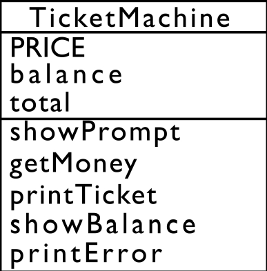
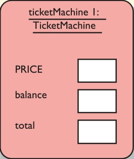
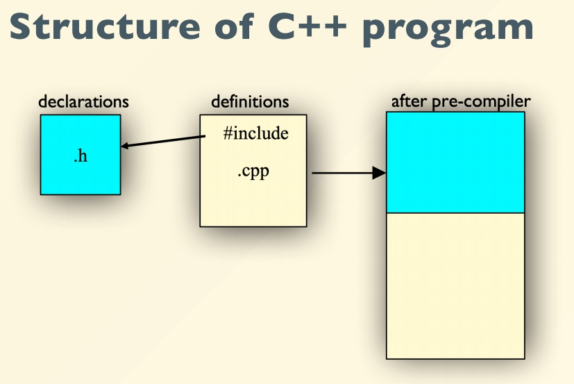
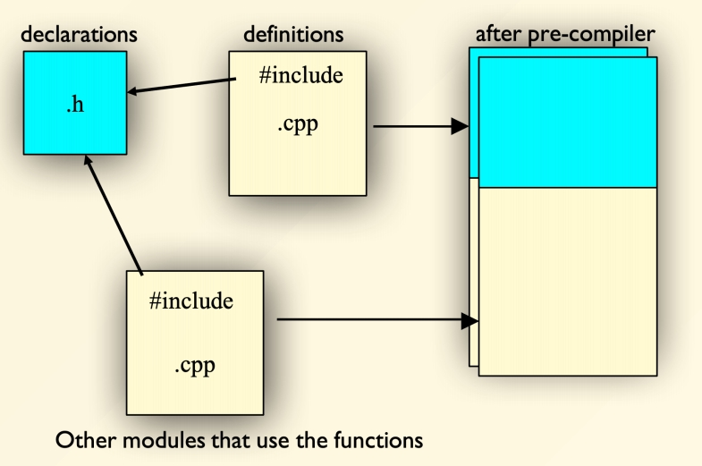
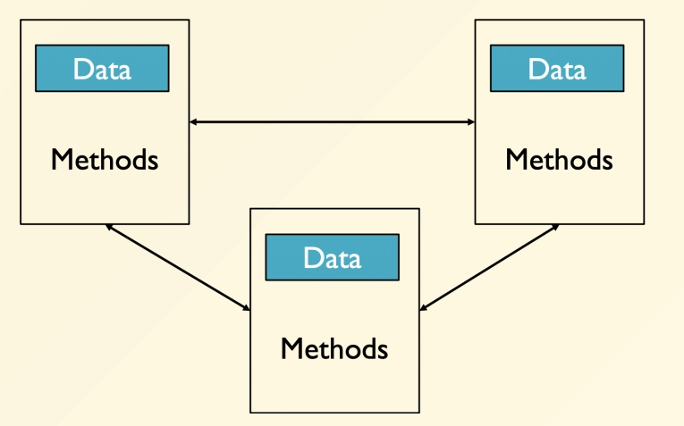
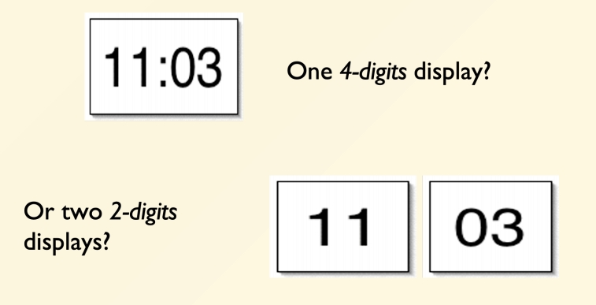
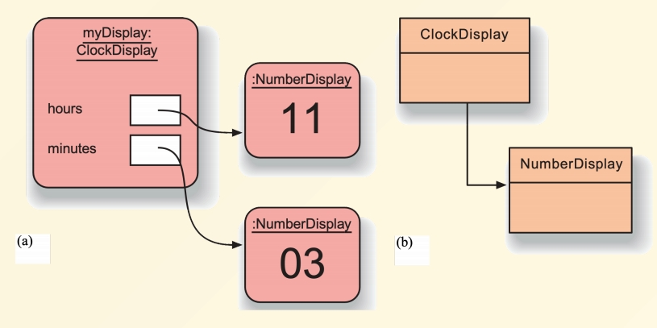
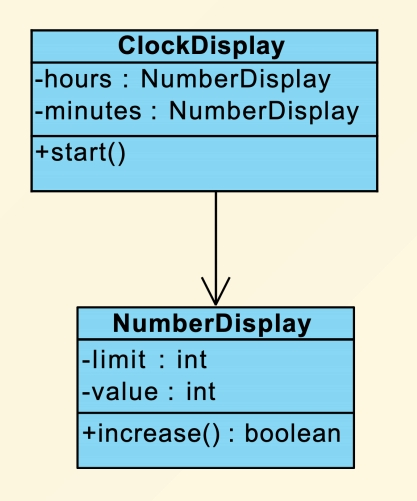

# Chapter 5 | Class

Class 是 OOP 里面最基本的设计单元，它将数据和方法封装在一起，从而实现面向对象编程。

```cpp
#include <iostream>
using namespace std;

int px,py;

int main(){
    px = 2, py = 3;
    cout << "Point at [" << px << "," << py << "]" << endl;

    px += 5, py += 5;
    cout << "Point at [" << px << "," << py << "]" << endl;
}
```

这个背后其实已经有很多抽象在里面。

machine code(memory, register, ALU) -> circuit(集成电路，硬件上的实现)

每一层都是 Abstraction Barrier，每一层都屏蔽了下一层的细节，只暴露出自己需要的接口。

---

## Encapsulation in C

```cpp
#include <iostream>
using namespace std;

struct Point;
// Point* point_create();
void point_init(Point *p, int ix, int iy);
void point_print(Point *p);
void point_move(Point *p, int dx, int dy);

// ----------------------------------------

struct Point{
    int x,y;
};

void point_init(Point *p, int ix, int iy){
    p->x = ix;
    p->y = iy;
}

void point_print(Point *p){
    cout << "Point at [" << p->x << "," << p->y << "]" << endl;
}

void point_move(Point *p, int dx, int dy){
    p->x += dx;
    p->y += dy;
}

int main(){
    Point p;
    point_init(&p, 2, 3);
    point_print(&p);
    point_move(&p, 5, 5);
    point_print(&p);
}
```

- 分割线上面的东西是和用户打交道的接口，分割线下面的东西属于实践细节
- 数据和操作绑在一块就是封装，也就是 OOP

---

## C++ version

```cpp
#include <iostream>
using namespace std;

struct Point{
private:
    int x,y;
public:
    void init(int ix, int iy){
        x = ix;
        y = iy;
    }
    void print(){
        cout << "Point at [" << x << "," << y << "]" << endl;
    }
    void move(int dx, int dy){
        x += dx;
        y += dy;
    }
};

int main(){
    Point p;
    p.init(2, 3);
    p.print();
    p.move(5, 5);
    p.print();
}
```

1. 隐含的 `this` 指针
    - 在C++中，成员函数（类或结构体的方法）隐含了一个指向当前对象的指针参数 this。
    - 当调用成员函数时（例如 `p.move(2, 3)`），编译器会自动将调用对象的地址（即 `&p`）作为隐式参数 `this` 传递给函数。在函数内部，所有对成员变量（如 `x`、`y`）的访问实际上是通过 `this->x` 和 `this->y` 实现的，但代码中可以直接简写为 `x` 和 `y`。
2. `private` 说明对数据进行私有化，不能够直接访问，只能通过 `public` 开放的方法来访问处理。可以维护数据的安全性。
    - 此时 `p.x = 3;` 是错误的，因为 `x` 是 `private` 的。
3. `data member` 和 `member function` 是绑定在一起的。

---

### about `protected` and `private`

1. **`private`成员**：
    - 仅能被**本类的成员函数**和**友元**访问。
    - **派生类无法直接访问**基类的`private`成员。

2. **`protected`成员**：
    - 允许**本类的成员函数**、**友元**，以及**派生类的成员函数**访问。
    - 派生类可以直接访问基类的`protected`成员，但无法访问其他不相关对象的`protected`成员。

---

**Example**:

```cpp
class Base {
private:
    int a;      // 仅Base内部可访问
protected:
    int b;      // Base及其派生类可访问
public:
    int c;      // 完全公开
};

class Derived : public Base {
    void func() {
        // a = 1;  // 错误：基类private成员不可访问
        b = 2;    // 正确：基类protected成员可访问
        c = 3;    // 正确：基类public成员可访问
    }
};
```

---

### 关键细节

- **继承方式的影响**：
    - 若使用`private`或`protected`继承，基类的`public`和`protected`成员在派生类中的访问权限会被降级：

    ```cpp
    class Derived : private Base {
        // Base的public和protected成员在此变为private
    };
    ```

  - 但`protected`和`private`本身的区别仍不变：基类的`private`成员始终对派生类不可见。
- **外部类和对象**：
    - 非友元的外部类或函数**无法直接访问**`protected`或`private`成员。
    - 派生类**只能访问自身继承的`protected`成员**，不能通过其他基类对象访问：

    ```cpp
    void Derived::modify(Base& other) {
        other.b = 10; // 错误：不能访问其他对象的protected成员
    }
    ```

- **通过派生类的其他实例访问（同类型对象）**:

```cpp
class Derived : public Base {
public:
    void modifyOtherDerived(Derived& other) {
        other.b = 20; // 合法：访问同类型对象的 protected 成员
    }
};
```

- **允许**：因为 `Derived` 和 `other` 是同一类型，共享相同的访问权限。

---

```cpp
#include <iostream>
#include <random>
#include <cmath>
using namespace std;

struct Point{
private:
    int x,y;
public:
    void init(int ix, int iy){
        x = ix;
        y = iy;
    }
    void print(){
        cout << "Point at [" << x << "," << y << "]" << endl;
    }
    void serialize(){
        cout << x << " " << y << endl;
    }
    void move(int dx, int dy){
        x += dx;
        y += dy;
    }
};

int main(){
    const double PI = 3.14;
    default_random_engine gen;
    uniform_real_distribution<double> dis;
    
    for(int i = 0; i < 100; i++){
        Point p;
        p.init(0, 0);

        double a = 2 * PI * dis(gen);
        double r = 100;
        p.move(r * cos(a), r * sin(a));
        p.serialize();
    }
}
```

- 在命令行中输入 `g++ main.cpp; ./a.exe > points.txt`，将数据写入 `points.txt` 文件中。
- 再进行可视化。

```python
import matplotlib.pyplot as plt

x_coords = []
y_coords = []

with open("points.txt", "r") as file:
    for line in file:
        x, y = map(int, line.strip().split())
        x_coords.append(int(x))
        y_coords.append(int(y))

plt.scatter(x_coords, y_coords, alpha=0.5)
plt.axis('equal')
plt.show()
```

- 做出一百个点，把它们随机洒到不同位置。
- `default_random_engine gen` 默认随机数引擎，用于生成随机数种子。
- `uniform_real_distribution<double> dis` 均匀分布对象，默认生成 `[0, 1)` 范围内的浮点数。

---

## Objects = Attributes + Services

- Data: the properties, or status
- Operations: the functions

---

## Class Diagram & Object Diagram

### 类图

类图是 UML（统一建模语言） 中的一种结构图，用于描述系统中的类（Class）、接口（Interface）、协作（Collaboration）以及它们之间的 静态关系。

- 核心元素：
    - 类：用矩形框表示，包含类名、属性（成员变量）和方法（成员函数）。



- 最上面是类的名字。
- 上半部分是数据字段。
- 下半部分是操作。

---

### 对象图

对象图是类图的实例化，展示系统在某一时刻的对象（Object）及其之间的链接（Link），是类图的运行时快照。

- 核心元素：
    - 对象：用矩形框表示，格式为 对象名: 类名（如 student1: Student）。
    - 属性值：对象的具体状态（如 name = "Alice"）。
    - 链接：对象之间的关联实例。



---

### Turn it into code

```cpp
class TicketMachine {
public:
    void showPrompt();
    void getMoney();
    void printTicket();
    void showBalance();
    void printError();
private:
    const int PRICE;
    int balance;
    int total;
};
```

---

## Object vs. Class

- Objects (cat)
    - Represent things, events 对象是对现实世界实体（如一只猫、一次用户操作）的抽象。
    - Respond to messages at run-time 对象通过方法（成员函数）响应外部操作（消息）。
- Classes (cat class)
    - Define properties of instances 类规定了对象的内部状态（成员变量）和功能（成员函数）。
    - Act like native-types in C++ 类可以像 `int`、`double` 等原生类型一样声明变量、传参或作为返回值。

---

## Definition of a Class

- In C++, separated header and source files are used to define one class.
- Class declaration and member function prototypes are in the `.h` header file.
- All the function bodies (implementations) are in the `.cpp` source file.
- PImpl technique(https://en.wikipedia.org/wiki/Opaque_pointer#C++) : debatable, hides private members and removes compilation dependency. 把私有的东西进一步藏掉。

---

- `point.h`

```cpp
#ifndef __POINT_H__
#define __POINT_H__

struct Point{
private:
    int x,y;
public:
    void init(int ix, int iy);
    void print();
    void move(int dx, int dy);
};

#endif
```

- `point.cpp`

```cpp
#include "point.h"
#include <iostream>
using namespace std;

void Point::init(int ix, int iy){
    x = ix;
    y = iy;
}

void Point::print(){
    cout << "Point at [" << x << "," << y << "]" << endl;
}

void Point::move(int dx, int dy){
    x += dx;
    y += dy;
}
```

!!! info "ATTENTION"
    如果不加 `Point::` 前缀，编译器会认为这三个函数是全局函数，而不是 `Point` 类的成员函数。加了 `Point::` 前缀，表示这是 `Point` 类的成员函数，而不是全局函数。

- `main.cpp`

```cpp
#include "point.h"

int main(){
    point p;
    p.init(2, 3);
    p.print();
    p.move(5, 5);
    p.print();
}
```

---

## :: resolver

- `<Class Name>::<function name>`
- `::<function name>`

```cpp
void S::f() {
    ::f(); // Would be recursive otherwise!
    ::a++; // Select the global 'a'
    a--; // The 'a' at class scope
}
```

- `::f();` 表示调用全局函数 `f()`
- `f();` 默认是递归调用，即调用 `S::f()`
- `::a++;` 表示调用全局变量 `a`
- `a--;` 表示调用类 `S` 的成员变量 `a`

---

## Compilation unit

- A `.cpp` file is a compile unit
    - The compiler sees only one `.cpp` file and generates a corresponding `.obj` file.
- The linker links all `.obj` files into one executable file.
- To provide information across `.cpp` files, use `.h` file.

---

### Header = interface

- The header is a contract between the author and the user of the code.
    - declaration of functions, classes, variables, etc.
    - all definitions go to .cpp files.
- The compiler enforces the contract.





---

### `#include`

- `#include` is to insert the content of header file into the `.cpp` file, right at where the `#include` statement is.
    - `#include "xx.h"` : usually search in the current directory, implementation defined
    - `#include <xx.h>` : search in the specified directories, depending on your development environment.

---

## Header guard

- `point.h` 中添加

```cpp
int global = 3;
```

则会出现 dupicate definition 错误，因为 `global` 被定义了两次，一次在 `point.h` 中，一次在 `main.cpp` 中。

- `point.h` 改成这样即可。

```cpp
extern int global;
```

- `point.cpp`

```cpp
int global = 3;
```

---

## Standard header file structure

- `LineSegment.h`

```cpp
#ifndef __LINESEGMENT_H__
#define __LINESEGMENT_H__

#include "point.h"

struct LineSegment{
private:
    Point begin, end;
};

#endif
```

- `main.cpp`

```cpp
#include "point.h"
#include "LineSegment.h"

int main(){
    Point p;
    p.init(2, 3);
    p.print();
    p.move(5, 5);
    p.print();
}
```

- 当没有加上 `#ifndef` 和 `#endif` 时，`LineSegment.h` 和 `main.cpp` 中都定义了 `Point`，会出现 `redefinition of Point` 错误。
- 当 `main.cpp` 同时包含 `point.h` 和 `LineSegment.h` 时：
    - 第一次处理 `#include "point.h"`：定义 `__POINT_H__`，加载 `Point`。
    - 第二次处理 `#include "LineSegment.h"` → 其内部 `#include "point.h"` 时，由于 `__POINT_H__` 已定义，跳过重复加载，但 `Point` 的定义依然可用。

---

### Tips for header

- One class declaration per header file
- Same name with the .cpp file.
- Contents surrounded by the safe guard.

---

## Cmake

- The CMake utility
    - cross-platform, free, and open-source
    - build automation, testing, packaging and installation
    - it is not a build system itself; it generates another system's build files.

在命令行中输入

```bash
vim CMakeLists.txt
```

- `CMakeLists.txt`

```cmake
cmake_minimum_required(VERSION 2.8.9)
project(hello)
add_executable(hello main.cpp point.cpp)
```

- 再在命令行中输入

```bash
mkdir build
cd build
cmake ..
```

- `cmake ..` 会在 `build` 文件夹中生成 `Makefile` 文件、`CMakeCache.txt` 文件和 `CMakeFiles` 文件夹。
- `cmake` 其实是更上一层的构建，会帮你生成可以编译的 `Makefile` 文件。
- 接着，在命令行中输入

```bash
make
```

- `make` 会根据 `Makefile` 文件中的内容，生成可执行文件 `hello`。
- 运行 `./hello`，即可以得到输出结果
- 项目比较大的时候可以使用 `CMakeLists.txt` 文件来管理项目。

---

## OOP Characteristics

- Everything is an object.
- A program is a bunch of objects telling each other what to do by sending messages.
- Each object has its own memory made up of other objects.
- Every object has a type.
- All objects of a particular type can receive the same messages.

---

### Object-oriented programming

- Objects (agents) send and receive messages!



---

### Message communication

- Messages are
    - Composed by the sender
    - Interpreted by the receiver
- Messages
    - May return results
    - May cause receiver to change state, i.e., side effects
- Implemented as method calls

---

### Encapsulation

- Bundle data and methods together
- Hide the details of dealing with the data
- Restrict access only to the publicized methods

---

### Abstraction

- Abstraction is the ability to ignore details of parts to focus on high-level problems.
- Modularization is the process of dividing a whole into parts that can be built separately and interact in well-defined ways.

e.g. Clock display


- Modularizing the clock display



- Objects & Classes



- Class diagram



---

## Ctor and Dtor

- 对于 `main.cpp` 中的 `p.init()` 是需要显示调用的初始化，很容易被用户忘记。如果忘记了，那么 `p` 里面的数据就会是未定义的，十分 random。
- 对于 `VC6`，会在没有初始化的变量中自动填写一些值。没有初始化的内存会被自动填写，堆上为 `0xCC`，栈上为 `0xCD` 。

```python
b'\xcc\xcc'.decode('gbk')
```

- 会得到 `烫`

```python
(b'\xcc'*100).decode('gbk')
```

- 会得到 `烫烫...烫`

```python
(b'\xcd'*100).decode('gbk')
```

- 会得到 `屯屯...屯`

---

### Guaranteed initialization

- With a constructor (ctor)
    - the compiler ensures its call when an object is created.
    - use the name as the class.

---

#### How does a ctor work?

```cpp
class X {
    int i;
public:
    X(); // constructor
};

void f(){
    X a; // a.X() is called
}
```

- 构造函数（Constructor）
    - 在对象创建时自动调用，用于初始化对象的成员变量。
    - 确保对象在创建后处于合法、可用的初始状态。
    - 命名与类名相同，无返回类型（包括 `void`）。
    - 可以重载（支持多个构造函数，参数不同）。
- 析构函数（Destructor）
    - 在对象销毁时自动调用，用于释放对象占用的资源（如内存、文件句柄等）。
    - 防止内存泄漏或资源未释放。
    - 命名格式为 `~类名`，无返回类型和参数。
    - 不可重载（一个类只能有一个析构函数）。
    - 基类的析构函数通常声明为 `virtual`（确保多态对象正确释放）。
    - `return` 时，析构函数会自动调用。

---

```cpp
#include <iostream>
using namespace std;

struct Y {int i ; float f; Y(int a){i = a}};

int main(){
    Y y1[] = {Y(2), Y(1)}; // legal
    Y y1[3] = {Y(2), Y(3)}; // illegal, no matching initialization of initializer list
}
```

- 可以理解为编译器自动填写为 `Y y1[3] = {Y(2), Y(3), Y()};`
- 需要增加一个不带参数的版本 `struct Y {int i ; float f; Y(int a){i = a}; Y(){} };`
- 一个构造器都没有的时候，例如这样 `struct Y {int i ; float f; };` ，编译器会自动写一个无参构造器。

---

## Further reading

<div class="card file-block" markdown="1">
<div class="file-icon"></div>
<div class="file-body">
<div class="file-title"> Opaque pointer - Wikipedia </div>
<div class="file-meta"> 405 KB / 2025-03-17</div>
</div>
<a class="down-button" target="_blank" href="/Notebook/Computer_Science/OOP/Further_reading/[Further Readings] Opaque pointer - Wikipedia.pdf" markdown="1">:fontawesome-solid-download: 下载</a>
</div>

---