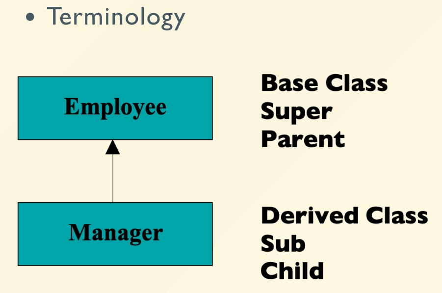

# Chapter 6 | Ctor/Dtor && Composition & Inheritance

- 全局变量: 在 main 开始先就执行了 constructor， main 结束才执行 destructor
- 静态变量: 使用时才执行 constructor ， main 结束才执行 destructor
- 局部变量: 在函数调用时才执行 constructor ，在函数结束时才执行 destructor
- 动态变量: 在 new 时才执行 constructor ，在 delete 时才执行 destructor

---

## RAII

- Resource acquisition is initialization 
    - Build the life cycle of a resource to the lifetimeof an object
    - Acquire resources in Ctor
    - Release resources in Dtor

把资源的生命周期和对象的生命周期绑定在一起，因为手动管理资源容易出错。

```cpp
std::mutex m;

void bad(){
    m.lock();
    if(!everything_ok()){
        return; // early return without mutex release
    }
    m.unlock();
}

void good(){
    std::lock_guard<std::mutex> lk(m);
    if(!everything_ok()){
        return; // unlock() called automatically
    }
} // unlock() called automatically
```

- 有关文件的读取：ofstream 会自己关闭文件，这也是 RAII 的一个例子

---

## Initializer list

- 真正的初始化时机其实是在初始化列表里面的

```cpp
class Point {
private:
    const float x, y;
public:
    Point(float xa, float ya): y(ya), x(xa) {}
};
```

- Do not perform assignment within ctor's body
- Order of initialization is order of declaration
    - Not the order in the initializer list!
    - Destroyed in the reverse order.

```cpp
#include <iostream>
using namespace std;

struct X {
    int y;
    X(){
        y = 10;
        cout << "X::X()" << endl;
    }
};

int main(){
    X x;
}
```

- 下面这个是初始化列表，加上自定义的类型

```cpp
#include <iostream>
using namespace std;

struct Y {
    int i;
    Y(int ii){
        i = ii;
        cout << "Y::Y(int)" << endl;
    }
};

struct X {
    Y y;
    X() : y(10) {
        cout << "X::X()" << endl;
    }
};

int main(){
    X x;  // Y::Y(int) X::X()
}
```

- 但是如果改成

```cpp
#include <iostream>
using namespace std;

struct Y {
    int i;
    Y(int ii){
        i = ii;
        cout << "Y::Y(int)" << endl;
    }
};

struct X {
    Y y;
    X() {
    //X() : y(10) {
        y = 10;
        cout << "X::X()" << endl;
    }
};

int main(){
    X x;
}
```

- 就会报错，报错原因是 y 没有一个 default constructor.
- 因为对于一个自定义类型来说 `y=10` 这句话已经不是初始化了，而是赋值。
- 它真正的初始化是在初始化列表，也即 `X()` 这句话这里，相当于在做 `X() : y()` ，而 y 没有默认构造函数，所以报错。
- 可以像如下这样更改。也就是定义一个默认构造函数，这样就可以正常初始化了。

```cpp
#include <iostream>
using namespace std;

struct Y {
    int i;
    Y(int ii){
        i = ii;
        cout << "Y::Y(int)" << endl;
    }
    Y(){
        cout << "Y::Y()" << endl;
    }
};

struct X {
    Y y;
    X() {
        y = 10; // 相当于隐式构造Y的对象，然后赋值。也即 y = Y(10);
        cout << "X::X()" << endl;
    }
};

int main(){
    X x;  // Y::Y() Y::Y(int) X::X()
}
```

- 因为是单参数，可以隐式构造，如果不想隐式构造可以显式构造，如下所示。这样就会报错。

```cpp
#include <iostream>
using namespace std;

struct Y {
    int i;
    explicit Y(int ii){
        i = ii;
        cout << "Y::Y(int)" << endl;
    }
    Y(){
        cout << "Y::Y()" << endl;
    }
};

struct X {
    Y y;
    X() {
        y = 10;
        cout << "X::X()" << endl;
    }
};

int main(){
    X x;
}
```

---

### Initialization vs. assignment

- `Student::Student(string s) : name(s) {}`
    - initialization before constructor body
    - explicit initialization
- `Student::Student(string s) { name = s; }`
    - assignment inside constructor body
    - implicit initialization + assignment
    - string must have a default constructor

---

## Local variable vs. Field

```cpp
int TicketMachine::refundBalance() {
    int amountToRefund;
    amountToRefund = balance;
    balance = 0;
    return amountToRefund;
}
```

**Lifetime:**

- `amountToRefund` is with the function call
- `balance` is with the object, i.e., object state

**But how is the access to balance achieved?**

```cpp
#include <iostream>
using namespace std;

struct X {
    int i;
    double d;
    void foo(){
        cout << "&i = " << &i << endl;
        cout << "&d = " << &d << endl;
    }
};

int main(){
    X x1;
    X x2;
    cout << "&x1 = " << &x1 << endl;
    x1.foo();
    cout << "&x2 = " << &x2 << endl;
    x2.foo();
}
```

输出：

```bash
&x1 = 0xaba37ffc30
&i = 0xaba37ffc30
&d = 0xaba37ffc38
&x2 = 0xaba37ffc20
&i = 0xaba37ffc20
&d = 0xaba37ffc28
```

- `int` 是四个字节，但是偏移了八个字节，是因为 `double` 是八个字节，涉及到内存对齐的问题，要取最小公倍数。

那么这里它是如何知道是 `x1` 的 `i` 还是 `x2` 的 `i` 呢？

- 因为这里其实是 `void foo(X * this)`.
- `foo()` 函数的 `this` 指针指向 `x1` 和 `x2` 的地址，所以 `&i` 和 `&d` 的地址是相对于 `this` 指针的偏移量。

```cpp
#include <iostream>
using namespace std;

struct X {
    int i;
    double d;
    void foo(){
        cout << "&this = " << this << endl;
        cout << "&i = " << &this->i << endl;
        cout << "&d = " << &this->d << endl;
    }
};

int main(){
    X x1;
    X x2;
    cout << "&x1 = " << &x1 << endl;
    x1.foo();
    cout << "&x2 = " << &x2 << endl;
    x2.foo();
}
```

输出：

```bash
&x1 = 0x4a42fffd00
&this = 0x4a42fffd00
&i = 0x4a42fffd00
&d = 0x4a42fffd08
&x2 = 0x4a42fffcf0
&this = 0x4a42fffcf0
&i = 0x4a42fffcf0
&d = 0x4a42fffcf8
```

**字段（Fields）**，也称为**数据成员**，是面向对象编程中类的核心组成部分，用于描述对象的属性和状态。

### 1. **定义位置：在构造器和方法之外声明**
   - 字段直接在类的内部定义，**不在任何方法、构造器或代码块内部**。例如：
     ```java
     public class Person {
         // 字段声明在类内部，方法/构造器外部
         private String name; // 字段
         private int age;    // 字段
        
         public Person(String name, int age) { // 构造器
             this.name = name;
             this.age = age;
         }
        
         public void celebrateBirthday() { // 方法
             this.age++; // 访问字段
         }
     }
     ```

### 2. **作用：存储对象的持久化数据**
   - 字段保存对象的**状态**，其数据在对象的整个生命周期内（从创建到销毁）持续存在。  
   - 例如，`Person` 对象的 `name` 和 `age` 字段会一直记录该人的姓名和年龄，直到对象被销毁。

### 3. **类作用域（Class Scope）**
   - **在整个类中可访问**：类的任何方法、构造器或其他代码块都可以直接使用字段（受访问修饰符限制）。  
   - **与局部变量的区别**：局部变量在方法内定义，仅在该方法执行期间存在；字段属于对象，生命周期与对象一致。

### 4. **字段 vs 局部变量**
   | **特性**         | 字段（Field）                  | 局部变量（Local Variable）       |
   |:----------------:|:-----------------------------:|:-------------------------------:|
   | **声明位置**      | 类内部，方法/构造器外部        | 方法、构造器或代码块内部        |
   | **生命周期**      | 与对象共存亡                   | 随方法/代码块执行结束而销毁     |
   | **初始化**        | 自动赋予默认值（如int为0）     | 必须显式初始化后才能使用        |
   | **作用域**        | 整个类内部                     | 仅限于声明它的方法/代码块内     |

---

## Const member functions

```cpp
#include <iostream>
using namespace std;

Struct X{
    void foo(){
        cout << "This is foo" << endl;
    }
    void foo() const{
        cout << "This is foo const" << endl;
    }
};


int main(){
    X x;
    x.foo();
    const X cx;
    cx.foo();
}
```

输出：

```bash
This is foo
This is foo const
```

- Cannot modify the objects

```cpp
void Date::set_day(int d) {
    day = d; // ok, non-const so can modify
}
int Date::get_day() const {
    day++; // ERROR: modifies data member
    set_day(12); // ERROR: calls non-const member
    return day;
}
```

---

## Constant members in class

- has to be initialized in the ctor's initializer list.

```cpp
#include <iostream>
using namespace std;

struct X{
    const int i;
    X(){
        i = 0; // ERROR: can't modify const
    }
};

int main(){
    X x;
}
```

---

## Static members

```cpp
struct X{
    static void f(); // declaration
    static int n; // declaration
};

int X::n = 7; // definition

void x::f(){ // definition
    n = 1; //X::n is accessible
}
```

- 定义函数的时候不用加 static 关键词，写在外面就行。

---

```cpp
#include <iostream>
using namespace std;

struct A{
    int data;
    A(){ data = 0;}
    void setdata(int i){ data = i;}
    int print(){ cout << data << endl;}
};

int main(){
    A a,b;
    a.setdata(20);
    a.print();
    b.print();
}
```

输出：

```bash
20
0
```

- 当加上 static 后

```cpp
#include <iostream>
using namespace std;

struct A{
    int mi;
    static int data;
    A(){ data = 0;}
    void setdata(int i){ data = i;}
    int print(){ cout << data << endl;}
    static void foo(int ii){ cout << ii << "," << data << endl; }
    static void foo1(int ii){ cout << ii << "," << mi << endl; } // ERROR: can't access non-static member
};

int A::data = 0;

int main(){
    A a,b;
    a.setdata(20);
    a.print();
    b.print();

    cout << A::data << endl;

    A::foo(30);
}
```

输出：

```bash
20
20
20
30,20
```

- static 的东西是全局数据局的，所有对象共享。这个 data 不依赖于任何对象。
- `mi` 相当于是 `this->mi` ，但是 static function 没有 this，不跟任何对象绑定，也就没有 this 指针。

---

## Inline

- An inline function is expanded in place, like a preprocessor macro in C, so the overhead of the function call is eliminated.
- Much safer than macro. It checks the types of the parameters, and has no dangerous side effect.

```cpp
// original
inline int f(int i) {
    return i * 2;
}
int main() {
    int a = 4;
    int b = f(a);
}

/* ------------------ */

// expanded

int main() {
    int a = 4;
    int b = a + a;
}
```

- Trade off : Expand the code size but deduces the function call overhead, so it gains speed at the expenses of space.

---

### Inline or not?

- inline
    - small functions, 2 or 3 lines
    - frequently called functions, e.g. inside loops
- not inline?
    - very large functions, say, more than 20 lines
    - recursive functions

---

### Inline may not in-line

- The compiler does not have to honor yourrequest to make a function inline.
- It might decide the function is too large or noticethat it calls itself, or the feature might not be implemented for your particular compiler.
- Nowadays, the keyword inline for functions comes to mean "multiple definitions are permitted" rather than "inlining is preferred".

---

### Inline inside class

Any function you define inside a class declaration is automatically an inline.

```cpp
class Cup {
    rgb color;
public:
    rgb getColor() { return color; }
    void setColor(rgb color) { this->color = color; }
};
```

---

### Inline functions in header file

- Put inline function’s body in header file.Then `#include` it where the function is needed.
- Never be afraid of multi-definition of inline functions.

---

## Composition

- Ways of composition
    - Direct, owns
    - By reference, shares
- The relationship of has-a

---

### Example

```cpp
class Person { … };
class Currency { … };
class SavingsAccount {
public:
    SavingsAccount(
    const string& name,
    const string& address,
    int cents);
    ~SavingsAccount();
    void print();
private:
    Person m_saver;
    Currency m_balance;
};

SavingsAccount::SavingsAccount(
const string& name, const string& address, int cents): m_saver(name, address),  m_balance(0, cents) {}

void SavingsAccount::print()
{
    m_saver.print();
    m_balance.print();
}
```

- Initializer list on Constructor
    - any number of objects separated by commas
    - provide arguments to sub-constructors
- Must be initialized
    - The default constructor is called if no explicit initialization

---

#### A nonobvious problem

- default constructors would be called.

```cpp
SavingsAccount::SavingsAccount(
const string& name, const string& address, int cents) {
    m_saver.set_name( name );
    m_saver.set_address( address );
    m_balance.set_cents( cents );
}
```

---

## Inheritance

- Inheritance: clone an existing class and extend it.
- The relationship of is-a

- An essential component of the OO design methodology.
- Allows sharing of design for
    - data members
    - member functions
    - interfaces



---

## Difference between Composition and Inheritance

```cpp
#include <iostream>
using namespace std;

struct A{
    int x, y;
};

struct B{
    A a;
};

struct C : public A{
};

int main(){
    B b;
    b.a.x; // 要访问A的成员，必须通过A的引用
    C c;
    c.x; // 直接访问A的成员
}
```

---

## Scopes and access in C++

```cpp
struct Base{
public:
    Base() : data(10) { cout << "Base::Base()" << endl; }
    ~Base() { cout << "Base::~Base()" << endl; }
    void print(){ cout << "Base::print(): " << data << endl; }
    void setdata(int i) { data = i; }
private:
    int data;
}

struct Derived : public Base{
    void foo(){ setdata(30); print(); }  // legal
    // void foo(){ setdata(30); data * = 2; print(); }  // illegal
}

int main(){
    Derived d;
    d.setdata(20);
    d.print();
}
```

- 在 base class 中 private 的东西，到了 derived class 中，一样是 private 的
- 如果要把 data 改成在外界不能用，只在自己和派生类中用，那么可以改成 protected

|specifiers|within same class|in derived class|outside the class|
|:---:|:---:|:---:|:---:|
|private|Yes|No|No|
|protected|Yes|Yes|No|
|public|Yes|Yes|Yes|

---

## Further reading

<div class="card file-block" markdown="1">
<div class="file-icon"></div>
<div class="file-body">
<div class="file-title"> Effective C++__Item-38 </div>
<div class="file-meta"> 92 KB / 2025-04-01</div>
</div>
<a class="down-button" target="_blank" href="/Notebook/Computer_Science/OOP/Further_reading/[Further Readings] Effective C++__Item-38.pdf" markdown="1">:fontawesome-solid-download: 下载</a>
</div>

---