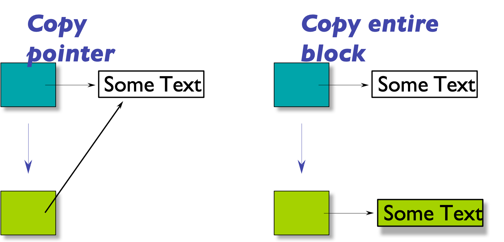

# Chapter 9 | Copy

- Create a new object from an existing one

    - e.g., when calling a function

```cpp
// Currency as pass-by-value argument 
void func(Currency p) { 
 cout << "X = " << p.dollars(); 
} 
... 
Currency bucks(100, 0); 
func(bucks); // bucks is copied into p
```

- func 需要一个参数 Currency p，但是这个参数是通过 pass-by-value 传递的，也就是说，func 会创建一个 Currency 类型的对象 p，并将参数 bucks 的值拷贝给 p。

---

## code version 1

```cpp
#include<iostream>
#include<string>
using namespace std;

static int objectCount = 0;
void print(const string &msg) {
    cout << msg << ": ";
    cout << "objectCount = " << objectCount << endl;
}

class Howmany {
public:
    Howmany() {
        objectCount++;
        print("Howmany()");
    }
    ~Howmany() {
        objectCount--;
        print("~Howmany()");
    }
};

// Pass and return by VALUE:
Howmany f(Howmany x) {
    print("x argument inside f()");
    return x;
}

int main() {
    Howmany h;
    print("after construction of h");
    Howmany h2 = f(h);
    print("after call to f()");
    return 0;
}
```

输出：

```bash
Howmany(): objectCount = 1
after construction of h: objectCount = 1
x argument inside f(): objectCount = 1
~Howmany(): objectCount = 0
after call to f(): objectCount = 0
~Howmany(): objectCount = -1
~Howmany(): objectCount = -2
```

- 出现了负数。可以看到有三个 destructor 被调用，说明有三个对象。但是我们的计数只记了一个。

---

## code version 2

- 如果将上述 `Howmany h2 = f(h);` 改为 `Howmany h2 = h;` 我们可以得到以下输出：

```bash
Howmany(): objectCount = 1
after construction of h: objectCount = 1
after call to f(): objectCount = 1
~Howmany(): objectCount = 0
~Howmany(): objectCount = -1
```

- 从这里我们可以看到，`Howmany h2 = f(h);` 这里就已经存在问题了。

---

## code version 3

```cpp
#include<iostream>
#include<string>
using namespace std;

static int objectCount = 0;
void print(const string &msg) {
    cout << msg << ": ";
    cout << "objectCount = " << objectCount << endl;
}

class Howmany {
public:
    Howmany() {
        objectCount++;
        print("Howmany()");
    }
    Howmany(int i) {
        objectCount++;
        print("Howmany(int)");
    }
    ~Howmany() {
        objectCount--;
        print("~Howmany()");
    }
};

// Pass and return by VALUE:
Howmany f(Howmany x) {
    print("x argument inside f()");
    return x;
}

int main() {
    Howmany h;
    print("after construction of h");
    Howmany h2(20);
    print("after call to f()");
    return 0;
}
```

输出:

```bash
Howmany(): objectCount = 1
after construction of h: objectCount = 1
Howmany(int): objectCount = 2
after call to f(): objectCount = 2
~Howmany(): objectCount = 1
~Howmany(): objectCount = 0
```

- 此时我们可以看到已经变成 0 了。
- `Howmany h2(20);` 与 `Howmany h2 = 20;` 是等价的，因为编译器会自动调用构造函数，并返回一个临时对象，然后将其赋值给 `h2`。

!!! note "隐式转换"
    `Howmany(int)` 是一个**单参数**的构造函数，且未被标记为 `explicit` 。因此，编译器允许通过隐式类型转换将 `int` 转换为 `Howmany` 对象。

    `Howmany h2 = 20;` 是拷贝初始化（copy-initialization）的语法形式。根据 C++ 规则，编译器会尝试将右侧的 20 转换为 `Howmany` 类型，再通过拷贝构造函数初始化 `h2`。但由于拷贝省略（copy elision）优化，编译器会直接调用 `Howmany(int)` 构造函数构造 h2，跳过了临时对象的创建和拷贝构造步骤。

    两种写法最终都直接调用 `Howmany(int)` 构造函数，没有临时对象的额外开销。

- 所以其实 `Howmany h2 = h;` 实际上是 `Howmany h2(h);`，然后返回一个临时对象，再将其赋值给 `h2`。

---

## code version 4

- 也就是说我们需要一个参数是 `Howmany` 的构造函数，但是如果我们使用的函数签名是 `Howmany f(Howmany hm);` 时依旧最后不是 0 。因为这会是一个传值的，会再发生 copy 的行为，就会再去找对应的构造函数。
- 所以我们的 copy constructor 吃进来是一个同类型的对象，但是需要把类型写成 `const &` 。
- 这里的 `const` 是因为不会更改，只是拿一个对象进来，然后用它赋值一份新的对象，只是需要值。而 `&` 说明是一个引用，不需要 copy 。

```cpp
#include<iostream>
#include<string>
using namespace std;

static int objectCount = 0;
void print(const string &msg) {
    cout << msg << ": ";
    cout << "objectCount = " << objectCount << endl;
}

class Howmany {
public:
    Howmany() {
        objectCount++;
        print("Howmany()");
    }
    Howmany(int i) {
        objectCount++;
        print("Howmany(int)");
    }
    Howmany(const Howmany &hm) {
        objectCount++;
        print("Howmany(const Howmany &)");
    }
    ~Howmany() {
        objectCount--;
        print("~Howmany()");
    }
};

// Pass and return by VALUE:
Howmany f(Howmany x) {
    print("x argument inside f()");
    return x;
}

int main() {
    Howmany h;
    print("after construction of h");
    Howmany h2(h);
    print("after call to f()");
    return 0;
}
```

输出：

```bash
Howmany(): objectCount = 1
after construction of h: objectCount = 1
Howmany(const Howmany &): objectCount = 2
after call to f(): objectCount = 2
~Howmany(): objectCount = 1
~Howmany(): objectCount = 0
```

- 此时的输出也就正确了。
- 此时就算 `Howmany h2(h);` 改为最初的 `Howmany h2 = f(h);`，输出也是正确的。
- 然而要知道的是并不是对象数目没有对上，实际上是我们打印的计数数目没有对上。

---

## The copy constructor

- Implements the copy behavior
- Has the unique signature: `T::T(const T &t);`
- C++ creates a copy ctor for you if you don't provide one...
    - 编译器自动做的是 Member-wise copy ，会对每一个字段进行拷贝的行为
        - Good for numbers and objects
        - Pointer data become shared!

---



如果按照 Member-wise copy : 

当字段有指针时，例如下图一个对象(绿色的块)，存在一个指针指向一串字符串。

在 copy 的时候，由于指针是 copy-by-value 的，所以地址被复制了一份，所以两个对象其实是指向同一份数据的。但是你想要的可能不是两个指针指向同一个数据，而是指向一片新的区域，这个区域的内容是拷贝过来的，也即深度的拷贝。

接下来就用代码来实现看看。

```cpp
#include <cstring>
#include <iostream>
using namespace std;

struct Person {
    char *name;
    Person(const char *s) {
        name = new char[strlen(s) + 1]; // +1 for '\0'
        strcpy(name, s);
    }
    ~Person() {
        delete[] name;
    }
};

int main() {
    Person p1("Trump");
    Person p2 = p1; // 拷贝构造行为

    cout << (void*)p1.name << endl;  //0x2d17bae17f0
    cout << (void*)p2.name << endl;  //0x2d17bae17f0
}
```

- 此时，p1 和 p2 的 name 指针指向同一块内存，由于 p2 先被销毁，当 p2 被销毁时，这块内存被删除，p1 的 name 指针就变成了悬空指针，访问它会导致未定义行为。
- 因此，在拷贝构造函数中，应该为新的对象分配新的内存，而不是简单地复制指针。也就是编译器自己生成的拷贝构造函数，只是复制指针，并没有分配新的内存，并不合格。所以其实当你有指针字段时，必须自己写拷贝构造函数。
- 这个 destructor 不写的时候，编译器会自动生成一个，但是这个自动生成的 destructor 只会删除指针指向的内存，并不会删除指针本身，所以会导致悬空指针的问题，所以会引起内存泄漏。

```cpp
#include <cstring>
#include <iostream>
using namespace std;

struct Person {
    char *name;
    Person(const char *s) {
        name = new char[strlen(s) + 1];
        strcpy(name, s);
    }
    Person(const Person &other) {
        name = new char[strlen(other.name) + 1];
        strcpy(name, other.name);  // 这样便是深度拷贝
    }
    ~Person() {
        delete[] name; 
    }
};

int main() {
    Person p1("Trump");
    Person p2 = p1;

    cout << (void*)p1.name << endl;  //0x2e7c80e17f0
    cout << (void*)p2.name << endl;  //0x2e7c80e1830
}
```

- 这样就完成了内容的拷贝，p1 和 p2 就会有各自的内存，即使 p2 先被销毁，也不会影响到 p1。
- 其实当需要写 destructor 时，就指示出需要自己写 copy constructor。
- No return value。所有的 copy constructor 是没有返回值的。

---

### What if the name was a string (not a char* )

```cpp
#include <cstring>
#include <string>
#include <iostream>
using namespace std;

struct Person {
    string name;
    Person(const char *s) : name(s) {}  // 因为 string 有自己的 copy constructor
    Person(const Person &other) : name(other.name) {} // 如果一定要自己写
};

int main() {
    Person p1("Trump");
    Person p2 = p1; 

    cout << (void*)p1.name.data() << endl;  //0x1436dffcf0
    cout << (void*)p2.name.data() << endl;  //0x1436dffcd0
}
```

- string 也有自己的 copy constructor，所以不需要自己写。在 `Person p2 = p1;` 时，编译器会自动调用 string 的 copy constructor，已经完成了深拷贝。
- 不需要析构函数。
- 如果字段里都是 class member，那么其实不需要写 copy constructor。
- 编译器会自动生成 `T()` , `~T()` , `T(const T&)` 和 `T& operator=(const T&)`, 要么都不用写，要么后面三个都要写。也就是 **Rule of Three**。

---

```cpp
#include <cstring>
#include <iostream>
using namespace std;

struct Person {
    char *name;
    void init(const char *s) {
        name = new char[strlen(s) + 1];
        strcpy(name, s);
    }
    Person(const char *s) {
        init(s);
    }
    Person(const Person &other) {
        init(other.name);
    }
    ~Person() {
        delete[] name; 
    }
    /*Person& operator=(const Person &other) {
        name = other.name;
    }
    这是编译器自动生成的，类似于实现上述，但这是错误的，因为这样会导致两个对象指向同一个内存地址，当其中一个对象被销毁时，另一个对象的指针就会变成悬空指针。
    所以其实不仅出错并且内存泄漏。
    */
    Person& operator=(const Person &other) {
        if (this != &other) { // 如果没有这个，自赋值会出现问题
            delete[] name;
            init(other.name);
        }
        cout << "op=(&)" << endl;
        return *this;
    }
};

int main() {
    Person p1("Trump");
    Person p2 = p1;
    p2 = p1;  // 这里是 assignment 而不是 copy constructor

    cout << (void*)p1.name << endl;  
    cout << (void*)p2.name << endl;
    cout << p1.name << endl;
    cout << p2.name << endl;
    return 0;
}
```

- 也就是 Rule of Three
- 当字段是 string 或者 vector 等容器时，编译器会自动生成 copy constructor 和 assignment operator，所以不需要自己写。
- Default copy ctor: memberwise initialization
    - Calling the copy ctors for each **class-type member** (and the base part), recursively
    - Doing a plain assignment for each **non-class type member** (e.g., int or pointer).

---

## When are copy ctors called?

- Initialization

```cpp
Person baby_a("Fred"); 
Person baby_b = baby_a; // not an assignment 
Person baby_c( baby_a ); // not an assignment
```

- Call by value(相当于赋值，初始化那个参数)

```cpp
void roster( Person ) {
    ...
}
Person child( "Ruby" ); // create object 
roster( child ); // call function, copy ctor called
```

- Function return

```cpp
Person captain() {
    Person player("George");
    return player; 
}
Person who = captain();
```

- return 出去的时候赋值给另一个对象，也调用了 copy ctor

---

### Copies and overhead

- Compilers can eliminate copies when it's safe!
- Programmers need to
    - Program for dumb compilers
    - Be ready to look for optimizations

```cpp
#include <cstring>
#include <iostream>
using namespace std;

struct Person {
    string name;
    Person(const char *s) {
        cout << "Person(const char*)" << endl;
    }
    Person(const Person &p) {
        cout << "Person(&)" << endl;
        name = p.name;
    }
};

Person foo(Person p) {
    cout << "in foo()" << endl;
    return p;
}

Person bar(const char *s) {
    cout << "in bar()" << endl;
    return Person(s);
}

int main() {
    Person p1 = foo("Trump");
    cout << "-----------------------------" << endl;
    Person p2 = bar("Biden");

    return 0;
}
```

输出：

```bash
Person(const char*)
in foo()
Person(&)
-----------------------------
in bar()
Person(const char*)
```

- 可以看到 `foo` 函数中存在拷贝构造，但是 `bar` 函数中不存在拷贝构造。
- 相当于 "Trump" 直接构造 `p` 并没有拷贝
- 对于 `bar` 函数是构造一个临时的 `Person` 对象，然后返回。用临时对象构造 `p2`，不存在拷贝构造，直接把临时对象的参数拿过来直接构造 `p2` 就行了。这其实是由编译器直接优化了的。
- 可以通过 `g++ main.cpp -fno-elide-constructors` 来关闭编译器的优化，从而看到拷贝构造。

---

## Pay attention to efficiency

- Example: using the `vector<T>` container
    - Estimate and preserve the memory
    - Avoid extra copies

```cpp
#include <vector>
#include <iostream>
using namespace std;

struct Point{
    Point(int x, int y) : x(x), y(y) {
        cout << "Point(int, int)" << endl;
    }
    Point(const Point &p) : x(p.x), y(p.y) {
       cout << "copy a Point" << endl;
    }
    int x, y;
};

ostream& operator<<(ostream &out, const Point &p) {
    return out << "(" << p.x << ", " << p.y << ")";
}

int main(){
    vector<Point> pts;
    cout << pts.capacity() << endl; // capacity 是内存放了多少个，size 是实际放了多少个
    pts.push_back(Point(1, 2));
    cout << pts.capacity() << endl;
    pts.push_back(Point(3, 4));
    cout << pts.capacity() << endl;
    pts.push_back(Point(5, 6));
    cout << pts.capacity() << endl;

    for(const Point &p : pts){
        cout << p << endl;
    }
    return 0;
}
```

输出:

```bash
0
Point(int, int)
copy a Point
1
Point(int, int)
copy a Point
copy a Point
2
Point(int, int)
copy a Point
copy a Point
copy a Point
4
(1, 2)
(3, 4)
(5, 6)
```

- 每次 push_back 都会检查容量是否足够，不够的话会重新分配内存，并把原来的元素拷贝到新的内存中，然后释放原来的内存。

```cpp
#include <vector>
#include <iostream>
using namespace std;

struct Point{
    Point(int x, int y) : x(x), y(y) {
        cout << "Point(int, int)" << endl;
    }
    Point(const Point &p) : x(p.x), y(p.y) {
       cout << "copy a Point" << endl;
    }
    int x, y;
};

ostream& operator<<(ostream &out, const Point &p) {
    return out << "(" << p.x << ", " << p.y << ")";
}

int main(){
    vector<Point> pts;
    pts.reserve(3);

    cout << pts.capacity() << endl;
    pts.push_back(Point(1, 2));
    cout << pts.capacity() << endl;
    pts.push_back(Point(3, 4));
    cout << pts.capacity() << endl;
    pts.push_back(Point(5, 6));
    cout << pts.capacity() << endl;

    for(const Point &p : pts){
        cout << p << endl;
    }
    return 0;
}
```

输出:

```bash
3
Point(int, int)
copy a Point
3
Point(int, int)
copy a Point
3
Point(int, int)
copy a Point
3
(1, 2)
(3, 4)
(5, 6)
```

- 当给了一个 `reserve` 大小后，`push_back` 不会重新分配内存，但是当容量不够时，会重新分配内存，并把原来的元素拷贝到新的内存中，然后释放原来的内存。

```cpp
#include <vector>
#include <iostream>
using namespace std;

struct Point{
    Point(int x, int y) : x(x), y(y) {
        cout << "Point(int, int)" << endl;
    }
    Point(const Point &p) : x(p.x), y(p.y) {
       cout << "copy a Point" << endl;
    }
    int x, y;
};

ostream& operator<<(ostream &out, const Point &p) {
    return out << "(" << p.x << ", " << p.y << ")";
}

int main(){
    vector<Point> pts;
    pts.reserve(3);

    cout << pts.capacity() << endl;
    pts.emplace_back(1, 2);
    cout << pts.capacity() << endl;
    pts.emplace_back(3, 4);
    cout << pts.capacity() << endl;
    pts.emplace_back(5, 6);
    cout << pts.capacity() << endl;

    for(const Point &p : pts){
        cout << p << endl;
    }
    return 0;
}
```

输出:

```bash
3
Point(int, int)
3
Point(int, int)
3
Point(int, int)
3
(1, 2)
(3, 4)
(5, 6)
```

- 调用 `emplace_back`，将数据转发，知道构造器可以吃进去这些参数，可以将这个参数组直接传进去，在预留的内存里直接构造，这样就不会发生拷贝和移动。
- 如果是 `pts.emplace_back(Point(5, 6));` 那么还是会有 `copy a Point`，因为 `Point(5, 6)` 是一个临时对象，需要拷贝构造。

---

## Construction vs. assignment

- Every object is constructed once
- Every object should be destroyed once
- Once an object is constructed, it can be the target of multiple assignments

---

## Copy ctor guidelines

1. In most cases, you don’t have to write anything.

- [Rule of zero](https://isocpp.github.io/CppCoreGuidelines/CppCoreGuidelines#Rc-zero)

2. Be explicit when necessary, e.g., managing raw pointers.

- create your own copy ctor
- [Rule of three](https://en.cppreference.com/w/cpp/language/rule_of_three)

3. If you want to forbid the copy behavior(例如代价太大，不想copy)

- declare the copy ctor private without body (until C++11)(声明即可)
- define the copy ctor as = delete , e.g., Person(const Person &rhs) = delete; (since C++11)
- 但是禁止之后，例如和容器配合时容易出现很多问题。

---

## Further reading

<div class="card file-block" markdown="1">
<div class="file-icon"></div>
<div class="file-body">
<div class="file-title"> Effective C++__Item-5 </div>
<div class="file-meta"> 96 KB / 2025-04-18</div>
</div>
<a class="down-button" target="_blank" href="/Notebook/Computer_Science/OOP/Further_reading/[Further Readings] Effective C++__Item-5.pdf" markdown="1">:fontawesome-solid-download: 下载</a>
</div>

---