# Chapter 1 | Overview

## Overview

### Objectives

- To provide a grand tour of the major operating systemscomponents
- To provide coverage of basic computer system organization

---

### What is an Operating System?

- A program that acts as an intermediary between a user ofa computer and the computer hardware.
- Operating system goals:
    - Execute user programs and make solving user problems easier.
    - Make the computer system convenient to use.
- Use the computer hardware in an efficient manner.

操作系统是一个**程序**，它作为计算机用户和计算机硬件之间的中介。操作系统的目标包括执行用户程序，让**用户更容易解决问题**。让计算机系统更方便使用。高效地利用计算机硬件资源。

如果一个程序缺失后，计算机无法正常运作，那么这个程序就可以被称为操作系统。也就是说，操作系统是支撑整个计算机系统正常运行的核心软件，没有它，用户和应用程序都无法直接使用硬件资源。

---

### Computer System Structure

Computer system can be divided into four components

1. **Hardware** – provides basic computing resources

这是所有计算和存储的物理基础，包括CPU、内存、硬盘、I/O设备等。

2. **Operating system**

操作系统作为中介，负责管理和协调硬件资源，为上层程序提供统一的接口和运行环境。它屏蔽了硬件的复杂性，使得上层软件可以方便地使用硬件资源。

3. **System & application programs** – define the ways in which the system resources are used to solve the computing problems of the users

这里包括编译器（compiler）、汇编器（assembler）、文本编辑器（text editor）、数据库系统（database system）等。这些程序直接为用户提供服务，帮助用户完成各种任务。

4. **Users**

用户通过系统和应用程序与计算机进行交互，实现自己的需求。

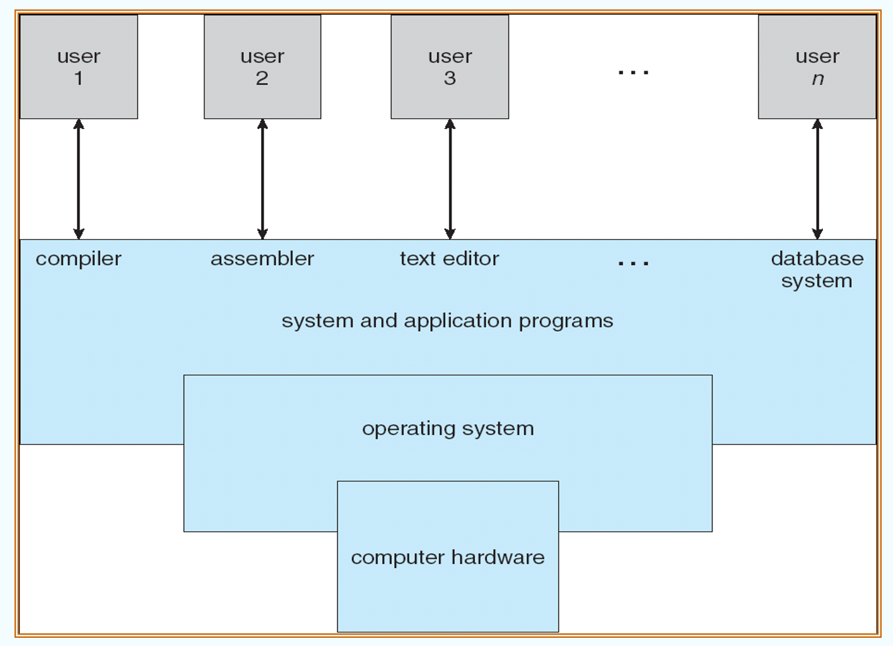

???+ example "question"
    操作系统是对()进行管理的软件。
    
    A.软件
    
    B.硬件
    
    C.计算机资源
    
    D.应用程序

??? note "answer"
    C.计算机资源

    操作系统管理计算机的**硬件**和**软件**资源，这些资源统称为**计算机资源**。注意，操作系统不仅管理处理机、存储器等硬件资源，还管理文件，文件不属于硬件资源，但属于计算机资源。

???+ example "question"
    下面的()资源不是操作系统应该管理的。
    
    A.CPU
    
    B.内存
    
    C.外存
    
    D.源程序

??? note "answer"
    D.源程序

    源程序是一种计算机代码，是用程序设计语言编写的程序，经编译或解释后可形成具有一定功能的可执行文件，是直接面向程序员用户的，而不是操作系统的管理内容。
    
    但有人会问操作系统不是也管理“文件”吗?源程序也存储在文件中吧?
    
    出现这种疑问的原因是，对操作系统管理文件的理解存在偏颇。操作系统管理文件，是指操作系统关心计算机中的文件的逻辑结构、物理结构、文件内部结构、多文件之间如何组织的问题，而不是关心文件的具体内容。

???+ example "question"
    下列选项中，()不是操作系统关心的问题。
    
    A.管理计算机裸机

    B.设计、提供用户程序与硬件系统的界面
    
    C.管理计算机系统资源
    
    D.高级程序设计语言的编译器

??? note "answer"
    D.高级程序设计语言的编译器

    操作系统管理计算机软/硬件资源，扩充裸机以提供功能更强大的扩充机器,并充当用户与硬件交互的中介。高级程序设计语言的编译器显然不是操作系统关心的问题。编译器的实质是一段程序指令，它存储在计算机中。

---

### Operating System Definition

OS is a **resource allocator**

- Manages all resources
- Decides between conflicting requests for efficient and fair resource use

操作系统的一个核心作用是作为**资源分配者**，负责管理计算机中的所有资源（如CPU、内存、磁盘、I/O设备等）。当多个程序或用户同时请求资源时，操作系统需要在它们之间做出决策，确保资源被高效且公平地分配和使用。

OS is a **control program**

- Controls execution of programs to prevent errors and improper use of the computer

操作系统还充当**控制程序**，负责控制程序的执行，防止错误发生以及防止对计算机的不当使用。例如，操作系统会阻止一个程序非法访问其他程序的内存空间，保证系统的安全和稳定。

!!! info
    实际上，操作系统并没有一个被普遍接受的标准定义。比如，有人认为“操作系统就是你买电脑时厂商预装的所有软件”，但不同厂商的理解和范围可能差别很大。

严格来说，操作系统中“始终在计算机上运行的那个程序”被称为**内核**（kernel）。内核是操作系统的核心部分，负责最底层的资源管理和硬件控制。其他的系统程序和应用程序则运行在内核之上。可以把内核理解为一个功能丰富的代码库，被不同的程序调用。

???+ example "question"
    操作系统的基本功能是()。
    
    A.提供功能强大的网络管理工具
    
    B.提供用户界面方便用户使用
    
    C.提供方便的可视化编辑程序
    
    D.控制和管理系统内的各种资源

??? note "answer"
    D.控制和管理系统内的各种资源

    操作系统是指控制和管理整个计算机系统的硬件和软件资源，合理地组织、调度计算机的工作和资源的分配，以便为用户和其他软件提供方便的接口与环境的程序集合。

??? note "操作系统的特征"
    操作系统的基本特征包括并发、共享、虚拟和异步。

    1. 并发是指两个或多个事件在**同一时间间隔内发生**。在多道程序环境下，在内存中同时装有若干道程序，以便当运行某道程序时，利用其因 I/O 操作而暂停执行时的 CPU 空档时间，再调度另一道程序运行，从而实现多道程序交替运行，使 CPU 保持忙碌状态。
    
    2. **资源共享**即共享，是指系统中的资源可供内存中多个并发执行的进程共同使用。资源共享主要可分为互斥共享（例如打印机）和同时访问（分时共享）两种方式。

    **并发**和**共享**是操作系统两个**最基本**的特征，两者之间互为存在的条件:①资源共享是以程序的并发为条件的，若系统不允许程序并发执行，则自然不存在资源共享问题:②若系统不能对资源共享实施有效的管理，则必将影响到程序的并发执行，甚至根本无法并发执行。

    3. 虚拟是指将一个物理上的实体变为若干逻辑上的对应物。操作系统的虚拟技术可归纳为:**时分复用技术**，如虚拟处理器;**空分复用技术**，如虚拟存储器。利用多道程序设计技术将一个物理上的 CPU 虚拟为多个逻辑上的 CPU，称为虚拟处理器。采用虚拟存储器技术将一台机器的物理存储器变为虚拟存储器，以便从逻辑上扩充存储器的容量。

    4. 多道程序环境允许多个程序并发执行，但由于资源有限，进程的执行并不是一贯到底的，而是走走停停的，它以不可预知的速度向前推进，这就是进程的**异步**性。

---

### Computer Startup

bootstrap program is loaded at power-up or reboot

- Typically stored in ROM or EPROM, generally known as firmware
- Initializes all aspects of system
- Loads operating system kernel and starts execution

当计算机加电或重启时，**首先加载的是引导程序**（bootstrap program）。引导程序通常存储在**ROM**或EPROM中，通常被称为固件（firmware）（并且是在一个**已知**的位置）。它负责初始化系统的所有方面，包括硬件检测、内存测试等。引导程序完成初始化后，会加载操作系统内核并开始执行。

---

### Computer System Organization

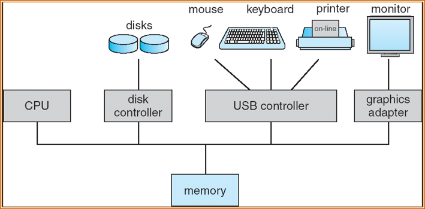

CPU、内存和各种外设通过总线和控制器实现数据交换和资源共享，操作系统负责协调这些硬件资源的高效、公平使用。

??? info "CPU and devices"
    - One or more CPUs, device controllers connect through common bus providing access to shared memory
    - Concurrent execution of CPUs and devices competing for memory cycles
    - I/O devices and the CPU can execute concurrently.
    - Each device controller is in charge of a particular device type.
    - Each device controller has a local buffer.
    - CPU moves data from/to main memory to/from local buffers
    - I/O is from the device to local buffer of controller.
    - Device controller informs CPU that it has finished its operation by causing an interrupt (via system bus).

---

## Common Functions of Interrupts

Interrupt transfers control to the **interrupt service** routine generally, through the **interrupt vector**, which contains the addresses of all the service routines.

当中断发生时，控制权会转移到**中断服务程序**（Interrupt Service Routine, ISR）。这种转移通常通过“中断向量”实现，中断向量中保存了所有中断服务程序的地址。这样，系统可以根据中断类型快速找到对应的处理程序。

Interrupt architecture must save the address of the interrupted instruction.

中断体系结构必须保存当前正在执行的指令地址（通常是程序计数器PC），以便中断处理完成后能从正确的位置继续执行。

Incoming interrupts are disabled while another interrupt is being processed to prevent a lost interrupt.

当一个中断正在被处理时，通常会暂时禁止新的中断进入，以防止“中断丢失”——即新中断被忽略。

??? Tip "为什么新中断可能会被忽略"
    在处理当前中断的过程中，如果允许新的中断进入，可能会导致系统无法正确保存和恢复现场，造成数据混乱或系统不稳定。

A **trap** is a software-generated interrupt caused either by an **error** or a **user request** (the latter is often referred to as a **system call**). Note: names may vary across different architectures.

Trap 是一种由**软件产生**的中断，通常由**程序错误**（如除零错误）或**用户请求**（如系统调用）引发。不同体系结构对 trap 的命名可能不同。例如，在RISC-V架构中，trap可以细分为“异常（exception）和ecall（系统调用）”以及“中断（interrupt）”。

- exceptions & ecalls：由程序错误或系统调用引发。
- interrupts：由外部设备等硬件事件引发。

An operating system is **interrupt** driven.

操作系统的运行依赖于中断机制。无论是硬件事件（如I/O完成），还是软件事件（如系统调用），都通过中断机制通知操作系统进行相应处理。

==通用的操作系统下，术语按照书本来。==

在 RISC-V 当中中断叫 traps， 硬件引起的叫做 interrupts，软件引起的叫做 exceptions ，系统调用叫做 environment calls。

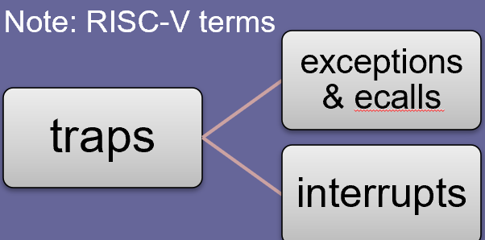

???+ example "question"
    用户可以通过()两种方式来使用计算机。
    
    A.命令接口和函数
    
    B.命令接口和系统调用
    
    C.命令接口和文件管理
    
    D.设备管理方式和系统调用

??? note "answer"
    B

    操作系统主要向用户提供命令接口和程序接口(系统调用)，此外还提供图形接口;当然，图形接口其实是调用了系统调用而实现的功能。

    命令接口是指用户通过输入命令（通常是文本命令）与操作系统进行交互的方式。典型代表：命令行界面（CLI），如 Windows 的 cmd、Linux 的 shell（bash、zsh 等）。

    程序接口是指应用程序通过调用操作系统提供的**系统调用（system call）**来请求操作系统服务的方式。典型代表：如 Linux 的 open()、read()、write()、fork() 等系统调用。

???+ example "question"
    系统调用是由操作系统提供给用户的，它()。
    
    A.直接通过键盘交互方式使用
    
    B.只能通过用户程序间接使用
    
    C.是命令接口中的命令
    
    D.与系统的命令一样

??? note "answer"
    B

    系统调用需要在用户程序中通过特定的语句（如C语言的 `open()`、`read()`等）发起，操作系统通过陷阱指令（如`int 0x80`、`ecall`等）切换到内核态来完成服务。

???+ example "question"
    操作系统提供给编程人员的接口是()。
    
    A.库函数
    
    B.高级语言
    
    C.系统调用
    
    D.子程序

??? note "answer"
    C.系统调用

???+ example "question"
    系统调用的目的是()。
    
    A.请求系统服务   
    
    B.中止系统服务
    
    C.申请系统资源
    
    D.释放系统资源

??? note "answer"
    A.请求系统服务

    操作系统不允许用户直接操作各种硬件资源，因此用户程序只能通过系统调用的方式来请求内核为其服务，间接地使用各种资源。

    **“申请系统资源”**只是系统调用众多功能中的一种，属于“请求服务”这个大类的一个子集。比如，释放资源、进程通信、I/O操作等都不是“申请资源”，但都是系统调用的内容。

---

### Interrupt Handling

The operating system preserves the state of the CPU by **storing** ==registers== and the ==program counter==.

Determines which type of interrupt has occurred:

1. a generic routine examines the interrupt info 

有一个**通用的**中断处理程序，先检查中断信息，然后根据不同类型再分发到具体的处理程序。

2. **vectored interrupt system**, indexed by a **unique number**

每种中断类型都有唯一编号，通过中断向量表直接定位到对应的中断服务程序，提高了响应速度。

Separate segments of code determine what action should be taken for each type of interrupt

中断处理的核心流程是：保存现场 → 判断中断类型 → 跳转到对应的中断服务程序 → 处理完毕后恢复现场，继续原任务。针对不同类型的中断，操作系统会有不同的处理代码（即中断服务程序）。每种中断类型（如I/O完成、定时器中断、非法操作等）都有专门的处理逻辑，确保系统能够正确、高效地响应各种事件。

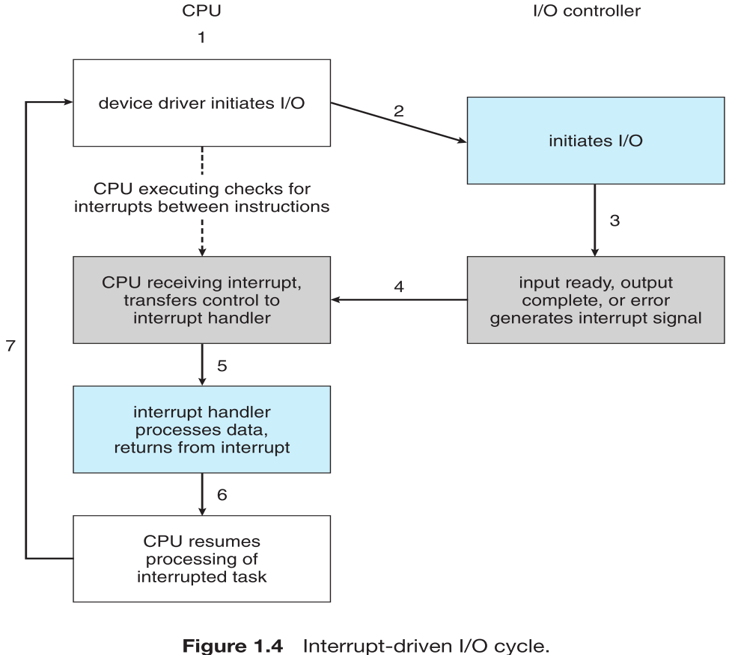

??? Tip "中断处理的基本流程"
    1. CPU发起I/O请求

    设备驱动程序（device driver）在CPU的控制下发起I/O操作（步骤1、2）。此时，I/O控制器（如磁盘控制器、USB控制器等）开始执行具体的I/O任务。

    2. I/O控制器执行I/O操作

    I/O控制器独立于CPU工作，负责与外设进行数据交换（步骤3）。当输入准备好、输出完成或发生错误时，I/O控制器会产生一个中断信号。

    3. 中断信号通知CPU

    I/O控制器通过中断信号通知CPU有事件发生（步骤4）。CPU在每条指令之间都会检查是否有中断请求。

    4. CPU响应中断，转交中断处理程序

    一旦CPU检测到中断，会立即保存当前的寄存器和程序计数器（PC）等状态，然后将控制权转移给对应的中断服务程序（interrupt handler）。

    5. 中断服务程序处理数据

    中断服务程序根据中断类型进行相应处理，比如读取数据、处理错误等（步骤5）。每种中断类型都有专门的处理代码。

    6. 中断处理结束，恢复原任务

    中断服务程序处理完毕后，CPU恢复被中断时的状态（步骤6），继续执行原来的任务（步骤7）。

---

### Two I/O Methods

**Synchronous**

After I/O starts, control returns to user program only upon I/O completion.

用户进程发起I/O请求后，必须等待I/O操作完成才能继续执行。

- Wait instruction idles the CPU until the next interrupt
- Wait loop (contention for memory access).
- At most one I/O request is outstanding at a time, no simultaneous I/O processing.

**Asynchronous**

After I/O starts, control returns to user program without waiting for I/O completion.

用户进程发起I/O请求后，无需等待I/O完成，可以立即继续执行其他任务。

- System call – request to the operating system to allow user to wait for I/O completion.
- Device-status table contains entry for each I/O device indicating its type, address, and state.

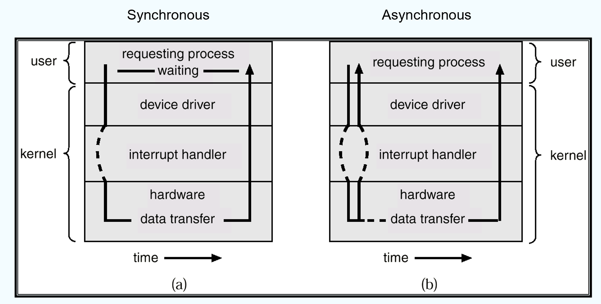

---

### Device-Status Table

Device-Status Table（设备状态表）是操作系统用来管理和跟踪**所有 I/O 设备当前状态**的数据结构。

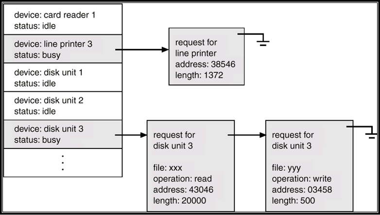

当有进程请求某个I/O设备时，操作系统会在设备状态表中查找该设备的条目，判断其当前状态。设备完成当前操作后，会通过中断通知操作系统，操作系统再从设备状态表中取出下一个等待的请求，继续处理。

---

## Direct Memory Access Structure (DMA)

Used for high-speed I/O devices able to transmit information at close to memory speeds.

DMA是一种用于**高速I/O设备**的**数据传输**方式，适用于那些数据传输速度接近内存速度的设备。

Device controller transfers blocks of data from buffer storage directly to main memory without CPU intervention.

传统I/O方式：每当设备需要与内存交换数据时，都需要CPU参与。比如每传输一个字节，CPU都要进行一次操作和中断响应，效率较低，CPU负担重。

DMA方式：设备控制器（如DMA控制器）可以直接将数据块从设备的缓冲区传输到主内存，无需CPU参与每一个字节的传输。CPU只需在数据块传输开始和结束时进行干预。

Only one interrupt is generated per block, rather than the one interrupt per byte.

---

## Storage Structure

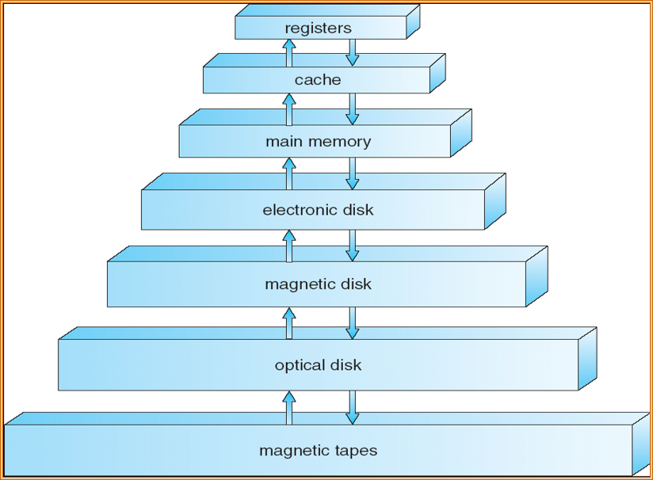

---

### Migration of Integer A from Disk to Register

- **Multitasking** environments must **be careful** to use most recent value, no matter where it is stored in the storage hierarchy
- **Multiprocessor** environment must provide **cache coherency** in hardware such that all CPUs have the most recent value in their cache

---

### Multiprocessor Systems

对称多处理器结构（SMP, Symmetric Multiprocessing Architecture）

- Each CPU processor has its own set of registers
- All processors share physical memory over the system bus

- 在SMP结构中，所有CPU地位平等，可以独立执行任务，也可以协作完成多任务处理。
- 多个CPU可以同时访问主存，实现真正的并行计算，提高了系统的处理能力和吞吐量。
- 每个CPU有自己的寄存器和缓存，但主存是共享的，这样既保证了高速缓存的效率，又能实现数据共享。

**需要注意的问题**

- 由于每个CPU有自己的缓存，如果多个CPU同时操作同一块主存数据，必须通过硬件机制保证各自缓存中的数据是一致的，避免数据冲突和不一致。
- 多个CPU同时访问主存或总线时，可能会发生资源竞争，需要通过调度和仲裁机制来协调。

---

### Multicore Systems

- On-chip communication is faster than between-chip communication
- Less power (good for mobile devices)

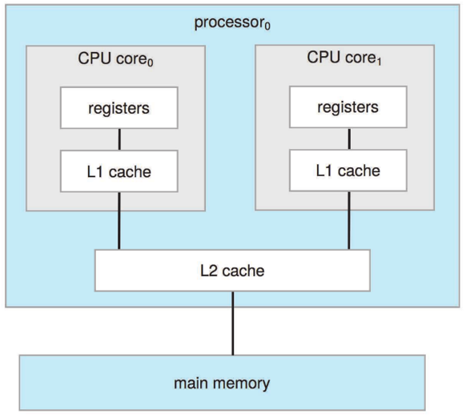

- 多个核心集成在同一芯片上，核心之间的数据交换和通信速度远快于多处理器（SMP）架构下不同芯片之间的通信。
- 多核系统比多个独立处理器的功耗更低，非常适合移动设备和笔记本电脑等对能耗敏感的场景。
- 多核可以同时处理多个任务，提高了系统的并发能力和整体性能。

---

## The NUMA Architecture

**NUMA**（非一致性内存访问，Non-Uniform Memory Access）

The CPUs are connected by a shared system interconnect

Scales more effectively as more processors are added

Remote memory across the interconnect is slow

Operating systems need careful CPU scheduling and memory management

尽量让进程在访问本地内存的CPU上运行，减少远程访问，提高效率。**合理分配和迁移内存**，保证数据局部性，避免频繁的远程内存访问。

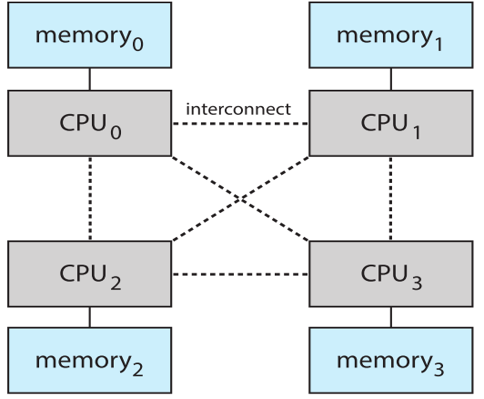

---

## Operating System Structure

### Multiprogramming

**Multiprogramming** needed for efficiency (**CPU utilization** 关注资源)

多道程序设计的目的是提高CPU利用率和系统整体效率。

- Single user cannot keep CPU and I/O devices busy at all times

单用户无法让 CPU 和 I/O 设备始终保持忙碌：如果只有一个用户或一个作业在运行，当它等待I/O（如读写磁盘）时，CPU就会空闲，资源被浪费。

- Multiprogramming organizes jobs (code and data) so CPU always has one to execute

操作系统会把多个作业（包括代码和数据）**同时装入内存**。这样，CPU总有作业可以执行。

- A subset of total jobs in system is kept in memory. One job selected and run via job scheduling

内存中只保留部分作业，操作系统通过作业调度算法选择一个作业运行。

- When it has to wait (for I/O for example), OS switches to another job

当当前作业需要等待（比如I/O操作），操作系统会切换到另一个作业继续执行，保证CPU始终有事可做。

---

### Timesharing

**Timesharing** (multitasking) is logical extension in which CPU switches jobs so frequently that users can interact with each job while it is running, creating interactive computing (**interactivity** 关注用户)

分时系统是多道程序设计的进一步发展，强调交互性和多用户支持。CPU在多个作业之间**快速切换**，使每个用户都感觉自己的程序在独占运行，实现“交互式计算”。

- Response time should be < 1 second

响应时间要求：系统响应时间应小于1秒，保证用户体验。

- Each user has at least one program executing in memory process

每个用户的操作都对应一个进程，多个进程同时驻留内存。

- If several jobs ready to run at the same time CPU scheduling

如果有多个作业（进程）同时准备运行，操作系统通过CPU调度算法分配CPU时间片。

- If processes don’t fit in memory, swapping moves them in and out to run

如果内存放不下所有进程，操作系统会通过“换入换出”（swapping）机制，把部分进程临时移出内存，腾出空间给其他进程运行。

- Virtual memory allows execution of processes not completely in memory

允许进程即使不完全在内存中也能执行，进一步提升了系统的并发能力和资源利用率。

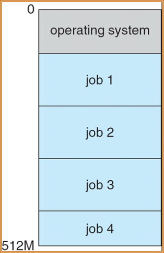

主存空间：纵轴表示内存地址，从0到512M。

操作系统（operating system）：位于内存的低地址部分，始终常驻内存，负责管理和调度所有作业。

job 1, job 2, job 3, job 4：表示当前驻留在内存中的多个作业（程序）。每个作业占用一部分内存空间。

???+ note "multiprogramming vs. timesharing"
    对于 multiprogramming 来说，强调的是 CPU 的高效利用率，确保 CPU 在任何时候都有作业可以执行。它主要关注的是系统资源的最大化利用。不在乎对里面的任务处理是 time-sharing 还是 batch processing（先处理一个再处理另一个）。

    而 timesharing 则更强调用户的交互体验，确保每个用户都能感觉到自己的程序在独占运行。它关注的是系统响应时间和用户体验。

---

## Operating System Operations

Interrupt driven by hardware. Software error or request creates **exception** or **trap**. Division by zero, request for operating system service. Other process problems include infinite loop, processes modifying each other or the operating system

我们希望操作系统是可以做到 isolation 的，不会在不被允许的情况下被修改或破坏。做到 program 之间是相互隔离的，并且 os 和用户程序之间也是相互隔离的。

Thus we need **protection**:

为了防止进程之间互相干扰、破坏操作系统或占用过多资源，操作系统必须具备保护机制。

**Dual-mode** operation allows OS to protect itself and other system components

==User mode and kernel mode==

**Mode bit** provided by hardware

- Provides ability to distinguish when system is running user code or kernel code
- Some instructions designated as privileged, only executable in kernel mode
- **System call changes mode to kernel, return from call resets it to user**

某些指令（如I/O操作、内存管理等）被指定为特权指令，只能在内核态下执行，防止用户程序随意操作硬件。用户程序通过系统调用（system call）请求操作系统服务时，CPU会将模式位切换为内核态，执行完毕后再切回用户态。

???+ question
    system call（间接调用）和直接用 library 调用系统程序有什么不同？

??? note "answer"
    系统调用通过陷阱指令（如 ecall）切换到内核态，由操作系统内核执行，拥有全部硬件控制权限。而用户程序只能通过受控的接口请求服务，内核可以检查和保护资源，防止非法访问，实现隔离和安全。

    库调用只是普通的函数调用，运行在用户态，没有权限访问或操作内核资源。只能操作用户空间的数据，不能直接进行I/O、进程管理等特权操作。

    例如 `printf()` 是库函数，最终会调用 `write()` 系统调用，`write()` 通过 `ecall` 进入内核态，由内核完成实际的输出操作。

    如果没有系统调用机制，用户程序可以直接操作硬件或内核资源，系统就无法保证安全和隔离，容易被恶意程序破坏。

    ==库函数运行在用户空间而系统调用运行在内核空间。大部分库函数可能使用系统调用来实现目的。==

---

### Transition from User to Kernel Mode

**Timer** to prevent infinite loop / process hogging resources

- Set interrupt after specific period
- Operating system decrements counter
- When counter zero generate an interrupt
- Set up before scheduling process to regain control or terminate program that exceeds allotted time

为了防止某个进程长时间占用CPU（如死循环），操作系统会设置定时器。**定时器到期后产生中断**，操作系统可以重新获得控制权，调度其他进程或终止违规进程。

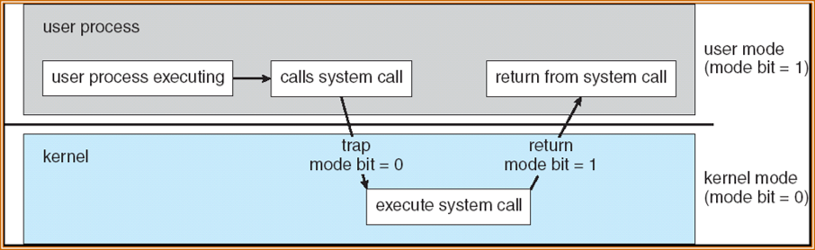

用户态（user mode）：普通应用程序运行时所处的状态，权限受限，不能直接操作硬件或执行特权指令。mode bit = 1。

内核态（kernel mode）：操作系统内核运行时所处的状态，拥有全部硬件控制权限，可以执行所有指令。mode bit = 0。

程序在用户态下正常运行。当用户程序需要操作硬件资源（如文件、网络、设备等）或请求操作系统服务时，会通过系统调用接口发起请求。系统调用会触发一次陷阱（trap）指令， CPU 将 mode bit 从 1 切换为 0，进入内核态，转而执行操作系统内核中的系统调用处理代码。操作系统在内核态下完成所需的服务（如读写文件、分配内存等）。系统调用完成后，通过特定的返回指令，CPU将mode bit重新设置为1，恢复到用户态，继续执行用户进程后续代码。

**作用与意义**

1. 安全性：通过用户态和内核态的区分，防止用户程序直接操作硬件或破坏系统安全。
2. 保护机制：只有操作系统内核才能执行特权指令，用户程序必须通过系统调用间接请求服务。
3. 资源管理：操作系统通过内核态统一管理和分配硬件资源，保证系统稳定运行。

---

## Process Management

A **process** is a **program** in execution. It is a unit of work within the system. Program is a passive entity, process is an active entity.

Process needs resources to accomplish its task

- CPU, memory, I/O, files
- Initialization data

进程是正在运行的程序，是系统中工作的基本单位。程序本身是静态的（被动实体），而进程是动态的（主动实体）。进程需要的资源包括CPU、内存、I/O设备、文件和初始化数据等。

Process termination requires reclaim of any reusable resources

进程结束时，操作系统需要回收它所占用的可复用资源。

Single-threaded process has one program counter specifying location of next instruction to execute

- Process executes instructions sequentially, one at a time, until completion

单线程进程只有一个程序计数器（PC），每次只能顺序执行一条指令，直到完成。

Multi-threaded process has one program counter per thread

多线程进程**每个线程有自己的程序计数器(PC)**，可以并发执行。

Typically system has many processes, some user, some operating system running concurrently on one or more CPUs

- Concurrency by multiplexing the CPUs among the processes / threads

系统中通常有**多个进程**（用户进程和系统进程）同时运行，操作系统通过在进程/线程之间切换，实现并发。

!!! info "about 线程 and 进程"
    进程：是操作系统**资源分配的基本单位**，是正在运行的程序。每个进程有独立的地址空间、代码、数据和系统资源。

    线程：是进程内的执行单元，是CPU**调度的基本单位**。一个进程可以包含多个线程，线程共享进程的资源。

---

The operating system is responsible for the following activities in connection with process management:

1. Creating and deleting both user and system processes 创建和删除用户及系统进程
2. Suspending and resuming processes 挂起和恢复进程，挂起时进程不占用CPU，resume后继续执行
3. Providing mechanisms for process synchronization 提供进程同步机制
4. Providing mechanisms for process communication 提供进程通信机制
5. Providing mechanisms for deadlock handling 提供死锁处理机制

---

All data must be in memory before and after processing. All instructions must be in memory in order to execute

所有数据和指令在处理前后都必须在内存中。

Memory management determines what is in memory when

- Optimizing CPU utilization and computer response to users

Memory management activities

- Keeping track of which parts of memory are currently being used and by whom **跟踪内存**的使用情况和使用者
- Deciding which processes (or parts thereof) and data to move into and out of memory **决定**哪些进程（或其部分）和数据需要调入或调出内存
- Allocating and deallocating memory space as needed **按需分配和回收内存空间**

---

## Storage Management

OS provides uniform, logical view of information storage

操作系统为信息存储提供统一的逻辑视图，**把物理存储抽象为文件**。

- Abstracts physical properties to logical storage unit  - file
- Each medium is controlled by device (i.e., disk drive, tape drive)
    
    - Varying properties include access speed, capacity, data-transfer rate, access method (sequential or random)

每种存储介质（如磁盘、磁带）由相应的设备控制器管理，不同介质有不同的访问速度、容量、数据传输率和访问方式（顺序或随机）。

File-System management

- Files usually organized into directories 文件通常按目录组织
- Access control on most systems to determine who can access what 访问控制，决定谁能访问哪些文件
- OS activities include 文件系统管理

    - Creating and deleting files and directories 创建/删除文件和目录
    - Primitives to manipulate files and dirs 文件操作原语
    - Mapping files onto secondary storage 文件与二级存储的映射
    - Backup files onto stable (non-volatile) storage media 文件备份到非易失性存储介质

---

### Mass-Storage Management

Usually disks used to store data that does not fit in main memory or data that must be kept for a “long” period of time.

磁盘通常用于存储不能放入主存或需要长期保存的数据。

Proper management is of central importance. Entire speed of computer operation hinges on disk subsystem and its algorithms

磁盘子系统和其调度算法对计算机整体速度影响极大。

OS activities

1. Free-space management 空闲空间管理
2. Storage allocation 存储分配
3. Disk scheduling 磁盘调度

Some storage needs not be fast

- Tertiary storage includes optical storage, magnetic tape
- Still must be managed
- Varies between WORM (write-once, read-many-times) and RW (read-write)

有些存储（如光盘、磁带）速度较慢，但也需要管理，分为WORM（一次写入，多次读取）和RW（可读写）两类。

---

## I/O Subsystem

One purpose of OS is to hide peculiarities of hardware devices from the user – ease of usage & programming

操作系统的一个重要目标是**屏蔽硬件设备的差异**，简化用户和程序员的操作。

I/O subsystem responsible for I/O子系统的主要职责：

1. Memory management of I/O including buffering (storing data temporarily while it is being transferred), caching (storing parts of data in faster storage for performance), spooling (the overlapping of output of one job with input of other jobs)
2. General device-driver interface
3. Drivers for specific hardware devices

1. I/O的内存管理，包括缓冲（临时存储）、缓存（加速访问）、假脱机（输入输出重叠）
2. 提供通用设备驱动接口
3. 针对具体硬件的驱动程序

---

## OS Purposes

1. Basic requirements for OS

    - Sharing/multiplexing **资源共享/复用**（CPU 时间复用、内存空间复用、I/O设备复用、文件系统复用、网络端口复用）
    - Isolation **隔离**
    - Interaction **交互，进程和进程之间**
    
2. Abstraction **对硬件资源进行抽象**，简化编程和使用。CPU只需要对数据进行运行；内存只需要知道需要 malloc 而不需要知道要分配到哪里；file 只需要知道要 open 而不需要知道具体的磁盘位置。
3. Security **保护系统和用户数据**不被非法访问或破坏。
4. Performance 高效利用系统资源，**提升整体性能**。
5. Range of uses 支持多种应用场景和用户需求。

---