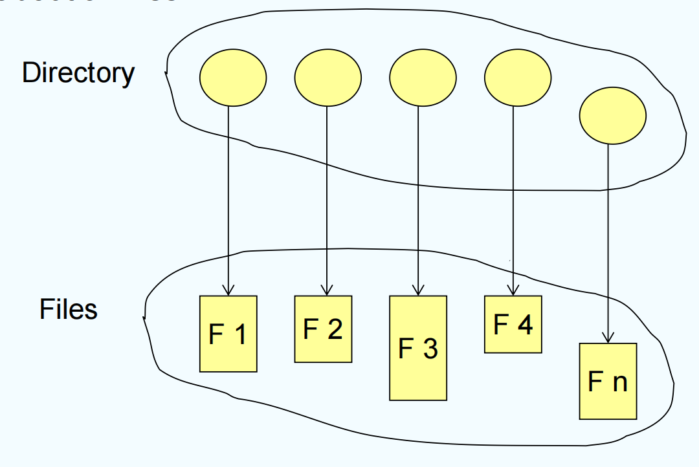
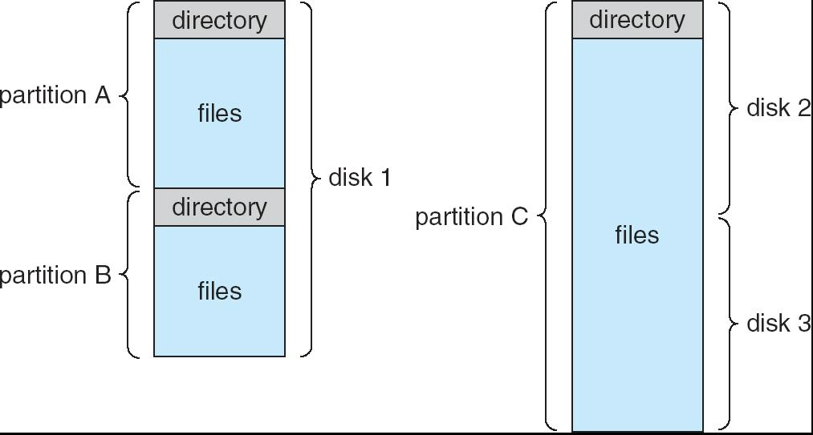
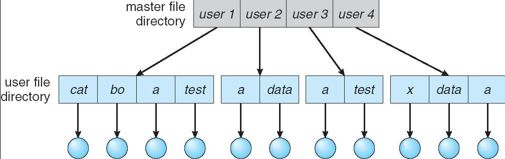
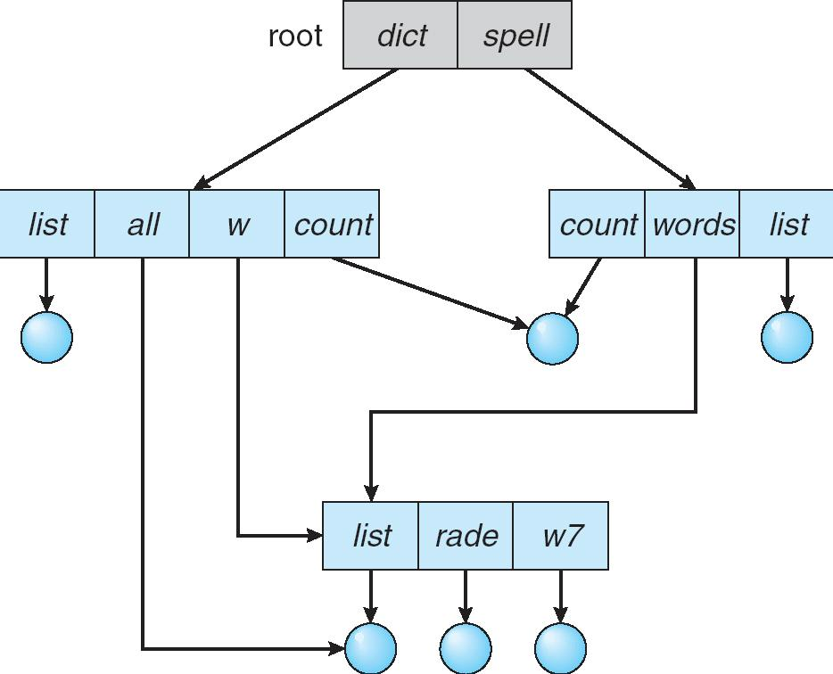
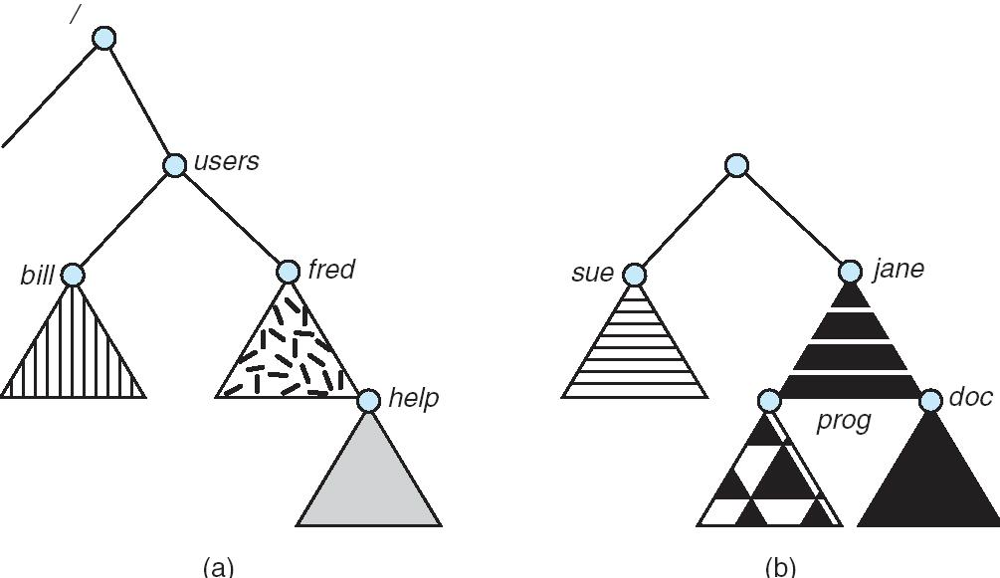

# Chapter 10 | File-System Interface


---

## What ls a File System

The way that controls how data is stored and retrieved in a storage medium.

文件系统是**管理和控制数据在存储介质中如何存储和检索**的一套方法和规则。

- File naming 文件命名（如何给文件命名）
- Where files are placed 文件放置（文件在介质上的具体位置）
- Metadata 元数据（描述文件的信息，如大小、类型等）
- Access rules 访问规则（谁能读、写、执行文件）

---

## File Concept

Contiguous logical address space

文件是一段连续的逻辑地址空间。

A sequence of bits, bytes, lines, or records. The meaning is defined by the creator and user.

可以是一串比特、字节、行或记录，具体含义由创建者和使用者决定。

Types:

文件类型分为两大类：

1. Data 数据文件

- numeric 数字
- character 字符
- binary 二进制数据

2. Program 程序文件

- Source 源代码
- Object 目标文件
- Executable 可执行文件


---

### File Structure

**None** - sequence of words, bytes

无结构：仅仅是一串字或字节。

**Simple record structure**

- Lines
- Fixed length
- Variable length

简单记录结构：如按行、定长、变长记录组织。

**Complex Structures**

- Formatted document
- Relocatable load file

复杂结构：如格式化文档、可重定位装入文件。

Can simulate last two with first method by inserting appropriate control characters

复杂结构可以通过在无结构文件中插入控制字符来模拟。

Who decides:

- Operating system
- Program

文件结构的决定者可以是操作系统，也可以是应用程序。

---

### File Attributes

每个文件都包含一组属性，用于描述和管理文件：

**Name** – only information kept in human-readable form

名称：人类可读的文件名。

**Identifier** – unique tag (number) identifies file within file system

标识符：唯一标识文件的编号。

**Type** – needed for systems that support different types

类型：区分不同类型的文件（如文本、二进制等）。

**Location** – pointer to file location on device

位置：文件在存储设备上的物理位置指针。

**Size** – current file size

大小：文件当前的字节数。

**Protection** – controls who can do reading, writing, executing

保护：规定谁可以读、写、执行该文件。

**Time, date, and user identification** – data for protection, security, and usage monitoring

时间、日期和用户标识：用于安全、保护和使用监控。

Information about files are kept in the **directory structure**, which is maintained on the disk

这些信息都保存在目录结构中，目录结构存储在磁盘上。

---

### File Operations

File is an **abstract data type**


文件被视为一种抽象数据类型，常见操作包括：

Create 创建

**Write** – define a pointer

写入（Write）：需要有一个指针指示写入位置。

Read – use the same pointer

读取（Read）：同样用指针指示读取位置。

- Per-process **current file-position pointer**

- 每个进程有自己的当前文件位置指针。

**Reposition within file** (file seek) 文件内重定位（seek）

**Delete** 删除

**Truncate** 截断

Open($F_i$) – search the directory structure on disk for entry $F_i$, and move the content of entry to memory

打开（Open）：在磁盘目录中查找文件条目并加载到内存。

Close($F_i$) – move the content of entry $F_i$ in memory to directory structure on disk

关闭（Close）：将内存中的文件条目写回磁盘目录。

---

### Open-file Table

Open() system call returns a pointer to an entry in the **open-file table**

open()系统调用会返回一个指向**打开文件表**中条目的指针。

Per-process table

每个进程有自己的打开文件表，记录：

- Current file pointer 当前文件指针
- Access rights 访问权限

System-wide table

系统范围内还有一个全局表，记录：

- Open count 文件被打开的次数

---

## Open File

Several pieces of data are needed to manage open files:

管理打开文件所需的数据包括：

- **File pointer**: pointer to last read/write location, per process that has the file open
- 文件指针：每个打开文件的进程都维护一个指向上次读/写位置的指针。
- **File-open count**: counter of number of times a file is open – to allow removal of data from open-file table when last processes closes it
- 文件打开计数：记录文件被打开的次数，便于最后一个进程关闭时清理表项。
- **Disk location of the file**: cache of data access information – system doesn’t need to read it from disk for every operation.
- 文件磁盘位置：缓存文件的物理位置信息，避免每次操作都去磁盘查找。
- **Access rights**: per-process access mode information
- 访问权限：每个进程的访问模式信息（如只读、可写等）。

---

### Open File Locking

Provided by some operating systems and file systems

文件加锁是由某些操作系统和文件系统提供的一种机制。

Mediates access to a file (by multiple processes)

主要用于协调多个进程对同一个文件的访问，防止数据冲突或破坏。

File locks are similar to reader-writer locks

文件锁类似于“读写锁”，分为两种基本类型：

- Shared lock (reader) 

**共享锁**

1. 允许多个进程同时读取文件，但不允许写入。
2. 适用于只读操作，多个进程可以安全地并发读取同一个文件。

- Exclusive lock (writer) 

**独占锁**

1. 只允许一个进程写文件，其他进程不能读也不能写。
2. 适用于写操作，保证写入期间没有其他进程访问文件，防止数据不一致。

Mandatory or advisory:

- **Mandatory** – access is denied depending on locks held and requested

**强制锁**

1. 操作系统会强制执行锁的规则。
2. 如果某个进程持有锁，其他进程的访问请求会被系统直接拒绝。
3. 例如：A进程加了写锁，B进程无论如何都无法访问该文件。

- **Advisory** – processes can find status of locks and decide what to do

**建议锁**

1. 锁的规则只是建议，操作系统不会强制阻止访问。
2. 进程可以查询锁的状态，自行决定是否访问文件。
3. 需要所有进程都自觉遵守约定，否则可能出现冲突。

---

### File Types

MS-DOS

主要通过文件扩展名（如 .exe, .txt, .bat）来区分文件类型。操作系统和应用程序根据扩展名决定如何处理文件。

MAC OS X

- Each file has a creator attribute containing the name of the program that created it.
- 每个文件有一个creator attribute（创建者属性），记录创建该文件的程序名称。即使扩展名相同，不同应用创建的文件也能区分。

UNIX

- Magic number (executable, shell script, postscript, ...)
- 通常不依赖扩展名，而是通过 magic number 来识别文件类型。幻数是文件开头的一段特殊字节序列，不同类型文件有不同的幻数（如可执行文件、脚本、PostScript 文件等）。

---

### Access Methods

Sequential Access 顺序访问

数据按顺序依次读写，不能跳跃访问。

- read next 读取下一个数据块
- write next 写入下一个数据块
- reset 重置到文件开头
- no read after last write (rewrite) 写入后不能直接读取，需重置或重新定位


> rewind 的意思是将文件的当前读写指针重新移动到文件的开头。

Direct (Random) Access 直接访问

可以直接定位到文件的任意位置进行读写。

- read n 读取第 n 个数据块
- write n 写入第 n 个数据块
- position to n 将文件指针定位到第 n 个数据块，顺序读写

    - read next
    - write next

- rewrite n 重写第 n 个数据块

n = relative block number

**Simulation of Sequential Access on a Direct-access File**


即使底层文件支持随机访问，也可以通过维护一个“当前位置指针”，每次只访问下一个块，从而模拟顺序访问。

这样可以兼容顺序访问和随机访问两种模式。

**Example of Index and Relative Files**


---

## Directory Structure

The directory can be viewed as a **symbol table** that translates file names into their file control blocks.

目录（Directory）可以看作是一个符号表（symbol table），它的作用是将文件名转换为文件控制块（File Control Block, FCB）。

A collection of nodes containing (management) information about all files

目录（Directory）可以看作是一个符号表（symbol table），它的作用是将文件名转换为文件控制块（File Control Block, FCB）。



Both the directory structure and the files reside on disk

目录结构和文件本身都存放在磁盘上。

---

### A Typical File-system Organization



The directory records information about the files in the system – such as name, location, size and type.

最顶层是目录（Directory），它包含了所有文件的记录。

每个文件的记录中包含了文件的名字、位置、大小、类型等信息。

目录和文件都实际存储在磁盘上。

---

### Operations Performed on Directory

Search for a file 搜索文件

Create a file 创建文件

Delete a file 删除文件

List a directory 列出目录

Rename a file 重命名文件

Traverse the file system – access every dir and file for backing up. 遍历文件系统

---

### Organize the Directory (Logically) to Obtain

目录结构的设计要满足以下需求：

Efficiency – locating a file quickly

效率 - 能够快速定位和访问文件，提高查找效率。

Naming – convenient to users

命名 - 方便用户使用

- Two users can have same name for different files 支持不同用户拥有同名文件（如不同用户的“report.txt”互不影响）
- The same file can have several different names 支持同一个文件有多个名字（如快捷方式、硬链接）

Grouping – logical grouping of files by properties, (e.g., all Java programs, all games, ...)

分组 - 能够按属性对文件进行逻辑分组（如所有Java程序、所有游戏等）。便于管理和查找相关文件。

---

## Single-Level Directory

A single directory for all users

所有用户的所有文件都放在同一个目录下。


实现简单，查找速度快（因为只有一个目录）。

Naming problem: 所有文件名必须唯一，用户多时容易重名，管理困难。

Grouping problem: 无法对文件进行逻辑分组，所有文件都“堆”在一起。

---

## Two-Level Directory

Separate directory for each user

为每个用户分配一个独立的目录，每个用户只能访问自己的目录。



- Path name 文件路径由“用户目录+文件名”组成。
- Can have the same file name for different user 不同用户可以有同名文件（如每个人都能有自己的“report.txt”）。
- Efficient searching 查找效率高（先定位用户目录，再查找文件）。
- No grouping capability 仍然不支持分组，每个用户的文件都在一个平铺的目录下。

---

### Tree-Structured Directories


Each directory entry contains a bit defining the entry as file(0) or directory(1).

目录可以包含文件和子目录，形成一棵树。每个目录项包含一个标志位，区分是文件（0）还是目录（1）。

Efficient searching: 通过路径快速定位文件。

Grouping Capability: 支持多级分组和分类。

Current directory (working directory) 

用户操作时有一个“当前目录”，可以用相对路径或绝对路径访问文件。

- 绝对路径如 `cd /spell/mail/prog` (从根目录出发的路径)
- 相对路径如 `cd ../count`

**Absolute** or **relative** path name

Creating a new file is done in **current directory**

Delete a file `rm <file-name>` 删除文件

Creating a new subdirectory is done in current directory `mkdir <dir-name>` 在当前目录创建文件/子目录

Example: if in current directory `mail`, `mkdir count`


Deleting “mail” $\Rightarrow$ deleting the entire subtree rooted by “mail”

删除目录会递归删除其下所有内容（如删除 mail，会删除 mail 及其所有子目录和文件）

---

### Acyclic-Graph Directories

Requirement for file sharing

需求：支持文件和目录的共享（如多个用户共享同一个文件或目录）。

Have shared subdirectories and files

实现：允许多个目录项指向同一个文件或子目录（即“链接”）。



Two different names (aliasing): 同一个文件可以有多个名字。

If dict deletes count $\Rightarrow$ dangling pointer

如果一个目录删除了共享文件，但其他目录还引用它，会出现“悬挂指针”。

??? note "Dangling Pointer"
    悬挂指针是指向已被释放或取消分配的内存位置的引用。

Solutions:

- Backpointers (keep a list of references to a file), so we can delete all pointers. But: Large, variable size reference list is a problem
- 回溯指针（Backpointers）：记录所有引用该文件的目录，删除时一并清理。但维护一个可变大小的引用列表会很复杂且占用空间。

New directory entry type

- Link – another name (pointer) to an existing file
- Resolve the link – follow pointer to locate the file

新目录项类型 Link：专门用于指向已有文件的指针，访问时自动跳转到目标文件。

1. 如果是普通文件 $\rightarrow$ 直接读取数据。
2. 如果是 Link $\rightarrow$ 操作系统看到这个标志位，就会暂停当前的读取，取出里面的路径，去寻找那个真正的目标文件。这个过程就叫 "Resolve the link"（解析链接）。

为什么它是 "Backpointers" 的替代方案？

文件 F 完全不知道 `User B` 正在引用它（不需要回溯指针）。

删除处理：如果 `User A` 删除了文件 F：

- `User B` 的 Shared_F 链接依然存在。
- 当 `User B` 试图访问时，操作系统解析路径 "/User A/F"，发现目标不存在。
- 报错 "File not found"。

**优势**：虽然产生了一个“悬挂指针”（Dangling Pointer，即失效的快捷方式），但这只是一次访问错误，不会导致系统崩溃或数据错乱，且实现起来非常简单，不需要维护复杂的引用列表。

---

## General Graph Directory

A serious problem with acyclic-graph is to ensure no cycles.

允许任意链接，包括可能形成环路（循环引用）。


If cycles allowed

- Repeated search the same object 可能导致死循环（如 A 指向 B，B 又指向 A）。
- File deletion problem (count <>0 even if unused) 文件删除和垃圾回收变得复杂（如文件还有引用但已无实际用途）。

How do we guarantee no cycles?

防止环路的方法：

- Allow only links to file not subdirectories 只允许链接到文件，不允许链接到目录。
- Garbage collection 引入垃圾回收机制。
- Every time a new link is added, use a cycle detection algorithm to determine whether it is OK 每次添加链接时用算法检测是否形成环路。

---

## Soft (Symbolic) Link vs. Hard Link

A soft link is a **separate file** that points to the original file by storing its path. 

这就像 Windows 桌面上的 “快捷方式”。

The soft link has its own inode (FCB), and its data contains the path to the linked file, not the file data itself.

- 不同的 Inode：软链接是一个全新的文件，它有自己独立的 Inode 编号（例如 $200$）。
- 数据是路径：这个新文件的数据块里存的不是照片或文字，而是一串字符路径（例如 /users/docs/original_file.txt）。
- 解析过程：操作系统打开软链接时，看到标志位说“我是个链接”，就会读取里面的路径，然后跳转过去。

悬挂指针 (Dangling Pointer) 问题：

- 如果你把原始文件删了。
- 那张“便利贴”（软链接）还在，但当你照着它去找时，会发现那里是空的。这就叫链接失效。

Soft links can **span file systems** since they are simply paths to other files.

为什么可以跨文件系统？因为它存的只是一个文本路径。只要路径写着 D:\Games\...，系统就能顺着路径找到另一个硬盘上的文件。

A hard link is an **additional name** for an existing file. It increases the file's link count, which is a count of how many names (links) a file has.

Hard Link: Both the original file and the hard link point to the same inode (FCB).

是一个文件的另一个名字。

- 同一个 Inode：硬链接只是在目录里增加了一个新的条目。文件名A 和 文件名B 都指向同一个 Inode 编号（例如 $100$）。
- 引用计数 ($Reference\ Count$)：Inode 里有一个计数器。当你创建硬链接时，计数器 $+1$。
- 删除机制：如果你删除了 文件名A，系统只是把计数器 $-1$。只要计数器不为 $0$，文件数据就还在。只有当所有名字都删掉了（计数变为 $0$），文件才会被真正删除。

Hard links cannot span file systems; one cannot create a hard link for a directory to **prevent the creation of cycles**.

为什么不能跨文件系统？Inode 编号只在它自己的分区（文件系统）内唯一。C盘的 Inode $100$ 和 D盘的 Inode $100$ 是两码事。所以硬链接不能指到另一个分区去。

为什么不能链接目录？为了防止循环 (Cycles)。如果目录 A 里面有个硬链接指向目录 B，而 B 里面又有硬链接指向 A，程序在扫描文件时就会陷入死循环（无限递归）。

---

## File System Mounting

**挂载（mount）**是指把一个文件系统（比如一个硬盘分区、U盘、光盘等）连接到操作系统的目录树上，使其内容可以被访问。

A file system must be **mounted** before it can be accessed

在操作系统中，只有挂载后的文件系统才能被用户或程序访问。未挂载的文件系统就像“孤岛”，操作系统看不到里面的文件和目录。

An un-mounted file system is mounted at **a mount point**

挂载点是一个已经存在的目录，用来作为新文件系统的“入口”。挂载后，访问这个目录就等于访问新挂载的文件系统。



(a)Existing. 原有的目录树，比如 `/` 根目录下有 `home`、`etc` 等。

(b)Unmounted Partition 有一个还没挂载的分区，比如一个新的硬盘分区。

挂载后，这个分区就会“接入”到某个目录下，比如 `/mnt/data`，这样你访问 `/mnt/data` 就是在访问新分区。

---

### Mount Point

```shell
mount /dev/dsk /users
```

- `/dev/dsk`：表示一个物理设备（比如一个硬盘分区）。
- `/users`：表示挂载点目录。


---

???+ example "question"
    下列关于目录检索的论述中，正确的是()。
    
    A.散列法具有较快的检索速度，因此现代操作系统中都用它替代传统的顺序检索方法
    
    B.在利用顺序检索法时，对树形目录应采用文件的路径名，且应从根目录开始逐级检索
    
    C.在利用顺序检索法时，只要路径名的一个分量名未找到，就应停止查找
    
    D.利用顺序检索法查找完成后，即可得到文件的物理地址

??? note "answer"
    C

    实现用户对文件的按名存取,系统先利用用户提供的文件名形成检索路径,对目录进行检索。在顺序检索中，路径名的一个分量未找到，说明路径名中的某个目录或文件不存在，不需要继续检索，选项C正确。目录的查询方式有顺序检索法和散列法两种，散列法并不适用于所有的目录结构，而且有冲突和溢出的缺点，解决的开销也较大，因此通常更多采用的是顺序检索法，选项A错误。在树形目录中，为了加快文件检索速度，可设置当前目录，于是文件路径可以从当前目录开始查找，选项B错误。在顺序检索法査找完成后，得到的是文件的逻辑地址，选项D错误。

???+ example "question"
    下面的说法中，错误的是()。
    
    I.一个文件在同一系统中、不同的存储介质上的复制文件，应采用同一种物理结构
    
    Ⅱ.对一个文件的访问，常由用户访问权限和用户优先级共同限制

    Ⅲ.文件系统采用树形目录结构后，对于不同用户的文件，其文件名应该不同
    
    IV.为防止系统故障造成系统内文件受损，常采用存取控制矩阵方法保护文件
    
    A.Ⅱ    B.I、I    C.I、Ⅲ、IV    D.全选

??? note "answer"
    D

    文件在磁带上通常采用连续存放方法，在硬盘上通常不采用连续存放方法，在内存上采用随机存放方法，选项 I 错误。对文件的访问控制，常由用户访问权限和文件属性共同限制，选项 Ⅱ 错误。在树形目录结构中，对于不同用户的文件，文件名可以不同也可以相同，选项Ⅲ 错误。防止文件受损常采用备份的方法，而存取控制矩阵方法用于多用户之间的存取权限保护，选项 IV 错误。

???+ example "question"
    设文件F1的当前引用计数为1,先建立F1的硬链接文件F2,再建立F1的符号链接文件F3,然后删除F2,则此时文件F1、F3的引用计数值分别是()。
    
    A.1、1    B.1、2    C.1、0    D.2、2

??? note "answer"
    A

    建立 F2 时，F1 和 F2 的引用计数值都变为2。建立 F3 时，符号链接文件的引用计数值不受被链接文件的影响，始终为 1，所以 F1 和 F3 的引用计数值为2和 1。删除 F2 时，F1 的引用计数值变为2-1=1，F3 的引用计数值仍保持不变，因此F1、F3 的引用计数值分别是 1、1。

???+ example "question"
    在树形目录结构中，文件已被打开后，对文件的访问采用()。
    
    A.文件符号名    B.从根目录开始的路径名    C.从当前目录开始的路径名    D.文件描述符

??? note "answer"
    D

    文件被打开后，系统为每个打开的文件分配一个文件描述符(索引号)，用来标识该文件。之后用户不再使用文件名，而使用文件描述符，来对该文件进行读、写、定位等操作。

???+ example "question"
    在一个采用索引节点的文件系统中，目录项分为文件名和索引节点编号两部分，文件名和索引节点编号各占8B,盘块大小为1KB,采用一级目录，假定文件目录中有3200个目录项，则读入一个文件的索引节点平均需要()次访问磁盘。
    
    A.25    B.26    C.51    D.52

??? note "answer"
    B

    一个目录项的大小是 16B，一个磁盘块可以存放 1024B/16B=64个目录项，存放3200个目录项共需 50 个磁盘块。因此，找到一个文件对应的目录项平均读磁盘的次数为50/2= 25，之后根据对应目录项的索引节点编号再启动磁盘读入索引节点，总读磁盘次数为26。

    **注意：查找这个节点和读取这个节点会相差一个磁盘访问。**

???+ example "question"
    若文件f1的硬链接为f2,两个进程分别打开f1和f2,获得对应的文件描述符为fd1和fd2,则下列叙述中正确的是()。
    
    I.f1和f2的读/写指针位置保持相同
    
    Ⅱ.f1和f2共享同一个内存索引节点

    Ⅲ.fd1和fd2分别指向各自的用户打开文件表中的一项
    
    A.仅Ⅲ    B.仅Ⅱ、Ⅲ    C.仅I、Ⅱ    D.I、Ⅱ和Ⅲ

??? note "answer"
    B

    多个进程打开一个文件时，读/写指针的位置不同，它们保存在各自的用户打开文件表中，选项 I 错误。硬链接是基于索引节点的共享方式，指向同一个内存索引节点，选项 Ⅱ 正确。不同进程获得的文件描述符是各自独立的，分别指向各自的用户打开文件表中的一项，选项 Ⅲ 正确。

---

## Protection

为什么需要保护？

File owner/creator should be able to control:

- what can be done
- by whom

文件的所有者或创建者应该能够控制：

- 可以对文件执行哪些操作
- 谁可以执行这些操作

Types of access

常见的访问类型

- Read
- Write
- Execute
- Append
- Delete
- List

---

### Access Lists and Groups

Mode of access(访问模式): read, write, execute

Three classes of users 三类用户


1. Owner（所有者）：文件的创建者或拥有者
2. Group（组）：与所有者属于同一用户组的用户
3. Others（其他人）：系统中除所有者和组成员外的其他用户

Ask manager to create a group (unique name), say G, and add some users to the group.

可以让管理员创建一个组（group），比如 G，并把一些用户加入这个组。

For a particular file (say game) or subdirectory, define an appropriate access.

对于某个文件或目录（如 game），可以为这个组定义特定的访问权限。这样，组内成员可以共享对某些文件的访问权，而其他用户则无法访问。


`chmod 761 game`

- 这是 Linux/Unix 下设置文件权限的命令。
- `761` 是八进制权限码，分别对应 Owner、Group、Others 三类用户的权限。

---