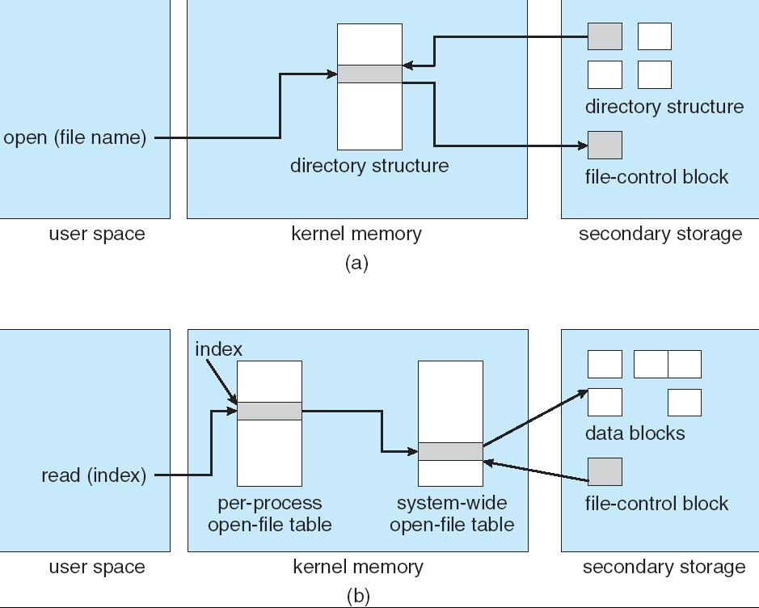
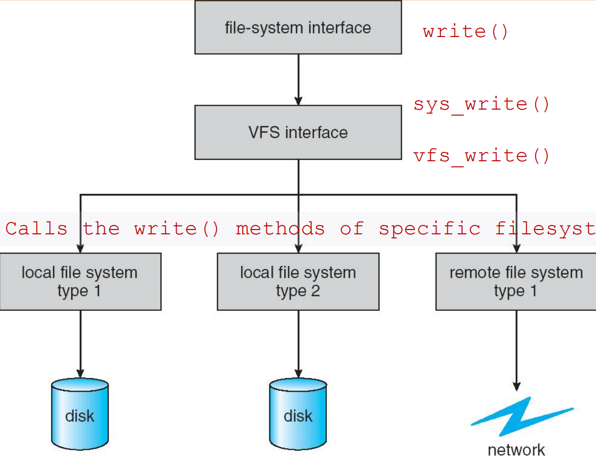
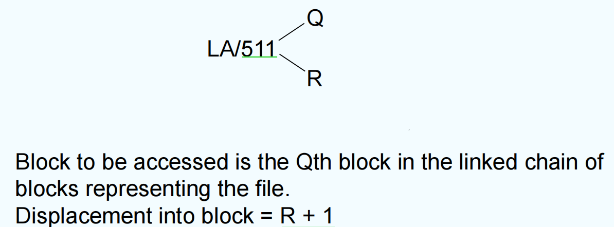
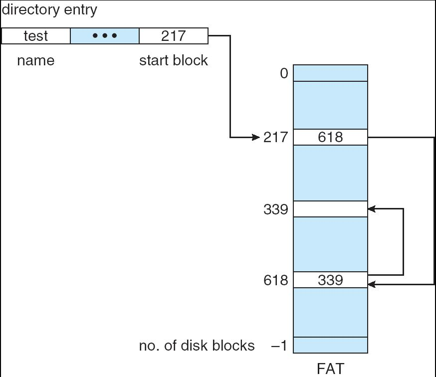
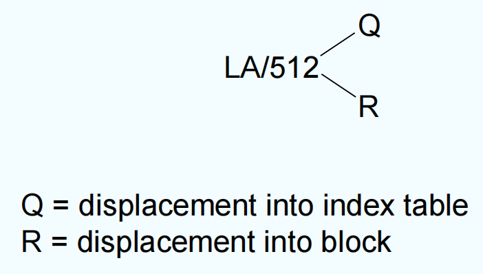
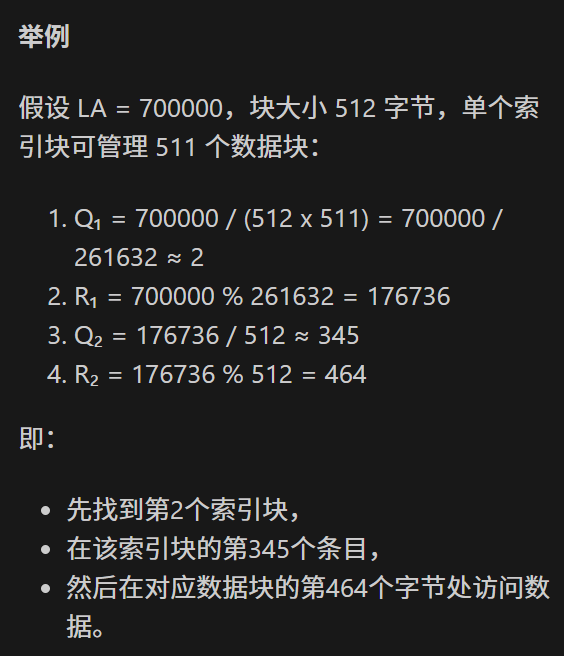
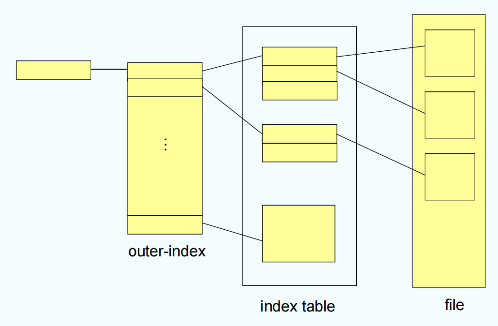
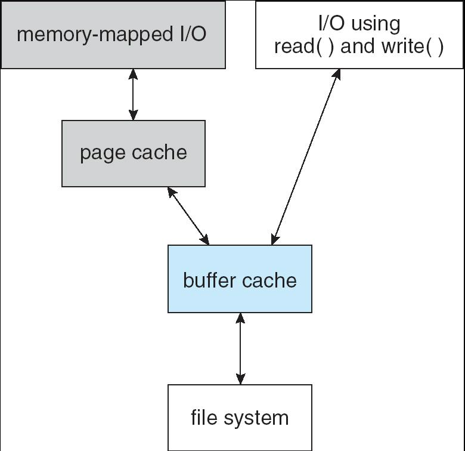
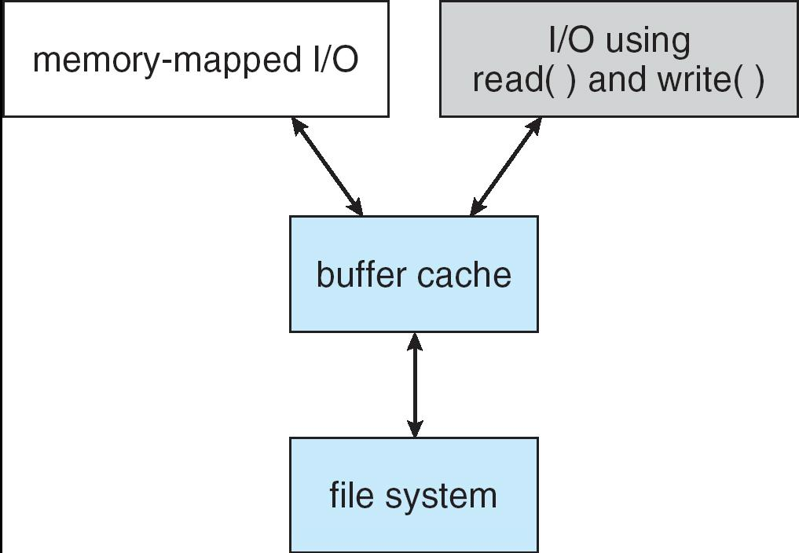

# Chapter 11 | File System Implementation

Tmpfs, a temporary file system in memory, fast but not persistent

一种基于内存的临时文件系统，速度非常快，但数据不会持久保存（重启后数据丢失）。常用于存放临时文件，比如 /tmp 目录。

Squashfs, a read-only compressed file system supporting fast access

一种只读的压缩文件系统，支持快速访问。常用于嵌入式系统、LiveCD 等场景，节省存储空间。

Ext4, the main Linux journaling file system, reliable

Linux 下主流的日志型文件系统，具有高可靠性和较好的性能。支持大文件、日志记录（防止数据丢失）。

Ceph, an open source distributed and scalable file system

一个开源的分布式、可扩展文件系统，适合大规模存储集群。支持高可用性和弹性扩展。

FAT, simple and robust file system widely used for compatibility

文件分配表（File Allocation Table），一种简单、健壮且兼容性极强的文件系统。广泛用于U盘、SD卡等移动存储设备。

- Why so many file systems?
- File system is still one of the most active areas of OS research!

为什么有这么多文件系统？

不同的应用场景、性能需求、兼容性要求等，导致需要不同类型的文件系统。

---

## File-System Structure

File structure（文件结构）

- Logical storage unit
- Collection of related information

文件是逻辑存储单元，是相关信息的集合。

File system resides on secondary storage (disks)

文件系统通常存放在二级存储设备（如磁盘）上。

File system is composed of many layers

文件系统由多个层次组成，每一层负责不同的功能。

**Layered File System**

1. 应用程序/用户接口层

作用：为用户和应用程序提供访问文件的接口，如 `open`、`read`、`write`、`close` 等系统调用。

例子：你在命令行输入 `cat file.txt`，或用 Python 的 `open()` 读写文件，都是通过这一层。

2. 逻辑文件系统层

作用：管理文件的元数据（如文件名、权限、目录结构），实现文件的命名空间、访问控制、目录操作等。

例子：决定 `/home/user/file.txt` 这个路径如何映射到具体的文件对象。

3. 文件组织模块

作用：负责文件的逻辑结构与物理结构之间的映射，比如文件如何分块存储、如何分配和释放空间。

例子：决定文件内容分布在哪些磁盘块上，如何查找和分配空闲块。

4. 基本文件系统层

作用：提供对物理块的基本读写操作，管理缓存、调度磁盘 I/O 请求。

例子：实现“读第 100 号磁盘块”或“写入第 200 号磁盘块”这样的操作。

5. I/O 控制层

作用：负责与设备驱动程序交互，发出具体的硬件操作命令（如启动磁盘读写、检测设备状态）。

例子：把“读第 100 号块”的请求转化为磁盘控制器能理解的命令。

6. 设备层

作用：实际的物理存储设备，如硬盘、SSD、U盘等。

例子：真正存储数据的硬件部分。

---

## Data Structures Used to Implement FS

Disk structures

这些结构永久存储在磁盘上，即使关机也不会丢失，是文件系统的核心元数据。

- Boot control block (per volume)
- Volume control block per volume (superblock in Unix)
- Directory structure per file system
- Per-file FCB (inode in Unix)

1. Boot control block（引导控制块）

- 每个卷（volume）有一个。
- 作用：包含启动操作系统所需的信息（如引导程序），通常位于磁盘的最前面。

2. Volume control block（卷控制块）

- 每个卷有一个，在 Unix 中叫 superblock（超级块）。
- 作用：记录整个文件系统的全局信息，如总块数、空闲块数、inode 数量、文件系统类型等。

3. Directory structure（目录结构）

- 每个文件系统有一套目录结构。
- 作用：保存文件和目录的层次关系、文件名到 inode/FCB 的映射。
- 例子：`/home/user/` 目录下有哪些文件和子目录。

4. Per-file FCB（文件控制块）

- FCB（File Control Block），在 Unix 中叫 inode。
- 作用：记录单个文件的元数据，如文件大小、所有者、权限、数据块指针、时间戳等。

In-memory structures (see fig)

这些结构只存在于内存中，用于加速文件系统操作，提高效率，关机后会丢失。

- In-memory mount table about each mounted volume
- Directory cache for recently accessed directories
- System-wide open-file table
- Per-process open-file table

1. In-memory mount table（内存中的挂载表）

- 记录当前系统已挂载的所有卷的信息（如挂载点、文件系统类型等）。
- 作用：让操作系统知道哪些文件系统已经挂载到哪些目录。

2. Directory cache（目录缓存）

- 缓存最近访问过的目录信息。
- 作用：加快目录查找速度，减少磁盘访问次数。

3. System-wide open-file table（系统级打开文件表）

- 记录系统中所有进程当前打开的文件信息（如文件指针、引用计数等）。
- 作用：实现文件共享、管理文件的全局状态。

4. Per-process open-file table（每个进程的打开文件表）

- 每个进程有自己的打开文件表，记录该进程打开的文件及其状态（如读写指针、访问模式等）。
- 作用：支持多进程独立访问文件。

---

### A Typical File control Block

**File control block** – storage structure consisting of information about a file

FCB 是文件系统用来描述和管理单个文件的核心数据结构。

1. file permissions: 记录谁可以对该文件进行读、写、执行等操作。
2. file dates (create, access, write): 文件时间戳：创建、访问、修改。
3. file owner, group, ACL: 文件所有者、所属组、访问控制列表。
4. file size: 文件大小（以字节为单位）。
5. file data blocks or pointers to file data blocks（文件数据块或指向数据块的指针）: 记录文件实际内容存放在磁盘上的位置。可能直接存储数据块编号，也可能是指向数据块的指针（如 inode 结构中的直接、间接块指针）。

!!! info "NOTICE"
    FCB 里面是不存储文件名的，文件名存储在目录结构中，并通过目录项与 FCB 关联。

    为什么？因为一个文件可能有多个名字（硬链接），如果把文件名存储在 FCB 里，会导致数据冗余和一致性问题。

---

### In-Memory File System Structures

The following figure illustrates the necessary file system structures provided by the operating systems.

- Figure 12-3(a) refers to **opening** a file.
- Figure 12-3(b) refers to **reading** a file.

(a) 打开文件（open）

1. 用户空间（user space）用户进程发出 `open(file name)` 请求，想要打开一个文件。
2. 内核内存（kernel memory）

- 操作系统在内存中维护目录结构（directory structure），用于查找文件名对应的文件。
- 目录结构会指向磁盘上的实际目录结构和文件控制块（file-control block, FCB/inode）。

3. 外存（secondary storage）

- 目录结构和文件控制块实际存储在磁盘上，内存中只缓存部分信息以加速访问。
- 打开文件时，系统会把相关目录项和文件控制块信息加载到内存。

(b) 读取文件（read）

1. 用户空间（user space）用户进程发出 `read(index)` 请求，想要读取文件内容。
2. 内核内存（kernel memory）

- 每个进程有自己的打开文件表（per-process open-file table），记录该进程打开的文件及其状态（如读写指针）。
- 系统还有一个系统级打开文件表（system-wide open-file table），记录所有进程当前打开的文件信息，实现文件共享和全局管理。
- 进程的打开文件表通过索引（index）指向系统级打开文件表。

3. 外存（secondary storage）系统级打开文件表会指向磁盘上的文件控制块（file-control block），文件控制块再指向实际的数据块（data blocks），即文件内容所在的磁盘位置。

---

## Virtual File Systems

Virtual File Systems (VFS) provide an object-oriented way of implementing file systems. VFS is NOT a disk file system!

**VFS（虚拟文件系统）**是一种“面向对象”的文件系统实现方式。它不是实际存储数据的磁盘文件系统，而是一个“中间层”或“抽象层”，为不同类型的文件系统（如 ext4、FAT、NFS 等）提供统一的接口和管理机制。

VFS allows the same system call interface (the API) to be used for different types of file systems.

VFS 让操作系统可以用同一套系统调用接口（API）（如 open、read、write、close）来访问不同类型的文件系统。用户和应用程序不需要关心底层文件系统的具体实现，只需调用统一的 API。

The API is to the VFS interface, rather than any specific type of file system.

应用程序和用户通过 API 访问的是 VFS 接口，而不是某个具体的文件系统（比如 ext4 或 FAT）。VFS 负责把这些通用的 API 请求“翻译”并分发到对应的底层文件系统驱动。

Defines a network-wide unique structure called **vnode**.

VFS 定义了一种叫做 vnode（虚拟节点）的结构。vnode 是对“文件”或“目录”的统一抽象，无论底层是本地磁盘文件、远程网络文件，还是其他类型的文件系统，VFS 都用 vnode 来表示和管理它们。vnode 使得跨网络、跨文件系统的操作变得统一和透明。

**Schematic View of Virtual File System**

---

### In-Memory VFS objects

The four primary object types of VFS:

- superblock object: a specific mounted filesystem，对应(但不是)磁盘文件系统的文件系统超级块或控制块。
- inode object: a specific file, 对应(但不是)磁盘文件系统的文件控制块
- dentry object: an individual directory entry
- file object: an open file as associated with a process, 只要文件一直打开，这个对象就一直存在于内存。

---

## Directory Implementation

**Linear list** of file names with pointer to the data blocks.

目录用一个线性表（数组或链表）来存储所有文件名及其对应的数据块指针。

- simple to program
- time-consuming to execute

**简单易实现**：只需顺序存储文件名和指针，编程简单。

**查找慢**：每次查找文件时，都要从头到尾顺序遍历整个列表，效率低，尤其是目录项很多时。

**Hash Table** – linear list with hash data structure.

在原有线性表的基础上，增加了哈希数据结构，通过哈希函数将文件名映射到哈希表中的位置。

- decreases directory search time
- **collisions** – situations where two file names hash to the same location
- fixed size – can use chained-overflow hash table
- Or rehashing to another larger hash table

**查找快**：大大减少了查找时间，通常接近常数时间（O(1)）。

**冲突**（collisions）：不同文件名可能被哈希到同一个位置，需要解决冲突（如链式哈希、开放定址等）。

**固定大小**：哈希表通常有固定大小，目录项过多时可能需要扩容（rehashing）。

---

## Allocation Methods

An allocation method refers to how disk blocks are allocated for files:

- Contiguous allocation 连续分配
- Linked allocation 链接分配
- Indexed allocation 索引分配

---

### Contiguous Allocation

Each file occupies a set of contiguous blocks on the disk

每个文件在磁盘上占据一组连续的块。只需记录起始块号和长度（块数），即可定位整个文件。

Simple – only starting location (block #) and length (number of blocks) are required

**实现简单**：只需两个参数（起始位置和长度）。

Random access supported

**支持随机访问**：可以直接通过偏移量定位到文件的任意位置，访问速度快。

Wasteful of space (dynamic storage-allocation problem)

**空间利用率低**：容易产生“外部碎片”，即磁盘上有很多小的空闲块，但无法满足大文件的连续分配需求。

Files cannot grow

**文件不能动态增长**：如果文件需要扩展，后面空间可能已被其他文件占用，导致扩展困难。

Mapping from logical to physical

- LA：逻辑地址（文件内部的字节编号，从0开始）
- 512：每个磁盘块的大小（单位：字节），这里假设每块512字节
- Q：逻辑块号（文件内第几个块，从0开始）
- R：块内偏移（逻辑地址在块内的字节偏移）

---

#### Extent-Based Systems

Many newer file systems use a modified contiguous allocation scheme

现代文件系统对连续分配做了改进，采用区段（extent）分配。

Extent-based file systems allocate disk blocks in **extents**

一个extent是若干连续磁盘块的集合。

An **extent** is a contiguous block of disks

一个文件可以由多个extent组成，每个extent仍是连续的。

- Extents are allocated for file allocation 文件可以动态增长，只需为新数据分配新的extent。
- A file consists of one or more extents. 文件由一个或多个extent组成。

---

### Linked Allocation

Each file is a linked list of disk blocks: blocks may be scattered anywhere on the disk.

每个文件在磁盘上由一系列分散的磁盘块组成，这些块通过指针串联成一个链表。

每个磁盘块除了存放数据外，还存放一个指向下一个块的指针。只需记录文件的起始块号，就可以通过指针依次找到文件的所有数据块。

Simple – need only starting address

**实现简单**：只需记录起始地址，后续块通过指针串联。

Free-space management system – no waste of space

**空间利用率高**：磁盘空间不会产生外部碎片，空闲块可以灵活利用。

**No random access, poor reliability**

**不支持随机访问**：要访问文件的第n个块，必须从头顺序遍历n次，效率低。

**可靠性差**：如果某个块的指针损坏，后续数据就无法访问，链断了。

**指针占用空间**：每个块都要存储指针，会占用一部分存储空间。

Mapping

**File-allocation table** (FAT) – disk-space allocation used by MS-DOS and OS/2.

FAT 是一种特殊的链接分配实现方式，广泛用于 MS-DOS、Windows 的 FAT12/16/32 文件系统，以及U盘、SD卡等。

文件分配表（FAT）是一个数组，每个元素对应一个磁盘块，存储该块的“下一个块号”。

文件的目录项只需记录起始块号，后续块号通过查表依次获得。

FAT 表较大时，需常驻内存，占用空间。

随机访问效率较低，需要多次查表。

---

### Indexed Allocation

Brings all pointers together into the index block.

索引分配是将一个文件所有的数据块指针集中存放在一个**索引块（index block）**中。

Logical view.

- 每个文件有一个索引块，索引块中每个条目指向该文件的一个数据块。
- 目录项只需记录索引块的地址。

**Example of Indexed Allocation**

- directory（目录）：目录项记录文件名（如 jeep）和该文件的索引块号（如 19）。
- index block（索引块）：每个文件有一个索引块，索引块中每个条目存放一个数据块的物理块号。例如，索引块 19 中依次存放：9、16、1、10、25、-1、-1、-1。
- 磁盘块：磁盘上所有的数据块可以分布在任意位置，索引块中的每个数字指向一个实际的数据块。

**访问流程**

1. 查目录项，找到文件 jeep 的索引块号为 19。
2. 查索引块，读取索引块 19，获得 jeep 文件所有数据块的物理地址列表。
3. 访问数据块，例如 jeep 文件的数据依次存放在块号 9、16、1、10、25。-1 表示文件结束（或未用）。

Need **index table** (analogous to **page table**)

索引分配解决了连续分配的外部碎片问题和链接分配不能有效支持随机访问的问题。它为每个文件分配一个索引块 (Index Block)，这个块就像是一个“目录”或“索引表”，包含了指向文件所有数据块的指针。

Random access

可以直接通过索引块找到第 $n$ 个数据块，无需像链接分配那样逐个遍历。

Dynamic access without external fragmentation, but have overhead of index block.

数据块可以分布在磁盘的任何位置，只要有空闲块即可。即使是很小的文件也需要占用一整个索引块。

When mapping from logical to physical in a file of maximum size of 256K words and block size of 512 words. We need only 1 block for index table.

- Q = LA / 512：Q 是逻辑地址 LA 所在的数据块号，也是在索引表（index table）中的偏移（即第几个数据块）。
- R = LA % 512：R 是逻辑地址 LA 在数据块内的偏移（即块内字节偏移）。

When mapping from logical to physical in a file of unbounded length (block size of 512 words). – more pointers are needed

如果每个磁盘地址（指针）占用 $1$ 个字，那么一个大小为 $512$ 字的索引块正好可以存放 $512$ 个指针。因此，只需要 1 个索引块即可覆盖该文件的最大范围。

**Linked scheme** – Link blocks of index table (no limit on size).

**对于超出单个索引块容量的超大文件，或者长度不确定的文件，我们需要扩展索引块。**链接方案是其中一种常见的解决方法。在链接方案中，一个索引块通常包含一个指向文件数据块的指针列表，但其**最后一个条目**（或特定位置）存储的是**下一个索引块的地址**。

- LA / (512 x 511) 得到 $Q_1$ 和 $R_1$：$Q_1$ 是第几个索引块。
- $R_1$ % (512 x 511) 得到 $Q_2$ 和 $R_2$：$Q_2$ 是索引块内的第几个条目，$R_2$ 是数据块内的字节偏移。

**Combined Scheme: UNIX (4K bytes per block)**

- mode：文件类型和权限（如普通文件、目录、可读/写/执行等）。
- owners (2)：文件所有者和所属组。
- timestamps (3)：文件的时间戳（创建、访问、修改时间）。
- size block count：文件大小和所占块数。
- 直接块（direct blocks）：inode 里有若干直接指针，每个指针直接指向一个数据块。适合小文件，访问速度快，结构简单。
- 单重间接块（single indirect）：指针指向一个间接块，间接块里存放更多数据块的指针。适合中等大小文件，扩展了可管理的数据块数量。
- 双重间接块（double indirect）：指针指向一个块，这个块里存放的是间接块的指针，每个间接块再指向数据块。适合更大的文件，进一步扩展了文件最大长度。
- 三重间接块（triple indirect）：指针指向一个块，这个块里存放的是双重间接块的指针，每个双重间接块再指向间接块，间接块再指向数据块。适合超大文件，理论上文件长度几乎无限制。

??? note "为什么页表不这样设计？"
    第一就是，如果是这样的话，页表查询是由 MMU 硬件来完成的，而不是由操作系统软件来完成的。MMU 硬件实现条件的复杂度会大大增加，从而增加成本。

    第二就是，像栈是由高地址向低地址增长的，如果页表设计成这样的话，那么栈页表项就会放在页表的末尾。也就是说，如果我要访问栈页表项的话，就需要逐层访问下去，直到最后一层才能找到栈页表项，这样效率就会很低。

---

### Free-Space Management

Bit vector (n blocks)

用一个**位图（bit vector）**来表示磁盘上的每个块是否空闲。

每一位对应一个磁盘块，0 表示空闲，1 表示已分配。

查找空闲块时，只需扫描位图，找到第一个 0 即可。

Block number calculation (finding the first free block)

找到第一个空闲块的位置：

(number of bits per word) * (number of 0-value words) + offset of first 1 bit

Bit map requires extra space

位图本身需要占用额外空间（但通常很小）。

- Example: 

block size = $2^{12}$ bytes = 4096 bytes

disk size = $2^{30}$ bytes = 1 GB

n = $\frac{2^{30}}{2^{12}} = 2^{18}$ bits = 256 Kbits = 32 Kbytes

例如：块大小 4096 字节，磁盘 1GB，则需要 32KB 的位图。

**Easy to get contiguous files**

易于查找连续空闲块，适合需要分配大文件或连续空间的场景。

**Bit map** 也有一些变种。

**Linked list** (free list)

用链表记录所有空闲块，每个空闲块包含指向下一个空闲块的指针。只需记录链表头即可。

- Cannot get contiguous space easily 不易获得连续空间，每次只能分配一个块，查找连续空闲块效率低。
- But basically can work (FAT) 实现简单，适合 FAT 文件系统。
- No waste of space 无空间浪费，只用空闲块自身存储指针。

**Grouping** – a modification of the Linked List

- Addresses of the n free blocks are stored in the first block.
- 每个分组块存储 n 个空闲块的地址，最后一个地址指向下一个分组块。
- The first n-1 blocks are actually free. The last block contains addresses of another n free blocks
- 前 n-1 个块是实际空闲块，最后一个块指向下一个分组。

Counting

- Address of the first free block and number n contiguous blocks
- 只记录第一个空闲块的地址和连续空闲块的数量。

---

#### Linked Free Space List on Disk

---

Need to protect:

- Pointer to free list
- Bit map

1. Must be kept on disk

空闲空间信息（如空闲链表指针、位图）必须保存在磁盘上，否则断电或系统崩溃后会丢失。

2. The copy in memory and disk may differ

内存中的副本和磁盘上的副本可能会不一致，比如内存已标记为分配，磁盘还没更新。

3. Cannot allow for block[i] to have a situation where bit[i] = 1 in memory and bit[i] = 0 on disk

不能出现内存和磁盘状态不一致的情况（如 block[i] 在内存中是已分配，磁盘上却是空闲）。

- Solution:

1. Set bit[i] = 1 in disk

先更新磁盘：先把 bit[i]（位图或链表）在磁盘上设置为已分配（1）。

2. deallocate block[i]

再释放块：执行实际的块释放操作（deallocate block[i]）。

3. Set bit[i] = 1 in memory

最后更新内存：最后把 bit[i] 在内存中也设置为已分配（1）。

---

## Efficiency and Performance

Efficiency dependent on:

- **disk allocation** and **directory** algorithms 磁盘分配和目录算法
- types of data kept in file’s directory entry (for example “last write date” is recorded in directory) 目录项中保存的数据类型（如“最后写入日期”）

**Generally, every data item has to be considered for its effect.**

文件系统设计时，每一项元数据、每一个结构的选择都会影响整体效率和性能。

Performance

- **disk cache** – separate section of main memory for frequently used blocks

在主存（RAM）中划出一块区域，专门缓存经常访问的磁盘块。

- **free-behind and read-ahead** – techniques to optimize sequential access

free-behind：顺序读取文件时，已经读取过的数据块可以立即从缓存中释放，腾出空间给后续数据块，适合顺序访问场景。

read-ahead：顺序读取文件时，系统会预先加载后续的数据块到缓存中，减少等待磁盘I/O的时间，提高顺序读的效率。

- improve PC performance by dedicating section of memory as virtual disk, or **RAM disk**

用一部分内存模拟磁盘，作为虚拟磁盘使用，速度极快（因为直接在内存中操作）。适合存放临时文件或对性能要求极高的场景，但数据不持久，断电即失。

---

## Page Cache

A **page cache** caches pages rather than disk blocks using **virtual memory** techniques

Page Cache（页缓存）是操作系统利用虚拟内存技术，把磁盘文件的数据以“页”为单位缓存在内存中的机制。

??? note
    Page Cache (页缓存)：面向虚拟内存的。它以“页”（通常是 $4\text{KB}$）为单位，缓存文件的逻辑内容。

    Buffer Cache (块缓存/缓冲池)：面向磁盘设备的。它以“磁盘块”为单位，缓存物理磁盘上的原始数据。

Memory-mapped I/O uses a page cache

Memory-mapped I/O（内存映射I/O）：

- 进程通过 `mmap` 等系统调用，把文件内容直接映射到自己的虚拟地址空间。
- 访问文件就像访问普通内存一样，实际数据由 `Page Cache` 管理。
- 这种方式直接利用 `Page Cache` 。

Routine I/O through the file system uses the buffer (disk) cache

常规文件I/O（Routine I/O）：

- 通过 `read` 、 `write` 等系统调用访问文件。
- 传统上使用 `buffer cache` （磁盘块缓存），但现代操作系统会将 `buffer cache` 和 `page cache` 合并，统一管理。

This leads to the following figure

带来的问题：

- 浪费空间：同一份文件数据在物理内存中可能存了两份：一份在 `page cache` 中，一份在 `buffer cache` 中。
- 一致性风险：如果一个进程用 `mmap` 修改了 `Page Cache`，另一个进程用 `read` 读取 `Buffer Cache`，可能会读到旧数据。
- CPU 损耗：在两个缓存之间移动数据需要消耗大量的 CPU 周期。

---

### Unified Buffer cache

A unified buffer cache uses the same page cache to cache both **memory-mapped pages** and ordinary **file system I/O**

为了解决上述缺陷，现代操作系统（如 Linux、Windows）采用了统一缓冲缓存 (Unified Buffer Cache)。

合二为一：操作系统不再维护两个独立的缓存。无论是 mmap 还是 read/write，最终都指向同一个内存区域——统一页缓存 (Unified Page Cache)。

工作流程：

1. 当调用 `read()` 时，内核先检查 `Page Cache`。
2. 如果数据不在内存，它会请求文件系统将磁盘块加载到 `Page Cache` 中。
3. `mmap` 同样直接映射到这些 `Page`。

Avoids double caching

**I/O Using a Unified Buffer cache**

---

???+ example "question"
    有些操作系统中将文件描述信息从目录项中分离出来，这样做的好处是（）。
    
    A.减少读文件时的I/O信息量
    
    B.减少写文件时的I/O信息量
    
    C.减少查找文件时的I/O信息量
    
    D.减少复制文件时的I/O信息量

??? note "answer"
    C

    将文件描述信息从目录项中分离出来，可以减少查找文件时的I/O信息量。即使用了索引节点（inode）来存储文件的元数据，目录项只存储文件名和对应的inode号。这样，在查找文件时，只需读取目录项获取inode号，然后直接访问inode获取文件描述信息，避免了多次I/O操作，提高了查找效率。

???+ example "question"
    某文件系统采用显示链接分配方式组织文件，磁盘块大小为4KB，一个簇包含两个磁盘块，操作系统以簇为单位进行盘块分配。已知系统支持的最大文件长度为512MB,若FAT的每个表项仅存放簇号，则FAT表占用的空间大约是（）。
    
    A.64KB B.128KB C.512KB D.1024KB

??? note "answer"
    B

    最大文件长度为512MB，磁盘块大小为4KB，一个簇包含两个磁盘块，因此每个簇的大小为8KB。要计算FAT表的大小，首先需要计算文件系统中最大支持的簇数：

    最大文件长度 / 每个簇的大小 = 512MB / 8KB = $2^{16}$个簇

    FAT（文件分配表）的每个表项用于存放簇号。为了能够寻址 $2^{16}$ 个簇，簇号的位数必须足以表示这个范围。
    
    簇号位数：要表示 $2^{16}$ 个不同的地址，至少需要 $16$ 位（bit）。$16\text{ bits} = 2\text{ bytes}$

    簇数 * 每个表项大小 = $2^{16}$ * 2字节 = 128KB

    因此，FAT表占用的空间大约是128KB，选项B正确。

???+ example "question"
    某文件系统中，针对每个文件，用户类别分为4类：安全管理员、文件主、文件主的伙伴、其他用户；访问权限分为5种：完全控制、执行、修改、读取、写入。若文件控制块中用二进制位串表示文件权限，为表示不同类别用户对一个文件的访问权限，则描述文件权限的位数至少应为（）。

    A.5    B.9    C. 12    D. 20

??? note "answer"
    

???+ example "question"
    逻辑文件系统的功能有（）。

    I.文件按名存取  II.文件目录组织管理  III.把文件名转换为文件描述符或文件句柄  IV.存储保护

    A.I、II和III    B.II、III和IV   C.I、II和IV   D.I、II、III和IV

??? note "answer"
    D

    逻辑文件系统的功能包括文件按名存取、文件目录组织管理、把文件名转换为文件描述符或文件句柄以及存储保护。因此，选项D是正确的。

???+ example "question"
    UNIX操作系统中，文件的索引结构放在（）。
    
    A.超级块    B.索引节点    C.目录项    D.空闲块

??? note "answer"
    B

    在UNIX操作系统中，文件的索引结构存储在索引节点（inode）中。索引节点包含文件的元数据，如文件类型、权限、所有者、大小以及数据块的位置等。因此，选项B是正确的。超级块用于存储文件系统的总体信息，用来描述文件系统的。目录项用于存储文件名和对应的索引节点号。空闲块用于管理未使用的磁盘空间。

???+ example "question"
    文件的存储空间管理实质上是对（）的组织和管理。
    
    A.文件目录    B.外存已占用区域    C.外存空闲区    D.文件控制块

??? note "answer"
    C

    文件存储空间管理即文件空闲空间管理。文件管理要解决的重要问题是，如何为创建文件分配存储空间，即如何找到空闲盘块，并对其管理。

???+ example "question"
    对外存文件区的管理应以（）为主要目标。
    
    A.提高系统吞吐量    B.提高换入换出速度    C.降低存储费用    D.提高存储空间的利用率

??? note "answer"
    D

    文件区占磁盘空间的大部分，因为通常的文件都较长时间地驻留在外存上，对它们的访问频率是较低的，所以对文件区管理的主要目标是提高存储空间的利用率。

---