# Chapter 12 | Mass-Storage Systems

## Overview of Mass Storage Structure

Magnetic disks provide bulk of secondary storage of modern computers

**磁盘（Magnetic disks）**是现代计算机中最常用的二级存储设备，用于存放大量数据（如操作系统、应用程序、用户文件等）。

- Drives rotate at 60 to 200 times per second

磁盘以每秒60到200转的速度旋转，常见的有5400rpm、7200rpm、10000rpm等。

- **Transfer rate** is rate at which data flow between drive and computer

指数据在磁盘和计算机之间传输的速度，单位通常为MB/s或Gbps。

- **Positioning time** (**random-access time**) is time to move disk arm to desired cylinder (**seek time**) and time for desired sector to rotate under the disk head (**rotational latency**)

1. 寻道时间（Seek time）：磁头移动到目标柱面（cylinder）所需的时间。
2. 旋转延迟（Rotational latency）：目标扇区旋转到磁头下方所需的时间。
3. 定位时间 = 寻道时间 + 旋转延迟

- **Head crash** results from disk head making contact with the disk surface

如果磁头与磁盘表面接触，会造成数据损坏，这叫做“磁头碰撞”，是硬盘最严重的故障之一。

Disks can be removable

有些磁盘（如U盘、移动硬盘、光盘等）可以从计算机中移除，便于数据携带和备份。

Drive attached to computer via **I/O bus** 磁盘通过I/O总线与计算机主机相连。

- Buses vary, including EIDE, ATA, SATA, USB, Fiber Channel, SCSI 总线类型多样
- Host controller in computer uses bus to talk to disk controller built into drive or storage array 

磁盘控制器内置于驱动器或存储阵列中，主机控制器通过总线与其通信。

1. platter 盘片

- 磁盘内部有多个盘片（platter），每个盘片表面都可以存储数据。
- 盘片通常由铝、玻璃或陶瓷材料制成，表面涂有磁性材料。

2. spindle 轴心

- 多个盘片通过主轴（spindle）串联在一起，主轴带动所有盘片同步旋转。
- 旋转速度通常为5400rpm、7200rpm、10000rpm等。

3. track 磁道

- 每个盘片表面被划分为若干同心圆环，每个圆环称为一个磁道（track t）。
- 磁道是数据的基本存储单位之一。

4. sector 扇区

- 每个磁道又被划分为若干扇区（sector s），每个扇区存储固定大小的数据（如512字节、4KB等）。
- 扇区是磁盘上数据存取的最小单位。

5. cylinder 柱面

- 所有盘片上相同编号的磁道组成一个柱面（cylinder c）。
- 磁头在同一柱面上切换时无需移动臂，读写速度快。

6. arm assembly 磁臂组件 和 arm 磁臂

- 磁臂组件控制所有磁头的移动。
- **磁臂（arm）**带动磁头在盘片半径方向移动，实现对不同柱面的访问。

7. read-write head 读写磁头

- 每个盘片表面有一个读写磁头，用于读取和写入数据。
- 所有磁头固定在同一个磁臂组件上，能同步移动到同一柱面。

8. rotation 旋转

- 盘片以恒定速度旋转，磁头通过移动臂定位到目标柱面，等待目标扇区旋转到磁头下方进行读写。

---

### Disk Sector

Disk structures:

- Track
- Geometrical sector
- Track sector
- Cluster

Each sector stores a fixed amount of user- accessible data, traditionally 512 bytes for hard disk drives (HDDs) and 2048 bytes for CD- ROMs and DVD-ROMs. Newer HDDs use 4096- byte (4 KiB) sectors, which are known as the Advanced Format (AF).

每个扇区存储固定量的用户可访问数据，传统上硬盘驱动器 (HDD) 为 512 字节，CD-ROM 和 DVD-ROM 为 2048 字节。较新的 HDD 使用 4096 字节（4 KiB）的扇区，这种格式被称为高级格式 (AF)。

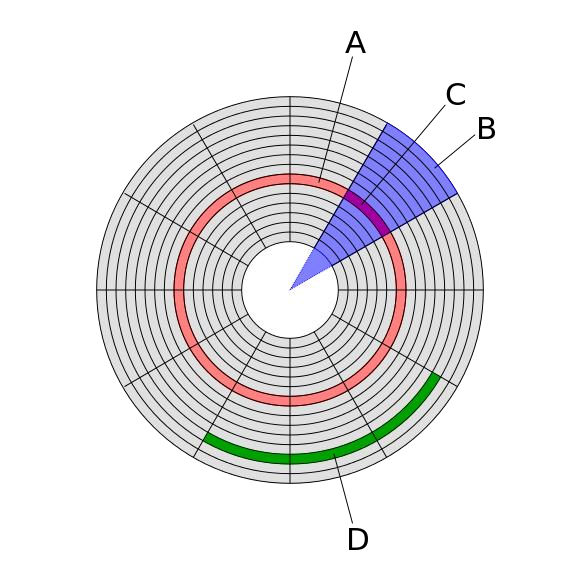

---

## Nonvolatile Memory Devices

SSD uses NVM devices

SSD（固态硬盘）内部使用的是NAND型非易失性存储器（NVM），即断电后数据不会丢失。

Data cannot be overwritten— rather, the NAND cells have to be erased first. An erasure is much slower than a read (the fastest operation) or a write (slower than read)

- **数据不能直接覆盖**：NAND闪存的单元（cell）在写入新数据前，必须先进行“擦除”操作。
- **擦除比读写慢**

Maximum ~100,000 program-erase cycles

每个NAND单元的擦写次数有限，大约为10万次（100,000 program-erase cycles）。

---

## Disk Structure

Disk drives are addressed as large 1-dimensional arrays of logical blocks, where the logical block is the smallest unit of transfer.

磁盘在操作系统中被看作是一个一维的逻辑块数组，每个逻辑块（logical block）是磁盘读写的最小单位。

The 1-dimensional array of logical blocks is mapped into the sectors of the disk sequentially.

这些逻辑块会顺序映射到磁盘的物理扇区上。

- Sector 0 is the first sector of the first track on the outermost cylinder.
- Sector 0（第0号扇区）是最外圈柱面（outermost cylinder）上第一个磁道（track）的第一个扇区。
- Mapping proceeds in order through that track, then the rest of the tracks in that cylinder, and then through the rest of the cylinders from outermost to innermost.
- 映射会先填满该磁道的所有扇区，然后依次填满该柱面上其他磁道的扇区。当前柱面所有磁道分配完后，再进入下一个柱面（从外到内），依次分配所有磁道和扇区。

操作系统和用户可以用简单的线性编号（逻辑块号）来访问磁盘数据，无需关心磁盘的物理结构（柱面、磁道、扇区）。

可以方便地进行批量读取、范围查询（如读取连续的逻辑块），适合数据库、文件系统等需要高效大块数据访问的场景。

---

### Disk Attachment

---

Host-attached storage accessed through I/O ports talking to I/O buses

主机直连存储（Host-attached storage）指的是通过I/O端口和I/O总线直接连接到主机（计算机）的存储设备，比如常见的SATA、SCSI、USB等接口的硬盘、SSD等。

SCSI itself is a bus, up to 16 devices on one cable, **SCSI initiator** requests operation and **SCSI targets** perform tasks

**SCSI（Small Computer System Interface）**本身就是一种总线协议，可以在一根SCSI线缆上连接多达16个设备。

- Each target can have up to 8 **logical units** (disks attached to device controller)

Fibre Channel是一种高速串行存储互连架构，常用于企业级存储。

Fibre Channel (FC) is high-speed serial architecture

- Can be switched fabric with 24-bit address space – the basis of **storage area networks** (SANs) in which many hosts attach to many storage units
- Can be **arbitrated loop** (FC-AL) of 126 devices

---

### Network-Attached Storage

Network-attached storage (NAS) is storage made available over a network rather than over a local connection (such as a bus)

NAS 是通过网络（如以太网）而不是本地总线（如SATA、SCSI）提供给主机访问的存储设备。

NFS and CIFS are common protocols

- NFS（Network File System）：主要用于类Unix系统。
- CIFS（Common Internet File System）/SMB：主要用于Windows系统。

Implemented via remote procedure calls (RPCs) between host and storage

NAS 通过**远程过程调用（RPC）**协议在主机和存储设备之间通信，主机像访问本地文件一样访问远程存储。

New iSCSI protocol uses IP network to carry the SCSI protocol

iSCSI协议可以让SCSI命令通过IP网络传输，实现块级存储的远程访问。

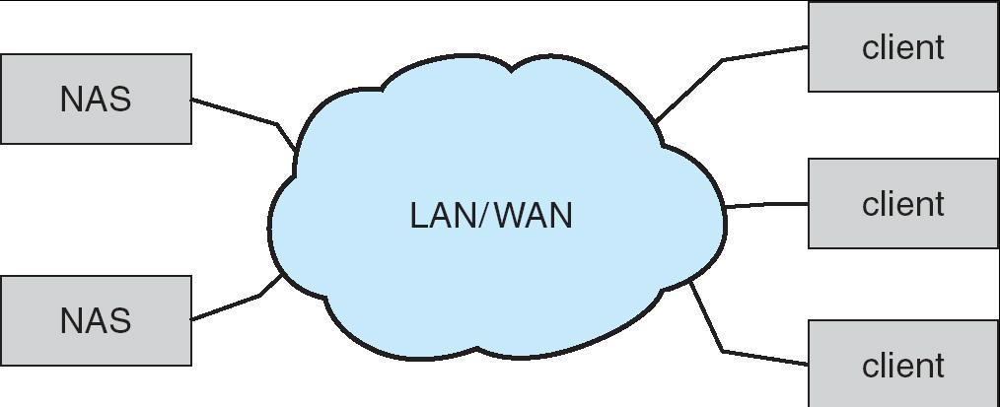

---

### Storage Area Network

Common in large storage environments (and becoming more common)

SAN 是一种专为存储设计的高速网络，常用于大型企业和数据中心。

Multiple hosts attached to multiple storage arrays - flexible

多台主机可以灵活地连接到多个存储阵列，实现资源共享和集中管理。

---

## Accessing a Disk Page

Time to access (read/write) a disk block:

- seek time (moving arms to position disk head on track)
- rotational delay (waiting for block to rotate under head)
- transfer time (actually moving data to/from disk surface)

Seek time and rotational delay dominate.

寻道时间和旋转延迟是访问磁盘的主要瓶颈，远大于数据传输时间。

- Seek time varies from about 1 to 20msec
- Rotational delay varies from 0 to 10msec
- Transfer rate is about 1msec per 4KB page

Key to lower I/O cost: reduce seek/rotation delays! Hardware vs. software solutions?

降低寻道时间和旋转延迟，是提升磁盘I/O性能的关键。

---

### Disk Scheduling

The operating system is responsible for using hardware efficiently — for the disk drives, this means having a fast access time and disk bandwidth.

操作系统负责高效地使用硬件资源。对于磁盘来说，这意味着要尽量缩短访问时间、提高磁盘带宽。

Access time has two major components

- Seek time is the time for the disk are to move the heads to the cylinder containing the desired sector.
- Rotational latency is the additional time waiting for the disk to rotate the desired sector to the disk head.

Minimize seek time

磁盘调度的核心目标是减少磁头移动的距离和次数，从而降低寻道时间。

Metric: Seek time $\approx$ seek distance

通常用“寻道距离”来近似衡量寻道时间（即磁头移动的柱面数）。

Disk bandwidth is the total number of bytes transferred, divided by the total time between the first request for service and the completion of the last transfer.

磁盘带宽 = 总传输字节数 ÷ 从第一个请求到最后一个传输完成的总时间。

Several algorithms exist to schedule the servicing of disk I/O requests.

有多种磁盘调度算法来优化I/O性能。

We illustrate them with a request queue (0-199).

98, 183, 37, 122, 14, 124, 65, 67

Current head pointer 53

---

#### FCFS

Illustration shows total head movement of 640 cylinders.

总共扫过的柱面数为640。

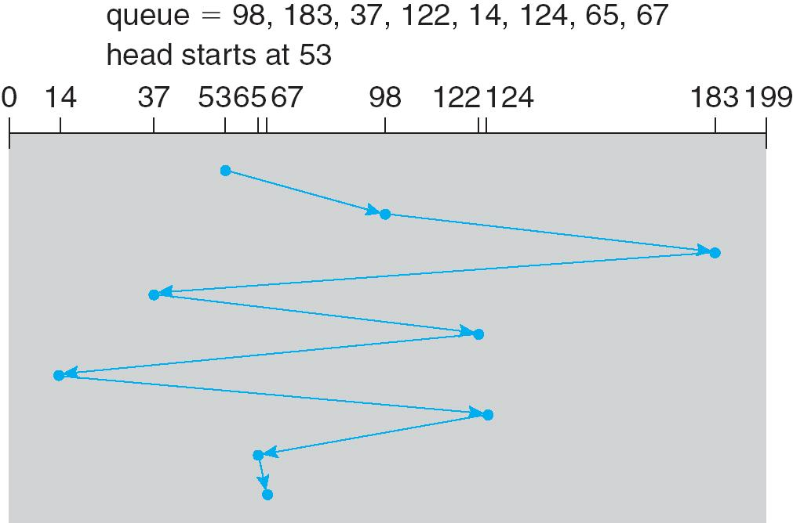

---

#### SSTF(Shortest-seek-time-first)

Selects the request with the minimum seek time from the current head position.

每次选择距离当前磁头位置最近的I/O请求进行服务，优先处理“寻道距离”最短的请求。

SSTF scheduling is a form of SJF scheduling; may cause **starvation** of some requests.

类似于SJF（最短作业优先）调度算法。

优点：平均寻道距离较短，整体效率高于FCFS（先来先服务）。

缺点：可能导致“饥饿”现象——如果有些请求总是离磁头很远，并且一直有新的近的请求进来，它们可能长期得不到服务。

Illustration shows total head movement of 236 cylinders.

本例中，总共磁头移动了236个柱面。

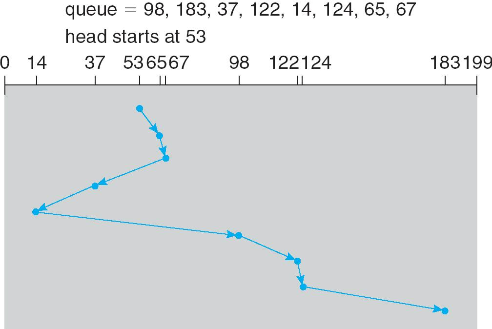

---

#### SCAN

The disk arm starts at one end of the disk, and moves toward the other end, servicing requests until it gets to the other end of the disk, where the head movement is reversed and servicing continues.

磁头从磁盘一端移动到另一端，沿途依次处理所有经过的请求；到达末端后，磁头方向反转，继续处理反方向上的请求。

Sometimes called the **elevator algorithm**.

因为磁头运动像电梯一样来回移动，所以也叫“电梯算法”。

优点：能较好地兼顾请求的公平性和效率，减少极端饥饿现象。

缺点：靠近磁盘两端的请求等待时间可能较长。

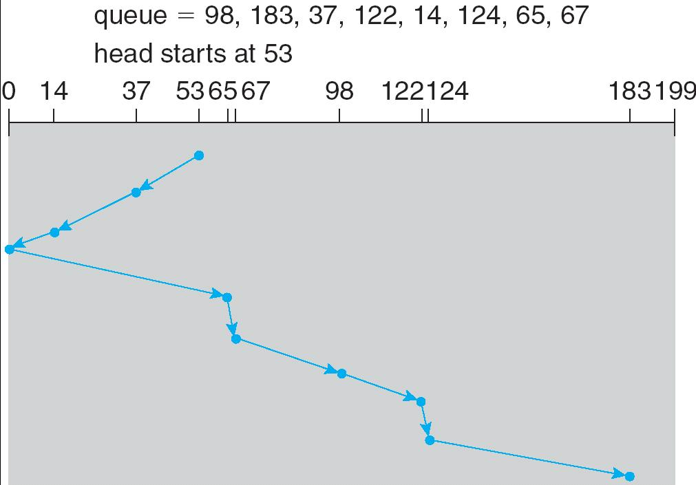

---

#### C-SCAN (Circular SCAN)

Provides a more uniform wait time than SCAN.

The head moves from one end of the disk to the other. servicing requests as it goes. When it reaches the other end, however, it immediately returns to the beginning of the disk, without servicing any requests on the return trip.

磁头只在一个方向上处理请求（如从0到最大柱面），到达末端后，磁头立即回到起点（不处理回程上的请求），再继续同方向扫描。

优点：为所有请求提供了更均匀的等待时间，避免了SCAN算法中两端请求等待时间过长的问题。

Treats the cylinders as a circular list that wraps around from the last cylinder to the first one.

实现方式：把所有柱面看作一个环，磁头到达末端后“跳回”起点。

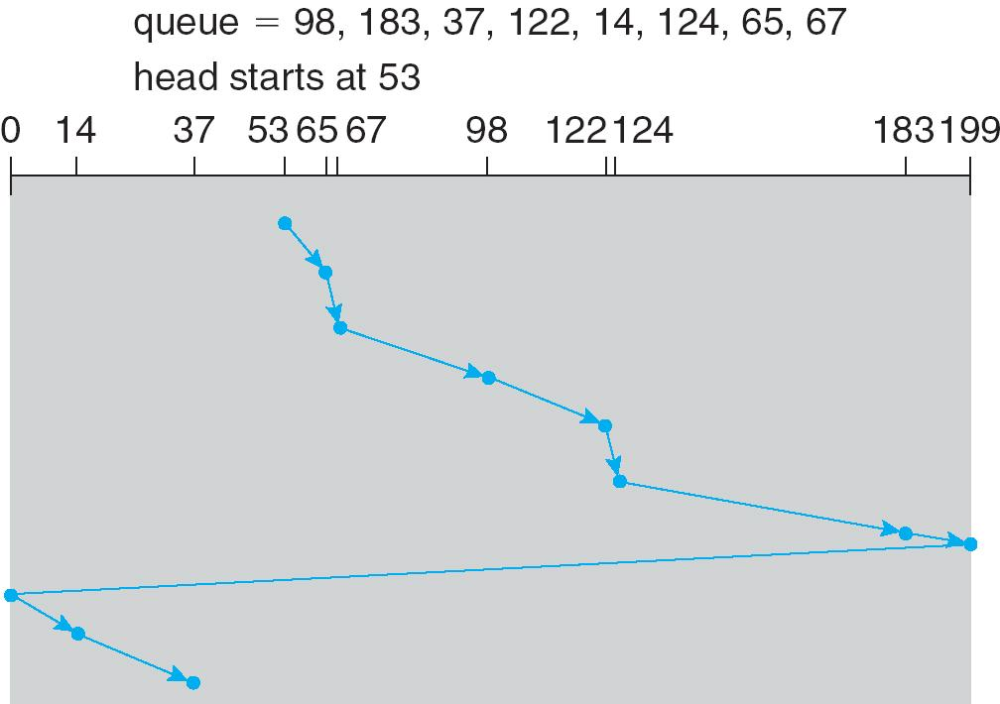

---

#### C-LOOK

Version of C-SCAN

Arm only goes as far as the last request in each direction, then reverses direction immediately, without first going all the way to the end of the disk.

磁头只移动到当前方向上最远的请求处，而不是像 C-SCAN 那样每次都移动到磁盘的最末端。

当磁头到达该方向上最后一个请求后，立即反向，而不是继续移动到磁盘的尽头再返回。

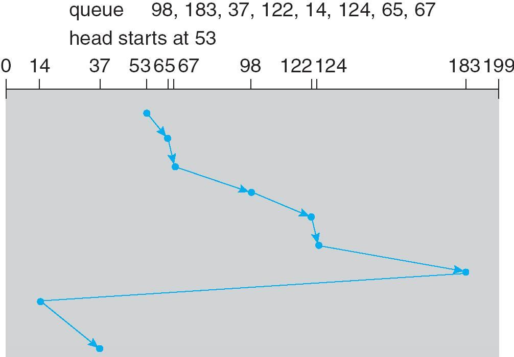

---

### Selecting a Disk-Scheduling Algorithm

SSTF is common and has a natural appeal

SSTF 很常用，直观，适合一般负载的系统。它每次选择距离当前磁头最近的请求，平均寻道距离较短。

SCAN and C-SCAN perform better for systems that place a heavy load on the disk.

在磁盘负载很重、I/O请求很多的系统中表现更好。它们能更公平地服务所有请求，减少极端等待时间。

Performance depends on the number and types of requests.

性能依赖于请求数量和类型：不同的调度算法在不同的I/O请求分布下表现不同。例如，顺序访问和随机访问对算法的敏感度不同。

Requests for disk service can be influenced by the file-allocation method.

文件分配方式也会影响磁盘调度：比如，连续分配、链式分配、索引分配等文件系统策略会影响I/O请求的分布，从而影响调度算法的效果。

The disk-scheduling algorithm should be written as a **separate module** of the operating system, allowing it to be replaced with a different algorithm if necessary.

磁盘调度算法应作为操作系统的**独立模块**实现，这样可以根据实际需求灵活替换不同的调度算法，便于维护和优化。

Either SSTF or LOOK is a reasonable choice for the default algorithm.

SSTF 或 LOOK（LOOK 是 SCAN 的一种变体）都是合理的默认选择，兼顾效率和公平性。

???+ example
    What scheduling algorithm is good for SSD?

??? note "answer"
    没有seek time 和 rotation time 。所以 FCFS 调度方法最好。

---

#### Swapping re-examined : Why Swap-out to Contiguous Disk Blocks?

Remember that we swap out process memory pages onto hard disk while swap in those demanded by paging.

在虚拟内存系统中，当物理内存不足时，操作系统会把暂时不用的进程内存页（page）写到硬盘的交换空间（swap space）上，这个过程叫“换出”。当这些页再次被需要时，再从磁盘“换入”到内存。

为什么要写到连续的磁盘块？

连续磁盘块意味着这些数据在磁盘上是物理上相邻的。这样读写时，磁头只需一次寻道和较少的旋转延迟，就能顺序读写大量数据，极大提升了磁盘I/O速度。如果分散在磁盘各处，磁头需要频繁移动，寻道和旋转延迟大大增加，I/O效率会显著下降。

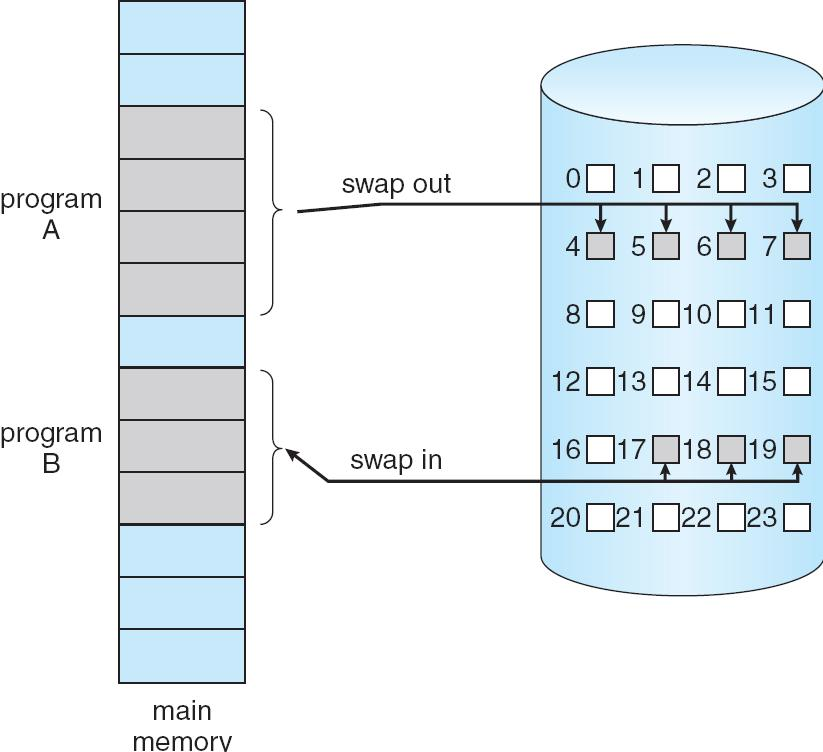

---

## Disk Management

Low-level formatting, or physical formatting — Dividing a disk into sectors that the disk controller can read and write.

低级格式化（Low-level formatting）/物理格式化指的是将磁盘划分为磁盘控制器可以读写的扇区（sector）。每个扇区都有标识信息和校验信息，保证数据能被正确读写。

To use a disk to hold files, the operating system still needs to record its own data structures on the disk.

操作系统要使用磁盘存储文件，除了物理格式化，还需要在磁盘上记录自己的数据结构（如文件系统元数据）。

- Partition the disk into one or more groups of cylinders. 将磁盘分成一个或多个柱面组，每个分区可以单独作为一个文件系统。
- Logical formatting or “making a file system”. 逻辑格式化就是在分区上建立文件系统结构，如FAT、NTFS、ext4等。

Boot block initializes system.

引导块用于系统启动，通常存放在磁盘的特定位置。

- The bootstrap is stored in ROM.
- Bootstrap loader program. 负责加载操作系统

Methods such as sector sparing used to handle bad blocks.

磁盘可能出现坏块，操作系统会采用如“扇区替换”等方法处理，保证数据安全。

**Booting from a Disk in Windows**

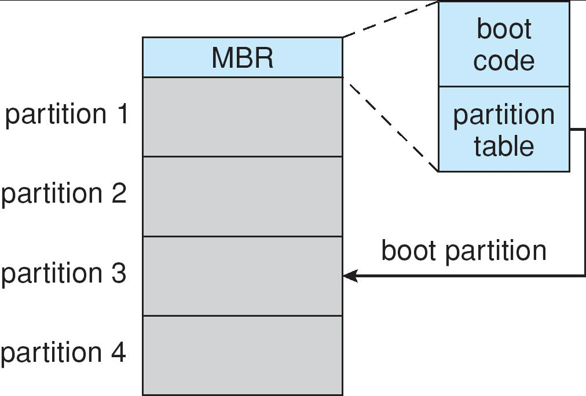

---

### RAlD Structure

Redundant Arrays of Independent Disks

独立磁盘冗余阵列

**RAID** – multiple disk drives provides **reliability** via **redundancy**.

RAID是一种将多个磁盘组合起来协同工作的技术，核心目的是通过冗余（多余的数据副本）来提升存储系统的可靠性和性能。

RAID is arranged into six different levels.

Several improvements in disk-use techniques involve the use of multiple disks working cooperatively.

Disk **striping** (条带化) uses a group of disks as one storage unit.

把数据分散存储到多块磁盘上，可以并行读写，提高性能。

- Bit-level Striping
- Block-level Striping – different blocks of a file are striped 把文件的不同块分布到不同磁盘。

RAID schemes improve performance and improve the reliability of the storage system by storing redundant data.

- Mirroring or shadowing keeps duplicate of each disk. 每块磁盘都保留一个副本，数据安全性高，但磁盘利用率低。
- Block interleaved parity uses much less redundancy. 通过冗余校验信息来恢复数据，既能提升可靠性，又能节省空间。

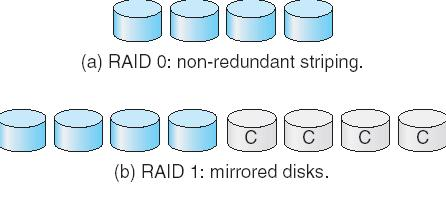

RAID 1: Provides **fault tolerance** from disk errors and failure of all but one of the drives. Increased read performance occurs when using a multi-threaded operating system that supports split seeks, very small performance reduction when writing. Array continues to operate so long as at least **one drive** is functioning.

RAID 1：镜像。所有数据都被完整复制到另一块磁盘。即使一块磁盘坏了，数据也不会丢失。多线程操作系统下读性能提升，写性能略降，只要有一块磁盘可用，阵列就能工作。

RAID 2: memory-style Hamming code parity. Not really practical.

RAID 2：使用汉明码（Hamming code）做内存式校验，实际应用很少。

RAID 3: The single parity disk is a bottleneck for writing since every write requires updating the parity data.

RAID 3：所有数据条带化存储，单独一块磁盘存放奇偶校验。写入时每次都要更新校验盘，写性能受限。

RAID 4: Identical with RAID 3 except using block level parity. The parity disk can become a **bottleneck**. Large (parallel) reads and writes are good. Small write causes 4 page accesses. (read data/parity and write them back.)

RAID 4：和RAID 3类似，但以块为单位做条带化。奇偶校验盘仍可能成为瓶颈。大规模并行读写性能好，但小写入操作需要多次读写。

RAID 5: Distributed parity requires all drives but one to be present to operate; drive failure requires replacement, but the array is not destroyed by a single drive failure.

RAID 5：分布式奇偶校验。奇偶校验信息分散在所有磁盘上，任意一块磁盘损坏都不会导致数据丢失，需更换损坏磁盘后重建数据。

RAID 6: extra redundancy information to guard **two** disk failures.

RAID 6：比RAID 5多一份冗余信息，可以容忍两块磁盘同时损坏，安全性更高。

RAID (0 + 1)and (1 + 0)

- RAID 0+1（先条带后镜像）

先将所有磁盘分成两组，每组内部做RAID 0（条带化，提升性能），然后再对这两组做RAID 1（镜像，提升可靠性）。

只要一组中的任意一块磁盘损坏，整个那组就失效，但另一组还能继续工作。

容错性较低：如果两组中各有一块磁盘损坏，整个阵列就会崩溃。

- RAID 1+0（先镜像后条带）

先将所有磁盘两两做RAID 1（镜像），再把这些镜像对做RAID 0（条带化）。

只要每对镜像中有一块磁盘可用，阵列就能正常工作。即使每对镜像各坏一块，只要不是同一对全坏，数据都不会丢失。

容错性更高，恢复速度快，实际应用中更常用。

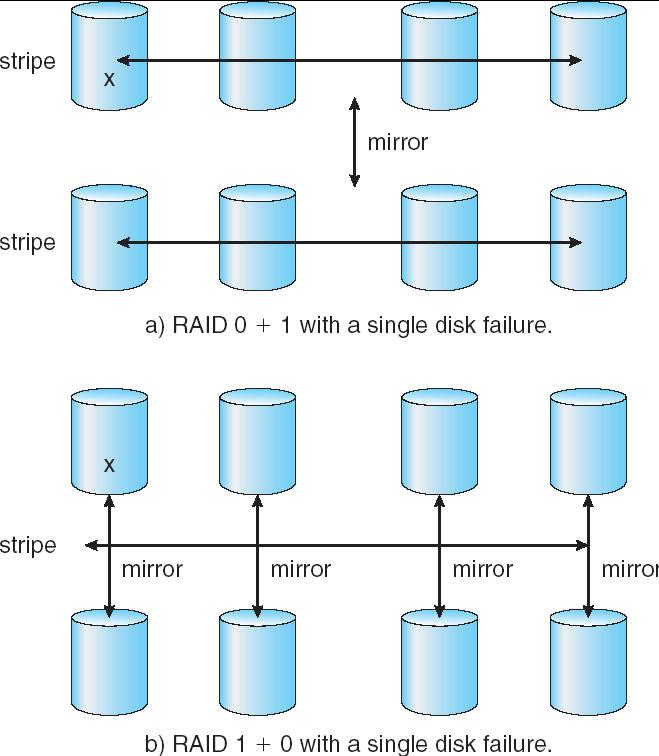

---

???+ example "question"
    假设磁盘有256个柱面，4个磁头(盘面),每个磁道有8个扇区(编号均从0开始)。文件A在磁盘上连续存放。若文件A中的一个块存放在5号柱面、1号磁头下的7号扇区，则文件A的下一块应存放在()。
    
    A.5号柱面、2号磁头下的7号扇区
    
    B.5号柱面、2号磁头下的0号扇区
    
    C.6号柱面、1号磁头下的7号扇区
    
    D.6号柱面、1号磁头下的0号扇区

??? note "answer"
    B

    文件 A采用连续存放方式，按照磁盘的地址结构(柱面号，磁头号，扇区号)，文件A的下一块应存放在同一个柱面的同一个磁道的下一个扇区中，7 号扇区已是本磁道的最后一个扇区,因此应存放在同一个柱面的下一个磁头的0号扇面，即5号柱面、2号磁头下的0号扇区。由此可见，文件A的数据是连续存储在磁盘的一组或相邻几组同心圆中的。

???+ example "question"
    假设磁盘有100个柱面，每个柱面上有8个磁道，每个磁道有8个扇区。文件A含有6400个逻辑记录，逻辑记录大小与扇区大小一致，该文件以顺序结构的形式存放在磁盘上。文件的第0个逻辑记录存放在磁盘地址(0号柱面、0号盘面、0号扇区)中，则磁盘地址(78号柱面、6号盘面、6号扇区)中存放了该文件的第()个逻辑记录。
    
    A.5045    B.5046    C.5047    D.5048

??? note "answer"
    每个柱面上有8个磁道(表示有8个磁头),每个磁道有8个扇区，因此每个柱面有 8x8=64个扇区。由题意可知，柱面号、盘面号、扇区号和逻辑记录编号都是从 0开始的，因此 78号柱面的6号磁道的6号扇区存放的是文件的第 78x64+6x8+6=5046 个逻辑记录。

???+ example "question"
    已知某磁盘的平均转速为r秒/转，平均寻道时间为T秒，每个磁道可以存储的字节数为N，现向该磁盘读/写b字节的数据，采用随机寻道的方法，每道的所有扇区组成一个簇，其平均访问时间是（）
    
    A. (r + T)b/N    B. b/N T    C.(b/N + T)r    D.bT/N+r

??? note "answer"
    A

    将每道的所有扇区组成一个簇，意味着可以将一个磁道的所有存储空间组织成一块数据组,这样有利于提高存储速度。读/写磁盘时，磁头首先找到磁道，称为寻道，然后才可以将信息从磁道里读出或写入。读/写完一个磁道后，磁头会继续寻找下一个磁道，完成剩余的工作，所以在随机寻道的情况下，读/写一个磁道的时间要包括寻道时间和读/写磁道时间，即 T+r 秒。因为总的数据量是 b 字节，它要占用的磁道数为 b/N 个，所以总平均读/写时间为(r + T) b/N 秒。

???+ example "question"
    下列关于固态硬盘的说法中，正确的是（）。
    
    A.固态硬盘的写速度比较慢，性能甚至弱于常规硬盘
    
    B.相比常规硬盘，固态硬盘优势主要体现在连续存取的速度
    
    C.静态磨损均衡算法通常比动态磨损均衡算法的表现更优秀
    
    D.写入时，静态磨损均衡算法每次选择使用长期存放数据而很少擦写的存储块

??? note "answer"
    C

    SSD 的写速度慢于读速度，但不至于比常规机械硬盘差，选项 A错误。SSD 基于闪存技术,没有机械部件，随机存取速度很快，传统机械硬盘因为需要寻道和找扇区的时间，所以随机存取速度慢;传统机械硬盘转速很快，连续存取比随机存取快得多，因此 SSD的优势主要体现在随机存取的速度上，选项B错误。静态磨损算法在没有写入数据时，SSD监测并自动进行数据分配因此通常表现更优秀，选项C正确。因为闪存的擦除速度较慢，若每次都选择写入存放有数据的块，会极大地降低写入速度,选项D混淆了静态磨损均衡,静态损均衡是指在没有写入数据时，SSD 监测并自动进行数据分配，从而使得各块的擦写更加均衡，并不是说写入时每次都选择存放老数据的块。

???+ example "question"
    下列选项中，磁盘逻辑格式化程序所做的工作是（）。
    
    I.对磁盘进行分区    II.建立文件系统的根目录    III.确定磁盘扇区校验码所占位数    IV.对保存空闲磁盘块信息的数据结构进行初始化
    
    A.仅Ⅱ    B.仅Ⅱ、IV    C.仅III、IV    D.仅I、II、IV

??? note "answer"
    B

    新磁盘是空白盘，必须分成扇区以便磁盘控制器能进行读/写操作，这个过程称为低级格式化(或物理格式化)。低级格式化为每个扇区使用特别的数据结构，选项  错误。为了使用磁盘存储文件，操作系统还需要将自己的数据结构记录在磁盘上。这分为两步。第一步是将磁盘分为由一个或多个柱面组成的分区，每个分区可以作为一个独立的磁盘，选项1错误。在分区之后，第二步是逻辑格式化(创建文件系统)。在这一步，操作系统将初始的文件系统数据结构存储到磁盘上。这些数据结构包括空闲和已分配的空间及一个初始为空的目录，选项Ⅱ、IV 正确。

---