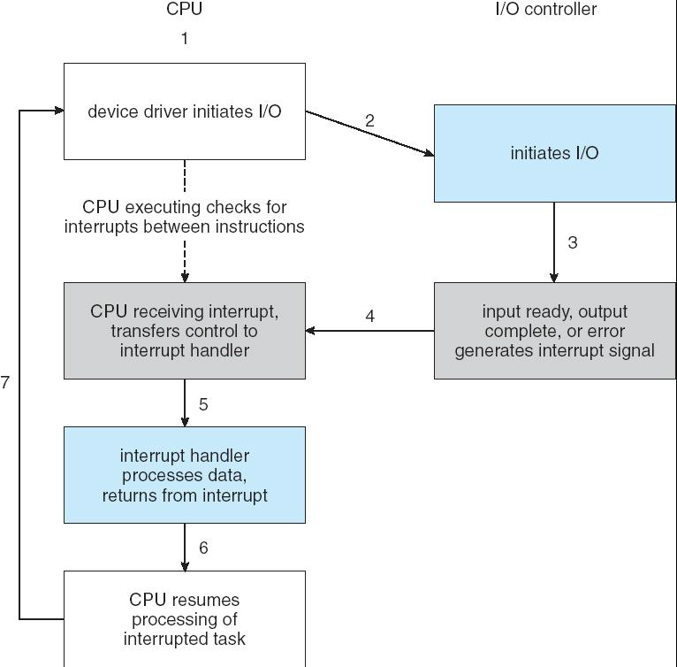
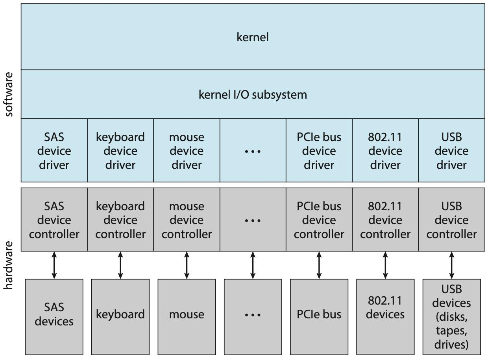
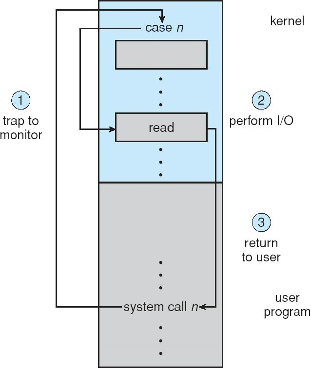
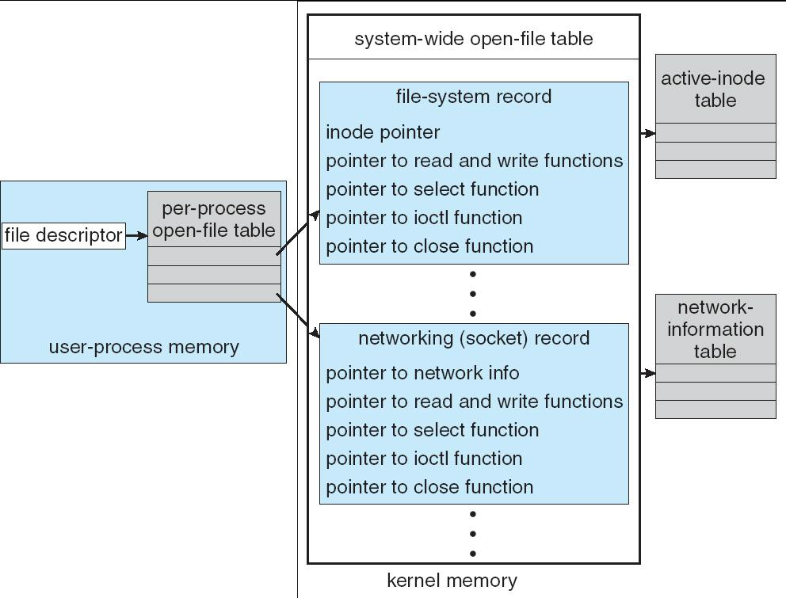
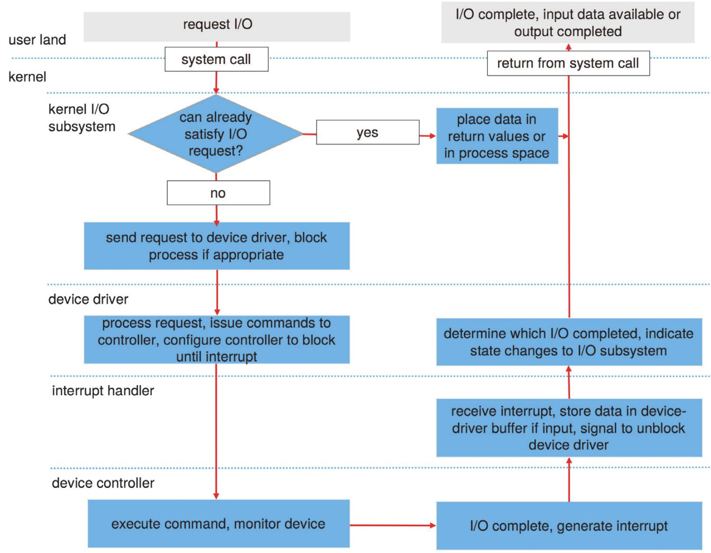

# Chapter 13 | I/O Systems

## I/O Hardware

Incredible variety of I/O devices

- More than 200 harddisk manufacturers

Common concepts

- **Port**
- 端口是CPU与I/O设备通信的接口，每个设备有自己的端口地址。
- **Bus** (**daisy chain** or shared direct access)
- 总线是连接多个设备和主机的通信通道。可以是菊花链（daisy chain，设备串联）或共享直连（所有设备共享同一总线）。
- **Controller** (**host adapter**)
- 控制器是管理和控制I/O设备的硬件模块，主机适配器是连接主机和设备的桥梁。

I/O instructions control devices

Devices have (port) addresses, used by

- Special I/O instructions

通过专门的CPU指令（如x86的IN/OUT）访问I/O端口。

- **Memory-mapped** I/O

把I/O设备的寄存器映射到主存的某些地址区间，主机像访问内存一样访问I/O设备。

**A Typical PC Bus Structure**

- PCIe bus（PCI Express总线）：现代PC的主要高速通信通道，连接CPU、内存、显卡、磁盘控制器等核心部件。所有高速设备都通过PCIe总线与主机通信。
- expansion bus（扩展总线）：如USB、PCI等，连接键盘、鼠标、USB设备等。
- expansion bus interface（扩展总线接口）：用于连接低速或外部设备。

**Device I/O Port Addresses on PCs (partial)**

---

## I/O Port Registers

**Data-in**: read by the host to get input

主机（CPU）从这里读取输入数据。

**Data-out**: written by the host to send output

主机（CPU）向这里写入数据，发送给I/O设备。

**Status**: device status read by the host

主机读取这个寄存器，了解设备当前的状态。

**Control**: written by the host to start a command or change the mode of a device

主机向这个寄存器写入命令或参数，用于启动设备操作或改变设备工作模式。

---

## Polling

轮询（Polling）是一种主机（CPU）主动不断检查I/O设备状态、并与其进行数据交换的方式。其特点是CPU需要不断“盯着”设备，直到设备准备好，才能进行下一步操作。

1. The host repeatedly reads the busy bit until that bit becomes clear.
2. The host sets the write bit in the command register and writes a byte intothe data-out register.
3. The host sets the command-ready bit.
4. When the controller notices that the command-ready bit is set,it sets thebusy bit.
5. The controller reads the command register and sees the write command.It reads the data-out register to get the byte and does the I/O to thedevice.
6. The controller clears the command-ready bit,clears the error bit in thestatus register to indicate that the device I/O succeeded,and clears thebusy bit to indicate that it is finished.

1. 主机反复读取busy位，直到该位变为0（空闲）
2. 主机设置命令寄存器的write位，并将要写入的数据写到data-out寄存器
3. 主机设置command-ready位，通知设备有新命令
4. 控制器检测到command-ready位被设置，设置busy位，表示正在处理命令
5. 控制器读取命令寄存器，发现是写命令，从data-out寄存器读取数据，并将数据写入设备
6. 控制器清除command-ready位，清除status寄存器中的error位（表示I/O成功），并清除busy位，表示完成操作

The above repeated for each byte.

上述过程对**每个字节**都要重复一次。

Determines state of device

- command-ready 命令是否准备好
- busy 设备是否正忙
- error 是否发生错误

**Busy-wait** cycle in Step 1 to wait for I/O from device.

Repeatedly reading the status register until the busy bit becomes clear.

是指CPU在等待I/O设备准备好时，不断地、反复地读取设备的状态寄存器，检查busy位（忙位）是否为0（表示设备空闲）。

**Can be inefficient**

**效率低**：CPU需要不断读取状态寄存器，浪费大量时间在“忙等”上，不能做其他有用的工作。

---

## Interrupts

CPU **Interrupt-request line** triggered by I/O device

中断请求线：I/O设备通过这根线向CPU发出中断信号，通知CPU“我有事情需要你处理”。

**Interrupt handler** receives interrupts

中断处理程序：当CPU收到中断信号后，会转去执行专门的中断处理程序，完成相应的I/O操作或响应。

**Maskable** to ignore or delay some interrupts

可屏蔽中断：可以被CPU暂时忽略或延迟处理的中断（如普通I/O中断）。

Interrupt vector to dispatch interrupt to correct handler

中断向量：CPU通过中断向量表，根据中断类型或优先级，跳转到正确的中断处理程序。

- Based on priority 取决于优先级
- Some **nonmaskable** 有些中断不可屏蔽
- Interrupt chaining: To handle more devices than interrupt vector elements. Handlers on each list are called one by one.

中断链：当设备数量多于中断向量表项时，可以把多个设备的中断处理程序串成链表，依次调用。

Interrupt mechanism also used for exceptions

除了I/O设备，异常（Exception）（如除零错误、缺页异常等）也通过中断机制处理。

**Interrupt-Driven I/O cycle**

1. 设备驱动发起I/O请求
2. I/O控制器开始I/O操作
3. I/O完成或出错，产生中断信号
4. CPU收到中断，转去执行中断处理程序
5. 中断处理程序处理数据并返回
6. CPU恢复原任务
7. 循环进行（回到步骤1）

**Intel Pentium Processor Event-Vector Table**

---

### Various Interrupt Processing

Page fault: saves the state of the process, moves it to the waiting queue, schedules another process to resume execution, then returns.

当进程访问的内存页不在物理内存中时，会触发缺页异常。操作系统会：

1. 保存当前进程状态
2. 将进程移到等待队列
3. 调度另一个进程执行
4. 等待缺页处理完成后，恢复原进程执行

Trap (s/w interrupt): saves the state of user code, switches to supervisor mode. Low priority

由程序主动触发（如系统调用、断点等），属于低优先级中断。处理过程包括：

1. 保存用户代码状态
2. 切换到内核模式（supervisor mode），执行相应的系统服务

Low priority interrupt can be preempted by high priority ones.

低优先级中断可以被高优先级中断抢占（即处理中断时，如果有更重要的中断到来，可以先处理高优先级的）。

Example usage: high-priority handler

- records the I/O status,
- 记录I/O状态（如操作是否成功、数据是否准备好）；
- clears the device interrupt,
- 清除设备中断信号，防止重复中断；
- starts the next pending I/O, and
- 启动下一个待处理的I/O操作；
- raises a low-priority interrupt to complete the work
- 触发一个低优先级中断，完成剩余工作

Later, the low-priority handler

- completes the user-level I/O by copying data from kernel buffers to the application space and
- 将数据从内核缓冲区复制到应用程序空间，完成用户级I/O操作；
- calling the scheduler to place the application on the ready queue
- 调用调度器，将应用程序放入就绪队列，等待CPU调度执行。

---

## Direct Memory Access (DMA)

Used to avoid **programmed I/O** (可编程I/O) for large data movement

DMA（直接内存访问）是一种用于大批量数据传输的I/O技术。它的核心思想是：让I/O设备可以绕过CPU，直接与内存交换数据，从而大大提高数据传输效率，减少CPU负担。

在传统的**可编程I/O（Programmed I/O）**方式下，CPU需要参与每一次数据的读写操作（比如每传输一个字节都要CPU介入），效率很低，CPU资源被大量占用。对于大数据量的I/O操作（如磁盘读写、网络数据收发），这种方式会严重拖慢系统性能。

Requires **DMA** controller

DMA控制器是一种专门的硬件模块，负责管理I/O设备和内存之间的数据传输。

Bypasses CPU to transfer data directly between I/O device and memory

当需要进行大批量数据传输时，CPU只需告诉DMA控制器“从哪里到哪里传多少数据”，然后DMA控制器就能自动完成数据搬运。

**Six Step Process to Perform DMA Transfer**

1. 设备驱动被告知要把磁盘数据传到内存缓冲区X
2. 设备驱动通知磁盘控制器，从磁盘传输C字节到缓冲区X
3. 磁盘控制器发起DMA传输
4. 磁盘控制器将每个字节发送给DMA控制器
5. DMA控制器把数据搬运到缓冲区X，并更新地址和计数
6. 当C=0时，DMA控制器向CPU发出中断，通知传输完成

---

## Application I/O Interface

I/O system calls encapsulate device behaviors in generic classes

操作系统通过I/O系统调用（如read、write、open、close等）为应用程序提供统一的设备访问接口。

这些系统调用把各种设备的具体行为“封装”成通用的类（generic classes），让应用程序不用关心底层设备的差异。

Device-driver layer hides differences among I/O controllers from kernel

设备驱动层负责屏蔽不同I/O控制器的具体实现细节，对内核提供统一的接口。

Devices vary in many dimensions

- **Character-stream** or **block** 字符流设备 / 块设备
- **Sequential or random-access** 顺序访问 / 随机访问
- **Sharable or dedicated** 可共享 / 专用
- **Speed of operation**    运行速度快慢
- **read-write**, **read only**, or **write only** 读写 / 只读 / 只写

**A Kernel I/O Structure**

**Characteristics of I/O Devices**

---

### Block and Character Devices

Block devices include disk drives

块设备是以“块”为单位进行数据传输的设备，每个块通常大小为512字节、4KB等。

- Commands include read, write, seek
- Raw I/O or file-system access
- Memory-mapped file access possible

- 块设备的常见命令包括读（read）、写（write）、寻址（seek）等。
- 可以进行原始I/O操作，也可以通过文件系统访问。
- 还可以通过内存映射文件（memory-mapped file）方式访问数据。

Character devices include keyboards, mice, serial ports

字符设备是以“字符”为单位进行数据传输的设备，如键盘、鼠标、串口等。

- Commands include get, put
- Libraries layered on top allow line editing

- 常见命令包括获取字符（get）、发送字符（put）等。
- 还可以通过分层的库支持行编辑功能。

---

### Network Devices

Varying enough from block and character to have own interface

网络设备（如网卡、无线网卡等）与块设备（如硬盘）和字符设备（如键盘、鼠标）有很大不同，因此操作系统通常为网络设备设计**独立**的接口。

Unix and Windows NT/9x/2000 include socket interface

Unix、Windows NT/9x/2000等操作系统都提供了**套接字**（socket）接口，用于应用程序与网络设备通信。

- Separates network protocol from network operation
- Includes select functionality for servers

- 分离网络协议与网络操作：应用程序通过统一的socket接口进行网络通信，无需关心底层使用的是TCP、UDP还是其他协议。
- select功能：允许服务器程序同时监听多个socket，等待多个网络事件（如多个客户端连接），提高并发能力。

Approaches vary widely (pipes, FIFOs, streams, queues, mailboxes)

不同操作系统和编程环境对网络通信的实现方式各不相同，常见的有管道（pipes）、先进先出队列（FIFOs）、流（streams）、消息队列（queues）、邮箱（mailboxes）等。

---

### Clocks and Timers

Provide current time, elapsed time, timer

- 提供当前时间：操作系统可以通过时钟设备获取当前的系统时间（如年月日时分秒）。
- 提供经过时间：操作系统可以测量某个事件或操作所经过的时间。
- 提供定时器：操作系统可以设置定时器，在指定时间后触发中断或执行某个操作。

**Programmable interval timer** used for timings, to generate periodic interrupts

这是一种可以编程设置的硬件定时器。主要用途包括：产生周期性中断（如每隔一段时间触发一次），用于时间片轮转调度、系统时钟更新等。精准的时间测量和定时功能对于操作系统的正常运行至关重要。

ioctl (on UNIX) covers odd aspects of I/O such as clocks and timers

在UNIX系统中，ioctl（input/output control）是一个通用的I/O控制接口。

它可以用来操作一些“特殊”或“不常见”的I/O功能，比如时钟和定时器的设置与读取。

---

### Blocking and Nonblocking I/O

**Blocking** - process suspended until I/O completed

当进程发起I/O操作时，如果I/O没有完成，进程会被挂起（暂停执行），直到I/O操作完成后才恢复运行。

- Easy to use and understand
- Insufficient for some needs

- 编程简单，逻辑清晰，易于理解和使用。
- 如果I/O操作很慢，进程会长时间等待，导致CPU资源浪费，系统并发能力差。

**Nonblocking** - I/O call returns as much as available

进程发起I/O操作时，如果数据还没准备好，I/O调用会立即返回，进程不会被挂起。调用会返回已经可用的数据量（如已读/写的字节数）。

- User interface, data copy (buffered I/O)
- Implemented via multi-threading
- Returns quickly with count of bytes read or written

- 进程可以继续执行其他任务，不会因为I/O等待而被阻塞，提高了系统的响应能力和并发性。
- 通常通过多线程实现，一个线程负责I/O操作，另一个线程继续执行其他任务。
- I/O调用会快速返回，并告知实际读写的字节数，方便进程根据情况进行处理。

**Asynchronous** - process runs while I/O executes

进程发起I/O操作后，I/O操作在后台异步执行，进程可以继续做其他事情。

- Difficult to use
- I/O subsystem signals process when I/O completed

- 编程复杂，需要处理并发和同步问题。
- I/O子系统会在I/O操作完成后，通过信号或回调函数通知进程，进程再去处理结果。

Two I/O Methods

---

## Kernel I/O Subsystem

**Scheduling**

- Some I/O request ordering via per-device queue
- Some OSs try fairness

- 操作系统会为每个设备维护一个I/O请求队列，对I/O请求进行排序和调度。
- 有些操作系统会尝试实现公平调度，确保每个进程或设备都能获得合理的I/O资源。

**Buffering** - store data in memory while transferring between devices

缓冲是指在设备之间传输数据时，先把数据暂存在内存中。

- To cope with device **speed** mismatch, e.g. receiving data from modem to disk.

**速度不匹配**：比如从调制解调器接收数据到磁盘，调制解调器速度慢，磁盘速度快，缓冲区可以平衡两者速度差异。

    - Double buffering

- To cope with device transfer **size** mismatch, e.g. network packet

**传输大小不匹配**：比如网络包大小和磁盘块大小不同，缓冲区可以做中转。

- To maintain “copy semantics” (when a write() system call specifies a buffer for storing the data, and modifies its contents after the system call)

保持“拷贝语义”：比如 `write()` 系统调用后，用户修改了原缓冲区内容，内核缓冲区能保证数据一致性。

??? info "meaning"
    当你在程序里调用 `write()` 系统调用，把一块内存缓冲区（buffer）里的数据写到文件或设备时，操作系统需要保证写入的数据是你调用 `write()` 那一刻缓冲区里的内容。

**Caching** - fast memory holding copy of data

缓存是指用一块更快的内存保存数据的副本。

- Always just a copy
- Key to performance

- 只保存数据的副本，原数据仍在原处。
- 提高性能的关键，减少对慢速设备的访问次数。

**Spooling** - hold output for a device

假脱机是指为设备（如打印机）提前把输出内容存放在磁盘等中间介质上，等设备空闲时再逐个处理。

- If device can serve only one request at a time

- 适用于一次只能处理一个请求的设备，比如打印机。

**Device reservation** - provides exclusive access to a device

设备预留是指为某个进程提供对设备的独占访问权。

- System calls for allocation and deallocation
- Watch out for deadlock

- 通过系统调用分配和释放设备，防止多个进程同时操作同一设备。
- 注意避免死锁情况，比如两个进程互相等待对方释放设备。

---

### Error Handling

OS can recover from disk read, device unavailable, transient write failures

操作系统可以恢复某些I/O错误。

Most return an error number or code when I/O request fails

大多数情况下，I/O请求失败时会返回错误号或错误码。

System error logs hold problem reports

系统错误日志记录问题报告。

---

## I/O Protection

User process may accidentally or purposefully attempt to disrupt normal operation via illegal I/O instructions

防止用户进程（无论是无意还是恶意）通过非法的I/O操作指令，干扰系统的正常运行，保护系统安全和设备稳定。

- All I/O instructions defined to be privileged – cannot be issued directly

所有I/O指令都被定义为特权指令

- I/O must be performed via system calls

I/O操作必须通过系统调用完成

Memory-mapped and I/O port memory locations must be protected too

内存映射和I/O端口地址也要保护

- 有些I/O设备的寄存器通过内存映射（memory-mapped I/O）或I/O端口（port-mapped I/O）方式暴露给CPU。
- 操作系统会保护这些内存区域，防止用户进程随意访问或修改，避免破坏设备状态或泄露数据。

**Use of a System Call to Perform I/O**

---

## Kernel Data Structures

Kernel keeps state info for I/O components, including open file tables, network connections, character device state

操作系统内核需要维护大量与I/O相关的数据结构，用于管理和跟踪系统中各种I/O资源和状态。这些数据结构是实现高效、可靠I/O管理的基础。

Many, many complex data structures to track buffers, memory allocation, “dirty” blocks

Some use object-oriented methods and message passing to implement I/O. e.g. Unix provides file-system access to a variety of entities such as user files, raw disk, network socket etc.

由于I/O系统涉及的设备和资源种类繁多，内核需要维护大量复杂的数据结构来跟踪各种状态和资源分配。

有些操作系统（如Unix）采用面向对象的方法和消息传递机制来实现I/O管理，使得对不同类型的I/O对象（如普通文件、原始磁盘、网络套接字等）都能以统一方式访问和操作。

**UNIX I/O Kernel Structure**

---

## Transforming I/O Requests to Hardware Operations

Consider reading a file from disk for a process:

- Determine device holding file

操作系统首先要确定你要读取的文件存放在哪个物理设备上。

MS-DOS uses the ‘c:’ disk id; Unix uses the mount table

比如在MS-DOS系统中，通过盘符（如C:、D:）来区分不同磁盘；在Unix系统中，通过挂载表（mount table）来查找文件属于哪个设备。

- Translate name to device representation
- Physically read data from disk into buffer
- Make data available to requesting process
- Return control to process

- 把文件名转换为设备表示（如设备号、文件偏移等）
- 从磁盘上物理读取数据到内存缓冲区
- 把数据提供给请求的进程
- 把控制权返回给进程

**Life cycle of An I/O Request**

1. 用户空间：发起I/O请求

用户程序通过系统调用（如read、write）向操作系统请求I/O操作。

2. 内核I/O子系统：判断是否能立即满足请求

内核I/O子系统收到请求后，首先判断能否直接满足（比如数据已经在缓存中）。

- 如果可以：直接把数据放到返回值或进程空间，系统调用返回，I/O完成。
- 如果不可以：进入下一步。

3. 发送请求给设备驱动，必要时阻塞进程

内核将I/O请求发送给对应的设备驱动，如果需要等待I/O完成，则会阻塞当前进程。

4. 设备驱动：处理请求并配置控制器

设备驱动处理I/O请求，向设备控制器发出具体命令，并配置控制器在I/O完成前阻塞。

5. 设备控制器：执行命令并监控设备

设备控制器根据命令实际操作硬件（如读写磁盘），并监控I/O进度。

6. I/O完成，设备控制器产生中断

当I/O操作完成后，设备控制器会产生中断，通知CPU和操作系统。

7. 中断处理程序：处理中断

中断处理程序收到中断信号后，读取数据（如输入时），将数据存入设备驱动的缓冲区，并通知设备驱动I/O已完成。

8. 设备驱动：更新状态，通知I/O子系统

设备驱动确定哪个I/O请求完成，并将状态变化通知内核I/O子系统。

9. 内核I/O子系统：返回数据，恢复进程

内核I/O子系统将数据放入返回值或进程空间，解除进程阻塞，系统调用返回，用户程序继续执行。

---

## Performance

I/O is a major factor in system performance:

I/O（输入/输出）是影响计算机系统整体性能的一个重要因素。

- Demands CPU to execute device driver, kernel I/O code
- Context switches due to interrupts are heavy burden on CPU
- Data copying
- Network traffic especially stressful

- CPU需要执行设备驱动程序和内核I/O相关代码，增加了CPU的工作量。
- I/O操作通常伴随着中断，而每次中断都可能导致CPU进行上下文切换（即保存当前任务状态，切换到中断处理程序），这会消耗大量CPU资源。
- I/O过程中，数据需要在用户空间、内核空间、设备缓冲区之间多次拷贝，增加了内存和总线的负担。
- 网络I/O尤其容易成为系统瓶颈，因为网络数据量大、实时性要求高，对CPU和内存带宽的压力很大。

---

### Improving Performance

Reduce number of context switches

减少上下文切换次数：合理安排I/O操作，减少不必要的中断和进程切换，降低CPU负担。

Reduce data copying

减少数据拷贝次数：采用零拷贝（zero-copy）技术，尽量让数据在内核和设备之间直接传递，减少在内存中的复制次数。

Reduce interrupts by using large transfers, smart controllers, polling

减少中断次数：通过批量传输（large transfers）、智能控制器（smart controllers）、轮询（polling）等方式，减少频繁的中断请求，提高效率。

Use DMA

使用DMA（直接内存访问）：让DMA控制器直接在设备和内存之间搬运数据，CPU只需发起和结束操作，极大减轻CPU负担。

Balance CPU, memory, bus, and I/O performance for highest throughput

系统资源均衡：在设计和配置系统时，合理平衡CPU、内存、总线和I/O设备的性能，避免某一环节成为瓶颈，从而获得最高的系统吞吐量。

---

???+ example "question"
    下列关于设备属性的叙述中，正确的是（）
    
    A.字符设备的基本特征是可寻址到字节，即能指定读/写操作的字节地址
    
    B.共享设备必须是可寻址的和可随机访问的设备
    
    C.共享设备是指同一时刻内允许多个进程同时访问的设备
    
    D.在分配共享设备和独占设备时都可能引起进程死锁

??? note "answer"
    B

    可寻址是块设备的基本特征，选项 A 错误。若共享设备不是可寻址的和可随机访问的，则不能保证数据的完整性和一致性，也不能提高设备的利用率，选项B正确。共享设备是指一段时间内允许多个进程同时访问的设备，选项C错误。分配共享设备是不会引起进程死锁的，选项D错误。

???+ example "question"
    下列关于虚拟设备的含义的描述中，正确的是（）。
    
    A.允许用户使用比系统中具有的物理设备更多的设备
    
    B.允许用户以标准化方式来使用物理设备
    
    C.把一个物理设备变换成多个对应的逻辑设备
    
    D.允许用户程序不必全部装入主存便可使用系统中的设备

??? note "answer"
    C

    虚拟设备是指采用虚拟技术将一台独占设备转换为若干逻辑设备。引入虚拟设备是为了克服独占设备速度慢、利用率低的特点。这种设备并不是物理地变成共享设备，一般的独享设备也不能转换为共享设备，只是用户在使用它们时“感觉”是共享设备，是逻辑的概念。

    虚拟设备的核心思想是利用共享技术，让多个进程或用户能够“同时”访问原本在一段时间内只能由一个进程使用的物理设备（如打印机）。

    - 物理设备： 实际存在的硬件。

    - 逻辑设备： 用户或进程所看到的、经过软件模拟的设备副本。

???+ example "question"
    在设备控制器中用于实现设备控制功能的是（）。
    
    A. CPU

    B. 设备控制器与处理器的接口

    C. I/O逻辑
    
    D. 设备控制器与设备的接口

??? note "answer"
    C

    接口用来传输信号，I/O逻辑即设备控制器，用来实现对设备的控制。

???+ example "question"
    在下列问题中，（）不是设备分配中应考虑的问题。

    A. 及时性   B.设备的固有属性    C.设备独立性    D.安全性

??? note "answer"
    A

    设备的固有属性决定了设备的使用方式;设备独立性可以提高设备分配的灵活性和设备的利用率;设备安全性可以保证分配设备时不会导致永久阻塞。设备分配时一般无须考虑及时性，及时性是一个与系统性能和用户需求相关的因素，设备分配时应该考虑的问题是如何在保证系统安全和正确运行的前提下，合理地分配和利用设备资源。

???+ example "question"
    将系统中的每台设备按某种原则统一进行编号，这些编号作为区分硬件和识别设备的代号，该编号称为设备的( )。
    
    A. 绝对号   B. 相对号   C. 类型号   D.  符号

??? note "answer"
    A

    绝对号是系统为每台设备按某种原则统一进行编号，这些编号作为区分硬件和识别设备的代号。相对号是指在同一类设备中，为了区分同类设备而赋予的编号;类型号是指按设备的功能和性能将设备划分为若干类，并为每一类设备指定一个类型号;符号是指用来表示设备的名称或简称。

???+ example "question"
    关于通道、设备控制器和设备之间的关系，以下叙述中正确的是（）。
    
    A.设备控制器和通道可以分别控制设备
    
    B.对于同一组输入/输出命令，设备控制器、通道和设备可以并行工作
    
    C.通道控制设备控制器、设备控制器控制设备工作
    
    D.以上答案都不对

??? note "answer"
    C

    在现代计算机系统的 I/O 体系结构中，为了减轻 CPU 的负担，采用了分层的控制机制。通道、设备控制器和设备之间存在着明确的层级从属关系。

    计算机 I/O 系统的结构通常如下：
    
    CPU $\rightarrow$ 通道 (Channel) $\rightarrow$ 设备控制器 (Device Controller) $\rightarrow$ 设备 (Device)

    通道负责管理和协调多个设备控制器的工作，设备控制器则直接与具体的 I/O 设备进行通信和控制。因此，通道控制设备控制器，设备控制器控制设备工作。

???+ example "question"
    在接收和处理一个输入设备的中断的过程中，一定不由硬件来完成的工作是（）。
    
    A.判断产生中断的类型

    B.CPU模式由用户态切换到内核态

    C.主机获取设备输入

    D.保存用户程序的断点

??? note "answer"
    C

    在中断 I/O 方式下，由中断服务程序来完成数据的输入和输出，C错误。在中断响应阶段，由硬件完成 CPU 模式的转换，并保存用户程序的断点，中断源的识别可以采用硬件识别法。

???+ example "question"
    下列几种I/O方式中，会导致用户进程进入阻塞态的是（）。
    
    I. 程序直接控制 II. 中断方式 III. DMA方式
    
    A.II
    
    B.I、III
    
    C.Ⅱ、Ⅲ
    
    D.I、II、III

??? note "answer"
    C

    在程序直接控制方式下，用户进程在 I/O 过程中不会被阻塞，驱动程序完成用户进程的 I/O 请求后才结束，CPU 和 I/O 操作串行。在中断控制方式下，驱动程序启动第一次 I/O 操作后，将调出其他进程执行，而当前用户进程被阻塞，CPU 和设备准备并行。在 DMA方式下，驱动程序对 DMA 控制器初始化后，便发送“启动 DMA”命令，在外设和主存之间传送数据，同时 CPU执行调度程序，转其他进程执行，当前用户进程被阳塞时，CPU和数据传送并行。

???+ example "question"
    当一个进程请求I/O操作时，该进程将被挂起，直到I/O设备完成I/O操作后，设备控制器便向CPU发送一个中断请求，CPU响应后便转向中断处理程序，下列关于中断处理程序的说法中，错误的是（）。
    
    A．中断处理程序将设备控制器中的数据传送到内存的缓冲区（读入），或将要输出的数据传送到设备控制器（输出）。
    
    B.对于不同的设备，有不同的中断处理程序
    
    C.中断处理结束后，需要恢复CPU现场，此时一定会返回到被中断的进程
    
    D.I/O操作完成后，驱动程序必须检查本次I/O操作中是否发生了错误

??? note "answer"
    C

    中断处理结束后，是否返回到被中断的进程，有两种情况:①采用的是屏蔽中断方式(单重中断)，此时会返回被中断的进程。②采用的是中断嵌套方式(多重中断)，若没有更高优先级的中断请求，则会返回被中断的进程:否则，系统将处理更高优先级的中断请求。

???+ example "question"
    在I/O系统与高层之间的接口中，根据设备类型的不同，又进一步分为若干类接口，若某设备的数据传输速率较高，且可寻址，则比较适合采用（）
    
    A.块设备接口
    
    B.网络设备接口
    
    C.字符设备接口
    
    D.流设备接口

??? note "answer"
    A

    块设备是指数据的存取和传输都是以数据块为单位的设备，其特征是传输速率较高且可寻址，典型的块设备(如磁盘)通常采用 DMA方式。字符设备(也称流设备)是指数据的存取和传输是以字符为单位的设备，如键盘、打印机等，字符设备的传输速率较低且不可寻址。

---