# Chapter 2 | Operating-System Structures

## Operating System Services

One set of operating-system services provides functions that are helpful to the **user** :

- **User interface** - Almost all operating systems have a user interface (UI) 提供用户界面（UI），包括命令行界面（CLI）和图形用户界面（GUI），方便用户与计算机交互。
- **Program execution** - The system must be able to load a program into memory and to run that program, end execution, either normally or abnormally (indicating error) 把程序装载到内存中并运行，程序运行结束后能正常或异常（出错）终止。
- **I/O operations** - A running program may require I/O, which may involve a file or an I/O device.
- **File-system manipulation** - The file system is of particular interest. Obviously, programs need to read and write files and directories, create and delete them, search them, list file Information, permission management.
- **Communications** – Processes may exchange information, on the same computer or between computers over a network. 进程之间需要交换信息。
- **Error detection** – OS needs to be constantly aware of possible errors

Another set of OS functions exists for ensuring the efficient operation of the system itself via **resource sharing** :

- **Resource allocation** - When multiple users or multiple jobs running concurrently, resources must be allocated to each of them 合理分配CPU、内存、I/O设备等资源。
- **Accounting** - To keep track of which users use how much and what kinds of computer resources 为资源管理、计费或优化提供依据。
- **Protection and security** - The owners of information stored in a multiuser or networked computer system may want to control use of that information, concurrent processes should not interfere with each other 信息的所有者希望控制信息的使用权限。操作系统要防止进程间互相干扰，保护数据和资源的安全。

---

## User Operating System Interface

### CLI (Command Line Interface) 命令行界面

CLI allows **direct command** entry

- Sometimes implemented in **kernel**, sometimes by **systems program**
- Sometimes **multiple flavors** implemented – shells
- Primarily **fetches a command** from user and executes it

---

### GUI (Graphical User Interface) 图形用户界面

**User-friendly** desktop metaphor interface

- Usually mouse, keyboard, and monitor
- Icons represent files, programs, actions, etc
- Various mouse buttons over objects in the interface cause various actions (provide information, options, execute function, open directory (known as a folder))

Many systems now include both CLI and GUI interfaces

---

## System Calls

Programming interface to the services provided by the OS

系统调用是操作系统为程序提供服务的编程接口。

Typically written in a high-level language (C or C++)

Mostly accessed by programs via a high-level Application Program Interface (API) rather than direct system call use

大多数情况下，程序通过高级 API **间接**访问系统调用。

Three most common APIs are **Win32 API** for Windows, **POSIX API** for POSIX- based systems (including virtually all versions of UNIX, Linux, and Mac OS X), and **Java API** for the Java virtual machine (JVM)

System call sequence to **copy** the contents of one file to another file

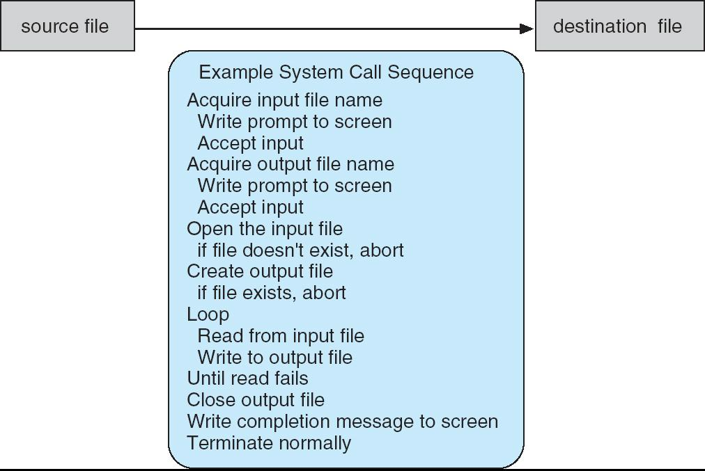

---

### System Call Implementation

Typically, a **number** associated with each system call

- System-call interface maintains a table indexed according to these numbers

每个系统调用都有一个**编号**，系统调用接口维护一个表，通过编号查找对应的系统调用。

The system call interface **invokes** intended system call in OS kernel and **returns status** of the system call and any return values

系统调用接口负责在内核中调用目标系统调用，并返回状态和结果。

The caller needs to know nothing about how the system call is implemented

调用者（程序员）无需关心系统调用的具体实现，只需遵循 API 规范，理解调用结果即可。

- Just needs to obey API and understand what OS will do as a result call
- Most details of OS interface hidden from programmer by API

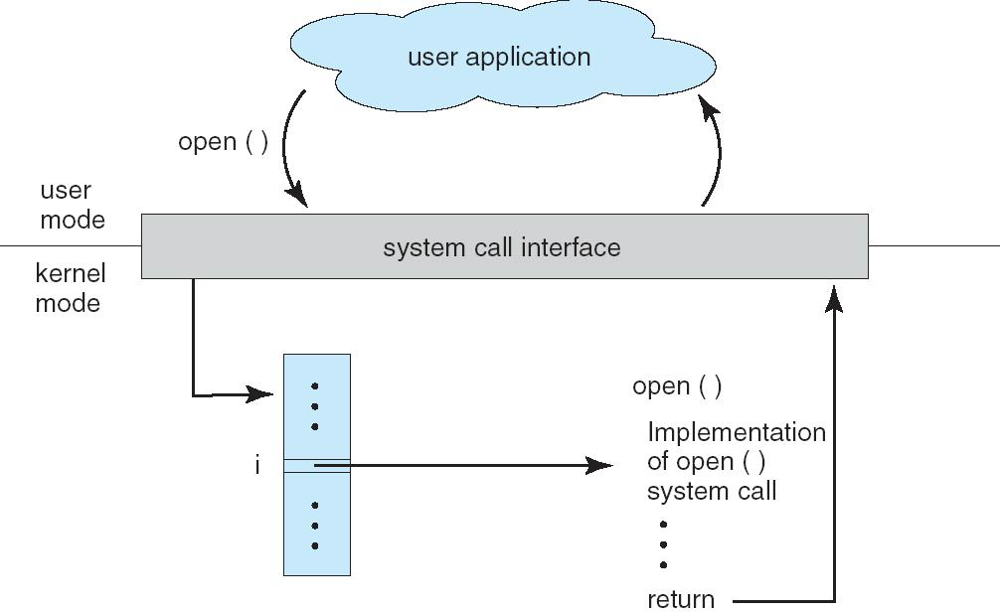

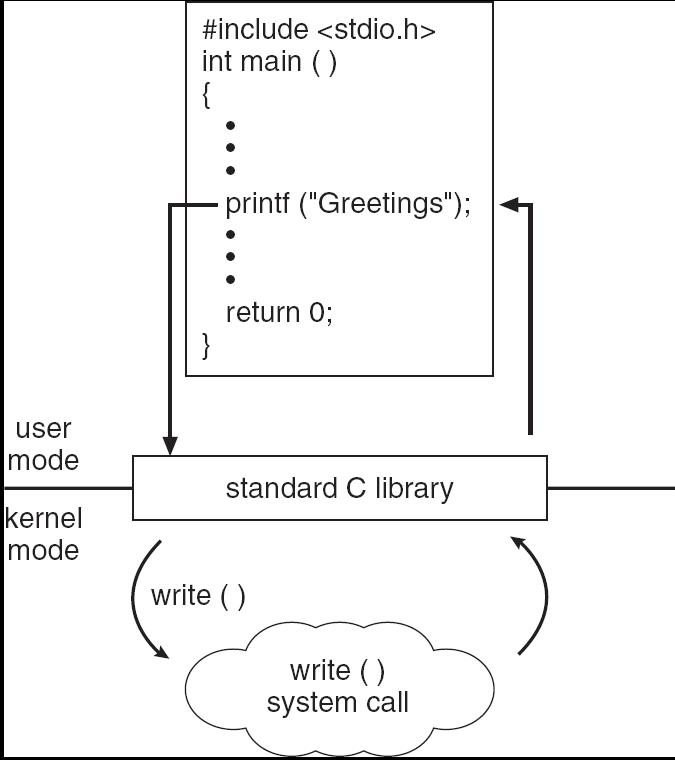

---

### System Call Parameter Passing

Three general methods used to pass parameters to the OS

1. Simplest: pass the parameters in **registers**

    - In some cases, may be more parameters than registers
    - 最简单的方法，直接把参数放在CPU寄存器中。如果参数太多，寄存器不够用时不适用。

2. Parameters stored in a **block**, or table, in memory, and **address of block passed** as a parameter in a register

    - 把所有参数存放在内存中的一个块（或表）里，然后把这个块的地址作为参数传递。适合参数数量或长度不定的情况。
    - This approach taken by Linux and Solaris

3. Parameters placed, or pushed, onto the **stack** by the program and popped off the stack by the operating system

    - 程序把参数压入栈中，操作系统从栈中弹出参数。

**Block** and **stack** methods **do not limit the number** or length of parameters being passed

==Parameter Passing via Table==

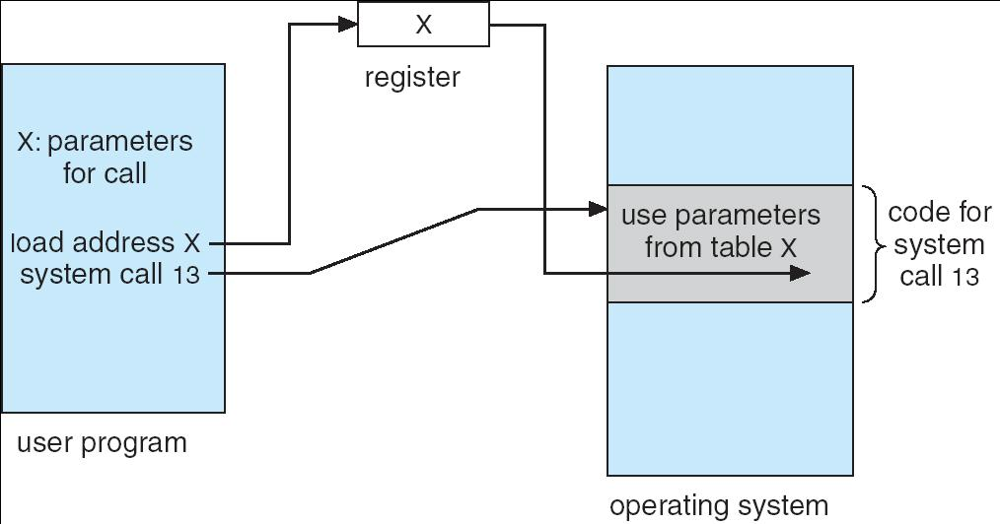

---

## Types of System Calls

Process control、File management、Device management、Information maintenance (e.g. time, date)、Communications、Protection

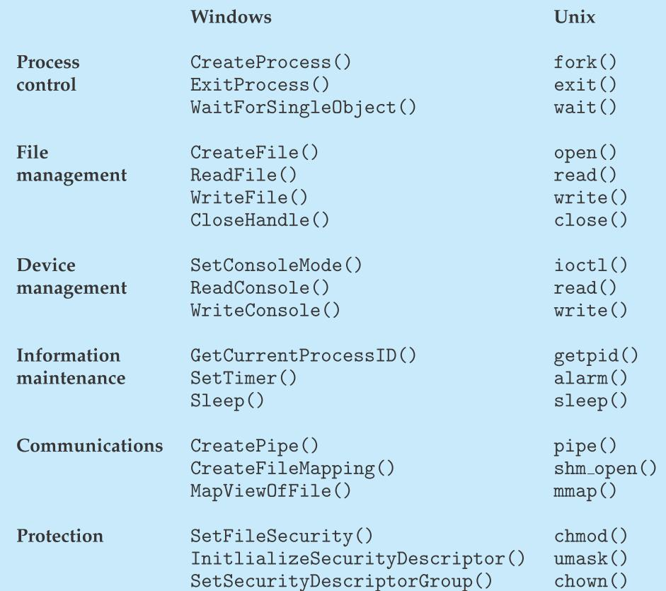

---

## System Programs

System programs provide a convenient environment for program development and execution. They can be divided into:

- File manipulation
- Status information
- File modification
- Programming language support
- Program loading and execution
- Communications
- Application programs

Provide a convenient environment for program development and execution

**File management** - Create, delete, copy, rename, print, dump, list, and generally manipulate files and directories

**Status information**

- Some **ask the system for info** - date, time, amount of available memory, disk space, number of users
- Others provide **detailed performance**, logging, and debugging information
- Typically, these programs format and print the output to the terminal or other output devices
- Some systems implement a registry - used to store and retrieve configuration information

**File modification**

- **Text editors** to create and modify files
- **Special commands** to search contents of files or perform transformations of the text

**Programming-language support** - Compilers, assemblers, debuggers and interpreters sometimes provided

**Program loading and execution** - Absolute loaders, relocatable loaders, linkage editors, and overlay-loaders, debugging systems for higher-level and machine language

**Communications** - Provide the mechanism for creating virtual connections among processes, users, and computer systems

---

## Operating System Design and Implementation

Start by defining **goals** and **specifications**

Affected by choice of **hardware**, **type of system**

User goals and System goals

- User goals – operating system should be **convenient** to use, easy to learn, reliable, safe, and fast
- System goals – operating system should be **easy to design**, implement, and maintain, as well as flexible, reliable, error-free, and efficient

---

1. **Policy**: What will be done? 策略（确定具体做什么事）
2. **Mechanism**: How to do it? 机制（定义做事方式）

!!! tip

    === "课上的举例"

        policy like c file

        mechanism like PC

    === "🌰"

        策略：实现了“分配和回收内存块”的基本操作。

        机制：可以选择首次适应、最佳适应、最差适应等不同分配算法。

        好处：更换分配策略时，内存管理机制无需大改。
    
    === "总结"

        抽象的是 Policy，具体实现的是 Mechanism。

The separation of policy from mechanism is a very important principle, it allows maximum flexibility if policy decisions are to be changed later

---

## Operating System Structure

### Simple Structure

以 MS-DOS 为例，说明早期操作系统的结构特点：

MS-DOS – written to provide the most functionality **in the least space**

- Not divided into modules
- Although MS-DOS has some structure, its interfaces and levels of functionality are **not well separated**

---

#### MS-DOS Layer Structure

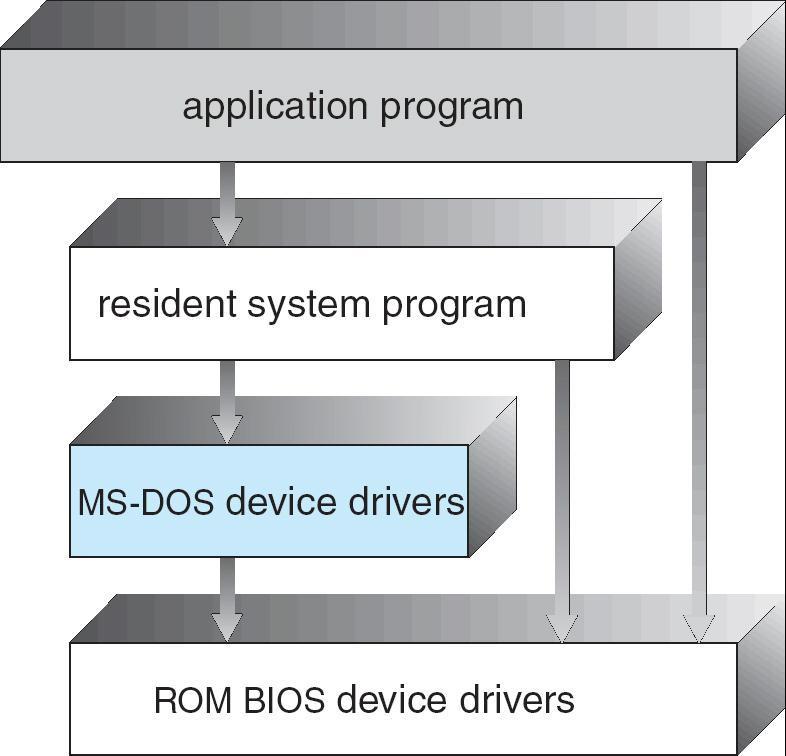

虽然图中有层次，但实际上各层之间的界限并不严格。比如，应用程序可以直接调用MS-DOS设备驱动，甚至直接访问ROM BIOS驱动，而不一定非要通过上层的resident system program。

各部分之间耦合度高，接口不统一，导致系统难以维护和扩展。

应用程序可以直接操作底层硬件，容易导致系统崩溃或安全隐患。

---

#### Layered Approach

The operating system is divided into a number of layers (**levels**), each built on top of lower layers. The bottom layer (layer 0), is the hardware; the highest (layer N) is the user interface.

With **modularity**, layers are selected such that each uses functions (operations) and services of only lower-level layers

???+ example "question"
    下列选项中，()不属于模块化操作系统的特点。

    A.很多模块化的操作系统，可以支持动态加载新模块到内核，适应性强

    B.内核中的某个功能模块出错不会导致整个系统崩溃，可靠性高

    C.内核中的各个模块，可以相互调用，无须通过消息传递进行通信，效率高
    
    D.各模块间相互依赖，相比于分层式操作系统，模块化操作系统更难调试和验证

??? note "answer"
    B

    模块化操作系统的各功能模块都在内核中，且模块之间相互调用、相互依赖，任何一个模块出错，都可能导致整个内核崩溃。

分层法是将操作系统分为若干层，底层(层0)为硬件，顶层(层N)为用户接口，每层只能调用紧邻它的低层的功能和服务(单向依赖)。

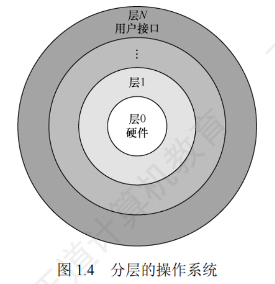

分层法的优点：

1. 便于系统的调试和验证，简化了系统的设计和实现。第1层可先调试而无须考虑系统的其他部分，因为它只使用了基本硬件。第1层调试完且验证正确之后，就可以调试第2层，如此向上。若在调试某层时发现错误，则错误应在这一层上，这是因为它的低层都调试好了。
2. 易扩充和易维护。在系统中增加、修改或替换一层中的模块或整层时，只要不改变相应层间的接口，就不会影响其他层。

分层法的问题：

1. 合理定义各层比较困难。因为依赖关系固定后，往往就显得**不够灵活**。
2. 效率较差。操作系统每执行一个功能，通常要自上而下地穿越多层，各层之间都有相应的层间通信机制，这无疑增加了额外的开销，导致系统效率降低。

---

#### Layered Operating System

操作系统被划分为若干层，每一层只依赖于它下方的那一层。

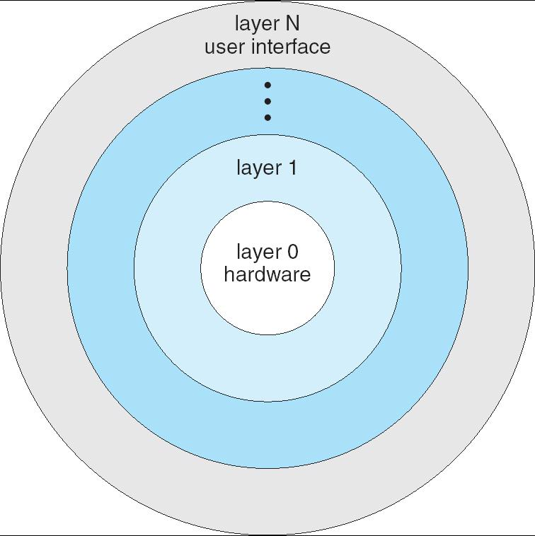

---

### UNIX

UNIX – limited by hardware functionality, the original UNIX operating system had limited structuring. The UNIX OS consists of two separable parts

- System programs
- The kernel

    - Consists of everything below the system-call interface and above the physical hardware
    - Provides the file system, CPU scheduling, memory management, and other operating-system functions; a large number of functions for one level

UNIX结构分为**系统程序**和**内核**两大部分。

---

#### UNIX System Structure

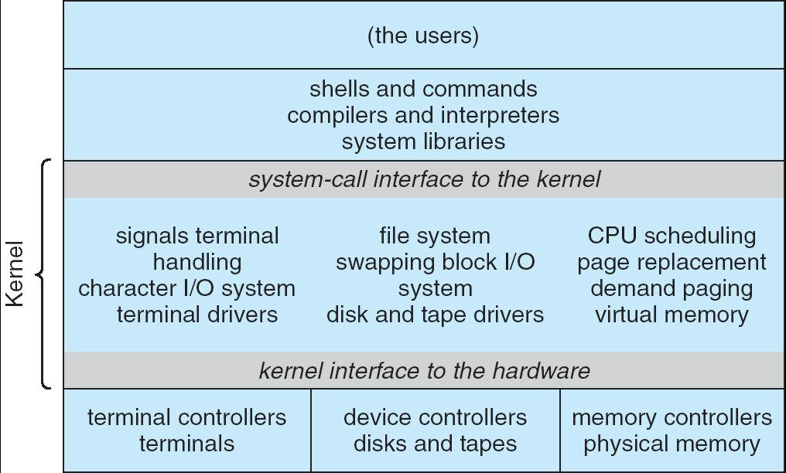

- 用户空间（the users）: 最上层是用户，包括所有使用计算机的人。
- 系统程序（shells and commands, compilers and interpreters, system libraries）
- 系统调用接口（system-call interface to the kernel） : 这是应用程序和内核之间的桥梁。用户程序通过系统调用接口请求内核服务（如文件操作、进程管理等）。
- 内核（Kernel）: 内核是UNIX操作系统的核心，负责所有底层资源管理和硬件控制。信号与终端处理、字符I/O系统、终端驱动、文件系统、交换、块I/O系统、磁盘和磁带驱动、CPU调度、页面置换、请求分页、虚拟内存。
- 内核与硬件接口（kernel interface to the hardware）: 这是内核与底层硬件之间的接口，内核通过它来控制和管理硬件设备。
- 硬件控制器和设备（terminal controllers, device controllers, memory controllers）

---

### Monolithic Kernel

宏内核，也称**单内核**或**大内核**，是指将系统的主要功能模块都作为一个紧密联系的整体运行在内核态，从而为用户程序提供高性能的系统服务。因为各管理模块之间共享信息，能有效利用相互之间的有效特性，所以具有无可比拟的性能优势。

---

### Microkernel System Structure

Moves as much from the kernel into “**user**” space

微内核只保留**最基本、最核心**的功能在内核态（kernel mode），如进程间通信（IPC）、内存管理、CPU调度等。

Communication takes place between **user modules** using **message passing**

Benefits:

- Easier to **extend** a microkernel. **增加**或修改系统服务时，只需更改用户态模块，不影响内核。
- Easier to **port** the operating system to new architectures. 内核代码少，**移植**到新硬件平台更**容易**。
- More **reliable** (less code is running in kernel mode). 大部分操作系统代码在用户态运行，内核态代码少，**出错影响范围小**。
- More **secure**. 内核态代码少，攻击面小，**安全性高**。

Detriments:

- **Performance overhead** of user space to kernel space communication. 用户态和内核态之间频繁消息传递，导致**性能下降**。

**微内核的基本功能**：

1. **进程(线程)管理**。进程(线程)之间的通信功能是微内核 OS最基本的功能，此外还有进程的切换、进程的调度，以及多处理机之间的同步等功能，都应放入微内核。
2. **低级存储器管理**。在微内核中，只配置最基本的低级存储器管理机制，如用于实现将逻辑地址变换为物理地址的页表机制和地址变换机制，这一部分是依赖于硬件的，因此放入微内核。
3. **中断和陷入处理**。内核 OS 将与硬件紧密相关的一小部分放入微内核，此时微内核的主要功能是捕获所发生的中断和陷入事件，并进行中断响应处理，在识别中断或陷入的事件后，再发送给相关的服务器来处理，所以中断和陷入处理也应放入微内核。

???+ example "question"
    相对于传统操作系统结构，采用微内核结构设计和实现操作系统有诸多好处，下列()是微内核结构的特点。
    
    I.使系统更高效  Ⅱ.添加系统服务时，不必修改内核  Ⅲ.微内核结构没有单一内核稳定  IV.使系统更可靠
    
    A.I、Ⅲ、IV
    
    B.I、Ⅱ、IV
    
    C.Ⅱ、IV
    
    D.I、IV

??? note "answer"
    C

    微内核结构需要频繁地在内核态和用户态之间进行切换，操作系统的执行开销相对偏大，那些移出内核的操作系统代码根据分层的原则被划分成若干服务程序，它们的执行相互独立，交互则都借助于微内核进行通信，影响了系统的效率，因此选项I不是优势。
    
    因为内核的服务变少，且一般来说内核的服务越少内核越稳定，所以选项Ⅲ错误。而选项Ⅱ、IV 正是微内核结构的优点。

---

#### Architecture of A Typical Microkernel

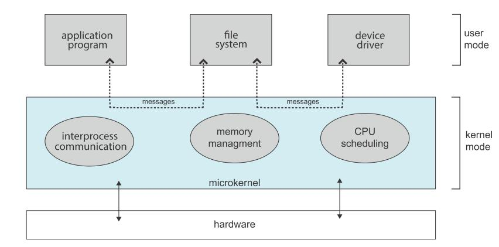

---

### Mac OS X Structure

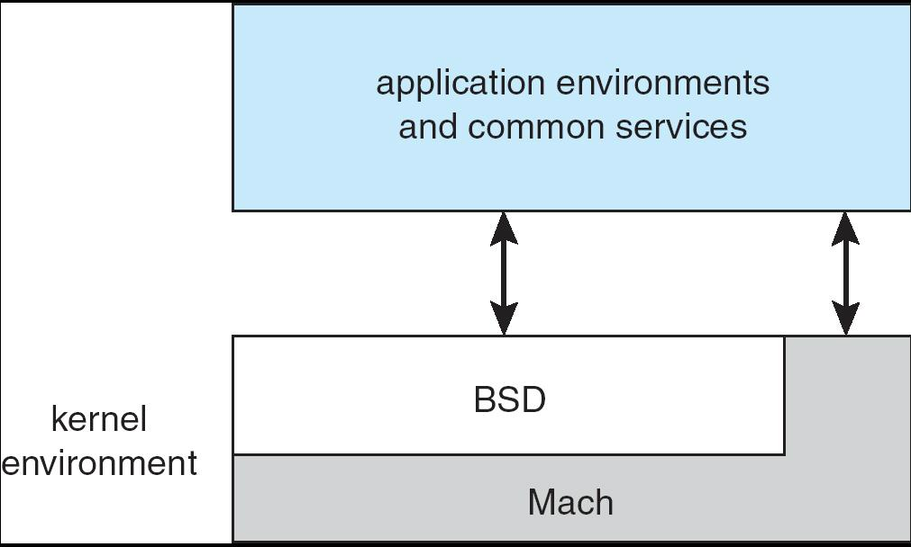

更详细地展示了Darwin内核环境的内部结构。

1. application environments and common services（应用环境与通用服务）提供给应用程序的运行环境和常用服务。
2. BSD层。BSD是Berkeley Software Distribution的缩写，这一层提供了类Unix的系统接口，包括进程管理、文件系统、网络协议栈等，是macOS兼容Unix标准的关键部分。
3. Mach内核。Mach是一个微内核，负责最底层的任务，如进程/线程管理、内存管理、进程间通信（IPC）等。BSD层运行在Mach之上，利用Mach提供的底层机制实现更高层的操作系统功能。

---

### Mac OS Structure

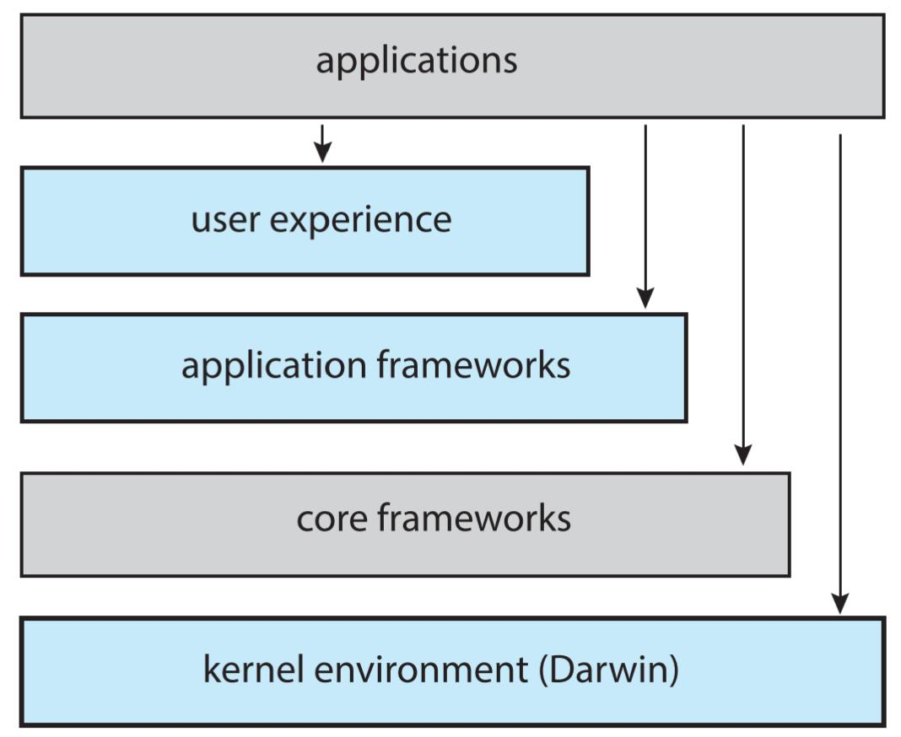

每一层都为上层提供服务和接口，应用程序可以直接调用上层或部分底层框架的功能。

1. applications（应用程序）用户直接使用的各种应用软件
2. user experience（用户体验层）提供图形界面、窗口管理、动画、系统交互等用户可见的体验功能。
3. application frameworks（应用框架）为应用开发者提供的各种API和框架。
4. core frameworks（核心框架）提供更底层的系统服务。
5. kernel environment (Darwin)（内核环境）最底层，是macOS的内核。它负责硬件管理、进程调度、内存管理、驱动支持等所有底层功能。

---

### Modules

Most modern operating systems implement **kernel modules**

它将操作系统的各个核心功能划分为**独立的模块**（module），每个模块负责不同的功能。这些模块可以**根据需要被动态加载**或卸载到内核中。

- Uses **object-oriented** approach. 类似于面向对象中的“对象”，职责单一，接口明确。
- Each core component is **separate**. 核心组件分离。
- Each talks to the others over **known interfaces**. Modules call each other instead of message passing. 已知接口通信。
- Each is loadable as needed within the kernel. 按需加载。

Overall, similar to layers but more flexible

模块化结构类似于**分层结构**，但更加灵活。分层结构层次固定，模块化结构可以**动态组合和扩展**。

**微内核**将大部分服务移到用户态，通过消息传递通信，安全性高但**性能有损耗**(换句话说就是系统**不高效**)。模块化内核则大部分模块仍在内核态，直接调用接口，**性能更高**。

---

#### Solaris Modular Approach

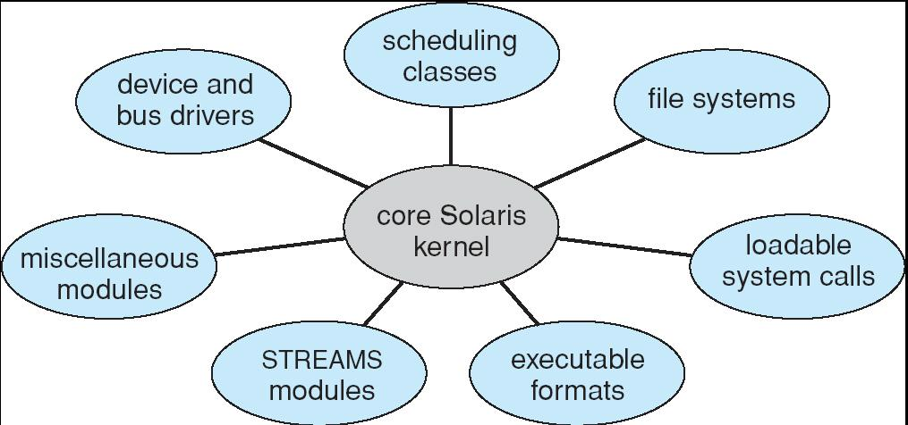

---

### Other Structures

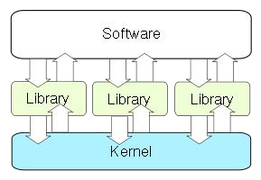

Unikernel: statically linked with the OS code needed.

Good for cloud service, APP boots in tens of milliseconds

Unikernel/Library OS结构的核心思想：应用、库和内核紧密集成，按需裁剪，极致精简，适合云原生和高安全性场景。

---

## Virtual Machines

A **virtual machine** takes the layered approach to its logical conclusion. It treats hardware and the operating system kernel as though they were all **hardware**

虚拟机采用**分层结构**的思想，把硬件和操作系统内核都当作“**硬件**”来看待。（在传统操作系统中，最底层是硬件，上面是内核，再上面是用户进程。虚拟机系统则在硬件和操作系统之间增加了一层“虚拟机实现层”，这层负责把物理资源虚拟化，创建多个虚拟机。每个虚拟机之上可以运行自己的操作系统和应用程序，每个虚拟机都像是独占一台完整的计算机。）虚拟机里的进程通过系统调用访问虚拟机内核，虚拟机内核再通过虚拟机实现层访问“虚拟硬件”，而虚拟机实现层**最终把请求映射到真实硬件**。

A virtual machine provides an interface identical to the underlying bare hardware

虚拟机为每个用户或进程提供一个与真实硬件完全相同的**接口**，让每个虚拟机看起来像是在独占一台物理计算机。

The operating system creates the illusion of multiple processes, each executing on its own processor with its own (virtual) memory

每个虚拟机都拥有自己的“虚拟处理器”和“虚拟内存”。实际上这些资源是由物理硬件分时分配的。

The resources of the physical computer are shared to create the virtual machines

- CPU scheduling can create the appearance that users have their own processor **CPU调度**让每个虚拟机看起来有自己的处理器，实际上是轮流使用物理CPU。
- Spooling and a file system can provide virtual card readers and virtual line printers
- A normal user time-sharing terminal serves as the virtual machine operator’s console

---

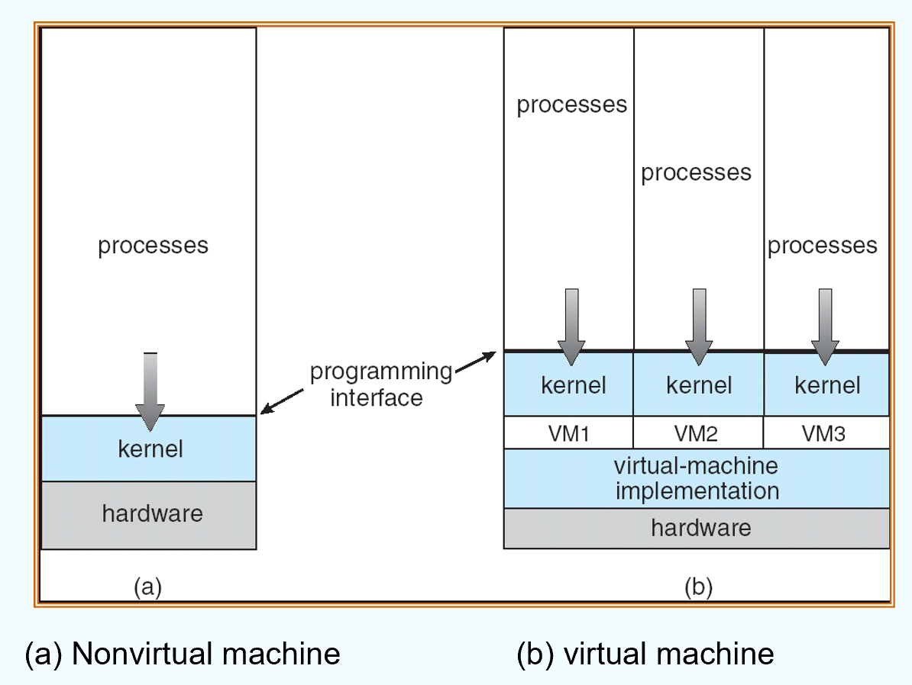

Nonvirtual machine 所有进程共享同一个操作系统环境，资源隔离和安全性由内核负责。

Virtual machine 每个虚拟机都拥有自己的内核和进程。

---

The virtual-machine concept provides complete protection of system resources since each virtual machine is **isolated** from all other virtual machines. This isolation, however, permits no direct sharing of resources.

每个虚拟机之间**完全隔离**，**互不影响**，系统资源得到完全**保护**。

A virtual-machine system is a perfect vehicle for operating-systems research and development. **System development** is done on the virtual machine, instead of on a physical machine and so does not disrupt normal system operation.

可以在虚拟机上开发和测试新操作系统，不会影响主机的正常运行。

The virtual machine concept is difficult to implement due to the effort required to provide an **exact** duplicate to the underlying machine. (for example, virtual user mode and kernel mode)

要实现与真实硬件完全一致的接口，需要模拟所有硬件特性，包括用户态和内核态的切换等，技术难度较高。同时虚拟化会带来一定的性能损失，因为需要额外的资源管理和模拟。

???+ example "question"
    下列关于虚拟机的说法中，正确的是()。
    
    I.虚拟机可以用软件实现  II.虚拟机可以用硬件实现  Ⅲ.多台虚拟机可同时运行在同一物理机器上，它实现了真正的并行
    
    A.I和Ⅱ
    
    B.I和Ⅲ
    
    C.仅I
    
    D.I、Ⅱ和Ⅲ

??? note "answer"
    A

    软件能实现的功能也能由硬件实现，因为虚拟机软件能实现的功能也能由硬件实现，软件和硬件的分界面是系统结构设计者的任务，选项I和Ⅱ正确。实现真正并行的是多核处理机，多台虚拟机同时运行在同一物理机器上，类似于多个程序运行在同一个系统中。

---

### VMware Architecture

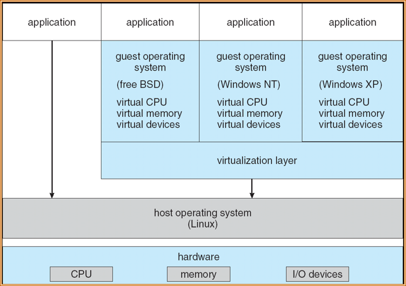

---

### Different Techniques

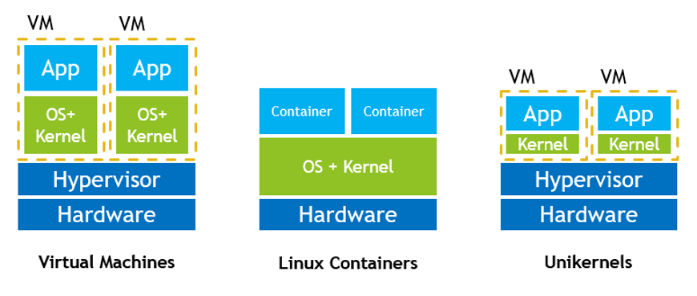

- Virtual Machines 每个虚拟机完全隔离，拥有自己的内核和系统资源。可以运行不同类型的操作系统。
- Linux Containers 容器直接运行在主机操作系统之上，多个容器**共享同一个内核**。每个容器包含应用程序及其依赖，但没有独立的内核。启动速度快，资源消耗低。隔离性比虚拟机弱。
- Unikernels 底层是物理硬件和虚拟化管理器。没有完整的操作系统，只有应用需要的内核功能。

---

## Operating System Generation

Operating systems are designed to run on any of a class of machines; the system must be configured for each specific computer site

操作系统通常设计为可以运行在某一类硬件上，但每台具体的计算机硬件配置可能不同

SYSGEN program obtains information concerning the specific configuration of the hardware system

SYSGEN 程序：用于收集和配置当前计算机的硬件信息。它会询问或检测硬件配置，然后生成适合该机器的操作系统配置文件或内核映像。

Booting – starting a computer by loading the kernel

让操作系统内核被加载到内存，并开始运行。

Bootstrap program – code stored in ROM that is able to locate the kernel, load it into memory, and start its execution

引导程序是一小段代码，通常存储在主板的ROM（只读存储器）或固件（Firmware）中。

---

## System Boot

Operating system must be made available to hardware so hardware can start it

- Small piece of code – **bootstrap program** (a.k.a. bootstrap loader), locates the kernel, loads it into memory, and starts it
- Sometimes two-step process where **boot block** at fixed location loads bootstrap loader

有时引导过程分为两步，固定位置的 boot block 先加载引导程序。引导程序再加载操作系统内核。

- When power initialized on system, execution starts at a fixed memory location

    - Firmware used to hold initial boot code

固件是嵌入在硬件设备上的软件，负责最初的硬件初始化和启动代码。当系统加电时，CPU会从一个固定的内存地址开始执行，这里存放的就是固件或引导程序。

???+ example "question"
    对于计算机操作系统引导，描述不正确的是()。
    
    A.计算机的引导程序驻留在ROM中，开机后自动执行
    
    B.引导程序先做关键部位的自检，并识别已连接的外设
    
    C.引导程序会将硬盘中存储的操作系统全部加载到内存中
    
    D.若计算机中安装了双系统，引导程序会与用户交互加载有关系统

??? note "answer"
    C

    常驻**内存**(RAM)的只是操作系统内核，其他部分仅在需要时才调入。

???+ example "question"
    计算机的启动过程是()。①CPU加电，CS:IP指向FFFFOH;②进行操作系统引导；③执行JMP指令跳转到BIOS;④登记BIOS中断程序入口地址；⑤硬件自检。
    
    A.①②③④⑤  B.①③⑤④②  C.①③④⑤②  D.①⑤③④②

??? note "answer"
    C

    CPU 激活后，从顶端的地址 FFFFOH 获得第一条执行的指令，这个地址仅有 16 字节，放不下一段程序，所以是一条 JMP 指令，以跳到更低地址去执行 BIOS 程序。BIOS 程序在内存最开始的空间构建中断向量表和相应服务程序，在后续 POST 过程中要用到中断调用等功能。然后进行通电自检(Power-on Self Test，POST)以检测硬件是否有故障。完成 POST 后，BIOS 需要在硬盘、光驱或软驱等存储设备搜寻操作系统内核的位置以启动操作系统。

---