# Chapter 3 | Processes

## Process concept

An operating system executes a variety of programs:

- Batch system – jobs
- Time-shared systems – user programs or tasks

Textbook uses the terms job and process almost interchangeably

Process – a program in execution; process execution must progress in sequential fashion

A process includes:

- text section (code)
- program counter
- stack (function parameters, local vars, return addresses)
- data section (global vars)
- heap (dynamically allocated memory)

---

### Process in Memory

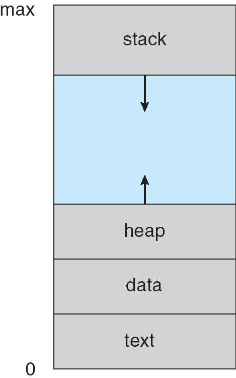

- text 存放程序的机器指令（代码）。只读，防止程序自我修改。
- data 存放全局变量和静态变量。程序启动时分配，生命周期贯穿整个进程。
- heap 用于动态分配内存（如 C/C++ 的 malloc/new，Java 的 new）。堆空间从低地址向高地址增长（图中向上箭头）。适合存储大小和生命周期不确定的数据结构（如链表、树等）。
- stack 用于存储函数调用相关信息：参数、局部变量、返回地址等。每次函数调用会在栈上分配一块空间，函数返回后释放。栈空间从高地址向低地址增长（图中向下箭头）。适合存储临时数据，自动管理内存。
- 中间的蓝色区域表示堆和栈之间的“未分配空间”。堆和栈分别向中间增长，防止互相覆盖。如果堆和栈相遇，说明内存耗尽，进程会崩溃。

进程看到和使用的地址空间，并不是物理内存的真实地址，而是操作系统为每个进程分配的**虚拟地址空间**。这样每个进程只能访问自己的虚拟空间，不能随意访问其他进程的内存，提高安全性。

???+ example "question"
    若一个进程实体由PCB、共享正文段、数据堆段和数据栈段组成，请指出下列C语言程序中的内容及相关数据结构各位于哪一段中。

    I.全局赋值变量()  II.未赋值的局部变量()  Ⅲ.函数调用实参传递值()  IV.用malloc()要求动态分配的存储区()  V.常量值(如1995、"string")()  VI.进程的优先级()

    A.PCB  B.正文段  C.堆段  D.栈段

??? note "answer"
    I.B  II.D  III.D  IV.C  V.B  VI.A

    全局赋值变量存放在数据段中，未赋值的局部变量和函数调用实参传递值存放在栈段中，用malloc()要求动态分配的存储区存放在堆段中，常量值存放在正文段中，进程的优先级等信息存放在PCB中。

    C语言编写的程序在使用内存时一般分为三个段:正文段(代码和赋值数据段)、数据堆段和数据栈段。二进制代码和常量存放在正文段，动态分配的存储区存放在数据堆段，临时使用的变量存放在数据栈段。由此，我们可以确定全局赋值变量在正文段赋值数据段，未赋值的局部变量和实参传递在栈段，动态内存分配在堆段，常量在正文段，进程的优先级只能在 PCB 内。

---

### Process State

As a process executes, it changes **state**

- new: The process is being created 进程正在被创建，还没有进入系统调度队列。
- running: Instructions are being executed 进程正在 CPU 上执行指令。
- waiting: The process is waiting/blocked for some event to occur 进程因为等待某个事件（如 I/O 完成、资源可用等）而暂停执行，暂时不能运行。
- ready: The process is waiting to be assigned to a processor 进程已经创建好，等待被分配 CPU（等待调度）。
- terminated: The process has finished execution 进程执行完毕或被操作系统强制结束，生命周期结束。

---

#### Diagram of Process State

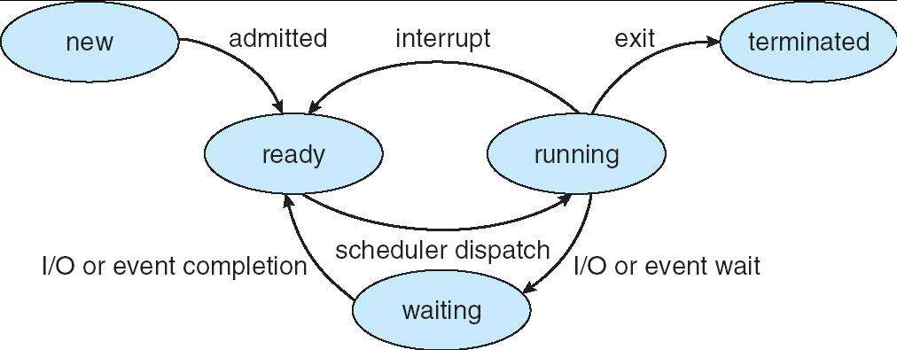

- new → ready：进程被创建并加入就绪队列（admitted）。
- ready → running：调度器分配 CPU，进程开始执行（scheduler dispatch）。
- running → waiting：进程需要等待某个事件（如 I/O），主动让出 CPU（I/O or event wait）。
- waiting → ready：等待的事件完成，进程重新进入就绪队列（I/O or event completion）。
- **running → ready**：进程被中断（如时间片用完），让出 CPU，回到就绪队列（interrupt）。
- running → terminated：进程正常结束或被强制终止（exit）。

---

### Control Block (PCB) Process

Information associated with each process

- Process state
- Program counter
- Contents of CPU registers
- CPU scheduling information
- Memory-management information
- Accounting information
- I/O status information

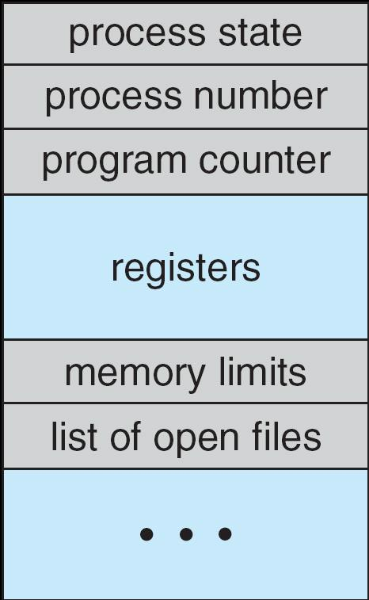

**进程控制块（PCB）**是操作系统为每个进程分配的数据结构，记录了进程的所有关键信息。操作系统通过 PCB 来管理和调度进程。

当进程切换时，操作系统会**保存当前进程的 PCB**，并加载下一个进程的 PCB，实现**上下文切换**。

PCB 是进程管理、调度、资源分配的核心数据结构。

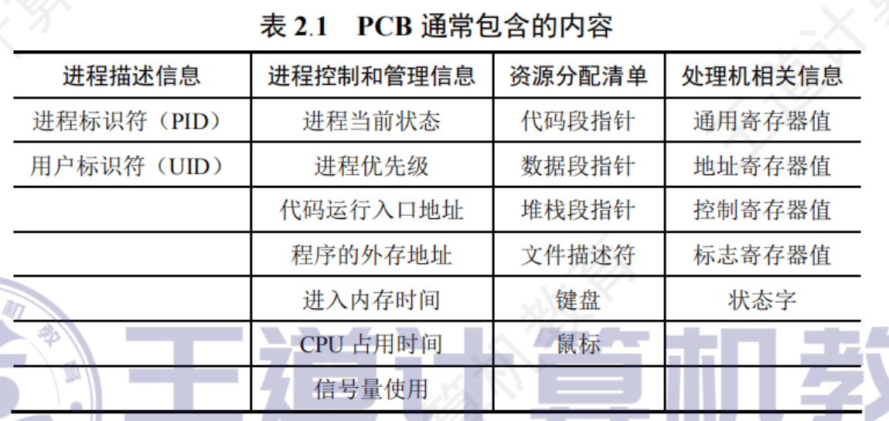

???+ example "question"
    一个进程映像是()。
    
    A.由协处理器执行的一个程序
    
    B.一个独立的程序+数据集
    
    C.PCB结构与程序和数据的组合
    
    D.一个独立的程序

??? note "answer"
    进程映像是 PCB、程序段和数据的组合，其中PCB是进程存在的**唯一**标志。

???+ example "question"
    操作系统是根据()来对并发执行的进程进行控制和管理的。
    A.进程的基本状态
    
    B.进程控制块
    
    C.多道程序设计
    
    D.进程的优先权

??? note "answer"
    B.进程控制块

    在进程的整个生命周期中，系统总是通过其 PCB 对进程进行控制。也就是说，系统是根据进程的 PCB 而非任何其他因素来感知到进程存在的，PCB 是进程存在的唯一标志。同时 PCB 常驻内存。A 和 D 选项的内容都包含在进程 PCB 中。

---

#### CPU Switch From Process to Process

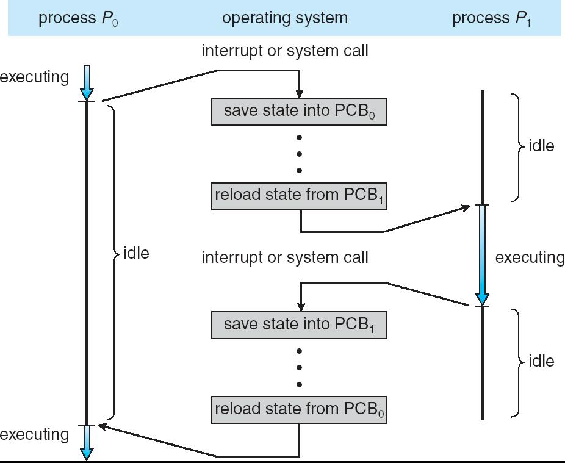

---

## Process Scheduling

### Process Scheduling Queues

操作系统会用不同的队列来管理进程的状态和调度过程。每个队列代表进程在生命周期中的不同阶段。

**Job queue** – set of all processes in the system

包含系统中所有进程（无论是否在内存）。新创建的进程首先进入作业队列，等待被调度进入内存。

**Ready queue** – set of all processes residing in main memory, ready and waiting to execute

包含所有已经在**主存**（内存）中，并且**准备好可以运行**的进程。

**Device queues** – set of processes waiting for an I/O device

包含所有正在**等待某个 I/O 设备**的进程。当 I/O 操作完成，进程会从设备队列移回就绪队列。

Processes **migrate** among the various queues

---

#### Ready Queue And Various I/O Device Queues

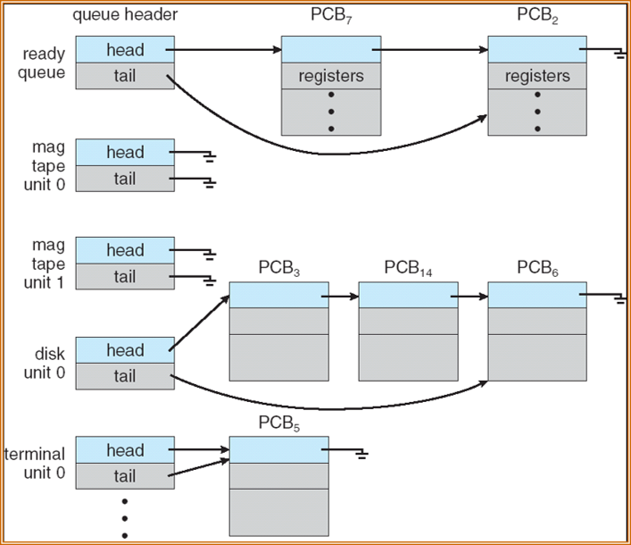

---

#### Representation of Process Scheduling

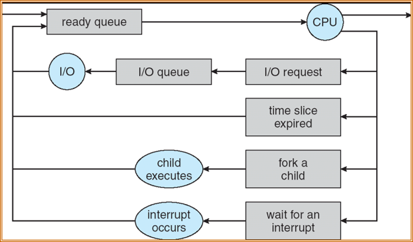

1. 进程从 ready queue 被调度到 CPU
2. 进程运行期间可能发生的事件:

- 进程需要进行 I/O 操作（如读文件），会进入 I/O queue 等待设备完成。
- 如果采用时间片轮转调度，进程运行到时间片结束会被强制让出 CPU，重新进入 ready queue。
- 进程可以通过 fork 创建子进程，子进程进入 ready queue 或直接执行。
- 进程可能等待某个外部事件或中断，进入等待状态。

3. I/O完成或中断发生

- I/O操作完成后，进程回到 ready queue，等待再次被调度。
- 中断发生后，相关进程也会回到 ready queue。

---

### Schedulers

What is a scheduler? A piece of program

调度器是操作系统中的一个**程序模块**，负责决定哪个进程可以**获得系统资源**（主要是 CPU），以及进程在**不同队列之间的迁移**。

- **Long-term scheduler**  (or job scheduler) – selects which processes should be brought into memory (the ready queue)

决定哪些进程应该被调入内存，进入就绪队列（ready queue）。

对于现在的计算机，我们这些**用户**相当于 Long-term scheduler。（这是一个在历史上的概念，现在我们不需要一个软件叫做 Long-term scheduler）。

- **Short-term scheduler**  (or CPU scheduler) – selects which process should be executed next and allocates CPU

决定下一个要执行的进程，并分配 CPU。

---

#### Representation of Process Scheduling

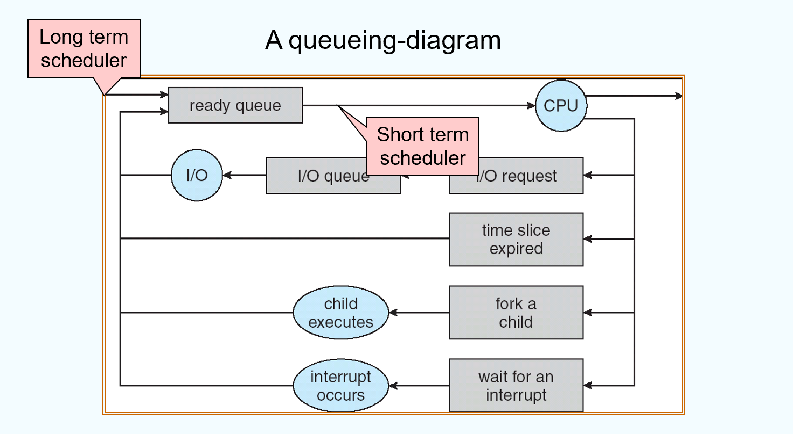

---

#### Addition of Medium Term Scheduling

Sometimes, it can be good to swap processes out.

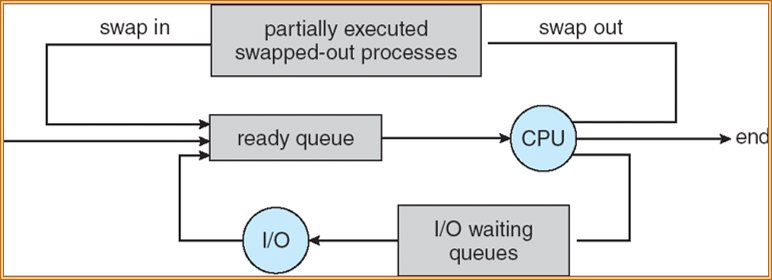

当系统内存紧张，或者有太多进程在等待时，操作系统可以把部分进程“换出”到磁盘（swap out），腾出内存给其他进程使用。

被换出的进程不会被终止，只是暂时不在内存，等需要时再“换入”内存（swap in）继续执行。

---

Short-term scheduler is invoked very **frequently** (milliseconds) $\rightarrow$ (must be **fast**)

调用非常**频繁**（毫秒级），因为每次进程切换都要用到它，所以必须非常**快**。如果进程切换很慢，就不能保证考虑用户交互需要的 `time-sharing` 。

Long-term scheduler is invoked very **infrequently** (seconds, minutes) $\rightarrow$ (may be slow)

**调用很少**（秒级、分钟级），可以慢一些。

The long-term scheduler controls the **degree of multiprogramming**

控制系统的**多道程序度**（即系统中同时在内存中的进程数量）。

Processes can be described as either:

- **I/O-bound process** – spends more time doing I/O than computations, many short CPU bursts 计算时间短，CPU突发很短但频繁。(例如微信、浏览器等)
- **CPU-bound process** – spends more time doing computations; few very long CPU bursts 主要花时间在计算上，I/O操作少，CPU突发很长但不频繁。(例如编译器、科学计算等)

---

### Context Switch

When CPU switches to another process, the system must save the state of the old process and load the saved state for the new process

当CPU从一个进程切换到另一个进程时，系统必须**保存当前进程的状态**（如寄存器、程序计数器等），并**加载新进程的状态**。

Context-switch time is overhead; the system does no useful work while switching - typically takes **milliseconds**

上下文切换期间，系统不能做实际工作，是一种开销，通常需要**几毫秒**。

Time dependent on hardware support. In the SPARC architecture, groups of registers are provided.

上下文切换的速度依赖于硬件支持，比如SPARC架构有专门的寄存器组来加速切换。

---

## Operations on Processes

### Process Creation

Parent process creates children processes, which, in turn create other processes, forming a tree of processes

操作系统允许一个进程（称为父进程）创建新的进程（称为子进程）。子进程也可以继续创建自己的子进程，最终形成进程树结构。这种树状结构有助于操作系统管理和追踪进程之间的关系。

**Resource sharing**

- Parent and children share all resources 父子进程共享所有资源
- Children share subset of parent’s resources 子进程只继承父进程的一部分资源。
- Parent and child share no resources 父子进程各自拥有独立的资源，互不影响。

**Execution**

- Parent and children execute concurrently 父进程和子进程可以同时运行，各自独立调度。
- Parent waits until children terminate 父进程创建子进程后，自己暂停，直到所有子进程结束再继续。

**Address space**

- Child duplicate of parent 子进程是父进程的副本。子进程刚创建时，拥有和父进程一样的代码和数据（内存空间的拷贝）。
- Child has a program loaded into it 子进程可以用新的程序替换自己的地址空间，变成完全不同的进程。

**UNIX examples**

- **fork** system call creates new process 用于创建一个新的子进程。子进程是父进程的完整副本（包括代码、数据、打开的文件等）。
- **exec** system call used after a **fork** to replace the process’ memory space with a new program 通常在 fork 之后使用，用于让子进程加载并运行一个新的程序，替换原有的内存空间。

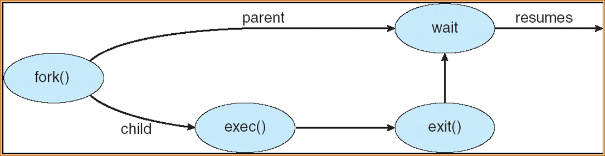

1. 父进程通过 `fork()` 系统调用创建一个新的子进程。子进程是父进程的副本，拥有相同的代码和数据空间（但资源可以部分或全部独立）。
2. 子进程通常会调用 `exec()` 系统调用，加载一个新的程序到自己的地址空间。这样，子进程就变成了一个全新的进程，运行不同的代码。
3. 子进程完成任务后，调用 `exit()` 终止自身，释放资源。进程终止时会通知父进程。
4. 父进程可以调用 `wait()`，等待子进程结束。当子进程终止后，父进程会被唤醒（resumes），继续执行后续操作。

??? info "创建新进程时的操作"
    1)为新进程分配一个唯一的进程标识号，并申请一个空白PCB(PCB是有限的)。若PCB申请失败，则创建失败。
    
    2)为进程分配其运行所需的资源，如内存、文件、I/O设备和CPU时间等(在PCB中体现)。这些资源或从操作系统获得，或仅从其父进程获得。若资源不足(如内存),则并不是创建失败，而是处于创建态，等待内存资源。
    
    3)初始化PCB,主要包括初始化标志信息、初始化CPU状态信息和初始化CPU控制信息，以及设置进程的优先级等。
    
    4)若进程就绪队列能够接纳新进程，则将新进程插入就绪队列，等待被调度运行。

---

#### C Program Forking Separate Process

```c
int main()
{
    pid_t  pid;
    /* fork another process */
    pid = fork();
    if (pid < 0) { /* error occurred */
        fprintf(stderr, "Fork Failed");
        exit(-1);
    }
    else if (pid == 0) { /* child process */
        execlp("/bin/ls", "ls", NULL);
    }
    else { /* parent process */
        /* parent will wait for the child to complete */
        wait (NULL);
        printf ("Child Complete");
        exit(0);
    }
}
```

---

#### A tree of processes on a typical Solaris

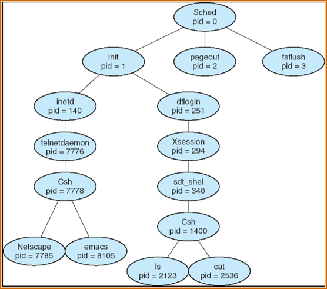

---

### Process Termination

Process executes last statement and asks the operating system to delete it (**exit**)

当进程执行完最后一条语句后，会调用 `exit`，请求操作系统删除自己。

- Output data from child to parent (via **wait**) 子进程可以通过 `wait` 把输出数据传递给父进程。
- Process’ resources are deallocated by operating system 操作系统释放该进程占用的资源

僵尸进程（zombie）：子进程已结束但父进程还没调用 `wait` 收其状态时，子进程在内核中保留少量信息（PCB）称为僵尸，直到父进程 `wait`。僵尸占用很小内核资源但会消耗 `PID`。

Parent may terminate execution of children processes (**abort**)

父可以强制终止子进程（例如资源超限或任务取消）。有时系统为父终止子做自动回收。

- Child has exceeded allocated resources
- Task assigned to child is no longer required
- If parent is exiting

    - Some operating system do not allow child to continue if its parent terminates 父终止时同时终止所有子（级联终止）。
    
        - All children terminated - cascading termination
        
    - In some other operating systems, the child gets orphaned – and its parent becomes the “init” process (PID=1). 子进程被孤立（orphan），由 init（PID=1）收养并负责后续 wait/收尸工作。
    
---

## Cooperating Processes

**Independent** process cannot affect or be affected by the execution of another process

运行互不影响，不需要进程间同步或通信。

**Cooperating** process can affect or be affected by the execution of another process

进程之间会共享信息、资源或相互依赖，需要通信和同步。

Advantages of process cooperation

- Information sharing 信息共享
- Computation speed-up (Multiple CPUs) 利用多核并行加速
- Modularity 模块化设计(所以需要进程间通信合作)
- Convenience 方便分摊任务与资源

---

### Producer-Consumer Problem

Paradigm for cooperating processes, producer process produces information that is consumed by a consumer process

生产者产生数据放入缓冲区，消费者从缓冲区取数据消费。核心是如何在并发下保证数据一致与缓冲区边界（空/满）的正确处理。

- unbounded-buffer places no practical limit on the size of the buffer. Consumer has to wait if no new item. 理论上缓冲无限大，生产者通常不会阻塞，消费者在空时等待。
- bounded-buffer assumes that there is a fixed buffer size. Producer must wait if buffer full. 缓冲容量固定，生产者在缓冲满时必须等待，消费者在缓冲空时等待。

---

#### Bounded-Buffer – **Shared-Memory** Solution

Shared data

```
#define BUFFER_SIZE 10
typedef struct {
    . . .
} item;

item buffer[BUFFER_SIZE];
int in = 0;
int out = 0;
```

- `buffer[BUFFER_SIZE]`：循环队列（环形缓冲区）。
- `in`：下一个生产者写入的位置索引。
- `out`：下一个消费者读取的位置索引。
- 索引按模 `BUFFER_SIZE` 增加：`in = (in+1) % BUFFER_SIZE`。

---

#### Bounded-Buffer – `Insert()` Method

Producer pseudo-code:

```
while (true) { 
    Produce an item;

    while (((in + 1) % BUFFER_SIZE ) == out); /* do nothing -- no free buffers */
    buffer[in] = item;
    in = (in + 1) % BUFFER_SIZE;
}
```

先生产 `item`，然后等待有空位（busy-wait），把 `item` 写到 `buffer[in]`，再更新 `in`。

---

#### Bounded Buffer – `Remove()` Method

Consumer pseudo-code:

```
while (true) {
    while (in == out); //do nothing, nothing to consume

    Remove an item from the buffer;
    item = buffer[out];
    out = (out + 1) % BUFFER_SIZE;
    return item;
}
```

Solution is correct, but can only use `BUFFER_SIZE ⎯1` elements

等待有可用元素（busy-wait），从 `buffer[out]` 读出 `item`，更新 `out`。

使用上面这组判定方法时，“满”与“空”都会出现 `in` 与 `out` 值相等的情形。为了让两个条件（空与满）能通过简单比较区分，约定当 `in` 的下一个位置等于 `out` 时视为“满”。因此实际可用槽为 `BUFFER_SIZE−1`。

另一种避免浪费槽的办法是额外维护一个计数变量 `count`（或 `full/empty` 计数信号量），通过 `count==0` 表示空，`count==BUFFER_SIZE` 表示满。

---

## Interprocess Communication (IPC)

Mechanism for processes to communicate and to synchronize their actions

IPC 是不同进程之间交换数据与进行同步的机制。目的是让进程能够共享信息、协调工作、避免竞态条件。

Two models for IPC: **message passing** and **shared memory**

Message passing – processes communicate with each other without resorting to shared variables

通过 `send/receive` 操作传递离散消息，进程不直接共享内存。由内核或通信库转发/缓冲消息。

Message-passing facility provides two operations:

- send(message) – message size fixed or variable 
- receive(message) 

If P and Q wish to communicate, they need to:

- establish a **communication** link between them 需要在发送方与接收方之间建立“通信通道”。
- exchange messages via **send/receive** operations 通过 `send/receive` 操作交换消息。

Implementation of communication link

- physical (e.g., shared memory, hardware bus) 
- logical (e.g., logical properties)

---

### Communication Models 

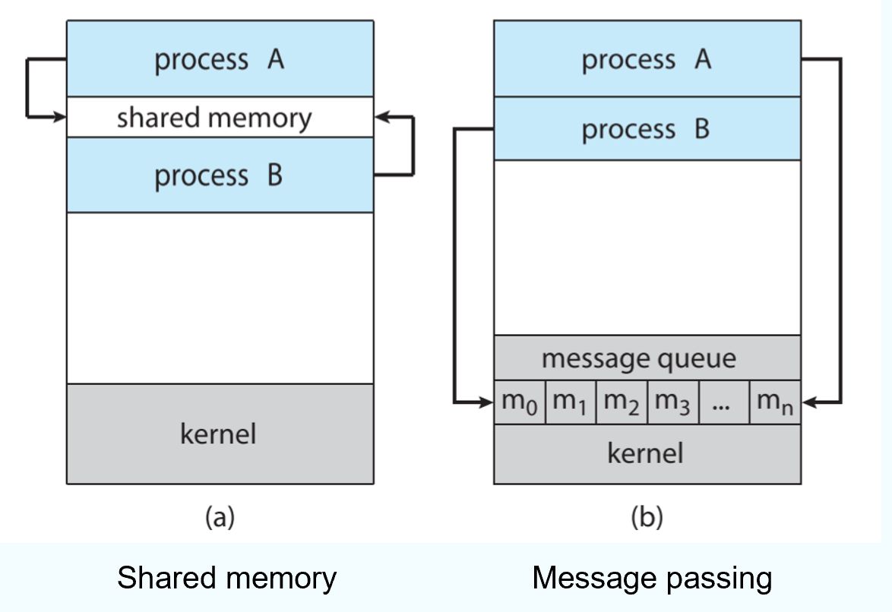

`Shared memory` ：进程 A、B 都映射到同一块用户态“共享内存”区域，数据直接读写，内核只负责建立映射。共享内存零拷贝、延迟低，但需要程序自行同步（互斥、信号量等）。

在通信的进程之间存在一块可直接访问的共享空间，通过对这片共享空间进行读/写操作实现进程之间的信息交换。在对共享空间进行读/写操作时，需要使用同步互斥工具对共享空间的读/写进行控制。

共享存储又分为两种：低级方式的共享是基于数据结构的共享；高级方式的共享则是基于存储区的共享。操作系统只负责为通信进程提供可共享使用的存储空间和同步互斥工具，而数据交换则由用户自己安排读/写指令完成。

注意，进程空间一般都是**独立**的，进程运行期间一般不能访问其他进程的空间，想让两个进程共享空间，必须通过**特殊的系统调用**实现，而进程内的线程是自然共享进程空间的。

`Message passing` ：内核维护消息队列（message queue）；进程通过 send/receive 将消息拷贝到内核队列或从队列取出。消息传递保留消息边界并由内核处理阻塞/缓冲，易于使用但有拷贝与内核开销。

在消息传递系统中，进程间的数据交换以**格式化的消息**(Message)为单位。进程通过操作系统提供的**发送消息**和**接收消息**两个原语进行数据交换。这种方式隐藏了通信实现细节，使通信过程对用户透明，简化了通信程序的设计，是当前应用最广泛的进程间通信机制。

---

#### Direct Communication of Messages Passing

Processes must name each other explicitly:

进程之间要**明确指定对方的名字**（即进程ID或标识）。

- **send** (P, message) – send a message to process P
- **receive** (Q, message) – receive a message from process Q

Properties of communication link

- Links are established **automatically** 只要两个进程需要通信，系统会自动建立链路。
- A link is associated with **exactly one pair** of communicating processes 每条链路只关联一对进程。
- Between each pair there exists **exactly one link** 每对进程之间只有一条链路。
- The link may be unidirectional, but is usually bi-directional 链路可以是单向（只能一方发消息）或双向（双方都能发消息），但通常是双向。

**直接通信方式**。发送进程直接将消息发送给接收进程，并将它挂在接收进程的消息缓冲队列上，接收进程从消息缓冲队列中取得消息。

---

#### Indirect Communication of Messages Passing

Messages are directed and received from **mailboxes** (also referred to as **ports**)

进程之间通过**邮箱（mailbox）**或**端口（port）**进行通信。

**间接通信方式**。发送进程将消息发送到某个中间实体，接收进程从中间实体取得消息。这种中间实体一般称为**信箱**。

- Each mailbox has a unique id 邮箱是一个具有唯一ID的内核对象。进程可以向邮箱发送消息，也可以从邮箱接收消息。
- Processes can communicate only if they share a mailbox 进程之间不需要直接知道对方，只要共享同一个邮箱即可通信。

Properties of communication link

- Link established only if processes share a common mailbox 只有共享同一个邮箱的进程之间才能通信。
- A link may be associated with **many processes** 一个邮箱可以被多个进程共享，实现多对多通信。
- Each pair of processes may share **several communication links** 每对进程可以共享多个邮箱，实现多条通信链路。
- Link may be unidirectional or bi-directional 邮箱可以设计为单向或双向通信。

Operations

- create a new mailbox 操作系统提供接口，允许进程创建一个具有唯一ID的邮箱（或端口）。
- send and receive messages through mailbox 发送消息、接收消息
- destroy a mailbox 销毁邮箱

Primitives are defined as:

- **send**(A, message) – send a message to mailbox A
- **receive**(A, message) – receive a message from mailbox A

Mailbox sharing

- $P_1$ , $P_2$ , and $P_3$ share mailbox A
- $P_1$ sends; $P_2$ and $P_3$ receive
- Who gets the message?

Solutions

- Allow a link to be associated with at most two processes 限制邮箱只关联两个进程
- Allow only one process at a time to execute a receive operation 系统保证同一时刻只有一个进程能从邮箱接收消息，其他进程必须等待。
- Allow the system to select arbitrarily the receiver.  Sender is notified who the receiver was. 系统自动选择接收者

---

### Synchronization

Message passing may be either blocking or non-blocking

**Blocking** is considered **synchronous** 同步

- **Blocking send** has the sender blocked until the message is received
- 发送方在消息被接收之前会一直等待，直到接收方收到消息后才继续执行。
- **Blocking receive** has the receiver block until a message is available
- 接收方如果没有消息可收，会一直等待，直到有消息到达才继续执行。

**Non-blocking** is considered asynchronous

- **Non-blocking** send has the sender send the message and continue
- 发送方把消息发出去后立即返回，不管接收方是否收到消息。
- **Non-blocking** receive has the receiver receive a valid message or null
- 接收方尝试接收消息，如果没有消息就返回空值或错误，不会阻塞等待。

---

### Buffering

Queue of messages attached to the link; implemented in one of three ways

消息传递时，系统会为每条通信链路维护一个消息队列（缓冲区），用于存放尚未被接收的消息。

1. Zero capacity – 0 messages 零容量

Sender must wait for receiver

缓冲区不能存放任何消息（容量为0）。发送方必须等接收方准备好接收，才能发送消息。发送和接收必须严格配对，双方都要同步。

2. Bounded capacity – finite length of n messages 有限容量

Sender must wait if link full

缓冲区可以存放有限数量的消息（如 n 条）。如果缓冲区满了，发送方必须等待（阻塞），直到有空间才能继续发送。如果缓冲区有空间，发送方可以直接发送消息，接收方可以随时接收。

3. Unbounded capacity – infinite length 无限容量

Sender never waits

Control of Buffering

缓冲区理论上可以存放无限多条消息。发送方永远不会因为缓冲区满而阻塞，可以一直发送消息。

---

???+ example "question"
    下列关于信号的处理的描述中，错误的是()。
    
    A.当进程从内核态转为用户态时，会检查是否有待处理的信号
    
    B.当进程从用户态转为内核态时，也会检查是否有待处理的信号
    
    C.操作系统对某些信号的处理是可以忽略的
    
    D.操作系统允许进程通过系统调用，自定义某些信号的处理程序

??? note "answer"
    B

    信号的处理时机只会在进程从内核态转为用户态时。当进程从用户态转为内核态时，不会检查是否有待处理的信号，选项B错误。操作系统对某些信号的默认处理可能就是忽略。

---