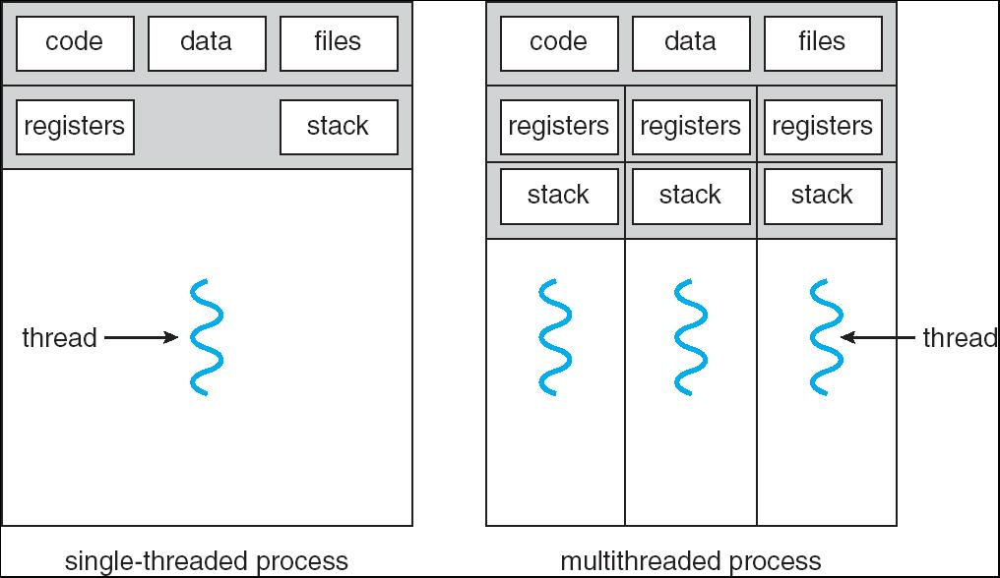
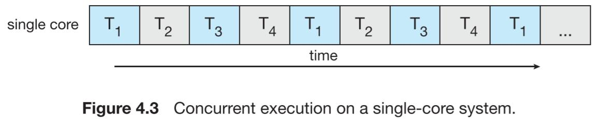
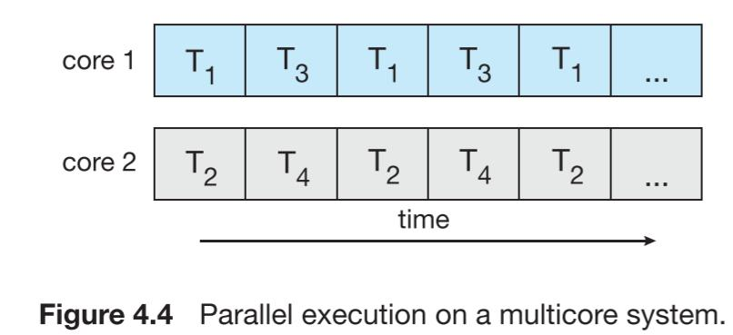
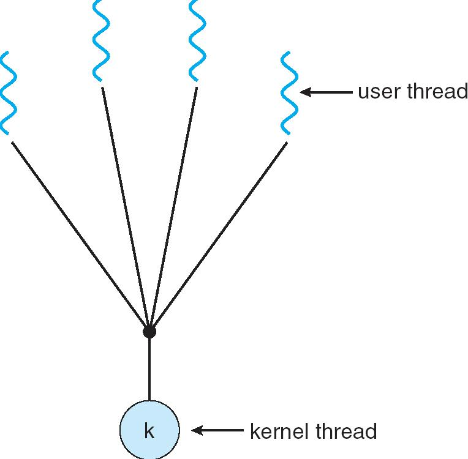
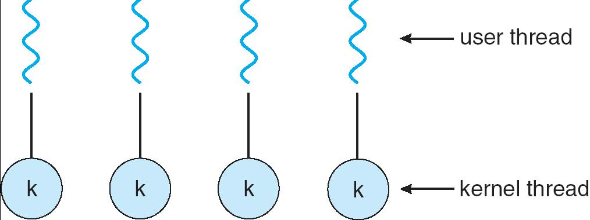
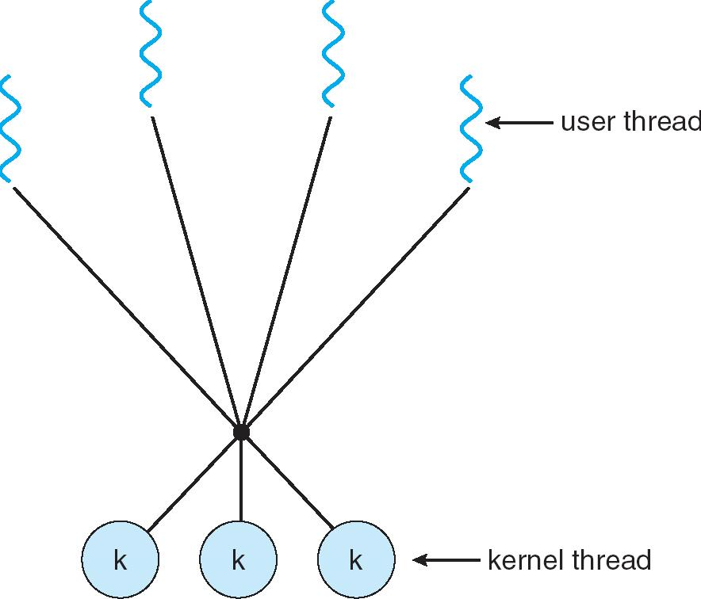
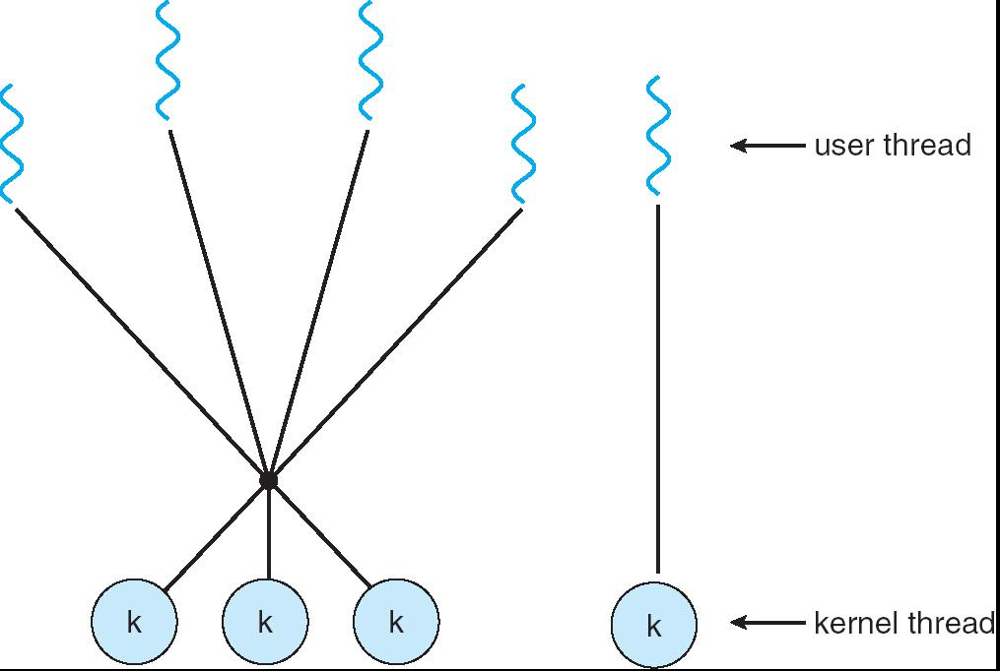
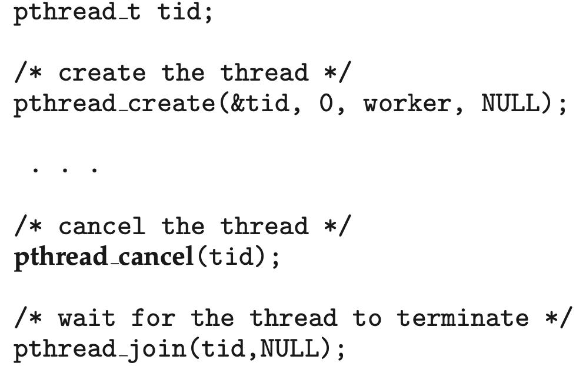

# Chapter 4 | Threads

## Overview

Suppose you are developing a Web browser

```
main(){
    while(1){
        RetrieveData(); // Block for 1 second
        DisplayData(); // Block for 1 second
        GetInputEvents(); // Block for 1 second
    }
}
```

Now what if you want the program to be more responsive?

```
main(){
    while(1){
        RetrieveALittleData(); // Block for 0.1 second
        DisplayALittleData(); // Block for 0.1 second
        GetAFewInputEvents(); // Block for 0.1 second
    }
}
```

What if you want it to be even more responsive?

```
main(){
    while(1){
        if(CheckData()==True){
            RetrieveALittleData(); // 0.1 second
            DisplayALittleData(); // 0.1 second
        }
        if(CheckInputEvents()==True){
            GetAFewInputEvents(); // 0.1 second
        }
    }
}
```

**Problem**: A lot checks, not efficient. But still not responsive!

To make it responsive enough, we need to

- Break the operations into very very small pieces;
- However, to be efficient enough, we want to execute code in **large pieces**.
- More precisely, we want to **SCHEDULE** these operations in our own program code.
- Leave the tedious work to the OS which schedules them in Threads!

---

### Multi-thread version of the program

```
main(){
CreateThread (RetrieveData());
CreateThread (DisplayData());
CreateThread (GetInputEvents());
WaitForThreads();
}
// Each thread routine enters a loop.

void RetrieveData(){
    while(1){
        retrieveData();
        …
    }
}

void DisplayData(){
    while(1){
        displayData();
        …
    }
}
```

- 从手动调用变成了由 OS 自动调度。

---

### Single and Multithreaded Processes



对于单线程进程

- 只有一个线程在运行。
- 进程拥有自己的代码段、数据段、文件描述符、寄存器和栈。
- 线程是进程中的执行流，只有一个线程时，所有任务都必须顺序执行。

对于多线程进程

- 一个进程中有多个线程，每个线程可以并发执行不同任务。
- 代码段、数据段、文件描述符是所有线程共享的（属于**进程级资源**）。
- 每个线程有自己独立的寄存器和栈（属于**线程级资源**）。
- 多线程可以让程序同时处理多个任务，提高响应速度和资源利用率。
- 每个线程都有自己的 thread ID。

---

### Benefits

**Responsiveness** : interactive applications.

多线程可以让交互式应用程序更加灵敏。例如，浏览器可以一边下载数据，一边响应用户输入，不会因为某个操作阻塞而让整个程序卡住。

**Resource Sharing** : memory for code and data can be shared.

线程之间可以共享进程的内存空间，包括代码和数据。这使得线程之间通信和数据交换更加高效，无需像进程那样进行复杂的跨进程通信。

**Economy** : creating processes are more expensive.

创建新线程比创建新进程要轻量得多，系统开销更小。因为线程共享进程资源，不需要为每个线程分配完整的进程环境。

**Utilization of MP Architectures** : multi-threading increases concurrency.

多线程可以充分利用多核或多处理器系统，实现真正的并发执行，提高程序的运行效率和吞吐量。

---

### Concurrency vs. Parallelism

前者是并发，后者是并行。



- 只有一个核心（single core），但有多个任务（T1、T2、T3、T4）。
- 这些任务在时间上交替执行，实际上，任何时刻只有一个任务在真正运行，但由于切换速度很快，用户感觉多个任务“同时”进行。这种方式叫做**并发**，本质是“轮流”执行。



- 有两个核心（core 1 和 core 2），每个核心可以同时运行一个任务。比如 core 1 在运行 T1 的同时，core 2 可以运行 T2。
- 这样，多个任务真正意义上“同时”被执行。这就是**并行**，本质是“真正同时”执行。

---

### User Threads

Thread management done by user-level threads library

线程的管理完全**由用户空间的线程库负责**，操作系统内核并不知道这些线程的存在。用户级线程的创建、切换和同步都由线程库实现，速度快，开销小。

**缺点**：如果一个用户线程阻塞（如等待I/O），整个进程都会阻塞，因为内核只看到一个进程。

Three primary thread libraries:

- POSIX Pthreads (can also be provided as system library)
- Win32 threads
- Java threads

---

### Kernel Threads

Supported by the Kernel

线程由**操作系统内核**直接支持和管理，内核可以感知和调度每个线程。内核级线程可以**充分利用多核**CPU，线程阻塞时不会影响同进程的其他线程。

**缺点**：线程操作需要系统调用，**开销**比用户级线程**大**。

Almost all contemporary OS implements kernel threads. Examples

- Windows XP/2000
- Solaris
- Linux
- MacOS

---

## Multithreading Models

**Many-to-One** : thread management is efficient, but will block if making system call, kernel can schedule only one thread at a time

**One-to-One** : more concurrency, but creating thread is expensive

**Many-to-Many** : flexible

---

### Many-to-One

Many user-level threads mapped to single kernel thread

多个用户级线程映射到一个内核线程。

The scheduling is done completely by the thread library and the kernel itself is not aware of the multiple threads in user-space.

线程的调度完全由用户空间的线程库负责，操作系统内核只看到一个线程，不知道用户空间有多个线程。

Examples:

- Solaris Green Threads
- GNU Portable Threads

---

#### Many-to-One Model



适合在老系统上运行的应用程序。

**优点**：

- **高效性**：线程的创建、切换和同步等操作都在用户空间完成，不需要经过系统调用（System Call）陷入内核，因此速度非常快，开销很小。
- **灵活性**：应用程序可以根据自己的需求实现特定的线程调度算法。

**缺点**：如果一个用户线程发生阻塞（比如等待I/O），整个进程都会阻塞，因为内核只调度一个线程，**无法利用多核CPU实现真正的并行**。

---

### One-to-One

Each user-level thread maps to kernel thread

每个用户级线程都映射到一个内核线程。

内核可以独立调度每个线程，线程阻塞不会影响其他线程，可以充分利用多核CPU，**实现真正的并行**。

Examples:

- Windows NT/XP/2000
- Linux
- Solaris 9 and later

---

#### One-to-one Model



现在的大多数操作系统都采用一对一模型。

**优点**：并发能力强，线程阻塞时其他线程可以继续运行。

**缺点**：创建线程需要系统调用，开销较大，线程数量受内核限制。

---

### Many-to-Many Model

Allows many user level threads to be mapped to many kernel threads

多个用户级线程可以映射到多个内核线程。

Allows the operating system to create a sufficient number of kernel threads

用户线程库和内核都参与调度，既能高效管理线程，又能充分利用多核资源。

将 m 个用户级线程多路复用（multiplex）到 n 个内核级线程上，其中通常 m≥n。这是一种对前两种模型的折衷方案。

```
[ T1, T2, T3, T4, T5 ]  (用户空间)
    \   |   /
        \  |  /
        v v v
    [ K1, K2, K3 ]        (内核空间)
```

A program can have as many threads as are appropriate without making the process too heavy or burdensome. In this model, a user-level threads library provides sophisticated scheduling of user-level threads above kernel threads.

- Solaris prior to version 9
- Windows NT/2000 with the ThreadFiber package
- Go routines

---

#### Many-to-Many Model



**优点**：灵活，既能高效管理大量线程，又能避免进程过于“臃肿”，可根据需要创建足够多的内核线程。

- 它避免了多对一模型的阻塞问题，因为当一个用户线程阻塞时，内核可以调度另一个可运行的用户线程到同一个或其他内核线程上执行。
- 它克服了一对一模型的开销和数量限制问题，因为应用程序可以创建大量的用户线程，而内核线程的数量可以相对较少（通常与CPU核心数相关），从而降低了系统开销。

**缺点**：实现复杂。该模型的设计和实现非常复杂。需要在用户空间和内核空间之间进行复杂的协调和调度，增加了系统的复杂度和出错的可能性。

---

### Two-Level Model

Similar to M:M, except that it allows a user thread to be **bound** to a kernel thread

二级模型是多对多模型的一种混合式变体或扩展。它试图将多对多模型和一对一模型的优点结合起来，以提供更大的灵活性。

二级模型的核心在于它同时支持两种映射方式：

- **多路复用** (Multiplexing)：像标准的多对多模型一样，允许将多个用户线程映射到一个内核线程池上。
- **绑定** (Binding)：允许将一个特定的用户线程**永久绑定（Bound）**到一个专用的内核线程上，形成一对一的关系。

因此，在一个采用二级模型的系统中，会同时存在“未绑定的”用户线程（遵循多对多模式）和“绑定的”用户线程（遵循一对一模式）。

```
        (未绑定的用户线程)          (绑定的用户线程)
[ T1, T2, T3, T4 ]                  [ T5 ]       (用户空间)
        \   |   /                         |
        \  |  /                          |
        v v v                           v
    [ K1,     K2 ]                    [ K3 ]       (内核空间)
    (内核线程池)                    (专用内核线程)
```

Examples:

- IRIX
- HP-UX
- Tru64 UNIX
- Solaris 8 and earlier

---

#### Two-level Model



**优点**：

- **高并发与低开销**：对于大量的一般性计算或I/O任务，**应用程序**可以创建成百上千个轻量级的（未绑定的）用户线程。这些线程的管理开销小，切换速度快，可以有效地处理高并发场景。
- **实时性与高优先级保障**：对于那些至关重要的、需要立即响应或具有实时性要求的任务，可以将其“绑定”。绑定后，该线程就拥有了一个**专属的内核线程**，它的调度不再受用户空间调度器的影响，可以直接由内核进行抢占式调度，确保了响应的及时性和执行的优先权。即使其他未绑定的用户线程发生了阻塞，也完全不会影响到这个绑定的线程。
- **灵活性极高**：程序员或应用程序可以根据任务的不同性质，动态决定一个线程是采用绑定模式还是非绑定模式，从而实现对系统资源和性能的精细化控制。

**缺点**：

极高的实现复杂度：这是它最终被主流操作系统放弃的根本原因。一个系统要同时管理两种截然不同的线程映射关系，意味着：

- 需要维护和协调用户空间调度器与内核空间调度器。
- 内核需要知道哪些内核线程是专用的（被绑定的），哪些是共享的（在池中的）。
- 整个系统的设计、实现、调试和维护成本都非常高。这种复杂性带来的潜在问题往往超过了其带来的好处。

---

## Threading Issues

### Semantics of `fork()` and `exec()`

Does `fork()` duplicate only the calling thread or all threads?

- Some Unix systems have two versions of `fork()`, one that duplicates all threads and another that duplicates the thread that invokes `fork()`. It’s not trivial though. 提供两种版本，只复制调用 `fork()` 的线程，或者复制所有线程。
- `Exec()` will replace the entire process. 在当前进程中加载并运行一个新的程序，会替换整个进程（包括所有线程），只留下新程序的主线程。

---

### Signal Handling

Signals are used in UNIX systems to notify a process that a particular event has occurred

信号是 UNIX 系统用来通知进程发生某些事件的机制，比如定时器到期、外部中断等。

A **signal handler** is used to process signals, either synchronous or asynchronous:

1. Signal is generated by particular event 某事件触发信号产生
2. Signal is delivered to a process 信号被送达进程
3. Signal must be handled 进程必须处理该信号

Options: (method of delivery depends on the type of signal)

多线程进程中，信号的分发方式有多种选择：

- Deliver the signal to the thread to which the signal applies 只发送给相关的线程
- Deliver the signal to every thread in the process 发送给进程中的所有线程
- Deliver the signal to certain threads in the process 发送给部分特定线程
- Assign a specific thread to receive all signals for the process 指定某个线程专门接收所有信号

---

### Thread Cancellation

Terminating a thread before it has finished

指提前终止一个线程的执行。

Two general approaches:

- **Asynchronous cancellation** terminates the target thread immediately
- **异步取消**：目标线程会被立即终止
- **Deferred cancellation** allows the target thread to periodically check via a flag if it should be cancelled
- **延迟取消**：目标线程定期检查一个标志位，只有检测到需要取消时才安全地退出



---

### Thread Pools

Create a number of threads in a pool where they await work

线程池是预先创建好一组线程，等待任务到来时分配给空闲线程处理。

Advantages:

- Usually slightly **faster** to service a request with an existing thread than create a new thread
- 用已有线程处理请求比临时创建新线程更快。
- Allows the number of threads in the application(s) to be bound to the size of the pool
- 可以限制应用程序中的线程数量，避免资源耗尽。

---

### Thread Specific Data

- Thread-Local Storage 又叫线程局部存储
- Allows each thread to have its own copy of data, in some ways similar to static data, but are unique to each thread 允许每个线程拥有自己独立的数据副本，类似静态变量，但每个线程独立。
- Useful when you do not have control over the thread creation process(i.e., when using a thread pool) 当你无法控制线程创建（如使用线程池）时非常有用。

---

### Scheduler Activations

Both M:M and Two-level models require communication to maintain the appropriate number of kernel threads allocated to the application

多对多和二级模型需要用户线程库和内核之间的通信，以维持合适数量的内核线程。

LWP is a **virtual processor** attached to kernel thread

LWP（轻量级进程）是与内核线程绑定的虚拟处理器。用户线程通过LWP与内核线程关联，实现用户线程的并发执行。

Scheduler activations provide **upcalls** - a communication mechanism from the kernel to the thread library

调度激活机制通过上调（upcall），让内核通知线程库，比如某个线程即将阻塞时，线程库可以及时调整分配的内核线程数量，比如创建新的内核线程，保证其他用户线程能继续运行，不受阻塞线程影响。

Upcalls are handled by the thread library with an **upcall handler**

上调由线程库中的 `upcall handler` 处理。

This communication allows an application to **maintain the correct number** of kernel threads

线程库根据内核的通知，动态管理用户线程和内核线程的映射关系，维持合适数量的内核线程，提高并发和资源利用率。

- when an application thread is about to block, an upcall is triggered.

---