# Chapter 5 | CPU Scheduling

## Basic concepts

Maximum CPU utilization obtained with multiprogramming

CPU–I/O Burst Cycle – Process execution consists of a cycle of CPU execution and I/O wait

每个进程在运行时，会经历CPU突发和I/O突发的循环。

CPU burst distribution

不同进程的CPU突发时间长短不同，有的进程计算密集（CPU burst长），有的进程I/O密集（CPU burst短）。

---

### Alternating Sequence of CPU And I/O Bursts

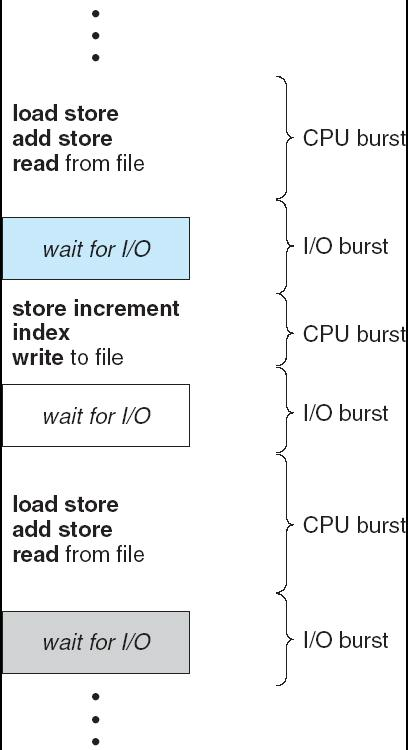

A burst is an instance of breaking

---

### Histogram of CPU-burst Times

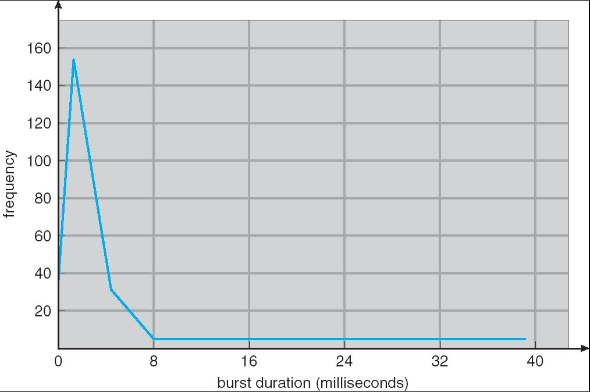

- 绝大多数进程是I/O密集型，CPU突发时间短，频繁等待I/O。

---

### CPU Scheduler

Selects from among the processes in memory that are ready to execute, and allocates the CPU to one of them

CPU调度器负责从内存中所有就绪状态的进程中选择一个，分配CPU资源给它执行。

CPU scheduling decisions may take place when a process:

1. When a process switches from the running state to the waiting state (e.g. I/O request or an invocation of wait()) 进程从运行状态切换到等待状态
2. When a process switches from the running state to the ready state (e.g., when an interrupt occurs) 例如：发生中断（如时钟中断），当前进程被强制暂停，进入就绪队列，等待再次被调度。
3. When a process switches from the waiting state to the ready state (e.g., at completion of I/O) 例如：I/O操作完成，进程变为就绪状态，可以再次参与调度。
4. When a process terminates 当前进程执行完毕，释放CPU，调度器需要选择下一个进程运行。

Scheduling under 1 and 4 is **nonpreemptive**

调度器只在进程主动让出CPU或终止时才进行调度。此时，当前进程不会被强制中断，调度器等待进程自愿释放CPU。

换句话说，时间片结束不会中断。完成 I/O 之后也不会被调度。

All other scheduling is **preemptive**

调度器可以随时中断当前进程，将CPU分配给其他进程。这样可以提高系统响应速度和公平性。

---

### Dispatcher

Dispatcher module gives control of the CPU to the process selected by the short-term scheduler; this involves:

分派器是操作系统中负责把 CPU 控制权交给由短期调度器（CPU Scheduler）选中的进程的模块。

- switching context 保存当前进程的运行状态到该进程的 PCB 中。
- switching to user mode 从内核模式切换到用户模式，准备运行用户进程代码。
- jumping to the proper location in the user program to restart that program 跳转到用户程序的正确位置，恢复新进程的运行状态，从它上次停止的位置继续执行。

**Dispatch latency** – time it takes for the dispatcher to stop one process and start another running

分派延迟是指分派器从停止一个进程到启动另一个进程所需的时间。

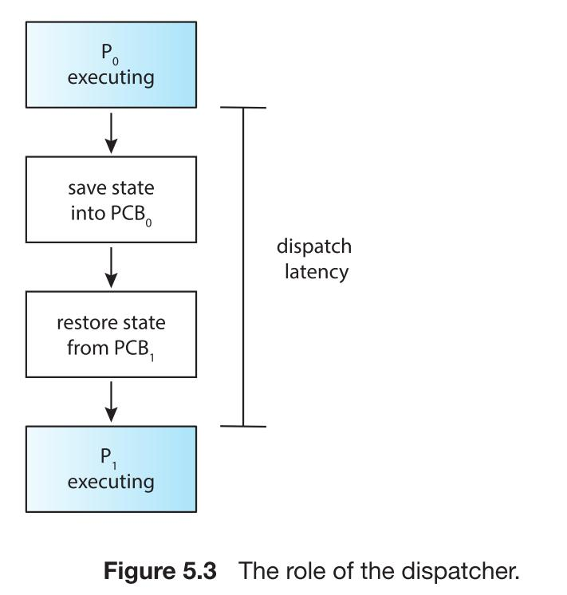

1. 进程 $P_0$ 正在执行。
2. 分派器将 $P_0$ 的状态保存到 $PCB_0$ 中。
3. 分派器从 $PCB_1$ 恢复进程 $P_1$ 的状态。
4. 进程 $P_1$ 开始执行。

---

## Scheduling Criteria

- **CPU utilization** (CPU利用率) – keep the CPU as busy as possible
- **Throughput** (吞吐率)– # of processes that complete their execution per time unit 单位时间内完成的进程数量。
- **Turnaround time** (周转时间)– amount of time to execute a particular process 一个进程从提交到完成所经历的总时间，包括等待、执行和I/O等所有时间。周转时间越短，用户体验越好。
- **Waiting time** (等待时间)– amount of time a process has been waiting in the **ready queue** 进程在就绪队列中等待CPU的总时间。等待时间越短，说明调度算法公平且高效。
- **Response time** (响应时间)– amount of time it takes from when a request was submitted until the first response is produced, not output (for time-sharing environment) 从用户提交请求到系统产生第一个响应所需的时间（主要用于分时系统）。响应时间越短，系统交互性越好。

---

### Optimization Criteria

- Max CPU utilization
- Max throughput
- Min turnaround time
- Min waiting time
- Min response time

---

## Schedule Algorithm

### First-Come, First-Served (FCFS) Scheduling

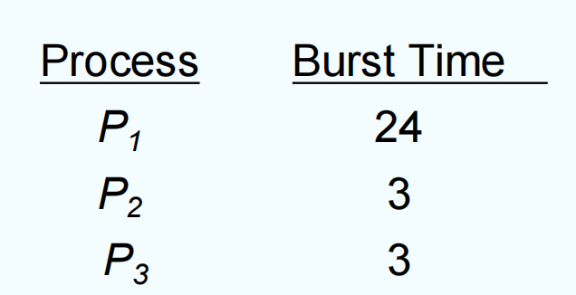

1. Suppose that the processes arrive in the order: P1, P2, P3

The **Gantt Chart** for the schedule is:

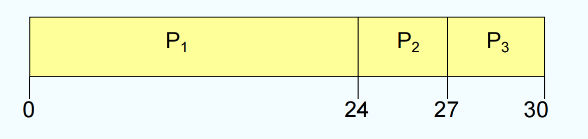

**Waiting time** for P1 = 0; P2 = 24; P3 = 27

**Average waiting time**: (0 + 24 + 27)/3 = 17

**Throughput** = 3 processes / 30 time units = 0.1 processes per time unit

**Average turnaround time** = (24 + 27 + 30)/3 = 27 time units

2. Suppose that the processes arrive in the order: P2, P3, P1

The Gantt chart for the schedule is:

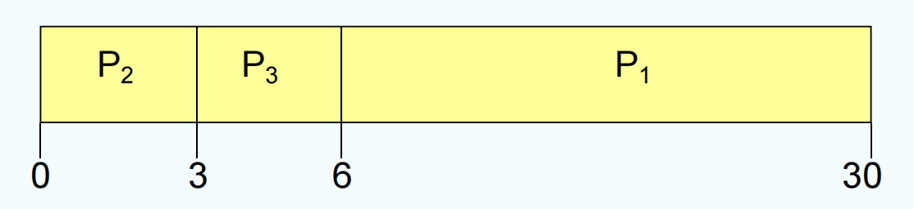

Waiting time for P1 = 6; P2 = 0; P3 = 3

Average waiting time: (6 + 0 + 3)/3 = 3

Much better than previous case

Convoy effect short process behind long process (I/O-bound processes wait for the CPU-bound one)

短进程（通常是I/O密集型进程）被长进程（通常是CPU密集型进程）“拖慢”的现象。

??? note "FCFS 有利于 CPU 繁忙型作业，而不利于 I/0 繁忙型作业"
    1. 排队顺序固定，无法区分作业类型
    
    - FCFS按到达顺序排队，先到的先执行，不考虑作业的长短或类型。

    - 如果队列前面是长作业或CPU繁忙型作业，后面的短作业和I/O繁忙型作业只能一直等待。

    2. 长作业占用CPU时间长

    - 长作业（CPU繁忙型）一旦获得CPU，会长时间占用，后面的短作业无法插队，只能等它执行完。

    - 这对长作业有利，因为它们不会被中断，可以一次性完成。

    3. 短作业和I/O繁忙型作业易被“拖慢”

    - 短作业和I/O繁忙型作业本可以很快完成，但被长作业“堵住”，等待时间变长，效率低。

    - I/O繁忙型作业通常只需要短暂的CPU时间，更多时间在等待I/O，如果不能及时获得CPU，会导致I/O设备空闲，资源利用率低。

    4. 容易出现“Convoy effect”（车队效应）

    - 一个长作业在前面，后面所有短作业和I/O作业都被拖慢，系统整体响应变差。

---

### Shortest-Job-First (SJF) Scheduling

Associate with each process the length of its next CPU burst. Use these lengths to schedule the process with the shortest time.

Two schemes:

- **nonpreemptive** – once CPU given to the process it cannot be preempted until completes its CPU burst
- 一旦某个进程获得CPU，必须等它完成本次CPU突发后，才会调度下一个进程。即使有更短的进程到达，也不会中断当前进程。
- **preemptive** – if a new process arrives with CPU burst length less than remaining time of current executing process, preempt. This scheme is known as the Shortest-Remaining-Time-First (SRTF)
- 如果有新进程到达，其CPU突发时间比当前正在运行的进程剩余时间还短，则立即中断当前进程，优先执行新进程。这种方式也叫“最短剩余时间优先”（SRTF）。

SJF is optimal – gives minimum average waiting time for a given set of processes

最优平均等待时间：SJF能使所有进程的平均等待时间达到最小。因为短进程先执行，不会被长进程拖慢。但是可能导致饥饿（Starvation）：长进程如果一直有短进程插队，可能长期得不到执行机会。

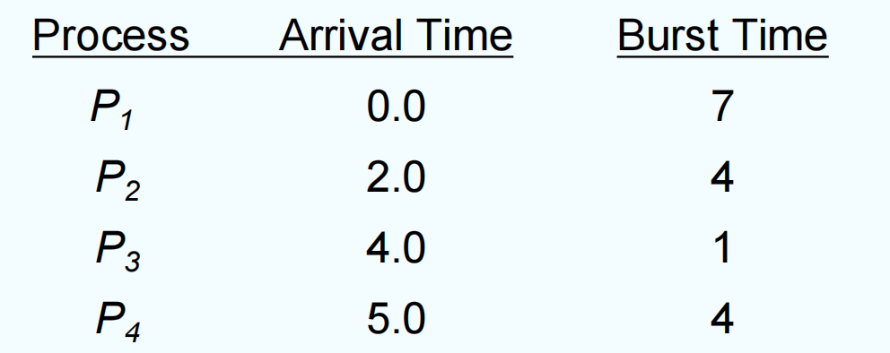

SJF (non-preemptive)

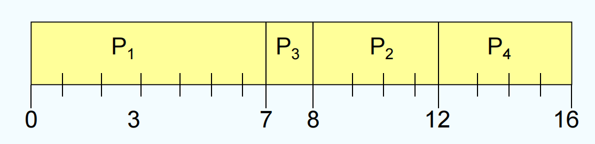

**Average waiting time** = (0 + 6 + 3 + 7)/4 = 4

SJF (preemptive)

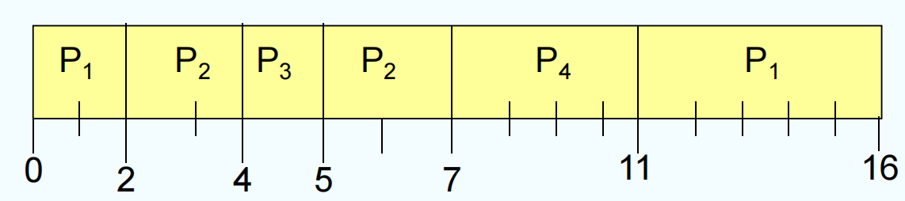

**Average waiting time** = (9 + 1 + 0 +2)/4 = 3

!!! note
    可以证明短作业(SJF)调度算法的平均等待时间、平均周转时间是最优的。

---

#### Determining Length of Next CPU Burst

Unfortunately, no way to know the length of the next burst. But can only estimate the length. Can be done by using the length of previous CPU bursts, using exponential averaging.

1. $t_n$ = actual length of the $n^{th}$ CPU burst
2. $\tau_{n+1}$ = predicted value for the next CPU burst
3. $\alpha$ = weighting factor (0 < $\alpha$ < 1)

The formula for exponential averaging is:

$\tau_{n+1} = \alpha t_n + (1 - \alpha) \tau_n$

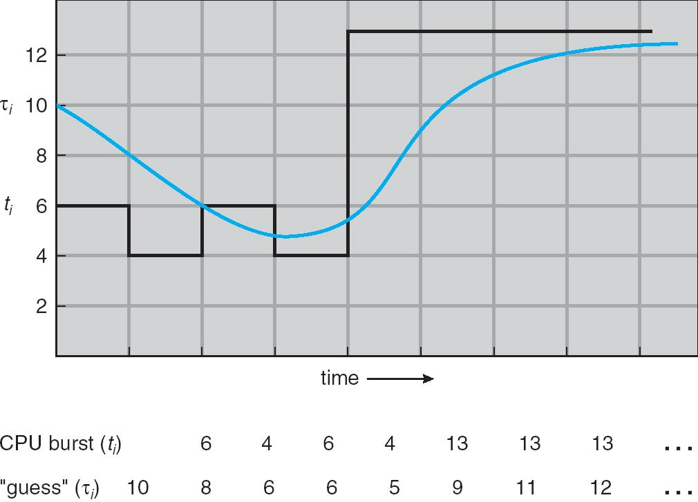

- $\alpha = 0$ : $\tau_{n+1} = \tau_n$

Recent history does not count

- $\alpha = 1$ : $\tau_{n+1} = t_n$

Only the actual last CPU burst counts

If we expand the formula, we get:

$$\tau_{n+1} = \alpha t_n + (1 - \alpha) \alpha t_{n-1} + (1 - \alpha)^2 \alpha t_{n-2} + ... + (1 - \alpha)^j \tau_{n-j} + (1 - \alpha)^{n+1} \tau_0$$

Since both $\alpha$ and (1 - $\alpha$) are less than or equal to 1, each successive term has less weight than its predecessor.

在指数平均法公式中，$\alpha$ 和 $1-\alpha$ 都小于等于1，所以每一项的权重（系数）都会比前一项更小。

---

### Priority Scheduling

A priority number (integer) is associated with each process

优先级调度是一种根据进程优先级分配CPU的调度算法。每个进程都被分配一个整数优先级，数值越小优先级越高。调度器总是选择优先级最高（数值最小）的进程运行。

The CPU is allocated to the process with the highest priority (smallest integer = highest priority)

- Preemptive
- 如果有新进程到达且优先级高于当前正在运行的进程，则立即中断当前进程，分配CPU给新进程。
- nonpreemptive
- 只有当前进程主动释放CPU（如完成或等待I/O）时，调度器才会选择优先级最高的下一个进程。

**SJF** is a priority scheduling where priority is the predicted next CPU burst time

SJF（最短作业优先）其实就是一种特殊的优先级调度，优先级由预测的下一个CPU突发时间决定，时间越短优先级越高。

Problem = **Starvation** – low priority processes may never execute

如果总有高优先级进程到达，低优先级进程可能长期得不到CPU，甚至永远无法执行，这就是饥饿现象。

Solution = **Aging** – as time progresses increase the priority of the process

为防止饥饿，系统可以采用“优先级老化”机制：随着等待时间增加，**进程的优先级逐渐提升**，最终可以获得CPU执行机会。

??? note "进程优先级的设置可以参照以下原则"
    1. 系统进程>用户进程。系统进程作为系统的管理者，理应拥有更高的优先级。

    2. 交互型进程>非交互型进程(或前台进程>后台进程)。大家平时在使用手机时，在前台运行的正在和你交互的进程应该更快速地响应你，因此自然需要被优先处理。
    
    3. I/O型进程>计算型进程。所谓I/O型进程，是指那些会频繁使用I/O设备的进程，而计算型进程是那些频繁使用CPU的进程(很少使用I/O设备)。我们知道，I/O设备(如打印机)的处理速度要比CPU慢得多，因此若将I/O型进程的优先级设置得更高，就更有可能让I/O设备尽早开始工作，进而提升系统的整体效率。

---

### Round Robin (RR) 时间片轮转算法

Each process gets a small unit of CPU time (time quantum), usually 10-100 milliseconds. After this time has elapsed, the process is preempted and added to the end of the ready queue.

每个进程被分配一个固定长度的CPU时间片（通常为10-100毫秒）。当进程用完自己的时间片后，如果还没完成，就会被操作系统强制暂停（抢占），并被放到就绪队列的末尾，等待下一轮调度。所有进程轮流获得CPU，每次最多运行一个时间片，保证了系统的响应速度和进程的公平性。

If there are n processes in the ready queue and the time quantum is q, then each process gets 1/n of the CPU time in chunks of at most q time units at once. No process waits more than (n-1)q time units.

如果就绪队列中有 $n$ 个进程，时间片长度为 $q$，那么每个进程最多等待 $(n-1)q$ 时间就能再次获得CPU。

Performance

- q large → FIFO (FIFO is RR with q = ∞ 如果 q 很大，轮转调度就变成了先来先服务（FIFO），进程响应变慢。)
- q small → q must be large with respect to context switch time, otherwise overhead is too high 如果 q 很小，进程切换（上下文切换）频繁，系统开销变大，效率降低。**时间片长度要远大于上下文切换时间**，否则调度开销太高。

RR 非常适合**分时系统**和**多用户环境**，能保证每个进程都能及时响应，不会出现某个进程长期占用CPU的情况。但是由于经常需要切换进程，可能导致**系统开销增加**，效率降低，**一般不会说为了让系统更高效**。

!!! info
    To implement RR scheduling, we again treat the ready queue as a FIFO queue of processes. New processes are added to the tail of the ready queue. The CPU scheduler picks the first process from the ready queue, sets a timer to interrupt after 1 time quantum, and dispatches the process.

    One of two things will then happen. The process may have a CPU burst of less than 1 time quantum. In this case, the process itself will release the CPU voluntarily. The scheduler will then proceed to the next process in the ready queue. If the CPU burst of the currently running process is longer than 1 time quantum, the timer will go off and will cause an interrupt to the operating system. A context switch will be executed, and the process will be put at the tail of the ready queue. The CPU scheduler will then select the next processin the ready queue.

    这里最需要注意的一点就是，当前一个进程 $P_1$ 时间片恰好用完，但是进程 $P_1$ 还没有完成，此时下一个进程 $P_2$ 到达时，调度器会把 $P_1$ 放到就绪队列尾部，也就是说会先调度 $P_2$，然后再调度 $P_1$。优先调度新到达的进程。

---

### Multilevel Queue

多级队列调度是一种将就绪队列分成多个子队列的调度方法。

Ready queue is partitioned into separate queues:

- foreground (interactive)
- 前台队列（foreground）：交互型进程（如终端、GUI应用），需要快速响应。
- background (batch)
- 后台队列（background）：批处理进程（如数据分析、后台任务），对响应速度要求不高。

Each queue has its own scheduling algorithm, for example

- foreground – RR
- background – FCFS

Scheduling must be done between the queues

- Fixed priority scheduling; (i.e., serve all from foreground then from background). Possibility of starvation. 固定优先级调度：总是优先调度前台队列，只有当前台队列为空时才调度后台队列。这种方式可能导致后台队列长期得不到执行机会，出现饥饿现象。
- Time slice – each queue gets a certain amount of CPU time which it can schedule amongst its processes; i.e., 80% to foreground in RR, 20% to background in FCFS. 给每个队列分配固定比例的CPU时间，这样可以保证所有队列都有机会运行，避免饥饿。

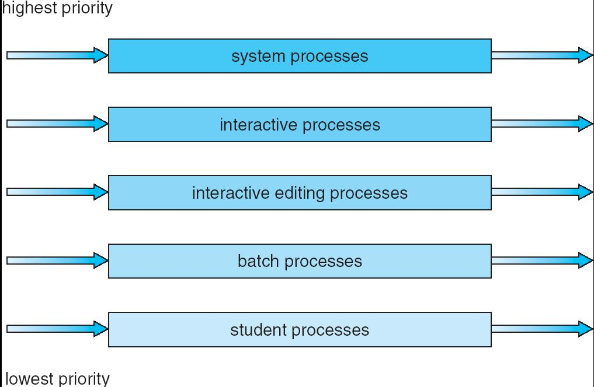

---

### Multilevel Feedback Queue

A process can move between the various queues; aging can be implemented this way

它将就绪队列分成多个层级，每个队列可以有不同的调度策略，并允许进程在队列之间移动。

Multilevel-feedback-queue scheduler defined by the following parameters:

- number of queues 队列数量
- scheduling algorithms for each queue 每个队列的调度算法
- method used to determine when to upgrade a process 进程升级（提升优先级）的规则
- method used to determine when to demote a process 进程降级（降低优先级）的规则
- method used to determine which queue a process will enter when that process needs service 新进程进入哪个队列的规则

每个队列优先级不同，调度算法可以不同（如轮转RR、先来先服务FCFS）。根据进程的表现（如是否用完时间片），可以提升或降低其所在队列。通过“升级”或“降级”进程，实现优先级的动态变化，防止某类进程长期被饿死。

---

#### Example of Multilevel Feedback Queue

Three queues:

- $Q_0$ – RR with time quantum 8 milliseconds
- $Q_1$ – RR time quantum 16 milliseconds
- $Q_2$ – FCFS

Scheduling

- A new job enters queue $Q_0$ which is served FCFS. When it gains CPU, job receives 8 milliseconds. If it does not finish in 8 milliseconds, job is moved to queue $Q_1$.
- 新进程进入 $Q_0$，按FCFS顺序排队，获得CPU后最多运行8毫秒。如果8毫秒内没完成，进程被“降级”到 $Q_1$。
- At $Q_1$, job is again served FCFS and receives 16 additional milliseconds. If it still does not complete, it is preempted and moved to queue $Q_2$.
- 在 $Q_1$，进程同样按FCFS顺序排队，最多运行16毫秒。如果16毫秒内仍未完成，进程被“降级”到 $Q_2$。
- 进入 $Q_2$ 按FCFS调度，不再有时间片限制，直到进程完成。

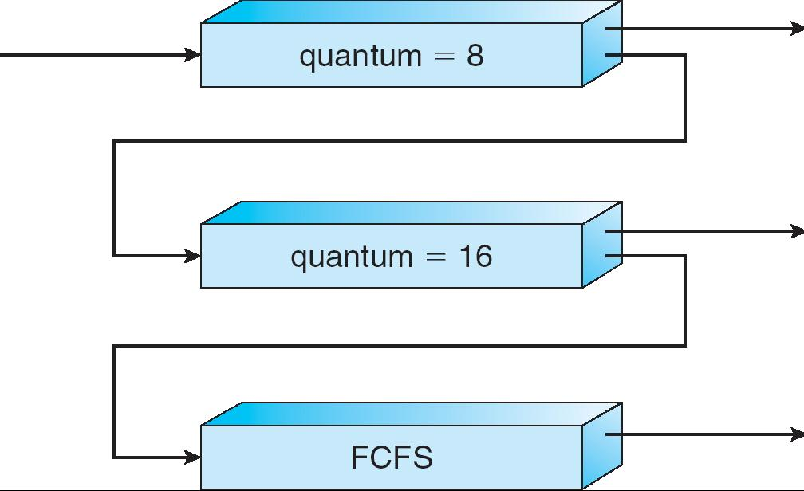

这就是一个反馈机制：如果进程表现“好”（比如很快完成），可以保持在高优先级队列。如果进程表现“差”（比如总是用完时间片），会被逐步降级到低优先级队列。这样，短作业和交互型进程优先获得CPU，长作业和CPU密集型进程逐步降级，保证系统响应性和公平性。

好处：

- 能兼顾短作业和长作业，提升系统响应速度。
- 动态调整优先级，防止进程饥饿。
- 适合多种类型进程混合的场景。

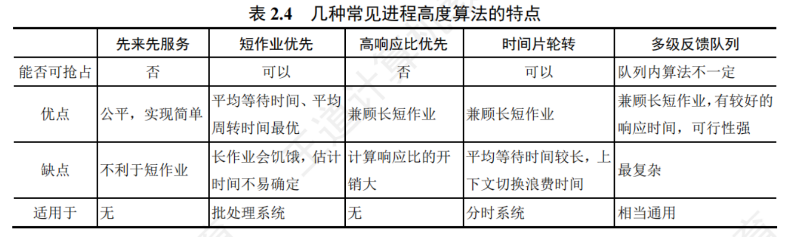

---

### Multiple-Processor Scheduling

CPU scheduling more complex when multiple CPUs are available

当系统有多个CPU（处理器）时，进程调度变得更复杂。操作系统需要决定如何把多个进程分配到不同的处理器上，并保持负载均衡（Load Balancing），让每个处理器都能充分利用。

Homogeneous processors within a multiprocessor

- 同质处理器（Homogeneous Processors）：所有CPU功能和性能一样，可以互相替换。
- 异质处理器（Heterogeneous Processors）：不同CPU有不同功能或性能，调度更复杂（本节主要讨论同质处理器）。

**Load balancing**

操作系统需要定期检查各处理器的负载情况，避免某些处理器过于繁忙而其他处理器空闲。可以通过迁移进程、动态分配任务等方式实现负载均衡。

- Asymmetric multiprocessing – only one processor accesses the system data structures, alleviating the need for data sharing; others execute only user code.
- 非对称多处理：只有一个处理器负责操作系统的核心任务（如调度、管理数据结构），其他处理器只执行用户进程。这样可以减少了多个处理器同时访问和修改系统数据结构的冲突，简化了设计。但是系统核心任务压力集中在一个处理器上，其他处理器利用率可能不高。
- Symmetric multiprocessing (SMP) – each processor is self- scheduling. Multiple processors might access and update a common data structure.
- 对称多处理：每个处理器都可以独立进行调度和执行进程，所有处理器平等。这样系统负载均衡更好，所有处理器都能充分利用。但是多个处理器可能同时访问和修改共享数据结构（如就绪队列），需要设计高效的同步机制，防止数据冲突。

---

### Real-Time Scheduling

实时调度是操作系统调度的一种特殊场景，主要用于对时间要求极高的任务，比如工业控制、医疗设备、航空航天等。实时系统必须保证关键任务在规定时间内完成，否则可能造成严重后果。

Hard real-time systems – required to complete a critical task within a guaranteed amount of time

硬实时系统要求关键任务必须在严格规定的时间内完成，绝不能延迟。系统必须有绝对的时间保证，通常采用专门的调度算法并且对系统资源和任务优先级有严格管理。

Soft real-time computing – requires that critical processes receive priority over less fortunate ones

软实时系统要求关键任务尽量优先完成，但允许偶尔延迟，系统可以容忍一定的超时。比如视频播放、在线游戏、语音通话等。如果偶尔出现延迟，用户体验会变差，但不会造成灾难性后果。关键任务优先于普通任务，但没有绝对时间保证。调度器会尽量让关键任务先执行，提高响应速度。

---

???+ example "question"
    实时系统的进程调度，通常采用()算法。
    
    A.先来先服务
    
    B.时间片轮转
    
    C.抢占式的优先级高者优先
    
    D.高响应比优先

??? note "answer"
    C

    实时系统必须能足够及时地处理某些紧急的外部事件，因此普遍用高优先级，并用“可抢占”来确保实时处理。

???+ example "question"
    下列选项中，满足短作业优先且不会发生饥饿现象的是()调度算法。
    
    A.先来先服务
    
    B.高响应比优先
    
    C.时间片轮转
    
    D.非抢占式短作业优先

??? note "answer"
    B

    响应比 =(等待时间+执行时间)/执行时间。高响应比优先算法在等待时间相同的情况下，作业执行时间越短，响应比越高，满足短任务优先。随着长作业等待时间的增加，响应比会变大,执行机会也会增大，因此不会发生饥饿现象。先来先服务和时间片轮转不符合短任务优先，非抢占式短任务优先会产生饥饿现象。

???+ example "question"
    为什么说多级反馈队列调度算法能较好地满足各类用户的需要?

??? note "answer"
    多级反馈队列调度算法能较好地满足各种类型用户的需要。对终端型作业用户而言，由于它们提交的作业大多属于交互型作业，作业通常比较短小，系统只要能使这些作业在第1级队列所规定的时间片内完成，便可使终端型作业用户感到满意;对短批处理作业用户而言，它们的作业开始时像终端型作业一样，若仅在第1级队列中执行一个时间片即可完成，便可获得与终端型作业一样的响应时间，对于稍长的作业，通常也只需要在第2级队列和第3级队列中名执行一个时间片即可完成，其周转时间仍然较短;对长批处理作业用户而言，它们的长作业将依次在第 1,2.…,n级队列中运行，然后按时间片轮转方式运行，用户不必担心其作业长期得不到处理。

