# Chapter 6 | Process Synchronization

## Background

Concurrent access to shared data may result in data inconsistency

当多个进程或线程并发访问同一份共享数据时，如果没有合适的同步机制，可能导致数据不一致（如丢失更新、读到错误值等）。

Maintaining data consistency requires mechanisms to ensure the **orderly** execution of cooperating processes

为了保证数据一致性，必须有机制确保多个协作进程的操作有序执行，避免冲突。

Suppose that we wanted to provide a solution to the consumer- producer problem that fills **all** the buffers. We can do so by having an integer **count** that keeps track of the number of full buffers.

假设有一组缓冲区，生产者负责生产数据并放入缓冲区，消费者负责取出数据并消费。用一个整数变量 count 记录当前已填满的缓冲区数量。

Initially, count is set to 0. It is incremented by the producer after it produces a new buffer and is decremented by the consumer after it consumes a buffer.

初始时，count = 0。每当生产者生产一个新缓冲区，count 加1。每当消费者消费一个缓冲区，count 减1。

**Producer**

```c
while (true) {
    /* produce an item and put in nextProduced */
    while (count == BUFFER_SIZE); // do nothing
    buffer [in] = nextProduced;
    in = (in + 1) % BUFFER_SIZE;
    count++;
}
```

**Consumer**

```c
while (true) {
    while (count == 0); // do nothing
    nextConsumed = buffer[out];
    out = (out + 1) % BUFFER_SIZE;
    count--;
    /* consume the item in nextConsumed */
}
```

???+ example "question"
    一个进程映像由程序、数据及PCB组成，其中()必须用可重入编码编写。
    
    A.PCB    B.程序    C.数据    D.共享程序段

??? note "answer"
    同步是指为了完成某项任务而建立的多个进程的相互合作关系，由于并发进程的执行是异步的(按各自独立的、不可预知的速度向前推进)，需要保证进程之间操作的先后次序的约束。例如，读进程和写进程对同一段缓冲区的读和写就需要进行同步，以保证正确的执行顺序。

---

### Race condition

`count++` could be implemented as

- register1 = count // 读出 count 到寄存器1
- register1 = register1 + 1 // 寄存器1加1
- count = register1 // 写回 count

`count--` could be implemented as

- register2 = count // 读出 count 到寄存器2
- register2 = register2 - 1 // 寄存器2减1
- count = register2 // 写回 count

Consider this execution interleaving with “count = 5” initially:

S0: producer execute register1 = count {register1 = 5}
S1: producer execute register1 = register1 + 1 {register1 = 6}
S2: consumer execute register2 = count {register2 = 5}
S3: consumer execute register2 = register2 - 1 {register2 = 4}
S4: producer execute count = register1 {count = 6 }
S5: consumer execute count = register2 {count = 4}

假设初始 count = 5，生产者和消费者并发执行，具体步骤如下：

S0: 生产者执行 register1 = count，此时 register1 = 5
S1: 生产者执行 register1 = register1 + 1，此时 register1 = 6
S2: 消费者执行 register2 = count，此时 register2 = 5（注意，此时 count 还没被生产者写回，还是5）
S3: 消费者执行 register2 = register2 - 1，此时 register2 = 4
S4: 生产者执行 count = register1，此时 count = 6
S5: 消费者执行 count = register2，此时 count = 4

???+ example "question"
    若系统有n个进程，则就绪队列中进程的个数最多有(①)个；阻塞队列中进程的个数最多有(②)个。
    
    ①A.n+1    B.n    C.n-1    D.1

    ②A.n+1    B.n    C.n-1    D.1

??? note "answer"
    ① C    ② B

    ①系统中有 n 个进程，只要这些进程不都处于阻塞态，则至少有一个进程正在处理器上运行(处理器至少有一个)，因此就绪队列中的进程个数最多有 n-1 个。选项B容易被错选，以为出现了处理器为空、就绪队列全满的情况，实际调度无此状态。

    ②本题易错选 C，阻塞队列有n-1个进程是可能发生的，但不是最多的情况。不少读者会忽略死锁的情况，死锁就是n个进程都被阻塞，因此阻塞队列最多可以有n个进程。

???+ example "question"
    下列关于临界区和临界资源的说法中，正确的是()。
    
    I.银行家算法可以用来解决临界区(Critical Section)问题
    
    Ⅱ.临界区是指进程中用于实现进程互斥的那段代码
    
    Ⅲ.公用队列属于临界资源
    
    IV.私用数据属于临界资源
    
    A.I、Ⅱ    B.I、IV    C.仅Ⅲ    D.以上答案都错误

??? note "answer"
    C

    临界资源是指每次仅允许一个进程访问的资源。每个进程中访问临界资源的那段代码称为临界区。选项 I 错误，银行家算法是避免死锁的算法。选项Ⅱ错误，每个进程中访问临界资源的那段代码称为临界区。选项 Ⅲ 正确，公用队列可供多个进程使用，但一次只可供一个程序使用。选项 IV 错误，私用数据仅供一个进程使用，不存在临界区问题。综上分析，正确答案为选项 C。

---

#### A practical definition of Race Condition

A race condition is a situation in which a memory location is accessed concurrently, and at least one access is a write.

竞态条件是指某个内存位置（变量）被多个进程或线程并发访问，并且至少有一个访问是写操作。

---

## Critical-section problem

To design a protocol that the processes can use to cooperate


临界区（Critical Section）是指进程或线程中访问共享资源（如共享变量、缓冲区等）的代码段。如果多个进程/线程同时进入临界区，可能导致数据不一致或竞态条件。

General structure of a typical process $P_j$

Q: critical section problems in OS kernel

---

### Solution to Critical-Section Problem

1. Mutual Exclusion - If process $P_i$ is executing in its critical section, then no other processes can be executing in their critical sections
2. Progress - If no process is executing in its critical section and there exist some processes that wish to enter their critical section, then the selection of the processes that will enter the critical section next cannot be postponed indefinitely
3. Bounded Waiting - A bound must exist on the number of times that other processes are allowed to enter their critical sections after a process has made a request to enter its critical section and before that request is granted

1. 互斥（Mutual Exclusion）任意时刻，最多只有一个进程在临界区内。防止多个进程同时修改共享资源。
2. 进展（Progress）如果没有进程在临界区，且有进程想进入临界区，必须保证某个进程能进入，不能无限推迟。不会出现“饿死”或无休止等待。
3. 有限等待（Bounded Waiting）每个进程请求进入临界区后，最多只能有有限个其他进程先进入临界区，保证公平性。防止某个进程长期得不到进入机会。

- Assume that each process executes at a nonzero speed
- No assumption concerning relative speed of the N processes

只有通过设计合适的同步协议（如锁、信号量、监视器等），才能保证临界区的互斥、进展和有限等待。

---

#### Algorithm 1

int turn; turn = 0; // $P_i$ can enter the critical section

Process $P_i$:

```c
do{
    while(turn != i);
    critical section
    turn=j;
    remainder section
} while (1);
```

Process $P_j$:

```c
do{
    while(turn != j);
    critical section
    turn=i;
    remainder section
} while (1);
```

Mutual Exclusion is satisfied. How about Progress?

互斥性分析（Mutual Exclusion）：

- 只有 `turn == i` 时，$P_i$ 才能进入临界区；只有 `turn == j` 时，$P_j$ 才能进入临界区。
- 因此，任意时刻最多只有一个进程在临界区，满足互斥性要求。

进展性分析（Progress）：

- 如果一个进程在临界区，另一个进程只能等待。
- 如果两个进程都在等待进入临界区，但 `turn` 没有被设置为它们的编号，则它们都无法进入临界区。
- 例如，如果 $P_i$ 在剩余区很久，$P_j$ 一直想进入临界区，但 `turn` 仍为 `i`，则 $P_j$ 会一直等待，进展性无法保证，可能出现“饿死”或无休止等待。

有限等待分析（Bounded Waiting）:

- 每次进入临界区后，主动把 `turn` 交给对方，理论上不会无限等待，但进展性问题仍然存在。
 
---

#### Algorithm 2

```c
boolean flag[2]; flag[0] = flag[1] = 0;
flag[i] = true if Pi tries to enter CS
```

Process $P_i$:

```c
do{
    flag[i]=true;
    while( flag[j] );
    critical section
    flag[i]=false;
    remainder section
} while (1);
```

Process $P_j$:

```c
do{
    flag[j]=true;
    while( flag[i] );
    critical section
    flag[j]=false;
    remainder section
} while (1);
```

Mutual Exclusion is satisfied. How about Progress?

互斥性分析（Mutual Exclusion）：

- 如果两个进程都想进入临界区（都设置 `flag` 为 `true`），则都在 `while` 循环等待，只有一个能进入临界区。所以互斥性是满足的。

进展性分析（Progress）：

- 如果两个进程几乎同时设置 `flag` 为 `true` ，则都在等待对方退出，可能导致死锁（都进不去临界区）。所以进展性不满足，即不能保证有进程能顺利进入临界区。

有限等待分析（Bounded Waiting）:

- 满足的。

---

#### Algorithm 3

```c
boolean flag[2]; flag[0] = flag[1] = 0;
```

Process $P_i$:

```c
do{
    while(flag[j]); // ①
    flag[i]=TRUE; // ③
    critical section;
    flag[i] = FALSE;
    remainder section;
}while(1);
```

Process $P_j$:

```c
do{
    while(flag[i]); // ②
    flag[j]=TRUE; // ④
    critical section;
    flag[j] = FALSE;
    remainder section;
}while(1);
```

Is Mutual Exclusion satisfied?

互斥性分析（Mutual Exclusion）：

- 假设 $P_i$ 和 $P_j$ 同时执行到 `while(flag[j])` 和 `while(flag[i])`，此时 `flag` 都为 `false` ，两个进程都能通过 `while` ，随后都设置自己的 `flag` 为 `true` ，然后都进入临界区。

进展性分析（Progress）：

- 如果两个进程几乎同时执行到 `while` 语句，并且都通过了检查（因为 `flag` 都是 `false`），则它们都会设置自己的 `flag` 为 `true` 并进入临界区，违反了互斥性要求。

---

#### Peterson's Solution

Two-process solution

Assume that the LOAD and STORE instructions are atomic; that is, cannot be interrupted.

The two processes share two variables:

- int `turn`;
- Boolean `flag[2]`;

The variable **turn** indicates whose turn it is to enter the critical section.

The **flag** array is used to indicate if a process is ready to enter the critical section. `flag[i] = true` implies that process $P_i$ is ready!

- `flag[2]`：布尔数组，`flag[i]=true` 表示进程 $P_i$ 想进入临界区。
- `turn`：整数变量，表示轮到哪个进程进入临界区。

---

##### The Algorithm for Process $P_i$

```c
while (true) {
    flag[i] = TRUE; // ① 表示自己想进入临界区
    turn = j; // ② 让对方优先
    while ( flag[j] && turn == j); // ③ 等待：如果对方也想进且轮到对方，则等待
    CRITICAL SECTION // ④ 临界区
    flag[i] = FALSE; // ⑤ 离开临界区，表示自己不再需要进入
    REMAINDER SECTION // ⑥ 剩余区
}
```

---

##### The Respective Algorithm for Process $P_j$

```c
    while (true) {
    flag[j] = TRUE;
    turn = i;
    while ( flag[i] && turn == i);
    CRITICAL SECTION
    flag[j] = FALSE;
    REMAINDER SECTION
}
```

互斥性分析（Mutual Exclusion）：

- 如果两个进程都想进入临界区，最后设置的 `turn` 决定谁先进入。
- 只有 `turn` 指向自己的进程，且对方也想进时，自己才能进入临界区。
- 保证了同一时刻只有一个进程能进入临界区。

进展性分析（Progress）：

- 如果只有一个进程想进入临界区，while 条件不成立，可以直接进入。
- 如果两个进程都想进入临界区，最后设置的 `turn` 决定谁先进入，另一个进程会等待，但不会无限等待。

有限等待分析（Bounded Waiting）:

- 每次进程请求进入临界区时，最多只有一个对方能先进入，保证不会饿死。

!!! info
    现在的体系架构下，随着乱序执行和缓存一致性协议的发展，Peterson 算法已经不能保证正确性了，一般不再使用。

    我们可以发现的是，如果把 `flag` 和 `turn` 的设置顺序改变，Peterson 算法就会失效。

---

### Synchronization Hardware

在并发程序中，多个进程/线程可能同时访问共享数据，容易产生竞态条件和数据不一致。

Many systems provide hardware support for critical section code

Uniprocessors – could disable interrupts

- Currently running code would execute without preemption
- Generally too inefficient on multiprocessor systems. Operating systems using this not broadly scalable

单处理器系统的做法

- 关闭中断（Disable Interrupts）：在单核CPU上，可以通过临界区代码执行前关闭中断，保证当前进程不会被打断，从而实现互斥。
- 影响系统响应速度（如无法及时响应硬件事件）。在多核/多处理器系统中无效，因为其他CPU仍可访问共享数据。

Modern machines provide special atomic hardware instructions. Atomic = non-interruptable

- Either test memory word and set value
- Or swap contents of two memory words

现代硬件的原子操作指令：指令在执行期间不可被中断，保证操作的完整性。

常见原子指令：

- Test-and-Set：测试某个内存单元的值并设置新值，整个过程不可分割。
- Swap：交换两个内存单元的内容，整个过程不可分割。

这些指令通常由CPU直接支持，能在多处理器环境下高效实现互斥。

---

#### TestAndSet Instruction

Definition:

```c
boolean TestAndSet (boolean *target) {
    boolean rv = *target;
    *target = TRUE;
    return rv;
}
```

原子地读取target的值，并把它设置为TRUE，返回原来的值。

“原子”意味着整个操作不可被中断，保证并发安全。

---

##### Solution using TestAndSet

Shared boolean variable lock., initialized to false.

Solution:

```c
while (true) {
    while ( TestAndSet ( &lock )); /* do nothing */
    // critical section
    lock = FALSE;
    // remainder section
}
```

假设有一个共享变量lock，初始为FALSE，表示没人占用临界区。

互斥性分析（Mutual Exclusion）：

- 当多个进程同时到达 `TestAndSet` 时，只有一个能获得FALSE，其余进程会一直循环等待（自旋锁）。
- 这样保证了同一时刻只有一个进程能进入临界区，实现互斥。

进展性分析（Progress）：

- 如果没有进程在临界区，任何想进入的进程都能通过 `TestAndSet` 获得锁，进入临界区。

有限等待分析（Bounded Waiting）:

- 不能保证有限等待，可能出现某个进程长期等待的情况。

---

#### Swap Instruction

Definition:

```c
void Swap (boolean *a, boolean *b){
    boolean temp = *a;
    *a = *b;
    *b = temp;
}
```

作用：原子性地交换两个变量的值。

---

##### Solution using Swap

Shared Boolean variable lock initialized to FALSE; Each process has a local Boolean variable key.

假设有一个共享变量lock（初始为FALSE），每个进程有一个本地变量key。

Solution:

```c
while (true) {
    key = TRUE;
    while ( key == TRUE)
        Swap (&lock, &key );
    // critical section
    lock = FALSE;
    // remainder section
}
```

进程先把 `key` 设为 `TRUE` ，然后不断用 `Swap` 尝试和 `lock` 交换。

如果 `lock` 为 `FALSE` ，交换后 `key` 变为 `FALSE` ，进程就能进入临界区。

其余进程会一直自旋，直到lock被释放。

互斥性分析（Mutual Exclusion）：

- 只有一个进程能成功将 `lock` 设为 `TRUE` 并进入临界区，其他进程会自旋等待，保证互斥。

进展性分析（Progress）：

- 如果没有进程在临界区，任何想进入的进程都能通过 `Swap` 获得锁，进入临界区。

有限等待分析（Bounded Waiting）:

- 不能保证有限等待，可能出现某个进程长期等待的情况。

---

#### The compare_and_swap(CAS) Instruction

Definition:

```c
int compare_and_swap(int *value, int expected, int new_value){
    int temp = *value;
    if (*value == expected)
    *value = new_value;
    return temp;
}
```

Properties

- Executed atomically 整个操作不可被中断，保证并发安全。
- Returns the original value of passed parameter value 返回传入参数value的原始值。
- Set the variable `value` the value of the passed parameter `new_value` but only if `*value == expected` is true. That is, the swap takes place only under this condition. 如果 `*value` 等于 `expected` ，就把 `*value` 设为 `new_value` ，否则不变。无论是否修改，都返回原来的 `*value` 。

---

##### Solution using compare_and_swap

Shared integer `lock` initialized to 0;

`lock` 初始为0，表示没人占用临界区。

Solution:

```c
while (true){
    while (compare_and_swap(&lock, 0, 1) != 0); /* do nothing */
    /* critical section */
    lock = 0;
    /* remainder section */
}
```

进程不断尝试用CAS把lock从0改为1，只有一个进程能成功，其余进程会自旋等待。

成功后进入临界区，离开时将 `lock` 重置为0。

Does it solve the critical-section problem?

互斥性分析（Mutual Exclusion）：

- 只有一个进程能成功将 `lock` 从0改为1并进入临界区，其他进程会自旋等待，保证互斥。

进展性分析（Progress）：

- 如果没有进程在临界区，任何想进入的进程都能通过 `compare_and_swap` 获得锁，进入临界区。

有限等待分析（Bounded Waiting）:

- 不能保证有限等待，可能出现某个进程长期等待的情况。

---

#### Bounded-waiting with compare-and-swap

```c
while (true) {
    waiting[i] = true;
    key = 1;
    while (waiting[i] && key == 1)
        key = compare_and_swap(&lock,0,1);
    waiting[i] = false;
    /* critical section */
    j = (i + 1) % n;
    while ((j != i) && !waiting[j])
        j = (j + 1) % n;
    if (j == i)
        lock = 0;
    else
        waiting[j] = false;
    /* remainder section */
}
```

- 每个进程有一个 `waiting[i]` 标记，表示自己正在等待进入临界区。
- 进程自旋时，只有 `waiting[i]` 为 `true` 且 `key == 1` 才继续尝试 CAS。
- 进入临界区后，`waiting[i]=false` 。
- 离开临界区时，优先唤醒下一个等待的进程，保证每个进程不会被无限推迟。

互斥性分析（Mutual Exclusion）：

- 只有一个进程能成功将 `lock` 从0改为1并进入临界区，其他进程会自旋等待，保证互斥。

进展性分析（Progress）：

- 如果没有进程在临界区，任何想进入的进程都能通过 `compare_and_swap` 获得锁，进入临界区。

有限等待分析（Bounded Waiting）:

- 通过 `waiting` 数组和唤醒机制，保证每个进程最多只能被其他进程推迟有限次，满足有限等待要求。

---

### Mutex Locks

Previous solutions are complicated and generally inaccessible to application programmers

前面介绍的各种硬件同步原语（如Test-and-Set、Swap、CAS）虽然能实现互斥，但对普通程序员来说太底层、太复杂。

OS designers build software tools to solve critical section problem

操作系统设计者通常会基于这些原语，封装出更易用的软件工具。

Simplest is mutex lock

最常见的就是**互斥锁**

- Boolean variable indicating if lock is available or not
- 用一个布尔变量（如available）表示锁是否可用。

Protect a critical section by

- First `acquire()` a lock 进入临界区前，先acquire（获取）锁。
- Then `release()` the lock 离开临界区后，release（释放）锁。

Calls to `acquire()` and `release()` must be **atomic**

`acquire` 和 `release` 操作必须是原子的，否则会有竞态条件。

- Usually implemented via hardware atomic instructions such as compare-and-swap.
- 通常通过硬件原子指令（如CAS）实现。

But this solution requires **busy waiting**

- This lock therefore called a **spinlock**

这样只有一个进程能成功获得锁，其余进程会自旋等待（忙等/自旋锁spinlock）。

---

##### Solution to CS Problem Using Mutex Locks

```c
while (true) {
    acquire lock
    critical section
    release lock
    remainder section
}
```

**Definition of `acquire()` & `release()`**

```c
acquire() {
    while (!available); /* busy wait */
    available = false;
}
```

```c
release() {
    available = true;
}
```

- 这种写法在多核/多线程环境下不是原子的，可能出现多个进程同时通过 `while` 判断，导致互斥失效。

Q: How to implement the acquire() using atomic instructions such as compare-and-swap?

```c
acquire() {
    while (compare_and_swap(&available, true, false) == false);
}
```

---

##### Spinlock Implementation

Two important operations: **acquire** and **release**

An incorrect implementation of acquire

Two CPUs may enter race condition, both holding the lock

错误实现（不安全）

```c
void
acquire(struct spinlock *lk){
    for(;;){
        if(lk->locked ==0){
            lk->locked =1;
            break;
        }
    }
}
```

这段代码的本意是：如果锁没被占用（`lk->locked==0`），就把它设为1，表示加锁成功。

问题：在多核/多线程环境下，两个CPU可能几乎同时判断 `lk->locked==0` ，都通过判断，然后都把 `lk->locked` 设为1，导致两个CPU同时获得锁，互斥性被破坏。这就是竞态条件。

Solution: to use **amoswap** instruction which prevents any other CPU from using the memorylocation between the memory r/w

```c
void
acquire(struct spinlock *lk){
    push off(); // disable interrupts to avoid deadlock.
    while( sync lock test and set(&lk->locked, 1)!= 0);
    sync_synchronize();
    // Record info about lock acquisition for holding() and debugging
    lk->cpu = mycpu();
}
```

- 这里用到了 `sync_lock_test_and_set` ，它本质上是一个原子操作（如 `Test-and-Set` 或 `amoswap` ），保证“判断并加锁”是不可分割的。
- 只有一个 CPU 能成功把 `lk->locked` 从0变为1，其它CPU会一直自旋等待，直到锁被释放。
- `push_off()` 关闭本地中断，防止死锁（如当前 CPU 持有锁时被中断切换到别的任务）。
- `sync_synchronize()` 用于内存屏障，保证指令顺序。

On RlSC-V, effectively an atomic swap: 

RISC-V架构提供了 `amoswap.w.ag` 等原子指令，能在硬件层面保证“读-写”操作的原子性。

```assembly
a5=1
s1 =&lk->locked
amoswap.w.ag a5, a5,(s1)
```

这条指令会把s1指向的内存（ `lk->locked` ）和 a5 的值交换，整个过程不可被打断。

---

## Semaphore

Synchronization tool that is less complicated

信号量是一种**同步工具**，用于协调多个进程/线程对共享资源的访问，防止竞态条件。

Semaphore S – integer variable

Two indivisible operations modify S :

- `wait()` and `signal()`
- originally called `P()` and `V()`

Can only be accessed via two indivisible (atomic) operations

本质上是一个**整型变量**（如S），只能通过两种原子操作（不可分割的操作）来修改。

```c
wait (S) {
    while S <= 0; // no-op
    S--;
}
```

- 当 `S>0` 时，S 减 1，进程继续执行。
- 当 `S<=0` 时，进程会等待（阻塞或忙等），直到 `S>0` 。

```c
signal (S) {
    S++;
}
```

- S 加 1，表示释放一个资源或唤醒一个等待的进程。

**注意**： 这两个操作必须是**原子**的，即执行过程中不能被打断，防止并发修改导致错误。

Can be implemented without busy waiting

---

### Usage as General Synchronization Tool

**Counting** semaphore – integer value can range over an unrestricted domain

**计数型信号量**（Counting Semaphore）：S 可以取任意整数，常用于资源数量大于1的场景（如多个缓冲区）。

**Binary** semaphore – integer value can range only between 0 and 1; can be simpler to implement

**二进制信号量**（Binary Semaphore）：S 只能为 0 或 1 ，功能类似于互斥锁（mutex lock），常用于实现互斥。

- Also known as **mutex locks**

Can implement a counting semaphore **S** as a binary semaphore

Provides mutual exclusion

```c
Semaphore S; // initialized to 1
wait (S);
Critical Section
signal (S);
```

只有一个进程能进入临界区，其他进程会在 `wait(S)` 处等待，保证互斥。

P1 has a statement S1, P2 has S2

Statement S1 to be executed before S2


- 可以用信号量保证某些操作的执行顺序。例如，P1 的 S1 语句必须在 P2 的 S2 语句之前执行。
- 只需信号量 S 初始值为 0。让 P2 在 wait(S) 后执行 S2，P1 在 S1 后 signal(S)，即可实现顺序约束。

Provide synchronized access to:

- Four rooms, four identical keys

有四个房间，门锁是一样的，有四把完全相同的钥匙。

- 任何人只要拿到一把钥匙，就可以打开任意一个房间的门。
- 最多只能有四个人同时进入房间（每人一把钥匙）。

这种情况可以用**计数型信号量（Counting Semaphore）**来实现。

- 设信号量 S 的初始值为 4，表示有 4 把钥匙。
- 每当一个人想进房间时，执行 `wait(S)`，即 S 减 1，拿走一把钥匙。
- 每当一个人离开房间时，执行 `signal(S)`，即 S 加 1，归还一把钥匙。

- Four rooms, each with a unique key (four different keys)

有四个房间，每个房间的钥匙都不一样。

- 只有拿到对应钥匙的人才能进入对应的房间。
- 每个房间最多只能有一个人进入。

这种情况可以用**4个二进制信号量（Binary Semaphore）**来实现，每个房间一个信号量。

- 每个信号量初始值为 1，表示钥匙可用。
- 想进入第 i 个房间时，执行 `wait(S[i])`，拿走钥匙。
- 离开时，执行 `signal(S[i])`，归还钥匙。

---

### Semaphore Implementation

Must guarantee that no two processes can execute `wait ()` and `signal ()` on the same semaphore at the same time

必须保证同一时刻，不能有两个进程同时执行同一个信号量的 `wait()` 或 `signal()` 操作，否则会导致并发错误。

Thus, implementation becomes the critical section problem where the wait and signal code are placed in the critical section.

因此，`wait` 和 `signal` 的实现本身也需要放在“临界区”内，必须用锁等机制保护。

Could now have busy waiting in critical section implementation

为什么有时“忙等”问题不大？

- But implementation code is short 如果临界区代码很短
- Little busy waiting if critical section rarely occupied 大多数时候没有进程在等待（即临界区很少被占用）

那么忙等带来的CPU浪费很少。

Note that applications may spend lots of time in critical sections and therefore this is **not** a good solution.

但如果应用程序本身在临界区内执行时间很长，或者有大量进程频繁竞争同一个信号量，忙等就会导致严重的性能问题。

---

#### Example1: Semaphore Implementation (Busy Waiting)

```c
struct semaphore{
    struct spinlock lock; // 自旋锁，用于保护对 count 的并发访问，保证原子性。
    int count;  // 信号量的当前值，表示可用资源数。
};

void V(struct semaphore *s){
    acquire(&s->lock); // 加锁，保证下面的操作是原子的
    s->count += 1; // 资源数加1，表示释放/增加一个资源
    release(&s->lock); // 解锁
}

void P(struct semaphore *s){
    while(s->count == 0);  // 忙等：如果没有资源就一直循环等待
    acquire(&s->lock); // 加锁，保证下面的操作是原子的
    s->count -= 1; // 占用一个资源
    release(&s->lock); // 解锁
}
```

To allow one producer and one consumer, running `P()` and `V()` on different CPUs

如果生产者很少生产（即很少执行 `V()`），而消费者频繁执行 `P()`，那么消费者会一直在 `while(s->count == 0);` 处自旋，占用大量CPU资源，效率低下。

If producer rarely acts, consumerspins on `while(s->count == 0);` . Expensive!!

这种实现方式叫忙等（**busy waiting**），不适合资源稀缺或等待时间长的场景。

---

### Semaphore Implementation with no Busy waiting

忙等（busy waiting）会让进程在等待资源时不断占用CPU，效率低下。

更好的做法是：当资源不可用时，让进程阻塞（sleep），等资源可用时再唤醒（wakeup）。

With each semaphore there is an associated waiting queue. Each semaphore has two data items:

每个信号量包含两个数据项：

- value (of type integer)
- pointer to a linked-list of PCBs.

- `value` ：整型变量，表示可用资源数。
- `waiting queue` ：指向等待该信号量的进程队列（通常是PCB链表）。

Two operations (provided as basic system calls):

有两个基本操作：

- `block (sleep)` – place the process invoking the operation on the appropriate waiting queue.
- `wakeup` – remove one of processes in the waiting queue and place it in the ready queue.

- `block (sleep)` ：把当前进程加入等待队列，并阻塞（让出CPU）。
- `wakeup` ：从等待队列中移除一个进程，并将其放入就绪队列。

Implementation of wait:

```c
wait (S){
    value--;
    if (value < 0) {
        // add this process to waiting queue
        block();
    }
}
```

- 先将 `value` 减1。
- 如果 `value` 变成负数，说明没有可用资源，当前进程加入等待队列并阻塞。

Implementation of signal:

```c
Signal (S){
    value++;
    if (value <= 0) {
        // remove a process P from the waiting queue
        wakeup(P);
    }
}
```

- 先将 `value` 加1。
- 如果 `value` 小于等于0，说明有进程在等待，唤醒其中一个。

See Example 2

---

#### Example2: sleep and wakeup operations

```c
void
V(struct semaphore *s){
    acquire(&s->lock);
    s->count +=1;
    wakeup(s);
    release(&s->lock);

}

void P(struct semaphore *s){
    while(s->count==0)
        sleep(s);
    acquire(&s->lock);
    s->count -=1;
    release(&s->lock);
}
```

- `P()` 操作中，如果资源不可用，进程会sleep，等待被唤醒。
- 这样可以避免忙等，节省CPU资源。

Sleep on wait queue S

Overhead reduced by giving up CPU with sleep(block) operation.

Unfortunately suffers from the **lost wake-up** problem:

**丢失唤醒**（lost wake-up）

P is running between 212-213,V increments count and wakeup(). P then sleeps, waiting for a wakeup() call that has happened already.

如果在 `P()` 进程准备 `sleep` 的瞬间，另一个进程刚好执行了 `V()` 并唤醒操作，结果 `P()` 还是会进入睡眠，导致丢失唤醒，进程永远睡眠，系统死锁。

**Moving things under protection of spinlock?**

```c
void V(struct semaphore *s){
    acquire(&s->lock);
    s->count +=1;
    wakeup(s);
    release(&s->lock);
}

void P(struct semaphore *s){
    acquire(&s->lock);
    while(s->count==0)
        sleep(s);
    s->count -=1;
    release(&s->lock);
}
```

Lost wakeup prevented, but Deadlocks!!! Solution?

这样可以防止丢失唤醒，但又引入了死锁风险：如果进程在持有锁时 `sleep` ，其他进程无法获得锁，导致所有进程都被阻塞。

**Pass the condition lock to `sleep()`**

```c
void V(struct semaphore *s){
acquire(&s->lock);
s->count +=1;
wakeup(s);
release(&s->lock);
}

void P(struct semaphore *s){
acquire(&s->lock);
while(s->count==0)
    sleep(s, &s->lock);
s->count -=1;
release(&s->lock);
}
```

`sleep(s,&s->lock)` can release the lock after the calling process is marked as asleep and waiting on the wait queue s.

- `sleep(s, &s->lock)` 表示：进程在进入等待队列并准备睡眠后，自动释放锁。
- 这样既能防止丢失唤醒，又能避免死锁。

---

## Deadlock and Starvation

**Deadlock** – two or more processes are waiting indefinitely for an event that can be caused by only one of the waiting processes

**死锁**是指两个或多个进程无限期地相互等待，而这些事件只能由等待队列中的某个进程来触发，但由于大家都在等待，导致所有进程都无法继续执行。

Let S and Q be two semaphores initialized to 1


假设有两个信号量 S 和 Q，初始值都为 1。

- 进程P1先获得S，再等待Q；
- 进程P2先获得Q，再等待S。

此时：

- P1持有S，等待Q；
- P2持有Q，等待S；
- 两个进程都无法获得对方持有的信号量，**相互等待**，永远无法继续，这就是死锁。

!!! note "**死锁的四个必要条件**"
    1. **互斥**：资源一次只能被一个进程占用。

    2. **占有且等待**：进程已持有资源，同时又请求新的资源。

    3. **不可剥夺**：资源不能被强制剥夺，只能主动释放。

    4. **循环等待**：存在进程资源的环形等待链。

**Starvation** – indefinite blocking. A process may never be removed from the semaphore queue in which it is suspended.

**饥饿**（Starvation）又称为**无限阻塞**，指的是某个进程长期得不到所需资源，一直被挂起，可能永远无法被唤醒。

原因：

- 可能是调度策略不公平，比如总有其他进程插队，某个进程一直排不到队头。
- 也可能是信号量队列管理不当，某些进程一直得不到唤醒。

??? note "区别于死锁"
    死锁是所有相关进程都无法继续；

    饥饿是某个或某些进程长期得不到资源，但系统整体还在运行。

??? note
    PV 操作实现同步互斥的简单总结:在同步问题中，若某个行为会提供某种资源，则在这个行为之后V 这种资源;若某个行为要用到这种资源，则在这个行为之前P这种资源。在互斥问题中，PV操作要紧夹使用临界资源的那个行为，中间不能有其他几余代码。

---

## Classical Problems of Synchronization

- Bounded-Buffer Problem
- Readers and Writers Problem
- Dining-Philosophers Problem

---

### Bounded-Buffer Problem

N buffers, each can hold one item

Semaphore **mutex** initialized to the value 1

Semaphore **full** initialized to the value 0, counting full items

Semaphore **empty** initialized to the value N, counting empty items.

The structure of the **producer** process

```c
while (true) {
    //   produce an item
    wait (empty);
    wait (mutex);

    //  add the item to the  buffer

    signal (mutex);
    signal (full);
}
```

The structure of the **consumer** process

```c
while (true) {
    wait (full);
    wait (mutex);

    //  remove an item from  buffer

    signal (mutex);
    signal (empty);

    //  consume the removed item
}
```

??? note "王道的解释"
    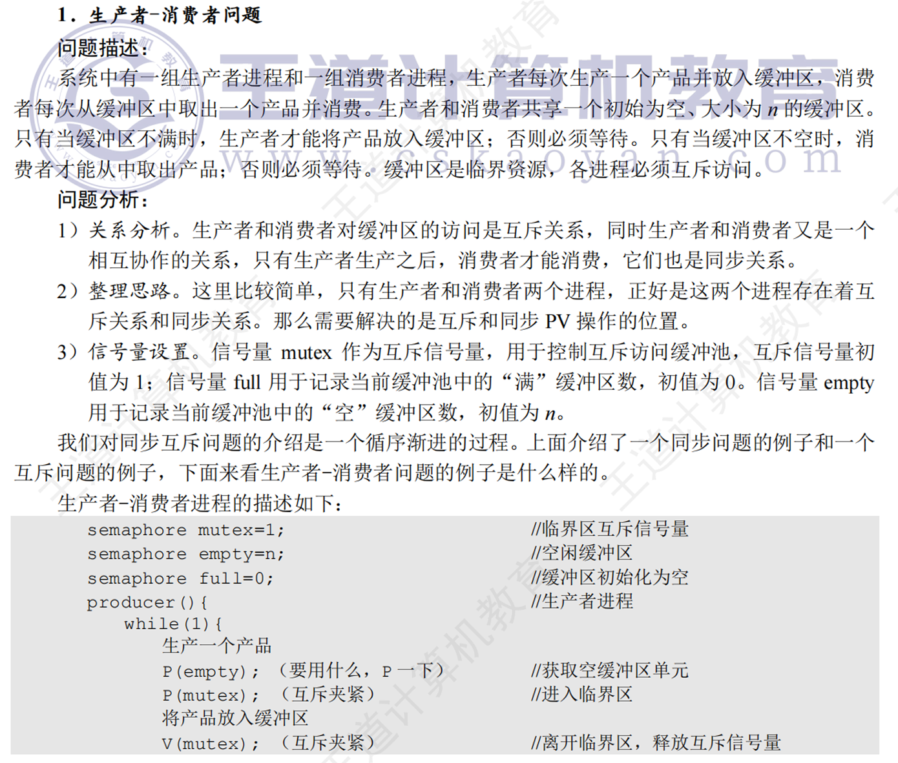

    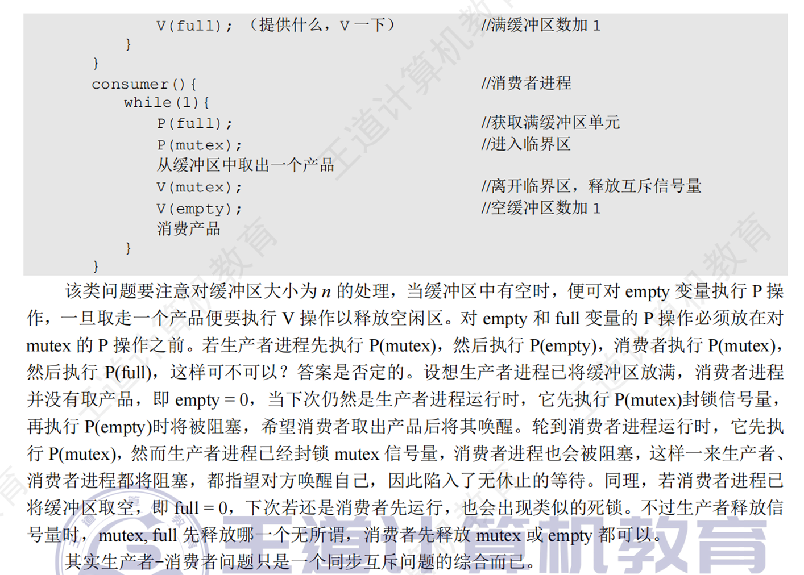

    

    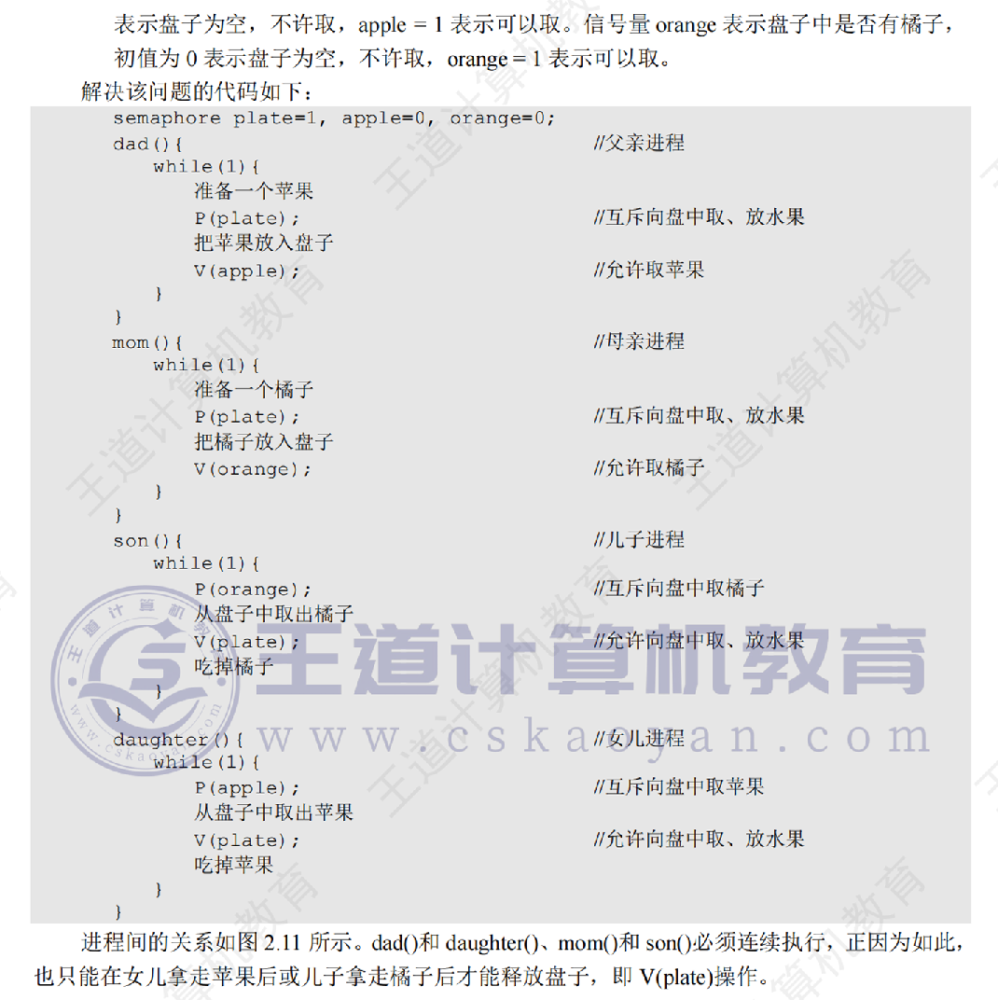

---

### Readers-Writers Problem

A data set is shared among a number of concurrent processes

- Readers – only read the data set; they do **not** perform any updates
- Writers – can both read and write.

Problem – allow multiple readers to read at the same time. Only one single writer can access the shared data at the same time.

Shared Data

- Data set
- Semaphore **mutex** initialized to 1, to ensure mutual exclusion when **readcount** is updated.
- Semaphore **wrt** initialized to 1.
- Integer readcount initialized to 0.

The structure of a **writer** process

```c
while (true) {
    wait (wrt);
    //  writing is performed
    signal (wrt);
}
```

The structure of a **reader** process

```c
while (true) {
    wait (mutex);
    readcount++;
    if (readcount == 1)
        wait (wrt);
    signal (mutex);

    //  reading is performed

    wait (mutex);
    readcount--;
    if (readcount == 0)
        signal (wrt);
    signal (mutex);
}
```

??? note "王道的解释"
    

    

    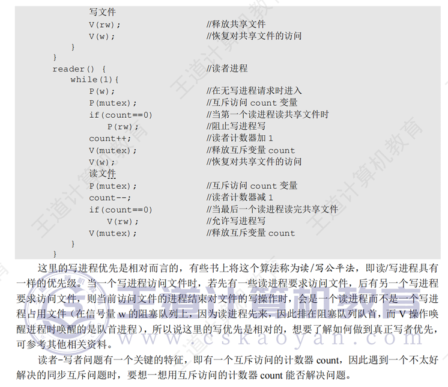

---

### Dining-Philosophers Problem

Shared data 

- Shared data 
- Semaphore chopstick [5] initialized to 1

The structure of Philosopher i:

```c
While (true)  { 
    wait ( chopstick[i] );
    wait ( chopstick[ (i+1) %5] );

    //  eat

    signal ( chopstick[i] );
    signal ( chopstick[ (i+1) %5] );

    //  think
}
```

??? note "王道的解释"
    

    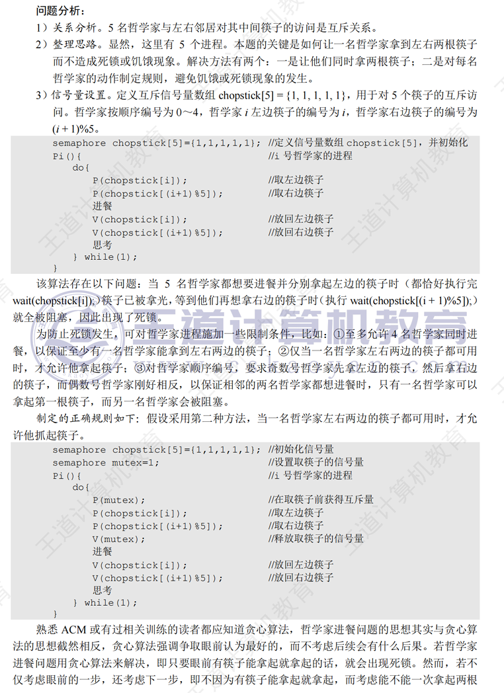

    

    但是对于哲学家问题来说，如果两边的哲学家活动很充分、频繁。那么就可能会出现中间这个哲学家一直饿死的情况。

???+ example "question"
    在一个仓库中可以存放A和B两种产品，要求:
    
    1. 每次只能存入一种产品。

    2. A 产品数量 - B 产品数量 < M, 其中 M 是正整数。

    3. B 产品数量 - A 产品数量 < N，其中 N 是正整数。

    假设仓库的容量是无限的，试用PV操作描述产品A和B的入库过程。

??? note "answer"
    

???+ example "question"
    

??? note "answer"
    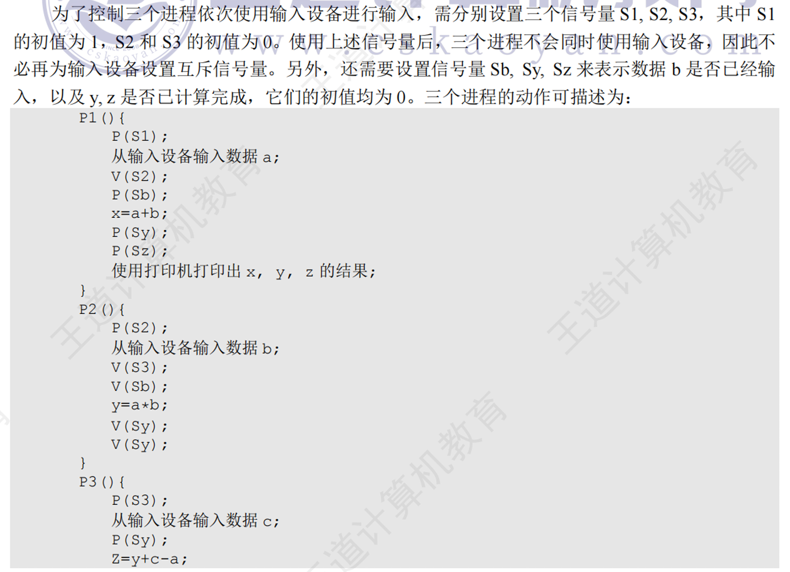

    

???+ example "question"
    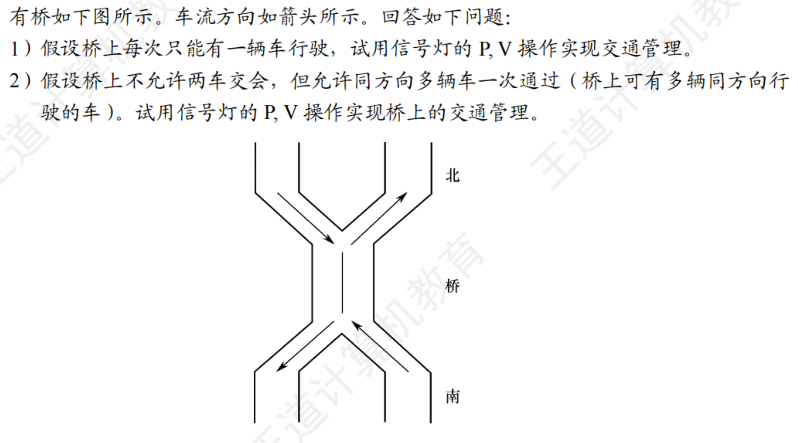

??? note "answer"
    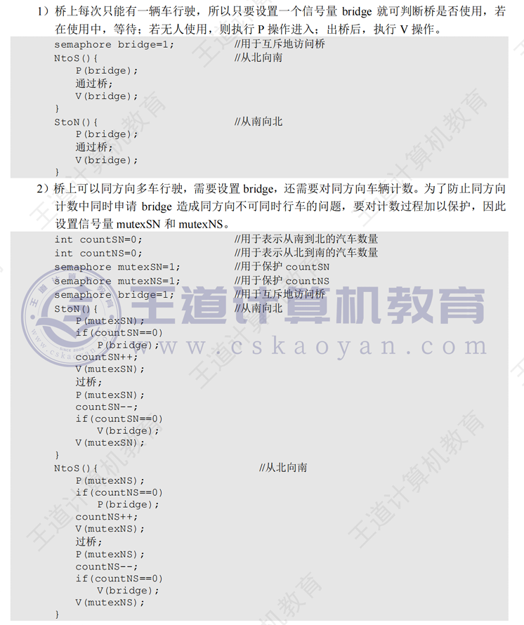

???+ example "question"
    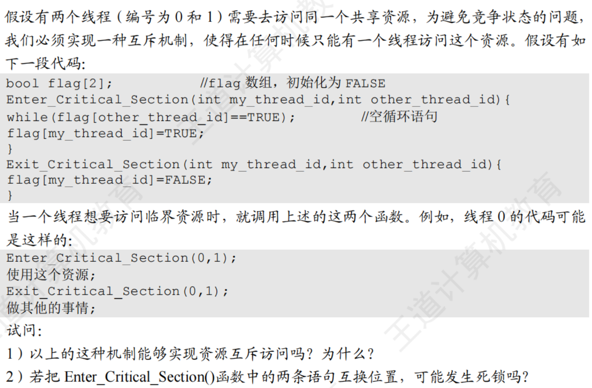

??? note "answer"
    

    控制的那个函数是否是**原子操作**是最重要的。

    

???+ example "question"
    

    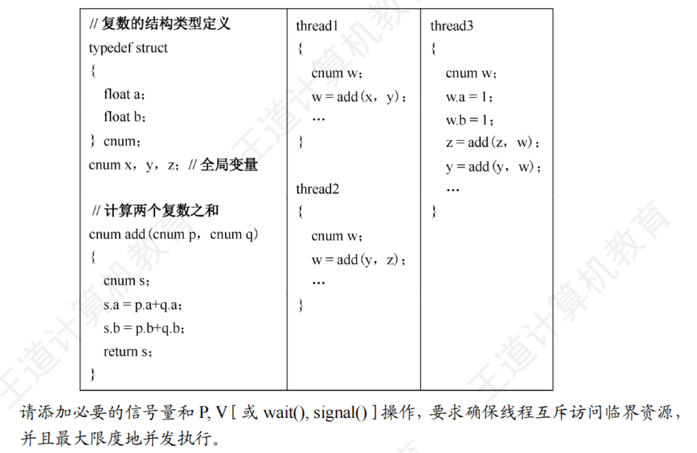

??? note "answer"
    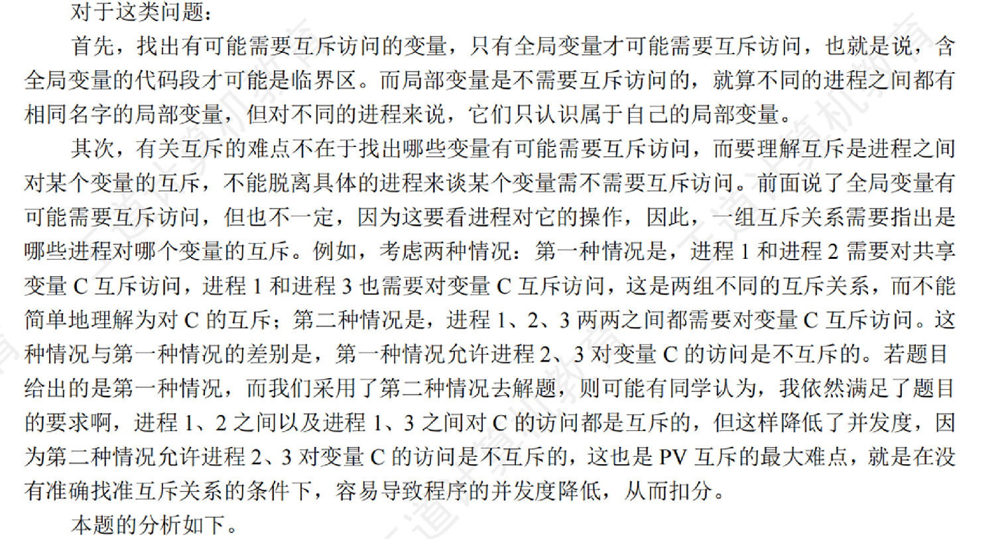

    

???+ example "question"
    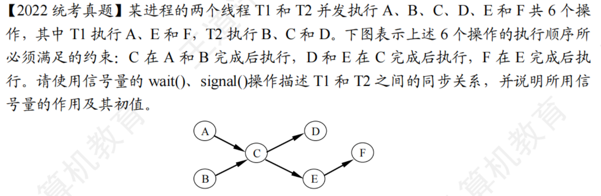

??? note "answer"
    

    这里需要注意的是，A 和 C 不属于一个线程，但是 B 和 C 属于一个线程。所以需要信号量来保证 A 和 C 互斥，而 B 和 C 不需要信号来保证互斥，因为它们是一个线程，顺序就是代码中的样子。

???+ example "question"
    

??? note "answer"
    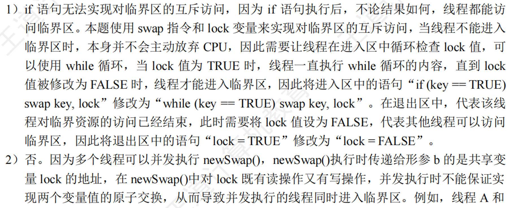

    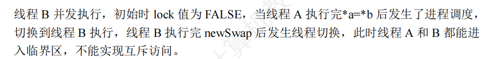

???+ example "question"
    理发店里有一位理发师、一把理发椅和n把供等候理发的顾客坐的椅子。若没有顾客理发师便在理发椅上睡觉，一位顾客到来时，顾客必须叫醒理发师，若理发师正在理发时又有顾客来到，若有空椅子可坐，则坐下来等待，否则就离开。试用PV操作实现并说明信号量的定义和初值。

??? note "answer"
    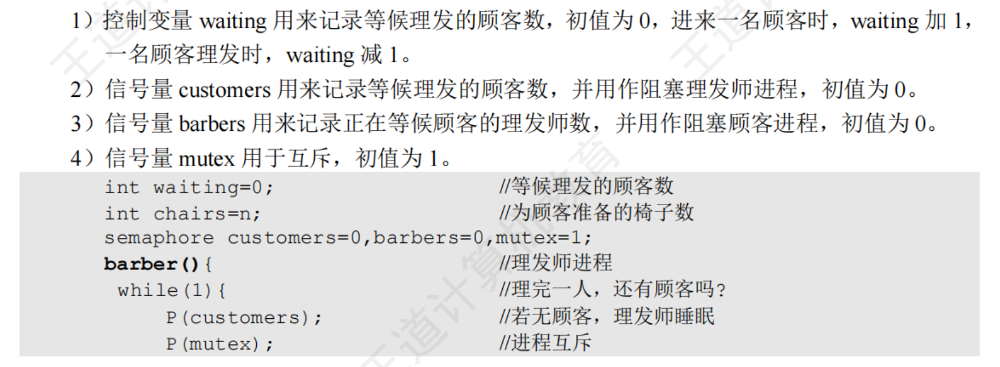

    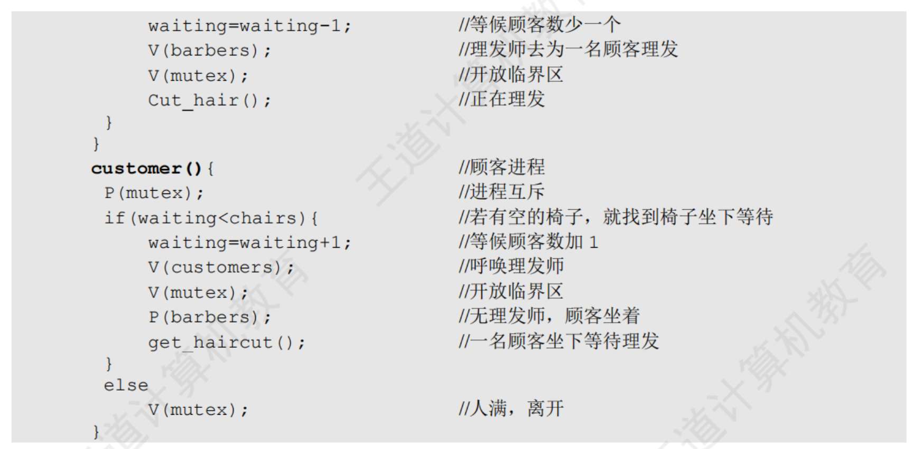

---