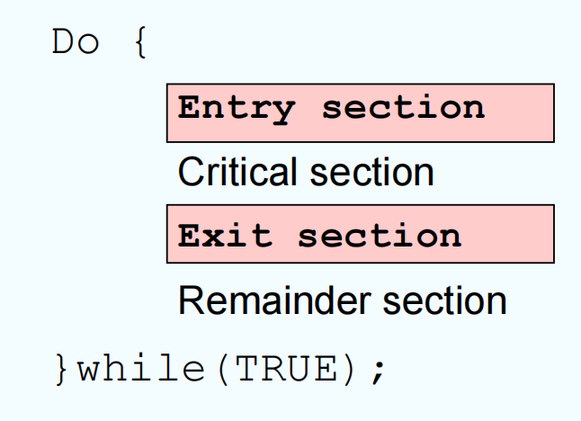

# Chapter 6 | Process Synchronization

## Background

Concurrent access to shared data may result in data inconsistency

当多个进程或线程并发访问同一份共享数据时，如果没有合适的同步机制，可能导致数据不一致（如丢失更新、读到错误值等）。

Maintaining data consistency requires mechanisms to ensure the **orderly** execution of cooperating processes

为了保证数据一致性，必须有机制确保多个协作进程的操作有序执行，避免冲突。

Suppose that we wanted to provide a solution to the consumer- producer problem that fills **all** the buffers. We can do so by having an integer **count** that keeps track of the number of full buffers.

假设有一组缓冲区，生产者负责生产数据并放入缓冲区，消费者负责取出数据并消费。用一个整数变量 count 记录当前已填满的缓冲区数量。

Initially, count is set to 0. It is incremented by the producer after it produces a new buffer and is decremented by the consumer after it consumes a buffer.

初始时，count = 0。每当生产者生产一个新缓冲区，count 加1。每当消费者消费一个缓冲区，count 减1。

**Producer**

```c
while (true) {
    /* produce an item and put in nextProduced */
    while (count == BUFFER_SIZE); // do nothing
    buffer [in] = nextProduced;
    in = (in + 1) % BUFFER_SIZE;
    count++;
}
```

**Consumer**

```c
while (true) {
    while (count == 0); // do nothing
    nextConsumed = buffer[out];
    out = (out + 1) % BUFFER_SIZE;
    count--;
    /* consume the item in nextConsumed */
}
```

---

### Race condition

`count++` could be implemented as

- register1 = count // 读出 count 到寄存器1
- register1 = register1 + 1 // 寄存器1加1
- count = register1 // 写回 count

`count--` could be implemented as

- register2 = count // 读出 count 到寄存器2
- register2 = register2 - 1 // 寄存器2减1
- count = register2 // 写回 count

Consider this execution interleaving with “count = 5” initially:

S0: producer execute register1 = count {register1 = 5}
S1: producer execute register1 = register1 + 1 {register1 = 6}
S2: consumer execute register2 = count {register2 = 5}
S3: consumer execute register2 = register2 - 1 {register2 = 4}
S4: producer execute count = register1 {count = 6 }
S5: consumer execute count = register2 {count = 4}

假设初始 count = 5，生产者和消费者并发执行，具体步骤如下：

S0: 生产者执行 register1 = count，此时 register1 = 5
S1: 生产者执行 register1 = register1 + 1，此时 register1 = 6
S2: 消费者执行 register2 = count，此时 register2 = 5（注意，此时 count 还没被生产者写回，还是5）
S3: 消费者执行 register2 = register2 - 1，此时 register2 = 4
S4: 生产者执行 count = register1，此时 count = 6
S5: 消费者执行 count = register2，此时 count = 4

---

#### A practical definition of Race Condition

A race condition is a situation in which a memory location is accessed concurrently, and at least one access is a write.

竞态条件是指某个内存位置（变量）被多个进程或线程并发访问，并且至少有一个访问是写操作。

---

## Critical-section problem

To design a protocol that the processes can use to cooperate



临界区（Critical Section）是指进程或线程中访问共享资源（如共享变量、缓冲区等）的代码段。如果多个进程/线程同时进入临界区，可能导致数据不一致或竞态条件。

General structure of a typical process $P_j$

Q: critical section problems in OS kernel

---

### Solution to Critical-Section Problem

1. Mutual Exclusion - If process $P_i$ is executing in its critical section, then no other processes can be executing in their critical sections
2. Progress - If no process is executing in its critical section and there exist some processes that wish to enter their critical section, then the selection of the processes that will enter the critical section next cannot be postponed indefinitely
3. Bounded Waiting - A bound must exist on the number of times that other processes are allowed to enter their critical sections after a process has made a request to enter its critical section and before that request is granted

1. 互斥（Mutual Exclusion）任意时刻，最多只有一个进程在临界区内。防止多个进程同时修改共享资源。
2. 进展（Progress）如果没有进程在临界区，且有进程想进入临界区，必须保证某个进程能进入，不能无限推迟。不会出现“饿死”或无休止等待。
3. 有限等待（Bounded Waiting）每个进程请求进入临界区后，最多只能有有限个其他进程先进入临界区，保证公平性。防止某个进程长期得不到进入机会。

- Assume that each process executes at a nonzero speed
- No assumption concerning relative speed of the N processes

只有通过设计合适的同步协议（如锁、信号量、监视器等），才能保证临界区的互斥、进展和有限等待。

---

#### Algorithm 1

int turn; turn = 0; // $P_i$ can enter the critical section

Process $P_i$:

```c
do{
    while(turn != i);
    critical section
    turn=j;
    remainder section
} while (1);
```

Process $P_j$:

```c
do{
    while(turn != j);
    critical section
    turn=i;
    remainder section
} while (1);
```

Mutual Exclusion is satisfied. How about Progress?

互斥性分析（Mutual Exclusion）：

- 只有 `turn == i` 时，$P_i$ 才能进入临界区；只有 `turn == j` 时，$P_j$ 才能进入临界区。
- 因此，任意时刻最多只有一个进程在临界区，满足互斥性要求。

进展性分析（Progress）：

- 如果一个进程在临界区，另一个进程只能等待。
- 如果两个进程都在等待进入临界区，但 `turn` 没有被设置为它们的编号，则它们都无法进入临界区。
- 例如，如果 $P_i$ 在剩余区很久，$P_j$ 一直想进入临界区，但 `turn` 仍为 `i`，则 $P_j$ 会一直等待，进展性无法保证，可能出现“饿死”或无休止等待。

有限等待分析（Bounded Waiting）:

- 每次进入临界区后，主动把 `turn` 交给对方，理论上不会无限等待，但进展性问题仍然存在。
 
---

#### Algorithm 2

```c
boolean flag[2]; flag[0] = flag[1] = 0;
flag[i] = true if Pi tries to enter CS
```

Process $P_i$:

```c
do{
    flag[i]=true;
    while( flag[j] );
    critical section
    flag[i]=false;
    remainder section
} while (1);
```

Process $P_j$:

```c
do{
    flag[j]=true;
    while( flag[i] );
    critical section
    flag[j]=false;
    remainder section
} while (1);
```

Mutual Exclusion is satisfied. How about Progress?

互斥性分析（Mutual Exclusion）：

- 如果两个进程都想进入临界区（都设置 `flag` 为 `true`），则都在 `while` 循环等待，只有一个能进入临界区。所以互斥性是满足的。

进展性分析（Progress）：

- 如果两个进程几乎同时设置 `flag` 为 `true` ，则都在等待对方退出，可能导致死锁（都进不去临界区）。所以进展性不满足，即不能保证有进程能顺利进入临界区。

有限等待分析（Bounded Waiting）:

- 满足的。

---

#### Algorithm 3

```c
boolean flag[2]; flag[0] = flag[1] = 0;
```

Process $P_i$:

```c
do{
    while(flag[j]); // ①
    flag[i]=TRUE; // ③
    critical section;
    flag[i] = FALSE;
    remainder section;
}while(1);
```

Process $P_j$:

```c
do{
    while(flag[i]); // ②
    flag[j]=TRUE; // ④
    critical section;
    flag[j] = FALSE;
    remainder section;
}while(1);
```

Is Mutual Exclusion satisfied?

互斥性分析（Mutual Exclusion）：

- 假设 $P_i$ 和 $P_j$ 同时执行到 `while(flag[j])` 和 `while(flag[i])`，此时 `flag` 都为 `false` ，两个进程都能通过 `while` ，随后都设置自己的 `flag` 为 `true` ，然后都进入临界区。

进展性分析（Progress）：

- 如果两个进程几乎同时执行到 `while` 语句，并且都通过了检查（因为 `flag` 都是 `false`），则它们都会设置自己的 `flag` 为 `true` 并进入临界区，违反了互斥性要求。

---

#### Peterson's Solution

Two-process solution

Assume that the LOAD and STORE instructions are atomic; that is, cannot be interrupted.

The two processes share two variables:

- int `turn`;
- Boolean `flag[2]`;

The variable **turn** indicates whose turn it is to enter the critical section.

The **flag** array is used to indicate if a process is ready to enter the critical section. `flag[i] = true` implies that process $P_i$ is ready!

- `flag[2]`：布尔数组，`flag[i]=true` 表示进程 $P_i$ 想进入临界区。
- `turn`：整数变量，表示轮到哪个进程进入临界区。

---

##### The Algorithm for Process $P_i$

```c
while (true) {
    flag[i] = TRUE; // ① 表示自己想进入临界区
    turn = j; // ② 让对方优先
    while ( flag[j] && turn == j); // ③ 等待：如果对方也想进且轮到对方，则等待
    CRITICAL SECTION // ④ 临界区
    flag[i] = FALSE; // ⑤ 离开临界区，表示自己不再需要进入
    REMAINDER SECTION // ⑥ 剩余区
}
```

---

##### The Respective Algorithm for Process $P_j$

```c
    while (true) {
    flag[j] = TRUE;
    turn = i;
    while ( flag[i] && turn == i);
    CRITICAL SECTION
    flag[j] = FALSE;
    REMAINDER SECTION
}
```

互斥性分析（Mutual Exclusion）：

- 如果两个进程都想进入临界区，最后设置的 `turn` 决定谁先进入。
- 只有 `turn` 指向自己的进程，且对方也想进时，自己才能进入临界区。
- 保证了同一时刻只有一个进程能进入临界区。

进展性分析（Progress）：

- 如果只有一个进程想进入临界区，while 条件不成立，可以直接进入。
- 如果两个进程都想进入临界区，最后设置的 `turn` 决定谁先进入，另一个进程会等待，但不会无限等待。

有限等待分析（Bounded Waiting）:

- 每次进程请求进入临界区时，最多只有一个对方能先进入，保证不会饿死。

!!! info
    现在的体系架构下，随着乱序执行和缓存一致性协议的发展，Peterson 算法已经不能保证正确性了，一般不再使用。

    我们可以发现的是，如果把 `flag` 和 `turn` 的设置顺序改变，Peterson 算法就会失效。

---

### Synchronization Hardware

在并发程序中，多个进程/线程可能同时访问共享数据，容易产生竞态条件和数据不一致。

Many systems provide hardware support for critical section code

Uniprocessors – could disable interrupts

- Currently running code would execute without preemption
- Generally too inefficient on multiprocessor systems. Operating systems using this not broadly scalable

单处理器系统的做法

- 关闭中断（Disable Interrupts）：在单核CPU上，可以通过临界区代码执行前关闭中断，保证当前进程不会被打断，从而实现互斥。
- 影响系统响应速度（如无法及时响应硬件事件）。在多核/多处理器系统中无效，因为其他CPU仍可访问共享数据。

Modern machines provide special atomic hardware instructions. Atomic = non-interruptable

- Either test memory word and set value
- Or swap contents of two memory words

现代硬件的原子操作指令：指令在执行期间不可被中断，保证操作的完整性。

常见原子指令：

- Test-and-Set：测试某个内存单元的值并设置新值，整个过程不可分割。
- Swap：交换两个内存单元的内容，整个过程不可分割。

这些指令通常由CPU直接支持，能在多处理器环境下高效实现互斥。

---

#### TestAndSet Instruction

Definition:

```c
boolean TestAndSet (boolean *target) {
    boolean rv = *target;
    *target = TRUE;
    return rv;
}
```

原子地读取target的值，并把它设置为TRUE，返回原来的值。

“原子”意味着整个操作不可被中断，保证并发安全。

---

##### Solution using TestAndSet

Shared boolean variable lock., initialized to false.

Solution:

```c
while (true) {
    while ( TestAndSet (&lock )); /* do nothing */
    // critical section
    lock = FALSE;
    // remainder section
}
```

假设有一个共享变量lock，初始为FALSE，表示没人占用临界区。

互斥性分析（Mutual Exclusion）：

- 当多个进程同时到达 `TestAndSet` 时，只有一个能获得FALSE，其余进程会一直循环等待（自旋锁）。
- 这样保证了同一时刻只有一个进程能进入临界区，实现互斥。

进展性分析（Progress）：

- 如果没有进程在临界区，任何想进入的进程都能通过 `TestAndSet` 获得锁，进入临界区。

有限等待分析（Bounded Waiting）:

- 不能保证有限等待，可能出现某个进程长期等待的情况。

---

#### Swap Instruction

Definition:

```c
void Swap (boolean *a, boolean *b){
    boolean temp = *a;
    *a = *b;
    *b = temp;
}
```

作用：原子性地交换两个变量的值。

---

##### Solution using Swap

Shared Boolean variable lock initialized to FALSE; Each process has a local Boolean variable key.

假设有一个共享变量lock（初始为FALSE），每个进程有一个本地变量key。

Solution:

```c
while (true) {
    key = TRUE;
    while ( key == TRUE)
        Swap (&lock, &key );
    // critical section
    lock = FALSE;
    // remainder section
}
```

进程先把 `key` 设为 `TRUE` ，然后不断用 `Swap` 尝试和 `lock` 交换。

如果 `lock` 为 `FALSE` ，交换后 `key` 变为 `FALSE` ，进程就能进入临界区。

其余进程会一直自旋，直到lock被释放。

互斥性分析（Mutual Exclusion）：

- 只有一个进程能成功将 `lock` 设为 `TRUE` 并进入临界区，其他进程会自旋等待，保证互斥。

进展性分析（Progress）：

- 如果没有进程在临界区，任何想进入的进程都能通过 `Swap` 获得锁，进入临界区。

有限等待分析（Bounded Waiting）:

- 不能保证有限等待，可能出现某个进程长期等待的情况。

---

#### The compare_and_swap(CAS) Instruction

Definition:

```c
int compare_and_swap(int *value, int expected, int new_value){
    int temp = *value;
    if (*value == expected)
    *value = new_value;
    return temp;
}
```

Properties

- Executed atomically 整个操作不可被中断，保证并发安全。
- Returns the original value of passed parameter value 返回传入参数value的原始值。
- Set the variable `value` the value of the passed parameter `new_value` but only if `*value == expected` is true. That is, the swap takes place only under this condition. 如果 `*value` 等于 `expected` ，就把 `*value` 设为 `new_value` ，否则不变。无论是否修改，都返回原来的 `*value` 。

---

##### Solution using compare_and_swap

Shared integer `lock` initialized to 0;

`lock` 初始为0，表示没人占用临界区。

Solution:

```c
while (true){
    while (compare_and_swap(&lock, 0, 1) != 0); /* do nothing */
    /* critical section */
    lock = 0;
    /* remainder section */
}
```

进程不断尝试用CAS把lock从0改为1，只有一个进程能成功，其余进程会自旋等待。

成功后进入临界区，离开时将 `lock` 重置为0。

Does it solve the critical-section problem?

互斥性分析（Mutual Exclusion）：

- 只有一个进程能成功将 `lock` 从0改为1并进入临界区，其他进程会自旋等待，保证互斥。

进展性分析（Progress）：

- 如果没有进程在临界区，任何想进入的进程都能通过 `compare_and_swap` 获得锁，进入临界区。

有限等待分析（Bounded Waiting）:

- 不能保证有限等待，可能出现某个进程长期等待的情况。

---

#### Bounded-waiting with compare-and-swap

```c
while (true) {
    waiting[i] = true;
    key = 1;
    while (waiting[i] && key == 1)
        key = compare_and_swap(&lock,0,1);
    waiting[i] = false;
    /* critical section */
    j = (i + 1) % n;
    while ((j != i) && !waiting[j])
        j = (j + 1) % n;
    if (j == i)
        lock = 0;
    else
        waiting[j] = false;
    /* remainder section */
}
```

- 每个进程有一个 `waiting[i]` 标记，表示自己正在等待进入临界区。
- 进程自旋时，只有 `waiting[i]` 为 `true` 且 `key == 1` 才继续尝试 CAS。
- 进入临界区后，`waiting[i]=false` 。
- 离开临界区时，优先唤醒下一个等待的进程，保证每个进程不会被无限推迟。

互斥性分析（Mutual Exclusion）：

- 只有一个进程能成功将 `lock` 从0改为1并进入临界区，其他进程会自旋等待，保证互斥。

进展性分析（Progress）：

- 如果没有进程在临界区，任何想进入的进程都能通过 `compare_and_swap` 获得锁，进入临界区。

有限等待分析（Bounded Waiting）:

- 通过 `waiting` 数组和唤醒机制，保证每个进程最多只能被其他进程推迟有限次，满足有限等待要求。

---

### Mutex Locks

Previous solutions are complicated and generally inaccessible to application programmers

前面介绍的各种硬件同步原语（如Test-and-Set、Swap、CAS）虽然能实现互斥，但对普通程序员来说太底层、太复杂。

OS designers build software tools to solve critical section problem

操作系统设计者通常会基于这些原语，封装出更易用的软件工具。

Simplest is mutex lock

最常见的就是**互斥锁**

- Boolean variable indicating if lock is available or not
- 用一个布尔变量（如available）表示锁是否可用。

Protect a critical section by

- First `acquire()` a lock 进入临界区前，先acquire（获取）锁。
- Then `release()` the lock 离开临界区后，release（释放）锁。

Calls to `acquire()` and `release()` must be **atomic**

`acquire` 和 `release` 操作必须是原子的，否则会有竞态条件。

- Usually implemented via hardware atomic instructions such as compare-and-swap.
- 通常通过硬件原子指令（如CAS）实现。

But this solution requires **busy waiting**

- This lock therefore called a **spinlock**

这样只有一个进程能成功获得锁，其余进程会自旋等待（忙等/自旋锁spinlock）。

---

##### Solution to CS Problem Using Mutex Locks

```c
while (true) {
    acquire lock
    critical section
    release lock
    remainder section
}
```

**Definition of `acquire()` & `release()`**

```c
acquire() {
    while (!available); /* busy wait */
    available = false;
}
```

```c
release() {
    available = true;
}
```

- 这种写法在多核/多线程环境下不是原子的，可能出现多个进程同时通过 `while` 判断，导致互斥失效。

Q: How to implement the acquire() using atomic instructions such as compare-and-swap?

```c
acquire() {
    while (compare_and_swap(&available, true, false) == false);
}
```

---