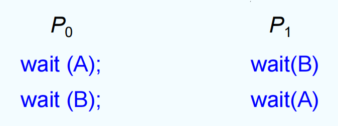
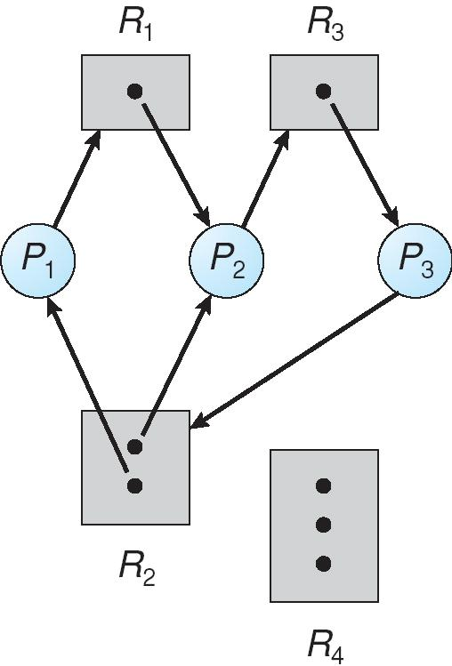
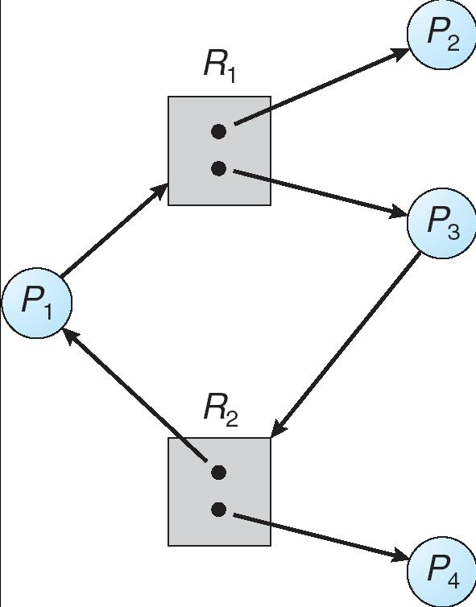
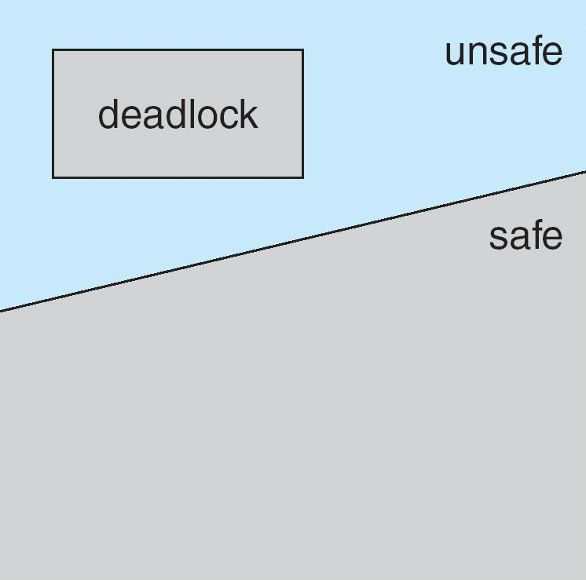
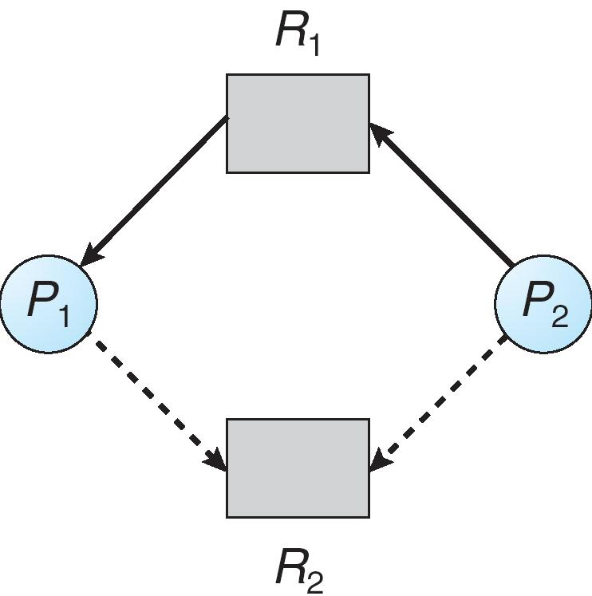
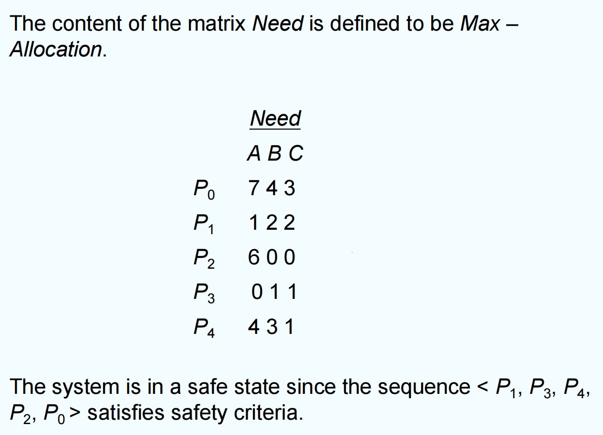
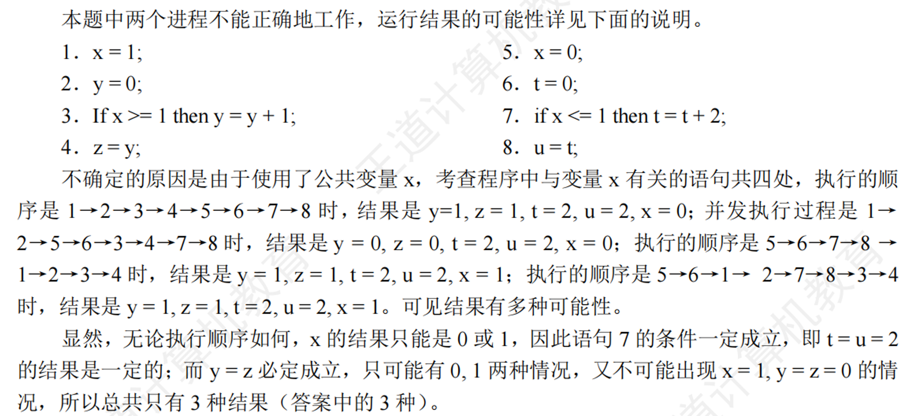

# Chapter 7 | Deadlocks

## The Deadlock Problem

A set of blocked processes each holding a resource and waiting to acquire a resource held by another process in the set.

死锁是指一组被阻塞的进程，每个进程都持有某个资源，同时又在等待被其他进程持有的资源。由于大家都在等待别人释放资源，导致所有进程都无法继续执行。

Example

- System has 2 disk drives.
- $P_1$ and $P_2$ each hold one disk drive and each needs another one.

系统有2个磁盘驱动器。进程 $P_1$ 和 $P_2$ 各自持有一个磁盘驱动器，并且都需要另一个磁盘驱动器才能继续。结果，两个进程都在等待对方释放资源，导致死锁。

Example

semaphores A and B, initialized to 1

---

### Bridge Crossing Example

Traffic only in one direction.

Each section of a bridge can be viewed as a resource.

桥的每一段可以看作一个资源。

If a deadlock occurs, it can be resolved if one car backs up (preempt resources and rollback).

如果桥上车辆只允许单向通行，多个车辆同时进入不同段，互相等待对方让路，就会死锁。

Several cars may have to be backed up if a deadlock occurs.

解决方法：让某些车倒退（资源抢占和回滚）。

Starvation is possible.

但可能出现饥饿（某些车长期无法过桥）。

---

## System Model

Resource types $R_1, R_2, \ldots, R_m$

系统有多种资源类型， $R_1, R_2, \ldots, R_m$ 。

- *CPU cycles, memory space, I/O devices*

Each resource type $R_i$ has $W_i$ instances.

Each process utilizes a resource as follows:

- request
- use
- release

进程对资源的操作分为三步：

- 请求（request）
- 使用（use）
- 释放（release）

---

## Deadlock Characterization

Deadlock can arise if four conditions hold **simultaneously**.

- **Mutual exclusion**: only one process at a time can use a resource.
- **互斥**: 每次只能有一个进程占用某个资源，其他进程不能同时使用该资源。
- **Hold and wait**: a process holding at least one resource is waiting to acquire additional resources held by other processes.
- **占有并等待**: 一个进程至少持有一个资源，同时又在等待其他进程持有的资源。
- **No preemption**: a resource can be released only voluntarily by the process holding it, after that process has completed its task.
- **不可剥夺**: 资源只能由持有它的进程主动释放，不能被其他进程强制剥夺。
- **Circular wait**: there exists a set { $P_0$ , $P_1, …, P_n$ } of waiting processes such that $P_0$ is waiting for a resource that is held by $P_1$, $P_1$ is waiting for a resource that is held by $P_2$ , … , $P_{n-1}$ is waiting for a resource that is held by $P_n$ , and $P_n$ is waiting for a resource that is held by $P_0$.
- **循环等待**: 存在一个进程集合 { $P_0$ , $P_1, …, P_n$ } ，其中 $P_0$ 正在等待 $P_1$ 持有的资源，$P_1$ 正在等待 $P_2$ 持有的资源，…，$P_{n-1}$ 正在等待 $P_n$ 持有的资源，而 $P_n$ 正在等待 $P_0$ 持有的资源。

---

### Resource-Allocation Graph

A set of vertices V and a set of edges E.

V is partitioned into two types:

- P = { $P_1, P_2, …, P_n$ } , the set consisting of all the processes in the system.
- R = { $R_1, R_2, …, R_m$ } , the set consisting of all resource types in the system.

request edge – directed edge $(P_i \to R_j)$

assignment edge – directed edge $(R_j \to P_i)$

**Example of a Resource Allocation Graph**

**资源状态**：

* $R_1$：1 个实例。
* $R_2$：2 个实例。
* $R_3$：1 个实例。
* $R_4$：3 个实例。

**当前分配与请求情况**：

* **$P_1$**：持有 $R_2$ 的一个实例，正在请求 $R_1$。
* **$P_2$**：持有 $R_1$ 和 $R_2$ 各一个实例，正在请求 $R_3$。
* **$P_3$**：持有 $R_3$ 的一个实例，无其他请求。

**分析**：

* 我们可以看到图中**不存在环路 (Cycle)**。
* $P_3$ 拥有它需要的所有资源，可以运行直至结束并释放 $R_3$。
* 一旦 $R_3$ 释放，它可以被分配给 $P_2$，从而让 $P_2$ 完成运行并释放 $R_1$ 和 $R_2$。
* 最后，$P_1$ 可以获得 $R_1$ 并完成运行。
* **结论**：因为图中没有环路，所以系统处于安全状态，**不存在死锁**。

**Resource Allocation Graph With A Deadlock**

**主要变化**：
    
* 增加了一条从 **$P_3$ 指向 $R_2$** 的请求边 ($P_3 \to R_2$)。这意味着 $P_3$ 不再能直接完成，它现在需要 $R_2$ 才能继续。

**分析**：

* 这导致图中出现了**环路**。具体的环路有两条：

1.  $P_1 \to R_1 \to P_2 \to R_3 \to P_3 \to R_2 \to P_1$
2.  $P_2 \to R_3 \to P_3 \to R_2 \to P_2$

**为什么这是死锁？**

* $P_1$ 在等待 $R_1$（被 $P_2$ 占用）。
* $P_2$ 在等待 $R_3$（被 $P_3$ 占用）。
* $P_3$ 在等待 $R_2$（被 $P_1$ 和 $P_2$ 占用）。
* 所有涉及的资源（$R_1, R_3$）或者是单实例的，或者（如 $R_2$）其实例已经被环路内的进程完全占用。

* **结论**：进程 $P_1, P_2, P_3$ 陷入了循环等待，且没有任何外力能打破这个循环，因此系统处于**死锁状态**。

**Graph With A Cycle But No Deadlock**

**资源状态**：

* $R_1$：2 个实例。
* $R_2$：2 个实例。

**当前分配与请求情况**：

* $P_1$ 请求 $R_1$。
* $P_3$ 请求 $R_2$。
* $R_1$ 分配给了 $P_2$ 和 $P_3$。
* $R_2$ 分配给了 $P_1$ 和 $P_4$。

**分析**：

* **存在环路**：$P_1 \to R_1 \to P_3 \to R_2 \to P_1$。
* 尽管有环路，但我们需要观察参与环路之外的进程（$P_2$ 和 $P_4$）：

1. **$P_2$** 持有 $R_1$ 的一个实例，且没有请求其他资源。它大概率会运行结束并释放 $R_1$。
2. **$P_4$** 持有 $R_2$ 的一个实例，且没有请求其他资源。它大概率会运行结束并释放 $R_2$。

* 一旦 $P_4$ 完成并释放 $R_2$，该资源就可以分配给 $P_3$，打破了 $P_3$ 的等待。$P_3$ 完成后释放 $R_1$，进而满足 $P_1$ 的需求。
* **结论**：虽然存在环路，但由于资源有多个实例，且有环路外的进程（$P_2, P_4$）能够释放资源打破循环，所以系统**没有死锁**。

???+ example "questioin"
    系统的资源分配图在下列情况下，无法判断是否处于死锁状态的有()。
    
    I.出现了环路 Ⅱ.没有环路 Ⅲ.每种资源只有一个，并出现环路 IV.每个进程节点至少有一条请求边
    
    A.I、Ⅱ、Ⅲ、IV    B.I、Ⅲ、IV    C.I、IV    D.以上答案都不正确

??? note "answer"
    **I. 出现了环路**

    * **分析**：仅仅知道“出现了环路”这一信息，我们无法确定每种资源的实例数量（是单实例还是多实例）。

    * **结论**：因为信息不足（不知道资源实例数），所以**无法判断**是否处于死锁状态。

    **II. 没有环路**

    * **分析**：根据基本定理，只要资源分配图中不存在环路，系统就绝对不会发生死锁。

    * **结论**：我们可以**确定**系统**不处于**死锁状态。

    **III. 每种资源只有一个，并出现环路**

    * **分析**：这是死锁的充分条件。在单实例资源的情况下，环路的存在意味着循环等待链已经形成，且没有额外的资源实例来打破这个循环。

    * **结论**：我们可以**确定**系统**处于**死锁状态。

    **IV. 每个进程节点至少有一条请求边**

    * **分析**：这只说明每个进程都在请求资源（都在“想要”东西）。

    * 情况 A：进程 $P_1$ 请求资源 $R_1$，而 $R_1$ 是空闲的。这很正常，不是死锁。
    * 情况 B：进程 $P_1$ 请求 $R_1$（被 $P_2$ 占），$P_2$ 请求 $R_2$（被 $P_1$ 占）。这是死锁。

    * 仅仅知道“有请求边”并不能告诉我们图中是否形成了**环路**，也不能告诉我们资源是否足够分配。

    * **结论**：信息严重不足，**无法判断**是否处于死锁状态。

---

#### Basic Facts

If graph contains no cycles $\Rightarrow$ no deadlock

如果图中没有环路，则一定没有死锁。

If graph contains a cycle $\Rightarrow$

- if only one instance per resource type, then deadlock. 每种资源只有一个实例时，有环路则一定死锁。
- if several instances per resource type, possibility of deadlock. 每种资源有多个实例时，有环路则可能死锁。

---

#### Methods for Handling Deadlocks

Ensure that the system will **never** enter a deadlock state.

保证系统永远不会进入死锁状态。

Allow the system to enter a deadlock state and then recover.

允许系统进入死锁状态，然后进行恢复

Ignore the problem and pretend that deadlocks never occur in the system; used by most operating systems, including UNIX.

忽略死锁问题，假装死锁不会发生。因为一旦发生死锁，相关进程会永久阻塞，此时就会有人工干预（如重启进程或系统）解决。

---

## Deadlock Prevention

Restrain the ways request can be made.

通过破坏死锁的四个必要条件之一，让系统永远不会进入死锁状态。

1. **Mutual Exclusion** – not required for sharable resources; must hold for nonsharable resources.

尽量减少互斥资源的数量，但对于本质上不可共享的资源，互斥条件无法避免。

2. **Hold and Wait** – must guarantee that whenever a process requests a resource, it does not hold any other resources.

- Require process to request and be allocated all its resources before it begins execution, or allow process to request resources only when the process has none (release all current resources before requesting any additional ones).
- 要么要求进程在开始执行前一次性申请并获得所有需要的资源；要么要求进程在申请新资源前，先释放已持有的所有资源。
- Low resource utilization; starvation possible. (example: copy data from DVD drive to a disk file, sorts the file, then prints the results to a printer.)
- 这样做会导致资源利用率低，进程可能长期等待，甚至出现饥饿。例如：一个进程需要先从DVD读数据，再写到磁盘，最后打印结果，如果必须一次性申请所有资源，可能导致资源长时间被占用但未充分利用。

3. **No Preemption** –

- If a process that is holding some resources requests another resource that cannot be immediately allocated to it, then all resources currently being held are released.
- 如果进程持有资源并请求新资源时，新资源无法立即分配，则强制收回该进程已持有的所有资源。
- Preempted resources are added to the list of resources for which the process is waiting.
- 被收回的资源加入进程等待队列。
- Process will be restarted only when it can regain its old resources, as well as the new ones that it is requesting.
- 进程只有在能一次性获得所有资源时才会被重新启动。

这样可以打破不可剥夺条件，但实现复杂，可能影响进程执行的连续性。

4. **Circular Wait** – impose a **total ordering** of all resource types, and require that each process requests resources in an increasing order of enumeration.

- F(tape drive)=1
- F(disk drive)=5
- F(printer)=12

给所有资源类型规定一个全局顺序（如磁带机=1，磁盘=5，打印机=12）。要求进程只能按顺序递增的方式申请资源，即只能先申请编号小的资源，再申请编号大的资源。

这样可以避免形成环路，从而防止死锁。

---

## Deadlock Avoidance

Requires that the system has some additional a **priori** information available.

死锁避免不是一开始就禁止所有可能导致死锁的行为，而是在资源分配过程中动态判断，只要有可能导致死锁的分配就拒绝，保证系统始终处于“安全状态”。

系统需要提前获得一些额外信息（a priori information），比如每个进程可能需要的最大资源数量。

- Simplest and most useful model requires that each process declares the **maximum number** of resources of each type that it may need.
- 每个进程在开始时，必须声明自己可能需要的每种资源的最大数量。
- The deadlock-avoidance algorithm **dynamically** examines the resource-allocation state to ensure that there can never be a circular-wait condition.
- 每当有进程请求资源时，系统会动态检查当前资源分配状态（包括可用资源、已分配资源、各进程最大需求）。判断如果满足该请求后，系统是否还处于“安全状态”——即所有进程最终都能获得所需资源并顺利完成。
- Resource-allocation **state** is defined by the number of available and allocated resources, and the maximum demands of the processes.
- 死锁避免算法会确保不会出现循环等待（即不会形成死锁的环路）。如果某次资源分配会导致系统进入不安全状态（可能死锁），则拒绝该分配请求。

---

### Safe State

When a process requests an available resource, system must decide if immediate allocation leaves the system in a safe state.

当一个进程请求资源时，系统必须判断：如果立即分配这些资源，系统是否还处于安全状态？

安全状态的定义：存在一个进程执行顺序，使得每个进程都能最终获得所需资源并顺利完成，不会发生死锁。

System is in **safe state** if there exists a sequence < $P_1, P_2, …, P_n$ > of all the processes such that for each $P_i$, the resources that $P_i$ can still request can be satisfied by the currently available resources plus the resources held by all the $P_j$ , with $j < i$.

假设系统有 $n$ 个进程，存在一个序列 < $P_1$ , $P_2$ , ..., $P_n$ >，满足：

- 对于每个 $P_i$，它还可能请求的资源数量，可以由当前可用资源 + 所有已完成进程释放的资源来满足。
- 换句话说， $P_i$ 即使暂时得不到资源，也可以等前面的进程 $P_j$ ($j < i$) 完成并释放资源后，最终获得所需资源。

That is:

- If $P_i$ resource needs are not immediately available, then $P_i$ can wait until all $P_j$ have finished.
- When $P_j$ is finished, $P_i$ can obtain needed resources, execute, return allocated resources, and terminate.
- When $P_i$ terminates, $P_{i+1}$ can obtain its needed resources, and so on.

1. 假设当前有一组进程和资源分配情况。
2. 找到一个进程 $P_j$ ，它所需的资源不超过当前可用资源，分配资源给它，让它执行并释放资源。
3. 更新可用资源，再找下一个满足条件的进程，重复上述过程。
4. 如果所有进程都能按某种顺序完成，则系统处于安全状态。

???+ example "question"
    下列关于死锁的说法中，正确的有()。
    
    I.死锁状态一定是不安全状态

    II.产生死锁的根本原因是系统资源分配不足和进程推进顺序非法
    
    Ⅲ.资源的有序分配策略可以破坏死锁的循环等待条件
    
    IV.采用资源剥夺法可以解除死锁，还可以采用撤销进程方法解除死锁
    
    A.I、Ⅲ   B.Ⅱ   C.IV   D.四个说法都对

??? note "answer"
    D

    选项 I 正确。
    
    选项 II 正确:这是产生死锁的两大原因。
    
    选项 Ⅲ 正确:在对资源进行有序分配时，进程间不可能出现环形链，即不会出现循环等待。
    
    选项 IV 正确:资源剥夺法允许一个进程强行剥夺其他进程占有的系统资源。而撤销进程强行释放一个进程已占有的系统资源，与资源剥夺法同理，都通过破坏死锁的“请求和保持”条件来解除死锁，所以选择选项 D。

---

#### Basic Facts

If a system is in safe state $\Rightarrow$ no deadlock

如果系统处于安全状态 $\Rightarrow$ 不会发生死锁

If a system is in unsafe state $\Rightarrow$ possibility of deadlock

如果系统处于不安全状态 $\Rightarrow$ 可能发生死锁

Avoidance $\Rightarrow$ ensure that system will never enter an unsafe state

通过动态资源分配算法，确保系统永远不会进入不安全状态，从而避免死锁的发生。

---

### Avoidance algorithms

Single instance of a resource type. Use a resource-allocation graph

单实例资源类型用**资源分配图**（Resource-Allocation Graph）检测是否有环路，避免死锁。

Multiple instances of a resource type. Use the banker’s algorithm

多实例资源类型用**银行家算法**（Banker's Algorithm）检测系统是否处于安全状态，避免死锁。

---

#### Resource-Allocation Graph Scheme

Claim edge $P_i \Rightarrow R_j$ indicated that process $P_j$ may request resource $R_j$; represented by a dashed line.

虚线（dashed line）表示进程 $P_i$ 可能将来会请求资源 $R_j$ ，但当前还没有实际请求。用于提前声明潜在的资源需求，系统可以据此判断未来的资源分配是否安全。

**Claim edge** converts to **request edge** when a process requests a resource.

当进程 $P_i$ 实际请求资源 $R_j$ 时，声明边变为请求边（实线，$P_i \Rightarrow R_j$）。表示进程正在等待资源分配。

**Request edge** converted to an **assignment edge** when the resource is allocated to the process.

当资源 $R_j$ 分配给进程 $P_i$ 时，请求边变为分配边（实线，$R_j \Rightarrow P_i$）。表示资源已经被进程占用。

When a resource is released by a process, **assignment edge** reconverts to a **claim edge**.

分配边变回声明边（虚线，$P_i \Rightarrow R_j$）。进程释放资源后，表示将来还可能再次请求。 

Resources must be claimed a **priori** in the system.

所有进程必须在系统中提前声明自己可能会请求哪些资源。这样系统才能在资源分配时动态判断是否安全，避免死锁。

**Resource-Allocation Graph**

**Unsafe State In Resource-Allocation Graph**

- 如果把 $P_2$ 和 $R_1$ 之间的分配边变为请求边，系统依然是不安全状态，因为此时还是会形成环路（例如 $P_2$ 和 $P_1$ 同时发出请求）。
- 所以只要有环路，那么就是不安全状态。

---

##### Resource-Allocation Graph Algorithm

Suppose that process $P_i$ requests a resource $R_j$

将请求边（ $P_i \Rightarrow R_j$ ）转换为分配边（ $R_j \Rightarrow P_i$ ）, 即假设资源分配成功。

The request can be granted only if converting the request edge to an assignment edge does not result in the formation of a cycle in the resource allocation graph

检查资源分配图是否形成环路：

- 如果没有环路，说明分配后系统仍处于安全状态，可以满足所有进程的需求，允许分配。
- 如果出现环路，说明分配后可能导致死锁，拒绝本次分配请求。

---

#### Banker's Algorithm

Assumptions

- Multiple instances. 资源有多个实例（如多个打印机、磁盘等）。
- Each process must a priori claim maximum use. 每个进程必须提前声明最大资源需求（a priori claim）。
- When a process requests a resource it may have to wait. 进程请求资源时可能需要等待（如果暂时没有足够资源）。
- When a process gets all its resources it must return them in a finite amount of time. 进程获得所有资源后，必须在有限时间内归还资源（即最终会释放）。

---

##### Data Structures for the Banker's Algorithm

Let n = number of processes, and m = number of resources types.

假设有 n 个进程，m 种资源类型：

- **Available**: Vector of length m. If available [j] = k, there are k instances of resource type $R_j$ available.
- Available：长度为 m 的向量。Available[j]=k 表示资源 $R_j$ 还有 k 个可用实例。
- **Max**: $n \times m$ matrix. If Max [i,j] = k, then process $P_i$ may request at most k instances of resource type $R_j$.
- Max：n 行 m 列的矩阵。Max[i,j]=k 表示进程 $P_i$ 最多可能请求 k 个 $R_j$ 资源实例。
- **Allocation**: $n \times m$ matrix. If Allocation[i,j] = k then $P_i$ is currently allocated k instances of $R_j$.
- Allocation：n 行 m 列的矩阵。Allocation[i,j]=k 表示进程 $P_i$ 当前已经分配了 k 个 $R_j$ 资源实例。
- **Need**: $n \times m$ matrix. If Need[i,j] = k, then $P_i$ may need k more instances of $R_j$ to complete its task.
- Need：n 行 m 列的矩阵。Need[i,j]=k 表示进程 $P_i$ 还可能需要 k 个 $R_j$ 资源实例才能完成任务。

Need [i,j] = Max[i,j] – Allocation [i,j].

---

##### Safety Algorithm 

这个算法是给 OS 用的，用来判断系统是否处于安全状态。

1. Let Work and Finish be vectors of length m and n, respectively. Initialize:

初始化：

Work = Available （当前可用资源）

Finish [i] = false for i = 0, 1, …, n- 1. （每个进程是否已完成）

2. Find an i such that both:

在所有未完成的进程中，寻找一个 $P_i$ ，满足：

(a) Finish [i] = false 

(b) $Need_i \leq$ Work. （即 $P_i$ 所需资源不超过当前可用资源）

(c) If no such i exists, go to step 4. （如果找不到这样的进程，跳到步骤4）

3. 如果找到这样的 $P_i$ ：

Work = Work + $Allocation_i$

模拟 $P_i$ 运行完释放资源

Finish[i] = true

go to step 2.

回到步骤2，继续寻找下一个进程

4. If Finish [i] == true for all i, then the system is in a safe state.

如果所有进程 Finish[i] == true，则系统安全；否则不安全。

---

##### Resource-Request Algorithm for Process $P_i$

当进程 $P_i$ 请求资源时，系统如何判断是否可以分配：

Request = request vector for process $P_i$. If Request[i] [j] = k then process $P_i$ wants k instances of resource type $R_j$.

1. If $Request_i \leq Need_i$ go to step 2. Otherwise, raise error condition, since process has exceeded its maximum claim.
2. If $Request_i \leq Available$, go to step 3. Otherwise $P_i$ must wait, since resources are not available.
3. Pretend to allocate requested resources to $P_i$ by modifying the state as follows:

- Available = Available – Request;
- $Allocation_i$ = $Allocation_i$ + $Request_i$;
- $Need_i$ = $Need_i$ – $Request_i$;

If safe $\Rightarrow$ the resources are allocated to $P_i$

If unsafe $\Rightarrow$ $P_i$ must wait, and the old resource-allocation state is restored

1. 检查请求是否合法：

- 如果 `Request[i] > Need[i]` ，报错（请求超出最大声明）。

2. 检查资源是否足够：

- 如果 `Request[i] > Available` ，进程必须等待（资源不足）。

3. 假设分配（试探性分配）：

- `Available = Available – Request[i];`
- `Allocation[i] = Allocation[i] + Request[i];`
- `Need[i] = Need[i] – Request[i];`

4. 用安全性算法判断分配后系统是否安全：

- 如果安全，正式分配资源给进程 $P_i$ 。
- 如果不安全，撤销分配，恢复原状态，进程 $P_i$ 必须等待。

!!! info
    等着的时候应该是进入阻塞状态，等待资源变得可用。

    如果所有的进程都进入等待状态，那么系统就会进入死锁状态。

    每次进程发出 request 请求时，系统都会调用资源请求算法，判断是否可以分配资源。

---

##### Example of Banker's Algorithm

$P_4$ 能否被授予 (3,3,0) 的请求？

1. 检查请求是否合法： (3,3,0) ≤ (4,3,2) 合法。
2. 检查资源是否足够： (3,3,0) $\ge$ (2,3,0) 不足够。

$P_4$ 的请求 (3,3,0) 不能被立即满足，必须等待。

$P_0$ 能否被授予 (0,2,0) 的请求？

1. 检查请求是否合法： (0,2,0) ≤ (7,5,3) 合法。
2. 检查资源是否足够： (0,2,0) ≤ (2,3,0) 足够。
3. 假设分配：

- Available = (2,3,0) – (0,2,0) = (2,1,0)
- Allocation[0] = (0,1,0) + (0,2,0) = (0,3,0), Need[0] = (7,5,3) – (0,3,0) = (7,2,3)

4. 用安全性算法判断分配后系统是否安全：

- 选择 $P_1$：Need[1] = (0,2,0) ≤ Available = (2,1,0) 不满足。
- 选择 $P_2$：Need[2] = (6,0,0) ≤ Available = (2,1,0) 不满足。
- 选择 $P_3$：Need[3] = (0,1,1) ≤ Available = (2,1,0) 不满足。
- 选择 $P_4$：Need[4] = (4,3,1) ≤ Available = (2,1,0) 不满足。

无法找到任何进程满足条件，系统不安全。所以 $P_0$ 的请求 (0,2,0) 不能被满足，必须等待。

---

## Deadlock Detection

Allow system to enter deadlock state

Detection algorithm

Recovery scheme

死锁检测允许系统进入死锁状态，然后通过算法检测死锁，再采取恢复措施。

检测算法分为两类：单实例资源和多实例资源。

---

### Single Instance of Each Resource Type

Maintain **wait-for** graph

等待图（Wait-for Graph）

- Nodes are processes. 每个进程是一个节点。
- $P_i \to P_j$ if $P_i$ is waiting for $P_j$. 如果 $P_i$ 正在等待 $P_j$ 释放资源，则有一条 $P_i \Rightarrow P_j$ 的有向边。

Periodically invoke an algorithm that searches for a cycle in the graph. If there is a cycle, there exists a deadlock.

检测方法：周期性地检查等待图中是否有环路（cycle）。

- 有环路 $\Rightarrow$ 存在死锁。
- 无环路 $\Rightarrow$ 无死锁。

An algorithm to detect a cycle in a graph requires an order of $n^2$ operations, where n is the number of vertices in the graph.

复杂度：检测环路的算法复杂度为 $O(n^2)$ ， n 是进程数。

---

#### Resource-Allocation Graph and Wait-for Graph

(a) Resource-Allocation Graph 

(b) Corresponding wait-for graph

---

### Several Instances of a Resource Type

Available: A vector of length m indicates the number of available resources of each type.

Available：长度为 m 的向量，表示每种资源当前可用实例数。

Allocation: An $n \times m$ matrix defines the number of resources of each type currently allocated to each process.

Allocation：n 行 m 列的矩阵，表示每个进程当前已分配的每种资源实例数。

Request: An $n \times m$ matrix indicates the current request of each process. If Request [$i_j$] = k, then process $P_i$ is requesting k more instances of resource type. $R_j$.

Request：n 行 m 列的矩阵，表示每个进程当前请求的每种资源实例数。

---

### Detection Algorithm

1. Let Work and Finish be vectors of length m and n, respectively Initialize:

初始化：

- Work = Available
- For i = 1,2, …, n, if $Allocation_i \neq$ 0, then Finish[i] = false; otherwise, Finish[i] = true.

对每个进程 i，如果 $Allocation_i \neq 0$ ，则 Finish[i]=false；否则 Finish[i]=true。

2. Find an index i such that both:

- Finish[i] = false
- $Request_i \leq$ Work

找到一个 i，使得 Finish[i] = false 且 $Request_i \leq$ Work。

If no such i exists, go to step 4.

如果找不到，跳到步骤4。

3. 

- Work = Work + $Allocation_i$; 
- Finish[i] = true; 
- go to step 2.

模拟进程 i 运行完释放资源，更新 Work 和 Finish，然后回到步骤2。

!!! info
    这里 Finish[i] = true 并不意味着进程结束了，因为这个进程后续可能还会继续运行并请求资源。

4. If Finish[i] == false, for some i, 1 $\leq i \leq n$, then the system is in deadlock state. Moreover, if Finish[i] == false, then $P_i$ is deadlocked.

如果存在某个 i 使得 Finish[i] == false，则系统处于死锁状态，进程 $P_i$ 也处于死锁状态。

Algorithm requires an order of O($m \times n^2$) operations to detect whether the system is in deadlocked state.

复杂度：检测死锁的算法复杂度为 $O(m \times n^2)$ ， m 是资源类型数， n 是进程数。

---

### Example of Detection Algorithm

系统安全，无死锁，存在安全序列。

$P_2$ 请求一个额外的 C 型资源后，系统进入死锁状态。$P_1$ , $P_2$ , $P_3$ , $P_4$ 均无法完成。

---

### Detection-Algorithm Usage

When, and how often, to invoke depends on:

何时、多久检测一次死锁？

- How often a deadlock is likely to occur? 死锁发生的可能性有多大？
- How many processes will need to be rolled back? one for each disjoint cycle 一旦发生死锁，需要回滚多少进程？（每个独立环路都要回滚一个进程）

If detection algorithm is invoked arbitrarily, there may be many cycles in the resource graph and so we would not be able to tell which of the many deadlocked processes “caused” the deadlock.

如果随意调用检测算法，可能会有多个环路（多个死锁组），这时很难判断到底是哪些进程“引起”了死锁。

---

## Recovery from Deadlock

### Recovery from Deadlock: Process Termination

Abort **all** deadlocked processes.

终止所有死锁进程：简单粗暴，代价大，所有相关进程的工作都丢失。

Abort **one** process at a time until the deadlock cycle is eliminated.

逐个终止进程，直到死锁消除：每次终止一个进程，检测死锁是否解除，直到系统恢复正常。

In which order should we choose to abort?

选择终止哪个进程的考虑因素：

- Priority of the process. 进程优先级
- How long process has computed, and how much longer to completion. 进程已运行时间和剩余时间
- Resources the process has used. 进程已使用的资源量
- Resources process needs to complete.进程还需使用的资源量
- How many processes will need to be terminated. 需要终止的进程数量
- Is process interactive or batch? 进程类型（交互式/批处理）

---

### Recovery from Deadlock: Resource Preemption

Selecting a victim – minimize cost.

选择“受害者”进程，强制回收其资源，分配给其他进程，解除死锁。最小化代价。

Rollback – return to some safe state, restart process for that state.

回滚（Rollback）：将被抢占的进程回退到某个安全状态，重新运行。

Starvation – same process may always be picked as victim, include number of rollback in cost factor.

防止饥饿：同一个进程不能总是被选为受害者，通常会统计回滚次数，避免某进程长期得不到资源。

---

???+ example "question"
    下面是并发进程的程序代码，正确的是()。

    

    A.进程不会死锁，也不会“饥饿”
    
    B.进程不会死锁，但是会“饥饿”
    
    C.进程会死锁，但是不会“饥饿”
    
    D.进程会死锁，也会“饥饿”

??? note "answer"
    B

    遇到这种问题时千万不要慌张，下面我们来慢慢分析，给读者一个清晰的解题过程:仔细考察程序代码，可以看出这是一个扩展的单行线问题。也就是说，某单行线只允许单方向的车辆通过，在单行线的入口设置信号量 y，在告示牌上显示某一时刻各方向来车的数量 c1 和c2，要修改告示牌上的车辆数量必须互斥进行，为此设置信号量 x1 和 x2。若某方向的车辆需要通过时，则首先要将该方向来车数量 c1或 c2增加 1，并查看自己是否是第一个进入单行线的车辆，若是，则获取单行线的信号量 y，并进入单行线。通过此路段以后出单行线时，将该方向的车辆数 c1 或 c2 减 1(当然是利用 x1 或x2 来互斥修改)，并査看自己是否是最后一辆车，若是,则释放单行线的互斥量 y，否则保留信号量 y，让后继车辆继续通过。双方的操作如出一辙。考虑出现一个极端情况，即当某方向的车辆首先占据单行线并后来者络绎不绝时，另一个方向的车辆就再没有机会通过该单行线了。而这种现象是由于算法本身的缺陷造成的，不属于因为特殊序列造成的饥饿，所以它是真正的饥饿现象。因为有信号量的控制，所以死锁的可能性没有了(双方同时进入单行线，在中间相遇，造成双方均无法通过的情景)。

    ① 假设 $P_1$ 进程稍快， $P_2$ 进程稍慢，同时运行;
    
    ② $P_1$ 进程首先进入 if 条件语句，因此获得了 y 的互斥访问权， $P_2$ 被阻塞;
    
    ③在第一个 $P_1$ 进程未释放 y 之前，又有另一个 $P_1$ 进入，c1 的值变成 2,当第一个 $P_1$ 离开时， $P_2$ 仍然被阻塞，这种情形不断发生;
    
    ④在这种情况下会发生什么事? $P_1$ 顺利执行， $P_2$ 很郁闷，长期被阻塞。
    
    综上所述，不会发生死锁，但会出现饥饿现象。因此选 B。

???+ example "question"
    有两个并发进程，对于如下这段程序的运行，正确的说法是()。

    

    A.程序能正确运行，结果唯一
    
    B.程序不能正确运行，可能有两种结果
    
    C.程序不能正确运行，结果不确定
    
    D.程序不能正确运行，可能死锁

??? note "answer"
    C

    

---