# Chapter 8 | Main Memory

## Background

Program must be brought (from disk) into memory and placed within a process for it to be run

- 程序最初存储在磁盘（硬盘）上，不能直接运行。要运行程序，必须先把它从磁盘加载到主存（RAM），并分配到一个进程空间。只有在主存中的程序，CPU才能直接访问和执行。

Main memory and registers are only storage CPU can access directly

- 寄存器和主存是CPU能直接访问的唯一存储。

Register access in one CPU clock (or less)

- 寄存器：速度最快，CPU每个时钟周期都能访问，容量极小（几十到几百字节）。

Main memory can take many cycles

- 主存：容量大得多，但访问速度比寄存器慢很多，可能需要多个时钟周期。

Cache sits between main memory and CPU registers

- 缓存位于主存和寄存器之间，是一种高速缓冲存储器。

Protection of memory required to ensure correct operation

- 多进程系统中，多个程序同时运行，可能会访问同一块主存。如果没有保护机制，一个进程可能会错误地修改或读取另一个进程的数据，导致系统崩溃或数据泄露。操作系统通过内存保护机制（如地址空间隔离、权限检查），确保每个进程只能访问自己的内存区域，保证系统安全和稳定。

---

## Memory Hierarchy

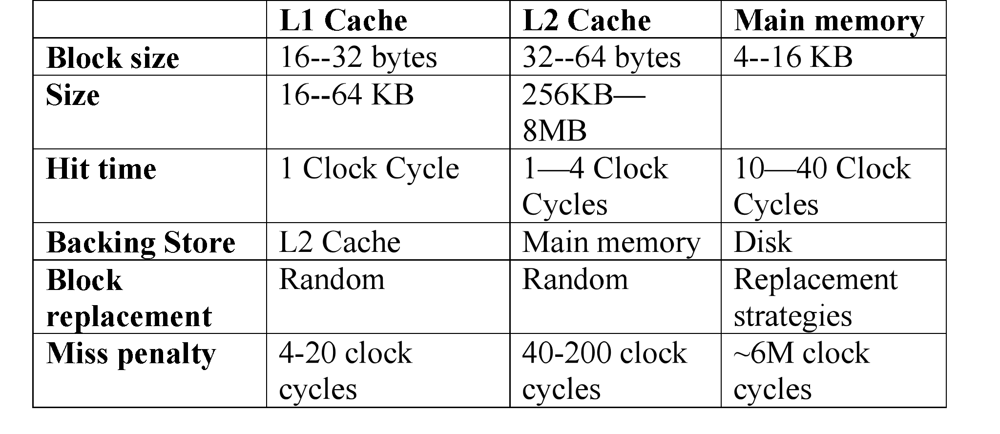

---

## Base and Limit Registers

A pair of base and limit registers define the logical address space

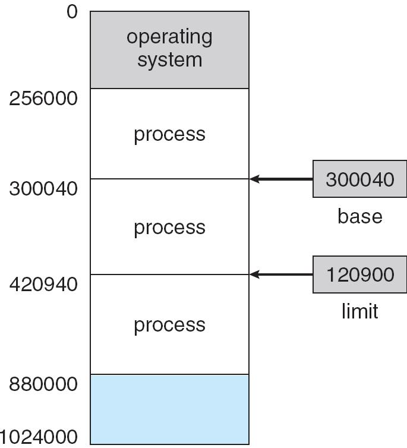

- 基址寄存器（Base Register）：存储当前进程在主存中的起始地址（如图中的 300040）。
- 界限寄存器（Limit Register）：存储当前进程可用内存的长度（如图中的 120900）。

这两个寄存器一起定义了进程的逻辑地址空间，即进程能访问的主存范围。

进程发出的地址是“逻辑地址”（从0开始），需要加上基址寄存器的值，转换为主存中的“物理地址”。如果进程访问的逻辑地址超过界限寄存器的值（如大于 120900），操作系统会阻止访问，防止进程越界访问其他进程或操作系统的内存。

---

### Addresses Given in Different Ways

- `program` : Symbolic Address: Addresses in the source program are generally symbolic (such as the variable count).
- 在源代码中，变量或函数的名字就是符号地址。符号地址是人类可读的，编译器还没分配具体内存位置时使用。
- `compiler` : Relocatable Addresses: A compiler typically binds these symbolic addresses to relocatable addresses (such as “14 bytes from the beginning of this module”).
- 编译器把符号地址转换为相对于某个基准的偏移量，比如“从模块起始地址算起第14字节”。可重定位地址不是最终的物理地址，而是相对地址，方便程序在不同内存位置加载。
- `linker` : Absolute Addresses: The linker or loader binds the relocatable addresses to absolute addresses (such as 74014).
- 链接器或加载器把可重定位地址转换为主存中的实际物理地址，比如 74014。绝对地址是程序最终在内存中的位置，CPU直接访问。

---

## Multistep Processing of a User Program

A **compiler** is a computer program (or set of programs) that transforms source code written in a computer language (the **source language**) into another computer language (the **target language**, often having a binary form known as **object code**).

把你写的源代码（如C、Java等）翻译成另一种语言，通常是机器能理解的“目标代码”（object code），比如二进制文件。编译器只负责单个源文件的翻译，生成的目标代码里地址是“可重定位的”，还不能直接运行。

A **linker** or **linkage editor** is a program that takes one or more objects generated by a compiler and combines them into a single executable program.

把编译器生成的一个或多个目标文件（object files）以及需要的库文件，组合成一个完整的可执行程序（如 .exe）。链接器解决了不同模块之间的调用和数据引用，把所有代码和数据拼接到一起，分配好最终的内存地址。

A **loader** loads the .exe file into memory for execution.

把链接器生成的可执行文件（如 .exe）从磁盘加载到主存（RAM）中，为程序分配进程空间，让CPU可以直接运行。加载器负责把文件放到内存合适的位置，并初始化程序运行环境。

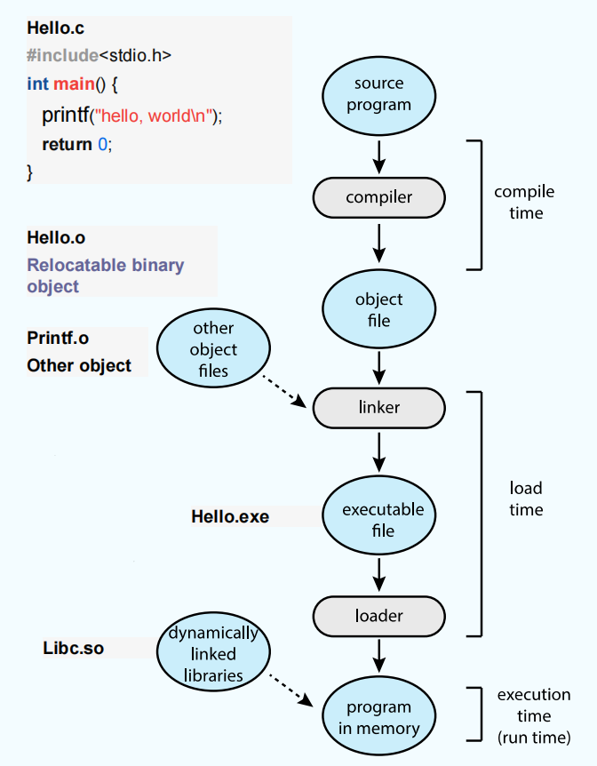

---

## Binding of Instructions and Data to Memory

Address binding of instructions and data to memory addresses can happen at three different stages

地址绑定就是把程序中的指令和数据分配到实际的内存地址。这个过程可以发生在不同的阶段。（与具体的系统有关系）。

- **Compile time**（编译时刻）: If memory location known a priori, **absolute code** can be generated; must recompile code if starting location changes
- **Load time**（装入时刻）: Must generate **relocatable code** if memory location is not known at compile time
- **Execution time**（执行时刻）: Binding delayed until run time if the process can be moved during its execution from one memory segment to another. Need hardware support for address maps (e.g., base and limit registers)

- 编译时：如果程序的内存位置在编译时就已经确定，编译器可以直接生成绝对代码，即所有地址都是最终的物理地址。缺点是如果以后程序要加载到不同的位置，必须重新编译。
- 如果编译时不知道程序会被加载到哪里，编译器生成可重定位代码，即地址是相对的（偏移量）。当程序被加载到内存时，加载器会根据实际起始地址，把所有相对地址转换为绝对地址。好处是程序可以灵活地加载到不同内存位置，无需重新编译。
- 执行时：如果程序在运行过程中可能会被移动（比如分段、分页、虚拟内存），地址绑定会延迟到运行时。每次CPU访问内存时，硬件会把逻辑地址转换为物理地址。好处是程序可以在运行时自由移动，支持高级内存管理（如虚拟内存、多进程隔离）。但是需要硬件支持地址映射，比如基址和界限寄存器、页表等。

---

### Logical vs.Physical Address Space

The concept of a logical address space that is bound to a separate physical address space is central to proper memory management

- **Logical** address – generated by the CPU; also referred to as virtual address 也叫虚拟地址（Virtual Address），是CPU生成的地址，程序员在代码中看到和使用的地址。
- **Physical** address – address seen by the memory unit 是内存单元实际的地址，即主存（RAM）芯片上的真实位置，只有内存硬件能看到。

**Logical** and **physical** addresses are the **same** in compile-time and load-time address-binding schemes;

编译时和装入时绑定逻辑地址和物理地址是一样的。也就是说，CPU生成的地址就是内存的实际地址。这种方式下，程序一旦被编译或装入，内存位置就固定了，不能再移动。

**Logical** (virtual) and **physical** addresses **differ** in execution-time address-binding scheme

执行时绑定逻辑地址和物理地址不同。程序运行时，CPU生成逻辑地址，硬件（如MMU、基址寄存器、页表等）会把逻辑地址动态转换为物理地址。这样，程序可以被加载到内存的任意位置，甚至在运行过程中可以被移动（如虚拟内存、分页、分段等）。

---

## Memory-Management Unit(Mmu)

Hardware device that maps virtual to physical address

MMU（内存管理单元）是一种硬件设备，负责把虚拟地址（逻辑地址）转换为物理地址。

In MMU scheme, the value in the relocation register is added to every address generated by a user process at the time it is sent to memory

用户程序在运行时，所有访问内存的操作（如读写变量、调用函数等）用的都是逻辑地址（虚拟地址）。MMU会在每次内存访问时，把用户程序生成的逻辑地址转换为物理地址，然后再访问主存。

The user program deals with logical addresses; it never sees the real physical addresses

用户程序永远看不到物理地址，只和逻辑地址打交道。

---

### Dynamic relocation using a relocation register

- **进程隔离**：每个进程有自己的重定位寄存器，互不干扰，防止进程越界访问其他进程或操作系统的内存。
- **灵活性**：程序可以被加载到内存的任意位置，只需设置不同的重定位寄存器值，无需修改程序代码。
- **安全性**：用户程序永远看不到物理地址，只能操作自己的逻辑地址空间。

---

### Dynamic Loading

Routine is not loaded until it is called

程序中的某些子程序（routine）只有在被调用时才加载到内存。

Better memory-space utilization; unused routine is never loaded

Useful when large amounts of code are needed to handle infrequently occurring cases

**优点**：

- **节省内存空间**：不常用的代码不会占用内存，只有真正需要时才加载。
- **适合大程序或偶尔才用到的功能**（如异常处理、特殊格式解析等）。

No special support from the operating system is required implemented through program design

通常由程序员在设计时实现，不需要操作系统特殊支持。

??? note
    动态加载是在程序执行过程中才将代码载入内存。这必须依赖“**执行时绑定**”，因为 OS 必须能在运行时为这段新代码分配物理内存，并让MMU正确翻译对它的访问。

---

### Dynamic Linking

Linking postponed until **execution time**

把链接操作推迟到程序运行时（执行时）才进行，而不是在编译或装入时完成。

- Small piece of code, stub, used to locate the appropriate memory-resident library routine
- Stub replaces itself with the address of the routine, and executes the routine

实现方式：

- 程序中用一个小的“桩代码（stub）”来占位，运行时由桩代码去查找和加载真正的库函数。
- 桩代码会把自己替换成库函数的实际地址，然后跳转执行。

Operating system needed to check if routine is in processes’ memory address

操作系统负责检查库函数是否已经加载到进程的内存地址空间中。如果没有，操作系统会把库函数从磁盘加载到内存。

Dynamic linking is particularly useful for libraries

- Saves main memory space
- Reduces size of exe image file
- Relinking of new library not needed

**优点**：

- **节省内存**：多个进程可以共享同一个库代码（如DLL、so文件）。
- 可减少可执行文件体积。
- 更新库文件时无需重新链接所有程序。

System also known as **shared libraries**

??? note
    动态链接在程序加载时，将符号（如printf）绑定到了一个虚拟地址。而这个虚拟地址又会在执行时被 MMU 绑定到物理地址。动态链接也必须依赖“**执行时绑定**”。

---

## Contiguous Allocation

Main memory usually into two partitions:

- Resident operating system, usually held in low memory with interrupt vector
- User processes then held in high memory

主存被分成两个部分：一部分给操作系统（通常在低地址），另一部分给用户进程（高地址）。操作系统放在低地址，能够保证在不知道内存有多大的情况下，最大程度上依旧可以被装入。

Relocation registers used to protect user processes from each other, and from changing operating-system code and data

使用**重定位寄存器（Relocation Register）和界限寄存器（Limit Register）**保护进程内存。

- **Relocation** register contains value of smallest **physical address**
- **Limit register** contains range of logical addresses – each logical address must be less than the limit register
- MMU maps logical address **dynamically**

- **重定位寄存器**：存储进程在物理内存中的起始地址。
- **界限寄存器**：存储进程可用的逻辑地址范围。
- **MMU**（内存管理单元）动态地把逻辑地址映射为物理地址，并检查是否越界，防止进程访问操作系统或其他进程的内存。

---

### HW support for relocation and limit registers

---

**Multiple-partition allocation**

内存中有多个“空洞（hole）”，即未被分配的内存块。每当有新进程到来，操作系统会在足够大的空洞中分配内存。

- **Hole** – block of available memory; holes of various size are scattered throughout memory
- 每当进程结束或释放内存时，会产生空洞。
- When a process arrives, it is allocated memory from a hole large enough to accommodate it
- 新进程到来时，操作系统会在空洞中分配内存。
- Operating system maintains information about:
- 操作系统维护两张表格：

a) allocated partitions 被分配的分区

b) free partitions (holes) 被释放的分区

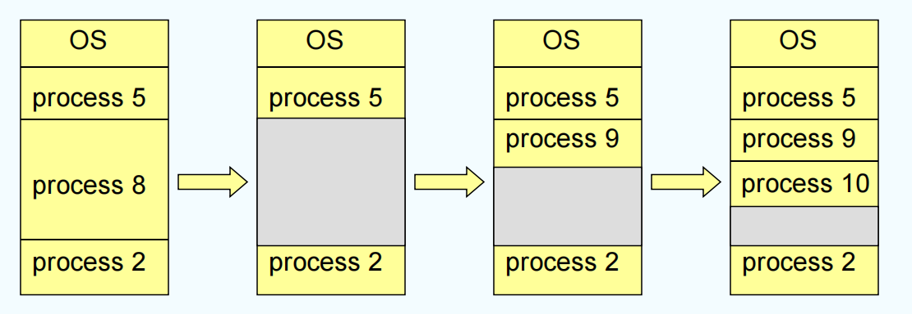

---

### Dynamic Storage-Allocation Problem

How to satisfy a request of size n from a list of free holes

内存中有很多“空洞”（holes），如何选择空洞，直接影响内存利用率和分配效率。

- **First-fit**: Allocate the first hole that is big enough
- 从头开始扫描空洞列表，找到第一个足够大的空洞就分配给请求。速度快，通常不需要遍历所有空洞。但是可能会在内存前部留下很多小碎片。
- **Best-fit**: Allocate the smallest hole that is big enough; must search entire list, unless ordered by size. Produces the smallest leftover hole
- 遍历所有空洞，找到最小的、但足够大的空洞分配给请求。剩下的空洞最小，理论上减少碎片。但是需要遍历所有空洞，速度慢；实际中会产生很多很小的碎片（外部碎片）。
- **Worst-fit**: Allocate the largest hole; must also search entire list. Produces the largest leftover hole
- 遍历所有空洞，找到最大的空洞分配给请求。剩下的空洞最大，可能更容易被后续大请求利用。但是实际效果通常不好，容易造成大空洞被切割成很多小空洞，降低利用率。

First-fit and best-fit better than worst-fit in terms of speed and storage utilization

**首次适应**和**最佳适应**在速度和内存利用率上通常优于最差适应。

Question: What is the problem with dynamic allocation?

- **外部碎片**（External Fragmentation）：随着进程不断分配和释放内存，内存中会出现越来越多的小空洞，虽然总空闲空间足够，但可能没有一个空洞能满足大请求。
- **搜索效率**：最佳适应和最差适应需要遍历所有空洞，效率低下。
- **内存利用率**：如何减少碎片、提高大请求的分配成功率，是动态分配算法要解决的核心问题。

---

### Fragmentation

**External Fragmentation** – total memory space exists to satisfy a request, but it is not contiguous

**外部碎片** – 内存中有足够的总空间来满足请求，但这些空间不是连续的，无法分配给大请求。

**Internal Fragmentation** – allocated memory may be slightly larger than requested memory; this size difference is memory internal to a partition, but not being used

**内部碎片** – 分配的内存块可能比请求的内存稍大，这部分多余的内存是分区内部的，但未被使用。

Reduce external fragmentation by **compaction**

**内存紧缩**：把所有正在使用的内存内容“搬移”到一起，把所有空闲空间合并成一个大块。

1. Shuffle memory contents to place all free memory together in one large block
2. Compaction is possible only if relocation is dynamic, and is done at execution time
3. I/O problem

- Latch job in memory while it is involved in I/O
- Do I/O only into OS buffers

1. 把所有进程的数据向内存一端移动，空洞集中到另一端。这样可以为大进程腾出连续空间。
2. 只有在动态重定位（即进程地址可以在运行时改变）时才能实现。
3. I/O 问题：在搬移内存时，不能让进程进行I/O操作，否则数据会混乱。解决方法是把I/O数据先放到操作系统的缓冲区中，等搬移完成后再进行I/O。

Another solution to external frag. is non-contiguous allocation

---

## Paging

Logical address space of a process can be noncontiguous; process is allocated physical memory whenever the latter is available

分页的**核心**思想是：让进程的内存空间可以分布在物理内存的任意位置，不要求连续，这样可以充分利用所有零散的内存块，消除外部碎片。

Divide physical memory into fixed-sized blocks called **frames** (size is power of 2, between 512 bytes and 8,192 bytes)

物理内存被划分为固定大小的块，叫做**帧**（frame）。每个帧的大小通常是2的幂，比如512字节、1024字节、4096字节等。

Divide logical memory into blocks of same size called **pages**

逻辑内存（即进程看到的内存空间）也被划分为同样大小的块，叫做**页**（page）。

Keep track of all free frames

操作系统维护一个空闲帧列表，记录哪些帧还没有被分配。

To run a program of size n pages, need to find n free frames and load program

当要运行一个程序时，假设程序需要n页内存，操作系统就在物理内存中找n个空闲帧，把每一页分别装入一个帧中。

Set up a page table to translate logical to physical addresses

由于页和帧大小相同，操作系统可以很方便地通过**页表（page table）**把逻辑地址（页号+页内偏移）转换为物理地址（帧号+帧内偏移）。

Internal fragmentation

如果最后一页用不满，也要分配一个完整的帧，导致最后一页可能有一部分空间浪费（但比外部碎片小得多）。

---

### Paging Model of Logical and Physical Memory

---

### Paging Hardware

1. CPU生成逻辑地址，分为两部分：

- 页号（p）：用于查页表
- 页内偏移（d）：页内的具体位置

2. 查页表：用页号p查页表，得到帧号f
3. 物理地址：帧号f + 偏移d

---

### Paging Example

逻辑内存：进程看到的内存空间是连续的（如0~15），分为4页，每页4个字节。

物理内存：每一页可以分布在物理内存的任意帧上，比如：

- page 0 → frame 5（物理地址20~23）
- page 1 → frame 6（物理地址24~27）
- page 2 → frame 1（物理地址4~7）
- page 3 → frame 2（物理地址8~11）

这样，进程的各个页在物理内存中是分散的，但通过页表，CPU可以正确访问每一页的数据。

---

### Free Frames

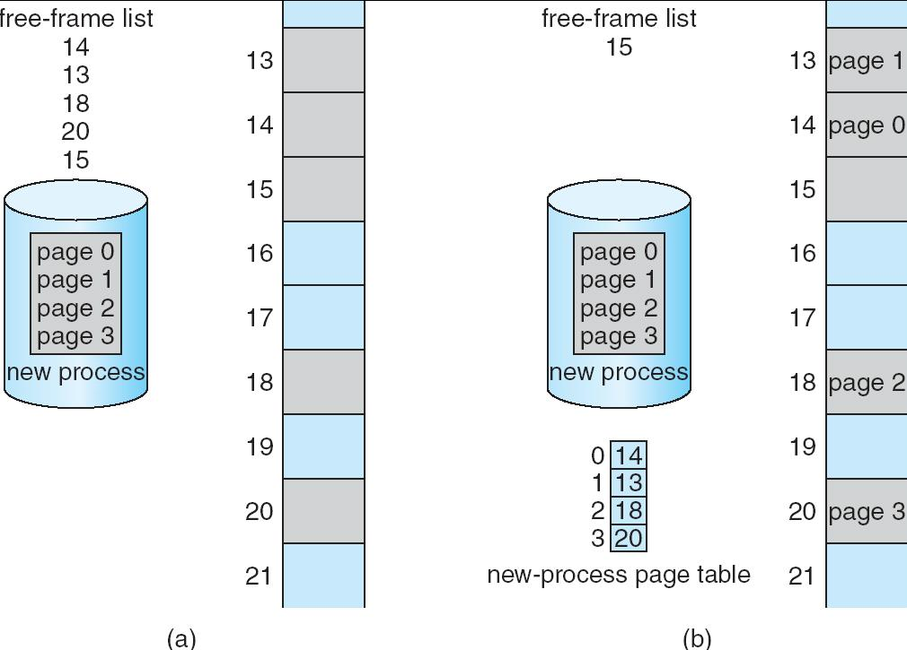

左图：物理内存中有很多空闲帧（如13、14、15、18、20、21），操作系统维护一个空闲帧列表。

当有新进程需要4页内存时，操作系统从空闲帧列表中取出4个帧（如14、13、18、20），分别分配给进程的page 0、1、2、3。

右图（b）：分配后，空闲帧列表减少，进程的页表记录了每一页对应的物理帧号。

---

### Hardware Implementation of Page Table

Page table is kept in main memory

页表本身存放在主存（RAM）中。

**Page-table base register** (PTBR) points to the page table

页表基址寄存器，指向当前进程页表在主存中的起始地址。这个地址是物理地址。

**Page-table length register** (PTLR) indicates size of the page table

页表长度寄存器，记录页表的大小（有多少项）。

In this scheme every data/instruction access requires **two** memory accesses. One for the page table and one for the data/instruction. 

由于页表在主存中，每次访问数据/指令都要先访问一次主存查页表，再访问一次主存取数据/指令。即每次内存访问需要两次主存访问，会导致效率降低。

The two-memory-access problem can be solved by the use of a special fast-lookup hardware cache called **associative memory** or **translation look-aside buffers** (TLBs 转换旁视缓冲, 一称快表)

TLB是一种特殊的高速缓存（硬件），用来存放最近使用过的页表项（页号→帧号的映射）。

当CPU访问内存时，先查TLB：

- 命中（hit）：直接得到帧号，只需一次内存访问，速度快。
- 未命中（miss）：再去主存查页表，然后把结果存入TLB，供下次使用。

Some TLBs store **address-space identifiers** (ASIDs) in each TLB entry – uniquely identifies each process to provide address-space protection for that process

有些TLB支持ASID，即每条TLB项带有一个地址空间标识符，区分不同进程的页表项。这样可以在进程切换时不用清空TLB，提高多进程环境下的效率和安全性。

---

### TLB

TLB(Translation Lookaside Buffer) – parallel search

Address translation (p,d)

- If p is in associative register, get frame # out
- Otherwise get frame # from page table in memory

---

#### Paging Hardware With TLB

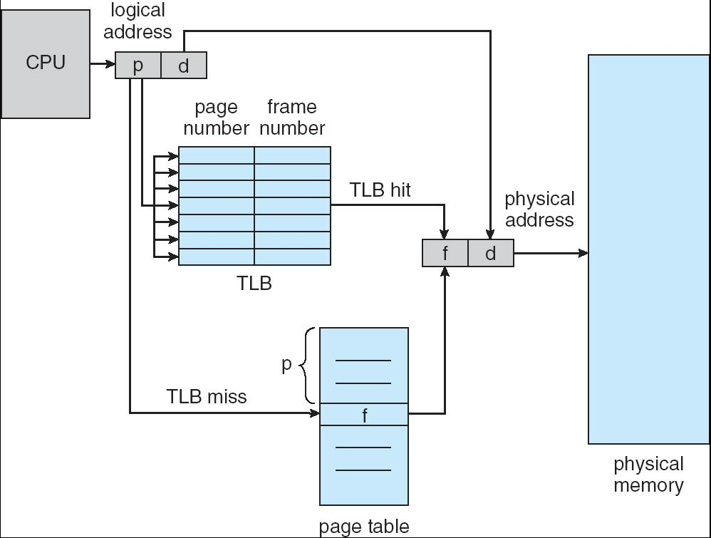

---

#### Effective Access Time

Associative Lookup = $\epsilon$ time units

查找TLB所需的时间，通常远小于主存访问时间。

Assume memory cycle time is 1 microsecond

假设访问主存一次需要1微秒。

Hit ratio – percentage of times that a page number is found in the associative registers; ratio related to the number of associative registers

TLB命中率，即有多少比例的访问可以直接在TLB中找到。

Hit ratio = $\alpha$

Effective Access Time (EAT)

$$\text{EAT} = (\epsilon + 1) \alpha + (\epsilon + 2)(1 - \alpha) = 2 + \epsilon - \alpha$$

---

### Memory Protection in Paged Scheme

Memory protection implemented by associating protection bit with each frame

每个页表项会有一个有效-无效位来标记该页是否属于当前进程的合法地址空间。

**Valid-invalid** bit attached to each entry in the page table:

- "valid" indicates that the associated page is in the process' logical address space, and is thus a legal page
- "invalid" indicates that the page is not in the process' logical address space

---

#### Valid (v) or Invalid (i) Bit In A Page Table

---

### Shared Pages

在分页系统中，允许多个进程共享某些内存页，通常用于只读的、可重入的代码（如编辑器、编译器、窗口系统等），以节省内存资源。

Shared code

- One copy of read-only (reentrant) code shared among processes (i.e., text editors, compilers, window systems).
- Shared code must appear in same location in the logical address space of all processes

- 只读（可重入）代码：比如系统库、编辑器、编译器等，代码本身不会被进程修改。
- 多个进程共享一份物理内存中的代码页，每个进程的页表都指向同一组物理帧。要求共享代码在所有进程的逻辑地址空间中必须出现在相同的位置，这样代码中的跳转、调用等地址引用才不会出错。

Private code and data

- Each process keeps a separate copy of the code and data
- The pages for the private code and data can appear anywhere in the logical address space

- 每个进程有自己独立的代码和数据副本，如进程的全局变量、堆、栈等。
- 这些私有页在物理内存中的位置可以不同，在每个进程的逻辑地址空间中也可以不同。进程对私有数据的修改不会影响其他进程。

---

#### Shared Pages Example

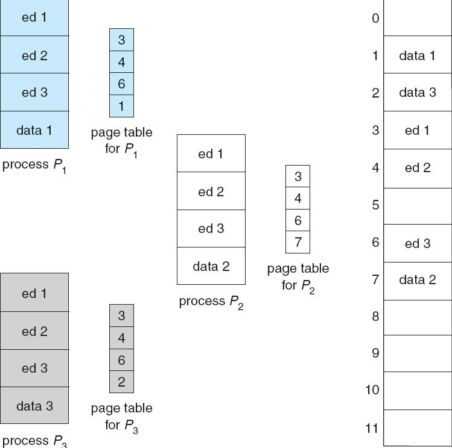

- ed 1、ed 2、ed 3是只读的、可重入的代码页（如编辑器、编译器等），所有进程的页表都指向同一组物理帧（3、4、6）。这样，只需一份物理内存副本，多个进程共享，节省了内存空间。
- 每个进程的“data”页（data 1、data 2、data 3）是私有的，每个进程的页表最后一项指向不同的物理帧。这样，每个进程的数据互不影响，保证了进程隔离和安全。

---

### Structure of the Page Table

- Hierarchical Paging
- Hashed Page Tables
- Inverted Page Tables

---

#### Hierarchical Page Tables

Break up the logical address space into multiple page tables – to **page** the page table

A simple technique is a two-level page table

在32位或64位系统下，虚拟地址空间极大，单级页表会非常大，占用大量内存。

为了节省内存、提高查找效率，出现了多级页表、哈希页表和反向页表等结构。

---

##### Two-Level Page-Table Scheme

- `outer page table`（外层页表）：最顶层的页表，每一项指向一个“页表页”（即下一级页表）。
- `page of page table`（二级页表）：每一项指向实际的物理内存帧。
- `memory`（物理内存）：存放实际的数据或指令。

---

##### Two-Level Paging Example

A logical address (on 32-bit machine with 1K page size) is divided into:

- a page number consisting of 22 bits
- a page offset consisting of 10 bits

Since the page table is paged, the page number is further divided into:

- a 12-bit page number
- a 10-bit page offset

Thus, a logical address is as follows:

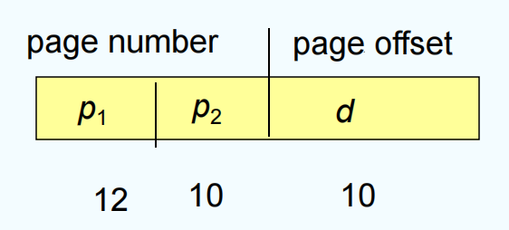

where $p_1$ is an index into the outer page table, and $p_2$ is the displacement within the page of the outer page table

在外层页表的每个表项中，存放的是某个页表分页的始址，如0号页表存放在3号物理块中。可以利用外层页表和页表来实现进程从逻辑地址到物理地址的变换。

---

##### Address-Translation Scheme

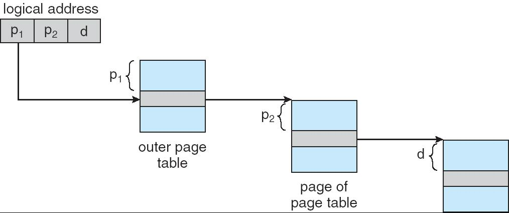

---

##### Three-level Paging Scheme

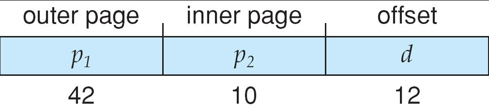

---

#### Hashed Page Tables

传统的单级或多级页表在大地址空间下会非常大，尤其是64位系统，页表本身会占用大量内存。

Common in address spaces > 32 bits

The virtual page number is hashed into a page table. This page table contains a chain of elements hashing to the same location.

哈希页表通过哈希函数将虚拟页号映射到一个较小的哈希表槽（bucket），每个槽存放一个链表，链表中是实际的页表项。

- Each element contains Virtual page number, frame no., a pointer to next element

链表元素包含虚拟页号、物理帧号和指向下一个元素的指针。当多个虚拟页号哈希到同一个槽时，形成链表。

Virtual page numbers are compared in this chain searching for a match. If a match is found, the corresponding physical frame is extracted.

1. CPU生成虚拟地址，提取虚拟页号。
2. 对虚拟页号做哈希，找到哈希表中的槽。
3. 遍历链表，查找虚拟页号是否匹配：

- 如果找到，返回对应的物理帧号，完成地址转换。
- 如果没找到，说明该页不在内存，产生缺页异常（page fault）。

Variation for 64-bit addresses is the **clustered page table**

Each element refers to several pages (say 16) rather than 1

Useful for sparse address spaces where memory references are scattered and non-contiguous

一个链表元素可以映射多个连续的虚拟页（如16个），进一步减少链表长度，提高效率。

---

#### Inverted Page Table

One entry for each real page of memory

整个操作系统只有一个反向页表。它的条目数量不取决于有多少个进程或虚拟地址空间有多大，而是只取决于物理内存有多大。

Entry consists of the virtual address of the page stored in that real memory location, with information about the process that owns that page

条目包含了：存储在该物理页框中的虚拟页号，以及拥有该页的进程信息(PID)

由于系统中所有进程共享这一个反向页表，光知道虚拟页号是不够的（进程A的虚拟页5 和 进程B的虚拟页5 是不同的）。因此，表中的每一项必须存储一个组合：

`<Process ID (PID), Virtual Page Number (VPN)>`

- 反向页表的**索引** (第 $i$ 行) 代表物理页框号 $i$ (PFN=i)。
- 反向页表的**内容**代表 `<PID, VPN>`。

查询过程（概念上）：当CPU需要翻译一个虚拟地址（例如来自进程 $P_x$ 的虚拟页 $V_y$）时，它不能再直接索引了。它必须搜索整个反向页表，去查找哪一行的内容等于 `<P_x, V_y>`。

Decreases memory needed to store each page table, but increases time needed to search the table when a page reference occurs

优点：极大节省内存。反向页表的大小只与物理内存（RAM）的多少成正比，与虚拟地址空间有多大、有多少个进程完全无关。

缺点：搜索时间极长。这种线性搜索的速度太慢了，在实践中是完全不可接受的。

Use hash table to limit the search to one — or at most a few — page-table entries

因为需要遍历整个表，所以通常会用哈希表加速查找。系统额外维护一个哈希表。当需要翻译 `<PID, VPN>` 组合时，CPU（或内存管理单元MMU）首先用一个哈希函数 (Hash Function) 来计算这个组合，得到一个哈希值。这个哈希值会指向哈希表中的一个“桶”(Bucket)。这个“桶”里存放的并不是 `<PID, VPN>`，而是指向反向页表真实条目的指针（或者说，指向对应物理页框号 PFN 的指针）。CPU现在只需要搜索这个很短的链表（通常只有“一个或最多几个”条目），而不是搜索整个反向页表。通过这个链表找到匹配的 `<PID, VPN>`，就能立刻定位到它在反向页表中的条目，从而知道物理页框号 PFN 是多少。

---

##### Inverted Page Table Architecture

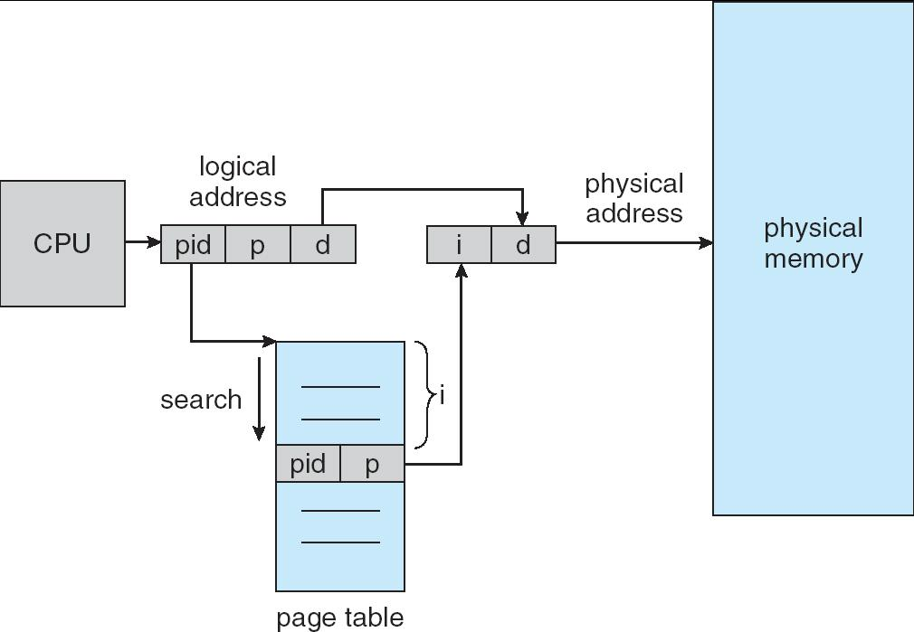

Search is slow, so put page table entries into a hash table. TLB can be used to speed up hash-table reference.

---

## Swapping

A process can be swapped temporarily out of memory to a backing store, and then brought back into memory for continued execution

交换是指操作系统可以将一个进程暂时从内存（RAM）中移到外部存储（如磁盘上的backing store），以后需要时再把它重新调入内存，继续执行。这样可以让有限的内存容纳更多的进程，提高系统的多任务能力。

**Backing store** – fast disk large enough to accommodate copies of all memory images for all users; must provide direct access to these memory images

后备存储 - 通常是一个足够大的、速度较快的磁盘区域，用来保存所有被换出的进程的内存镜像。要求能直接随机访问每个进程的镜像。

**Roll out, roll in** – swapping variant used for priority-based scheduling algorithms; lower-priority process is swapped out so higher-priority process can be loaded and executed

`Roll out, roll in`：一种交换策略，常用于优先级调度。低优先级进程被换出（roll out），高优先级进程被换入（roll in）执行。

Major part of swap time is transfer time; total transfer time is directly proportional to the amount of memory swapped

交换的主要开销是**数据传输时间**，即把进程的内存内容写入磁盘和从磁盘读回的时间。传输时间与被交换的内存量成正比，内存越大，交换越慢。频繁交换会导致系统性能下降（称为抖动thrashing）。

Modified versions of swapping are found on many systems (i.e., UNIX, Linux, and Windows)

System maintains a **ready queue** of ready-to-run processes which have memory images on disk

系统会维护一个**就绪队列**（ready queue），队列中的进程有的在内存，有的在磁盘，等待被调度运行。

---

### Schematic View of Swapping

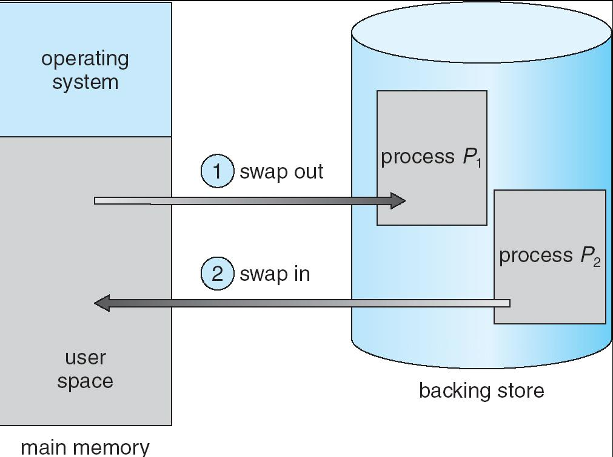

---

## Segmentation

Memory-management scheme that supports user view of memory

分段是一种支持用户视角的内存管理方式，让程序员看到的内存空间和实际物理内存分配方式更贴近。

A program is a collection of segments. A segment is a logical unit such as:

- main program
- procedure
- function
- method
- object
- local variables
- global variables
- common block
- stack
- symbol table
- arrays

程序被看作是若干逻辑段（segment）的集合，每个段是一个完整的逻辑单元。

分段系统将用户进程的逻辑地址空间划分为大小不等的段。例如，用户进程由主程序段、两个子程序段、栈段和数据段组成，于是可以将这个进程划分为5段，每段从0开始编址，并分配一段连续的地址空间(**段内要求连续**，段间不要求连续，进程的地址空间是**二维**的)。

在页式系统中，逻辑地址的页号和页内偏移量对用户是透明的，但在分段系统中，段号和段内偏移量必须由用户显式提供，在高级程序设计语言中，这个工作由**编译程序**完成。

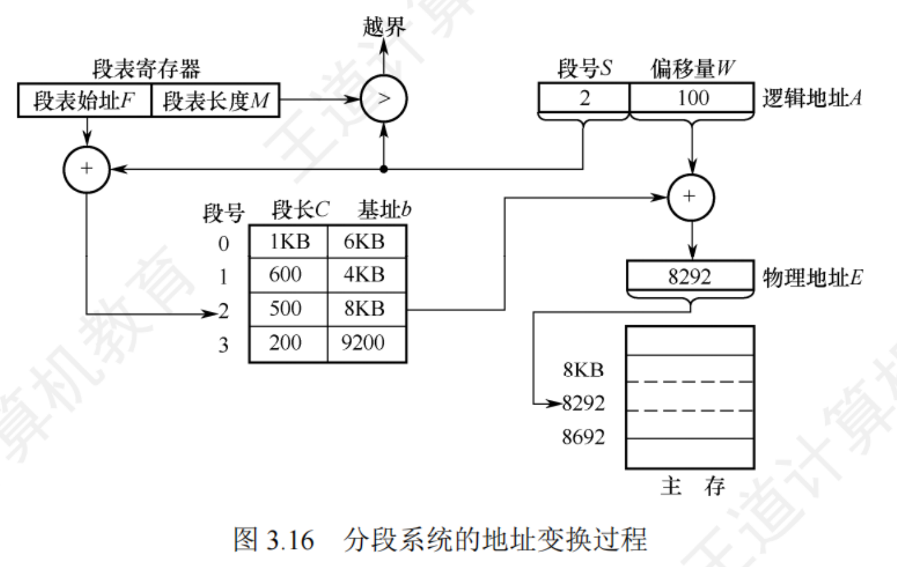

1. **越界检查**：首先检查偏移量W是否小于段长C（即W < C）。如果W越界，说明访问非法，操作系统会报错（防止越界访问）。
2. **查段表**：用段号S作为索引，在段表中查找对应的基址b和段长C。
3. **物理地址计算**：物理地址 = 基址b + 偏移量W。
4. **访问主存**：用计算得到的物理地址访问主存，读写数据。

在分页系统中，虽然也能实现共享，但远不如分段系统来得方便。若被共享的代码占N个页框，则每个进程的页表中都要建立N个页表项，指向被共享的N个页框。而在分段系统中，不管该段有多大，都只需为该段设置一个段表项，因此非常容易实现共享。

---

### User's View of a Program

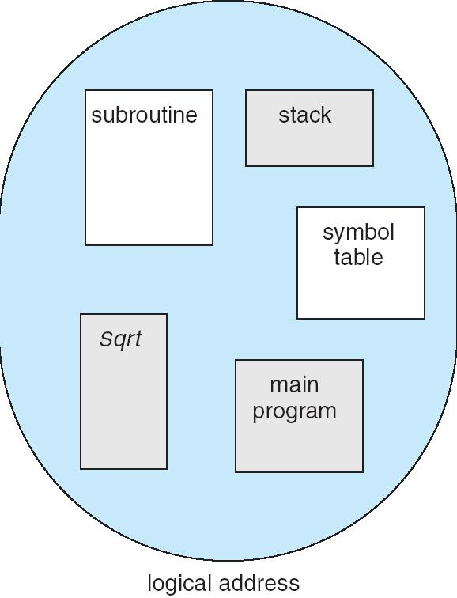

在程序员看来，程序就是这些逻辑段的集合。我们希望能够独立地管理和保护这些段（比如，main program 代码段应该是只读的）。

---

### Logical View of Segmentation

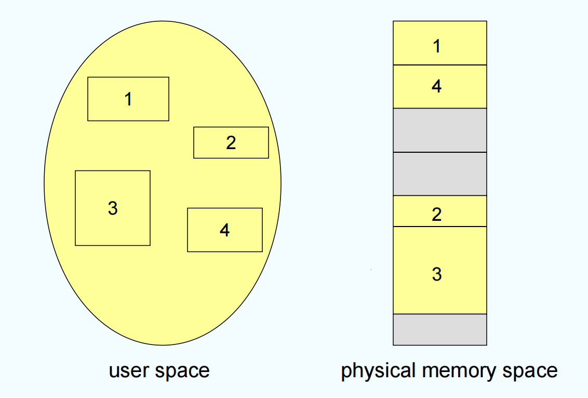

物理视角：这些逻辑段（1, 2, 3, 4）被加载到物理内存中，它们不必是连续的。

**分段的优点**：

1. **逻辑清晰** (Modularity)： 程序员可以按逻辑功能组织代码和数据，`main` 是 `main`，`stack` 是 `stack`。
2. **易于共享** (Sharing)： 如果多个进程都想使用同一个库函数（如 `Sqrt` ），只需在它们各自的段表中设置一个条目，指向同一个物理内存的 `Sqrt` 代码块即可。
3. **易于保护** (Protection)： 我们可以为每个段设置不同的保护权限。例如，`main` 代码段可以设为“只读”，而 `stack` 段可以设为“读/写”。这比给一整个程序设置权限要精细得多。

**分段的缺点**：

1. **外部碎片** (External Fragmentation)： 这是分段最大的问题。由于每个段的长度都不一样（ `main` 可能 20KB, `stack` 可能 4KB），当段被换入换出内存时，物理内存中会产生很多“空洞”（如图中的灰色区域）。这些空洞可能总和很大，但因为它们不连续，导致一个较大的新段无法装入。

---

???+ example "question"
    分页系统中的页面是为()。
    
    A.用户所感知的
    
    B.操作系统所感知的
    
    C.编译系统所感知的
    
    D.装配程序所感知的

??? note "answer"
    答案：B
    
    解析：分页系统中的页面是操作系统为了管理内存而划分的固定大小的块，用户和编译系统并不直接感知页面的存在。

???+ example "question"
    在段页式存储管理中，地址映射表是()。
    
    A.每个进程一张段表，两张页表
    
    B.每个进程的每个段一张段表，一张页表
    
    C.每个进程一张段表，每个段一张页表
    
    D.每个进程一张页表，每个段一张段表

??? note "answer"
    C

???+ example "question"
    在某分页存储管理系统中，地址结构长18位，其中11～17位为页号，0～10位为页内偏移量，则主存的最大容量为()KB,主存可分为()个页。若有一作业依次放入2、3、7号物理块，相对地址1500处有一条指令“store r1,2500”,该指令地址所在页的页号为0,则指令的物理地址为(),指令数据的存储地址所在页的页框号为()。
    
    A.256、256、5596、3
    
    B.256、128、5596、3
    
    C.256、128、5596、7
    
    D.256、128、3548、7

??? note "answer"
    答案：B
    
    解析：
    
    主存最大容量 = $2^{18}$ 字节 = 256 KB；

    每页大小 = $2^{11}$ 字节 = 2 KB = 2048 字节；

    主存可分为 $2^{18} \div 2^{11} = 2^7 = 128$ 个页；

    相对地址 1500 所在页号 = $\lfloor 1500 \div 2048 \rfloor = 0$，页内偏移量 = 1500；所在页号为0，放入2号物理块；一个物理块也即一页；因此指令的物理地址为 $2 \times 2048 + 1500 = 5596$；

    指令数据的存储地址2500所在页号 = $\lfloor 2500 \div 2048 \rfloor = 1$，页内偏移量 = 452；所在页号为1，放入3号物理块；因此指令数据的存储地址所在页的页框号为3。

???+ example "question"
    在采用页式存储管理的系统中，逻辑地址空间大小为256TB,页表项大小为8B,页面大小为4KB,则该系统中的页表应该采用()级页表。
    
    A.2
    
    B.3
    
    C.4
    
    D.5

??? note "answer"
    答案：C
    
    解析：
    
    逻辑地址空间大小为256TB = $2^{48}$ 字节；

    页面大小为4KB = $2^{12}$ 字节；

    页数 = $2^{48} \div 2^{12} = 2^{36}$ 页；

    每页表项大小为8B = $2^3$ 字节；

    一页可以放入页表项数 = $2^{12} \div 2^3 = 2^9$ 项；

    页表级数 = $36 \div 9 = 4$ 级；

???+ example "question"
    某计算机采用二级页表的分页存储管理方式，按字节编址，页大小为 $2^{10}$ B,页表项大小为2B,逻辑地址结构如下图

    

    逻辑地址空间大小为 $2^{16}$ 页，则表示整个逻辑地址空间的页目录表中包含表项的个数至少是()。
    
    A.64
    
    B.128
    
    C.256
    
    D.512

??? note "answer"
    答案 B

    页目录号 + 页表号 = 16 位

    页内偏移 = 10 位

    一页内可以放下的页表项项数 = $2^{10} \div 2^1$ = $2^9$ 项，也即页目录号为 9 位，页表号为 7 位。

    所以包含的页表项个数为 $2^7$ = 128 项。

???+ example "question"
    在虚拟内存管理中，地址变换机构将逻辑地址变换为物理地址，形成该逻辑地址的阶段是()。
    
    A.编辑
    
    B.编译
    
    C.链接
    
    D.装载

??? note "answer"
    答案：C

???+ example "question"
    在分段存储管理系统中，用共享段表描述所有被共享的段。若进程 $P_1$ 和 $P_2$ 共享段 $S$，则下列叙述中，错误的是()。
    
    A. 在物理内存中仅保存一份段 $S$ 的内容
    
    B. 段 $S$ 在 $P_1$ 和 $P_2$ 中应该具有相同的段号

    C. $P_1$ 和 $P_2$ 共享段 $S$ 在共享段表中的段表项

    D. $P_1$ 和 $P_2$ 都不再使用段 $S$ 时才回收段 $S$ 所占的内存空间

??? note "answer"
    答案：B

    解析：

    在分段存储管理系统中，共享段在不同进程中的段号可以不同。段号只是逻辑地址空间中的一个索引，不同进程可以使用不同的段号来访问同一个物理内存中的共享段。因此，选项 B 是错误的。

???+ example "question"
    在采用二级页表的分页系统中，CPU页表基址寄存器中的内容是()。
    
    A.当前进程的一级页表的起始虚拟地址
    
    B.当前进程的一级页表的起始物理地址
    
    C.当前进程的二级页表的起始虚拟地址
    
    D.当前进程的二级页表的起始物理地址

??? note "answer"
    答案：B

---