# Chapter 9 | Virtual Memory

## Background

**Virtual memory** – separation of user logical memory from physical memory.

虚拟内存是一种将用户的逻辑内存空间与实际物理内存空间分离的技术。

- Only **part** of the program needs to be in memory for execution 
- 只需部分程序在内存即可执行
- Logical address space can therefore be much **larger** than physical address space
- 逻辑地址空间可以远大于物理地址空间
- Allows address spaces to be **shared** by several processes
- 允许多个进程共享地址空间
- Allows for more efficient process **creation**
- 允许更高效的进程创建

Virtual memory can be implemented via:

- Demand paging

请求分页：按需将页面从磁盘调入内存，未访问的页面不占用内存。

- Demand segmentation

请求分段：按需将段从磁盘调入内存，未访问的段不占用内存。

???+ example
    为使虚存系统有效地发挥其预期的作用，所运行的程序应具有的特性是()。
    
    A.该程序不应含有过多的I/O操作
    
    B.该程序的大小不应超过实际的内存容量
    
    C.该程序应具有较好的局部性
    
    D.该程序的指令相关性不应过多

??? note "answer"
    **C. 该程序应具有较好的局部性。**

    虚拟存储的核心思想是**让程序“以为”自己拥有一个巨大且连续的内存空间（虚拟地址空间），而实际上，程序可能只在物理内存（RAM）中装载了一部分**。其余部分存储在磁盘（外存）上。

    既然磁盘访问这么慢，虚存系统要“有效发挥作用”（即不产生严重性能瓶颈），就必须**尽可能地减少访问磁盘的次数**（即减少“缺页中断”的频率）。这就完全依赖于程序自身的一个特性，即**局部性原理（Principle of Locality）**。

---

### Virtual Memory That is Larger Than Physical Memory


**内存映射表**（memory map）记录了每个虚拟页当前的位置：

- 有的虚拟页被映射到物理内存的某个页框中（如page 0、page 2）。
- 有的虚拟页暂时不在物理内存，而是存放在磁盘（外部存储）上。
- 当进程访问一个虚拟页时，操作系统通过内存映射表判断该页是否在物理内存中。

1. 进程访问虚拟地址（如page 2）。
2. 操作系统查内存映射表，发现page 2在物理内存中，直接访问。
3. 如果访问page v，发现它在磁盘上，操作系统会触发**缺页中断**，将其从磁盘调入物理内存。

---

### Virtual-address Space


1. 代码段（code）

- 存放程序的机器指令（可执行代码）。
- 一般是只读的，有时还设置为只执行不可写，防止代码被恶意修改。

2. 数据段（data）

- 存放已初始化的全局变量和静态变量。
- 这些数据在程序加载时就已经有确定的初值。

3. 堆区（heap）

- 用于动态分配内存（如C/C++中的malloc/free，Java中的new）。
- 堆区从低地址向高地址增长。

4. 栈区（stack）

- 用于函数调用时的局部变量、参数、返回地址等。
- 栈区从高地址向低地址增长（与堆区相反）。
- 每次函数调用会在栈上分配一块空间，函数返回后释放。

---

### Other benefits

System libraries can be shared by several processes through mapping of the shared object into a virtual address space

Shared memory is enabled

Pages can be shared during process creation (speeds up creation)

操作系统可以把常用的系统库（如C标准库、GUI库等）以“共享对象”（shared object，如.so或.dll文件）的形式，映射到多个进程的虚拟地址空间。可以做到节省物理内存、便于维护和升级、提高加载速度。

虚拟内存机制允许不同进程的虚拟地址空间中的某些页映射到同一块物理内存，实现进程间通信（IPC）。可以实现高效通信、灵活性高。

在创建新进程（如fork）时，父子进程可以共享代码段和只读数据段的物理页，甚至可以采用“写时复制（Copy-on-Write, COW）”技术，只有在某一方写入时才真正复制数据。可以做到加快进程创建速度、节省内存。

---

### Shared Library Using Virtual Memory


---

## Demand Paging

Bring a page into memory only when it is needed

只有在程序真正需要某个页面时，操作系统才把该页面从磁盘调入内存。

- Less I/O needed 只加载实际需要的页面，避免无用的数据传输，降低磁盘I/O负担。
- Less memory needed 内存中只保留活跃页面，未被访问的页面不占用宝贵的物理内存。
- Faster response 程序可以更快启动，因为不必等所有页面都加载完，只需加载入口和当前需要的部分。
- More users 同样的物理内存可以容纳更多进程，提高系统并发能力。

Page is needed $\Rightarrow$ reference to it

- invalid reference $\Rightarrow$ abort
- not-in-memory $\Rightarrow$ bring to memory

**Lazy swapper** – never swaps a page into memory unless page will be needed

懒惰换页器，只有在页面真正被需要时才调入内存，从不提前加载。

- Swapper that deals with pages is a **pager**
- Pager：负责页面调入调出的内存管理模块（即“页面换入/换出器”）。

---

### Transfer of a Paged Memory to **contiguous** Disk Space


---

### Valid-Invalid Bit

With each page table entry a valid–invalid bit is associated (v $\Rightarrow$ in-memory, i $\Rightarrow$ not-in-memory)

每个页表项都关联一个有效-无效位（v/i位）。

- v（valid）：该页在物理内存中，允许访问。
- i（invalid）：该页不在物理内存中（可能还在磁盘上），或该虚拟页无效，不允许访问。

Initially valid–invalid bit is set to i on all entries

程序刚开始运行时，所有页表项的有效-无效位通常都被设置为i（无效），表示这些页还没有被调入内存。

Example of a page table snapshot:


- 状态位 P。标记该页是否已调入内存，供程序访问时参考。
- 访问字段 A。记录本页在一段时间内被访问的次数，或记录本页最近已有多长时间未被访问，供置换算法换出页面时参考。
- 修改位 M。标记该页在调入内存后是否被修改过，以决定换出时是否写回外存。
- 外存地址。记录该页在外存的存放地址，通常是物理块号，供调入该页时参考。

During address translation, if valid–invalid bit in page table entry is i $\Rightarrow$ page fault (a trap to the OS)

当CPU访问某个虚拟地址时，操作系统会查页表，找到对应的页表项，并检查其有效-无效位。如果该位为v，那么说明该页已在内存，可以直接访问。如果该位为i（无效），则触发**缺页中断**，操作系统会处理这个异常情况，将所需页面从磁盘调入内存。

---

#### Page Table When Some Pages Are Not in Main Memory

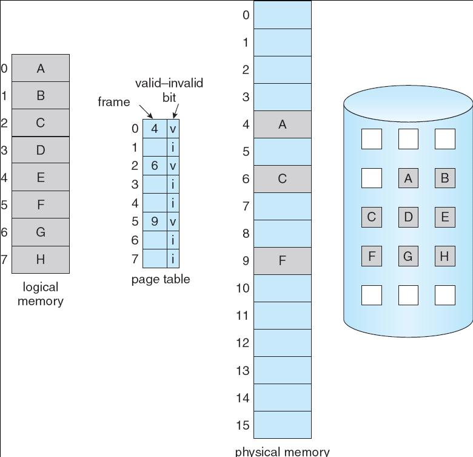

---

## Page Fault

If there is a reference to a page, first reference to that page will trap to operating system: **page fault**

当进程访问某个虚拟地址时，如果该地址所在的页面不在物理内存（即页表项的有效-无效位为i），CPU会产生一个缺页异常，把控制权交给操作系统。

1. Operating system looks at **another table** (kept with PCB) to decide:

- Invalid reference $\Rightarrow$ abort
- Just not in memory

2. Get empty frame
3. Swap page into frame
4. Reset tables
5. Set validation bit = v
6. Restart the instruction that caused the page fault

1. 操作系统检查访问是否合法

- 操作系统会查一张表（通常和进程控制块PCB一起保存），判断这次访问的虚拟地址是否合法。
- 如果是非法访问（如访问未分配的虚拟地址），则终止进程（abort）。
- 如果只是页面不在内存，则继续后续步骤。

2. 分配空闲页框

- 操作系统在物理内存中找一个空闲的页框（frame）。
- 如果没有空闲页框，可能需要用页面置换算法（如LRU）将某个页面换出到磁盘。

3. 把缺页的内容从磁盘（或其他外部存储）读入刚刚分配的物理页框。
4. 更新页表

- 修改页表，把该虚拟页对应的页表项指向新分配的物理页框。
- 设置有效-无效位为v（有效）。

5. 重启导致缺页的指令

- 操作系统恢复进程状态，让CPU重新执行刚才因为缺页而中断的那条指令。
- 这次访问会成功，因为页面已经在内存中。

Restart instruction

- block move

“block move”指令通常用于一次性移动一大块数据（如内存拷贝、字符串处理等）。

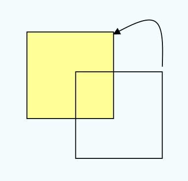

- auto increment/decrement location

有些指令（如循环处理数组）会自动递增或递减内存地址，逐步访问多个页面。只要访问到未在内存的页面，同样会触发缺页异常，处理流程与block move类似。

???+ example
    在采用页式虚拟存储管理和固定分配局部置换策略的系统中，数组采用行优先存储，页框大小为512B。某个进程中有如下代码段(该代码段已提前读入内存):
    
    ```c
    int a[128][128];
    for(int i=0;i<128;i++)
        for(int j=0;j<128;j++)
            a[j][i]=0;
    ```
    
    系统为该进程分配的数据区只有1个页框，则执行该代码会发生()次缺页中断。
    
    A. 1
    
    B. 2
    
    C. 128
    
    D. 16384

??? note "answer"
    **D. 16384 次缺页中断。**

    一个页框可以存放一行数据。当访问 a[0][0]时，发数组大小为 128x128，int 型数据占 4B，生第一次缺页中断，此时调入第一行数据;之后访问 a[110]，又发生缺页中断。每访问一个元素,都发生一次缺页中断，共有 128x128=16384 个元素，因此共发生 16384 次缺页中断。

???+ example
    假设某个进程分配有4个页框，每个页框大小为128个字(一个整数占一个字)。进程的代码段正好可以存放在一页中，而且总是占用0号页框。数据会在其他3个页框中换进或换出。数组X为按行优先存储，则执行该进程会发生()次缺页中断。
    
    ```c
    int X[64][64];
    for(int j=0;j<64;j++)
        for(int i=0;i<64;i++)
            X[i][j]=0;
    ```
    
    A.32
    
    B.1024
    
    C.2048
    
    D.其他都不对

??? note "answer"
    **C. 2048 次缺页中断。**

    每个页框可以存放 128 个整数，因此数组 X 的每两行数据占用一个页框。访问 X[0][0] 时，发生缺页中断，调入第 0、1 行数据;访问 X[2][0] 时，发生缺页中断，调入第 2、3 行数据;依此类推，每访问两行数据就会发生一次缺页中断。数组 X 共 64 行，因此共发生 64/2*64=2048 次缺页中断。

???+ example
    考虑页面置换算法，系统有m个物理块供调度，初始时全空，页面引用串长度为p,包含了n个不同的页号，无论用什么算法，缺页次数不会少于()。
    
    A.m
    
    B.p
    
    C.n
    
    D.min(m,n)

??? note "answer"
    C. n

    无论采用什么页面置换算法，每种页面第一次访问时不可能在内存中，必然发生缺页，所以缺页次数大于或等于 n。

???+ example
    一台机器有32位虚拟地址和16位物理地址，若页面大小为512B,采用单级页表，则页表共有()个页表项。
    
    A. $2^7$
    
    B. $2^{16}$
    
    C. $2^{23}$
    
    D. $2^{32}$

??? note "answer"
    页面大小为 512B，页内偏移量占9位，虚拟地址占 32 位，页号占 23 位，因此页表共有 $2^{23}$ 个页表项。**页表项数量与物理地址的位数没有必然关系。**注意，与物理地址位数有关的是页框数量，即物理内存中可用的页框数为 $2^{16-9}=2^7$ 个。页表项里主要存的是页框号。

???+ example
    在某分页存储管理的系统中，逻辑地址为16位，页面大小为1KB,第0,1,2,3号页依次存放在3,7,11,10号页框中，则逻辑地址0A6FH对应的物理地址为()。
    
    A.1E6FH
    
    B.2E6FH
    
    C.DE6FH
    
    D.EE6FH

??? note "answer"
    B. 2E6FH

    逻辑地址 0A6FH 转换为二进制为 0000 1010 0110 1111，页面大小为 1KB=1024B=2^10B，页内偏移量占 10 位，因此页号占 6 位。逻辑地址的页号为 000010（即第 2 页），页内偏移量为 01101111H（即 6FH）。根据题意，第 2 页存放在第 11 号页框中，因此物理地址为：页框号 + 页内偏移量（6FH）=2E6FH。

???+ example
    在决定页面大小时，选择较小的页面是为了减少()。
    
    A.页表大小
    
    B.缺页次数
    
    C.I/O开销
    
    D.页内碎片

??? note "answer"
    D. 页内碎片

    页面越小，页表项数量越多，页表所占的空间就更大;页面越小，缺页率越高;页面越小，换入换出的次数就越多，I0操作更频繁。页面越小，页内浪费的空间越少，内存利用率越高。

???+ example
    某请求分页存储系统的页大小为4KB,按字节编址。系统给进程P分配2个固定的页框，并采用改进型Clock置换算法，进程P页表的部分内容见下表。

    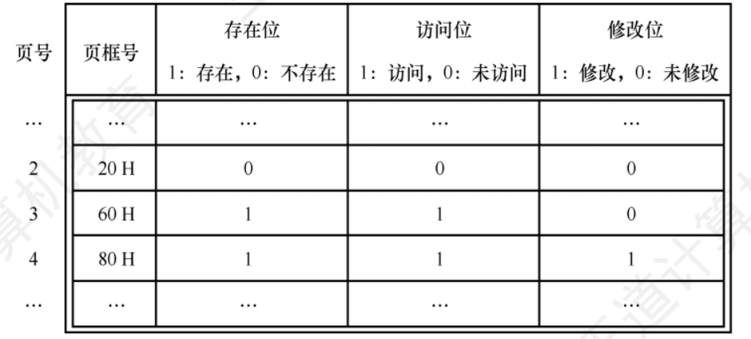

    若P访问虚拟地址为 02A01H 的存储单元，则经地址变换后得到的物理地址是()。
    
    A.00A01H
    
    B.20A01H
    
    C.60A01H
    
    D.80A01H

??? note "answer"
    C. 60A01H

    页面大小为 4KB，低 12 位是页内偏移。虚拟地址为 02A01H，页号为 02H，02H 页对应的页表项中存在位为 0，进程P分配的页框固定为2，且内存中已有两个页面存在。根据 Clock 算法，选择将3号页换出，将2号页放入60H页框，经过地址变换后得到的物理地址是 60A01H。

    注意最后这个 H 只是单纯指这是一个十六进制数，并不是地址的一部分。

???+ example
    对于采用虚拟内存管理方式的系统，下列关于进程虚拟地址空间的叙述中，错误的是()。
    
    A.每个进程都有自己独立的虚拟地址空间
    
    B.C语言中malloc()函数返回的是虚拟地址
    
    C.进程对数据段和代码段可以有不同的访问权限
    
    D.虚拟地址空间的大小由内存和硬盘的大小决定

??? note "answer"
    D. 虚拟地址空间的大小由内存和硬盘的大小决定

    虚拟地址空间的大小由底层的虚拟内存管理机制和操作系统决定，通常在不同的操作系统中有所不同，与内存和硬盘的大小没有关系，内存和硬盘的大小仅决定虚拟存储器实际可用容量的最大值，选项D错误。选项 A、C显然正确。在进程的虚拟地址空间中，有专门用来存放动态分配的变量的堆区，通过调用 malloc()函数动态地分配该空间，选项B正确。

---

### Steps in Handling a Page Fault


---

### A Page Fault Causes The Following

1. Check an internal table (with PCB)to determine whether thereference was a valid or an invalid memory access.
2. If the reference was invalid, we terminate the process. Ifit was valid but we have not yet brought in that page, we nowpage it in.
3. Find a free frame (by taking one from the free-frame list,for example).
4. Schedule a secondary storage operation to read the desiredpage into the newly allocated frame.
5. When the storage read is complete, we modify the internaltable kept with the process and the page table to indicate thathe page is now in memory.
6. Restart the instruction that was interrupted by the trap.The process can now access the page as though it had alwaysbeen in memory.

1. 检查内部表（如进程控制块 PCB）判断访问是否合法

- 当进程访问某个虚拟地址时，操作系统首先查表（通常和进程控制块PCB一起保存），判断这次访问的虚拟地址是否合法。
- 如果访问的是未分配的虚拟地址（非法访问），操作系统会终止该进程，防止非法操作。

2. 如果是非法访问，终止进程；如果只是页面不在内存，则准备调入页面

- 非法访问直接终止进程（如访问越界、未分配内存等）。
- 如果只是该页面还没被调入内存（合法但未在内存），则继续后续步骤。

3. 查找空闲页框（frame）

- 操作系统在物理内存中查找是否有空闲页框可用。
- 如果有空闲页框，直接使用。
- 如果没有空闲页框，需要用页面置换算法（如LRU、FIFO等）选择一个“牺牲页”换出，为新页面腾出空间。

4. 安排外部存储操作，将所需页面读入新分配的页框

- 操作系统发起磁盘I/O，将缺页的内容从磁盘（或其他外部存储）读入刚刚分配的物理页框。

5. 更新内部表和页表，标记该页已在内存

- 修改页表，把该虚拟页对应的页表项指向新分配的物理页框。
- 设置有效-无效位为v（有效），表示该页已在内存。

6. 重启被中断的指令

- 操作系统恢复进程状态，让CPU重新执行刚才因为缺页而中断的那条指令。
- 这次访问会成功，因为页面已经在内存中。

---

### Performance of Demand Paging

Page Fault Rate 0 $\le$ p $\le$ 1.0

- if p = 0 no page faults
- if p = 1, every reference is a fault

**Effective Access Time** (EAT)

**EAT = (1 – p) x memory access + p x (page fault overhead + swap page out + swap page in + restart overhead)**

---

#### Demand Paging Example

Memory access time = 200 nanoseconds

Average page-fault service time = 8 milliseconds

EAT = (1 – p) x 200 + p (8 milliseconds) = (1 – p) x 200 + p x 8,000,000 = 200 + p x 7,999,800

If one access out of 1,000 causes a page fault, then EAT = 8.2 microseconds.

This is a slowdown by a factor of 40!!

---

## Process Creation

Virtual memory allows other benefits during process creation:

- Copy-on-Write
- Memory-Mapped Files

---

### Copy-on-Write

Copy-on-Write (COW) allows both parent and child processes to initially share the same pages in memory

写时复制是一种优化技术，主要用于进程创建（如 Unix/Linux 的 fork() 系统调用）。当父进程创建子进程时，操作系统并不会立即把父进程的所有内存内容都复制一份给子进程，而是让父子进程共享同一份物理内存页。

If either process modifies a shared page, only then is the page copied

只有当父进程或子进程尝试写入某个共享页面时，操作系统才会真正复制该页面（即“写时复制”）。

COW allows more efficient process creation as only modified pages are copied

这样可以极大地节省内存和提升进程创建速度，因为大多数情况下，很多页面（如代码段、未修改的数据段）根本不会被写入，也就无需复制。

Free pages are allocated from a pool of zeroed-out pages

新分配的物理页通常来自一个“清零池”，即这些页在分配前已经被清零，保证数据安全和一致性。

---

#### Before Process 1 Modifies Page C

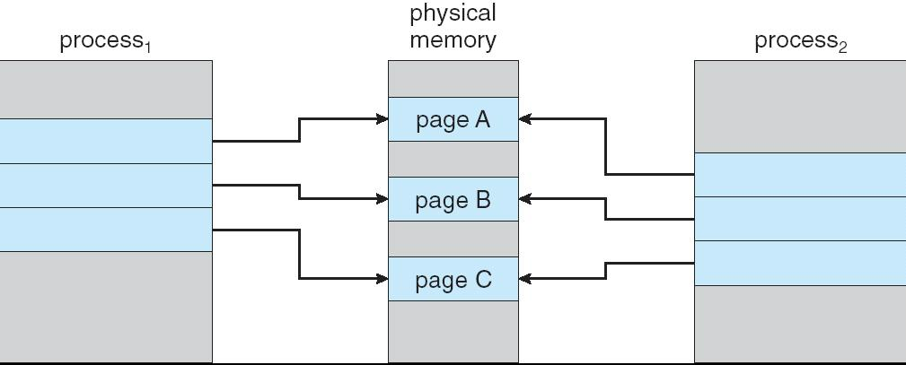

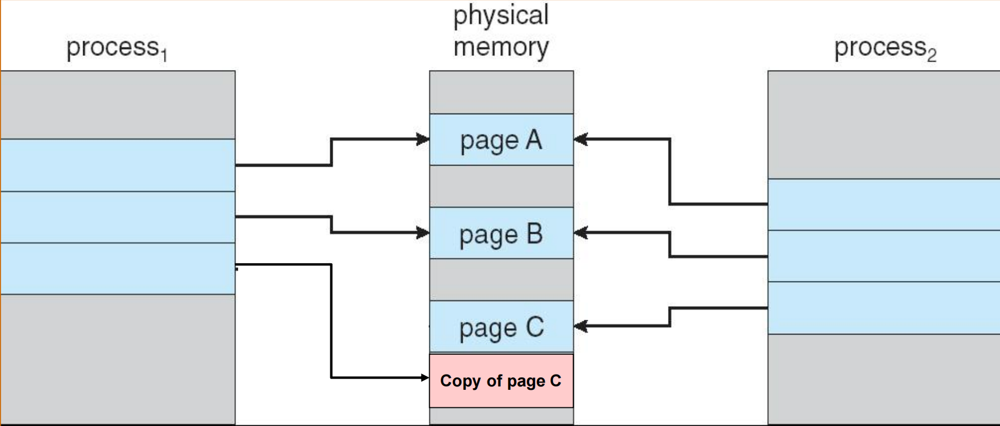

---

#### What happens if there is no free frame?

Page replacement – find some page in memory, but not really in use, swap it out

操作系统要选择一个当前在内存中的页面，把它“换出去”（通常写回磁盘），然后把新需要的页面调入这个页框。

- algorithm 选择哪个页面换出，直接影响系统性能。
- performance – want an algorithm which will result in minimum number of page faults 希望选择的算法能让缺页次数（page faults）最少，从而提升系统性能。

Same page may be brought into memory several times

由于置换算法的限制，同一个页面可能会被多次换入内存（比如刚换出去又马上需要），这会增加磁盘I/O，降低效率。

---

## Page Replacement

在虚拟内存系统中，物理内存有限，但虚拟内存空间可以很大。当所有物理内存页框（frame）都被占用时，如果有新的页面需要调入内存（比如发生缺页中断），就必须“腾出”空间。这时，操作系统就需要把某些当前在内存中的页面换出（通常写回磁盘），以便为新页面让出位置，这个过程就叫页面置换。

Prevent over-allocation of memory by modifying page-fault service routine to include page replacement

防止内存过度分配：通过页面置换，系统可以在物理内存有限的情况下，支持更多进程和更大的虚拟内存空间。

Use modify (dirty) bit to reduce overhead of page transfers – only modified pages are written to disk

只有被修改过的页面（脏页）才需要在换出时写回磁盘；未被修改的页面可以直接丢弃（因为磁盘上已有最新内容），这样可以减少磁盘I/O，提高效率。

Page replacement completes separation between logical memory and physical memory – large virtual memory can be provided on a smaller physical memory

实现虚拟内存与物理内存的彻底分离：页面置换机制让操作系统能够用较小的物理内存，提供给进程看起来很大的虚拟内存空间。

---

### Need For Page Replacement


---

### Basic Page Replacement

1. Find the location of the desired page on secondary storage.
2. Find a free frame:

- If there is a free frame, use it.
- If there is no free frame, use a page-replacement algorithm to select a victim frame.
- Write the victim frame to secondary storage (if necessary); change the page and frame tables accordingly. (use dirty bit)

3. Read the desired page into the newly freed frame; change the page and frame tables.
4. Continue the process from where the page fault occurred.

1. 找到所需页面在外部存储（如磁盘）上的位置。

- 操作系统需要知道要访问的虚拟页目前存储在磁盘的哪个位置（比如交换分区或页面文件）。
- 这个信息通常保存在页表或辅助数据结构中。

2. 查找空闲页框

- 如果有空闲页框：直接使用这个空闲页框来装载新页面。
- 如果没有空闲页框：

    - 使用页面置换算法（如FIFO、LRU等）选择一个“牺牲页”（victim frame），即当前内存中某个可以被换出的页面。
    - 如果被换出的页面自从调入内存后被修改过（即“脏页”，dirty bit为1），则必须先把它写回磁盘，保证数据不丢失。
    - 更新页表和帧表，反映新的映射关系。

3. 把所需页面从磁盘读入刚刚腾出来的页框

- 将目标页面从外部存储读入内存的指定页框。
- 修改页表和帧表，指向新装载的页面。

4. 继续执行被中断的进程

- 缺页中断处理完成后，恢复进程状态，让CPU重新执行刚才因为缺页而中断的那条指令。
- 这次访问会成功，因为页面已经在内存中。

---

#### Page Replacement

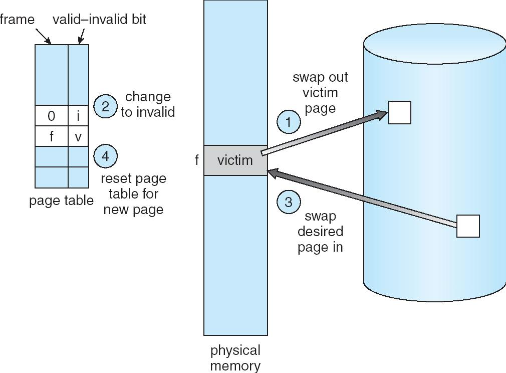

---

### Page Replacement Algorithms

Want lowest page-fault rate

页面置换算法的核心目标是：让缺页次数（page-fault rate）尽可能低。换句话说，就是希望在有限的物理内存页框下，尽量减少从磁盘调页的次数，提高系统性能。

Evaluate algorithm by running it on a particular string of memory references (reference string) and computing the number of page faults on that string

通过在一串实际或模拟的**内存访问序列（reference string）**上运行算法，统计其产生的缺页次数，来评估算法的优劣。

Address sequence:

0100, 0432, 0101, 0612, 0102, 0103, 0104, 0101, 0611, 0102, 0103, 0104, 0101, 0610, 0102, 0103, 0104, 0101, 0609, 0102, 0105

is reduced to reference string:

1, 4, 1, 6, 1, 6, 1, 6, 1, 6, 1

这里每个数字代表一次对某个页的访问。

**Graph of Page Faults Versus The Number of Frames**


---

#### First-In-First-Out (FIFO) Algorithm

Reference string: 1, 2, 3, 4, 1, 2, 5, 1, 2, 3, 4, 5

3 frames (3 pages can be in memory at a time per process)

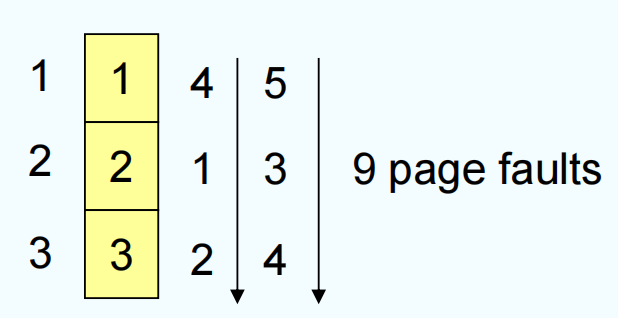

4 frames


Belady’s Anomaly: more frames $\Rightarrow$ more page faults

Belady 异常指的是：在某些页面置换算法（特别是 FIFO，即先进先出算法）下，分配给进程的物理内存页框数增加，反而导致缺页次数增加，这是一种违反直觉的现象。

- 正常情况下，我们期望内存越大，缺页次数越少。
- 但 Belady 异常表明，某些算法下，增加内存反而会让缺页次数变多。

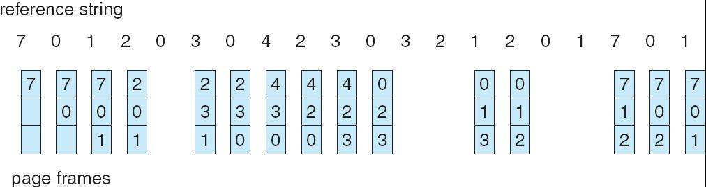


- 当只有 3 个页框时，缺页次数是 9 次；
- 增加到 4 个页框后，缺页次数反而变成了 10 次。

发生原因：

- FIFO 算法只关注最早进入内存的页面，不考虑页面实际的使用频率和未来是否还要用。
- 某些情况下，增加页框会让“刚好要被再次访问的页面”提前被淘汰，导致后续再次访问时还要重新换入，从而增加缺页。

Belady 异常说明：不是所有页面置换算法都能保证“内存越大，性能越好”。

一些更优的算法（如 LRU、OPT）不会出现这种异常，称为“堆栈算法”（stack algorithm）。

**FIFO Page Replacement**

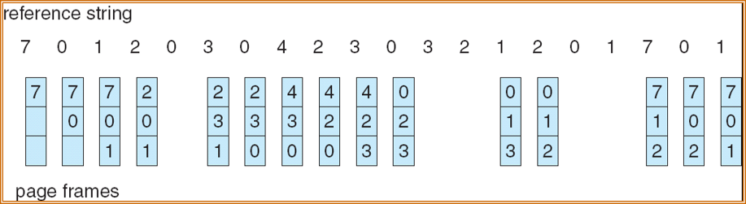

**FIFO Illustrating Belady’s Anomaly**

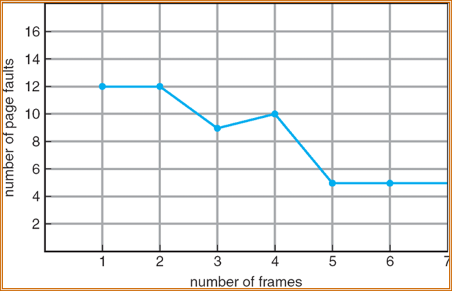

---

#### Optimal Algorithm

Replace page that will not be used for longest period of time

最优页面置换算法（OPT / Optimal Algorithm）最优算法的思想是：每次需要换出页面时，选择未来最长时间不会被访问的页面进行置换。换句话说，假如你能“预知未来”，每次都把最晚才会被用到的页面换出去，这样可以保证缺页次数最少。

4 frames example

1, 2, 3, 4, 1, 2, 5, 1, 2, 3, 4, 5


以参考字符串 1, 2, 3, 4, 1, 2, 5, 1, 2, 3, 4, 5 和 4 个页框为例：

- 前四次访问（1,2,3,4）都要缺页，依次装入内存。
- 第五次访问 1，已经在内存，不缺页。
- 第六次访问 2，也在内存，不缺页。
- 第七次访问 5，需要换出一个页面。此时内存里有 1,2,3,4。根据最优算法，应该换出未来最晚才会被访问的页面。查后面的访问序列，发现 3 在第十次才会被访问，4 在第十一才会被访问，1、2 在第八、九次就会被访问，所以应该换出 4 。
- 依此类推，每次都选择未来最晚用到的页面换出。
- 而最后一次访问 4 时，我们可以看到，4 已经不在内存了，所以又会缺页。但是此时 1， 2， 3 后续都不再出现了，此时我们退化为 FIFO，也就是说我们会换出 1 。

How do you know this?

Used for measuring how well your algorithm performs

这种算法理论上能保证最少的缺页次数，是所有页面置换算法的“下界”。实际操作系统无法预知未来，所以最优算法只能用于理论分析和算法性能对比。例如可以通过和最优算法的缺页次数对比，判断实际算法（如FIFO、LRU等）距离最优有多远。

**Optimal Page Replacement**


---

#### Least Recently Used (LRU) Algorithm

每次需要换出页面时，选择最近最久未被访问的页面进行置换。

Reference string:  1, 2, 3, 4, 1, 2, 5, 1, 2, 3, 4, 5

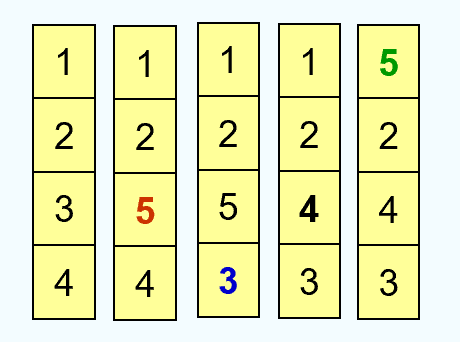

1. Counter implementation

- Every page entry has a counter; every time page is referenced through this entry, copy the clock into the counter
- When a page needs to be changed, look at the counters to determine which is to change

计数器实现（Counter Implementation）

- 每个页面有一个计数器，每次访问该页面时，把当前时间（或时钟值）记录到计数器里。
- 换页时，查所有计数器，选择数值最小（最久未被访问）的页面换出。

**LRU Page Replacement**


2. Stack implementation – keep a stack of page numbers in a double link form:

- Page referenced:

    - move it to the top
    - requires 6 pointers to be changed
    
- No search for replacement

栈实现（Stack Implementation）

- 用一个双向链表（栈）记录页面访问顺序。
- 每次页面被访问，就把它移动到栈顶。
- 换页时，直接淘汰栈底的页面（即最久未被访问的页面）。

**Use Of A Stack to Record The Most Recent Page References**


---

#### LRU Approximation Algorithms

真正的LRU算法需要记录每个页面的精确访问时间或维护一个链表，硬件和性能开销较大。所以实际操作系统常用近似LRU算法，既能接近LRU效果，又实现简单高效。

Reference bit

**Reference Bit（引用位）算法**

- With each page associate a bit, initially = 0
- When page is referenced bit set to 1
- Replace the one which is 0 (if one exists). We do not know the order, however.

- 每个页面关联一个引用位（reference bit），初始为0。
- 当页面被访问时，引用位设为1。
- 换页时，优先选择引用位为0的页面换出（即近期未被访问的页面）。
- 这种方法不能精确知道最近访问顺序，但能大致区分“近期用过”和“很久没用”。

Second chance

**Second-Chance（第二次机会）/Clock（时钟）算法**

- Second chance
- Clock replacement
- If page to be replaced (in clock order) has reference bit = 1 then:

1. set reference bit 0
2. leave page in memory
3. replace next page (in clock order), subject to same rules

- 所有页面按环形队列排列，类似时钟表盘，系统维护一个“指针”。
- 换页时，指针指向下一个候选页面（victim）。
- 如果该页面的引用位为0，直接换出。
- 如果引用位为1，说明近期被访问过，给它“第二次机会”：把引用位清零，指针移到下一个页面，继续检查。
- 直到找到引用位为0的页面为止。

**Second-Chance (clock) Page-Replacement Algorithm**

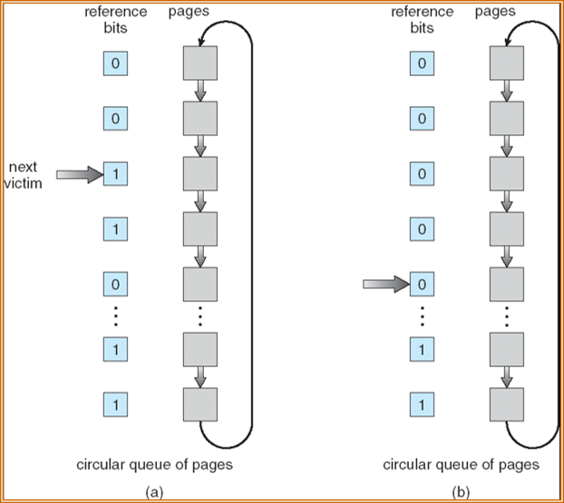

**Enhanced second change algorithm**

(reference bit, dirty bit), obtain four possible classes.

1. (0, 0) neither recently used nor modified-best page to replace
2. (0, 1) not recently used but modified-not quite as good, because the page will need to be written out before replacement
3. (1, 0) recently used but clean-probably will be used again soon
4. (1, 1) recently used and modified-probably will be used again soon, and the page will be need to be written out to secondary storage

Replace the first page encountered in the lowest nonempty class

增强型第二次机会算法是在基本的 Second-Chance/Clock 算法基础上，同时考虑引用位（reference bit）和修改位（dirty bit），通过这两个位的组合，把页面分成四个优先级类别，优先淘汰"最不值得保留"的页面。

可以组合成下面四种类型的页面：

- 1 类 A=0 , M=0 :最近未被访问，且未被修改，是最佳的淘汰页。
- 2 类 A=0 , M=1 :最近未被访问，但已被修改，是次佳的淘汰页。
- 3 类 A=1 , M=0 :最近已被访问，但未被修改，可能再被访问。
- 4 类 A=1 , M=1 :最近已被访问，且已被修改，可能再被访问。

替换策略：按优先级从低到高扫描，替换遇到的第一个最低非空类别的页面。

内存中的每页必定都是这四类页面之一。在进行页面置换时，可采用与简单CLOCK算法类似的算法，差别在于该算法要同时检查访问位和修改位。算法执行过程如下：

1. 从指针的当前位置开始，扫描循环队列，寻找 A=0 且 M=0 的1类页面，将遇到的第一个 1 类页面作为选中的淘汰页。在第一次扫描期间不改变访问位 A 。
2. 若第 1 步失败，则进行第二轮扫描，寻找 A=0 且 M=1 的 2 类页面。将遇到的第一个 2 类页面作为淘汰页。在第二轮扫描期间，将所有扫描过的页面的访问位都置 0 。
3. 若第 2 步也失败，则将指针返回到开始的位置，并将所有帧的访问位复 0 。重复第 1 步，并且若有必要，重复第 2 步，此时一定能找到被淘汰的页。

**优点**

1. 实现简单，只需一个引用位和一个指针。
2. 性能接近LRU，且不会有Belady异常。
3. 适合硬件实现和高效软件实现。
4. 比简单CLOCK算法的磁盘 I/O 操作次数更少，但是算法本身开销略有增加。

---

#### Counting-based Algorithms

Keep a counter of the number of references that have been made to each page

为每个页面维护一个计数器，记录该页面被访问的次数，然后根据访问次数来决定换出哪个页面。

**LFU Algorithm**:  replaces page with smallest count

LFU 每次换出访问次数最少的页面。

**实现**：

- 每个页面有一个计数器，每次访问该页面时计数器加1。
- 换页时，选择计数值最小的页面换出。

**优点**：

- 能反映页面的长期使用频率。
- 适合访问模式稳定的场景。

**缺点**：

- **无法适应访问模式变化**：如果某个页面早期被频繁访问（计数很高），但后期不再使用，它仍然会长期留在内存中。
- **新页面容易被淘汰**：刚调入的页面计数为0或很小，容易被换出，即使它后续会被频繁访问。

**MFU Algorithm**: based on the argument that the page with the smallest count was probably just brought in and has yet to be used

MFU 每次换出访问次数最多的页面。基于这样的假设：访问次数最少的页面可能是刚刚被调入内存的，还没来得及被使用，因此应该保留；而访问次数多的页面可能已经被充分使用过了，可以换出。

**实现**：

- 每个页面有一个计数器，每次访问该页面时计数器加1。
- 换页时，选择计数值最大的页面换出。

**缺点**：

- **不符合直觉**：通常访问次数多的页面更可能继续被访问，换出它们反而会增加缺页。
- **实际效果较差**：MFU 算法在大多数情况下表现不如 LRU 或 LFU。

---

## Allocation of Frames

Each process needs minimum number of pages － usually determined by computer architecture.

在虚拟内存系统中，多个进程共享有限的物理内存页框。操作系统需要决定给每个进程分配多少个页框？如何在进程间公平、高效地分配物理内存？

每个进程需要最小数量的页框，这通常由计算机体系结构决定。

为什么有最小页框数？因为某些机器指令执行时可能需要访问多个内存地址。如果分配的页框太少，可能导致一条指令执行时频繁缺页，甚至无法完成。

Example:  IBM 370 – 6 pages to handle Storage-to-Storage MOVE instruction:

- instruction is 6 bytes, might span 2 pages
- 2 pages to handle from
- 2 pages to handle to

Two major allocation schemes

- fixed allocation  固定分配
- priority allocation 优先级分配

---

### Fixed Allocation

Equal allocation – For example, if there are 100 frames and 5 processes, give each process 20 frames.

平均分配（Equal Allocation）所有进程平分物理内存页框。

Proportional allocation – Allocate according to the size of process

按比例分配（Proportional Allocation）根据进程大小（虚拟内存空间大小）按比例分配页框。

- $s_i$ = size of process $p_i$
- $S = \sum_{i} s_i$
- $m$ = total number of frames
- $a_i$ = allocation for process $p_i$ = $\frac{s_i}{S} \times m$


---

### Priority Allocation

Use a **proportional allocation** scheme using **priorities** rather than size

根据进程的优先级动态调整页框分配。

If process $P_i$ generates a page fault,

- generates a page fault,
- select for replacement a frame from a process with lower priority number

高优先级进程分配更多页框，低优先级进程分配较少页框，当高优先级进程需要更多内存时，可以从低优先级进程那里"抢夺"页框。

---

### Global vs. Local Allocation

当发生缺页中断需要换出页面时，操作系统可以采用两种不同的策略来选择"牺牲页"。

**Global replacement** – process selects a replacement frame from the set of all frames; one process can take a frame from another

进程可以从所有物理内存页框中选择一个页面换出，不限于自己拥有的页框。一个进程可以"抢占"另一个进程的页框。

**Problem** with global replacement: unpredictable page-fault rate. Cannot control its own page-fault rate. More common

- **缺页率不可预测**：进程的缺页率不仅取决于自己的行为，还受其他进程影响。
- **无法控制自己的缺页率**：一个进程可能因为其他进程的内存需求而被迫释放页框，导致自己频繁缺页。
- **可能导致不公平**：某些进程可能被"饿死"，得不到足够的内存。

**Local replacement** – each process selects from only its own set of allocated frames

每个进程只能从自己分配的页框集合中选择页面换出。进程之间的页框是隔离的，互不干扰。

Problem with local replacement: free frames are not available for others. – Low throughput

- **空闲页框无法共享**：如果某个进程分配了很多页框但当前不活跃，这些页框无法被其他急需内存的进程使用。
- **整体吞吐量低**：物理内存利用率可能不够高，导致系统整体性能下降。
- **不够灵活**：无法根据实际需求动态调整内存分配。

---

## Thrashing(颠簸)

If a process does not have “enough” pages, the page-fault rate is very high. This leads to:

Thrashing 指进程或系统在不停地进行页面换入/换出（大量缺页和磁盘I/O），以致 CPU 大量空转、系统吞吐量下降的状态。本质上是“CPU 等磁盘做换页工作，不能做有效计算”。

- low CPU utilization
- CPU 利用率急剧下降（看起来 CPU 空闲但系统很慢）。
- Queuing at paging device, the ready queue becomes empty
- 页面设备（磁盘）排队等待，准备队列变空。
- operating system thinks that it needs to increase the degree of multiprogramming
- 操作系统误以为需要增加多道程序设计的程度（增加更多进程）。
- another process added to the system
- 系统中增加了另一个进程。

**Thrashing** = a process is busy swapping pages in and out


???+ example
    

??? note "answer"
    

    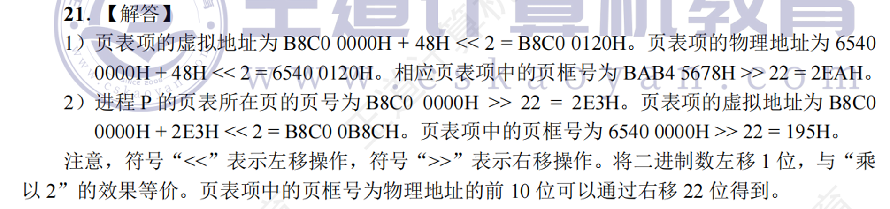

---

### Demand Paging and Thrashing 

Why does demand paging work?

**Locality model**

- Process migrates from one locality to another
- Localities may overlap

请求分页依赖“局部性原理（locality）”——程序在某段时间内只访问一小部分页（局部性），这些页被称为该时间段的 working set。

Why does thrashing occur?

$\sum$ size of locality $>$ total memory size

当所有活动进程当前的“工作集大小之和”大于物理内存可用页框数时，系统无法把每个进程的工作集都保留在内存。结果：某些进程频繁缺页、页被换出后很快又被访问并换入，形成频繁的换页循环（I/O 队列长、就绪队列空）。

To **limit** the effect of thrashing: local replacement algo cannot steal frames from other processes. But queue in page device increases effective access time. 

尽量避免置换别的进程的页（local replacement）、对换页设备的队列做控制、降低进程并发度等，短期缓解。

To **prevent** thrashing: allocate memory to accommodate its locality

确保每个进程至少有其工作集大小的页框，或者控制多道程序度使 $\sum W_i \leq$ total number of frames，从根本上防止颠簸。

**Locality In A Memory-Reference Pattern**


---

#### Data Locality Example

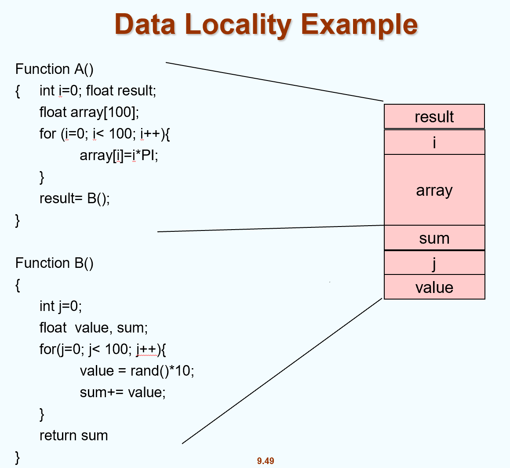

---

### Working-Set Model

$\Delta =$ working-set window = a fixed number of page references

- Δ（working‑set window）：固定长度的最近页面引用序列窗口（例如最近的 10,000 次内存引用）。

Example:  10,000 instruction

$WSS_i$ (working set size of Process $P_i$) = total number of pages referenced in the most recent $\Delta$ (varies in time)

- $WSS_i$（进程 $P_i$ 的工作集大小）：在该进程最近 Δ 次引用中被访问过的不重复页面数（随时间变化）。

- if $\Delta$ too small will not encompass entire locality
- if $\Delta$ too large will encompass several localities
- if $\Delta = \infty$  $\Rightarrow$ will encompass entire program

- Δ 太小：不能覆盖一个完整的局部性，WSS 会低估实际需求，导致分配不足 → 容易发生 thrashing。
- Δ 太大：跨越多个局部性，把多个阶段的页都算进来，WSS 过大 → 过度分配内存、浪费资源。

D = $\sum WSS_i$  total demand frames for all processes in the system

if D $>$ total number of frames  $\Rightarrow$ Thrashing

Policy if D $>$ total number of frames, then suspend one of the processes

1. 定期或事件驱动计算每个进程的 WSS（或近似值）。
2. 计算 D = Σ $WSS_i$。

- 如果 D ≤ m：继续运行。
- 如果 D > m：系统处于危险状态，采取措施（见下）。

3. 常见应对措施：

- 暂停（swap out）或挂起若干低优先级进程，直到 D ≤ m（降低多道程序度）。
- 调整页框分配（把页框从不活跃进程回收给活跃进程）。
- 增加物理内存（硬件层面）。
- 使用更好近似 LRU 的置换算法（如 WSClock）减少不必要换页。

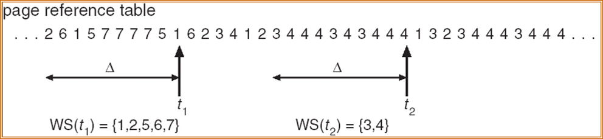

---

### Keeping Track of the Working Set

Approximate with interval timer + a reference bit

用间隔定时器 + 引用位近似跟踪工作集（Keeping Track of the Working Set）

Example: $\Delta$ = 10,000

- Timer interrupts after every 5000 time units
- Keep in memory 2 bits for each page
- Whenever a timer interrupts copy and sets the values of all reference bits to 0
- If one of the bits in memory = 1 $\Rightarrow$ page in working set

1. 设定工作集窗口 Δ（例如 10,000 次引用或 10,000 时间单位）。
2. 选择采样间隔 T，使得若用 k 个采样点覆盖 Δ，则 k×T = Δ（例：T=5000，k=2；或 T=1000，k=10）。
3. 每个驻留页为其维护 k 个位（或一个 k 位的移位寄存器/数组），初始全 0。
4. 硬件／MMU 在每次页被访问时将该页的引用位 R 置 1。R是单个位，表示该页自上次采样以来是否被访问。
5. 每隔 T 时间触发定时中断：

- 把当前每页的引用位 R 的值复制到该页的下一位位置（或移入移位寄存器的最高位），
- 然后将 R 清 0，继续记录后续访问。

6. 在任意时刻，若某页的 k 位中至少有一个为 1，则说明该页在最近 Δ (= k×T) 时间内被引用过，属于工作集；否则不在工作集。
7. 统计所有驻留页中“位非全零”的页数即为近似 WSS。这就是进程当前的工作集大小。

Why is this not completely accurate? Cannot tell where a reference occurred in 5000 units.

这种方法不是完全准确，因为无法知道某次访问发生在采样间隔的哪一部分（比如T=5000时，只能知道这5000内是否被访问过）。

Improvement = 10 bits and interrupt every 1000 time units

改进方法：增加采样位数（如10位），缩短采样间隔（如每1000时间单位），可以更精细地覆盖整个窗口，提高准确性。

---

#### Page-Fault Frequency Scheme

Establish “acceptable” page-fault rate for **each process**

动态调整每个进程分配的物理页框数，保持缺页率在合理范围，防止thrashing。

- If actual rate too low, process loses frame

如果实际缺页率太高（> $r_{high}$），说明内存分配不足，给该进程增加页框（如果有空闲页框或从其他进程回收）。

- If actual rate too high, process gains frame

如果实际缺页率太低（< $r_{low}$），说明分配过多，可以回收部分页框，分配给其他进程或留作空闲。


---

## Memory-Mapped Files

Memory-mapped file I/O allows file I/O to be treated as routine memory access by **mapping** a disk block to a page in memory

内存映射文件是一种操作系统技术，可以把磁盘上的文件内容直接“映射”到进程的虚拟地址空间。这样，程序可以像访问普通内存一样访问文件内容，无需显式调用传统的 read() 或 write() 文件操作。

A file is initially read using demand paging. A page-sized portion of the file is read from the file system into a physical page. Subsequent reads/writes to/from the file are treated as ordinary memory accesses.

操作系统为文件分配一段虚拟地址空间。文件的内容被分成若干页（通常与内存页大小一致）。每个磁盘块（文件的一部分）被映射到内存中的一个页。文件内容不会一次性全部读入内存，而是按需加载。当程序访问映射区域的某个地址时，如果对应的页还未在内存，就会触发缺页中断，操作系统把该页从磁盘读入内存。

Simplifies file access by treating file I/O through memory rather than `read()` `write()` system calls

Also allows several processes to map the same file allowing the pages in memory to be shared

多个进程可以映射同一个文件，实现高效的进程间共享内存（IPC）。

**Memory Mapped Files**


**Memory-Mapped Shared Memory in Windows**


??? note "如何做到映射"
    1. 操作系统分配虚拟地址空间

    - 程序调用 `mmap()`（或类似API），请求将某个磁盘文件映射到自己的虚拟地址空间。

    - 操作系统为该文件分配一段连续的虚拟地址区间。

    2. 建立虚拟页与文件磁盘块的映射关系

    - 文件被分成若干页（每页大小通常与系统页大小一致，如4KB）。
    - 操作系统在页表中为这些虚拟页建立映射，标记这些页对应磁盘文件的具体块号。

    3. 按需加载（请求分页）

    - 程序访问映射区域的某个地址时，操作系统检查该虚拟页是否已在物理内存。
    - 如果不在，触发缺页中断，操作系统将对应的文件块从磁盘读入物理内存页框，并更新页表。
    - 之后该虚拟地址就直接映射到物理内存中的页框。

    4. 读写同步

    - 读操作：直接访问内存，无需显式 read()。
    - 写操作：修改内存内容，操作系统会在适当时机（如页面换出或显式同步）将修改写回磁盘文件。

    5. 多进程共享

    - 多个进程可以映射同一个文件，操作系统会让它们的虚拟地址空间指向同一块物理内存，实现共享。

---

## Allocating Kernel Memory

Treated differently from user memory

内核内存和用户进程内存分配方式不同。

Often allocated from a free-memory pool

经常从一个专门的内存池中分配。

- Kernel requests memory for structures of varying sizes – needs to reduce fragmentation
- Some kernel memory needs to be contiguous (certain h/w device interacts with **contiguous** physical memory)

- 内核需要分配各种不同大小的数据结构（如进程控制块、文件描述符、缓冲区等），而且有些内存必须是物理连续的（比如某些硬件设备只能访问连续物理地址）。
- 为了减少碎片、提高分配效率，很多系统**不对内核代码和数据使用分页**，而采用专门的分配算法。

Therefore, many systems do NOT utilize paging for kernel code and data.

---

### Buddy System

Allocates memory from fixed-size segment consisting of physically-contiguous pages

分配内存时，从由物理连续页组成的固定大小的段中分配。

Memory allocated using **power-of-2 allocator**

内存以2的幂次方大小的块进行管理（如4KB、8KB、16KB等）。

- Satisfies requests in units sized as power of 2
- Request rounded up to next highest power of 2
- When smaller allocation needed than is available, current chunk split into two buddies of next-lower power of 2, continue until appropriate sized chunk available

- 以2的幂次方大小满足内存请求。
- 如果请求大小不是2的幂次方，向上取整到下一个2的幂次方。
- 如果没有合适大小的块，系统会把一个更大的块分裂成两个“伙伴”（buddies），每个大小是原来的一半，直到得到合适大小的块。

**Buddy System Allocator**


- 每次分割都是把一个块一分为二，得到两个“伙伴”块。
- 如果后续有内存释放，两个伙伴块都空闲时，可以合并回更大的块。

---

### Slab Allocator

Alternate strategy

**Slab** is one or more physically contiguous pages

**Cache** consists of one or more slabs

Single cache for **each unique kernel data structure**

针对内核中各种固定类型的数据结构（如进程控制块、文件描述符等），为每种结构建立一个缓存（cache）。每个缓存由若干个slab组成，每个slab是一个或多个物理连续页。

- Each cache filled with **objects** – instantiations of the data structure

slab中包含多个对象，每个对象是该数据结构的一个实例。

When cache created, filled with objects marked as **free**

When structures stored, objects marked as **used**

slab中的对象分为空闲（free）和已用（used）。

If slab is full of used objects, next object allocated from empty slab

- If no empty slabs, new slab allocated

当需要分配某种结构时，从对应的cache中找一个空闲对象。如果当前slab满了，就从空闲slab分配；没有空闲slab时，分配新的slab。回收时，只需把对象标记为free。

Benefits include no fragmentation, fast memory request satisfaction

对象大小固定，slab按需分配，几乎没有内外部碎片。对象预先初始化，分配和释放只需修改标记。适合频繁分配和释放的小对象，如内核各种结构体。


- 图左侧是需要分配的内核对象，比如3KB对象和7KB对象。每种对象类型有自己的cache。
- 每个cache专门用于分配某种类型的对象。cache中维护了对象的分配状态（空闲或已用）。cache中预先分配和初始化了很多对象实例，分配时直接从cache中取空闲对象，释放时只需标记为free。
- 每个slab是一组物理连续的页（如多个4KB页组成一个slab）。slab中包含多个对象实例，分配时直接从slab中取空闲对象。

> Slab分配器通常以Buddy系统为底层内存分配器，即slab需要物理页时，向Buddy系统申请连续页。
> 
> Buddy负责大块页分配，Slab负责小对象管理，两者结合满足内核各种内存需求。
> 
> Buddy是底层大块分配，Slab是上层小对象高效管理，Slab建立在Buddy之上。

---

### Other Issues -- Prepaging

To reduce the large number of page faults that occurs at process startup

Prepage all or some of the pages a process will need, before they are referenced

预调页是指在进程启动或某些关键时刻，操作系统提前将进程可能会用到的页面一次性调入内存，而不是等到实际访问时再发生缺页中断。目的是减少进程启动初期的大量缺页中断，提升响应速度。

But if prepaged pages are unused, I/O and memory was wasted

如果预调入的页面确实会被访问，可以显著减少缺页次数，提升性能。如果预调入的页面实际没有被访问，反而浪费了I/O和内存资源。

Assume s pages are prepaged and α of the pages is used

- Is benefit of s * α  saved pages faults > or < than the cost of prepaging s * (1- α) unnecessary pages?  
- α near zero $\Rightarrow$ prepaging loses 

假设预调入了 s 个页面，其中只有 α 比例的页面最终被访问。

- 收益：节省了 s × α 次缺页中断。
- 成本：浪费了 s × (1-α) 个页面的I/O和内存。
- 如果 α 很小（即实际用到的页面很少），预调页反而得不偿失。

---

### Other Issues – Page Size

Page size selection must take into consideration:

- Fragmentation – small page size
- table size -> large page size
- I/O overhead -> large page size
- Locality -> small page size , accurate locality

页面大小的选择需要综合考虑以下几个因素：

1. Fragmentation（碎片）

- 小页面：页内碎片少，内存利用率高。
- 大页面：页内碎片多，可能浪费内存。

2. Page Table Size（页表大小）

- 小页面：需要更多页表项，页表变大，占用更多内存。
- 大页面：页表项减少，页表变小。

3. I/O Overhead（I/O开销）

- 大页面：一次I/O可以传输更多数据，效率高。
- 小页面：I/O次数多，效率低。

4. Locality（局部性）

- 小页面：更能精确反映程序的局部性，减少无用数据调入。
- 大页面：可能把暂时不用的数据也调入内存，降低局部性效果。

**综合权衡**

- 页面太小：页表太大，I/O频繁。
- 页面太大：碎片多，局部性差。

---

### Other Issues – TLB Reach 

TLB Reach - The amount of memory accessible from the TLB

TLB Reach = (TLB Size) X (Page Size)

TLB Reach指的是TLB能直接覆盖的内存总量：TLB Reach = TLB Size × Page Size

Ideally, the working set of each process is stored in the TLB, otherwise there is a high degree of page faults.

如果TLB能覆盖进程的整个工作集（即进程当前活跃的所有页面），则大部分内存访问都能命中TLB，缺页率低，性能高。如果TLB覆盖范围太小，工作集超出TLB容量，则频繁发生TLB未命中，导致更多缺页和性能下降。

优化方法：

**Increase the Page Size**

- This may lead to an increase in fragmentation as not all applications require a large page size

增大页面大小（Page Size），可以提升TLB Reach，但可能导致碎片增加。

**Provide Multiple Page Sizes**

- This allows applications that require larger page sizes the opportunity to use them without an increase in fragmentation

提供多种页面大小，让不同应用根据需求选择，既能提升TLB覆盖率，又能减少碎片。

---

### Other Issues – Program Structure

`Int[128,128] data;`

Each row is stored in one page 

以二维数组 `Int[128,128] data` 为例，假设每行存储在一个页面。

**Program 1**

```c
for (j = 0; j <128; j++)
    for (i = 0; i < 128; i++)
        data[i,j] = 0;
```

访问顺序是按列访问，每次都跨越不同页面。每访问一个元素都可能导致一次缺页，总共 128 × 128 = 16,384 次缺页。

128 x 128 = 16,384 page faults

**Program 2**

```c
for (i = 0; i < 128; i++)
    for (j = 0; j < 128; j++)
        data[i,j] = 0;
```

访问顺序是按行访问，每行只需一次缺页，总共 128 次缺页。

128 page faults

---

### Other Issues – I/O interlock

**I/O Interlock** – Pages must sometimes be locked into memory

某些页面在进行I/O操作（如文件读写、设备通信）时，必须锁定在内存，不能被页面置换算法换出。

Consider I/O - Pages that are used for copying a file from a device must be locked from being selected for eviction by a page replacement algorithm

例如，正在用于设备数据传输的页面，如果被换出，会导致数据丢失或I/O错误。操作系统会将这些页面“锁定”，直到I/O操作完成，保证数据安全和正确性。

---

好的，这是对为您生成的演示文稿中每一页内容的详细中文讲解。在讲解过程中，关键的英文术语我会保留并标注。

---

## ADDITION

**Virtual Memory: Core Concepts**

**Isolation & Indirection (隔离性与间接层)**：

* **Isolation (隔离性)**：这是操作系统的基石。虚拟内存为每个进程提供了一个独立的“沙盒”，使得进程之间互不干扰，同时也保护内核（Kernel）不被用户进程破坏。
* **Level of Indirection (间接层)**：计算机科学有一句名言：“所有问题都可以通过增加一个间接层来解决”。CPU 指令使用的是 **Virtual Address (虚拟地址)**，而硬件（MMU）和内核负责将其翻译为 **Physical Address (物理地址)**。这种映射关系就是那个“间接层”。

**Mapping Dynamics (映射的动态性)**：

* **Direct Mapping (直接映射)**：虚拟地址直接对应物理地址（例如 1:1），这种方式简单但缺乏灵活性。
* **Static Page Tables (静态页表)**：映射关系一旦建立就不再改变。
* **Dynamic Page Tables (动态页表)**：这是现代操作系统的精髓。通过 **Page Fault (缺页异常)**，内核可以在程序运行时动态地修改页表。这使得操作系统可以制造出“内存无限大”的假象，或者实现很多巧妙的优化。

---

### Process Address Spaces (Linux) (Linux 进程地址空间)

这一页介绍了 Linux 操作系统是如何管理地址空间的。

* **Request Paging (请求式分页)**：Linux 采用的是“按需分配”的策略。它不会在进程启动时就把整个程序加载到物理内存中，而是等到进程真正用到某块代码或数据时，才通过缺页异常将其载入。
* **Uniform Size (统一大小)**：系统“欺骗”每个进程，让它们都以为自己拥有一个巨大的、连续的、大小相同的虚拟内存空间（例如 32位系统下通常是 4GB）。这对编译器和链接器非常友好。
* **VM Split (虚拟内存分割)**：这块巨大的虚拟内存被切分为两部分：

1. **User Virtual Address (UVA, 用户虚拟地址)**：每个进程独享，互不干扰。
2. **Kernel Virtual Address (KVA, 内核虚拟地址)**：所有进程共享同一份内核映射。

---

### Address Space Details (地址空间详情)

这一页深入探讨了地址空间的具体结构。

**Flat Address Space (扁平地址空间)**：

* 进程看到的是一个从 0 到 最大值（例如 $2^{32}-1$ 或 $2^{64}-1$）的连续地址范围。
*  **Threads (线程)**：如果多个执行流选择共享同一个地址空间，它们就成为了线程。
* **Permissions (权限)**：虽然进程拥有 4GB 的寻址能力（32位下），但它没有权限访问所有区域（特别是属于内核的高地址区域）。

**Legal Areas & Faults (合法区域与错误)**：

* **Memory Areas (内存区域)**：只有被操作系统标记为“合法”的区间（如代码段、堆、栈）才能被访问。
* **Segmentation Fault (段错误)**：如果进程试图访问一个未定义的、不在合法区域内的地址，CPU 会报错，操作系统会发送信号杀死该进程。

---

### The VM Split Visualized (虚拟内存分割可视化)

这一页通过图示展示了经典的内存布局（以 32位 x86 为例）。

* **Kernel Space (内核空间)**：位于内存的高地址部分（High Memory），通常占 1GB。所有进程看到的这部分内容都是一模一样的。
* **User Space (用户空间)**：位于低地址部分（Low Memory），通常占 3GB。这是进程存放自己代码、数据、堆栈的地方，每个进程都不一样（P1, P2... Pn）。
* **Context Switch (上下文切换)**：当 CPU 从进程 P1 切换到 P2 时，它会切换用户空间的页表（User Space），但内核空间的映射（Kernel Space）保持不变。

---

### 64-bit Address Space (64位地址空间)

这一页解释了现代 64位系统的特殊情况。

* **The Split (分割)**：64位地址空间非常巨大，目前的硬件并不使用全部 64位。通常使用 **Top Bit (最高位)** 来区分用户和内核：最高位为 0 的是用户空间，最高位为 1 的是内核空间。
* **48-bit Limit (48位限制)**：目前的 x86_64 CPU 实际上只使用了 48位虚拟地址（256 TB）。
* **Canonical Form (规范形式)**：要求第 48 到 63 位必须与第 47 位相同。这意味着地址空间中间有一个巨大的“空洞”是不可用的。
* **Future Proofing (面向未来)**：未来的硬件可能会扩展到 57位虚拟地址，支持更大的内存（PB 级别）。

---

### Kernel Physical Mapping (内核的物理映射)

这一页讲述了内核在物理内存中是如何存在的。

* **Never Swapped Out (永不换出)**：内核代码和数据必须时刻在物理内存中，不能像用户数据那样被交换（Swap）到硬盘上，否则操作系统就崩溃了。
* **Direct Map (直接映射)**：为了效率，内核的虚拟地址往往直接映射到物理地址。例如，物理地址的 `0x00000000` 可能直接映射到内核虚拟地址的某个偏移处。
* **Kernel Image (内核镜像)**：内核代码通常加载在物理内存的 `0x00100000`（1MB）位置，避开低地址的一些 BIOS 或硬件保留区。

---

### VM Trick: Lazy Allocation (虚拟内存技巧：惰性分配)

这是利用 Page Fault 实现的第一个高级技巧。

* **The Concept (概念)**：应用程序经常会通过 `sbrk` 或 `malloc` 申请一大块内存，但可能只用其中很小一部分。如果立刻分配物理内存，是一种巨大的浪费。
* **The Mechanism (机制)**：

1.  当应用申请内存时，内核只是在页表中把那块虚拟地址范围“圈”出来，但标记为 **Invalid (无效)**，并不分配物理页。
2.  当应用真的去读写这块内存时，会触发 **Page Fault (缺页异常)**。
3.  内核捕获这个异常，发现是合法的申请，才会在通过分配物理页，更新页表，让程序继续运行。

* **Benefit (收益)**：只有真正被使用的内存才消耗物理 RAM。

---

### VM Trick: Copy-on-Write (COW) (虚拟内存技巧：写时复制)

这是优化进程创建（fork）的关键技术。

**Optimizing fork() (优化 fork)**：传统的 `fork()` 需要把父进程的所有内存复制一份给子进程，非常慢且浪费。

**Mechanism (机制)**：

*   `fork()` 时，父子进程共享同一个物理页面。
*   内核将这些页面的页表项（PTE）都设为 **Read-Only (只读)**。
*   如果只是 **Read (读)**，双方相安无事，效率极高。
*   一旦有一方尝试 **Write (写)**，CPU 触发 **Page Fault**。
*   内核捕获异常，把该页面复制一份，让父子进程各拿一份（变为可读写），然后让它们继续运行。

**RSW Bit**：内核利用页表项中的保留位（RSW）来区分“真·只读页面”和“因 COW 而标记为只读的页面”。

---

### VM Trick: Zero Fill On-Demand (虚拟内存技巧：按需零填充)

这是对 BSS 段（未初始化全局变量）的优化。

**The BSS Section (BSS 段)**：存放未初始化的全局变量。根据 C 语言标准，这些变量在程序开始时必须全是 0。

**Implementation (实现)**：

* 如果一个程序有 1MB 的 BSS 段，内核不会分配 1MB 的物理内存并填满 0。
* 内核让这 1MB 的虚拟地址全部映射到**同一个**物理页面——系统的 **Zero Page (零页)**（这是一个内容全为 0 的只读物理页）。
* **On Write (写入时)**：当程序试图修改某个变量时，触发 Page Fault。内核此时才分配一个新的物理页（填零），替换掉原来的零页映射。

**Benefit (收益)**：极大地加快了程序启动速度，并节省了内存。

---

### VM Trick: Memory-Mapped Files (虚拟内存技巧：内存映射文件)

解释了 `mmap` 系统调用的原理。

* **mmap()**：这是一种将磁盘文件直接映射到进程虚拟地址空间的技术。
* **Load/Store (加载/存储)**：程序员可以像操作内存数组一样去读写文件，而不需要使用 `read()` 或 `write()` 系统调用。
* **Demand Paging (按需分页)**：文件内容并不是一次性读入内存。当你访问某个地址时，触发缺页异常，内核才去磁盘把对应的文件块（Block）读入内存。
* **Unmap & Dirty Pages (解除映射与脏页)**：当调用 `unmap` 时，或者内存不足时，内核会检查哪些页面被修改过（**Dirty Bit** 为 1），并将这些“脏页”写回磁盘保存。

---

### Implementing PF in RISC-V (在 RISC-V 中实现缺页处理)

这一页从硬件实现角度，讲解了当 Page Fault 发生时，RISC-V CPU 提供了哪些信息给内核。

**Faulting Address (出错地址)** -> **stval 寄存器**：

* 告诉内核：是哪个虚拟地址导致了错误？（例如：程序试图访问 0x4000 附近的地址）。

**The Cause (原因)** -> **scause 寄存器**：

* 告诉内核：这是什么类型的错误？
* 是 **Load Page Fault**（读引起的）？
* 是 **Store/AMO Page Fault**（写引起的）？
* 还是 **Instruction Page Fault**（取指令引起的）？

**Instruction Address (指令地址)** -> **sepc 寄存器**：
    
* 告诉内核：是哪条指令触发了这个错误？（也就是程序计数器 PC 的值）。处理完异常后，通常会重新执行这条指令。

---