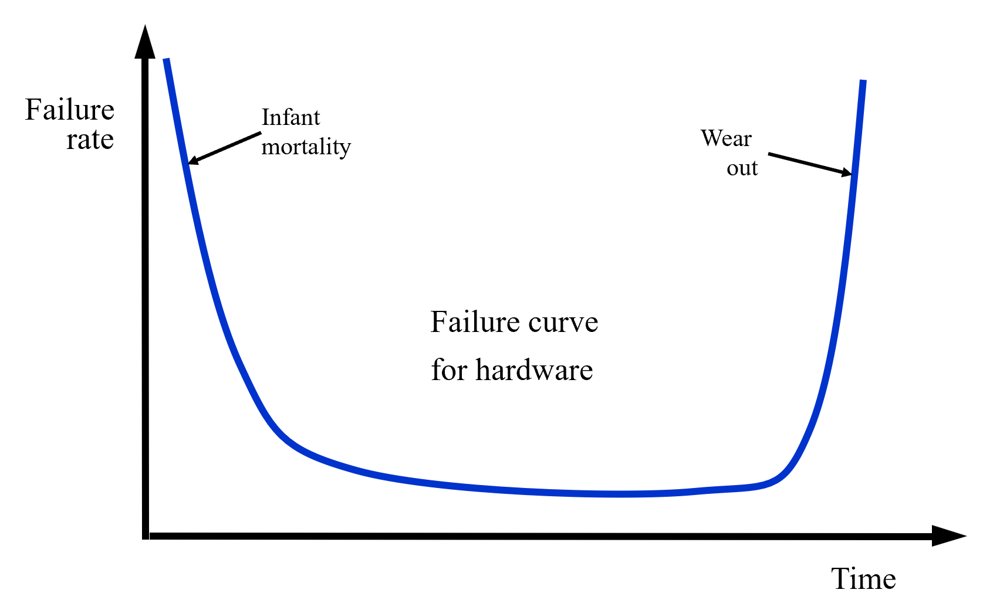
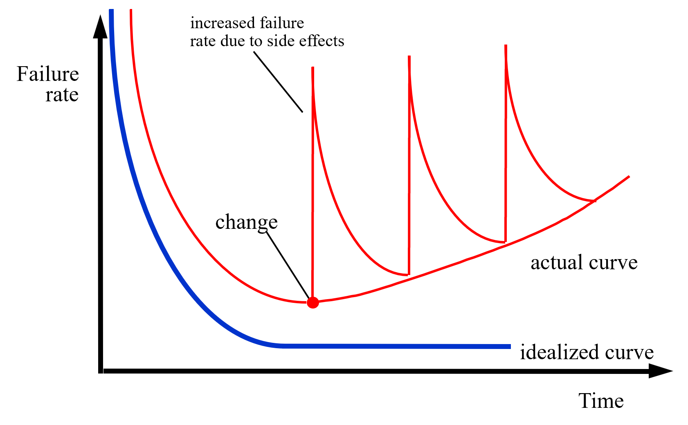

# Chapter 1 

## The Nature of Software

### 软件的演变（The Evolution）

**早期阶段**：用户（User）直接与计算机（Computer）交互，软件处于“史前时代”。

- 软件（Software）的定义：将一系列指令组合在一起，让计算机做有用的事情。

**20世纪50年代末**：高级语言和程序员职业化。

- 用户（User）与程序员（Programmer）之间有了分工，程序员负责与计算机交互。
- 计算机变得更便宜、更普及，高级语言被发明。

**20世纪60年代初**：大型系统与“软件危机”出现。

- 出现了“黑客（Hacker）”和“破解者（Cracker）”的区别。
- 很少有大型软件项目由少数专家完成。

---

### 软件的双重作用

软件既是产品（信息转换器），也是交付产品的载体（如操作系统、网络、工具等）。

软件开发过程中一直面临着一些根本性的问题：

1. 为什么软件开发周期很长？
2. 为什么开发成本很高？
3. 为什么在交付前无法发现所有错误？
4. 为什么维护现有程序需要大量时间和精力？
5. 为什么软件开发和维护过程中进度难以衡量？

---

### 什么是软件？（What is Software?）

软件是一组项目或对象的集合，形成一个**配置（configuration）**，包括：

- **指令（instructions）**：即计算机程序，执行后实现所需功能和性能。
- **数据结构（data structures）**：使程序能够有效处理信息。
- **文档（documents）**：描述程序操作和使用方法。
- 还有更多内容。

软件是**开发或工程化**出来的，而不是像传统意义上的制造品那样被制造出来。

软件与硬件的本质区别：

- 软件是逻辑产物，由开发产生。
- 硬件是物理实体，由制造产生。

---

### 软件的失效与退化

- 软件不会像硬件那样“磨损”（wear out），但会“退化”（deteriorate）。
- 硬件的失效率曲线为“浴缸曲线”：初期失效率高（设计或生产问题），中期失效率低且平稳，后期因磨损失效率骤升。
- 软件没有物理磨损，理论上失效率应始终很低，但实际上每次修改或引入变化时，失效率会突然升高。
- 软件行业虽然在向基于组件的组装发展，但大多数软件仍然是**定制开发（custom built）**。
- 软件没有“备件”可更换，每次更改都可能引入新的问题。

**硬件**

**软件**

---

### 遗留软件（Legacy Software）为何必须变更？

遗留软件（Legacy Software）指的是已经投入使用、但技术或需求不断变化的软件系统。它们必须变更的原因主要有：

1. **适应性（Adapted）**：软件必须适应新的计算环境或技术需求，如操作系统升级、硬件更替、网络环境变化等。
2. **增强性（Enhanced）**：软件需要增强以满足新的业务需求或功能扩展。
3. **扩展性（Extended）**：软件需要扩展以与其他现代系统或数据库实现互操作。
4. **重构（Re-architected）**：软件需要重构以适应网络化、分布式等新型应用场景。

---

### 软件的主要分类（Software Categories）

软件可以根据用途和实现方式分为以下七大类：

1. **应用软件（Application Software）**：为特定用户任务设计的程序，如 Microsoft Word、Photoshop、Spotify 等。
2. **系统软件（System Software）**：管理计算机资源的程序，如操作系统（Windows、macOS、Linux）。
3. **工程与科学软件（Engineering & Scientific Software）**：用于复杂数据计算和仿真的工具，如 MATLAB、AutoCAD。
4. **人工智能软件（Artificial Intelligence (AI) Software）**：利用机器学习和神经网络的软件，如 ChatGPT、Siri。
5. **产品线软件（Product-line Software）**：一组共享核心可复用组件的产品，如 Microsoft Office 套件。
6. **嵌入式软件（Embedded Software）**：嵌入硬件内部、控制其功能的软件，如微波炉控制系统、智能手表操作系统。
7. **Web 应用软件（Web-Applications, WebApps）**：通过浏览器访问、具备交互能力的程序，如 Google Docs、Netflix。

---

## The Changing Nature of Software

### WebApps（网络应用软件）

现代Web应用（WebApps）远不止是带有图片的超文本文件：

- 现代WebApps通过XML、Java等工具增强，支持交互式计算能力。
- WebApps既可以作为独立应用直接面向终端用户，也可以与企业数据库和业务系统集成。
- 语义网技术（Web 3.0）发展出复杂的企业级和消费级应用，涵盖需要灵活数据表示、API接口访问的语义数据库。
- WebApps的内容美学特性也是其质量的重要决定因素。

---

#### Web的发展阶段

1. **Web 1.0：只读型“电子图书馆”**（1990s-2000s）

- 以静态HTML/超链接为主，用户只能被动浏览信息，内容由信息发布者单向提供。

2. **Web 2.0：向“软件系统”转变**（2000s-2020s）

- 支持用户生成内容（UGC），引入高并发、数据库、会话等技术，平台变为交互式。
- 软件工程强度大幅提升，互联网页面变为复杂的交互式软件环境。

3. **Web 3.0及未来：智能系统与去中心化**（2020s及以后）

- 语义“数据网”：关注机器可理解的结构化知识、知识图谱、数据框架。
- 区块链Web：关注用户数据所有权、智能合约、去中心化平台。
- 文档网与数据网的融合，强调数据点之间的机器理解关系。

---

#### WebApps为何必须变革？

1. 适应新技术环境：WebApps需要不断适应新的开发技术、运行平台和用户需求。
2. 满足新业务需求：企业和用户对功能、性能和交互体验的要求不断提升。
3. 保持安全与兼容：应对网络安全威胁、数据隐私保护和与新系统的兼容性。

---

### Mobile Applications（移动应用软件）

移动应用软件（Mobile Applications）是指运行在手机、平板等移动平台上的应用程序。其主要特点和发展如下：

- 运行于移动平台，如手机或平板。
- 用户界面结合了设备特性和位置信息。
- 通常可同时访问网络资源和本地设备的处理、存储能力。
- 提供平台内持久化存储能力。
- 移动Web应用允许设备通过浏览器访问Web内容，兼顾移动平台的优劣势。
- 原生移动应用可直接访问硬件，实现本地处理和存储。
- 随着时间推移，Web应用与原生应用的界限逐渐模糊。

---

#### 移动应用的发展阶段

1. **萌芽阶段：简单固定工具**：以J2ME、WAP等协议为基础的硬件绑定型应用，如“贪吃蛇”等简单工具。
2. **原生应用爆发（2007-2012）**：iPhone和Android兴起，利用GPS、摄像头等硬件，推动高交互性产品。
3. **融合与跨平台成熟**：HTML5和混合模式应用出现，Web与原生应用界限模糊。
4. **云原生生态（2018-至今）**：应用迁移到云端，出现无需本地下载的“轻应用”或小程序。
5. **智能时代：AI集成（未来）**：应用集成语义理解、图像识别等AI能力，成为主动型智能助手。

---

#### 移动应用为何必须变革？

1. 适应新硬件和平台：移动设备硬件和操作系统不断升级，应用需适配新环境。
2. 满足用户体验和功能需求：用户对交互、性能和智能化的要求持续提升。
3. 应对安全与隐私挑战：移动应用需不断提升安全性，保护用户数据隐私。

---

### Cloud Computing（云计算）

云计算是一种通过网络为分布式计算设备提供数据存储和处理资源的计算模式。其核心思想是将计算资源（如服务器、存储、应用等）集中在云端，用户可按需获取和使用。

---

#### 云计算的三层服务模型

1. **IaaS（基础设施即服务，Infrastructure as a Service）**：提供基础的计算、存储、网络等资源，用户可灵活配置和管理，如AWS EC2、阿里云ECS等。
2. **PaaS（平台即服务，Platform as a Service）**：提供运行环境、数据库、中间件等平台服务，开发者可专注于应用开发，无需关心底层硬件，如Google App Engine、Microsoft Azure。
3. **SaaS（软件即服务，Software as a Service）**：直接向用户提供可用的软件应用，无需本地安装和维护，如Google Docs、Salesforce。

---

#### 云计算的发展历程

1. **1960s：公用事业设想（The Utility Vision）**：提出“计算像公用事业一样”的愿景，奠定了行业基础。
2. **1980s：网络化计算机（The Networked Computer）**：强调“网络即计算机”，推动了分布式计算的发展。
3. **1990s-2005：虚拟化与网格计算（Virtualization & Grids）**：虚拟化技术和网格计算成熟，为云计算奠定技术基础。
4. **2006年：公有云诞生（The Birth of Public Cloud）**：亚马逊推出S3和EC2，云计算正式命名并商用。
5. **现代：AI与云原生（AI & Cloud-Native）**：云与AI深度融合，Kubernetes等推动云原生应用架构。

---

#### 云计算的架构要点

- 云计算架构包含前端服务（如客户端设备、应用软件）和后端服务（如服务器、数据存储、后端应用）。
- 计算资源既可在云外部，也可在云内部，二者可互通。
- 云架构可分段以限制对私有数据的访问，提升安全性。

云计算极大地提升了资源利用率、弹性和可扩展性，是现代软件和服务的重要基础。

---

### 软件范式的演变：Software 1.0、2.0、3.0

随着技术的发展，软件的实现范式经历了三次重要变革：

---

#### Software 1.0

- 以传统编程为主，开发者通过编写明确的计算机代码（computer code），实现具体的程序逻辑。
- 程序直接在计算机上运行，所有规则和流程都由人手工设定。
- 代表性事件：20世纪40年代，计算机变得可编程。

---

#### Software 2.0

- 以神经网络为核心，开发者通过设计网络结构和训练数据，利用机器学习方法自动获得程序的“权重”（weights）。
- 程序的具体行为由神经网络参数决定，开发者不再直接编写所有细节。
- 典型案例：2012年AlexNet用于图像识别，推动深度学习应用。

---

#### Software 3.0

- 以大语言模型（LLM, Large Language Model）为代表，开发者通过“提示词”（prompts）与模型交互，模型根据提示自动生成程序或答案。
- LLM本质上是可编程的神经网络（programmable neural net），具备强大的泛化和理解能力。
- 代表性进展：2019年后，LLM广泛应用于自然语言处理、代码生成等领域。

---

#### 对比示例：情感分类（Sentiment Classification）

**Software 1.0**：

- 开发者手写规则（如关键词词典），通过代码判断文本情感。
- 示例：Python函数遍历文本，遇到正面或负面词汇计分，最后判断情感。

**Software 2.0**：

- 利用机器学习，收集大量正负样本，编码为特征（如词袋模型），训练二分类器，参数决定分类效果。
- 示例：输入1万条正例和1万条负例，训练得到模型参数。

**Software 3.0**：

- 通过提示词让大语言模型直接理解任务，无需手写规则或训练参数。
- 示例：给LLM一段说明和若干示例，模型即可自动判断新文本的情感。

这种范式的演进极大提升了软件的智能化和自动化水平，推动了AI驱动应用的快速发展。

---