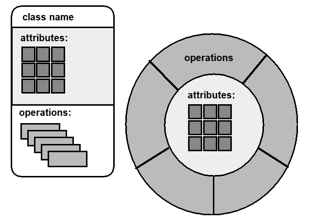
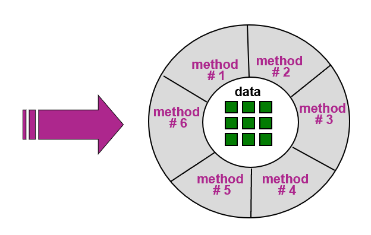
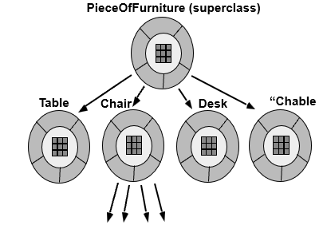
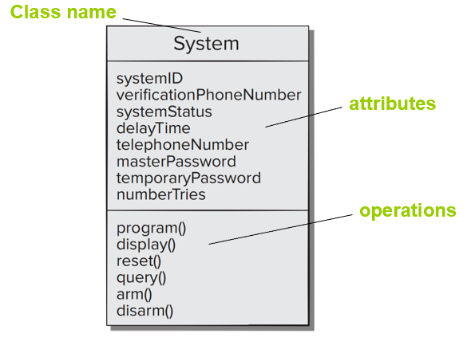
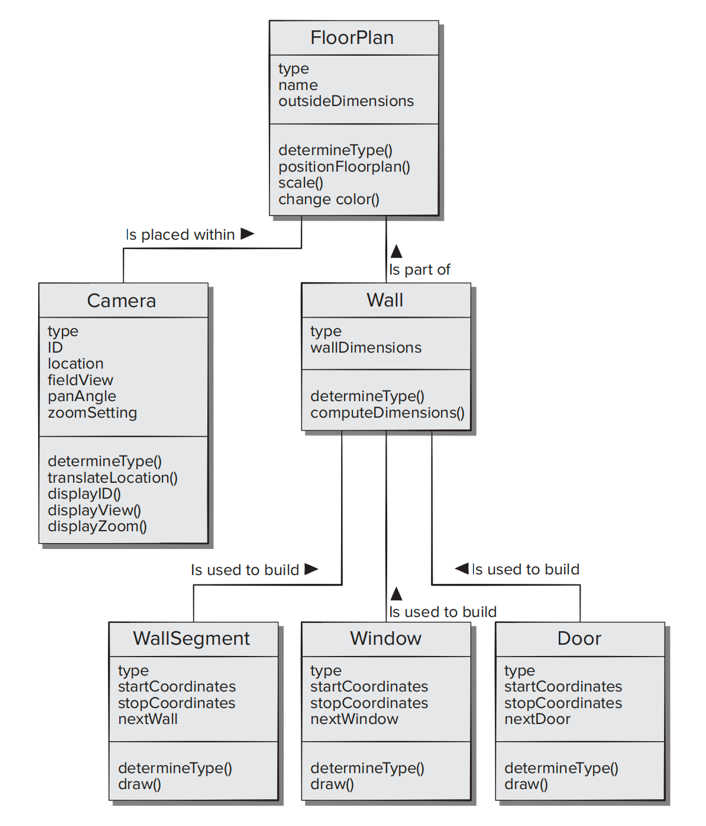
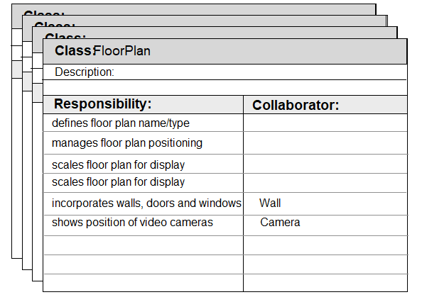
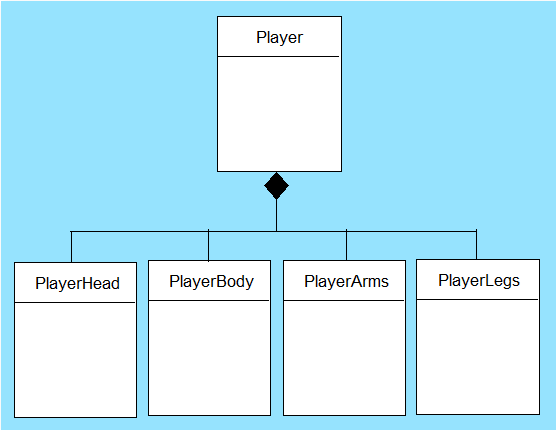
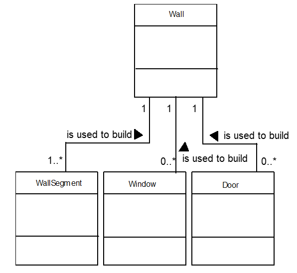
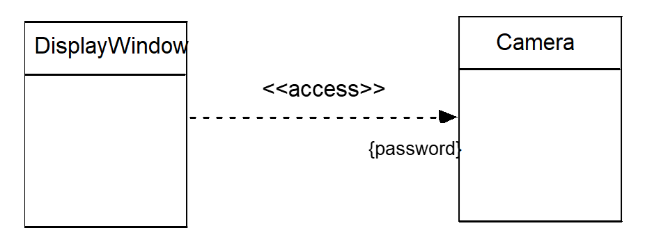
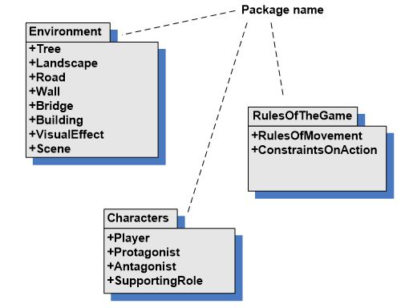

# Chapter 10 | Requirements Modeling: Class-Based Models

## 需求建模策略 (Requirements Modeling Strategies)

在软件开发的需求分析阶段，主要有两种截然不同的建模思路：**结构化分析**与**面向对象分析**。

### 结构化分析 (Structured Analysis)

这种方法将系统看作是**数据**与**处理过程**的集合，并将它们作为独立的实体进行建模。

* **数据对象 (Data objects)：** 重点定义数据本身的属性（Attributes）以及数据之间的关系（Relationships）。
* **处理过程 (Processes)：** 重点描述系统如何对数据进行操作。它展示了数据对象在流经系统时，是如何被转换或处理的。
* **典型工具：** 数据流图（DFD）。
* **局限性：** 数据与行为（操作）是分离的。当系统变得极其复杂时，这种“分离”会导致系统结构不够统一，维护难度增加。

---

### 面向对象分析 (Object-Oriented Analysis, OOA)

这是现代软件工程的主流方法。它不再将数据和过程分开，而是将它们统一在**“类” (Class)** 的概念中。

* **定义类 (Definition of classes)：** 类是数据（属性）和对数据操作（方法/行为）的封装体。
* **协作方式 (Manner of collaboration)：** 重点描述这些类之间如何相互协作、相互影响，以最终满足用户的需求。
* **核心理念：** 系统不再是“数据的流动”，而是“对象之间的协作”。

---

## Object-Oriented Concepts

### Key Concepts

**类与对象 (Classes and objects)：**

* **类**是蓝图或模板（例如“汽车”的设计图）。
* **对象**是类的具体实例（例如你家楼下停着的那辆红色轿车）。

**属性与操作 (Attributes and operations)：**

* **属性**描述对象“是什么”（状态、数据），如颜色、品牌。
* **操作**描述对象“能做什么”（行为、功能），如加速、刹车。
* **封装与实例化 (Encapsulation and instantiation)：**
* **封装**是将数据和操作包裹在一起，并隐藏内部细节（Information Hiding）。外部只需要知道接口，不需要知道内部怎么实现的。
* **实例化**是根据“类”这个模板创建出具体“对象”的过程。

**继承 (Inheritance)：** * 描述类之间的层次关系。子类可以继承父类的属性和行为，实现代码复用。例如，“电动车”可以继承“汽车”的所有特征，并增加自己的电池属性。
    
---

### Tasks

在进行面向对象建模时，开发者需要完成以下具体工作：

1. **识别类 (Identify Classes)：** 找出系统中存在的实体，并明确它们的属性（数据）和方法（行为）。
2. **定义类层次结构 (Define Hierarchy)：** 通过继承等关系，构建类与类之间的父子树状结构。
3. **表示对象关系 (Represent Relationships)：** 描述不同对象之间是如何关联的（例如：一个“订单”对象关联多个“商品”对象）。
4. **建模对象行为 (Model Behavior)：** 描述对象在不同状态下的反应或交互逻辑。
5. **迭代执行 (Reapplied Iteratively)：** 这是一个反复完善的过程，随着对需求理解的加深，需要不断回头优化上述建模任务。

> 为什么需要封装？(Why Encapsulation?)
> 
> 封装的意义在于：
> 
> * **降低复杂性：** 开发者只需要关注对象暴露出来的“按钮”（接口），不用担心内部复杂的电路（实现）。
> * **安全性：** 防止外部直接随意修改内部核心数据。
> * **易维护性：** 只要接口不变，内部逻辑的修改不会影响到使用它的其他模块。

---

## Classes

### 什么是“类” (What is a Class?)

面向对象思维始于对“类”的定义。图片给出了三个定义角度：

* **模板 (Template)：** 类就像是一张建筑蓝图。它规定了房子（对象）应该有的结构，但蓝图本身不能住人。
* **泛化描述 (Generalized description)：** 它不是描述某个特定的个体，而是描述一类事物的共同特征。
* **相似事物的集合 (Describing a collection of similar items)：** 它将具有相同属性（如“姓名”、“年龄”）和相同行为（如“走路”、“说话”）的对象归为一组。例如，“订单”、“用户”、“设备”都是对现实世界中相似事物的抽象。

---

#### 元类与超类 (Metaclass & Superclass)

一个进阶概念：**a metaclass (also called a superclass)**。

**建立层级结构 (Establishes a hierarchy)：** 在建模过程中，我们会发现有些类具有更普遍的特征。

* 例如：“学生”和“教师”都是具体的类，但他们都有“姓名”和“工号/学号”。
* 我们可以定义一个更高级的类叫“人”（Person），这就是他们的**超类 (Superclass)**。

**意义：** 通过这种层级结构，我们可以更好地组织复杂的系统，使模型更清晰，并实现代码和逻辑的**复用**。

---

#### 类与实例 (Class vs. Instance)

这是理解面向对象的关键转折点：

* **识别具体实例 (Identify specific instance)：** 一旦“类”被定义好了，我们就可以根据这个模板识别或创建出具体的“实例”（Instance）。

**抽象 vs 具体：** 

* **类**是抽象的概念（例如“汽车”这个概念）。
* **对象/实例**是具体的实体（例如“你正在驾驶的那辆车”）。

---

### Building a Class

#### 类的三层标准结构

图中展示了一个非常经典的类表示法（类似于 UML 类图的基础形式）。一个类通常由三部分组成：

* **类名 (Class Name)：** 位于最上方，用于唯一标识这个类。例如 `Student` 或 `CompilerParser`。
* **属性 (Attributes)：** 位于中间层。它代表了类所拥有的**数据**。图中用九宫格方块示意，代表不同的数据字段（如 `name`, `id`）。
* **操作 (Operations)：** 位于最底层。它代表了类能执行的**行为**或**方法**。图中用重叠的方块示意，代表不同的功能函数。

---

#### 封装的可视化模型

右侧的圆形图表生动地展示了**封装 (Encapsulation)** 的本质：

* **内核：属性 (Attributes)** 被包裹在中心。
* **外壳：操作 (Operations)** 环绕在属性周围。
* **深层含义：** 这意味着外部世界不能直接触碰到内部的数据（属性），必须通过外层的“操作”接口来访问或修改。这就像是一个保护壳，确保了数据的安全性和逻辑的一致性。

---

#### 需求建模阶段的关注点

> **类 = 数据（属性）+ 行为（方法）**

在**需求建模阶段**，我们的目标不是写代码，而是理清逻辑。因此：

* **不关心实现：** 我们不需要考虑算法怎么写、调用什么 API。
* **关心职责：** 我们只关注这个类应该具备哪些**能力**，以及它在整个系统中承担什么**职责**。

---

### **方法 (Methods)**

#### 方法的定义与角色 (Definition of Methods)

在面向对象建模中，**方法**（也称为**操作**或**服务**）被视为类对外提供的“接口”。

* **封装性 (Encapsulated)：** 方法是封装在类内部的可执行过程。
* **操作数据 (Operate on attributes)：** 方法的设计初衷是为了操作类中定义的一个或多个数据属性。例如：在“银行账户”类中，“取钱”这个方法会操作并修改“余额”这个属性。
    
---

#### 消息传递 (Message Passing)

**A method is invoked via message passing（方法通过消息传递来调用）**。

在面向对象系统里，对象之间不是“野蛮地”直接修改对方的数据，而是非常有礼貌地“发消息”：

* **交互逻辑：** 对象 A 想要对象 B 做某事，它会给对象 B 发送一个消息（即调用 B 的方法）。
* **自主性：** 对象 B 收到消息后，在自己的方法内部处理自己的数据。
    
**强调**软件工程中的两个重要原则：

1. **“方法是用来操作数据的”：** 所有的状态改变都应该通过方法来完成，而不是直接暴露数据。
2. **接口交互原则：** “不要直接操作别人的数据，而是通过接口进行交互。” 

* 这正是**封装 (Encapsulation)** 和 **信息隐藏 (Information Hiding)** 的技术基础。
* 这样做的好处是：即使以后你修改了类内部数据的存储方式，只要对外的方法接口不变，其他调用你的代码就不需要做任何改动。

---

### **封装与信息隐藏 (Encapsulation/Hiding)**

#### 封装的定义 (Encapsulation)

核心定义是：**对象将“数据”和“操作数据的逻辑过程”封装在一起。**

* **内部 (Inner)：** 绿色九宫格代表 **数据 (Data)**。这是对象的状态核心。
* **外部 (Outer)：** 周围的扇形代表 **方法 (Method #1 至 #6)**。这是操作数据的唯一通道。
* **紫色箭头：** 代表外部世界的访问请求。它必须指向“方法”层，而不能越过方法直接触碰中心的“数据”。

---

#### 信息隐藏 (Information Hiding)

通过封装，我们实现了 **“信息隐藏”**。这意味着：

* **隐藏存储细节：** 外部不需要知道数据是存在数组里、链表里，还是从数据库实时读取的。
* **隐藏实现逻辑：** 外部调用“计算利息”的方法时，不需要了解内部复杂的金融公式或安全校验代码。
* **暴露接口 (Interface)：** 外部只需知道方法的名称和参数（接口），就能使用对象的功能。

封装和信息隐藏的好处：

* **安全性 (Security)：** 防止外部代码随意篡改对象状态。
* **可维护性 (Maintainability)：** 因为内部实现被隐藏了，你可以随时重构内部代码（比如把算法从 $O(n^2)$ 优化到 $O(n \log n)$），而不会影响到任何外部调用者。
* **建模思考：** 在需求分析阶段，你就需要决定：**哪些信息对外开放，哪些应该被隐藏？**

---

### **类层次结构 (Class Hierarchy)**

#### 父类与子类

图片通过一个家具的例子直观地展示了这种结构：

* **父类 (Superclass)：** `PieceOfFurniture`（家具）。这是一个更一般的、泛化的概念。它包含了所有家具共有的属性（如材质、价格）和行为。
* **子类 (Subclasses)：** `Table`（桌子）、`Chair`（椅子）、`Desk`（书桌）。这些是更具体的类，它们从父类派生而来。

---

#### is-a 关系

类层次结构的核心在于 **"is-a"（是一种）** 的关系。

* `Table` **is a** `PieceOfFurniture` (桌子是一种家具)。
* `Chair` **is a** `PieceOfFurniture` (椅子是一种家具)。

这种逻辑确保了分类的合理性。如果两个类之间不满足 "is-a" 关系，就不应该建立继承连接。

---

#### 继承的工程优势

通过将“共性”放在父类，“个性”放在子类，这种结构带来了三个巨大的好处：

* **提高复用性：** 公共的属性和方法只需要在父类定义一次，所有子类自动拥有，无需重复编写代码。
* **提高可扩展性：** 如果以后想增加一个新的家具类型（如 `Sofa`），只需要让它继承 `PieceOfFurniture` 即可，不需要修改现有的代码结构。
* **结构清晰：** 整个系统的逻辑像树状图一样一目了然，便于管理复杂系统。

---

#### 多层嵌套结构

观察图中 `Chair`（椅子）下方还有四个向下的箭头，这说明：
* **层次是可以嵌套的：** `Chair` 可以进一步细分为 `OfficeChair`（办公椅）、`DiningChair`（餐椅）等。
* **继承链：** 子类也可以成为其他类的父类，形成多层的继承链。

---

## **基于类的建模 (Class-Based Modeling)**

### 类建模代表了什么？ (Class-based modeling represents)

类建模不仅仅是画几个方框，它实际上是在用四种元素构建系统的虚拟世界：

* **对象 (Objects)：** 系统将要操作的核心实体。它们是数据的载体。
* **操作 (Operations)：** 也称为方法或服务。它们是执行操作、改变对象状态的手段。
* **关系 (Relationships)：** 对象/类之间的连接。这包括了上一页讲到的**层级关系（继承）**，也包括了简单的关联关系。
* **协作 (Collaborations)：** 这是动态的一面。它描述了定义的各个类之间如何“打配合”来共同完成一个复杂的用户需求。

> **用“类 + 关系 + 协作”来描述整个系统。**

我们可以从三个层面来理解这个过程：

1. **静态层面：** 系统里有哪些“类”，它们长什么样（属性和操作）。
2. **结构层面：** 这些类之间有什么“关系”（谁是谁的父类，谁包含谁）。
3. **动态层面：** 这些类之间如何“协作”（当用户点击一个按钮时，对象 A 调用对象 B 的什么方法）。

---

#### 从需求到模型

将建模过程拆解为四个具体步骤：

1. 识别分析类 (Identify analysis classes)

首先，通过审查**问题陈述（Problem Statement）**来寻找核心对象。这里的重点是“分析类”，即站在业务逻辑的角度去思考，而不是急着去想代码里的数据结构。

2. 使用“语法解析” (Grammatical Parse)

**候选类（Potential Classes）**：

* **名词（Nouns）** $\rightarrow$ 往往对应**类**或**属性**。
* **动词（Verbs）** $\rightarrow$ 往往对应**操作**（方法/行为）。

3. 识别属性 (Identify attributes)

确定了有哪些类之后，就要为每一个类定义它的“状态”。

* 你需要思考：这个类需要保存哪些关键信息？
* 例如，如果类是“学生”，属性就是“学号”、“姓名”。

4. 识别操作 (Identify operations)

最后，确定哪些行为会作用于这些属性。

* 你需要思考：这个类能做什么？它提供哪些服务？
* 这些操作最终会操纵（Manipulate）在第 3 步中定义的属性。

---

### **到底什么才算是一个“类”？(What is a Class?)**

#### 类的来源 (Where do classes come from?)

* **发生事件 (Occurrences)：** 系统运行过程中发生的动作或事件（如：一次转账、一次点击）。
* **事物 (Things)：** 现实存在的实体（如：一本书、一个传感器）。
* **外部实体 (External entities)：** 与系统交互的其他系统或硬件（如：打印机、外部数据库）。
* **角色 (Roles)：** 使用系统的人所扮演的身份（如：管理员、普通用户、学生）。
* **组织单位 (Organizational units)：** 现实中的部门或小组（如：财务部、编译器开发组）。
* **地点 (Places)：** 存放东西或发生动作的场所。
* **结构 (Structures)：** 系统内部的逻辑构成（如：语法树、符号表）。

---

#### 合理类的“金标准”

**类不是为了建而建，而是为了“角色”而建。**

一个合理的类必须具备以下特征：

1. **明确的意义：** 它在业务逻辑中必须有一个清晰的定义，大家一听名字就知道它是干嘛的。
2. **承载属性与行为：** 如果一个名词在系统中既没有需要保存的数据（属性），也没有需要执行的操作（行为），那它可能就不适合作为一个独立的类。
3. **清晰的角色：** 每个类都应该在系统中扮演一个独特的角色，避免职责重叠。

---

### **候选类（Potential Classes）**

#### 筛选“合理类”的 6 条标准

为了避免系统变得臃肿或支离破碎，每一个被保留的类都应满足以下条件：

1. **需要记住的信息 (Retained information)：**

该类必须包含系统运行过程中必须长期保存的数据。如果去掉这个类，系统就会丢失关键信息，那么它就值得保留。

2. **需要提供的服务 (Needed services)：**

类不仅要有数据，还得有**行为**。它必须拥有一组可识别的、能改变其属性值的操作。如果一个类从不参与系统交互，那它可能多余了。

3. **拥有多个属性 (Multiple attributes)：**
    
在分析阶段，我们关注的是“厚实”的对象。如果一个类只有一个属性（比如只有一个“时间”或“编号”），通常更适合把它归为另一个类的**属性**，而不是单独建类。

4. **共性属性 (Common attributes)：**

该类定义的一组属性必须适用于该类的**所有实例**。这保证了类的抽象是稳定且统一的。

5. **共性操作 (Common operations)：**

同样地，该类定义的操作也必须适用于所有实例。

6. **关键需求相关 (Essential requirements)：**

出现在问题空间中、负责产生或消耗关键信息的外部实体（如用户、设备）几乎总是应该被定义为类。

---

## **类图 (Class Diagram)**

### 类图的基本结构 (Structure of a Class Diagram)

图中展示了一个标准的类表示法，通常使用一个分为三层的矩形框：

**最上层：类名 (Class name)**

* 图中示例的类名为 `System`。这是该对象的唯一标识。

**中间层：属性 (Attributes)**

* 列出了该类所拥有的所有数据字段。例如：`systemID`、`systemStatus`、`masterPassword` 等。
* 这些属性定义了对象的“状态”。

**最下层：操作/方法 (Operations)**

* 列出了该类能执行的所有行为。例如：`display()`、`reset()`、`query()`、`arm()` 等。
* 这些方法定义了对象的“能力”。

类图在工程实践中的两个作用：

1. **标准化表达：** 它不仅是给开发者自己看的，更是一种通用的“行业语言”。无论谁看到这个矩形框，都能立刻理解 `System` 类包含了哪些数据和功能。
2. **可视化汇总：** 正如解析所说，它把原本分散在文档中的名词和动词，以一种**清晰、结构化**的方式汇总在了一起。

但在真实系统中，问题从来不是“一个类”，而是多个类如何组织在一起，形成一个系统。

可以到这里不再是孤立的类，而是一组类之间通过不同关系连接在一起。

---

## **CRC 建模 (Class-Responsibility-Collaborator Modeling)**

### CRC 是什么？

CRC 是三个核心概念的缩写，对应了分析阶段需要回答的三个终极问题：

**Class (类) —— “这个类是谁？”**
    
* 指的是系统中的分析类。

**Responsibility (职责) —— “它负责做什么？”**
    
* 职责是类所封装的**属性**和**操作**。它强调的是功能意图，而不仅仅是代码函数。

**Collaborator (协作者) —— “它需要谁的帮助？”**
    
* 当一个类为了完成自己的职责，需要获取其他类的信息或请求其执行某个动作时，这些类就成了协作者。

---

### 从“结构”转向“行为”

CRC 模型是**“从结构建模走向行为理解”的桥梁**。

* **对比类图：** 类图展示的是“我有这些东西”；而 CRC 展示的是“我要完成这些任务，并且我需要找谁配合”。
* **协作的本质：** 协作通常意味着两种情况：

1. **请求信息：** 对象 A 问对象 B：“你的状态是什么？”
2. **请求动作：** 对象 A 对对象 B 说：“请帮我执行这个操作。”

---

### 为什么 CRC 很重要？

在复杂系统开发中，最难的往往不是定义类，而是**职责分配**。CRC 建模帮助开发者思考：

* **避免臃肿：** 如果一个类的职责列表太长，说明它管得太宽了，需要拆分。
* **明确边界：** 通过确定协作者，我们能清晰地看到系统模块之间的依赖关系。

---

### **CRC 卡片**

#### CRC 卡片的结构分析

以 `FloorPlan` 类为例，它被分为三个核心区域：

* **类名 (Class)：** 位于卡片顶端，明确这张卡片代表哪个核心对象（如：`FloorPlan` 平面图类）。
* **职责 (Responsibility)：** 位于卡片左侧。它描述了这个类**知道什么（Knows - 属性）**以及**能做什么（Does - 操作）**。例如：定义平面图名称、管理定位、缩放显示等。
* **协作者 (Collaborator)：** 位于卡片右侧。当左侧的某个职责无法独立完成，需要外界信息时，就在此处列出“帮手”。例如：为了“显示摄像头位置”，它需要 `Camera` 类的协作；为了“整合墙壁、门窗”，它需要 `Wall` 类的协作。

---

#### 职责驱动设计

CRC 模型不仅仅是一个描述工具，更是一个**设计优化工具**：

* **动态视角：** 它强迫你思考“这个类在业务层面承担的角色”，而不仅仅是列出函数名。
* **职责分配：** 通过填表，你可以直观地发现设计缺陷。

1. **职责过多：** 如果卡片左侧写满了，说明这个类太累了，需要**拆分**。
2. **几乎没职责：** 如果卡片是空的，说明这个类可能**不应该存在**。

* **协作关系：** 它清晰地展示了类与类之间的“求助”路径。

---

## **EBC 模式 (Entity-Boundary-Control)**

### 三种类类型 (Class Types)

这种分类方法（常被称为“鲁棒性分析”或“初步设计”）将类分为三个核心角色：

1. **实体类 (Entity Classes)**

* **定义：** 直接从问题陈述中提取的模型或业务类。
* **特点：** 它们是系统的**“数据载体”**。通常具有稳定性，生命周期较长（信息需要持久化存储）。
* **例子：** 用户、订单、商品、存储代码的 `AST` 节点。

2. **边界类 (Boundary Classes)**

* **定义：** 用于创建系统与外部世界（人或其他系统）交互的接口。
* **特点：** 它们是系统的**“入口和出口”**。负责处理交互逻辑。
* **例子：** 用户登录界面、报表打印、API 接口、编译器中的 `Scanner`（与源代码文件交互）。

3. **控制类 (Controller Classes)**

* **定义：** 管理从开始到结束的一项“工作单元”。
* **特点：** 它们是系统的**“调度者”**。本身不存太多数据，而是负责“串联”实体和边界。
* **具体职责：** 创建/更新实体、实例化边界、管理复杂通信、验证数据。
* **例子：** 编译器中的 `Parser`（调度词法分析和语法分析）、业务逻辑处理器。

---

### 结构化分层

> **Boundary 负责交互，Controller 负责流程，Entity 负责数据。**

这种划分方式其实是现代软件架构（如 MVC 模式）的前身。它的核心价值在于：**解耦**。

* 如果你更换了界面（Boundary 变了），你的业务逻辑（Controller）和核心数据（Entity）不需要动。
* 如果你修改了数据结构（Entity 变了），只要对外提供的接口不变，交互界面就不受影响。

---

## **分配职责的准则 (Guidelines for Allocating Responsibilities)**

### 职责分配的 5 大原则

这些准则本质上是在追求软件工程中的两个终极目标：**高内聚 (High Cohesion)** 和 **低耦合 (Low Coupling)**。

1. 智能分配：去中心化 (Distributed Intelligence)

* **准则：** 系统智能应该分散在多个类中。
* **解析：** 拒绝“万能类” (God Class)。不要让一个类承载所有的逻辑，而应该根据问题本身把职责拆分。

2. 通用性描述 (Generally Stated)

* **准则：** 每个职责的陈述应尽量保持通用。
* **解析：** 职责定义得越通用，类就越容易被复用。避免把职责写死在某个极其具体的业务场景中。

3. 数据与行为相关联 (Related Information and Behavior)

* **准则：** 信息以及与之相关的行为应该放在同一个类中。
* **解析：** 这是封装的核心。如果一个类拥有某些数据，那么操作这些数据的方法也应该属于它。

4. 信息局部化 (Localized Information)

* **准则：** 关于某件事的信息应该集中在一个类中，而不是散落在多个类里。
* **解析：** 这样做可以保证数据的一致性。如果一个信息点散布在四五个类里，修改时极易出错。

5. 职责共享 (Shared Responsibilities)

* **准则：** 在合适的情况下，职责可以在相关类之间共享。
* **解析：** 强调协作。复杂任务不该由一个类孤军奋战，合理的任务分摊（如通过继承或聚合）能让系统更灵活。

---

## **协作 (Collaborations)**

### 履行职责的两种方式

一个类在面对自己的职责（Responsibility）时，通常有两条路可以走：

* **自力更生：** 类使用**自己的操作**（Operations）来处理**自己的属性**（Attributes）。这意味着任务完全在它的能力范围内。
* **寻求协作 (Collaborate)：** 类发现单靠自己搞不定，于是通过调用其他类的方法来共同完成任务。

**协作的本质：** 系统功能的实现往往不是孤立的，而是通过多个类之间的“握手”和“信息交换”完成的。

---

### 三种通用的类关系 (Generic Relationships)

协作在结构上表现为类与类之间的连接。图中给出了三类最典型的关系：

1. **is-part-of (部分—整体关系)**

* **定义：** 一个类是另一个类的组成部分。
* **特点：** 强调**组成 (Composition/Aggregation)**。就像“引擎”是“汽车”的一部分。

2. **has-knowledge-of (知晓关系)**

* **定义：** 一个类知道另一个类的存在，或者持有关于另一个类的信息。
* **特点：** 强调**引用或认知**。不一定是强依赖，但为了履行职责，它必须能“找到”另一个对象。

3. **depends-upon (依赖关系)**

* **定义：** 一个类的实现或功能依赖于另一个类提供的服务。
* **特点：** 强调**功能依赖**。如果被依赖的类发生了重大变化，那么依赖它的类往往也需要随之调整。

---

### **组合/聚合关系 (Composite / Aggregate Class)**

它是对上一页提到的 **is-part-of（部分—整体关系）** 的进一步具象化。

---

#### 部分与整体

图中展示了一个典型的层级结构：

* **整体 (Whole)：** `Player`（玩家）。
* **部分 (Parts)：** `PlayerHead`（头部）、`PlayerBody`（身体）、`PlayerArms`（手臂）、`PlayerLegs`（腿部）。

这种关系描述的是：一个对象并不是孤立存在的，而是由多个子对象共同构成的**结构化整体**。

---

#### 强关联 (Strong Association)

* **生命周期绑定：** 这些子部分通常依赖于整体而存在。如果“整体”消失了，这些“部分”往往也就失去了意义。比如：在软件中，如果一个“订单”对象被删除了，那么该订单下的所有“订单项”子对象通常也会一并被销毁。
* **物理/逻辑组成：** 这种关系更偏向于**结构上的组织**，而不仅仅是简单的函数调用。

---

#### 在建模中的意义

引入这种关系的意义在于：

* **表达层次结构：** 让我们能清晰地看到系统的逻辑分层。
* **管理复杂性：** 通过将复杂的整体拆解为功能单一的子组件，符合我们之前讲过的“职责分配”原则。

---

## **关联 (Associations)** 和 **依赖 (Dependencies)**

### 关联关系 (Associations)

**关联**描述的是类之间一种比较稳定的、结构性的连接。

* **特点：** 它通常代表一种**“拥有”或“属于”**的关系。这种连接是长期的，是系统静态结构的一部分。
* **例子：** “订单”类和“用户”类。一个订单通常属于一个特定的用户，这种关系在数据库和代码结构中是持久存在的。
* **多重性 (Multiplicity)：** 关联通常会带上数字（如 $1..*$），表示一个对象可以连接多少个另一个对象。

---

### 依赖关系 (Dependencies)

**依赖**描述的是类之间一种比较短暂的、行为性的连接。

* **特点：** 它通常代表一种**“使用”**的关系。在这种关系中，一个类（客户端）在执行某个特定操作时，需要临时借用另一个类（服务器端）的功能。
* **客户-服务器模型：** 如果服务器端的代码改了，客户端可能会“转不动”，这就是依赖。但一旦操作完成，这种联系通常就断开了。
* **例子：** 一个“打印机”类依赖于“文档”类。打印机只有在执行 `print()` 方法时才需要文档，平时它们之间没有必然的结构联系。

> **Association 是“结构性”的关系，Dependency 是“行为性”的关系。**

我们可以用更感性的方式来理解：

* **Association** 就像是**“亲戚”或“邻居”**：关系很稳固，一直都在那里。
* **Dependency** 就像是**“乘客”与“司机”**：只在坐车的那段时间有关系，下车就没关系了，但司机的水平直接决定了乘客能否安全到达。

---

## **多重性 (Multiplicity)**

### 墙与它的组件

图中展示了一个核心类 `Wall`，以及它通过 `is used to build`（用于构建）关系连接的三个类：`WallSegment`（墙段）、`Window`（窗户）和 `Door`（门）。

连线两端的数字标注是这一页的核心，它们代表了对象之间的数量约束：

1. **Wall vs. WallSegment ($1$ 对 $1..*$)**

* **Wall 端是 $1$：** 意味着每个墙段必须且只能属于一堵墙。
* **WallSegment 端是 $1..*$：** 意味着一堵墙必须至少包含一个墙段，也可以有多个。
* **设计含义：** 墙段是**必须存在**的（强制性约束）。没有墙段，墙就不成立。

2. **Wall vs. Window ($1$ 对 $0..*$)**

* **Window 端是 $0..*$：** 意味着一堵墙可以没有窗户（$0$），也可以有多个窗户（$*$）。
* **设计含义：** 窗户是**可选**的。这给了设计极大的灵活性。

3. **Wall vs. Door ($1$ 对 $0..*$)**

* **Door 端是 $0..*$：** 与窗户类似，表示门也是可选的，且数量不限。

**多重性不仅仅是“数量关系”，它隐藏了深刻的设计决策。**

* **必然性 vs. 可选性：** 哪些元素是系统运行的基础（如 `WallSegment`），哪些是附加的（如 `Window`）。
* **约束条件：** 这些数字直接决定了未来数据库中“外键”的约束，以及代码中集合类（如 `List` 或 `Set`）的使用方式。

---

## **依赖关系 (Dependencies)** 在 UML 类图中的具体表现形式

### 依赖关系的视觉标识 (Visual Representation)

图中展示了 `DisplayWindow`（显示窗口）和 `Camera`（摄像头）两个类。它们之间的连线包含了三个关键的 UML 符号：

**虚线箭头 (Dashed Arrow)：** 这是 UML 中定义“依赖”的标准符号。

* **含义：** 它强调的是一种“使用关系”，而非结构上的长期关联。这表示一个类的实现需要另一个类的协助。

**箭头的方向 (Direction)：** 箭头从 `DisplayWindow` 指向 `Camera`。

* **含义：** 这代表**谁依赖谁**。即 `DisplayWindow` 是客户端，它在执行某些操作时需要调用 `Camera`（服务器端）提供的方法。

**构造型 (Stereotype) `<<access>>`：** 位于箭头上方。

* **含义：** 它描述了依赖的具体性质。在这里指的是“访问”，即 `DisplayWindow` 会访问 `Camera` 的资源或接口。

**约束与附加信息** 右侧的 **`{password}`**。

* **含义：** 这通常表示一种**约束条件**。在这个例子中，它意味着 `DisplayWindow` 在访问 `Camera` 时，必须满足某种条件（例如提供密码验证）。这体现了系统建模时对安全性和前置条件的考虑。

> **依赖关系是短暂的、行为层面的，是在某个操作过程中“用到”另一个类。**

这与“关联”这种结构性、长期的关系形成了鲜明对比。在建模时，如果一个类只是作为另一个类方法的参数出现，或者在方法内部被临时实例化，通常就应该画成这种**虚线箭头**。

---

## **CRC 模型评审 (Reviewing the CRC Model)**

### 分发卡片

在评审开始前，有一个非常有趣的规则：

* **分发子集：** 所有的参与者都会拿到一部分 CRC 索引卡片。
* **分离原则 (Separated)：** **核心关键点**——存在协作关系的类，必须分配给**不同**的人。

**目的：** 强制模拟类与类之间的交互。如果两个协作的类都在一个人手里，交互就会变成“左右手互搏”，无法暴露接口设计上的缺陷。

---

### 用例场景 (Use-Case Scenarios)

评审不是漫无目的的，而是由业务场景驱动的。

* **分类整理：** 所有的用例及其对应的用例图需要按类别组织好。
* **评审负责人 (Review Leader)：** 负责人会逐字逐句地大声朗读一个具体的用例场景。

---

### 核心机制：传递“Token”

* **对象识别：** 当负责人读到一个具体的目标对象（类名）时，他会把一个物理上的 **Token（令牌/标志物）** 传给持有该类卡片的人。
* **职责确认：** 拿到 Token 的人需要站出来，说明根据卡片上的记录，他的类在这种情况下应该承担什么职责，以及是否需要找其他协作者帮忙。
* **协作流转：** 如果需要协作，Token 就会继续传递给下一位持卡人。

评审的工程意义是：

> **通过“动态过程”来验证，而不是静态地看一张图。**

这种方式能立刻发现以下问题：

* **职责缺失：** 读到某个步骤，发现没人能接这个 Token，说明漏掉了一个类或一项职责。
* **流程冗余：** Token 在多个人手里转了无数圈才完成一个小功能，说明系统设计过于复杂，耦合太重。

---

### 令牌持有者的职责 (Responsibility of the Token Holder)

当 **Token** 传递到某人手中时，持卡人需要扮演该“类”的角色：

* **描述职责：** 根据 CRC 卡片上的记录，详细说明该类在当前这个用例步骤中“知道什么”或“能做什么”。
* **集体判定：** 评审小组会共同判断：**卡片上现有的职责，是否足以满足该用例的需求？**

---

### 如果“满足不了”怎么办？ (Handling Mismatches)

这是评审的核心价值所在。如果发现现有的职责或协作关系无法支撑用例的执行，就必须对模型进行**即时修改**。

通常包括以下几种修正情况：

* **定义新类：** 发现原本的设计中漏掉了一个核心参与者。这时需要新建一张 CRC 卡片。
* **修改现有卡片：** 

1. **增加职责：** 发现这个类其实应该负责某项工作，但之前没写上去。
2. **重新指定协作：** 发现这个类单打独斗搞不定，需要找其他类帮忙。

* **细化规格：** 重新定义职责的描述，使其更加精准。

> **不要“强行用现有类去适配用例”，而是让模型不断演进，去更好地匹配真实需求。**

这种“动态评审”就像是在写代码之前的**“人工仿真”**。通过这种低成本的卡片修改，可以避免在后期编码阶段才发现架构设计的重大漏洞。

---

## **分析包 (Analysis Packages)**

### 为什么需要“包” (The Purpose of Packages)

在实际软件系统中，类的数量可能成百上千。如果全部堆在一起，系统会变得极其混乱。

* **分组管理：** 包就像文件夹，将相关的分析模型元素（如用例、分析类）按照逻辑归类。
* **模块化思考：** 通过包，开发者可以从“逻辑上的模块划分”来审视系统，而不是迷失在细节中。

---

### 可见性控制 (Visibility Symbols)

控制包内元素访问权限有三个关键符号。这些符号决定了包与包之间如何进行安全交互：

| 符号 | 含义 | 对应编程概念 | 详细解释 |
| :---: | :---: | :---: | :---: |
| **`+`** | **Public** (公有) | `public` | 对其他包可见，其他包的类可以直接访问。 |
| **`-`** | **Private** (私有) | `private` | 对包外部隐藏，只能在当前包内部使用。 |
| **`#`** | **Protected** (受保护) | `protected` | 仅对特定范围内可见（通常指包内或继承体系内）。 |

* **组织性：** 必须通过 package 来组织，否则系统会陷入无序状态。
* **控制性：** 通过可见性符号，明确定义模块的“出口”和“入口”，防止不必要的耦合。

---

图中将整个系统划分为三个互不重叠、职责清晰的包：

1. **Environment (环境) 包**

* **包含类：** `Tree`, `Landscape`, `Road`, `Wall`, `Bridge`, `Building`, `VisualEffect`, `Scene`。
* **职责：** 描述系统的**“物理或视觉背景”**。这些类共同构成了游戏世界的舞台。

2. **Characters (角色) 包**

* **包含类：** `Player`, `Protagonist`, `Antagonist`, `SupportingRole`。
* **职责：** 描述系统中的**“参与者或活体对象”**。这些类定义了谁在舞台上表演。

3. **RulesOfTheGame (规则) 包**

* **包含类：** `RulesOfMovement`, `ConstraintsOnAction`。
* **职责：** 描述系统运行的**“逻辑约束”**。这些类是不具象的，它们规定了角色在环境中能做什么、不能做什么。

**包划分的底层逻辑**：

* **基于关注点 (Concern/Domain)：** `package` 的划分不是随意的，而是把**语义相关、职责相近**的类放在一起。这在软件工程中被称为“高内聚”。
* **可见性标记：** 大家可以注意到，图中每个类名前都有一个 **`+`** 号。这表示这些类在各自的包中都是 **public（公有）** 的，允许被其他包访问。

*提示：* 如果包内有一些辅助计算的类，通常会标记为 `-`（私有），从而实现隐藏内部实现细节的目的。

> **通过合理的包划分，将复杂的系统结构模块化，实现架构的清晰与可扩展。**

---