# Chapter 11 | Requirements Modeling: Behavior, Patterns, and Web/Mobile Apps

## **行为建模（Behavioral Modeling）**

### 什么是行为建模？

**行为建模**的核心在于描述系统的**动态运行**过程。
* **关注点：** 它不再仅仅关注系统“有什么”（静态结构），而是关注系统“在做什么”以及“如何响应”。
* **定义：** 指明软件如何响应外部**事件（Events）**或**刺激（Stimuli）**。

---

### 行为建模的具体步骤

为了构建一个准确的行为模型，分析师需要遵循以下五个关键步骤：

1. **评估所有用例（Evaluate all use-cases）：**
    
* 深入理解系统内部的**交互序列（Sequence of Interaction）**。通过用例，理清用户与系统交互的每一个步骤。

2. **识别事件（Identify events）：**

* 找出驱动交互序列的关键触发点。
* **例子：** 用户点击按钮、传感器接收到数据、某个预设条件满足等。这些事件会驱动系统状态的变化。

3. **为每个用例创建序列（Create a sequence for each use-case）：**

* 将识别出的事件按时间顺序排列，形成完整的执行流程（通常使用**序列图**展示）。

4. **构建系统状态图（Build a state diagram）：**

    * 在更抽象的层面，用“状态”和“状态转移”来描述系统在不同阶段的行为模式。

5. **评审与验证（Review to verify accuracy and consistency）：**

* 检查模型是否正确、一致，并确保涵盖了所有关键业务场景。

---

## The States of a System

### 核心定义 (Key Definitions)

构成系统行为的四个支柱：

1. **状态 (State)：**

* **定义：** 在特定时刻，表征系统行为的一组可观察的条件或环境。
* **形象理解：** 系统在某一时刻的“样子”。例如，一个订单系统可以处于“已下单”、“已支付”或“已发货”的状态。

2. **状态转移 (State Transition)：**

* **定义：** 系统从一个状态移动到另一个状态的过程。
* **形象理解：** 状态的变化。比如从“待机”变为“运行”。

3. **事件 (Event)：**

* **定义：** 导致系统表现出某种可预测行为的发生情况。
* **形象理解：** **触发器**。没有事件，系统通常会保持当前状态。例如：点击“支付”按钮就是一个事件。

4. **动作 (Action)：**

* **定义：** 作为状态转移的结果而发生的过程。
* **形象理解：** 系统在转换状态时**顺便做的事**。例如：在支付成功（转移）时，系统“发送确认邮件”（动作）。

> **事件触发** $\rightarrow$ **状态转移** $\rightarrow$ **执行动作** $\rightarrow$ **进入新状态**

这个链条解释了软件如何与外部世界（Outside World）互动：外部世界的刺激（事件）作用于应用程序（Application），导致其内部逻辑发生变化，并最终产生外部可观察的行为（Behavior）。

---

## **状态表示（State Representations）**

### 状态的两种表达方式

在进行行为建模时，必须考虑两种不同特征的状态描述：

1. 类的状态 (The state of each class)

* **视角：** 内部的、面向对象的视角。
* **关注点：** 系统在执行功能时，内部的每一个**类**或**对象**处于什么状态。
* **例子：** 在一个“订单类”中，它的状态可能是：`创建中` -> `待支付` -> `已支付` -> `已完成`。在一个“传感器类”中，它的状态可能是：`初始化` -> `采集数据` -> `待机`。
* **作用：** 这种方式粒度更细，适合描述系统的**内部逻辑**和对象之间的交互。

2. 系统状态 (The state of the system)

* **视角：** 外部的、用户或环境视角。
* **关注点：** 从外部观察，整个系统在运行过程中表现出的整体状态。
* **例子：**一个在线服务器，整体状态可能是：`空闲`、`繁忙`、`维护中`或`故障`。一个智能家居系统，状态可能是：`离家模式`、`睡眠模式`。
* **作用：** 这种视角更宏观，主要用于描述系统的**整体行为**和对外表现。

---

### 两种视角的互补性

| 特性 | 类的状态 (Class State) | 系统状态 (System State) |
| :---: | :---: | :---: |
| **粒度** | 细粒度 (Fine-grained) | 粗粒度 (Coarse-grained) |
| **用途** | 描述内部逻辑和对象行为 | 描述系统整体表现和外部响应 |
| **适用阶段** | 详细设计与代码实现 | 需求分析与系统级设计 |

---

## State Diagram for the ControlPanel Class

### 图表元素拆解

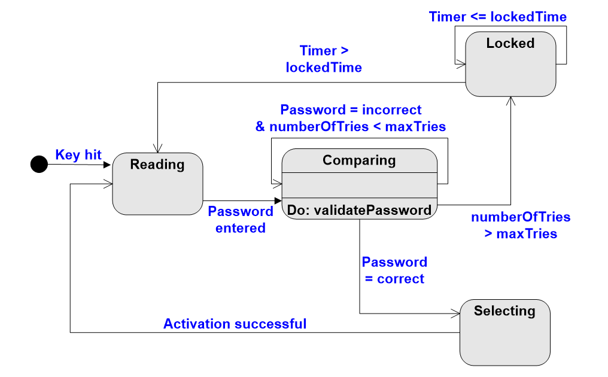

在一个标准的状态图中，我们需要关注三个核心要素：

1. **状态（Nodes/Boxes）：** 图中的圆角矩形。

* `Reading`：读取输入状态。
* `Comparing`：对比验证状态。注意里面写着 `Do: validatePassword`，这表示处于该状态时正在执行的操作。
* `Locked`：锁定状态。
* `Selecting`：选择状态（验证成功后）。

2. **状态转移（Arrows）：** 连接矩形的箭头。代表系统从一个状态切换到另一个状态。
3. **触发事件与条件（Labels on Arrows）：** 箭头上的文字，规定了“什么时候切换”。

* 例如：`Password entered`（输入密码）触发从 `Reading` 到 `Comparing` 的转移。
* 例如：`numberOfTries > maxTries`（尝试次数超过最大值）导致系统进入 `Locked` 状态。

---

### 业务逻辑分析（以控制面板为例）

通过这张图，我们可以清晰地看到这个控制面板的安全逻辑：

1. **初始阶段：** 外部事件 `Key hit`（按键）启动系统，进入 `Reading` 状态。
2. **验证循环：** 输入密码后进入 `Comparing`。

* 如果密码错误且次数未超限（`Password = incorrect & numberOfTries < maxTries`），系统回到 `Reading` 重新输入。
* 如果连续错太多次（`numberOfTries > maxTries`），系统直接跳转到 `Locked` 状态。

3. **解锁逻辑：** 在 `Locked` 状态下，必须等待计时器超时（`Timer > lockedTime`），才能回到 `Reading` 重新尝试。
4. **成功路径：** 只有 `Password = correct`（密码正确），才会显示 `Activation successful` 并进入 `Selecting` 状态。

---

### 状态图的实际意义

* **直观性：** 能够非常清晰地看到对象在不同事件驱动下，是如何在多个状态之间切换的。
* **适用场景：** 特别适用于**状态明确、转换规则清晰**的系统。

**典型例子：** 用户界面控制（如登录弹窗）、设备控制系统（如微波炉、电梯）、自动售货机等。

---

## **顺序图（Sequence Diagram，也称时序图）**。

### 核心定义与作用

**顺序图**的核心目的是描述对象之间的**交互过程**和**时间顺序**。

* **关注点：** 在一个具体的业务场景中，谁调用了谁？消息是如何传递的？
* **比喻：** 它可以理解为一个“按时间线展开的对话过程”。

---

### 顺序图的三个关键元素

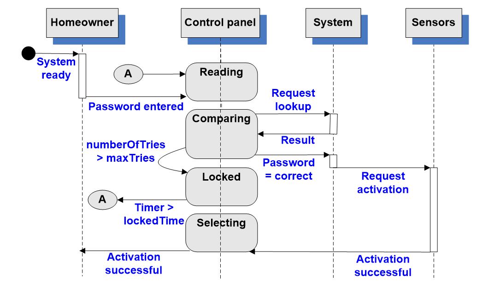

在图中你可以清晰地看到这些 UML 标准元素：

1. **对象（Objects）：** 排列在图的最上方（如 `Homeowner`、`Control panel`、`System`、`Sensors`）。每个对象下方有一条虚线，称为**生命线（Lifeline）**，表示该对象在时间轴上的存在。
2. **消息（Messages）：** 用水平箭头表示。它代表了对象之间的调用关系，比如 `Control panel` 向 `System` 发送 `Request lookup`。
3. **时间顺序（Time Ordering）：** 垂直方向从上到下展开，清晰地展示了整个交互流程的先后逻辑。

---

### 控制面板交互流

这张图展示了一个典型的安防系统操作流程：

* **输入阶段：** `Homeowner`（房主）输入密码 -> `Control panel` 接收。
* **处理阶段：** `Control panel` 请求 `System` 进行查询（`Request lookup`），并获得结果（`Result`）。
* **决策分支：**

1. 如果密码正确（`Password = correct`），`Control panel` 请求激活传感器（`Request activation`）。
2. 传感器反馈成功（`Activation successful`），最终通知房主。

* **异常分支：** 如果失败次数过多（`numberOfTries > maxTries`），系统会进入 `Locked` 状态。

| 工具 | 侧重点 | 核心逻辑 |
| :---: | :---: | :---: |
| **状态图** | 状态变化 | 关注对象在不同事件下“变成了什么样子” |
| **顺序图** | 交互过程 | 关注对象之间“是如何沟通协作的” |

顺序图非常适合用来：

* **分析复杂业务流程：** 把繁琐的业务逻辑拆解成对象间的对话。
* **设计接口调用关系：** 明确每个类需要提供哪些方法（API）。
* **理清模块协作逻辑：** 帮助开发者理解系统架构中的数据流向。

---

## Data Modeling

### 什么是数据建模 (Data Modeling)？

数据建模的四个核心特征：

* **独立于处理过程（Independently of processing）：** 这是最关键的一点。建模时暂时不考虑算法、函数或业务流程，只关注数据本身。
* **专注于数据域（Data Domain）：** 明确系统涉及的所有信息范围。例如，一个电商系统的数据域包含：用户、商品、订单、库存等。
* **用户层面的抽象（Customer's level of abstraction）：** 模型描述的是业务层面的概念（用户能理解的东西），而不是数据库底层的二进制或指针等实现细节。
* **确定对象间的关系（Relate to one another）：** 核心任务是搞清楚数据对象之间是如何关联的（如：一个用户可以拥有多个订单）。

建模的两个维度：

> * **行为建模** 是在描述“系统如何**运行**”。
> * **数据建模** 是在描述“系统在**操作什么**”。

---

### 为什么需要数据建模？

虽然代码最终是逻辑（行为）的组合，但如果没有清晰的数据模型，系统就会变得混乱：

1. **打好基础：** 它为后续的数据库设计和后端架构打下稳固的基础。
2. **统一语言：** 确保开发人员、产品经理和客户对系统中的“信息主体”有完全一致的理解。
3. **减少冗余：** 通过建模可以发现数据之间的冲突或不必要的重复。

---

## **数据对象（Data Object）**

### 什么是数据对象？

**定义：** 数据对象是指可以由一组**属性（Attributes）**来描述，并且会在软件系统中被**操作**（存储、查询、修改等）的某种事物。

---

### 数据对象的三大关键特性

1. **唯一标识性 (Unique Identification)：**

* 每一个对象的实例必须是可以被唯一确定的。
* **例子：** 在图书馆系统中，“书”是一个对象，而每本书的 `ISBN编号` 就是它的唯一标识；在用户系统中，`用户ID` 或 `身份证号` 就是标识。这保证了数据的可管理性和准确性。

2. **必要性 (Necessary Role)：**

* 对象在系统中必须扮演不可或缺的角色。
* **核心逻辑：** 如果系统没有这个对象就无法正常运作，那么它就是一个合格的数据对象。例如，订单系统如果没有“订单”对象，业务逻辑就无从谈起。

3. **属性描述性 (Described by Attributes)：**

* 对象本身是由一系列**数据项（Data Items）**组成的。
* **例子：** “书”这个对象是由“作者”、“标题”、“价格”、“出版日期”等属性刻画出来的。

> **数据对象 = 唯一标识 + 一组属性 + 在系统中的角色**

这为我们提供了一个判断标准：在分析需求时，如果你发现一个事物既有独特的 ID，又有一堆描述它的信息，而且系统业务还绕不开它，那么它就是一个确定的**数据对象**。

---

### **典型对象来源（Typical Objects）**

#### 典型数据对象的分类

在软件系统中，数据对象通常来源于以下七大类别：

1. **外部实体（External Entities）：**

* 与系统交互但存在于系统之外的对象。
* **例子：** 打印机、用户、传感器。它们通常是数据的来源（输入）或去向（输出）。

2. **事物（Things）：**

* 系统内部管理的实体。
* **例子：** 报告、显示内容、信号。这些是业务逻辑的核心载体。

3. **事件或发生的事情（Occurrences or Events）：**

* 描述在特定时间点发生的情况。
* **例子：** 系统中断、警报、交易记录。在实时监控或金融系统中非常关键。

4. **角色（Roles）：**

* 参与系统的人员所承担的任务。
* **例子：** 经理、工程师、销售员。
* **注意：** 建模时关注的是“角色”而非具体的个人，因为权限和行为是绑定在角色上的。

5. **组织单位（Organizational Units）：**

* 企业的逻辑划分。
* **例子：** 部门、团队、分公司。在企业级 ERP 系统中必不可少。

6. **地点（Places）：**

* 与业务流程相关的地理或物理位置。
* **例子：** 工厂车间、仓库、装运港口。在物流和制造业系统中尤为重要。

7. **结构（Structures）：**

* 已经组织好的数据集合。
* **例子：** 员工记录、入库清单。它们本身就是某种数据组织形式。

学习这些分类的价值：

* **扫描维度：** 面对复杂的需求文档时，你可以有意识地从这七个维度去“扫描”，从而更系统地识别对象。
* **防止遗漏：** 避免只关注核心业务对象（如“订单”），而忽略了同样重要的“地点”或“事件”对象。

---

## **属性（Attributes）**

### 属性的定义与作用

**定义：** 属性是一组用于定义对象的**方面（aspect）**、**质量（quality）**、**特征（characteristic）**或**描述符（descriptor）**的数据项。
* **核心观点：** 一个数据对象本质上是由一组属性构成的集合。没有属性，对象就只是一个空洞的名字；有了属性，对象才变得具体且可操作。

---

### 案例分析：汽车（Automobile）对象

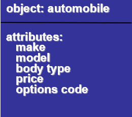

图片中给出了一个非常直观的 UML 风格示例。对于“汽车”这个数据对象，我们可以通过以下属性来完整描述它：

* **make（品牌）：** 如 Toyota, Tesla。
* **model（型号）：** 如 Camry, Model 3。
* **body type（车身类型）：** 如 SUV, Sedan（轿车）。
* **price（价格）：** 具体数值。
* **options code（配置代码）：** 用于区分不同的选装方案。

建模时的三个注意事项

1. **既充分又不适度（Sufficiency）：** 选择的属性要足以支持业务逻辑（充分），但不要包含与系统目标无关的冗余信息（不适度）。例如，在图书馆系统中，书的“页数”可能很重要，但“纸张的克数”通常就没必要建模。
2. **保持原子性（Atomicity）：** 每个属性应当是不可再分的最小单元。尽量避免在一个属性里嵌套复杂的结构，否则会导致后续数据库设计和查询变得非常困难。
3. **定义与业务语义一致：** 属性的命名和含义必须符合业务逻辑，确保开发人员、产品经理和用户对该字段的理解是一致的。

---

## **关系（Relationship）**

### 什么是关系 (What is a Relationship?)

**定义：** 关系表示对象之间的**连接性（connectedness）**。它是一个必须被系统“记住”的**事实**，而不是通过机械计算或推导出来的。

---

### 关系的几个关键特点

三个重要属性：

* **多实例性（Several instances exist）：** 一个关系可以重复出现。例如，“客户”与“订单”之间存在“创建”关系，一个客户可以创建多个不同的订单实例。
* **多样性（Related in many ways）：** 对象之间的关联形式多种多样。在数据库设计中，我们通常将其归纳为：

1. **一对一 (1:1)**
2. **一对多 (1:N)**
3. **多对多 (M:N)**

* **不可计算性（Not computed mechanically）：** 这是一个深刻的设计原则。关系通常代表业务逻辑中的事实。例如，“张三买了这本书”是一个需要存储的事实，系统无法仅凭“张三”和“书”这两个对象的信息就自动推算出他们之间是否存在购买关系。

---

### 数据建模的总结

| 建模维度 | 回答的问题 | 例子 |
| :---: | :---: | :---: |
| **对象 (Object)** | 系统中有**什么**？ | 客户、商品、订单 |
| **属性 (Attribute)** | 对象**长什么样**？ | 姓名、价格、下单时间 |
| **关系 (Relationship)** | 对象间有**什么联系**？ | 客户“下单”商品、订单“包含”商品 |

---

## **ER 图（实体-联系图）**

### 基数与模态

1. 基数 (Cardinality)

基数回答的是：**“一个对象最多可以和多少个另一个对象建立关系？”**

* **一对一 (1:1)**
* **一对多 (1:N)**：例如，一个客户可以有多个订单。
* **多对多 (M:N)**：例如，学生和课程，一个学生选多门课，一门课被多个学生选。

2. 模态 (Modality)

模态（也称参与度）回答的是：**“这个关系是必须有的，还是可选的？”**
* **Mandatory (强制/必选)：** 对象必须参与该关系。在图中用实线或“1”表示。例如：一个订单**必须**属于某个客户。
* **Optional (可选)：** 对象可以不参与该关系。在图中用圆圈或“0”表示。例如：一个客户**可以**暂时没有任何订单。

---

### 符号表示法 (Notation)

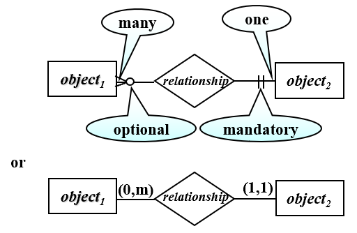

1. 图形化符号 (鸟脚式/Crow's Foot 风格)

* **Mandatory One (强制 1)：** 用靠近对象的两条短垂直线表示（类似 `||`）。
* **Mandatory Many (强制多)：** 用垂直线加“鸟脚”表示。
* **Optional Many (可选多)：** 用圆圈加“鸟脚”表示（类似 `<o`）。

2. 数字标注法 (Min, Max 风格)

图中下半部分展示了更精确的数字对表示法，格式为 **(min, max)**：

* **前面数字表示最小参与数（即模态）：** `0` 代表可选，`1` 代表强制。
* **后面数字表示最大参与数（即基数）：** `1` 代表一对一，`m/n` 代表多。
* **例子：** `(0, m)` 表示该对象可选地参与关系，且最多可以关联多个；`(1, 1)` 表示必须且只能参与一个。

---

### **完整的 ER 图（实体-联系图）示例**

#### 业务逻辑流分析

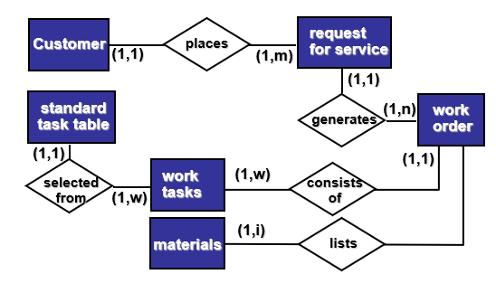

我们可以按照数据的生命周期来理解这张图：

1. **发起请求：** 核心对象是 **Customer（客户）**。一个客户发起（places）一个 **request for service（服务请求）**。

* **约束：** `(1,1)` 到 `(1,m)`。意味着一个客户可以发起多个请求，但一个请求必须属于一个确定的客户。

2. **生成订单：** 服务请求会生成（generates）一个 **work order（工作订单）**。

* **约束：** `(1,1)` 到 `(1,n)`。一个请求可能对应多个工单（比如分期或分部门执行）。

3. **拆解任务：** 一个工单由多个 **work tasks（工作任务）** 组成（consists of）。

* **约束：** `(1,w)`。一个工单至少包含一个任务，最多包含多个。

4. **关联资源与标准：**

* **Materials（材料）：** 任务会关联（lists）所需的材料。
* **Standard task table（标准任务表）：** 具体的任务是从一个标准库中选择出来的（selected from），这体现了业务的标准化。

---

#### 关键符号的实际意义 (Review)

通过这张图，你可以练习如何“读”出业务规则：

* **(1, 1)**：表示**强制且唯一**。例如，`work order` 到 `request for service` 是 `(1,1)`，说明每个订单必须溯源到一个唯一的请求，不能凭空产生。
* **(1, n) 或 (1, m)**：表示**强制且多个**。这说明系统设计要求这些关联必须存在，不能是“空值”。

---

## **面向流的建模（Flow-Oriented Modeling）**

### 面向流的建模

* **定义：** 它表示数据对象在系统中移动时是如何被**转换（transformed）**的。
* **关注点：** 输入数据经过了哪些处理步骤？变成了什么输出？
* **核心工具：** **数据流图（Data Flow Diagram, DFD）**。

DFD 的地位：

* **“老派”方法：** 许多人认为 DFD 是一种“老派（old school）”的方法（相比于现代的 UML 模型）。
* **独特价值：** 尽管它传统，但它提供了一个独特的、不可替代的视角——**系统的信息流处理过程**。
* **补充角色：** 在实际工程中，它不应该被孤立使用，而应该作为对其他模型（如类图、用例图）的**重要补充**。

为什么流建模很重要？

在复杂的软件系统中，数据往往不是一成不变的。例如：

1.  用户输入原始密码（输入流）。
2.  经过加盐哈希算法（**转换/处理**）。
3.  变成加密字符串（输出流）。

DFD 能非常直观地把这种“加工”过程表现出来，而这正是 ER 图无法表达的。

---

### 信息转换

* **信息转换系统（Information Transform System）：** 任何基于计算机的系统，本质上都是一个将“输入信息”转换为“输出信息”的装置。
* **图形化表达（Graphical Representation）：** DFD 的作用就是用图形的方式，把信息在移动过程中所经受的**转换（Transforms）**描绘出来。

---

### DFD 的三个关键维度

1.  **信息流（Information Flow）：** 数据从哪里进入系统，又流向哪里。
2.  **转换（Transforms）：** 数据在流动的过程中被施加了哪些处理逻辑（即图中中间的锯齿状圆圈）。
3.  **抽象层次（Level of Abstraction）：** DFD 非常灵活，它可以用来表示一个非常宏观的系统（比如整个公司的财务流程），也可以细化到某个具体软件模块的算法逻辑。

核心工作模式：

> **输入 $\rightarrow$ 经过处理 $\rightarrow$ 输出**

这种模式虽然简单，但它是所有复杂软件运作的基石。DFD 的核心价值在于：**把“数据流动 + 数据处理”这一过程可视化**。

---

### **外部实体（External Entity）**。

外部实体定义了系统的**边界**，是理解系统与外界交互的起点。

1. 外部实体的本质

**定义：** 外部实体是数据的**生产者（Producer）**或**消费者（Consumer）**。
* **位置：** 它存在于系统之外，但与系统进行数据交换。

**例子：**

* **人：** 用户、管理员、房主。
* **设备：** 传感器、打印机、扫描仪。
* **外部系统：** 第三方支付接口（如支付宝/微信支付）、外部气象数据库。

---

2. 外部实体的两个核心角色

从功能的角度看，外部实体在 DFD 中承担着两个重要任务：

1.  **数据的生产者 (Producer)：** 向系统提供输入数据（数据的源头）。
2.  **数据的消费者 (Consumer)：** 接收系统处理后的输出数据（数据的终点）。

> **Data must always originate somewhere and must always be sent to something**
> （数据一定得有来源，也一定得有去向）

在绘制 DFD 时，这意味着：

* 任何一条数据流都不能“凭空产生”，它必须从某个实体或处理过程中流出。
* 任何一条数据流也不能“凭空消失”，它必须流入某个实体或处理过程。

外部实体是“黑盒”：在进行行为或流建模时，外部实体的**内部逻辑是不属于系统范围的**。

* 我们只关心它**给了系统什么**或者**从系统拿走了什么**。
* 例如，如果你在为一个商场系统建模，外部实体是“银行”，你只需要知道系统发给银行扣款请求，银行返回扣款结果。至于银行内部是怎么转账的，不属于你这个 DFD 的描述范围。

---

### **处理（Process）**

1. 处理的本质：数据转换器

**定义：** 处理被视为一个**数据转换器（Data Transformer）**。它的唯一任务就是将输入的原始数据转换成有意义的输出数据。

**典型例子：**

* **计算类：** 计算税费、计算面积。
* **逻辑类：** 验证密码、确定权限。
* **展现类：** 格式化报表、展示图表。

---

2. 核心建模原则

> **Data must always be processed in some way to achieve system function**
> （数据必须经过某种方式的处理，才能实现系统的功能）

这意味着：

* **功能导向：** 如果数据进入系统后没有经过任何处理就直接输出，那么这个系统或模块就没有存在的价值。
* **显式表达：** 在建模时，每一个处理步骤都代表了一个功能模块。

---

3. 处理的三要素

为了确保模型的完整性和可理解性，每一个“处理”节点都必须明确回答三个问题：

1.  **输入数据是什么？**（原料）
2.  **处理逻辑大致是什么？**（加工过程）
3.  **输出结果是什么？**（成品）

---

4. 系统即“处理节点”的集合

从更宏观的角度来看，我们可以把任何复杂的软件系统理解为一组**处理节点**的组合。

* 数据在这些节点之间流动。
* 每经过一个节点，数据就会被“转换”一次。
* 最终，原始输入变成了用户需要的最终结果。

---

### **数据流（Data Flow）**

1. 数据流的本质：信息的移动路径

**定义：** 数据流描述了数据在系统中的**移动路径**。它标志着数据从一个地方起始，经过处理，最终到达另一个地方。
* **表现形式：** 在图中通常用带箭头的**直线或曲线**表示。

**图示案例：** 计算三角形面积的过程。

* **输入流：** 底（base）和高（height）。
* **处理中心：** 计算三角形面积（compute triangle area）。
* **输出流：** 面积（area）。

---

2. 建模时的三个重要注意事项

1. **明确命名（Explicit Naming）：** 每一条数据流都应该有清晰、具有业务含义的名称（如“用户信息”、“支付结果”），而不能含糊地只写“data”或“信息”。
2. **关注“数据本身”而非“控制逻辑”：** 这是新手最容易犯错的地方。数据流描述的是**“传递了什么内容”**，而不是“什么时候执行”或“判断条件”。它不代表程序的执行顺序，只代表数据的去向。
3. **必须连接合法元素：** 数据流的两端不能悬空。它必须起始于或终止于**外部实体**、**处理节点**或**数据存储**。

我们可以用一个比喻来区分处理和数据流：

> **如果说“处理”是“做事的地方”，**
> **那么“数据流”就是“把事情串起来的路径”。**

---

### **数据存储（Data Store）**

1. 数据存储的本质：持久化驿站

**定义：** 数据存储是数据被**持久保存**、以便后续使用的地方。

* **物理形态：** 在实际开发中，它对应的是**数据库**、**文件系统**、**配置文件**或**缓存**。
* **核心特征：** 存储的数据不是临时生成的，而是预先存在或在处理过程中产生的，可以被**反复访问和修改**。

---

2. 案例分析：传感器数据查询

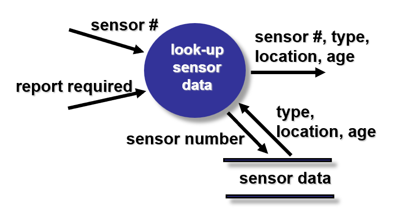

图片中展示了一个传感器场景：

* **数据存储：** 存放着传感器编号（sensor #）、类型、位置、使用年限等静态信息。

**处理过程（look-up sensor data）：**

* **输入：** 外部请求（report required）和特定的传感器编号。
* **交互：** 处理节点从数据存储中读取详细信息。
* **输出：** 完整的传感器报表。

关键规则

1. **处理（Process）是访问者：** 数据存储本身是静态的，它不具备“主动权”。只有通过**处理节点**，才能实现对数据的读取或写入。
2. **符号表示：** 在 DFD 中通常用**两条平行线**（或一侧开口的矩形）表示，象征着一个可以进出的信息池。

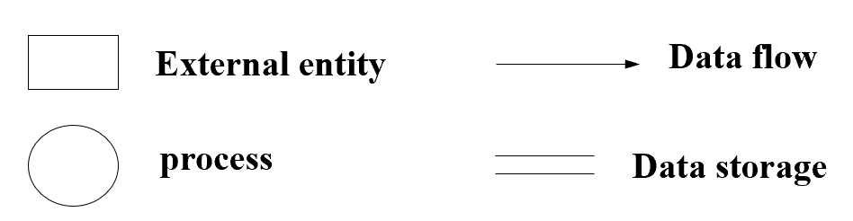

---

## **分层结构（The Data Flow Hierarchy）**

**核心矛盾：** 当一个系统包含成百上千个功能时，如果全部画在一张图里，会变成一团乱麻。
**解决方案：** 引入**分层（Hierarchy）**思想，通过**逐步细化（Stepwise Refinement）**，像剥洋葱一样一层层深入。

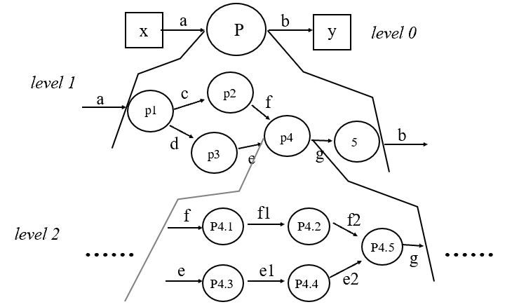

图示清晰地展示了三个主要层次：

**Level 0 (顶层图/上下文图 Context Diagram)：**

* **特点：** 最抽象的视图。
* **内容：** 整个系统被视为一个单一的处理节点（图中顶部的圆圈 P），主要描述系统与**外部实体**（x, y）之间的输入输出关系。

**Level 1 (一层图)：**

* **特点：** 展示系统的主要功能模块。
* **内容：** 将 P 拆解为 p1, p2, p3, p4, 5 等具体的功能子项，并展示它们之间的数据流（a, b, c, d, e, f, g）。

**Level 2及更深层次 (二层图及以后)：**

* **特点：** 进一步细化具体的处理逻辑。
* **内容：** 例如将 p4 拆解为 P4.1, P4.2 等更小的步骤。

**最关键的原则：平衡 (Balancing)**

* **定义：** 每一层细化后的数据输入和输出必须与上一层保持**完全一致**。
* **逻辑：** 如果 Level 0 显示输入是 `a`，输出是 `b`，那么在 Level 1 中，无论你拆成多少个小方块，最终进入这一层的总流量必须还是 `a`，流出的总流量必须还是 `b`。
* **意义：** 保证了数据流不会凭空增加或消失，确保了模型的严谨性。

---

### **建模规范（Guidelines）**

1. 命名规范：必须有意义

* **要求：** 所有的**数据流箭头**必须标注名称，所有的**图标（处理、实体、存储）**也必须有清晰的命名。
* **准则：** 严禁使用 `data1`、`process A` 这种模糊的称呼。命名应直接体现业务含义，如“订单信息”、“验证用户身份”。

2. 建模顺序：自顶向下

* **要求：** 必须从**上下文图（Context Level Diagram / Level 0）**开始建模。
* **原因：** 先确定系统的边界和主要的外部接口，建立宏观视野，然后再逐步细化内部结构。如果一开始就陷入细节，很容易丢失整体逻辑。

3. 核心禁忌：不表示控制逻辑

* **要求：** **DFD 不用于表示过程逻辑（Procedural Logic）**。

**深度解析：** 这是初学者最容易犯的错误。DFD 关注的是数据的流动和转换，而不是代码的执行顺序。

* **不要画：** `if-else` 判断、循环、或者“先做 A 再做 B”的控制流。
* **替代方案：** 如果需要表达复杂的逻辑判断或操作顺序，应该使用**活动图（Activity Diagram）**或**状态图（State Diagram）**。

4. 演化原则：保持连续性（一致性）

* **要求：** 随着 DFD 向更深层次演化，必须保持**信息流的连续性（Continuity）**。
* **逻辑：** 这就是之前提到的“平衡原则”。父图中进入某个处理的数据流，在子图中拆解后，其输入输出的总和必须与父图完全匹配。

---

### **处理规格说明（Process Specification，简称 PSPEC）**

在 DFD 中，我们用一个“气泡（bubble）”来表示一个处理过程。但当这个过程内部逻辑很复杂时，图形就显得力不从心了。这时，PSPEC 就充当了该处理节点的“详细说明书”。

1. PSPEC 的核心作用

* **精细化描述：** 对 DFD 中每一个底层处理（不能再进一步分解的处理）的内部逻辑进行精确定义。
* **补足图形局限：** DFD 只告诉我们“输入变成了输出”，而 PSPEC 告诉我们“它是**如何**变成输出的”。

2. PSPEC 的五种常用表达形式

根据处理逻辑的类型和复杂程度，分析师可以灵活选择以下表达方式：

* **自然语言描述 (Narrative)：** 使用纯文字说明处理逻辑。
* **伪代码 / 过程描述语言 (Pseudocode / PDL)：** 使用类似编程语言但更易读的结构化文字来表达算法逻辑。
* **公式 (Equations)：** 适用于涉及数学计算的处理（如：计算税额、物理模型计算）。
* **表格 (Tables)：** 尤其是**决策表（Decision Tables）**，非常适合处理那种“如果 A 且 B，则做 C”的多分支判断逻辑。
* **图表 (Diagrams/Charts)：** 如流程图或逻辑图，用于辅助说明复杂的执行路径。

---

## **构建数据流图（DFD）**

### 核心构建步骤 (Part I)

在从零开始构建 DFD 时，分析师需要完成以下三项任务：
    
1. **回顾数据模型并进行语法分析：**

* 首先识别出系统中的**数据对象**（名词，如：用户信息、订单）。
* 通过**语法分析（Grammatical Parse）**找出描述需求的“动词”。这些动词往往直接对应了系统需要执行的**操作（Operations）**或处理过程。

2. **确定外部实体：**

* 明确哪些人、设备或外部系统是数据的生产者（Producers）或消费者（Consumers）。

3. **创建 Level 0 DFD（上下文图）：**

* 这是最关键的一步。将整个系统视为一个单一的处理节点，只展示它与外部实体的交互。

---

### 案例解析：数字视频处理器 (Digital Video Processor)

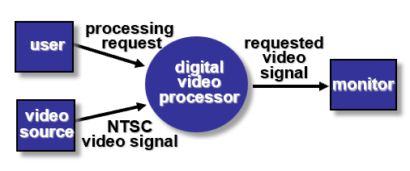

图片中的图示展示了一个典型的 Level 0 DFD 示例：

**外部实体：**

* `user`（用户）：发起处理请求。
* `video source`（视频源）：提供原始视频信号（NTSC video signal）。
* `monitor`（监视器）：接收处理后的结果。

**核心处理：**

* 中间的圆圈 `digital video processor` 代表整个系统。

**数据流：**

* 输入流：`processing request`、`NTSC video signal`。
* 输出流：`requested video signal`。

---

### DFD 构建的核心步骤 (Part II)

这一阶段的任务是实现从 Level 0 到 **Level 1** 的平滑过渡：

* **编写叙述性描述（Write a narrative）：** 对整体转换过程进行文字说明，理清系统如何将输入变成输出。
* **解析子处理（Parse to determine next level transforms）：** 从文字描述中识别出更细粒度的处理步骤，这些就是下一层的子过程。
* **保持平衡（Balance the flow）：** 确保 Level 1 的总输入和总输出与 Level 0 **完全一致**，即维持数据流的**连续性（Continuity）**。
* **开发 Level 1 DFD：** 将拆解出的子处理、内部数据流和数据存储画出来。

---

### 核心经验规则：1:5 分解比例

一个非常实用的参考：**使用约 $1:5$ 的分解比例**。

这意味着，一个父层的处理节点通常建议拆分成 **3 到 7 个**（平均约 5 个）子处理。

* **原因：** 如果拆得太少（如 1 拆 2），建模意义不大；如果拆得太多（如 1 拆 15），会导致图表过于拥挤，难以理解。

---

### **经验性原则（Notes）**

1. 细化逻辑：什么时候停止？

* **原则：** 每一个气泡（处理节点）都应该不断细化（Refined），直到它**只做“一件事”**。
* **深度理解：** 如果一个处理节点同时负责“验证用户”和“更新数据库”，它就该被进一步拆解。功能单一化能让后续的编码和测试更加清晰。

2. 分解粒度与层级深度

* **分解比例递减：** 随着层级（Level）的增加，扩展比例（Expansion ratio）通常会逐渐减小。这意味着越到底层，我们越接近具体的代码实现逻辑，拆分的动作会变得更精准、更少。

**层级深度：** 大多数系统的 DFD 建模通常需要 **3 到 7 层** 就能达到足够的细化程度。

* **太少（<3层）：** 模型过于粗糙，无法指导开发。
* **太多（>7层）：** 增加了不必要的复杂度，模型反而变得难以维护。

3. 数据流的同步细化

* **原则：** 数据流箭头也可以随着层级的增加而进一步细化。
* **案例：** 在高层（Level 0/1），你可能只标注一条数据流叫“用户信息”；但在底层，这条流可以被拆解为更具体的数据项，如“用户名”、“密码”、“权限”等。
* **配套工具：数据字典（Data Dictionary）**。所有的细化项都必须在数据字典中定义，以确保整套模型的一致性。

---

## DFDs: A Look Ahead

### 分析模型与设计模型的映射

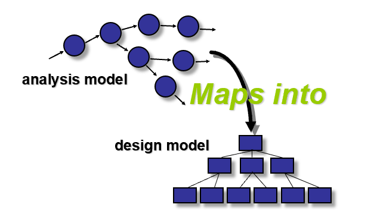

图片中展示了一个清晰的逻辑：**分析模型 (Analysis Model)** 最终会**映射 (Maps into)** 到 **设计模型 (Design Model)** 中。

* **分析模型：** 关注“系统要做什么”，由 DFD、ER 图、状态图等组成。
* **设计模型：** 关注“系统如何实现”，通常表现为模块结构图、类图和架构图。

---

## **需求建模中的模式（Patterns for Requirements Modeling）**

### 什么是软件模式（Software Patterns）？

**定义：** 模式是一种捕捉**领域知识（Domain Knowledge）**的机制。它将某类特定问题的常见解决方案总结成可复用的知识。

**核心逻辑：** 

* **知识复用：** 领域知识可以应用到同一应用领域的新问题中（例如：电商领域的“购物车”模式）。
* **类比应用：** 甚至可以通过类比，应用到完全不同的应用领域中。

> **分析模式的原作者并不是“创造”了模式，而是在需求工程的开展过程中“发现”了它。**

这意味着：

* 模式不是天才程序员凭空想出来的，而是在长期的业务实践中，人们发现某些问题及其解决方案反复出现，从而总结出来的。
* 一旦这些规律被发现，就会被**文档化（documented）**，成为行业通用的标准做法。

---

## **发现分析模式（Discovering Analysis Patterns）**

### 发现模式的基石：用例 (Use Case)

* **用例的作用：** 它是描述用户与系统如何交互的最基础单位。
* **模式的来源：** 当我们观察一组**连贯的（coherent）**用例时，就会发现其中隐藏的重复结构或通用逻辑。这些共性正是发现一个或多个分析模式的基础。

---

### 语义分析模式 (Semantic Analysis Pattern, SAP)

* **定义：** SAP 是描述一小组连贯用例的模式，这些用例共同描述了一个**基础的、通用的应用场景**。
* **本质：** 它是一组相关用例的抽象总结。
* **引用：** 这里的描述引用了专家 [Fer00] 的观点，强调了模式在描述典型应用场景中的权威性。

---

## **Web 应用（WebApps）的需求建模**

1. 内容分析 (Content Analysis)

* **核心：** 确定 Web 应用需要提供的所有内容。
* **范畴：** 包括文本、图形、图像、视频和音频数据。
* **方法：** 通常结合**数据建模**来识别和描述每一个数据对象（Data Objects）。

2. 交互分析 (Interaction Analysis)

* **核心：** 详细描述用户与 Web 应用交互的方式。
* **工具：** 重点使用**用例（Use-cases）**来提供交互过程的详细描述。

3. 功能分析 (Functional Analysis)

* **核心：** 基于交互分析中的用例，定义对 Web 应用内容施加的操作及其他处理流程。
* **要点：** 所有操作和功能必须被详细描述。

4. 配置分析 (Configuration Analysis)

* **核心：** 描述 Web 应用运行的**环境和基础设施**。
* **范畴：** 服务器端环境、网络架构、客户端设备兼容性等。

5. 导航分析 (Navigation Analysis)

* **核心：** 描述网页链接的组织结构。
* **关注点：** 用户如何从一个页面跳转到另一个页面，以及在整个系统中的移动路径。

---

### **When Do We Perform Analysis?**

在现代软件开发（尤其是 Web 和移动应用）中，很多人倾向于“快速迭代”。这张 PPT 明确了在哪些场景下，跳过分析阶段是极其危险的。

在许多小型或敏捷开发的 Web/移动应用场景中，**分析和设计往往是合并（merged）在一起的**。开发者可能在脑子里想一下需求就开始画 UI 或写代码了，这在简单项目中是可行的。

---

#### 必须进行显式分析的五大触发条件

当出现以下情况时，必须开展独立的、系统化的需求分析活动：

* **规模与复杂度（Large and/or Complex）：** 要构建的应用本身规模宏大，或者内部逻辑极其复杂。
* **利害关系人众多（Large number of stakeholders）：** 参与项目的各方（客户、不同部门的经理、最终用户等）人数很多。如果没有明确的分析文档，很难达成共识。
* **开发团队规模大（Large number of developers）：** 当团队人数增加，沟通成本指数级上升，文档成为了唯一的“真相来源”。
* **新团队协作（New development team）：** 团队成员之间从未合作过，缺乏默契，需要规范的流程来对齐思路。
* **业务关键性（Strong bearing on business success）：** 应用的成败直接关系到企业的生死存亡或核心利益。

---

### **内容模型 (The Content Model)**。

内容建模包含以下三个关键步骤：

1. **内容对象提取 (Extracting Content Objects)：**

* 通过审查**用例（Use-cases）**来识别内容对象。
* **分析方法：** 在场景描述（Scenario Description）中寻找直接或间接引用的内容。例如，在一个“购买商品”的用例中，你可以提取出“商品”、“订单”、“支付凭证”等内容对象。

2. **属性定义 (Attributes Identification)：**

* 为每一个提取出的内容对象定义具体的描述项。例如，“商品”对象的属性可能包括名称、价格、规格描述、库存量等。

3. **建立关系与层级 (Relationships & Hierarchy)：**

* 分析内容对象之间是如何关联的。这不仅包括平级的关联，还包括对象之间的所属、嵌套关系。

---

#### **数据树（Data Tree）**

数据树通过**层级结构（Hierarchy）**来展示一个对象。在这个例子中，研究对象是一个“component”（组件），我们可以把它想象成一个电商系统中的产品或者一个制造系统中的零件。

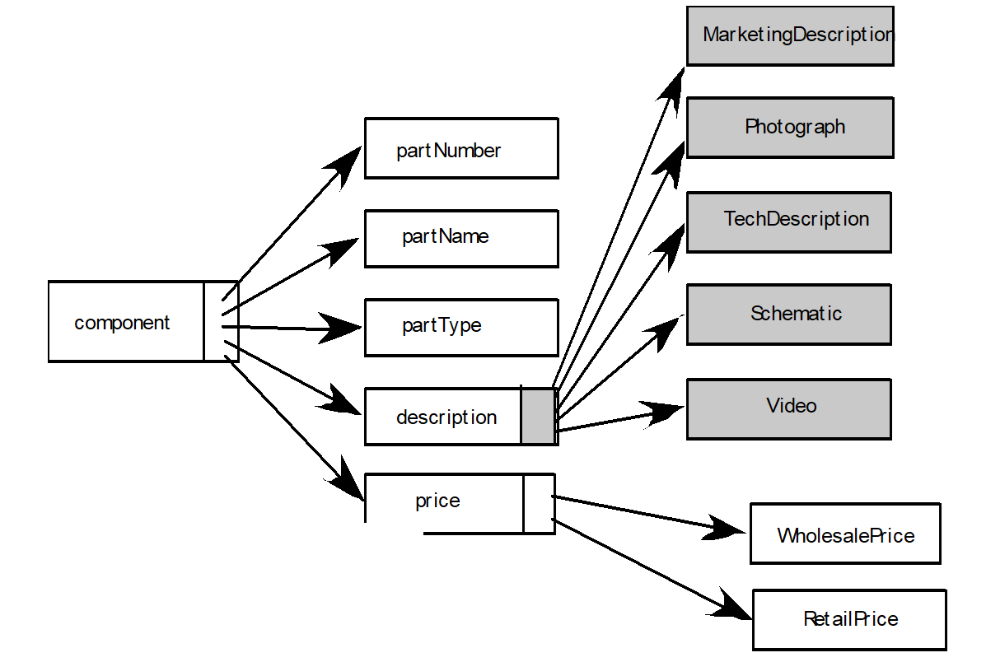

从左往右看，这棵树清晰地定义了组件包含的不同维度的信息：

1. 基本属性 (Basic Attributes)

* **partNumber (编号)**：唯一标识组件的数字或字符串。
* **partName (名称)**：组件的可读名称。
* **partType (类型)**：组件的分类。

2. 复合结构：描述 (description)

这里的 `description` 并不是一个简单的文字框，而是一个包含多种多媒体内容的**嵌套对象**：

* **MarketingDescription** (营销描述)
* **Photograph** (图片)
* **TechDescription** (技术说明)
* **Schematic** (示意图)
* **Video** (视频)

> **启示**：这种设计方式体现了现代 Web 应用内容建模的复杂性，它不再是单一的字段，而是多模态信息的集合。

3. 细分价格 (price)

价格也被进一步细化，以支持不同的业务场景：

* **WholesalePrice** (批发价)
* **RetailPrice** (零售价)

---

##### 数据树的核心价值

* **层级关系可视化**：一个内容对象不仅有属性，还可能有复杂的**嵌套关系**。数据树能让人一眼看清哪些属性属于父类。
* **贴近实现逻辑**：这种层次化的组织方式与现代 Web 开发中常见的 **JSON** 格式或者 **NoSQL** 数据库的数据结构高度契合。
* **直观性胜过 ER 图**：当数据具有明显的父子关系或归属关系时，数据树比传统的实体-联系图（ER 图）更加直观，更容易让开发人员和产品经理达成共识。

---

### **交互模型 (The Interaction Model)**

如果说内容模型是系统的“静态资产库”，那么交互模型就是系统的**“动态剧本”**，它描述了用户如何与系统进行互动。

为了完整地刻画用户与系统的交互方式，通常需要以下四个工具：

* **用例 (Use-cases)：** 描述用户在系统中的典型使用场景（例如“用户登录”、“搜索商品”）。它是所有交互设计的起点。
* **顺序图 (Sequence Diagrams)：** 进一步展示在某个具体的用例场景下，各个对象（如用户、界面、数据库）之间随时间流逝的**消息传递过程**。
* **状态图 (State Diagrams)：** 描述系统或某个核心对象在不同状态之间的**转换逻辑**（例如订单从“待支付”变为“已支付”）。
* **用户界面原型 (User Interface Prototype)：** 最直观的部分，展示用户实际看到的页面布局和可操作的按钮。它让抽象的逻辑变得具体可见。

---

### **功能模型 (The Functional Model)**。

功能建模主要解决 Web 应用中的两类处理逻辑：

**用户可见的功能 (User Observable Functionality)：**

* 即系统交付给终端用户的具体服务。例如：下单、搜索商品、查看个人信息等。

**分析类中的操作 (Operations contained within Analysis Classes)：**

* 这是隐藏在冰山下的部分。它指为了实现上述功能，在系统内部类（如“订单类”、“用户类”）中需要执行的具体行为和方法。

---

#### 活动图 (Activity Diagram)

为了描述这些复杂的处理流（Processing Flow），功能建模通常使用 **活动图**。

* **作用：** 活动图能够非常清晰地展示一个操作是如何一步步执行的，包括其中的分支判断、并发处理以及数据流向。
* **比喻：** 它就像是一张详尽的“逻辑流程图”，指导系统如何有条不紊地运行。

---

### **配置模型 (The Configuration Model)**。

配置建模需要同时考虑天平的两端：

1. **服务端 (Server-side)**

* **硬件与操作系统：** 必须指定服务器的 CPU、内存要求以及运行的操作系统环境（如 Linux 发行版或 Windows Server）。
* **互操作性 (Interoperability)：** 考虑服务器如何与现有的其他系统（如第三方 API、旧版数据库）协同工作。
* **接口与协议：** 明确通信协议（如 HTTP/HTTPS、WebSocket）以及相关的协作接口。

2. **客户端 (Client-side)**
* **浏览器配置：** 识别目标用户的浏览器环境（如 Chrome, Safari, Edge）及其版本要求。
* **测试需求：** 在这一阶段定义测试准则。因为不同的客户端环境（如屏幕尺寸、渲染引擎）会直接影响系统的行为和表现。

> * **配置模型描述的是：** “系统在哪里、在什么条件下运行？”

为什么配置模型必不可少？

在 Web 开发中，忽略配置建模会导致灾难性的后果：

1. **环境不匹配：** 开发者在高性能机器上跑得好好的代码，上线后在低配服务器上崩溃。
2. **兼容性地狱：** 界面在 Chrome 上完美，在用户常用的老版本浏览器上乱码。
3. **安全隐患：** 没有明确协议和接口规范，导致数据在传输中暴露。

---

## **导航建模 (Navigation Modeling)**

在开始设计导航路径之前，分析师必须思考以下几个用户体验（UX）层面的问题：

* **优先级与可达性：** 哪些核心内容应该放在“一键直达”的位置？如何减少用户到达目标页面的点击步数？
* **引导与强制：** 系统是否需要通过 UI 引导（或强制）用户按照特定路径访问？
* **容错处理：** 当用户点击了错误的路径或发生 404 错误时，系统如何提供清晰的恢复方式，而不是让用户陷入死胡同？
* **访问方式：** 是依赖传统的层级菜单，还是更侧重于全局搜索，亦或是基于上下文的动态推荐？
* **上下文感知：** 导航是否应该根据用户之前的浏览行为进行动态调整？

在具体实施阶段，导航建模需要落实到更细节的层面：

* **全局可见性：** 是否提供完整的网站地图或侧边栏菜单，让用户在任何位置都能看清系统的全貌，而不仅仅依赖一个“返回”键？
* **驱动逻辑：** 导航结构是应该基于**内容的重要性**（信息架构）来驱动，还是基于**最常见的用户行为**（操作频率）来驱动？
* **用户分群优化：** 是为新手用户提供保姆式的线性向导导航，还是为熟练用户提供快捷高效的跳转方式？
* **外部链接策略：** 链接到外部站点时，是覆盖当前窗口，还是弹出新窗口？这直接关系到用户的“留存率”和任务连续性。

---