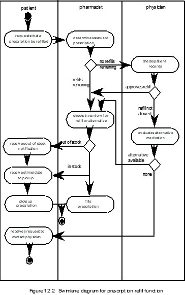
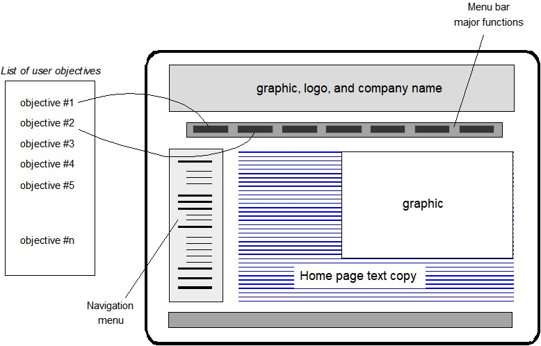
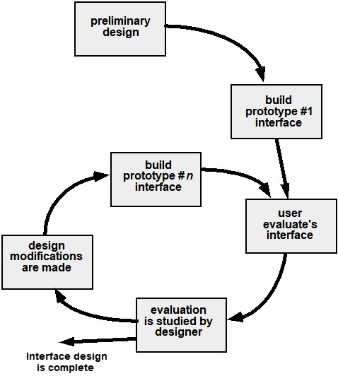

# Chapter 15 | User Interface Design

## **界面设计的衡量标准**

**核心内容：三个关键问题**

判断一个界面是否优秀，可以简化为询问以下三个维度：

1. **Easy to learn? (是否容易学习？)**：初次接触的用户能否在短时间内掌握基本操作。
2. **Easy to use? (是否容易使用？)**：在熟悉之后，用户完成任务的效率是否高，操作是否顺畅。
3. **Easy to understand? (是否容易理解？)**：界面上的图标、术语和逻辑是否符合直觉，用户是否清楚每一步操作的后果。

* **成功的定义：** 如果用户第一次使用就能快速上手（低学习成本），且过程中不会产生困惑（逻辑清晰），那么这个界面设计在功能性上就是成功的。
* **现状对比：** 虽然这三点看起来很简单，但很多系统并没有做到这些，反而存在增加用户负担的典型问题。

---

### **界面设计的典型错误**

这些问题本质上都在**增加用户负担**，强迫用户去适应系统。

**1. 不一致 (Lack of consistency)**

* **表现：** 同样的“确认”按钮在不同页面的颜色、位置或形状都不一样。
* **后果：** 用户每次进入新页面都要重新寻找和学习操作逻辑，无法形成肌肉记忆。

**2. 记忆负担过重 (Too much memorization)**

* **表现：** 系统要求用户记住复杂的路径，或者前一步输入的信息在下一步不会自动填充，需要用户反复记忆并手动输入。
* **后果：** 增加了用户的认知负荷，极易出错。

**3. 缺少引导 (No guidance / help)**

* **表现：** 当用户迷茫或报错时，系统没有明确的提示告诉用户“下一步该做什么”或“如何修复错误”。
* **后果：** 用户只能通过盲目试错来解决问题，挫败感强。

**4. 缺乏上下文感知 (No context sensitivity)**

* **表现：** 在特定操作场景下（如填表时），界面展示了大量无关的功能干扰用户，没有突出当前最核心的任务。
* **后果：** 用户容易在复杂的信息中迷失方向。

**5. 响应不好 (Poor response)**

* **表现：** 点击按钮后没有任何视觉反馈（如变色或加载动画），或者系统响应极慢。
* **后果：** 用户会怀疑系统卡死，导致重复点击，可能引发更多系统错误。

**6. 晦涩不友好 (Arcane / unfriendly)**

* **表现：** 使用大量的技术性专业术语（如直接弹出底层报错代码），或界面逻辑完全不符合人的正常直觉。
* **后果：** 用户看不懂、不敢用，甚至对系统产生排斥感。

---

### **“界面设计三大黄金法则 (Three Golden Rules)”**

1.  **Place the user in control** (让用户拥有控制权)
2.  **Reduce the user’s memory load** (减少用户的记忆负担)
3.  **Make the interface consistent** (保持界面的一致性)

**法则一——让用户处于控制之中**

核心思想是：**用户应该是系统的主人，而不是被系统牵着走。**

* **定义非强制的交互模式：** 不要强迫用户必须按 1-2-3 的固定顺序操作。例如，允许用户在填写表单时自由切换标签页，而不是只能按“下一步”。
* **提供灵活的交互：** 支持多种操作方式，如鼠标点击、键盘快捷键（Ctrl+S）、或是语音输入，以适应不同习惯的用户。
* **允许中断和撤销 (Undo)：** 这是给用户“安全感”的关键。如果用户点错了，系统应该提供“撤销”功能。
* **随技能增长简化交互：** 针对熟练用户提供快捷路径，同时允许自定义界面（如工具栏设置）。
* **隐藏技术细节：** 用户不需要知道后台是存放在哪个数据库、使用了什么协议。
* **直接操作对象：** 比如拖拽文件到回收站就是“直接操作”，这比在命令行输入 `delete filename` 要直观得多。

**法则二——减少用户的记忆负担**

核心思想是：**大脑更擅长“识别”而不是“回忆”。** 界面应该把信息摆在面前，而不是让用户去死记硬背。

* **减少对短期记忆的依赖：** 系统应自动记住之前输入的信息。比如在购物结账时，自动填充之前填过的地址。
* **建立有意义的默认值：** 比如注册表单默认选好国家，或软件安装默认选好路径。好的默认值能减少用户 90% 的决策成本。
* **定义直观的快捷方式：** 使用符合通识的快捷键，如 $C$ 代表 Copy ($Ctrl+C$)。
* **基于现实世界的隐喻 (Metaphor)：** 比如电脑桌面的“文件夹”、“垃圾桶”、“信封（邮件）”。这些概念源于现实，用户无需学习成本。
* **渐进式展示信息 (Progressive Disclosure)：** 不要一次性把所有功能塞给用户。先显示常用项，点击“高级设置”再展开复杂选项，避免信息爆炸。

**法则三——保持界面的一致性**

核心思想是：**“学一次，到处用。”** 降低用户的再学习成本。

* **允许用户在有意义的上下文中工作：** 保持任务逻辑的连贯性。
* **在一系列应用中保持一致：** 如果是一个软件家族（如 Microsoft Office），Word 里的保存图标、菜单位置应该和 Excel 保持一致。
* **遵循已有习惯：** 除非有极强的理由，否则不要改变用户已经形成的期望。例如，不要把“红叉”定义为“保存”，因为在用户心中它永远代表“关闭”。

**一致性的三个维度：**

* **视觉一致：** 颜色、字体、布局风格统一。
* **操作一致：** 同样的动作在不同地方产生的效果一致。
* **导航一致：** 菜单和返回按钮永远在同一个地方。

---

### **用户界面设计模型**

设计一个界面其实涉及四个不同的“视角”，也就是四个模型。

1. **User Model (用户模型)：**

* **定义：** 对系统所有最终用户的概括（Profile）。
* **关注点：** 他们是谁？经验水平如何？对系统的预期是什么？

2. **Design Model (设计模型)：**

* **定义：** 设计者对用户模型的实现。
* **关注点：** 开发者认为系统应该长什么样、怎么运行。它包含了数据结构、界面流转等逻辑。

3. **Mental Model / System Perception (心理模型)：**

* **定义：** 用户在脑海中形成的对界面“是什么”以及“怎么用”的映射。
* **关键：** 如果用户的心理模型与设计模型不匹配，用户就会觉得系统“难用”。

4. **Implementation Model (实现模型)：**

* **定义：** 最终呈现出来的外观、感觉以及配套的文档、语法和语义。
* **小总结：** 界面设计的终极目标，就是通过**实现模型**，让用户的**心理模型**尽可能地贴近**设计模型**。

---

### **用户界面设计流程**

一个**螺旋式（Iterative）**的设计流程，强调界面不是一蹴而就的，而是不断迭代的。

该流程被分为四个象限：

1. **Interface analysis and modeling (界面分析与建模)：** 搞清楚用户需求和任务逻辑。
2. **Interface design (界面设计)：** 将需求转化为屏幕布局、菜单和交互流程。
3. **Interface construction (界面实现)：** 开发原型（Prototype），把设计变成可以操作的实体。
4. **Interface validation (界面验证)：** 让用户试用，收集反馈，验证是否解决了他们的问题。
* **核心逻辑：** 螺旋向外意味着随着每一轮迭代，设计的成熟度越高，风险越低。

---

### **界面分析**

分析是流程的第一步，其核心在于**“理解”**。这张片子提出了分析阶段必须回答的四个核心要素：

1. **The People (用户)：** 谁会使用这个界面？（比如：专家还是新手？）
2. **The Tasks (任务)：** 用户为了完成工作必须做哪些事？（比如：是数据录入还是报表分析？）
3. **The Content (内容)：** 界面中需要展示哪些数据、文字或多媒体信息？
4. **The Environment (环境)：** 用户在什么物理环境下使用？（比如：是在办公室安静使用，还是在嘈杂的工厂车间，或者是光线强烈的户外？）

---

### **用户分析 (User Analysis)**

* **专业背景与教育：** 用户是受过训练的专业人士，还是普通文职或工人？他们的受教育程度如何？
* **技术素养：** 他们是“打字高手”还是“键盘恐惧症”患者？是否愿意学习新技术？
* **物理与人口统计特征：** 年龄范围、性别分布、母语是什么？
* **工作环境与频率：** 他们是每天必须使用该软件（核心工具），还是偶尔使用？是在正常的办公时间使用吗？
* **容错性需求：** 如果用户在系统操作中犯错，后果有多严重？（例如，银行系统与美图软件的容错设计完全不同）。

用户分析决定了界面的**复杂度**。如果用户不愿学习，设计就必须做到“所见即所得”；如果用户是专家，则应提供高效、可自定义的高级功能。

---

### **任务分析与建模**

在了解“谁在使用”之后，这一页关注“他们要做什么”。任务分析旨在将用户的工作过程拆解为可理解的结构。

**核心问题：**

* 在特定环境下，用户要完成什么工作？
* 具体的任务和子任务（Tasks and subtasks）是什么？
* 任务的执行顺序（Workflow）和层级（Hierarchy）是怎样的？

**建模方法：**

1. **Use-cases (用例)：** 定义基本的用户与系统交互。
2. **Task elaboration (任务细化)：** 详细分解交互任务。
3. **Object elaboration (对象细化)：** 识别界面中的类和对象。
4. **Workflow analysis (工作流分析)：** 当涉及多人或多角色协作时，定义整个工作流程。

---

### **泳道图 (Swimlane Diagram)**

这是任务建模中**工作流分析**的具体实例。

* **定义：** 泳道图是一种特殊的流程图，它通过并排的“泳道”来区分不同的参与者（角色）或部门。

这张图展示了一个医疗场景下的处方处理流程。

* **角色划分：** 图中分为 **Patient (患者)**、**Pharmacist (药剂师)** 和 **Physician (医生)**。
* **交互逻辑：** 流程线穿梭于不同角色之间，清晰地展示了：谁发起了请求、谁进行了审核、谁最终执行了操作。

* **设计价值：** 对于 UI 设计师来说，泳道图能帮助识别界面在不同用户切换时的衔接点，确保信息流转在不同权限的界面间不会中断。

---

## **显示内容分析**

在确定了任务后，我们需要决定信息在屏幕上**“长什么样”**以及**“放在哪”**。

* **布局的一致性：** 不同类型的数据是否分配到了固定的地理位置？（例如：用户头像是否永远在右上角）。
* **用户自定义：** 用户是否可以根据习惯调整内容的位置？
* **标识与分组：** 所有内容是否都有明确的标签（Identification）？大量报表是否进行了分区处理以降低理解难度？
* **数据导航：** 对于大数据集，是否有直接跳转到摘要信息的机制？
* **自适应缩放：** 图形输出是否能根据显示设备（手机 vs. 电脑）的大小自动缩放？
* **色彩与错误处理：** 如何利用颜色增强理解？错误消息和警告如何呈现给用户？

---

### **界面设计步骤**

界面设计不是直接开始绘图，而是一个逻辑推导的过程：

1. **定义界面对象和操作 (Objects and Actions)：** 基于分析阶段的信息，确定界面上有哪些按钮、菜单、输入框，以及用户可以对它们做什么。
2. **定义事件与状态变化 (Events and States)：** 识别哪些用户行为（如点击、输入）会导致界面状态改变。
3. **描述界面状态 (Interface State)：** 描绘出系统在不同状态下的样子。例如，当用户点击“提交”后，界面是从当前表单跳转到“成功页面”，还是原地显示一个“加载中”的状态？
4. **用户感知建模：** 考虑用户如何通过界面提供的信息来解读系统的当前状态。

---

### **设计中的关键问题 (Design Issues)**

即使有了完美的布局，如果忽略了以下几个“深坑”，设计依然会失败：

* **响应时间 (Response time)：** 系统响应太慢会消磨用户耐心。如果无法立即响应，必须有进度条或动画反馈。
* **帮助机制 (Help facilities)：** 好的系统应该让用户能快速获得帮助，而不是强迫他们查阅厚厚的文档。
* **错误处理 (Error handling)：** 错误提示不应只是冷冰冰的“Error 404”，而应该告诉用户：发生了什么？为什么发生？以及**该怎么修复？**
* **菜单与命令标签 (Labeling)：** 术语必须通俗易懂。例如，是用“删除”还是“移至废纸篓”？
* **可访问性 (Accessibility)：** 是否照顾到了视力受损或有其他残障的用户？
* **国际化 (Internationalization)：** 是否支持多语言？日期格式、度量单位、甚至颜色的文化含义是否适配全球用户？

---

#### **Web 与移动界面设计的“灵魂三问”**

在 Web 和移动端，用户最容易产生迷失感。设计必须随时回答以下三个问题：

1. **Where am I? (我在哪？)**：界面应提供 Web 应用的标识，并告知用户当前在内容层级中的位置（如：面包屑导航 `首页 > 课程 > UI设计`）。
2. **What can I do now? (我现在能做什么？)**：始终让用户明白当前的选项。哪些功能可用？哪些链接可以点？哪些内容是相关的？
3. **Where have I been, where am I going? (我从哪来，要去哪？)**：界面必须辅助导航，提供一张清晰的“地图”，让用户知道如何移动到其他部分。

---

#### **有效界面的特征：Bruce Tognozzi 法则**

交互专家 Bruce Tognozzi 的建议：

* **可见性与容错性：** 界面应视觉清晰，且具有“宽容度”，让用户感到有控制权（例如：随时可以撤销操作）。
* **隐藏内部逻辑：** 用户不需要关心系统底层是如何运作的，只需关注工作任务。
* **最大化工作，最小化输入：** 系统应尽可能多地承担工作（如自动匹配、智能推荐），而要求用户提供的信息越少越好。

---

### **界面设计原则**

设计师必须遵守的 12 条原则：

* **Anticipation (预判)：** 预想用户下一步要做什么（如：输入框自动补全）。
* **Communication (反馈)：** 界面应及时沟通操作状态（如：点击后的加载动画）。
* **Consistency (一致性)：** 导航控制、图标和美学风格要统一。
* **Controlled Autonomy (受控的自主权)：** 在规范内给用户自由。
* **Efficiency (效率)：** 优化用户的工作效率，而非开发者的方便。
* **Focus (聚焦)：** 界面应专注于当前的特定任务。
* **Fitt's Law (费茨法则)：** 获取目标的时间取决于到目标的距离和目标的大小（即：重要的按钮要够大、够近）。
    * **Latency Reduction (减少等待)：** 无法消除延迟时，通过多任务或视觉反馈让用户感知不到停顿。
* **Learnability (易学性)：** 降低初次使用的学习成本。
* **Readability (可读性)：** 无论老少，文字信息都必须清晰易读。
* **Track State (状态跟踪)：** 记住用户当前的进度（如：没填完的表单退出再进来还在）。
* **Visible Navigation (可见导航)：** 永远不要让用户在系统里迷路。

---

### **界面设计工作流与映射**

这是设计的实战步骤，强调了**从目标到元素**的映射过程：

1. **回顾与草图：** 回顾分析模型，绘制初步的布局草图（Layout）。
2. **映射用户目标 (Mapping User Objectives)：** 这是最核心的一步。

* **左侧：** 用户的一系列目标（Objective #1, #2...）。
* **右侧：** 最终界面中的菜单栏、导航栏、内容区域。
* **动作：** 将目标转化为具体的界面动作。

3. **故事板 (Storyboard)：** 为每个界面动作定义一系列屏幕图像。
4. **对象与行为建模：**

* 识别界面对象（按钮、输入框）。
* 描述**过程表示 (Procedural representation)**：用户点击什么，输入什么。
* 描述**行为表示 (Behavioral representation)**：点击后系统发生什么变化（跳转、更新）。

5.  **评审与精炼：** 根据美学设计输入，不断迭代优化布局和故事板。

---

### **审美/美学设计 (Aesthetic Design)**

在功能和逻辑确定之后，视觉层面的微调决定了用户的第一印象。课件提出了以下审美原则：

* **不要害怕留白 (Don't be afraid of white space)：** 留白（负空间）不是空间的浪费，而是为了让页面呼吸，减少视觉拥挤感，使核心内容更突出。
* **强调内容 (Emphasize content)：** 视觉设计的重心应服务于内容本身，而非花哨的装饰。
* **遵循阅读习惯：** 布局元素应按照从左上到右下的顺序组织，这符合大多数用户的视觉动线。
* **地理化分组：** 将导航、内容和功能在页面内进行合理的物理分区（分组），避免混杂。
    * **限制滚动条的过度使用：** 不要为了增加内容而无限拉长页面，应考虑合理的页面跳转或分页。
* **考虑分辨率与窗口大小：** 设计时必须兼顾响应式布局，确保在不同分辨率和浏览器缩放比例下，布局依然稳健。

---

### **设计评估循环 (Design Evaluation Cycle)**

好的设计不是一次性完成的，而是通过评估和反馈“磨”出来的。图中展示了一个标准的评估闭环：

1. **初步设计 (Preliminary design)：** 基于分析模型输出第一版方案。
2. **构建原型 (Build prototype #1)：** 制作一个可交互的界面原型。
3. **用户评估 (User evaluates interface)：** 邀请真实用户进行试用。
4. **设计师研究 (Evaluation is studied by designer)：** 设计师收集用户的操作数据（如错误率、完成时间、主观满意度）。
5. **修改设计 (Design modifications are made)：** 针对用户卡壳的地方进行针对性优化。
6. **迭代与完成：** 如果评估结果未达标，则回到“构建原型”阶段开启新一轮循环；若达标，则界面设计宣告完成。
    
---