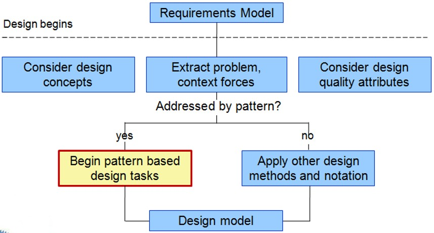
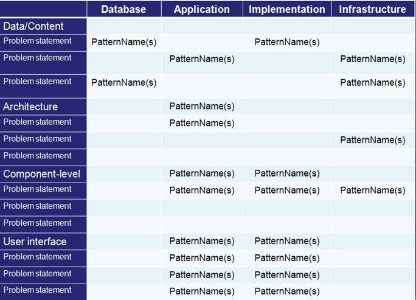

# Chapter 16 | Pattern-Based Design

## Design Patterns

### **什么是设计模式**

设计模式是针对软件开发中**重复出现的问题**而总结出的**标准化解决方案**。
* **核心价值：** 复用 (Reused)。它允许软件工程社区捕获设计知识，避免开发者“重复造轮子”。
* **起源：** 课件特别提到了 Christopher Alexander（一位建筑师），他在 1977 年首次描述了模式的概念，后来被引入到计算机科学中。

---

### **基础概念：上下文与约束**

设计模式不是孤立的模板，它由三个核心要素构成：

1.  **Context (上下文)：** 问题发生的特定环境。
2.  **Problem (问题)：** 在该环境下需要解决的具体挑战。
3.  **Solution (解决方案)：** 适合该环境的解决方法。

* **Forces (约束/影响力)：** 这是一个进阶概念。它指的是性能要求、系统复杂度、扩展性等**限制条件**。同一个问题，如果 Forces 不同（比如一个要求极高性能，一个要求代码极简），最终选择的设计模式也会完全不同。

---

### **什么才算是一个“有效”的模式？**

并非所有的经验总结都能叫“设计模式”。根据 Coplien (2005) 的定义，有效模式应具备：

* **解决真实问题：** 而非抽象理论。
* **经过实践验证：** 它是被证明行之有效的概念。
* **方案并非显而易见：** 如果方案一眼就能看出，就不需要总结成模式。模式通常是通过间接方式解决复杂设计问题。
* **描述关系：** 它描述的是系统深层的结构和机制，而非简单的模块堆砌。
* **人文因素：** 兼顾美学、实用性并减少人为干预。

---

### **设计模式的宏观分类**

从系统架构到具体实现，模式可以分为多个层级：

* **Architectural patterns (架构模式)：** 解决系统级的结构问题。
* **Data patterns (数据模式)：** 解决面向数据建模的重复问题。
* **Component patterns (组件模式)：** 解决子系统和组件之间的通信。
* **Interface design patterns (界面设计模式)：** 解决 UI 与终端用户的交互问题。
* **WebApp patterns (Web 应用模式)：** 专门针对构建 Web 应用遇到的问题集。

---

### **经典分类：GoF (Gang of Four) 三大类**

这是软件工程中最经典的分类法（1995 年提出），将模式分为：

1.  **Creational (创建型)：** 关注对象的创建。解决“如何实例化对象”以提高灵活性（如：抽象工厂、工厂方法）。
2.  **Structural (结构型)：** 关注类和对象的组合。解决“如何构建更大的结构”以实现系统兼容（如：适配器模式、组合模式）。
3.  **Behavioral (行为型)：** 关注对象间的职责分配与通信。解决“对象之间如何高效协作”（如：职责链模式、命令模式）。

---

### **模式 vs. 框架 (Frameworks)**

很多人容易混淆这两个概念，课件进行了明确区分：

* **设计模式：** 是**思想**，是抽象的设计经验，不依赖于具体实现。
* **框架：** 是**实现**，是针对特定设计工作的“骨架式基础设施”。
* **关系：** 框架通常是多个设计模式的集合体。框架包含“插槽 (Plug points/Hooks)”，允许开发者植入特定的业务逻辑。

---

### **如何系统地描述一个模式？**

为了让模式易于传播和复用，通常使用结构化的表格来记录：

* **名称 (Name)**、**问题 (Problem)**、**动机 (Motivation)**。
* **上下文 (Context)**、**约束 (Forces)**、**解决方案 (Solution)**。
* **意图 (Intent)**、**协作 (Collaborations)**、**后果 (Consequences)**（应用该模式的利弊）。
* **实现 (Implementation)**、**已知应用 (Known uses)**。

---

## Pattern-Based Software Design

### **模式设计的上下文流程**

* **输入端：** 始于 **需求模型 (Requirements Model)**。
* **分析环节：** 设计者需要同时考虑设计概念、提取问题背景及其约束力（Context Forces），并兼顾设计质量属性。
* **决策点：** “是否可以通过模式解决 (Addressed by pattern?)”。
    * **Yes：** 开启基于模式的设计任务。
    * **No：** 采用其他设计方法。
* **输出端：** 最终形成 **设计模型 (Design Model)**。

---

### **模式思维的六个步骤**

Shalloway 和 Trott 提出了一种“由外向内”的思维方式：

1. **理解大局 (Big picture)：** 明确软件所处的整体上下文。
2. **提取高层模式：** 在抽象层次上识别出存在的模式。
3. **构建骨架：** 利用高层模式建立设计的上下文或框架。
4. **向内工作 (Work inward)：** 寻找更低抽象层次的模式，丰富设计方案。
5. **循环往复：** 重复上述步骤直到设计丰满。
6. **精炼与适配：** 根据软件的具体特性调整每个模式的实现。

---

### **设计任务分解**

具体的工程任务包括：

* **层次分析：** 建立问题的层次结构（Problem Hierarchy）。
* **语言检索：** 确定该领域是否存在成熟的 **模式语言 (Pattern Language)**。
* **架构先行：** 首先寻找适用于整体架构的模式。
* **组件细化：** 利用组件协作关系搜索合适的底层模式。
* **界面处理：** 针对 UI 隔离出的问题，搜索专门的界面设计模式库。
* **质量验证：** 始终以设计质量准则作为最终修饰的依据。

---

### **模式组织表**

为了管理庞大的模式库，通常使用这种二维表进行系统整理：

* **纵轴（层次）：** 数据/内容层、架构层、组件层、用户界面层。
* **横轴（应用领域）：** 数据库、应用、实现、基础设施。
* **作用：** 方便设计者根据问题的性质和所属层级，快速定位（PatternName）对应的解决方案，类似于设计的“字典”。

---

### **四大常见设计误区**

即使有模式可用，也容易犯错：

1. **仓促决定 (Not enough time)：** 没花足够时间理解问题本质和约束，就选了一个看起来“差不多”但并不合适的模式。
2. **拒绝认错 (Force fit)：** 一旦选错，由于心理惯性，拒不承认，反而强行修改问题去适配模式。
3. **忽略约束 (Forces not considered)：** 选用的模式忽略了某些关键的限制条件，导致适配度极差。
4. **机械套用 (Too literally)：** 过于教条地应用模式，没有根据具体的问题空间进行必要的灵活适配。

---

## **架构模式 (Architectural Patterns)**

架构模式是设计模式中最顶层的一类，它决定了**系统的整体结构**。

* **解决的问题：** 主要处理系统级的挑战，如**并发性 (Concurrency)**、**持久化 (Persistence)** 和 **分布性 (Distribution)**。
* **生动的比喻：** 课件使用了“房子与厨房”的模式作为类比。
    * **厨房模式** 及其协作模式定义了食物的存储、准备、所需的工具（Task-specific tools）以及这些工具在空间内摆放的规则（Workflow rules）。
    * 具体实现可能涉及柜台、灯光、中央岛台等细节，但所有设计都遵循厨房模式给出的“解决方案”框架。
* **核心价值：** 决定了系统的总体“长相”，为后续的详细设计提供顶层约束。

---

## **组件级模式 (Component-Level Patterns)**

当架构确定后，我们需要解决系统中**局部模块**的设计问题。

* **核心功能：** 针对从需求模型中提取的特定子问题，提供经过验证的功能性解决方案。
* **案例分析：** 以 SafeHome 网站的搜索功能为例。
    * **子问题：** 用户如何获取任何 SafeHome 设备的规格和相关信息？
    * **涉及模式：** 高级搜索 (AdvancedSearch)、帮助向导 (HelpWizard)、搜索区域 (SearchArea)、搜索建议 (SearchTips) 等。
* **设计重心：** 关注模块内部的结构设计以及模块之间的协作方式。

---

## **用户界面 (UI) 模式**

UI 模式旨在提高用户体验，使系统更加**易用和直观**。列举了 9 个设计的焦点领域：

* **整体 UI：** 顶层结构与全局导航。
* **页面布局：** 页面元素的组织。
* **表单与输入：** 各种表单填写技术。
* **表格与导航：** 表格数据的处理与层级菜单的导航。
* **数据操作：** 数据的编辑、修改与转换。
* **搜索与电子商务：** 针对特定内容检索和电商特有元素（如购物车）的模式。

---

## **Web 应用模式 (Webapp Patterns)**

专门针对 Web 环境设计的模式，分为以下五大类：

1. **信息架构 (Information Architecture)：** 定义信息空间的整体结构。
2. **导航模式：** 定义链接结构（如层级、环状、巡回路径）。
3. **交互模式：** 告知用户操作后果，或根据上下文扩展内容。
4. **表现模式 (Presentation)：** 组织界面控制功能，建立有效的视觉层级。
5. **功能模式：** 定义 WebApp 内部的工作流、行为、通信和算法元素。

---

### **移动应用模式 (Patterns for Mobile Apps)**

移动端模式需要适配屏幕尺寸小、交互方式（手势）独特等限制因素。

* **移动 UI 模式：** 签到页面、地图交互、弹出层 (Popovers)、注册流、自定义标签栏导航等。
* **移动系统架构模式：** 相比 Web 应用，移动端更强调简洁性与即时同步，常用模式包括：
    * **MVC (Model-View-Controller)**：实现界面与逻辑分离。
    * **数据传输对象 (DTO)**：优化网络传输性能。
    * **同步机制 (Synchronization)**：解决离线数据与服务器的一致性问题。
    * **延迟获取 (Lazy Acquisition)**：优化内存和加载速度。

---