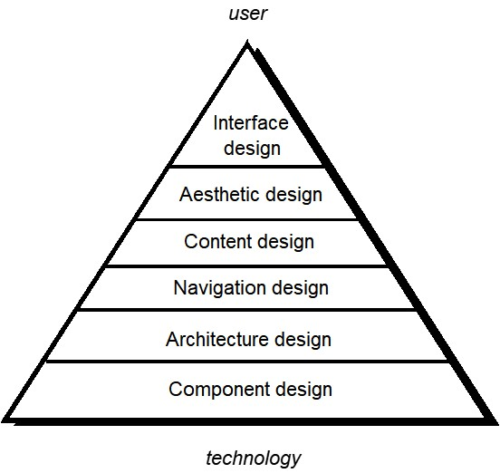
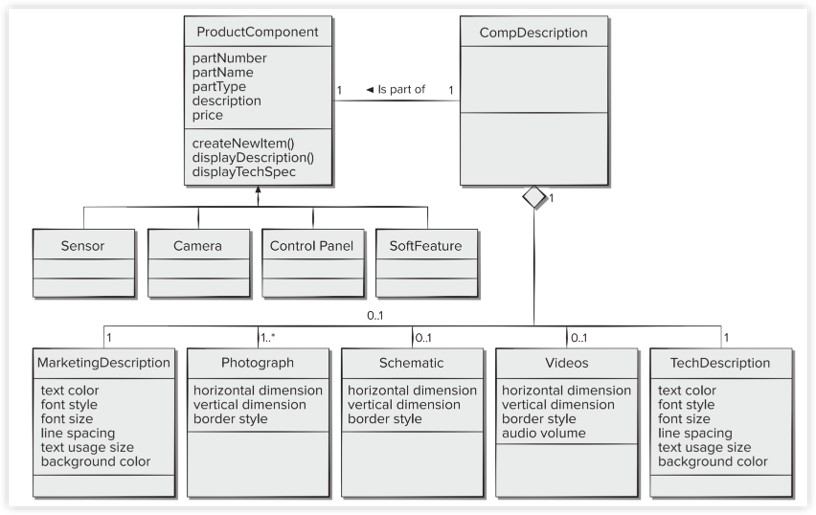
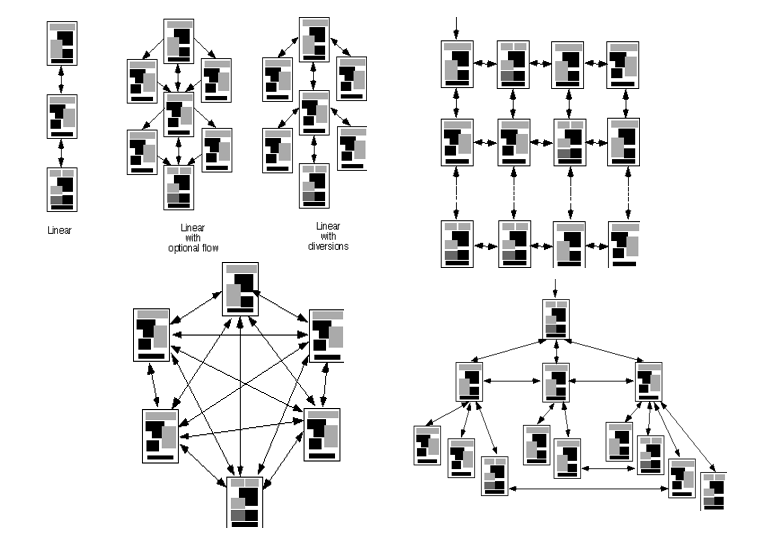
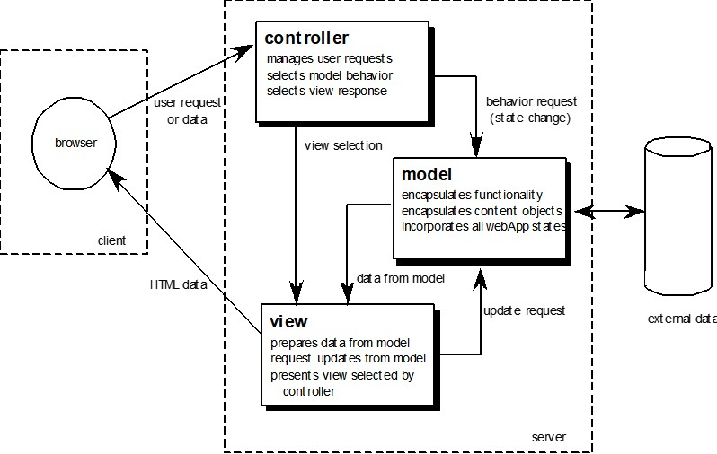
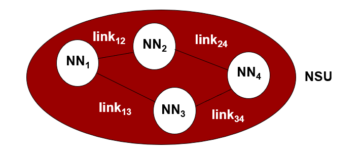
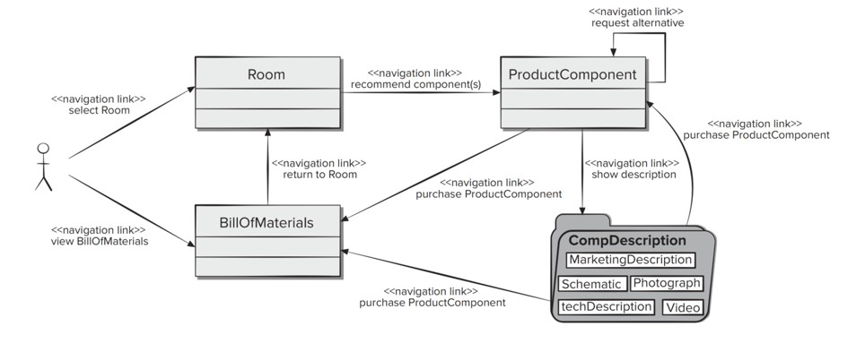

# Chapter 17 | WebApp Design

## **设计的本质与 WebApp 的侧重点**

Jakob Nielsen 的名言，将设计分为两种理想状态：

* **Artistic ideal (艺术理想)：** 表达自我。
* **Engineering ideal (工程理想)：** 为客户解决问题。

**我们何时需要强调 WebApp 设计？**

并非所有的网页都需要复杂的工程化设计，但在以下场景中设计至关重要：

1.  **内容与功能复杂：** 当逻辑不再是简单的展示，而是涉及复杂的交互。
2.  **规模宏大：** 包含数百个内容对象、功能和分析类（Analysis classes）。
3.  **业务关键：** WebApp 的成功直接决定了业务的成败（如大型电商或金融平台）。

---

### **WebApp 的质量维度：系统视角**

从技术和系统的角度来看，高质量的设计必须具备：

* **Security (安全性)：** 抵御外部攻击、排除未经授权的访问、保护用户隐私。
* **Availability (可用性/可用时长)：** 衡量系统可供用户正常使用的运行时间百分比。
* **Scalability (可扩展性)：** 系统是否能应对用户量或交易量的显著波动（如应对“双11”级别的突发流量）。
* **Time to Market (上线时间)：** 在实际工程中，设计质量需要与开发效率进行权衡，以抢占市场先机。

---

### **终端用户视角下的质量维度**

这是用户最能直观感受到的“好坏”。

* **Time (时间/及时性)：** 网站更新频率如何？是否有醒目的方式展示变更内容？
* **Structural (结构性)：** 网站各部分衔接是否紧密？链接是否有效？图片是否都能正常加载？
* **Content (内容)：** 核心页面的内容是否准确、是否符合预期？动态生成的 HTML 页面质量如何？
* **Accuracy and Consistency (准确性与一致性)：** 昨天下载的页面和今天的一样吗？数据呈现是否足够准确？
* **Response Time and Latency (响应时间与延迟)：** 服务器响应请求的时间是否在可接受范围内？如果太慢，用户会直接放弃使用。
* **Performance (性能)：** 在高负载、不同时段、不同连接速度下，性能是否依然稳健？

---

## ** WebApp 设计目标：一致性 (Consistency)**

一致性是 Web 设计的基石，它不仅能显著降低用户的认知负担，还能提升系统的专业感。课件从五个维度定义了一致性：

* **内容一致性 (Content)：** 信息表达、术语使用应保持统一。
* **平面设计一致性 (Graphic design/Aesthetics)：** 整个应用的配色、字体、图标风格应呈现统一的视觉效果。
* **架构一致性 (Architectural design)：** 使用统一的模板，建立一致的超媒体结构。
* **接口一致性 (Interface design)：** 定义统一的交互模式、导航逻辑和内容展示方式。
* **导航机制一致性 (Navigation mechanisms)：** 在所有页面中使用统一的导航元素（如侧边栏、顶部菜单的位置）。

---

### **综合设计目标 (Identity, Robustness, etc.)**

除了核心的一致性，一个成功的 WebApp 还需具备以下特质：

* **身份识别 (Identity)：** 建立符合业务目标的独特形象（品牌感），决定用户的第一印象。
* **鲁棒性 (Robustness)：** 确保提供与用户需求高度相关、且在各种异常情况下都能稳定运行的内容与功能。
* **可导航性 (Navigability)：** 设计应直观、可预测，让用户总能清楚“我在哪”以及“我能去哪”。
* **视觉吸引力 (Visual appeal)：** 布局、配色、图形与文字的平衡需符合审美，吸引并留住用户。
* **兼容性 (Compatibility)：** 确保在不同的设备、浏览器环境和系统配置下都能正常工作。

---

### **WebApp 设计金字塔 (WebApp Design Pyramid)**

这张图是 Web 开发中最核心的模型之一。它揭示了设计是如何从底层的**技术/数据**逐步演化到顶层的**用户感知**的。金字塔由下至上分为六层：

1. **组件设计 (Component design)：** 最底层，关注具体功能逻辑的实现。
2. **架构设计 (Architecture design)：** 关注系统的整体结构和各模块间的通信。
3. **导航设计 (Navigation design)：** 规划用户在不同内容间流转的路径。
4. **内容设计 (Content design)：** 确定页面承载的具体信息和资源。
5. **审美设计 (Aesthetic design)：** 视觉表现层，即界面的“颜值”。
6. **界面设计 (Interface design)：** 最顶层，用户直接与之交互的触点。

* **由底向上的演化：** 好的设计绝不是从“画界面”开始的，而是基于坚实的**组件**和**架构**基础。
* **用户与技术的连接：** 金字塔的顶端指向 **User (用户)**，底端指向 **Technology (技术)**。这意味着顶层设计更偏向人的认知，而底层设计更偏向机器的执行。

---

### **界面设计的“灵魂三问”**

一个优秀的界面必须在用户无需思考的情况下，自然地回答以下三个问题：

* **Where am I? (我在哪里？)**：界面应提供应用标识（Logo），并告知用户当前在内容层级中的位置（如面包屑导航）。
* **What can I do now? (我现在可以做什么？)**：明确告知用户当前的可用功能、可点击的链接以及相关内容。
* **Where have I been, where am I going? (我从哪来，要去哪？)**：界面必须辅助导航。提供一张清晰的“地图”，让用户了解历史路径并指引下一步操作。

---

### **界面设计原则**

* **Anticipation (预判)**：WebApp 应能预见用户的下一步行动（如：输入框自动补全）。
* **Communication (反馈/沟通)**：系统应及时告知用户操作的状态（如：提交后的成功提示）。
* **Consistency (一致性)**：导航控制、图标、美学风格（颜色、形状、布局）需保持统一。
* **Controlled Autonomy (受控的自主权)**：界面应引导用户行动，但必须遵循已建立的导航规范。
* **Efficiency (效率)**：设计应优化用户的工作效率，而不是为了方便开发人员。
* **Focus (聚焦)**：界面应确保用户专注于当前的特定任务，排除无关干扰。
* **Fitt's Law (费茨法则)**：获取目标的时间取决于目标的大小和距离。重要按钮应设计得更大且更易触达。
    * **Human interface objects (人机界面对象)**：复用用户熟悉的标准组件（如：齿轮代表设置，信封代表邮件）。
* **Latency reduction (减少延迟)**：通过异步处理或视觉反馈（进度条），让用户感觉操作已完成。
* **Learnability (易学性)**：降低学习成本，确保用户再次使用时无需重复学习。
* **Maintain work product integrity (保持工作成果完整性)**：用户填写的数据（如长表单）应自动保存，防止因错误或中断导致丢失。
* **Readability (可读性)**：所有信息应确保各年龄段用户都能清晰阅读。
* **Track state (状态跟踪)**：系统应记录用户状态。用户登出后再回来，应能从上次离开的地方继续。
* **Visible navigation (可见导航)**：通过设计创造一种“错觉”——让用户觉得是工作主动来到了他们面前，而不是他们在系统里到处找工作。

---

## **审美设计 (Aesthetic Design)**

在完成交互层设计后，视觉层面的准则决定了用户对系统的第一印象：

* **留白 (White space)：** 不要害怕留白，合理的空白能让页面“呼吸”，突出重点内容。
* **强调内容：** 设计的本质是为内容服务，而不是装饰。
* **视觉流向：** 布局应符合人类阅读习惯，从左上向右下组织元素。
* **地理分组：** 将导航、内容和功能在页面内进行逻辑分组，减少用户的搜寻成本。
* **限制滚动：** 尽量在有限的屏幕空间内呈现核心信息，避免过度依赖滚动条。
* **自适应设计：** 必须考虑不同分辨率和浏览器窗口大小的适配。

---

## **内容设计与内容对象**

WebApp 的本质是“内容驱动”的系统。

* **内容对象 (Content Objects)：** 类似于传统软件中的数据对象。它不仅包含数据（如文字、图片、视频），还包含其展现方式和与其他对象的关系。
* **设计表示：** 课件展示了一个类图（Class Diagram），描述了 `ProductComponent` 与其相关联的 `MarketingDescription`、`Photograph`、`Videos` 等内容对象之间的关系。

---

### **内容架构 (Content Architecture)**

内容需要被结构化组织，以支持高效的导航。四种典型的组织结构：

1.  **Linear (线性结构)：** 适用于按固定顺序展示的内容（如教程）。
2.  **Grid (网格结构)：** 适用于具有多个维度分类的内容。
3.  **Hierarchical (层次结构)：** 最常见，通过主分类和子分类组织（如门户网站）。
4.  **Network (网状/交互结构)：** 页面互联，适用于非线性浏览的复杂信息。

---

### **架构设计与 MVC 架构**

WebApp 架构不仅包括内容的组织方式，还涉及系统如何处理逻辑和交互。其中最经典的就是 **MVC (Model-View-Controller) 架构**：

* **Model (模型)：** 负责管理业务逻辑和数据。它包含所有内容对象，并处理对外部数据源的访问。
* **View (视图)：** 负责将 Model 中的内容呈现给用户。它包含界面特有的功能，并根据 Model 的变化更新显示。
* **Controller (控制器)：** 协调者。它接收用户的请求，选择合适的 Model 进行处理，并决定使用哪个 View 来响应用户。

**MVC 的交互流程：**

1.  用户通过浏览器发送请求。
2.  **Controller** 接收请求，修改 **Model** 的状态。
3.  **Model** 处理完后，**View** 从 Model 获取最新数据。
4.  **View** 生成 HTML 数据返回给浏览器，完成一次交互。

---

## **导航设计 (Navigation Design)**

### **导航设计与用户视角**

导航设计不再仅仅是“页面链接”，而是基于用户需求的行为路径设计。

* **用户层次结构：** 设计始于对用户角色的识别。不同的用户（如访客、普通用户、管理员）在应用中的目的不同，因此他们的导航路径也必须定制化。
* **导航语义单元 (NSU)：** 当用户与应用交互时，会接触到一系列 NSU。
    * **定义：** 一组信息和相关的导航结构，它们共同协作，以满足用户特定子集的需求。

---

### **导航语义单元 (NSU) 的构成**

NSU 是导航设计的最小逻辑单元，它将复杂的导航系统拆解为可管理的、围绕任务展开的部分。

* **导航方式 (WoN)：** 代表用户实现特定目标的最佳路径。
* **导航节点 (NN) 与导航链 (Navigation Links)：** NSU 由多个节点通过链接连接而成。
* **实例分析：** 在 `image_2c64a0.jpg` 中展示了一个具体的 NSU 建模。
    * 用户从 `Room` 开始，可以点击导航链跳转到 `ProductComponent` 查看组件，或者进入 `BillOfMaterials` 查看物料清单，最后深入到 `CompDescription`（包含市场描述、图表、照片等）。
    * **关键洞察：** 这不仅是页面图，它描述了用户为了完成“了解并购买组件”这一任务所经历的完整操作流程。

---

### **导航语法 (Navigation Syntax)**

这是导航在界面上的具体表现形式，解决了“导航如何呈现给用户”的问题：

* **个体导航链接：** 文本链接、图标、按钮、开关或图形隐喻。
* **水平导航栏：** 列出主要内容分类，通常控制在 4 到 7 个类别之间以降低认知负荷。
* **垂直导航列：** 常用于展示更详细的分类或应用内的所有主要对象。
* **标签页 (Tabs)：** 导航栏或导航列的变体，适合展示平级的功能模块。
* **站点地图 (Site maps)：** 为应用内的所有内容对象和功能提供全面的索引。

---

### **组件级设计 (Component-Level Design)**

这是 WebApp 设计中最接近底层实现的阶段，主要关注具体的功能逻辑：

* **本地化处理：** 动态生成内容和导航能力。
* **计算能力：** 提供符合业务领域的计算或数据处理功能。
* **数据库访问：** 提供复杂的数据库查询与存取接口。
* **外部接口：** 建立与外部企业系统（如 ERP、第三方支付）的数据接口。

---