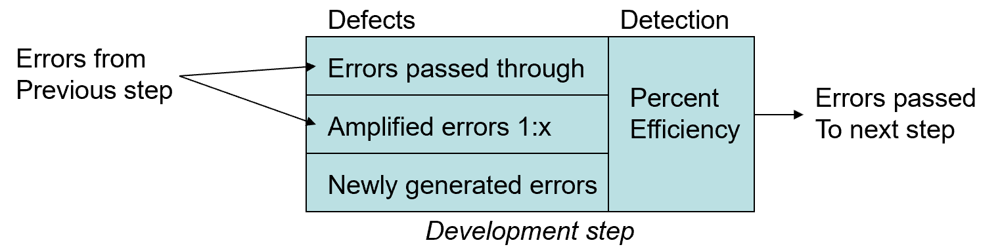
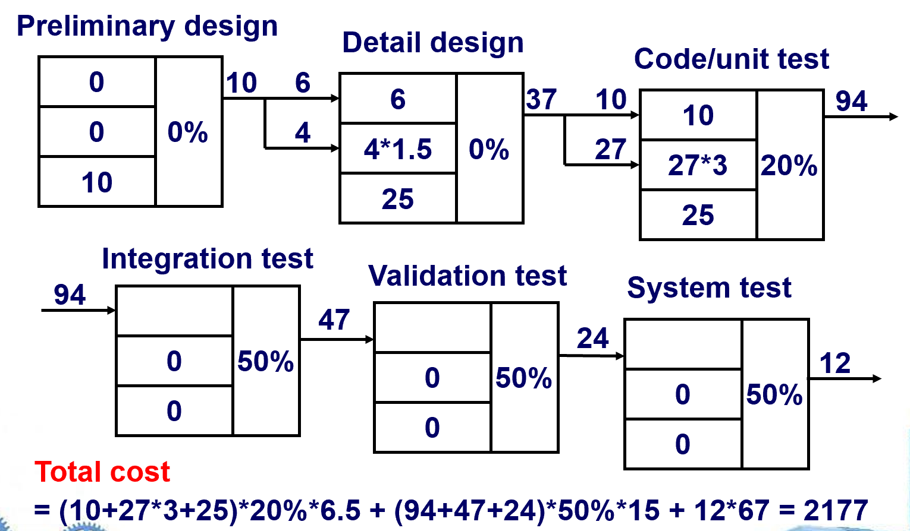
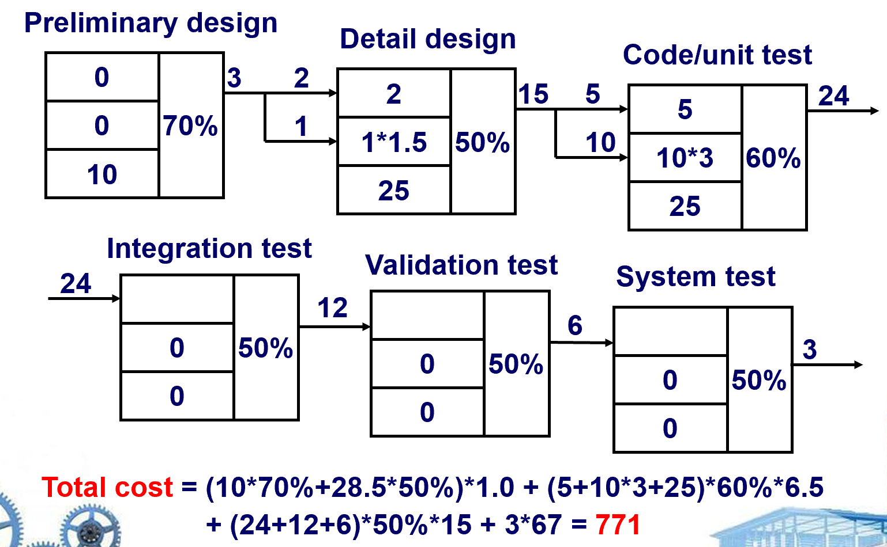
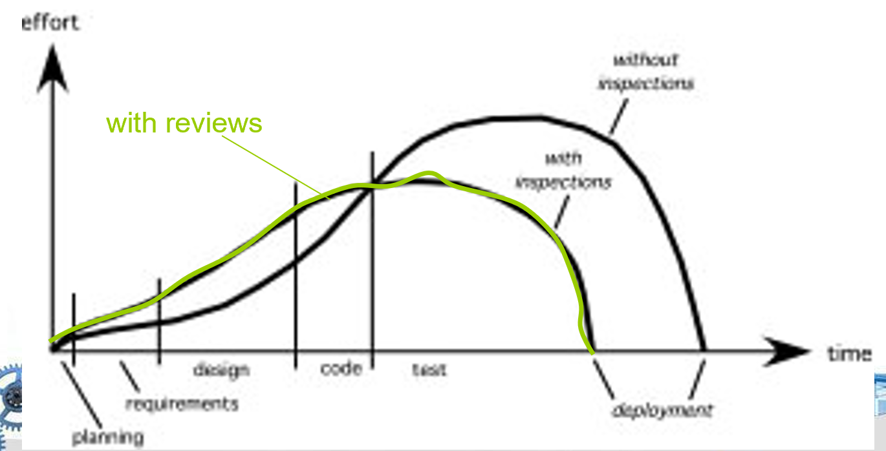

# Chapter 20 | Review Techniques

## Overview

**什么是评审 (What Are Reviews)?**

* **核心定义**：它是“由技术人员为技术人员召开的会议”，是对软件工程过程中产生的“工作产品”（如需求文档、设计文档、代码等）进行的“技术评估”。
* **作用**：它不仅仅是质量保证（QA）的手段，也被视为一种“培训场所”，通过评审，团队成员可以相互学习，提升技术水平。

**错误与缺陷 (Errors and defects)**

* **定义区分**：
    * **错误 (Error)**：在软件交付给用户**之前**发现的质量问题。
    * **缺陷 (Defect)**：在软件交付给用户**之后**发现的质量问题。
* **补充说明**：这种基于“时间点”的区分方式在业界并非主流共识。在现代软件工程中，很多组织会将这两者统称为“缺陷（Defects）”或“故障（Bugs）”，但在本书的上下文中，这个术语界定是为了讨论缺陷的传播过程。

---

## 缺陷放大与移除 (Defect Amplification and Removal)

**模型机制**：该图描述了一个开发步骤中的缺陷流动过程：

1.  从前一个阶段传入的“错误”（Errors from Previous step）。
2.  这些错误在当前阶段可能被“通过”（Passed through），也可能“放大”（Amplified），同时当前阶段自身也可能产生“新错误”（Newly generated errors）。
3.  通过某种“检测效率”（Percent Efficiency），一部分错误被移除，剩余的传到下一个阶段。

**成本的概念**：**缺陷修正成本随时间呈指数级上升**：

* 设计阶段：$1.5$ 单位
* 测试开始前：$6.5$ 单位
* 测试期间：$15$ 单位
* 发布后：$67 \sim 100$ 单位
* **核心结论**：越早发现错误，修正成本越低。

**评审的价值**：研究表明，设计活动产生了约 $50\% \sim 65\%$ 的错误，而“形式化评审技术”能有效地消除其中多达 $75\%$ 的缺陷。

---

### Example: No Reviews

在**没有评审机制**时，缺陷是如何在软件生命周期中“放大”的。

* 在“初步设计”阶段，虽然产生了 $10$ 个错误，但因为没有评审，这 $10$ 个错误全部进入下一阶段。
* 箭头上的数字（如 $37, 94, 47, 24, 12$）表示流入下一个测试阶段的缺陷总数。
* 矩形内的乘法（如 $4 \times 1.5$）代表了缺陷的放大效应——一个小设计错误可能导致在编码或测试阶段变成多个缺陷。

**总成本计算**：

* 最后给出了一个复杂的计算公式，将各个阶段的缺陷数量乘以对应阶段的修复成本。
* 最终结果为 **$2177$**。这是一个巨大的质量代价。

---

### Example: With Reviews

这一页展示了引入“评审”机制后，流程是如何改变的。

**显著变化**：

* 在“初步设计”阶段，引入了 $70\%$ 的检测效率，这意味着原本的 $10$ 个错误有 $7$ 个被发现并修正了，只有 $3$ 个流向下一阶段（对比第三页的 $10$ 个流入）。
* 因为源头的错误减少，后续各个阶段流入的缺陷数量大幅下降。

**总成本计算**：重新计算后，总成本降至 **$771$**。

**结论**：通过在设计阶段引入 $70\%$ 效率的评审，项目的总修复成本从 $2177$ 降低到了 $771$，降幅高达 **$64.6\%$**。这直观地证明了“评审”作为一种早期质量保障手段的巨大经济价值。

---

好的，我们接着上一部分的讲解，深入探讨后续这几页关于“评审指标”及“评估效果”的内容。这部分内容的核心在于将“评审”这一质量保证活动**量化**，以便于管理和决策。

---

## 评审指标及其使用 (Review Metrics and Their Use)

**核心公式**：

$$E_{review} = E_p + E_a + E_r$$

$$Err_{tot} = Err_{minor} + Err_{major}$$

$$Defect\ density = \frac{Err_{tot}}{WPS}$$

* **总评审工作量 ($E_{review}$)**：由三个部分组成：准备工作量 ($E_p$) + 实际评审会议工作量 ($E_a$) + 纠错工作量 ($E_r$)。
* **总错误数 ($Err_{tot}$)**：由“次要错误” ($Err_{minor}$) 和“主要错误” ($Err_{major}$) 构成。
* **缺陷密度 (Defect density)**：这是衡量产品质量的重要指标，公式为 $\frac{Err_{tot}}{WPS}$（总错误数除以工作产品大小，例如每页的错误数）。

**指标定义**：这里明确了“准备”、“评估”和“返工（纠错）”在时间成本上的具体分工，强调了**评审不仅仅是开会，还包括开会前的预习和会后的修改**。

---

### Evaluate Saving: An Example—I

通过一个具体的经济学案例，演示了为什么进行评审是“划算”的：

**核心逻辑**：比较“评审中纠错”和“测试中纠错”的成本差异。

* 案例给出：在评审中发现并纠正一个错误平均需 **6** 人时（综合了次要和主要错误）。
* 而在测试阶段发现并纠正同样的错误平均需 **45** 人时。

**计算节省**：每个错误在评审阶段被拦截，就意味着节省了 $45 - 6 = 39$ 人时的后续工作。

* 如果一次评审发现了 22 个错误，那么总共节省了 $22 \times 39 \approx 660$ 人时！

**启示**：这非常直观地证明了“评审”具有极高的**投入产出比（ROI）**。

---

### 评审指标 - 投入对比 (Review Metrics - Effort)

这一页用一张经典的曲线图展示了评审在整个软件生命周期中的投入规律：

* **横轴为时间，纵轴为工作量（Effort）**。
* **无评审曲线**：在测试阶段，工作量会有一个剧烈的“尖峰”，因为这是集中处理历史遗留错误的时段。
* **有评审曲线（绿色）**：在需求和设计阶段会有额外的前期投入（因为评审需要人力），但曲线变得更加平缓，**测试阶段的工作量显著降低**，且项目整体结束时间（交付点）更早。

**“评审并不占耗时间，它是在节省时间。”**（Reviews don't take time, they save it.）

---

### Prediction Work Performance: An Example—II

如何利用历史数据来评估当前的评审质量：

**基准预测**：根据历史数据（如平均每页 0.6 个错误），如果评审一份 32 页的文档，你预估应该发现约 19-20 个错误。

**异常处理**：如果实际只发现了 6 个错误，有两种可能：

1. **好事**：你的设计做得极好，质量非常高。
2. **坏事**：评审工作做得不够彻底，很多错误被漏掉了。

**管理意义**：通过这种预测，管理者可以反思评审过程是否严谨，而不是盲目认为错误少就是质量好。

---

## 参考模型 (Reference Model)

这一页总结了**“评审形式化”**的四个关键维度，如果你想让评审更加正式、高效，必须包含以下要素：

* **角色明确**：每个人在评审中都有固定的职责。
* **充分的准备**：不能空手去开会，会议前必须对工作产品进行细致预习。
* **明确的结构**：评审要有章可循，而不是漫无目的地闲聊。
* **闭环跟踪**：对评审中提出的问题，必须有后续的纠正与验证，确保问题真正解决。

---

## 非正式评审 (Informal Reviews)

并不是所有评审都需要大动干戈。非正式评审适用于轻量级的场景：

* **常见形式**：简单的“桌面检查”（Desk check）、同事间的闲谈、或者结对编程（Pair Programming）。
* **结对编程的核心优势**：它将“评审”无缝嵌入到开发流程中，实现了**持续评审**。这种方式能立即发现并纠正错误，从而提高工作产品的初期质量，避免问题“放大”。

---

## 正式技术评审 (Formal Technical Reviews, FTR)

FTR 是为了实现高质量、规范化软件开发而设计的正式机制。

* **核心目标**：不仅是找错（功能、逻辑、实现层面的错误），还要验证产品是否满足需求、是否遵循开发标准。
* **管理价值**：FTR 使软件开发过程更统一、项目进度更易于把控。FTR 包含了**走查（Walkthroughs）**和**检查（Inspections）**等具体实践。

---

## 评审会议 (The Review Meeting)

这页明确了“正式评审会议”的纪律：

* **人数控制**：通常 3 到 5 人，人太多会降低效率。
* **时间成本**：强调会议前要有准备（每人不超过 2 小时），会议本身也不应过长（不超过 2 小时）。
* **聚焦目标**：只关注具体的工作产品（如设计文档的某个片段、源代码的某个模块），避免脱离实际内容。

---

### 角色与流程 (The Players & Process)

**关键角色**：

* **Producer (生产者)**：产出文档/代码的人，也是评审的焦点。
* **Review Leader (评审领导)**：组织者，负责准备和分发材料。
* **Reviewer (评审员)**：核心人员，负责发现问题。
* **Recorder (记录员)**：笔杆子，记录所有发现的问题。
* **Standards Bearer (标准制定者/SQA)**：确保产品符合质量标准。

**流程的三阶段**：

1. **准备阶段**：预习、准备问题清单。
2. **执行阶段**：由生产者介绍，评审员提出问题，记录员汇总。
3. **跟踪阶段**：结论汇总、生成质量报告（SQA Report）。

---

### 评审指南 (Review Guidelines)

* **心态与态度**：评审产品，不评审人（Review the product, not the producer）。
* **效率第一**：限定议程，限制辩论（不要为了一个技术点争论不休）。
* **聚焦与记录**：列出问题点，但**不要在会上尝试解决所有问题**（解决问题是会后的事，会上的任务是“发现”）。
* **体系建设**：制定检查表（Checklist）、进行专门的培训、评审初期的评审工作（Review your early reviews）。

---

### 样本驱动评审 (Sample-Driven Reviews, SDRs)

* **核心逻辑**：如果产品规模太大，无法全检，就抽样检查一部分（$a_i$）。
* **估算与优先级**：通过抽样记录的故障数（$f_i$）估算整个产品的故障总数。
* **资源投放**：将有限的评审资源聚焦在“估计故障数最多”的那些模块上，这被称为**基于风险的质量保证**。

---