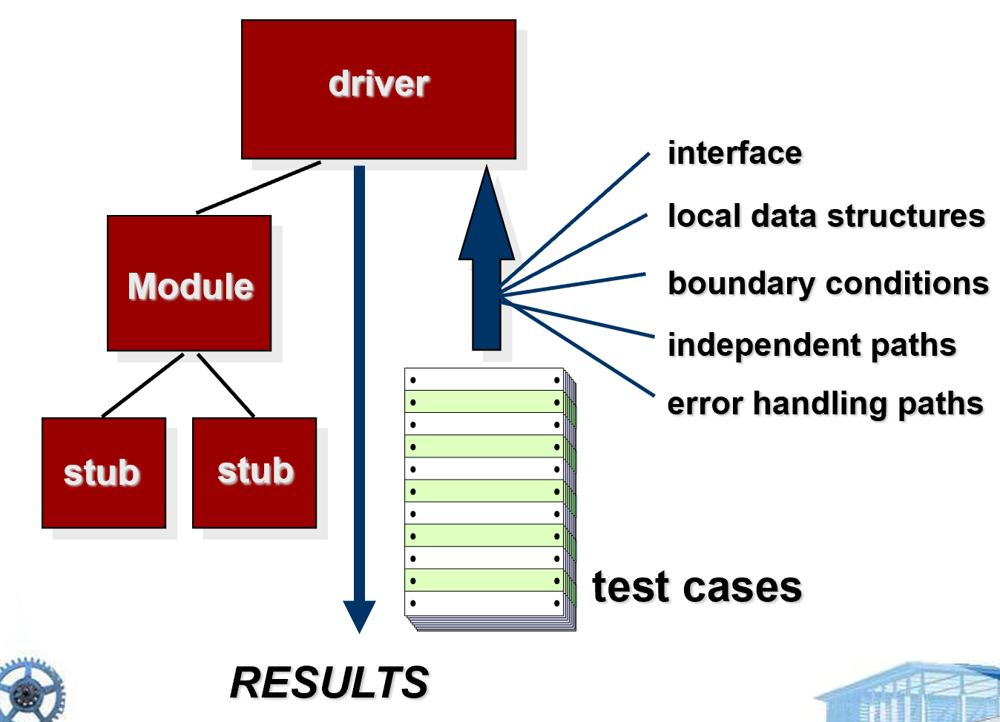

# Chapter 22 | Software Testing Strategies

## Software Testing

测试的核心在于“意图”：**通过运行程序来主动寻找错误**，而非仅仅证明程序能运行。其目标是在交付给终端用户之前尽早发现问题。

---

### What Testing Shows

* **errors**：首先发现的是错误。
* **requirements conformance**：接着确认软件是否符合需求规格。
* **performance**：随后评估性能表现。
* **an indication of quality**：最终，测试结果成为了衡量软件整体质量的指标。

---

### 战略性方法 (Strategic Approach)

为了有效测试，需要遵循以下原则：

* **评审先行**：通过有效的技术评审，在测试前就能消除大量错误。
* **由内而外**：测试应从组件（单元）开始，逐步向集成系统推进。
* **因地制宜**：不同的工程方法和阶段，需要采用不同的测试技术。
* **测试与调试的区别**：测试是发现错误，调试是定位并修复错误。二者虽不同，但在策略上需要紧密配合。
* **独立性**：大型项目应由“独立测试组”执行，以减少开发者“当局者迷”的倾向。

---

### 验证与确认 (V & V)

这是软件工程中非常经典的两个概念，常被通过 Boehm 的名言来区分：

* **Verification（验证）**：侧重于“我们是否正确地构建了产品？”（Are we building the product right?），即是否准确实现了规格说明书中的功能。
* **Validation（确认）**：侧重于“我们是否构建了正确的产品？”（Are we building the right product?），即产品是否真正满足了客户的原始需求。

---

### 谁来测试软件？

* **开发者 (developer)**：非常了解系统，但往往倾向于“温和”测试（测试能通过的路径），且受“交付压力”驱动，容易忽略潜在隐患。
* **独立测试员 (independent tester)**：对系统了解有限，但视角客观，他们以“破坏系统”为目标，完全受“质量标准”驱动。

---

### 测试战略（Testing Strategy）

**核心逻辑**：软件开发遵循从系统工程、需求分析、设计建模到代码生成的演进。与之对应，测试策略也应遵循从“微观”到“宏观”的顺序：

* **Unit test (单元测试)**：针对最基础的模块。
* **Integration test (集成测试)**：验证模块间的接口与协作。
* **Validation test (确认测试)**：确保软件满足需求。
* **System test (系统测试)**：对整个计算机系统进行评估。

**Testing-in-the-small**：在传统软件开发中，关注点是单个模块；但在面向对象（OO）开发中，关注点变成了**类（Class）**，包括其属性、操作以及对象间的通信与协作。

**Testing-in-the-large**：随着模块被逐一验证，重点转移到系统的集成与整体功能。

---

### 战略性考量（Strategic Issues）

要做好测试，必须在测试开始前就制定好战略：

* **量化需求**：需求必须是可度量的，否则无法判断测试是否“通过”。
* **目标明确**：显式地定义测试目标。
* **用户画像**：针对不同类别的用户开发测试模型。
* **自动化与快速迭代**：强调“快速周期测试”（Rapid cycle testing）。
* **自测能力**：设计“鲁棒”的软件，使其具备一定的自检能力。

---

### 单元测试（Unit Testing）

单元测试是对软件最小可测试单元的验证：

* **测试对象**：单个模块。
* **输入输出**：输入是一组精心设计的**测试用例（Test Cases）**，输出是预期的测试结果。

在做单元测试时，不能只看主逻辑，必须全面覆盖以下五个关键区域：

1. **接口 (Interface)**：检查数据进出模块是否正确。
2. **局部数据结构 (Local data structures)**：确保内部数据的存取正确。
3. **边界条件 (Boundary conditions)**：这是最容易出 Bug 的地方（如数组越界、数值极限）。
4. **独立路径 (Independent paths)**：覆盖所有的逻辑分支。
5. **错误处理路径 (Error handling paths)**：测试异常发生时程序的反应。

---

### 单元测试环境（Unit Test Environment）

由于模块通常不是孤立存在的，测试时往往需要构建辅助环境：

* **驱动 (Driver)**：一个“主程序”，用来调用待测模块，模拟输入。
* **桩 (Stub)**：一个“占位符”，用来模拟被待测模块调用的底层模块，返回固定值。
* **测试流程**：驱动器传入测试用例，桩模块辅助响应，最终由驱动器收集并汇总测试结果。

---

### 集成测试策略（Integration Testing Strategies）

集成测试的目标是验证多个模块组合在一起时是否能协同工作。有两种主要途径：

* **“大爆炸”法（Big Bang）**：所有模块一次性集成，然后进行测试。这种方法虽然省事，但一旦报错，很难定位是哪个模块的问题，因此通常不推荐。
* **增量构建法（Incremental Construction）**：逐步将模块加入系统进行测试。这是工程实践中推崇的方法。

---

#### 三种增量集成策略

* **自顶向下（Top-Down Integration）**：从主控模块（A）开始，由上至下逐步集成。使用 **桩（Stubs）** 代替尚未开发的底层模块。优点是能尽早发现顶层逻辑错误。
* **自底向上（Bottom-Up Integration）**：从最底层的模块开始，逐步向上集成。使用 **驱动（Drivers）** 来模拟上层调用。优点是更早地测试基础功能，且无需桩模块。
* **三明治集成（Sandwich Testing）**：一种折中方案，结合了前两者的优点。既从顶层开始（使用桩），也从底层开始（构建模块群/簇），最终在中间某个层次汇合。

---

### 回归测试（Regression Testing）

这是测试中最关键的“质量防线”：

* **定义**：每当软件代码或配置发生修改时，必须重新执行一部分已完成的测试用例。
* **目的**：确保修改后的代码没有引入“未预期的副作用”（Unintended side effects），防止原本正常的功能被改坏。
* **实施**：可以通过手动执行，或使用自动化的“捕获/回放”工具。

---

### 冒烟测试（Smoke Testing）

这是一种轻量级的日常检查手段：

* **场景**：适用于每日构建（Daily Builds）。
* **逻辑**：每天将最新的代码编译并集成，运行一套核心测试用例。
* **目标**：不求面面俱到，只求发现“阻塞性问题”（Show stopper errors）。如果冒烟测试没过，就说明系统连基本运行都有问题，无需进行更细致的测试。

---

### 通用测试准则（General Testing Criteria）

在集成或新增模块时，无论用哪种策略，都应遵循四个基本检查点：

* **接口完整性（Interface integrity）**：模块间的数据传递是否正确。
* **功能有效性（Functional validity）**：功能是否实现了需求。
* **信息内容（Information content）**：局部或全局数据结构是否存在错误。
* **性能（Performance）**：系统是否在指定的性能边界内运行。

---

### 面向对象测试（Object-Oriented Testing）

由于 OO 软件的特性，测试方式发生了显著变化：

* **单位变广**：传统的“单元”是模块，OO 中的“单元”是**类（Class）**。
* **集成焦点**：关注类之间的协作，尤其是通过**线程（Thread）**或**用例场景（Usage scenario）**进行的交互。
* **测试方法**：确认测试（Validation）仍可采用传统的黑盒方法，但测试用例设计需要兼顾 OO 的特殊性（如继承、多态等）。

---

## 专项领域测试：WebApp 与 Mobile App

### WebApp 测试 (WebApp Testing)

WebApp 测试需要关注多维度：

* **核心维度**：包括**内容模型**（检查信息质量）、**接口模型**（确保用例适用）、**导航模型**（发现导航逻辑错误）以及**用户界面**（表现层与交互）。
* **复杂环境**：由于 WebApp 运行在不同浏览器、操作系统和屏幕尺寸下，必须测试**环境配置兼容性**。
* **安全性测试**：去除安全漏洞，保护用户数据和隐私。
* **性能测试**：确保在高负载下仍能保持响应速度和稳定性。
* **用户参与**：通过受控的真实用户群进行测试，收集关于内容、导航、可用性、可靠性和性能的反馈。

---

### Mobile App 测试 (MobileApp Testing)

移动应用具有更复杂的上下文约束：

**关键测试点**：

* **用户体验 (UX)**：可用性与可访问性。
* **设备兼容性**：碎片化严重，需在多种机型上测试。
* **连通性 (Connectivity)**：测试在不稳定网络下的表现。
* **野外测试 (Testing-in-the-wild)**：在真实用户环境与真实设备上测试。
* **性能测试**：资源受限，需优化性能。
* **安全性测试**：保护用户数据和隐私。
* **发布合规性测试**：满足平台商的发布要求。

---

### 高阶测试与调试 (High Order Testing & Debugging)

#### 高阶测试 (High Order Testing)

1. **确认测试 (Validation Testing)**：

* **焦点**：专注于**软件需求规格说明书**。
* **目的**：确保我们确实是按照客户的需求构建了产品，即回答“我们构建的是正确的产品吗？”。

2. **系统测试 (System Testing)**：

* **焦点**：专注于**系统集成**。
* **目的**：将软件与硬件、网络、数据库等环境集成后，测试整个系统的协作性能。

3. **Alpha/Beta 测试**：

* **焦点**：专注于**客户实际使用场景**。
* **目的**：让真实用户在他们的环境中体验软件，从而发现开发人员在受控测试环境下无法预见的真实操作习惯和边缘情况。

4. **恢复测试 (Recovery Testing)**：

* **焦点**：**容错性与恢复机制**。
* **目的**：主动模拟故障（如断电、网络中断、非法输入），强制系统进入异常状态，以验证系统是否能按照预定的备份或降级策略正确恢复，且数据不丢失。

5. **安全测试 (Security Testing)**：

* **焦点**：**系统抵御攻击的能力**。
* **目的**：尝试利用各种攻击手段（如注入、越权、越界等）来绕过安全防护机制，验证系统的数据保密性、完整性和可用性。

6. **压力测试 (Stress Testing)**：

* **焦点**：**极限环境下的系统表现**。
* **目的**：通过超额分配资源或高频触发请求（如百万并发），观察系统在过载状态下的行为，确保系统在崩溃前有合理的预警机制或降级行为。

7. **性能测试 (Performance Testing)**：

* **焦点**：**运行时非功能性指标**。
* **目的**：衡量系统在真实负载下的响应速度、处理吞吐量和资源利用率，确保符合 SLA（服务等级协议）要求。

---

#### 调试：一个诊断过程 (Debugging: A Diagnostic Process)

调试不仅是“改 Bug”，更是一个严谨的科学诊断过程：

* **闭环过程**：从测试结果出发 $\rightarrow$ 推测根本原因（Suspected causes） $\rightarrow$ 调试（Debugging） $\rightarrow$ 修复错误并进行回归测试 $\rightarrow$ 验证是否引入新问题。
* **核心成本**：调试投入的工作量由两部分组成：

1. 诊断症状并确定根本原因的时间。
2. 修正错误并进行回归测试的时间。

---

#### 调试的难点 (Debugging Challenges)

症状和原因的逻辑关系极度复杂：

* **空间分离**：症状出现在 A 模块，但原因可能在 B 模块。
* **间歇性**：症状可能时隐时现（如并发 Bug）。例如当你修复了另一个看似无关的问题后，原本困扰你的症状突然消失了。这通常意味着原来的修复掩盖了真正的问题，或者导致了系统状态的意外重置，使得错误逻辑暂时无法触发。或者是它可能只在特定内存状态、特定并发时序或特定硬件环境下触发。由于缺乏一致的重现路径，调试极其耗时。
* **多因组合**：原因可能并非单一错误，而是由一系列“非错误”行为的组合导致。
* **系统或编译器错误**：有时问题根本不在你写的代码里，而是底层框架、虚拟机或编译器生成的代码有误。这类问题非常罕见，且极具迷惑性，容易让开发人员在自己的代码里“瞎折腾”。
* **隐藏假设**：最难调试的往往是那些“大家公认是正确但实际上错误”的假设。

---

### 缺陷的严重性与后果 (Consequences of Bugs)

缺陷（Bug Type）会随着破坏程度（Damage）的增加而演变：

* **演进路径**：Mild（轻微） $\rightarrow$ Annoying（烦人） $\rightarrow$ Disturbing（令人不安） $\rightarrow$ Serious（严重） $\rightarrow$ Extreme（极端） $\rightarrow$ Catastrophic（灾难性） $\rightarrow$ Infectious（传染性，指一个 Bug 导致另一个 Bug 的产生）。
* **核心启示**：任何 Bug 都有可能随系统复杂性增加而升级为“灾难性”后果，因此即便是轻微的 Bug，一旦被发现也应予以高度重视。

---

### 调试技术 (Debugging Techniques)

调试不仅依赖直觉，更有一套成熟的技术栈：

* **Brute force (暴力法/测试法)**：最原始的方法，即通过大量的内存转储（dump）或打印语句，试图捕捉 Bug 的蛛丝马迹。
* **Backtracking (回溯法)**：从出现症状的点开始，通过人工逆向追踪程序执行路径，定位错误发生的源头。
* **Induction (归纳法)**：收集数据，组织证据，分析症状，建立假设，最后通过测试验证假设是否正确。
* **Deduction (演绎法)**：根据程序逻辑建立假设，通过排除法（Elimination）缩小范围，推导出导致 Bug 的具体逻辑分支。

---

### Final Thoughts

* **Think before you act (三思而后行)**：盲目的修改往往会引入更深层的 Bug。
* **Use tools to gain additional insight**：调试工具（如断点、内存分析器、性能分析器等）可以提供更深入的系统状态信息，帮助你更快地定位问题。
* **If you’re at an impasse, get help from someone else**：有时候换一个视角（如同事的眼光）能帮助你跳出思维定势，找到新的线索。
* **Once you correct the bug, use regression testing to uncover any side effects**：修复一个 Bug 后，务必进行回归测试，确保没有引入新的问题。

---

### Correcting the Error

* **推演（找出一个，解决一类）**：检查程序其他部分是否存在相同的逻辑错误。Bug 通常有“群体性”，修复一个时应顺带检查整个模式（Pattern）。
* **带出泥（评估影响）**：在修复前，评估该修改是否会破坏数据结构或逻辑关联。要特别小心修改带来的副作用。
* **溯源治本（预防为主）**：这是 SQA 的精髓——思考“如何从源头上防止此类 Bug 再次发生”。**修正过程**和**修正产品**同样重要。

---