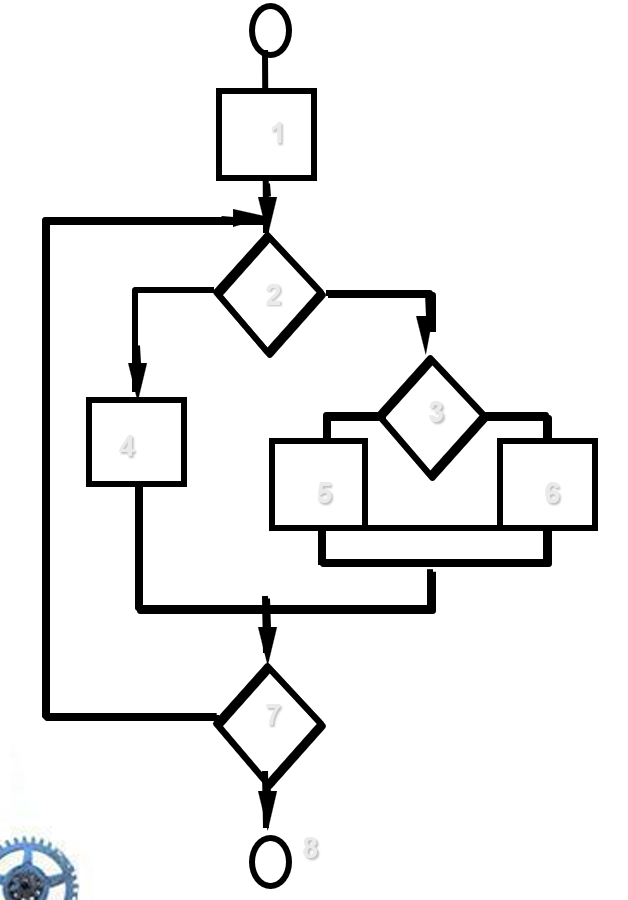

# Chapter 23 | Testing Conventional Applications

## 软件可测试性 (Testability)

这页说明了“软件好不好测试”取决于哪些特征。如果一个软件具备良好的可测试性，测试工作将事半功倍：

* **可操作性 (Operability)**：软件运行稳定，不会因频繁崩溃而中断测试。
* **可观测性 (Observability)**：测试结果（输入对应的输出）清晰可见。
* **可控性 (Controllability)**：能够自动化控制程序的输入和执行路径。
* **可分解性 (Decomposability)**：程序可模块化，测试能针对特定区域。
* **简洁性 (Simplicity)**：架构简单，逻辑不冗余。
* **稳定性 (Stability)**：测试期间程序改动较少，不会导致测试用例失效。
* **可理解性 (Understandability)**：设计文档完善，易于理解系统逻辑。

---

### 何为“好”的测试 (What is a "Good" Test?)

并不是执行所有测试就是好的，一个高效的测试应具备：

* **高发现率**：能大概率揪出潜在的错误。
* **非冗余**：测试用例应覆盖不同场景，避免做无用功。
* **“最优品种” (Best of breed)**：代表了最具代表性的测试场景。
* **适度复杂**：太简单测不出深层 Bug，太复杂则维护成本过高。

---

#### 内外部视角 (Internal and External Views)

* **外部视角（黑盒）**：只关注产品的“输入”和“输出”，验证功能是否符合设计规格。
* **内部视角（白盒）**：关注程序的“内部结构”，确保每一行逻辑、每一个判定条件都得到执行，就像查看“齿轮是否咬合”。

---

### 测试用例设计原则 (Test Case Design)

引用测试大师 Boris Beizer 的名言：**“Bug 潜伏在角落，汇聚在边界。”** (Bugs lurk in corners and congregate at boundaries...)

* **目标**：以最少的精力（Constraint）和时间，以最完备的方式（Complete manner）发现错误。

---

### 穷举测试的荒谬性 (Exhaustive Testing)

穷举所有可能的路径是**不可行**的：

* 仅仅是一个包含简单循环的程序，其潜在执行路径可能高达 $10^{14}$ 甚至更多。
* 如果每毫秒执行一个测试，穷举完该程序需要 **3,170 年**！这说明测试必须是**选择性（Selective）**的。

---

## 白盒测试 (White-Box Testing)

* **核心目标**：确保代码中的**所有语句 (statements) 和条件 (conditions) 至少被执行一次**。

---

### 基路径测试（Basis Path Testing）

#### 为什么要进行路径覆盖？

* **反向比例原则**：逻辑错误和错误的假设往往出现在那些执行概率较低（即不常走）的代码路径中。
* **人的直觉局限**：开发人员通常认为某些路径不可能被执行，但现实往往出人意料。
* **随机错误**：拼写错误或逻辑缺陷往往是随机发生的，如果未测试这些路径，它们很可能会潜伏在这些“冷门”代码中。

---

#### 基路径测试的核心：圈复杂度 (Cyclomatic Complexity)

这是量化程序逻辑复杂度的数学指标。

* **计算公式**：$V(G) = E - N + 2$（或者 $V(G) = P + 1$），其中 $E$ 是边数，$N$ 是节点数，$P$ 是判定节点数。
* **意义**：$V(G)$ 圈复杂度不仅定义了基路径集中的路径数量，还直接决定了该模块所需的最少测试用例数。研究表明，$V(G)$ 越高的模块，逻辑越复杂，出错概率也就越高。

---

#### 如何实施基路径测试？

1. **绘制流图**：根据设计或代码，画出对应的控制流图（Flow Graph）。
2. **计算复杂度**：确定圈复杂度 $V(G)$，这决定了你需要寻找的线性无关路径总数。
3. **确定基路径集**：找出所有线性独立的路径。
4. **设计测试用例**：编写测试用例，确保每一个路径都能被强制执行一次。

---

#### 操作要点与注意事项

* **无需流程图，但有图更佳**：虽然不强制要求画出精美的流程图，但图示能极大帮助你追踪程序的逻辑流向。
* **逻辑测试计数**：简单判定（如 `if`）计为 1，复合判定（如 `if A and B`）在圈复杂度计算中需视作多个逻辑判定点，通常会计为 2 或更多。
* **聚焦关键模块**：基路径测试开销较大，通常应优先应用在最核心、最复杂的逻辑模块上。

---

### 图矩阵 (Graph Matrices)

这是将程序逻辑形式化、从而便于计算的一种高级技巧：

* **定义**：图矩阵是一个方阵，其行列数等于流图中节点的总数。
* **条目含义**：矩阵中每个位置的数值代表从一个节点到另一个节点是否有一条**边（连接）**。
* **应用**：如果为边赋予权重（例如执行该边的测试用例次数或成本），图矩阵就成了评估程序控制结构的强大工具，特别是在处理极度复杂的程序时，它比肉眼观测流图更高效。

---

### 控制结构测试 (Control Structure Testing)

除了前面的基路径测试，这里补充了两个关键维度：

* **条件测试 (Condition testing)**：侧重于练习模块内的逻辑条件（例如 `if (a > 0 && b < 10)`），确保逻辑分支按预期执行。
* **数据流测试 (Data flow testing)**：这是基于**变量生命周期**的测试方法。它根据变量在程序中的“定义（Definition）”和“使用（Use）”位置来选择测试路径。
    * **DU 链 (Definition-use chain)**：它追踪一个变量在位置 $S$ 被赋值（定义）后，在位置 $S'$ 被读取（使用）的路径。这能有效发现诸如“变量未初始化即使用”或“赋值后从未被使用”等逻辑错误。

---

### 循环测试 (Loop Testing)

循环是程序中最容易出错、但也最复杂的结构之一。

* **简单循环 (Simple loop)**
* **嵌套循环 (Nested Loops)**
* **串联循环 (Concatenated Loops)**
* **非结构化循环 (Unstructured Loops)**

---

#### 测试策略：简单循环

对于一个允许最多循环 $n$ 次的循环，测试的“最小条件”应包括：

1. 完全跳过循环（0 次）。
2. 循环 1 次。
3. 循环 2 次。
4. 循环 $m$ 次（其中 $m < n$）。
5. 循环 $n-1, n, n+1$ 次（边界值测试，非常关键）。

---

#### 测试策略：进阶循环

* **嵌套循环**：应从最内层开始测试，固定外层为最小值，测试内层边界（min, min+1, typical, max-1, max）；然后向外层逐层推进。
* **串联循环**：如果循环间彼此独立，则分别按简单循环测试；如果它们有数据依赖（如 Loop 1 的计数器影响 Loop 2 的初始化），则应将其视为嵌套循环处理。

---

## 黑盒测试（Black-Box Testing）

作为测试工程师，在设计用例时，你需要思考：

* **功能有效性测试**：如何验证软件确实实现了它承诺的功能？
* **性能与行为**：除了功能，如何衡量系统在高负载下的行为？
* **用例分类**：什么样的输入类别（Input classes）能最有效地发现错误？
* **敏感性分析**：系统对哪些特定的输入值最“敏感”？（这通常引出对边界值分析的依赖）。
* **边界隔离**：如何精准隔离数据类别的边界（即找到那个“刚好”会导致系统报错的值）？
* **负载极限**：系统能容忍多大的数据速率和容量？
* **组合效应**：不同数据的特定组合是否会产生意外的副作用？

这些问题的本质在于：黑盒测试并非“盲测”，而是**通过对业务和输入数据的深刻理解，有针对性地探测系统弱点**。

---

### 基于图的方法 (Graph-Based Methods)

一种理解软件对象及其关系的数学化建模手段：

* **目的**：将软件看作一个由**对象（Objects）**构成的图。这里的“对象”定义非常宽泛，可以是数据对象、模块，也可以是面向对象中的类实例。

**图的元素**：

* **节点 (Nodes)**：代表对象。
* **链接 (Links)**：代表对象之间的关系（如 directed link 有向链接，undirected link 无向链接）。
* **权重 (Weights)**：可以表示连接的强度或频率，节点权重则可以表示对象的特性（如 value）。

* **意义**：通过这种图形化建模，测试人员可以清晰地梳理出软件的**状态转换**和**数据交互流向**。

---

### 等价类划分 (Equivalence Partitioning)

这是一种极其高效的减少测试用例数量的方法：

* **核心理念**：将输入数据划分为多个“等价类”，若测试类中的一个代表元素能发现 Bug，则该类中的其他元素大概率也能发现同类 Bug。

**划分准则**：

* **范围值**：定义 1 个有效区间，2 个无效区间（区间外）。
* **特定值**：定义 1 个有效点，2 个无效点。
* **集合成员**：定义 1 个集合内元素，1 个集合外元素。
* **布尔值**：定义 1 个 True，1 个 False。

---

#### 边界值分析 (Boundary Value Analysis)

Bug 通常“潜伏在边界上”，因此测试边界至关重要：

* **做法**：对输入范围的边界进行精细化测试，包括边界值本身、紧邻边界的上方值、下方值。
* **应用**：不仅适用于输入数据，同样适用于输出条件和内部数据结构（如数组容量边界）。

---

#### 比较测试 (Comparison Testing)

这是用于**绝对关键系统**（如航空、医疗）的极致策略：

* **方法**：多组独立的软件工程团队，基于同一规格说明书开发出多个独立版本的应用程序。
* **流程**：将同一测试数据输入所有版本，实时对比输出结果，确保高度一致性，任何偏差都意味着系统存在潜在的高风险错误。

---

#### 正交阵列测试 (Orthogonal Array Testing)

当输入参数较多但相互独立时使用：

* **方法**：利用统计学中的正交试验设计（DOE），用最少的测试组合覆盖尽可能多的参数相互作用。
* **对比**：相比于全组合（Full combination），它能显著减少测试用例数量，同时保证覆盖效果。

---

### 高级测试思想

#### 基于模型的测试 (Model-Based Testing)

* **核心**：利用软件的行为模型（状态机等）来生成测试用例。
* **流程**：遍历模型中的状态转换，触发对应的事件，观察输出是否符合预期。这能确保软件在复杂交互状态下行为的正确性。

---

#### 软件测试模式 (Software Testing Patterns)

* **核心**：借鉴设计模式的思路，沉淀通用的测试解决方案。
* **示例：场景测试 (ScenarioTesting)**：不再盯着单个函数测，而是从用户的角度出发，模拟一整套业务流程。如果场景测试失败，说明软件没有满足用户可见的需求。

---