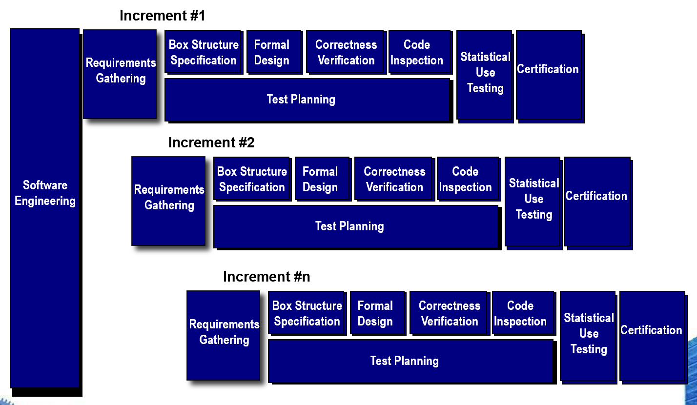
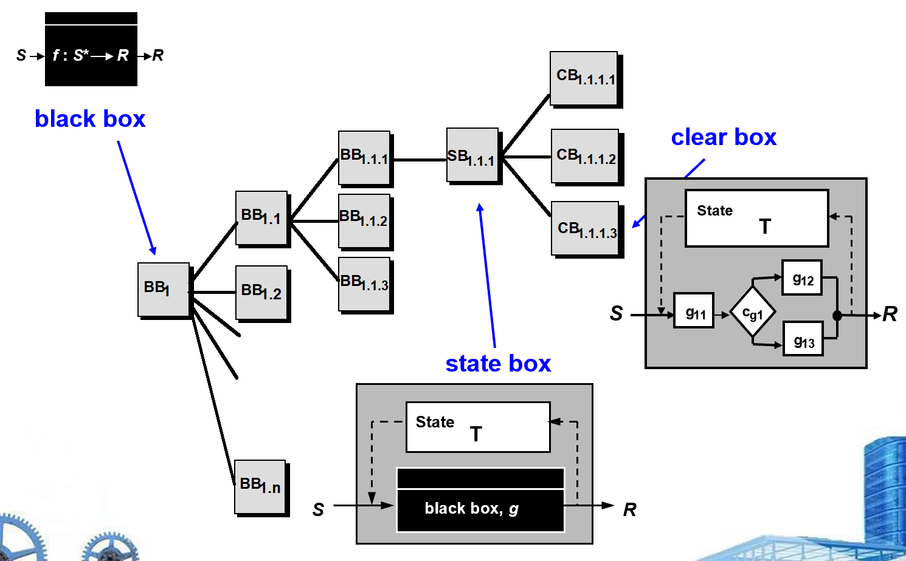

# Chapter 28 | Formal Modeling and Verification

## 洁净室软件工程与形式化方法

* **核心定义**：洁净室软件工程和形式化方法是两种严谨的软件开发策略。
* **关键特征**：
    * 它们都需要专门的**规格说明方法**（Specification Approach）。
    * 它们各自应用独特的**验证方法**（Verification Method）。
* **主要局限**：由于极其严谨，它们在广泛的软件工程社区中并未得到普及，主要用于开发需要极高可靠性的“防弹”（bullet-proof）软件，如航天、医疗或金融关键系统。

---

## 洁净室策略总览

* **图示说明**：这是一个流程图，展示了洁净室软件工程的增量式开发模型（Increment #1 到 Increment #n）。
* **主要步骤**：从“需求收集”（Requirements Gathering）开始，经过“盒结构规格说明”、“形式化设计”、“正确性验证”、“代码检查”、“统计使用测试”，最后到达“认证”（Certification）阶段，这是一个高度有序的流程。

---

## 洁净室策略的各阶段详解

* **增量规划**：采用增量式开发模式。
* **需求收集**：明确每个增量的客户级需求。
* **盒结构规格说明**：描述功能规格。
* **形式化设计**：将“黑盒”规格通过迭代细化为“状态盒”（State box）和“清晰盒”（Clear box）。
* **正确性验证**：从最高层的盒结构规格开始，通过一系列“正确性问题”进行验证。如果逻辑验证不足以证明正确性，则使用更正式的数学方法。
* **代码生成、检查与验证**：将规格转化为程序语言。
* **统计测试规划**：设计一系列模拟实际使用场景的测试案例（基于统计学中的概率分布）。
* **统计使用测试**：基于统计样本执行测试，以模拟目标用户群在所有可能程序执行情况下的使用行为。
* **认证**：当上述所有验证、检查和测试阶段完成，且所有错误都已修正后，该增量才被认证为可进行集成。

---

## 功能规格（盒结构）

* **核心内容**：展示了“黑盒”（Black Box）、“状态盒”（State Box）和“清晰盒”（Clear Box）的结构关系。
    * **黑盒 ($BB$)**：只关注输入 ($S$) 到输出 ($R$) 的映射关系，即 $f: S^* \rightarrow R$。
    * **状态盒 ($SB$)**：在黑盒的基础上加入了内部状态 ($T$)，将逻辑与状态存储分离。
    * **清晰盒 ($CB$)**：展示了内部实现细节，明确了状态转换逻辑和具体的控制流程（如 $g_{11}, g_{12}, g_{13}$ 等分支）。
* **逻辑递进**：这是一个从抽象功能（黑盒）逐步向具体实现逻辑（清晰盒）转化的过程，体现了自顶向下的设计思想。

---

## Cleanroom Design

### 设计细化（Design Refinement）

在洁净室设计中，设计不是一蹴而就的，而是一个通过数学逻辑不断细化的过程。幻灯片列出了三种核心逻辑结构的正确性验证条件：
* **顺序结构（Sequence $g$ and $h$）**：验证 $g$ 随后执行 $h$ 是否能实现预期的函数 $f$。
* **条件结构（Conditional if-then-else）**：验证当条件 $<c>$ 为真时 $g$ 能实现 $f$，为假时 $h$ 能实现 $f$。
* **循环结构（Loop）**：这是最复杂的，需验证：
    1.  循环是否一定终止（Termination）。
    2.  若条件为真，执行 $g$ 后再回到循环起始点是否能实现 $f$。
    3.  若条件为假，跳过循环是否依然满足 $f$。

---

### 设计验证（Design Verification）

洁净室方法通过数学手段替代了传统依赖后期的调试，其优势在于：

* **有限过程**：将验证简化为可控的步骤。
* **逐行验证**：确保每一行代码都经过逻辑校验。
* **近乎“零缺陷”**：由于在编码前已完成设计验证，显著降低了错误率。
* **更好的代码质量**：相比依赖单元测试（Unit Testing）去“发现”错误，洁净室在编写阶段就“预防”了错误。

---

## Cleanroom Testing

### Statistical Use Testing

这里的测试不是为了“找错”，而是为了“建立对可靠性的信任”。

**统计使用测试（Statistical Use Testing）**：

* **核心逻辑**：基于实际使用情况的概率分布来设计测试。
* **步骤**：定义刺激（Stimuli） -> 创建使用场景 -> 分配概率 -> 依据概率分布生成测试案例。

---

### 洁净室认证（Cleanroom Certification）

**认证（Certification）**：

* 这是一个量化过程：通过执行测试、记录失败数据，最后计算并认证软件的**可靠性（Reliability）**。

**三种模型**：

1. **采样模型（Sampling model）**：执行 $m$ 个随机测试，若无失败或失败率在可控范围内，则认证合格。
2. **组件模型（Component model）**：针对由多个组件组成的系统，评估单个组件在完成任务前失败的概率。
3. **认证模型（Certification model）**：最终将上述信息综合，对整个系统的可靠性进行预测和认证。

---

## Formal Methods

传统的软件需求规格说明通常使用自然语言，这往往导致以下难以克服的缺陷：

* **矛盾（Contradictions）**：需求描述前后不一致。
* **歧义（Ambiguities）**：同一条需求可能有多种解读。
* **模糊（Vagueness）**：描述不够精确。
* **不完整（Incompleteness）**：遗漏了某些边界条件或状态。
* **抽象级别混乱（Mixed levels of abstraction）**：将高层业务逻辑与底层实现细节混杂在一起。

形式化方法通过引入数学框架，确保了在开发和验证系统时具有高度的系统性。

---

### 形式化规格说明（Formal Specification）

为了克服自然语言的缺陷，形式化规格说明应具备以下特性：

* **一致性、完整性和无歧义性**。
* **核心手段**：使用数学化的“规格说明语言”。
* **逻辑基础**：利用**集合论（Set Theory）**和**逻辑记号（Logic Notation）**，使系统需求能够被精确地描述和解释。
* **证明一致性**：通过形式化的推理规则，从数学上证明初始需求与后续设计状态之间的一致性。

---

### Concepts

形式化方法通过定义系统的“状态”和“操作”来构建模型：

* **数据不变量（Data Invariant）**：指在系统运行的整个生命周期内，必须始终保持为真的条件（例如：账号余额不能为负）。
* **状态（State）**：系统在特定时间点所处的模式，代表了可观察的行为（例如：Z语言中定义的存储数据）。
* **操作（Operation）**：改变系统状态的动作，它分为两个关键约束：
    * **前置条件（Precondition）**：规定了在什么情况下可以执行此操作（即操作的有效范围）。
    * **后置条件（Postcondition）**：规定了操作执行完成后，系统状态会变成什么样（即操作的预期结果）。

---