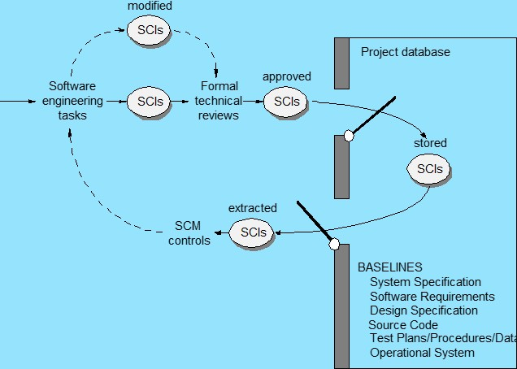
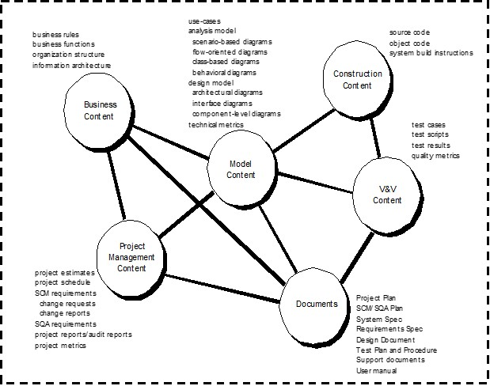
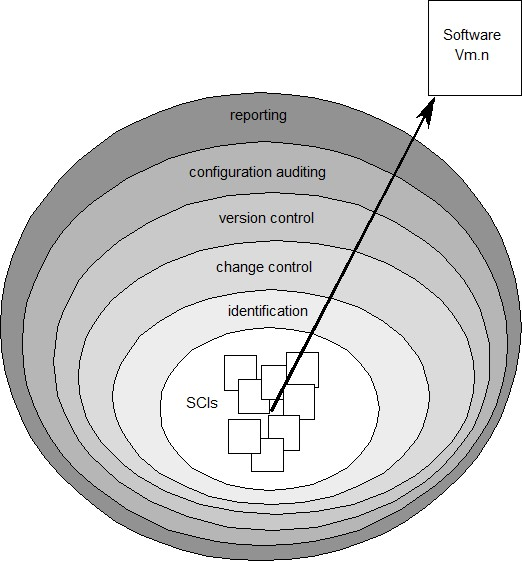
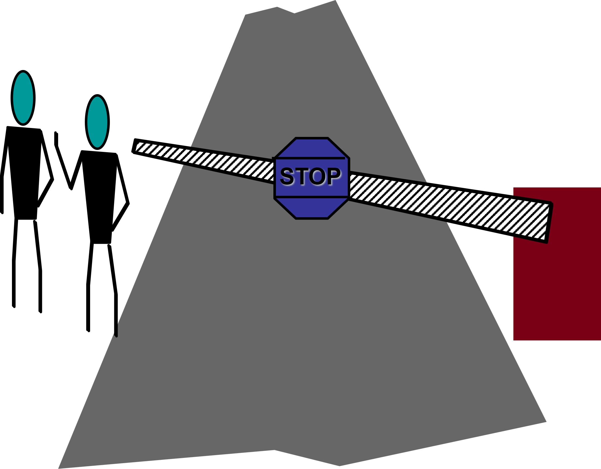

# Chapter 29 | Software Configuration Management

## 软件配置管理的“第一法则”

SCM 的根本出发点。

* **核心思想**：软件开发不是一个静态的过程。无论你处于系统生命周期的哪个阶段，**变更（Change）是不可避免的**，而且这种想要变更的愿望会贯穿整个生命周期。
* **总结**：正是因为这种“持续变更”的特性，软件配置管理（SCM）才显得至关重要，它旨在通过系统化的手段来控制和管理这些变更，防止项目失控。

---

### 软件项目中会产生哪些变更？

**变更的来源**：

* **业务需求变更**：客户的市场策略或业务模式调整。
* **技术需求变更**：硬件环境升级、依赖的库更新或性能要求提高。
* **用户需求变更**：用户在实际使用后发现功能不符合预期。

**受影响的对象**：这些变更并非只修改代码，它们会像涟漪一样影响到：

* **项目计划**（可能导致进度延误）。
* **测试用例**（需要重新验证）。
* **软件模型**（设计文档需要更新）。
* **代码**（核心开发部分）。
* **其他文档**（需求规格书等）。

---

### 什么是软件配置（Software Configuration）？

这一页明确了 SCM 需要管理的“实体”到底是什么。

* 软件配置不仅限于代码。它是一个包含三个核心组件的集合：
    * **Programs（程序）**：即可执行程序和源代码。
    * **Documents（文档）**：需求规格、设计文档、用户手册等。
    * **Data（数据）**：程序运行所依赖的数据结构、配置文件或数据库记录。
* **关键点**：这三者构成了软件的“配置项（Configuration Items, SCIs）”。对其中任何一个的改动，都必须通过 SCM 进行管理。

---

### 什么是基线（Baselines）？

这是 SCM 中最重要的概念之一，通过 IEEE 标准定义。

* **定义**：基线是一个“里程碑”。它指的是那些已经经过**正式评审（Formal Review）**并达成一致的产品或文档。
* **重要性**：基线一旦确立，它就成为进一步开发的基础。如果你想变更基线中的内容，**不能随意修改**，必须走“正式的变更控制流程（Formal Change Control Procedures）”。这保证了项目在稳定的基础上迭代。

---

#### 基线管理流程图

基线在开发过程中的生命周期：

1. **工程任务**：开发人员进行修改，产生 SCIs（软件配置项）。
2. **评审与批准**：这些项必须经过“正式技术评审”。只有评审通过（approved），才能进入项目数据库，成为新的基线。
3. **受控状态**：进入数据库后，基线处于“受控（Stored）”状态。
4. **提取（Extracted）**：如果后续需要进一步修改，SCM 会负责将受控项“提取”出来，重复上述循环。

* **结论**：这个流程图很好地解释了如何通过 SCM 建立一道防线，确保项目的质量和可追溯性。

---

### 软件配置对象（Software Configuration Objects）

不同配置对象之间的逻辑关系：

* **设计规格说明书（Design specification）**：它处于核心地位，包含数据设计、架构设计、模块设计和接口设计。它直接指导“数据模型”的建立。
* **组件（Component N）**：包含接口描述、算法描述和 PDL（程序设计语言），它是代码的基础。
* **测试规格说明书（Test specification）**：包括测试计划、测试过程和测试用例。它与设计规格和源代码之间都有关联。
* **总结**：这形成了一个复杂的相互依赖网络。SCM 的目的就是维护好这些对象之间的关系，确保当其中一个发生变化时，其他相关的对象也能得到相应的更新和同步，防止出现“版本撕裂”。

---

## SCM 仓库（Repository）

仓库是 SCM 的“大脑”和存储中心。

* **定义**：它是管理变更所需的机制和数据结构的集合。

**主要职能**：

* **数据完整性**：防止数据损坏或意外覆盖。
* **信息共享**：团队成员可以在同一平台上查看和协同工作。
* **工具集成**：将版本控制与开发工具（如编译器、IDE）集成。
* **数据集成**：确保不同配置项（文档、代码、模型）之间的逻辑连接。
* **方法论执行**：强制执行既定的开发流程（如必须经过评审）。
* **文档标准化**：确保团队产出的文档格式统一。

---

### 仓库内容（Repository Content）

仓库中存储的各类对象及其关系。

* **核心内容包括**：
    * **业务内容**：如业务规则、组织结构。
    * **模型内容**：如用例图、类图、架构图等。
    * **构造内容**：源代码、对象代码、构建指令。
    * **项目管理内容**：进度表、需求文档、变更报告。
    * **文档与 V&V（验证与确认）内容**：测试脚本、质量指标、用户手册。
* **关键洞察**：这些对象不是孤立的，它们通过复杂的网状结构连接在一起，体现了软件工程中“全盘联动”的特点。

---

### 仓库的五大核心特性

为了有效管理上述内容，仓库必须具备以下能力：

1. **版本控制（Versioning）**：记录配置项的演变历史，支持回退到之前的版本。
2. **依赖跟踪与变更管理**：明确 A 组件改动会影响 B 组件，实现全链路管理。
3. **需求跟踪（Requirements Tracing）**：确保每一行代码、每一个测试用例都能对应到原始的需求规格说明书。
4. **配置管理**：管理特定项目里程碑的配置快照（即“基线”）。
5. **审计追踪（Audit trails）**：这是“黑匣子”功能，记录谁在何时、因为什么原因修改了内容。

---

### SCM 的四个关键元素

SCM 的实施不仅是工具的问题，它是多种因素的结合：

* **组件元素**：底层的物理管理系统（如数据库/Git）。
* **过程元素**：定义的管理流程和任务（例如：变更提交需要谁审批？）。
* **构造元素**：自动化的构建工具，确保代码编译和集成的正确性。
* **人员元素**：使用工具和流程的团队成员。SCM 的成功离不开人的参与和流程的严格执行。

---

### SCM 过程的核心问题

SCM 过程实质上是回答一系列管理挑战：

* 如何标识配置项？如何管理成千上万的版本？如何控制发布前后的变更？谁拥有审批权？如何验证变更的正确性？如何向团队通报这些变更？

---

### SCM 过程视图（层级模型）

这是一个非常直观的层级图，展示了从底层到高层的 SCM 演进：

* **最底层（SCIs）**：所有软件配置项的基础素材。
* **识别（Identification）**：对每一个组件进行唯一标识。
* **变更控制（Change control）**：对识别后的项进行变更管控。
* **版本控制（Version control）**：管理不同时间点的状态。
* **配置审计（Configuration auditing）**：确保过程合法、合规。
* **报告（Reporting）**：将管理结果向各方汇报，最终形成特定版本的**软件发布（Software Vm.n）**。

---

### 版本控制 (Version Control)

这是 SCM 最基础的“底座”。

* **核心功能**：不仅仅是备份文件，它结合了特定的流程和工具，用来管理软件生命周期中产生的不同配置对象（如代码、文档）。
* **四大关键能力**：
    * **项目数据库 (Repository)**：存储所有配置项的“仓库”。
    * **版本管理**：保存每一份文件的历史版本，并能通过差异（diff）重建任何历史状态。
    * **构建工具 (Make facility)**：工程师可以根据需求，从数据库中自动提取相关的配置项，组合出特定版本的软件产品。
    * **问题追踪 (Issues/Bug Tracking)**：记录每个配置项相关的 Bug 或任务状态，确保所有变更都有据可查。

---

### 变更控制 (Change Control)

一个很形象的“闸门/路障”图，生动地说明了**变更控制的本质：设置守门人**。不能让任何变更随意进入系统，必须通过评审，确保风险可控。

变更控制流程分为三个阶段：

**阶段 I：识别与决策**

1. 识别到变更需求。
2. 用户提交请求。
3. 开发人员评估影响。
4. 生成变更报告。
5. **变更控制权威机构 (CCA)** 决定：通过（进入排队）或拒绝（通知用户）。

**阶段 II：实施与基线化**

1. 指派人员处理指定的配置项 (SCIs)。
2. **检出 (Check-out)** 配置项，进行修改。
3. 完成修改后，进行**内部评审/审计**。
4. 确立新的“基线”，为后续测试做准备。

**阶段 III：验证与发布**

1. 执行软件质量保证 (SQA) 和正式测试。
2. **检入 (Check-in)** 修改后的配置项。
3. 将这些项“升级 (Promote)”至待发布版本中。
4. 重新编译/构建版本。
5. 最后进行审计，确认无误后，将所有变更正式整合进新版本中。

---

### 审计与状态统计 (Auditing & Status Accounting)

这是为了确保“变更”这件事本身是透明的。

**审计 (Auditing)**：重点在于验证：通过 SCM 审计，确保“变更请求”是否按照“SQA 计划”被正确执行。它像是一种合规性检查，核实配置项 (SCIs) 是否符合标准。

**状态统计与报告 (Status Accounting & Reporting)**：

* **状态统计**：不仅管理 SCIs 本身，还要管理与之相关的“变更请求”、“变更报告”以及“工程变更单 (ECOs)”。
* **报告**：将这些复杂的变更状态整理成清晰的报告，告知相关利益方（如管理层、客户、测试团队）当前项目的变更进展和状态。

---

## SCM for Web and Mobile  Engineering

### Web 与移动应用开发的挑战

* **内容多样性**：Web/App 不仅仅是代码，还包含大量的文本、图形、音频/视频、脚本、表单等。如何将这些异构的内容组织成合理的“配置对象”是核心挑战。
* **人员参与度**：由于 Web/App 开发常带有“临时性（ad hoc）”，参与者众多且来源复杂，使得版本控制更加困难。
* **可扩展性与政治性**：
    * 随项目规模扩大，微小的变更可能产生连锁反应，因此**配置控制的严谨度必须与应用规模成正比**。
    * “谁拥有应用？”“谁负责内容准确性？”等“政治”问题往往比技术问题更难协调。

---

### 内容管理系统 (CMS)

为了应对上述挑战，通常引入 **CMS（内容管理系统）**：

* **收集子系统 (Collection)**：负责采集并转换内容，将其包装成标记语言（如 HTML/XML）以便在客户端呈现。
* **管理子系统 (Management)**：这是 SCM 的核心，包含：
    * **内容数据库**：存储所有配置对象的结构化数据库。
    * **数据库能力**：支持高效的搜索、存取和文件结构管理。
    * **配置管理功能**：即标识、版本控制、变更管理、审计等。
* **发布子系统 (Publishing)**：这是最后的一环，利用**模板 (Templates)** 将配置对象转换为可传输的形式。模板通常包含：
    * **静态元素**：无需处理直接传输（如图片、文字）。
    * **发布服务**：根据规则个性化内容、转换数据、构建导航链接。
    * **外部服务**：连接企业后端数据或基础设施。

---

### Web/移动应用中的变更管理流程

针对 Web/App 的特殊性，变更管理采取了分类处理的流程：

* **变更分类 (Classify)**：根据变更影响的大小，分为不同的类（Class 1-4）。
    * 影响小的变更可能快速通过，影响大的变更则需要更严格的评估和全员/利益相关方评审。
* **变更实施步骤 (Execution)**：
    1. **Check-out**：从仓库中检出需要修改的配置对象。
    2. **Make Changes**：执行设计、开发与测试。
    3. **Check-in**：将修改后的对象存回仓库，形成新的版本。
    4. **Publish**：将最终结果发布到线上的 WebApp。

---