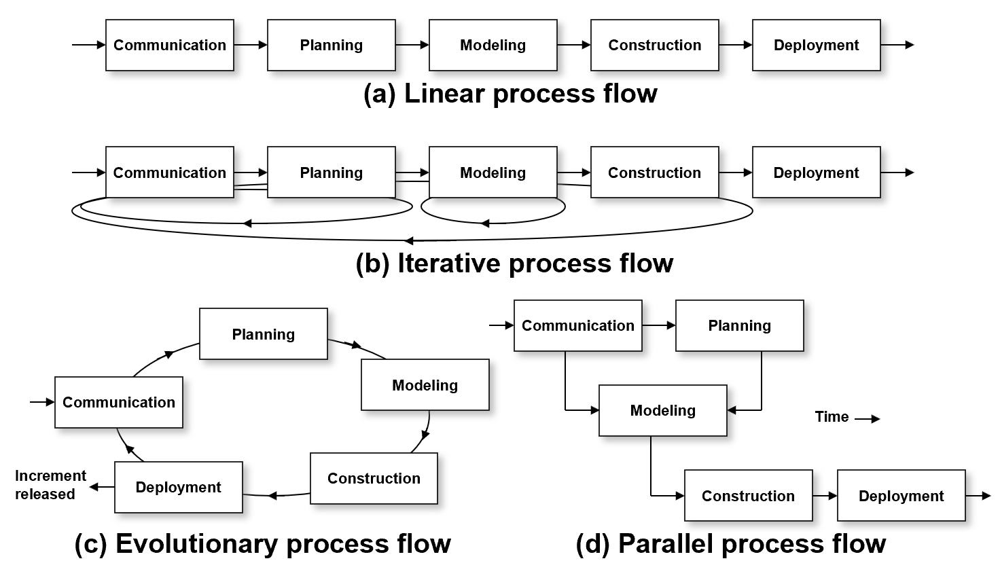
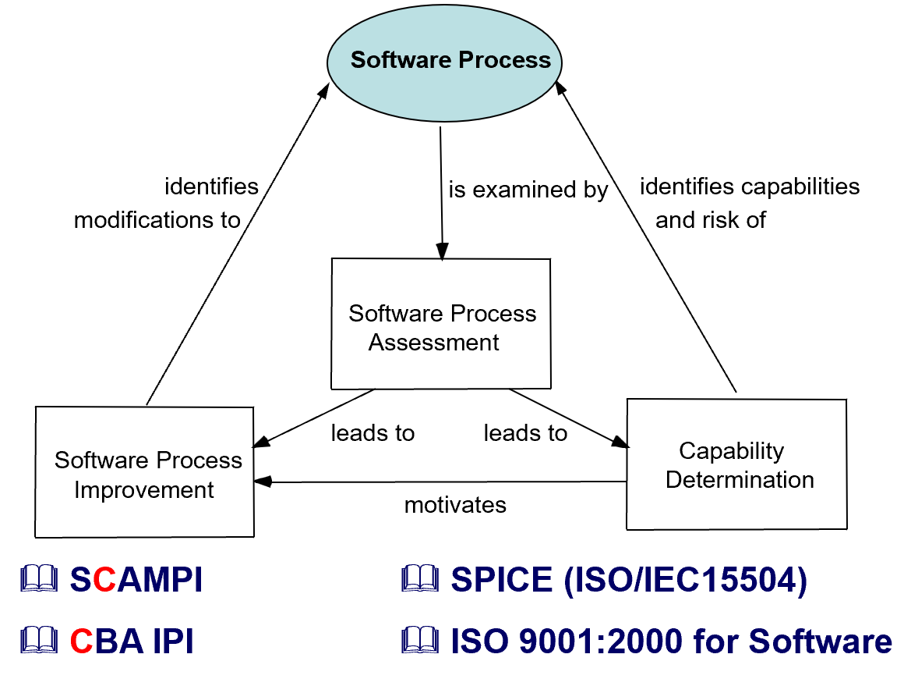

# Chapter 3 | Software Process Structure

## A Generic Process Model

软件过程的组织方式有多种，常见的有以下四种流程：

1. **线性流程（Linear process flow）**：各阶段（沟通、计划、建模、构建、部署）顺序进行，前一阶段完成后再进入下一阶段，适合需求明确、变更较少的项目。
2. **迭代流程（Iterative process flow）**：每完成一轮流程后，可以根据反馈回到前面阶段进行改进，适合需求可能变化、需要多次完善的项目。
3. **进化流程（Evolutionary process flow）**：各阶段循环进行，每次迭代都能交付部分可用产品，逐步完善，适合探索性开发和需求不明确的项目。
4. **并行流程（Parallel process flow）**：多个阶段可以并行推进，提高开发效率，适合大型复杂项目。

---

## Process Patterns

过程模式（Process patterns）定义了一组活动、动作、任务、工作产品及相关行为的结构化描述。

1. **模板（template）**：用于规范地定义一个过程模式。
2. **通用软件过程模式要素（Generic software pattern elements）：**

- 有意义的模式名称（pattern name）
- 意图（intent）：该模式的目标
- 类型（type）：
    - 任务模式（task pattern）：定义工程动作或任务
    - 阶段模式（stage pattern）：定义过程的框架活动
    - 阶段流程模式（phase pattern）：定义过程活动的顺序或流程
- 初始上下文（initial context）：使用该模式前需满足的条件
- 解决方案（solution）：如何正确实施该模式
- 结果上下文（resulting context）：成功实施后应达到的状态
- 相关模式（related patterns）：与本模式直接相关的其他模式
- 已知用例/示例（known uses/examples）：该模式适用的实例

---

## Process Assessment

软件过程评估是对组织的软件开发过程进行系统化检查和评价，了解当前开发能力，发现需要改进的地方。

- **Software Process Assessment**：对现有过程进行分析，识别能力和风险。
- **Capability Determination**：确定过程的成熟度和能力水平。
- **Software Process Improvement**：根据评估结果，提出并实施改进措施。

三者之间相互促进，评估推动改进，改进又提升能力。

相关标准和方法：

- **SCAMPI**、**CBA IPI**：常用的软件过程评估方法。
- **SPICE (ISO/IEC15504)**、**ISO 9001:2000 for Software**：国际通用的软件过程能力评估标准。

---

## The Capability Maturity Model Integration (CMMI)

能力成熟度模型集成（CMMI）是由卡内基梅隆大学软件工程研究所（SEI）提出的，用于评估和改进软件过程能力的模型。

CMMI的五个成熟度等级：

1. **Level 0: Incomplete**
    
- 过程未执行或未达到目标。

2. **Level 1: Performed**

- 必要的工作任务被执行，产生所需工作产品。

3. **Level 2: Managed**

- 工作有资源保障，相关方积极参与，任务和产品被监控、评审和评估。

4. **Level 3: Defined**

- 管理和工程过程被文档化、标准化，并集成到全组织范围内。

5. **Level 4: Quantitatively Managed**

- 过程和产品被量化管理和控制。

6. **Level 5: Optimizing**

- 持续改进，基于量化反馈推动创新和优化。

---