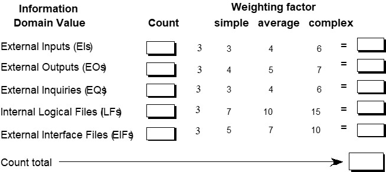

# Chapter 30 | Project Metrics

---

## 度量、指标与指示器 (Measures, Metrics and Indicators)

这一页定义了三个核心概念，理解它们的层级关系非常重要：

* **度量 (Measure)：** 提供关于某种属性的“定量”数据（例如：一个文件的代码行数、修复一个 Bug 所需的时间）。它纯粹是客观事实。
* **指标 (Metric)：** 这是一个基于 IEEE 的定义，指的是衡量系统、组件或过程是否具备某种属性的“程度”（例如：每千行代码的平均缺陷率）。它用于评估。
* **指示器 (Indicator)：** 这是最高层级，通常是单个指标或多个指标的组合。它不仅仅是数字，而是为了给项目经理或开发人员提供“洞察”，帮助他们做出关于项目进程、质量或过程改进的决策。

---

### 测量原则 (Measurement Principles)

测量不是随意的，必须遵循科学的方法：

* **目标先行：** 在收集任何数据之前，必须先明确“为什么测量”（即确定目标）。
* **定义明确：** 指标必须定义得“无歧义”，确保不同人在同一标准下理解。
* **基于理论：** 不能拍脑袋决定测量什么，测量方法必须有理论支撑（例如：度量设计质量应基于设计原则）。
* **因地制宜：** 并没有“放之四海而皆准”的指标，必须根据特定的产品和过程进行定制（引用了 Basili 等人的研究成果）。

---

### 测量过程 (Measurement Process)

软件度量的全生命周期是一个闭环系统：

1.  **Formulation (制订)：** 确定针对特定软件需要测什么。
2.  **Collection (收集)：** 使用工具或方法获取原始数据。
3.  **Analysis (分析)：** 对原始数据应用数学模型进行计算。
4.  **Interpretation (解释)：** 将计算结果转化为对产品质量的洞察（意义）。
5.  **Feedback (反馈)：** 将解释结果反馈给团队，指导下一步的改进。

---

### 度量属性 (Metrics Attributes)

一个“好的”软件度量指标应该具备以下特质：

* **简单且可计算：** 不能为了度量而拖慢开发进度，计算应高效。
* **经验上直观：** 指标应符合工程师的直觉，而不是晦涩难懂。
* **一致且客观：** 结果应是明确的，不会因人而异。
* **单位和维度一致：** 计算公式要合乎逻辑，避免出现“苹果加橙子”这种荒谬的单位组合。
* **独立于编程语言：** 度量应关注模型和架构本身，而非具体语言实现。
* **有效的质量反馈：** 指标最终要能促进产品质量的提升。

---

### 收集与分析原则 (Collection and Analysis Principles)

* **自动化：** 尽可能通过工具自动收集数据，减少人工干扰和负担。
* **统计验证：** 使用有效的统计方法建立“内部产品属性”（如代码复杂度）与“外部质量特性”（如可靠性、易维护性）之间的相关性。
* **解释性指导：** 必须给每一个指标设立解释标准，让团队知道数值处于什么范围是正常的。

---

### 需求模型度量 (Metrics for the Requirements Model)

针对需求阶段的度量方法：

* **基于功能的度量：** 使用“功能点”作为标准化尺度，评估需求规模。
* **规范度量：** 通过分类统计需求的数量，来间接评估需求分析的质量。

---

### 基于功能的度量 (Function-Based Metrics)

这是衡量软件规模的经典方法（由 Albrecht 提出）：

* **核心思想：** 软件的规模不仅取决于代码行数，更取决于其交付的“功能”。
* **信息域 (Information Domain)：** 它是通过计算软件系统与外界的交互来确定规模的，主要包括：
    * **EI (外部输入)：** 用户输入的数据。
    * **EO (外部输出)：** 系统产生的报表或消息。
    * **EQ (外部查询)：** 用户触发的交互查询。
    * **ILF (内部逻辑文件)：** 系统内部维护的数据文件。
    * **EIF (外部接口文件)：** 系统引用的外部数据存储。

---

### 功能点计算表 (Function Points)

这页展示了计算功能点的实际操作表：

* 每一类“信息域值”都有相应的权重（分为简单、平均、复杂三个等级）。
* **计算公式：** 你需要填写每一项的“Count”（计数），乘以对应的“Weighting factor”（权重），最后汇总得到“Count total”，这就是衡量软件系统功能规模的“功能点”总值。

---

## 架构设计度量 (Architectural Design Metrics)

在软件的架构阶段，我们关注系统的组织结构与复杂度：

* **结构复杂度 (Structural Complexity)：** 通常是“扇出 (Fan-out)”的函数（即一个模块调用的直接下级模块数量）。
* **数据复杂度 (Data Complexity)：** 涉及输入/输出变量以及扇出的综合考量。
* **系统复杂度 (System Complexity)：** 是结构复杂度和数据复杂度的综合指标。
* **HK 指标：** 引入了“扇入 (Fan-in，调用该模块的上级模块数量)”和“扇出”的概念，衡量架构的整体复杂性。
* **形态度量 (Morphology Metrics)：** 关注模块的数量及其相互之间的连接（接口）情况。

---

### 面向对象设计度量 (Metrics for OO Design)

Whitmire 提出的 9 个面向对象（OO）度量特性：

* **规模 (Size)：** 从人口（类数量）、体积、长度和功能性四个维度衡量。
* **复杂度 (Complexity)：** 衡量类与类之间错综复杂的交互关系。
* **耦合 (Coupling)：** 测量不同类或组件之间物理连接的紧密程度。
* **充分性 (Sufficiency)：** 衡量一个抽象（类或组件）是否“够用”，即它是否包含了当前应用场景下所需的所有必要特性，不多也不少。
* **完整性 (Completeness)：** 衡量该抽象的可复用性程度，即它是否足够完备，可以在其他场景中直接使用。
* **内聚 (Cohesion)：** 衡量一个类内的所有操作（方法）是否紧密围绕单一目标工作（即“高内聚”）。
* **原始性 (Primitiveness)：** 衡量类或操作的原子性，是否简单且不可再分。
* **相似性 (Similarity)：** 衡量不同类在结构、行为或目的上的重合度，相似性高意味着可能存在冗余。
* **波动性 (Volatility)：** 度量一个类或组件发生变更的可能性大小。

---

### Chidambaram & Kemerer 的类导向度量 (Class-Oriented Metrics)

这套经典的度量指标（CK 指标）是面向对象开发中衡量类设计质量的金标准：

* **类加权方法 (WMC)：** 每个类中方法的复杂度加权总和。
* **继承树深度 (DIT)：** 衡量类在继承体系中的位置，深度过大意味着设计可能过于复杂。
* **子类数量 (NOC)：** 衡量继承体系的广度。
* **对象类间的耦合 (CBO)：** 两个类之间访问彼此方法或变量的次数。
* **类响应 (RFC)：** 一个类被调用时可能触发的操作集合。
* **方法内聚缺失 (LCOM)：** 衡量类内方法之间共享属性的程度，LCOM 越高，说明类设计越“松散”。

---

### Lorenz & Kidd 的类导向度量 (Class-Oriented Metrics)

由 Lorenz 和 Kidd 提出的补充指标：

* **类规模 (Class Size)：** 直接统计属性和操作的总数。
* **子类重写操作数：** 衡量继承中方法重写（Override）的频率。
* **子类新增操作数：** 衡量继承中新增功能的程度。
* **专业化指数 (Specialization Index)：** 衡量继承层次的专业化程度。

---

### MOOD 度量套件 (MOOD Metrics Suite)

MOOD（面向对象设计指标）专注于衡量 OO 机制的实际应用：

* **方法继承因子 (MIF)：** 类继承了多少父类的方法。
* **耦合因子 (CF)：** 系统中类之间耦合的比例。
* **多态因子 (PF)：** 系统中实现多态的程度，即不同类对同一消息做出不同响应的比例。

---

### 操作导向度量 (Operation-Oriented Metrics)

针对类中具体“方法/操作”的细粒度度量：

* **平均操作规模：** 衡量单个方法的代码行数或复杂度。
* **操作复杂度：** 评估实现逻辑的难易程度。
* **平均参数数量：** 参数过多往往暗示接口设计不佳或职责过重。

---

### 组件级设计度量 (Component-Level Design Metrics)

软件组件内部的质量评估：

* **内聚度量 (Cohesion Metrics)：** 评估组件内部功能的相关性。如果一个组件只负责一件事（定义明确），其内聚性就高。
* **耦合度量 (Coupling Metrics)：** 衡量组件之间、或组件与系统全局数据之间的依赖程度。依赖越少，耦合越低，系统越易于修改。
* **复杂度度量 (Complexity Metrics)：** 提到如“环复杂度 (Cyclomatic Complexity)”这类度量，用于评估控制流的复杂程度。

---

### 接口设计度量 (Interface Design Metrics)

针对用户界面 (UI) 的设计质量进行量化：

* **布局适宜性 (Layout Appropriateness)：** 这不是纯粹的主观审美，而是基于计算的：
    * **布局实体：** 页面上的元素（按钮、文本框等）。
    * **地理位置：** 元素的相对位置。
    * **转换成本：** 用户为了完成任务，在不同元素间交互（点击、移动焦点）所需的“成本”或难度。

---

### Web 和移动应用的度量 (Design Metrics for Web and Mobile Apps)

针对 Web 和移动端开发的特殊需求，提出的评估维度：

* **可用性 (Usability)：** 界面是否好用？
* **美学 (Aesthetics)：** 设计风格是否符合应用场景并讨喜？
* **内容效率 (Content Efficiency)：** 用最少的努力获取最多的信息。
* **导航效率 (Navigation Efficiency)：** 操作路径是否直观、直接。
* **架构与功能：** 系统结构和导航流是否支撑用户高效完成目标。
* **过程复杂度与性能：** 组件设计是否降低了内部复杂度，从而提升正确性、可靠性和响应性能。

---

### 代码度量 (Code Metrics)

* **Halstead 软件科学：** 这是一个比较经典的度量理论，它通过统计源代码中“操作符 (Operators)”和“操作数 (Operands)”的数量与出现频率，来估算程序的难度、工作量和规模。
* *注意：* 虽然该理论在学术界曾引起争议（被认为理论基础存在缺陷），但在特定语言的实验中依然表现出一定的参考价值。

---

### 测试度量 (Metrics for Testing)

这一页说明了如何利用设计阶段的度量来预测和评估测试的难易程度：

* 测试工作量可以通过 Halstead 测量推导。
* Binder 提出的指标能够直接影响软件的“可测试性”：
    * **LCOM/DIT/NOC：** 前面提到的类结构指标，它们越复杂，测试难度通常越大。
    * **PAP/PAD：** 衡量数据成员的可见性（Public/Protected/Private），封装越好，受外界干扰越少，测试越稳。

---

### 维护度量 (Maintenance Metrics)

软件维护的度量，这是衡量系统稳定性的关键：

* **软件成熟度指数 (SMI)：** IEEE 标准定义的一个公式，用于量化产品在不同版本间的稳定性。
    * 公式：$$SMI = \frac{M_T - (F_a + F_c + F_d)}{M_T}$$
    * $M_T$：当前版本总模块数。
    * $F_c$：变更的模块数。
    * $F_a$：新增的模块数。
    * $F_d$：删除的模块数。
* **解读：** 当 SMI 的值趋近于 1 时，意味着该产品在经历多次发布后，代码趋于稳定，维护难度降低。

---