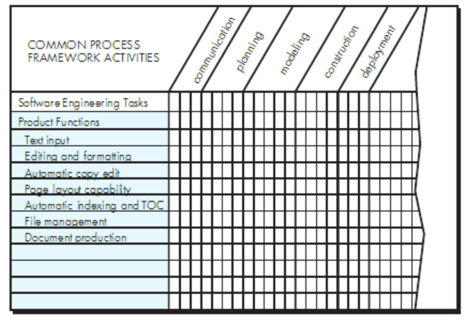

# Chapter 31 | Project Management Concepts

## The Four P's

在软件项目管理中，成功项目的核心要素被归纳为“四个P”，即People（人员）、Product（产品）、Process（过程）、Project（项目）。

1. People（人员）

人员是项目成功最重要的因素。包括项目经理、开发人员、测试人员、用户、利益相关者等。人员的能力、经验、沟通与协作能力、责任心和积极性直接影响项目的进展和质量。优秀的团队成员能够有效解决问题、推动项目进展，而团队管理和激励机制则有助于提升团队凝聚力和工作效率。

2. Product（产品）

产品指的是项目要交付的软件系统或服务。明确产品的需求、功能、性能和质量标准，是项目成功的基础。需求分析阶段要与用户充分沟通，确保开发目标清晰、可衡量。产品的复杂度、创新性和技术难度也会影响项目的风险和管理策略。

3. Process（过程）

过程是指完成项目所采用的一系列框架活动和软件工程任务。包括需求分析、设计、编码、测试、部署、维护等环节。科学合理的开发过程有助于规范团队工作、降低风险、提升效率和质量。常见的软件开发过程模型有瀑布模型、敏捷开发、螺旋模型等。选择合适的过程模型要结合项目特点和团队实际情况。

4. Project（项目）

项目是实现产品目标所需的全部工作。包括项目计划、进度安排、资源分配、风险管理、成本控制、质量保证等。项目管理的核心在于协调各项资源，确保项目按时、按质、按预算完成。良好的项目管理能够应对变化、解决冲突、推动团队协作，实现项目目标。

---

## Stakeholders（利益相关者）

在软件项目管理中，利益相关者（Stakeholders）是指对项目的需求、开发、实施和结果有直接或间接影响的所有个人或组织。理解和管理好各类利益相关者，是项目成功的关键。主要利益相关者包括：

1. 高级管理者（Senior managers）

高级管理者负责定义与项目相关的业务目标和战略方向，通常对项目有重大影响。他们决定项目的优先级、资源分配和政策支持，是项目顺利推进的重要保障。

2. 项目（技术）经理（Project (technical) managers）

项目经理或技术经理负责项目的计划、组织、激励和控制。他们需要协调团队成员，制定项目计划，分配任务，监控进度，解决问题，确保项目目标的实现。

3. 实施者（Practitioners）

实施者是指直接参与软件开发、测试、维护等工作的技术人员。他们具备必要的技术能力，负责将需求转化为实际的软件产品或应用。

4. 客户（Customers）

客户负责提出软件的需求和期望，是软件的最终买家或委托方。客户的需求决定了软件的功能和性能标准。除此之外，还有一些外围利益相关者，他们对项目结果有一定的关注或影响。

5. 最终用户（End-users）

最终用户是指在软件发布后实际使用软件的人。他们的反馈对于软件的改进和后续维护至关重要。最终用户的满意度直接影响软件的市场表现和项目的长期价值。

---

## Team Leader（团队领导）与MOI模型详解

在软件项目管理中，团队领导（Team Leader）是团队成功的关键人物。一个优秀的团队领导不仅要具备技术能力，更要具备管理和激励团队的能力。MOI模型是评价和指导团队领导力的重要理论工具。

---

### MOI模型简介

MOI模型由Motivation（激励）、Organization（组织）、Ideas or Innovation（创意或创新）三部分组成，强调团队领导在以下三个方面的能力：

1. **Motivation（激励）**

团队领导需要具备激励团队成员的能力。通过“推”或“拉”的方式，激发技术人员的积极性和创造力，使其发挥最大潜能。激励方式可以包括目标设定、认可奖励、职业发展支持等。

2. **Organization（组织）**

团队领导要能够整合和优化现有流程，或根据项目需要创新流程，使最初的想法能够顺利转化为最终产品。这包括合理分工、流程规范、资源协调、进度管理等。

3. **Ideas or Innovation（创意或创新）**

 团队领导应鼓励团队成员在既定约束下保持创造力和创新精神。即使在有限的资源和严格的规范下，也要激发团队成员提出新想法、优化方案，推动产品或项目不断进步。

---

## Organizational Paradigms（组织范式）详解

在软件工程团队管理中，组织范式（Organizational Paradigms）指的是团队结构和协作方式的典型模式。不同的组织范式适用于不同类型的项目和团队文化。常见的四种组织范式如下：

1. Closed Paradigm（封闭式范式）

封闭式范式强调传统的权威层级结构。团队成员按照明确的上下级关系分工，决策权集中在管理者手中，沟通路径清晰，适合任务明确、流程规范的大型项目。优点是管理有序、责任明确，但创新性和灵活性较弱。

2. Random Paradigm（随机式范式）

随机式范式结构松散，依赖团队成员的个人主动性和自我驱动。每个人可以根据兴趣和专长选择任务，适合创新性强、探索性高的项目。优点是激发创造力和灵活性，但可能导致协调困难和目标分散。

3. Open Paradigm（开放式范式）

开放式范式试图在封闭式和随机式之间取得平衡。既保留一定的管理和流程控制，又鼓励团队成员创新和自主。适合需要既有规范又需创新的项目。优点是既能保证项目有序推进，又能激发团队活力。

4. Synchronous Paradigm（同步式范式）

同步式范式依赖于对问题的自然分解，将团队成员分组，各自负责问题的不同部分。组间沟通较少，强调各自独立完成任务。适合可以模块化分工的项目。优点是效率高、易于并行推进，但沟通不足可能导致集成困难。

---

## Software Teams（软件团队）——团队结构选择的影响因素

在组建和管理软件项目团队时，选择合适的团队结构对于项目的成功至关重要。以下因素需要重点考虑：

1. **问题的难度（the difficulty of the problem）**

问题越复杂，越需要经验丰富、分工明确的团队结构，便于协作攻关和技术攻坚。

2. **结果程序的规模（the size of the resultant program(s)）**

规模越大，团队成员数量和分工就越多，管理难度也随之增加。通常用代码行数或功能点数衡量。

3. **团队存续时间（the time that the team will stay together）**

团队生命周期长短影响团队的稳定性和成员间的默契程度。短期项目适合灵活小团队，长期项目则需注重团队建设和知识积累。

4. **问题的可模块化程度（the degree to which the problem can be modularized）**

问题越容易模块化，越适合采用分工明确的小组协作模式。模块化程度低则需更多沟通和整体协作。

5. **系统所需的质量与可靠性（the required quality and reliability of the system）**

对质量和可靠性要求高的项目，需要更严格的流程控制和质量保障措施，团队结构也需更规范。

6. **交付日期的刚性（the rigidity of the delivery date）**

交付时间越紧迫，团队需要更高效的协作和进度管理，可能采用并行开发、加班等方式保证进度。

7. **所需的社交性/沟通程度（the degree of sociability (communication) required）**

项目对沟通的需求越高，团队结构应更扁平、沟通渠道更畅通，便于信息共享和快速响应。

---

## 避免团队“毒性”（Avoid Team "Toxicity"）

在软件项目管理中，团队“毒性”指的是团队氛围和协作方式出现严重问题，导致效率低下、士气低落甚至项目失败。常见的团队毒性表现及其危害如下：

1. **目标混乱、氛围紧张（A frenzied work atmosphere）**

团队成员在混乱、紧张的氛围中工作，精力被无效消耗，难以聚焦于项目目标，导致效率低下和士气下降。

2. **高度沮丧（High frustration）**

团队成员因个人、业务或技术等多方面原因产生强烈挫败感，团队内部摩擦加剧，协作受阻，影响项目进展。

3. **管理不善、协同困难（Fragmented or poorly coordinated procedures）**

流程碎片化或协调不力，或选用了不合适的开发过程模型，导致团队成员各自为战，难以高效协作，项目推进受阻。

4. **分工不明、相互指责（Unclear definition of roles）**

团队成员职责不清，缺乏问责机制，出现问题时互相推诿，影响团队凝聚力和执行力。

5. **连续失败、信心缺失（Continuous and repeated exposure to failure）**

团队在项目中屡遭失败，成员信心受挫，士气低落，进一步加剧负面循环。

---

## Agile Teams（敏捷团队）

敏捷团队是现代软件开发中广泛采用的一种团队组织和协作方式，强调自组织、快速响应变化和高效沟通。其主要特征和管理要点如下：

1. **团队成员之间必须相互信任（Team members must have trust in one another）**

团队成员之间建立高度互信，是敏捷团队高效协作的基础。信任有助于信息共享、坦诚沟通和共同承担责任。

2. **技能分布需与问题匹配（The distribution of skills must be appropriate to the problem）**

团队成员的技能结构要能覆盖项目需求，实现合理分工和互补，提升团队整体战斗力。

3. **去除“刺头”成员（Mavericks may have to be excluded）**

如果某些个性过于突出、难以协作的成员影响团队凝聚力，必要时应将其调离，以维护团队整体和谐与高效。

4. **团队自组织（Team is “self-organizing”）**

敏捷团队强调自我管理和自我驱动，团队成员共同决定工作方式和分工，灵活应对变化。

5. **自适应团队结构（An adaptive team structure）**

团队结构可根据项目阶段和需求动态调整，适应不同任务和挑战。

6. **融合多种组织范式（Uses elements of Constantine’s random, open, and synchronous paradigms）**

敏捷团队灵活借鉴随机式、开放式和同步式等多种组织模式的优点，既有创新性又有协作性。

7. **高度自主（Significant autonomy）**

团队拥有较大的自主权，可以自主决策、快速响应客户和市场需求。

---

## Team Coordination & Communication（团队协调与沟通）

高效的团队协调与沟通是软件项目成功的关键。根据正式性和沟通方式的不同，团队沟通主要包括以下几类：

1. **正式、非人际方式（Formal, impersonal approaches）**

通过软件工程文档和工作成果（如源代码、技术备忘录、里程碑计划、进度表、变更请求、错误跟踪报告、项目控制工具等）进行沟通。这类方式强调标准化、可追溯和信息共享，适合项目管理和质量控制。

2. **正式、人际程序（Formal, interpersonal procedures）**

侧重于质量保证活动，如评审会议、设计和代码检查等。通过面对面的正式会议，确保工作成果符合标准，及时发现和纠正问题。

3. **非正式、人际程序（Informal, interpersonal procedures）**

包括小组会议、需求和开发人员的协同办公、日常交流等。适合信息快速传递、问题讨论和团队氛围建设。

4. **电子沟通（Electronic communication）**

利用电子邮件、公告板、视频会议等电子手段进行沟通，突破时空限制，提升沟通效率，适合分布式团队和远程协作。

5. **人际网络（Interpersonal networking）**

指团队成员之间及与项目外部专家的非正式交流。通过经验分享和资源互助，帮助团队解决难题、提升能力。

---

## The Product Scope（产品范围）

产品范围（Product Scope）是指软件项目要实现的全部功能、性能、数据和约束的集合，是项目需求分析和后续开发的基础。明确产品范围有助于防止需求蔓延、保障项目目标的实现。主要内容包括：

1. **上下文（Context）**

明确软件如何融入更大的系统、产品或业务环境中，以及由此带来的约束条件。例如，软件是否需要与其他系统集成、遵循特定的业务流程等。

2. **信息目标（Information objectives）**

明确软件需要处理和输出哪些对客户可见的数据对象，以及需要哪些输入数据。这有助于界定数据流、数据库设计和用户界面需求。

3. **功能与性能（Function and performance）**

说明软件需要实现的主要功能，以及对性能的特殊要求。例如，输入数据如何被处理成输出，是否有实时性、吞吐量等性能指标。

4. **可靠性、接口、安全性（Reliability, Interface, Security）**

规定软件在可靠性、系统接口和安全性方面的要求，如系统可用性、与外部系统的数据交换、安全防护措施等。

5. **范围的明确性（Scope clarity）**

软件项目的范围必须在管理层和技术层面上都清晰、无歧义，便于所有相关人员理解和执行。

---

## Problem Decomposition（问题分解）

问题分解（Problem Decomposition），又称为分区（partitioning）或问题细化（problem elaboration），是将复杂问题逐步拆解为更小、更易管理的子问题或功能模块的过程。其核心思想是“化整为零”，便于理解、设计、开发和维护。

---

### 问题分解的步骤

1. **范围确定后，进行分解**

一旦产品范围明确，就可以开始分解：

- 按功能分解：将系统拆解为若干核心功能，每个功能再细化为更小的子功能。
- 按用户可见数据对象分解：以用户操作和数据流为线索，划分系统的主要数据对象及其处理流程。
- 按问题类别分解：将系统划分为不同类型的问题类（如业务逻辑、数据管理、接口处理等）。

2. **持续分解，直到所有功能或问题类都被明确定义**

分解是一个递归过程，直到每个子问题都足够简单，可以独立实现和测试。

---

### 问题分解的意义

- 降低系统复杂度，使开发和维护更高效。
- 有助于团队分工协作，提高开发进度和质量。
- 便于发现和管理风险，提升系统的可扩展性和可重用性。

---

## The Process（过程）

在软件工程中，过程（Process）是指为实现项目目标而制定的一系列有序活动和管理方法。建立合适的过程框架，有助于规范开发流程、提升项目质量和效率。主要内容包括：

1. **建立过程框架（Once a process framework has been established）**

首先需要为项目选择或制定合适的过程模型（如瀑布、敏捷、螺旋等），为后续工作提供结构化指导。

2. **考虑项目特性（Consider project characteristics）**

根据项目的规模、复杂度、风险、团队经验等因素，调整过程的细节和管理方式。

3. **确定所需的严格程度（Determine the degree of rigor required）**

不同项目对过程的规范性和文档化要求不同。高风险或高可靠性项目需更严格的过程控制，快速迭代项目则可适当简化流程。

4. **为每项软件工程活动定义任务集（Define a task set for each software engineering activity）**

每项活动（如需求分析、设计、编码、测试等）都应明确：

- 具体的软件工程任务（Software engineering tasks）
- 产出物（Work products），如文档、代码、测试报告等
- 质量保证点（Quality assurance points），如评审、测试、验收等
- 里程碑（Milestones），用于跟踪进度和阶段性目标

---

### “Melding the Problem and the Process” 

本图展示了“将问题与过程融合”的思想，即如何将软件工程任务（如产品功能、文本输入、编辑与格式化、自动校对、页面布局、自动索引与目录、文件管理、文档生成等）映射到软件开发的各个过程活动（如沟通、计划、建模、构建、部署）中。

1. **横向**：代表软件工程的通用过程活动，包括：

- communication（沟通）
- planning（计划）
- modeling（建模）
- construction（构建/实现）
- deployment（部署）

2. **纵向**：代表具体的软件工程任务或产品功能。

---

#### 主要含义：

1. 每一项软件工程任务都需要在不同的过程活动中得到关注和落实。例如，“文本输入”不仅需要在建模和构建阶段考虑，也要在沟通和计划阶段明确需求。
2. 过程活动与任务之间是多对多的关系：一个任务可能贯穿多个过程活动，一个过程活动也会涉及多个任务。
3. 通过这种映射，团队可以系统性地梳理每项功能在开发流程中的具体落点，确保无遗漏、无断层。

---

#### 实践意义：

- 有助于项目经理和团队成员理解“做什么”（任务）和“怎么做”（过程）之间的关系。
- 便于分工协作、进度跟踪和质量控制。
- 促进软件开发活动的系统化和规范化，提升项目成功率。

---

## The Project（项目）——项目常见风险与失败原因详解

在软件项目管理中，项目失败或陷入困境的原因多种多样。以下是常见的风险点及其简要分析：

1. **开发人员不了解客户需求**

沟通不畅或需求调研不充分，导致开发目标与客户实际需求偏离。

2. **产品范围定义不清**

需求文档模糊、边界不明，容易引发需求蔓延和返工。

3. **变更管理不善**

需求或设计变更频繁且缺乏有效控制，导致项目混乱、进度失控。

4. **技术选型频繁变动**

项目中途更换技术方案，增加开发难度和风险。

5. **业务需求变化或定义不明确**

客户业务环境变化快，或需求本身不清晰，导致项目目标不断调整。

6. **截止日期不切实际**

项目计划过于乐观，未充分评估工作量和风险，导致延期和加班。

7. **用户抵触**

用户对新系统不接受或配合度低，影响系统推广和上线。

8. **缺乏高层支持或赞助**

项目缺乏管理层资源和政策支持，遇到阻力时难以推进。

9. **团队技能不足**

团队成员缺乏必要的技术或管理能力，难以胜任项目任务。

10. **管理者和开发者忽视最佳实践和经验教训**

不重视总结和复盘，重复犯错，项目质量和效率难以提升。

---

## Common-Sense Approach to Projects（项目管理的常识性方法）

在软件项目管理中，遵循常识性原则有助于提升项目成功率。主要建议如下：

1. **良好开端（Start on the right foot）**

项目伊始要投入大量精力深入理解待解决的问题，明确目标和期望，设定切实可行的计划。

2. **保持动力（Maintain momentum）**

项目经理应激励团队，尽量减少人员流动，团队要在每项任务中注重质量，高层管理者应给予充分信任和支持，避免干扰团队正常工作。

3. **跟踪进度（Track progress）**

通过工作成果（如模型、源代码、测试用例等）来跟踪项目进展，采用正式的技术评审确保质量。

4. **明智决策（Make smart decisions）**

项目经理和团队应坚持“保持简单”（keep it simple）的原则，避免不必要的复杂性，做出高效、可执行的决策。

5. **事后分析（Conduct a postmortem analysis）**

建立规范的复盘机制，总结每个项目的经验教训，为后续项目持续改进提供依据。

---

## To Get to the Essence of a Project（把握项目本质的关键问题）

Barry Boehm提出，要真正把握一个软件项目的本质，需围绕以下七个核心问题进行深入思考和明确：

1. **Why is the system being developed?（为什么要开发这个系统？）**

明确项目的动因和目标，理解其对业务或用户的实际价值。

2. **What will be done?（要做什么？）**

明确项目的主要任务、交付物和预期成果。

3. **When will it be accomplished?（何时完成？）**

制定合理的进度计划，明确各阶段的时间节点和里程碑。

4. **Who is responsible?（谁负责？）**

明确项目中各项任务的负责人，落实责任制，便于管理和协调。

5. **Where are they organizationally located?（他们在组织中的位置？）**

理清团队成员或相关方在组织结构中的归属，便于资源调配和沟通。

6. **How will the job be done technically and managerially?（技术和管理上如何完成？）**

明确采用的技术路线、开发方法和管理流程，确保项目有序推进。

7. **How much of each resource will be needed?（需要多少资源？）**

评估并规划所需的人力、软件、工具、数据库等各类资源，保障项目顺利实施。

---

## Critical Practices（项目管理的关键实践）详解

在软件项目管理中，以下关键实践对于提升项目成功率和产品质量至关重要：

1. **正式的风险管理（Formal risk management）**

系统识别、评估和应对项目中的各种风险，制定应急预案，动态跟踪风险变化，降低项目失败概率。

2. **基于经验的成本与进度估算（Empirical cost and schedule estimation）**

结合历史数据和实际情况，科学估算项目所需成本和工期，提升计划的准确性和可执行性。

3. **基于度量的项目管理（Metrics-based project management）**

通过关键指标（如进度、缺陷、生产率等）量化项目状态，辅助决策和过程改进。

4. **挣值管理（Earned value tracking）**

采用挣值分析方法，综合考察项目进度、成本和绩效，实现对项目健康状况的动态监控。

5. **缺陷跟踪与质量目标（Defect tracking against quality targets）**

持续跟踪和分析缺陷，确保产品质量达到预定目标，及时采取纠正措施。

6. **以人为本的项目管理（People aware project management）**

关注团队成员的能力、激励、沟通和成长，营造积极的团队氛围，提升团队凝聚力和执行力。

---