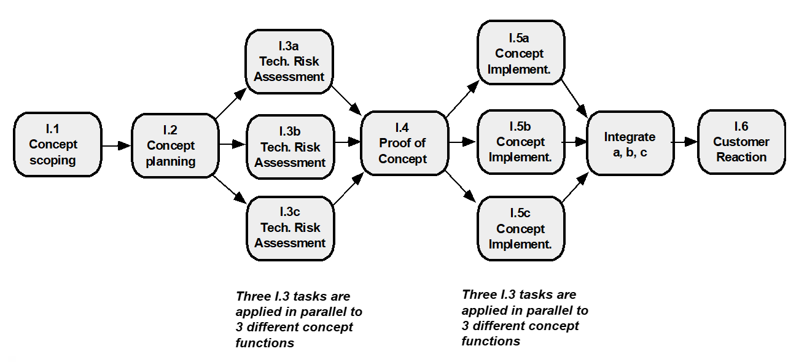
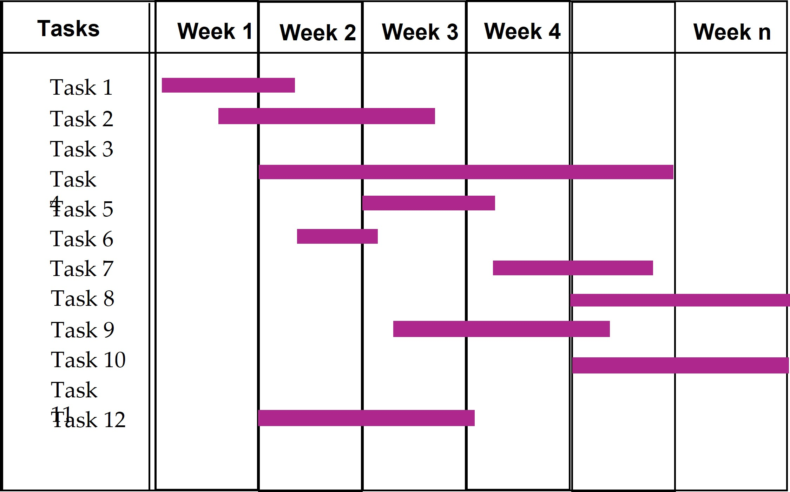
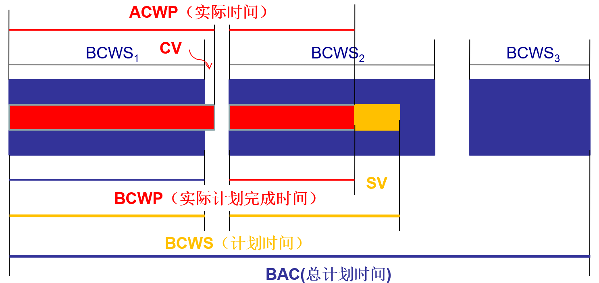

# Chapter 34 | Project Scheduling

## 为什么项目会延期？

导致项目无法按时完成的常见原因：

* **非开发团队制定的不切实际的截止日期**：外部压力导致的时间规划不合理。
* **需求变更**：客户的需求不断变化，且未在进度计划中及时体现。
* **估算不准确**：对项目所需的人力、物力、财力估算不足。
* **未预见的风险**：项目中途出现的突发事件或技术挑战。
* **技术与人为困难**：出现难以预料的技术瓶颈或人员变动。
* **沟通障碍**：团队内部协作信息传递不畅。
* **管理缺失**：项目管理者未能及时发现进度落后，或未能采取纠正措施。

---

## 调度原则 (Scheduling Principles)

为了避免上述问题，课件提出了六大调度原则：

* **划分任务（Compartmentalization）**：将复杂项目分解为清晰的、独立的任务。
* **确定相互依赖（Interdependency）**：明确各任务之间的先后顺序与依赖关系。
* **验证工作量（Effort Validation）**：确保所需的资源和人手是可获得的。
* **明确责任（Defined Responsibilities）**：每个任务必须指派到具体的负责人。
* **明确结果（Defined Outcomes）**：每个任务必须有明确的可交付产出。
* **明确里程碑（Defined Milestones）**：设定关键节点，以便进行质量和进度审查。

---

### 工作量与交付时间 (Effort and Delivery Time)

著名的“不可能区域”理论：

* **核心逻辑**：软件开发的成本（工作量）与时间并非简单的线性关系。
* **曲线分析**：随着开发时间缩短，所需的工作量会呈指数级上升。当时间压缩到一定极限（$T_{min} = 0.75 \times T_d$）时，进入“不可能区域”（Impossible region），即无论投入多少资源，项目都无法在该时间内完成。
* **参数含义**：$E_a$ 是实际工作量，$t_d$ 是名义交付时间，$t_o$ 是成本最优的开发时间。

---

### 工作量分配 (Effort Allocation)

典型的软件开发项目时间/资源分配比例：

* **前端活动 (40-50%)**：包括客户沟通、需求分析、设计、评审和修改。这是最耗时的阶段，因为决定了项目的方向。
* **建设活动 (15-20%)**：即实际的编码和代码生成。
* **测试与安装 (30-40%)**：包括单元测试、集成测试、白盒/黑盒测试以及回归测试。这部分比例很高，体现了质量保证的重要性。

---

### 定义任务集 (Defining Task Sets)

如何根据具体项目定义工作内容：

* **确定项目类型**。
* **评估所需的严谨程度**（依据风险大小和行业规范）。
* **识别适配标准**（即如何根据具体情况调整流程）。
* **选择合适的软件工程任务**。

---

### 任务集细化 (Task Set Refinement)

以“概念范围界定（Concept Scoping）”为例，展示如何将抽象的宏观任务细化为具体、可操作的底层任务（例如 1.1.1 到 1.1.8 的步骤）。这种细化能够让团队明确每个环节的具体交付物（如需要进行技术评审 FTR 的点）。

---

### 定义任务网络 (Define a Task Network)

任务的逻辑结构图：

* 通过流程图展示了从概念界定（1.1）到规划（1.2），再到并行任务（1.3a, 1.3b, 1.3c），最终汇聚到集成（Integrate）和客户反馈（1.6）的过程。
* **重点**：通过并行处理技术任务（1.3 系列），可以有效利用团队资源，提升效率。

---

### 时间线图 (Timeline Charts)

展示了一个简单的甘特图（Gantt Chart）雏形：

* 将任务横向分布在时间轴（周）上，清晰地标识了每个任务的起止时间及重叠情况（并行执行）。

---

### 利用自动化工具导出时间线图

* 展示了一个使用自动化软件生成的、非常详细的甘特图。
* 不仅列出了具体的任务描述（如“研究文本编辑组件”、“技术可行性评估”），还清晰标记了关键的“里程碑（Milestone）”，例如“产品声明已定义”、“范围文档已完成”等。这在实际的工程管理中是非常标准且必要的工具应用。

---

## 进度跟踪 (Schedule Tracking)

这是项目管理中确保进度不落后的关键动作，包括：

* **定期会议**：团队同步进度和发现问题。
* **评审评估**：分析整个工程过程中的审查结果。
* **里程碑核对**：检查关键节点（如甘特图上的菱形标记）是否按计划达成。
* **对比起止日期**：对比实际开始日期与计划日期，发现偏差。
* **非正式沟通**：通过非正式访谈了解团队对项目前景的主观判断。
* **量化分析**：使用“挣值分析”进行定量评估。

---

### 面向对象项目的进度

以面向对象（OO）开发为例，定义了两个主要的技术里程碑：

* **OO 分析完成**：包括类定义、类层次结构、属性与操作、类关系、行为模型及可重用类的确认。
* **OO 设计完成**：包括子系统划分、类到子系统的分配、任务分配、职责与协作、属性与操作设计以及通信模型创建。

定义了实现和测试阶段的里程碑：

* **OO 编程完成**：确保所有新类已编码、复用库中的类已集成、原型或增量构建已完成。
* **OO 测试**：包括分析设计模型评审、责任-协作网络开发、类级测试（单元测试）、簇测试（集成测试）以及最终的系统级测试。

---

## 挣值分析 (Earned Value Analysis, EVA)

引入了挣值分析的概念：

* **核心价值**：一种量化项目完成度的方法，避免凭“感觉”判断。
* **准确性**：早在项目启动 15% 时，就能提供可靠的性能读数。

---

### 挣值分析 (图形详解)

这一页是本部分的难点，通过图形展示了核心指标：

* **BCWS（计划时间/计划价值）**：项目计划要完成的工作的预算。
* **BCWP（实际计划完成时间/挣值）**：实际已经完成的工作对应的价值。
* **ACWP（实际时间/实际成本）**：实际花费的努力。
* **关键指标**：
    * **SPI（进度偏差指数）**：$SPI = BCWP / BCWS$。若等于 1，说明进度正常。
    * **SV（进度偏差）**：$SV = BCWP - BCWS$。
    * **CPI（成本偏差指数）**：$CPI = BCWP / ACWP$。若等于 1，说明成本控制良好。
    * **CV（成本偏差）**：$CV = BCWP - ACWP$。

---

### 计算挣值

详细解释了指标的计算基础：

* **BCWS**：每一项任务的计划投入工作量。
* **BAC（总完工预算）**：所有任务工作量的总和，$BAC = \sum (BCWS_k)$。
* **BCWP（挣值）**：计算点实际完成的工作的价值。
* **区别**：BCWS 是计划要做的，BCWP 是实际做出来的。
* **进度指标**：通过 SPI 和 SV 来衡量项目是否按照预期速度推进。
* **完成进度百分比**：
    * 计划完成百分比 = $BCWS / BAC$
    * 实际完成百分比 = $BCWP / BAC$
* **ACWP**：表示任务实际消耗的努力。
* **成本评估**：通过 CPI 和 CV 来衡量项目目前的开销效率（即投入是否带来了预期的进度产出）。

---