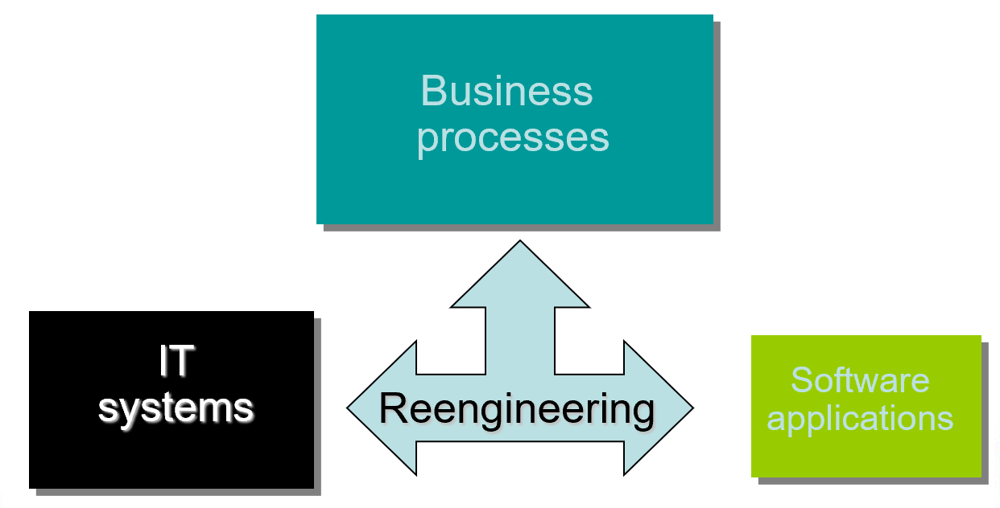
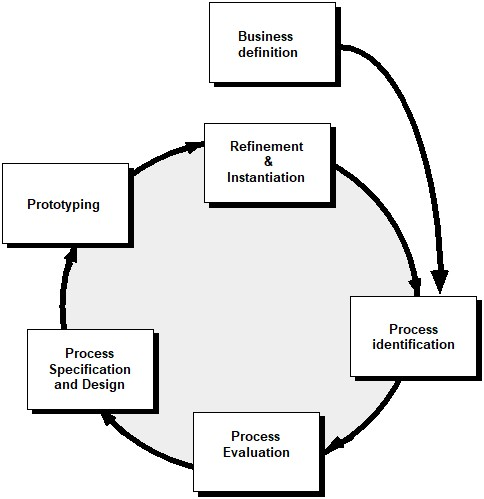
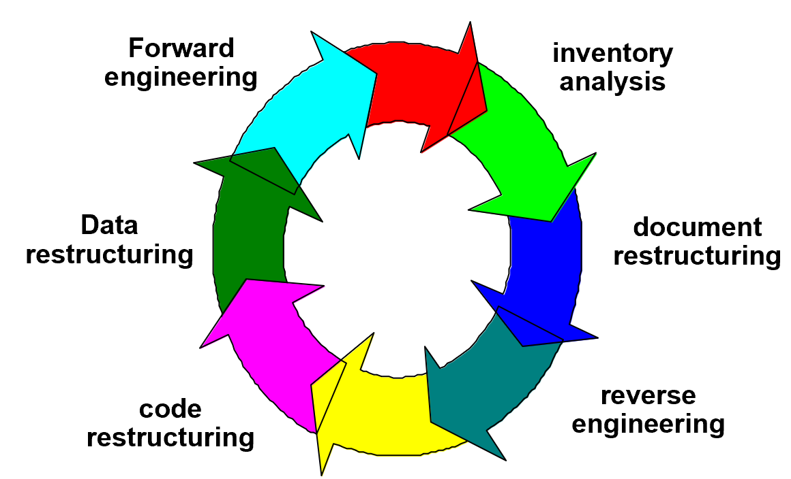

# Chapter 36 | Maintenance and Reengineering

## 软件维护的定义 (Software Maintenance)

为什么“软件维护”在软件发布后是必然且持续的过程：

* **发布后的演变：** 软件一经发布，并非万事大吉，而是进入了维护阶段。
* **三种主要触发场景：**
    1.  **修复 Bug：** 发布后几天内，用户反馈 bug，需要修复。
    2.  **适应新环境：** 发布后几周内，部分用户需要修改软件以适应其特定的工作环境（环境适配）。
    3.  **功能增强：** 发布后几个月内，其他组织可能意识到该软件能带来意外价值，从而提出新的需求，需要通过“增强（enhancements）”来满足。
* **结论：** 以上所有为了保持软件可用性而进行的修改工作，统称为“软件维护”。

---

### 可维护软件的特征 (Maintainable Software)

如何通过设计和开发习惯，让软件在未来更容易被维护：

* **模块化：** 软件应具备“有效的模块化（effective modularity）”，这使得修改一个模块时不会产生难以预料的连锁反应。
* **设计模式：** 利用成熟的设计模式，降低系统的复杂度，让新接手的维护人员更容易理解代码逻辑。
* **编码规范：** 遵循良好定义的代码标准和规范，使源码具有“自文档化（self-documenting）”的特性，即使没有额外文档也能读懂。
* **质量保证：** 在发布前进行严格的测试，提前发现潜在问题。
* **维护者视角：** 软件工程师在编写代码时应预见到自己可能不会永远负责该项目，因此设计时需考虑到“辅助”未来的维护者，降低他们的上手门槛。

---

## 软件支持能力 (Software Supportability)

这一页将视角从“代码本身”转向“整个生命周期的配套支持”：

* **定义：** 软件支持能力是指在软件整个生命周期内提供保障的能力。这不仅仅是修复代码，还包括人员、基础设施、额外资源、设施等一切维持软件正常运行所需的投入。
* **设施支持：** 软件本身应当内置辅助功能，当系统在运行环境发生故障时，能够帮助支持人员快速定位问题。
* **故障记录库（数据库）：** 需要建立一个包含已出现过的所有缺陷的记录库。这对于分析缺陷的成因（cause）和修复方案（cure）至关重要，能有效提高后续维护效率。

---

### 再工程 (Reengineering)

* **概念图示：** 图中显示“再工程（Reengineering）”位于**业务流程（Business processes）**、**IT系统（IT systems）**和**软件应用（Software applications）**之间。
* **深度解读：**
    * 简单的维护通常是在已有基础上进行修补（Fixing），而“再工程”往往涉及对已有系统进行深度的重构、重设计或现代化改造。
    * 它的核心目的是使旧的系统能够更好地支撑现代化的业务流程。
    * 它不仅关注软件代码本身，还关注 IT 架构和业务模式之间的适配关系，目的是提升企业的整体效能，而不仅仅是修复 Bug。

---

## 业务流程再工程 (BPR, Business Process Reengineering)

如何优化企业的业务运作：

* **BPR 的核心步骤：**
    * **定义目标：** 基于成本、时间、质量和人员四个维度设定业务目标。
    * **识别与评价：** 找出对目标至关重要的流程，并对现有流程进行分析、测量。
    * **设计与建模：** 基于分析结果，为新流程准备“用例（use-cases）”。
    * **原型与实例化：** 先制作原型进行测试，根据反馈精炼后，最终将其正式部署到业务系统中。
* **循环机制：** 这是一个持续的闭环过程，强调流程需要不断地定义、识别、评价、设计、原型化和再优化，以适应不断变化的业务需求。

---

### 软件再工程 (Software Reengineering)

当现有的遗留系统（Legacy Systems）已经无法满足需求时，如何对其进行现代化改造：

* **软件再工程的循环活动：**这是一个周期性的活动，包括：库存分析、文档重构、逆向工程、代码重构、数据重构，最后是前向工程。
* **库存分析 (Inventory Analysis)：**
    * 不是所有系统都值得重构。我们需要先建立一个包含所有应用系统的清单（数据库）。
    * 通过评估其“使用年限”、“变动次数”、“最后修改日期”等指标，来**优先级排序**，筛选出最需要再工程的系统。

---

### 文档重构 (Document Restructuring)

遗留系统最头疼的问题之一就是“缺乏文档”。

1.  **维持现状：** 如果系统运行稳定且不需要修改，无需浪费时间重写文档。
2.  **“按需重构” (Document when touched)：** 只有在系统某个模块被修改时，才更新该部分的文档。这是一种资源优化策略。
3.  **全面重构：** 针对关键业务系统，确实需要全面更新文档，但即便如此，也应只记录“最精华、最必要”的最小化文档，避免过度文档化。

---

### 逆向工程 (Reverse Engineering)

这是将现有代码转化为更高级别抽象形式的过程，旨在理解复杂系统：

* **流程路径：**
    1.  **重构代码 (Restructure code)：** 将“脏”的源程序清理干净，变为可理解的“清晰代码”。
    2.  **提取抽象 (Extract abstractions)：** 从代码中提取逻辑，将其归纳为“处理逻辑 (processing)”、“接口 (interface)”和“数据库 (database)”三个维度。
    3.  **精炼与简化 (Refine & simplify)：** 将提取出的复杂信息简化为“初始规格说明”，并最终优化为“最终规格说明”。
* **作用：** 逆向工程并不改变软件的功能，其主要目的是为了让工程师能够“看懂”复杂的遗留代码，为后续的重构或维护打下基础。

---

## 数据重构 (Data Restructuring)

这一部分强调了数据架构对系统的重要影响：

* **与代码重构的区别：** 数据重构不是低层级的代码修补，而是系统级的“再工程”活动。
* **过程：** 通常从逆向工程开始，剖析当前的数据模型，标识数据对象和属性。
* **核心动因：** 当原始数据结构过于脆弱（例如使用扁平文件导致处理逻辑极度复杂）时，需要将其重构为更现代的模型（如关系型数据库），这能显著简化后续的程序处理逻辑。
* **影响：** 由于数据架构是程序的基石，重构数据往往会带动程序架构或代码层面的大调整。

---

### 前向工程 (Forward Engineering)

前向工程是指基于重构后的成果，进行系统开发。

* **效率提升：** 维护旧代码的成本通常是开发新代码的 20 到 40 倍。通过现代化架构重构，可以显著降低维护成本。
* **事半功倍：** * 现有的原型（原系统）为开发提供了蓝图，能提高开发效率。
    * 用户对已有软件的深刻理解，使得明确新需求变得更加容易。
* **自动化与完整性：** 利用 CASE 工具可自动化部分重构工作，最终完成一套完整的配置（文档、程序和数据）。

---

## 再工程经济学 (Economics of Reengineering)

### 模型参数定义：

Sneed 提出的模型包含 9 个关键变量（$P_1$ 到 $P_9$）和系统期望寿命（$L$）：

* **$P_1, P_2$：** 现有的年维护成本和运行成本。
* **$P_3$：** 系统的年业务价值。
* **$P_4, P_5$：** 重构后预期的年维护和运行成本（通常更低）。
* **$P_6$：** 重构后的预期年业务价值（通常更高）。
* **$P_7, P_8$：** 重构所需的投入成本和耗时。
* **$P_9$：** 再工程的风险系数（$1.0$ 为标准值）。
* **$L$：** 系统的预计使用寿命。

---

### 成本效益计算：

* **维持现状成本 ($C_{maint}$):** $$C_{maint} = [P_3 - (P_1 + P_2)] \times L$$
  代表若不重构，在系统剩余寿命内，业务价值减去维护与运营成本的净收益。
* **再工程成本 ($C_{reeng}$):** $$C_{reeng} = [P_6 - (P_4 + P_5) \times (L - P_8) - (P_7 \times P_9)]$$
  代表重构后，在剩余寿命内的净收益减去重构所需的人力、时间成本及风险成本。
* **最终判断:**

$$\text{cost benefit} = C_{reeng} - C_{maint}$$

若该值为正，则说明进行再工程在经济上是可行的。

---