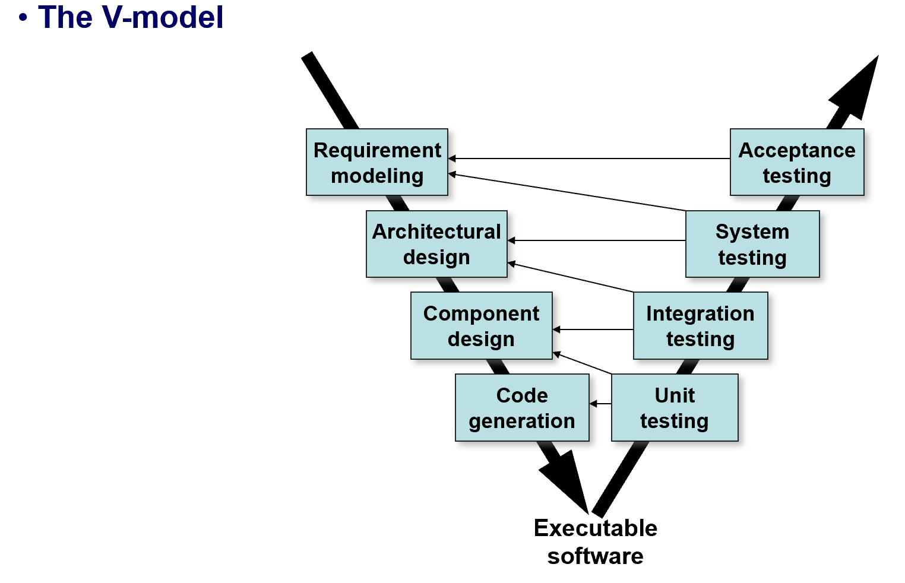
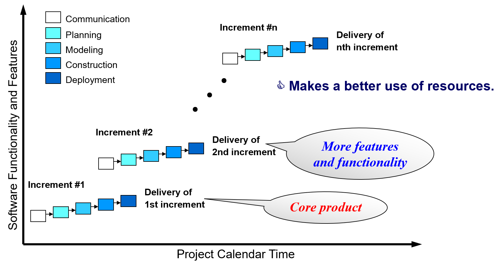
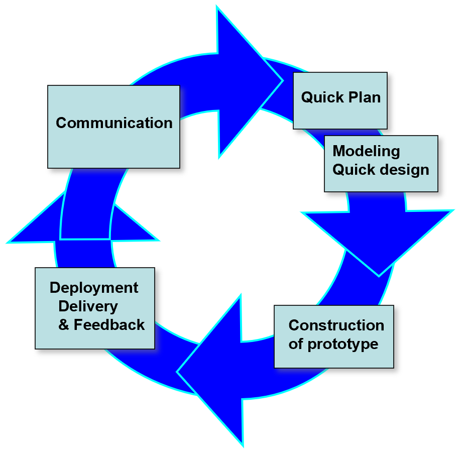
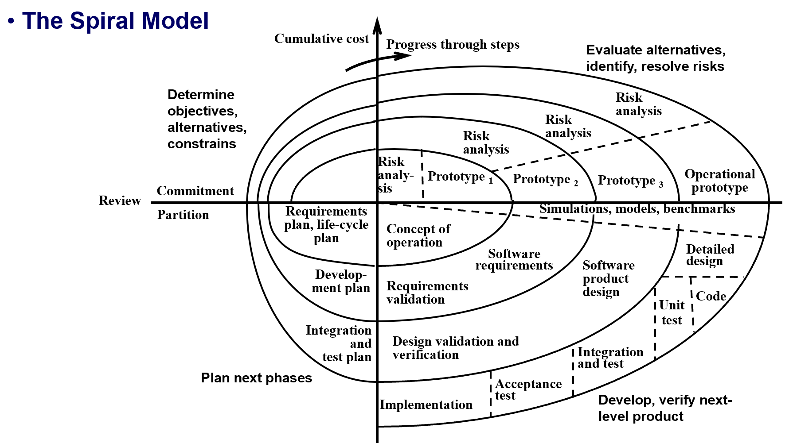
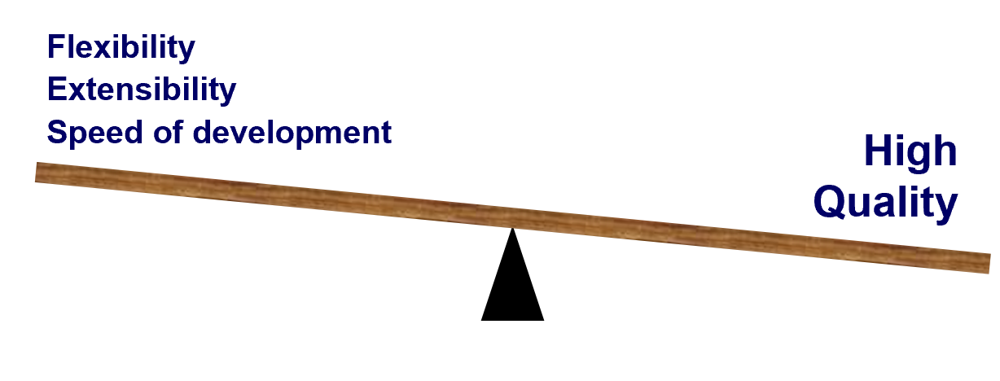

# Chapter 4 | Process Models

## Prescriptive Models

Prescriptive process models advocate an **orderly approach** to software engineering。

1. 如果规范式过程模型强调结构和秩序，那么它是否不适合以变化为常态的软件世界？
2. 如果我们拒绝传统过程模型（及其隐含的秩序），用更灵活但不够结构化的方式替代，是否会导致软件工作难以实现协调与一致？

规范式过程模型（Prescriptive Process Models）主张用结构化、规范化的方法来组织软件开发活动，强调流程的秩序和可控性。这有助于团队协作、项目管理和质量保证，但也可能限制对变化的快速响应。如何在规范与灵活之间取得平衡，是软件工程的重要课题。

---

### The Waterfall Model

瀑布模型（Waterfall Model），又称经典生命周期（Classic Life Cycle），提出了一种顺序的软件开发方法：

1. **Communication**：项目启动、需求收集
2. **Planning**：估算、进度安排与跟踪
3. **Modeling**：分析与设计
4. **Construction**：编码与测试
5. **Deployment**：交付、支持与反馈

特点与局限：

- 实际项目很少完全按顺序流动，需求常常会变化。
- 客户通常难以一次性明确所有需求。
- 可用版本往往要到项目后期才出现，反馈周期长。

---

### The V-model

V模型是瀑布模型的一个变体，强调开发与测试活动的对应关系：

1. **Requirement modeling** ↔ **Acceptance testing**
2. **Architectural design** ↔ **System testing**
3. **Component design** ↔ **Integration testing**
4. **Code generation** ↔ **Unit testing**

V模型左侧为开发活动，右侧为测试活动，底部为可执行软件。每个开发阶段都对应一个测试阶段，保证需求、设计、实现与测试紧密结合。

---

### Incremental Process Models

增量模型（Incremental Model）将软件开发过程分为多个增量，每个增量都包含沟通、计划、建模、构建和部署。先交付核心产品，后续增量逐步增加功能和特性。

优点：
- 更好地利用资源，快速交付部分可用产品，后续持续完善。
- 适合需求不完全明确、需快速响应用户需求的场景。

---

### Evolutionary Process Models

原型开发模型（Prototyping Model）以快速沟通、建模、构建原型为核心，用户可直观反馈，开发团队据此不断完善需求和设计。

优点：
- 适合需求不明确、用户难以描述细节的项目。
- 原型必须最终被丢弃，不能直接作为最终产品。

---

### Spiral Model

螺旋模型（Spiral Model）结合原型和瀑布模型的优点，强调风险分析和迭代开发。每一圈都包括目标确定、风险评估、开发与测试、用户反馈。

优点：
- 适合大型、复杂、风险高的项目。
- 快速开发、持续完善，风险可控。

---

### Concurrent Development Model

并发开发模型（Concurrent Development Model）允许多个活动并行进行，定义活动状态转移，适合客户端/服务器等复杂系统。

优点：
- 提升开发速度和灵活性，适应复杂项目需求。
- 活动以网络方式组织，而非线性顺序。

---

## Specialized Process Models

1. **Component based development**：以复用为目标的软件开发过程，适合需要大量组件复用的项目。
2. **Formal methods**：强调需求的数学化规范，适合对安全性、可靠性要求极高的系统。
3. **Aspect-Oriented Software Development**：面向切面开发，提供定义、规范、设计和构建切面的过程和方法。

---

## The Unified Process

统一过程（Unified Process）是一种用例驱动（use-case driven）、以体系结构为中心（architecture-centric）、迭代和增量式的软件开发过程模型，与UML紧密结合。

主要阶段（Phases）：

1. **Inception**：沟通，确定项目目标、范围和初步用例。
2. **Elaboration**：计划与建模，细化需求、分析、架构设计、风险评估。
3. **Construction**：构建，编码、测试、集成。
4. **Transition**：部署，交付软件增量、用户反馈、测试报告。

每个阶段都需产出关键文档和成果，如愿景文档、用例模型、设计模型、测试计划、用户反馈等。

---

## Personal and Team Process Models

### Personal Software Process (PSP)

PSP（个人软件过程）强调个人工程师的规范化开发流程，推荐五个基本活动：

1. Planning（计划）
2. High-level design（高层设计）
3. High-level design review（高层设计复审）
4. Development（开发实现）
5. Postmortem（事后分析）

强调工程师应尽早发现并理解错误类型。

### Team Software Process (TSP)

TSP（团队软件过程）以团队为单位，项目通过脚本（script）启动，团队自我管理，鼓励度量和持续改进。

- 每个项目用脚本定义任务并启动
- 团队自我驱动
- 鼓励度量与分析，持续提升团队过程

---